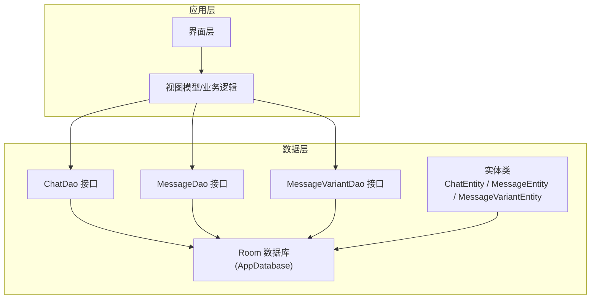
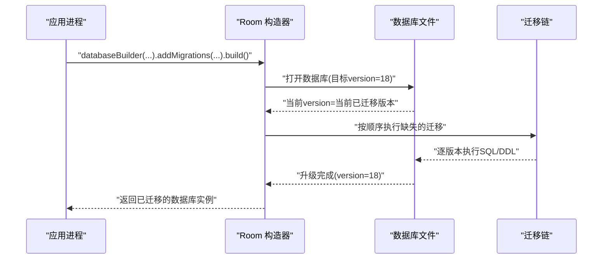
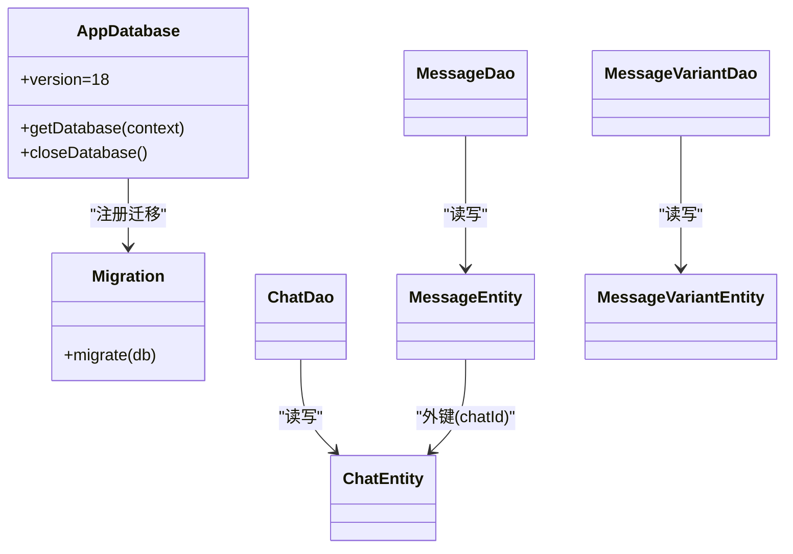
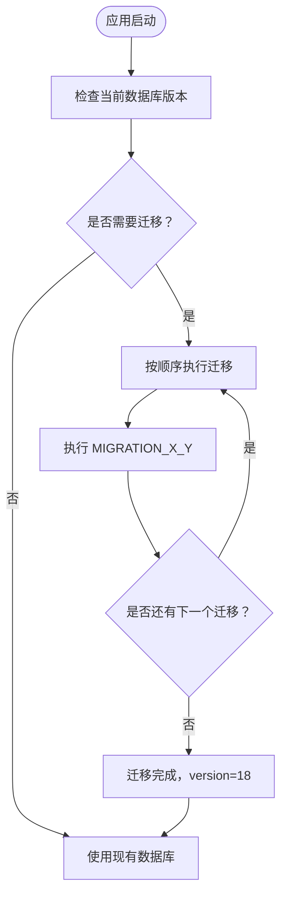

# 数据迁移策略

<cite>
**本文引用的文件**
- [AppDatabase.kt](file://app/src/main/java/com/ai/assistance/operit/data/db/AppDatabase.kt)
- [ChatEntity.kt](file://app/src/main/java/com/ai/assistance/operit/data/model/ChatEntity.kt)
- [MessageEntity.kt](file://app/src/main/java/com/ai/assistance/operit/data/model/MessageEntity.kt)
- [MessageVariantEntity.kt](file://app/src/main/java/com/ai/assistance/operit/data/model/MessageVariantEntity.kt)
- [ChatDao.kt](file://app/src/main/java/com/ai/assistance/operit/data/dao/ChatDao.kt)
- [MessageDao.kt](file://app/src/main/java/com/ai/assistance/operit/data/dao/MessageDao.kt)
- [MessageVariantDao.kt](file://app/src/main/java/com/ai/assistance/operit/data/dao/MessageVariantDao.kt)
- [data_storage_system_design.md](file://data_storage_system_design.md)
</cite>

## 目录
1. [简介](#简介)
2. [项目结构](#项目结构)
3. [核心组件](#核心组件)
4. [架构总览](#架构总览)
5. [详细组件分析](#详细组件分析)
6. [依赖分析](#依赖分析)
7. [性能考量](#性能考量)
8. [故障排查指南](#故障排查指南)
9. [结论](#结论)
10. [附录](#附录)

## 简介
本文件系统化梳理 Operit 的数据库版本管理与迁移策略，覆盖版本号递增规则、迁移脚本设计原则、向后兼容性保障、各版本迁移实现细节（MIGRATION_1_2 至 MIGRATION_17_18）、迁移顺序与错误处理、数据完整性（事务与回滚）、增量与全量迁移选择、迁移监控与日志、迁移后验证机制，以及面向开发者的扩展建议（可扩展方案、大规模数据迁移、零停机迁移）。

## 项目结构
Operit 使用 Android Room 作为本地数据库持久化方案，数据库版本由注解中的 version 字段统一管理；迁移逻辑通过 Migration 对象逐版本定义，并在数据库构建阶段集中注册。

图表来源
- [AppDatabase.kt:17-21](file://app/src/main/java/com/ai/assistance/operit/data/db/AppDatabase.kt#L17-L21)
- [ChatDao.kt:14](file://app/src/main/java/com/ai/assistance/operit/data/dao/ChatDao.kt#L14)
- [MessageDao.kt:12](file://app/src/main/java/com/ai/assistance/operit/data/dao/MessageDao.kt#L12)
- [MessageVariantDao.kt:10](file://app/src/main/java/com/ai/assistance/operit/data/dao/MessageVariantDao.kt#L10)

章节来源
- [AppDatabase.kt:17-21](file://app/src/main/java/com/ai/assistance/operit/data/db/AppDatabase.kt#L17-L21)
- [ChatDao.kt:14](file://app/src/main/java/com/ai/assistance/operit/data/dao/ChatDao.kt#L14)
- [MessageDao.kt:12](file://app/src/main/java/com/ai/assistance/operit/data/dao/MessageDao.kt#L12)
- [MessageVariantDao.kt:10](file://app/src/main/java/com/ai/assistance/operit/data/dao/MessageVariantDao.kt#L10)

## 核心组件
- 数据库版本与入口
  - 版本号：当前版本为 18（version = 18），新增迁移至 MIGRATION_17_18。
  - 构建入口：通过 Room.databaseBuilder 创建数据库实例，并集中注册所有迁移对象。
- 实体与索引
  - ChatEntity：聊天元数据，包含多列扩展字段（如 workspace、workspaceEnv、characterGroupId、locked 等）。
  - MessageEntity：消息实体，含 token、耗时、变体索引、显示模式、收藏标记等字段，并定义复合索引以优化查询。
  - MessageVariantEntity：消息变体表，支持同一消息的时间点生成多个变体，具备唯一约束与复合索引。
- DAO 层
  - ChatDao：提供聊天的增删改查、分组/角色卡绑定、统计查询等。
  - MessageDao：提供消息的范围查询、预览、复制、变体索引更新、收藏标记更新等。
  - MessageVariantDao：提供变体的查询、插入、复制、删除等。

章节来源
- [AppDatabase.kt:19](file://app/src/main/java/com/ai/assistance/operit/data/db/AppDatabase.kt#L19)
- [AppDatabase.kt:293-317](file://app/src/main/java/com/ai/assistance/operit/data/db/AppDatabase.kt#L293-L317)
- [ChatEntity.kt:10-27](file://app/src/main/java/com/ai/assistance/operit/data/model/ChatEntity.kt#L10-L27)
- [MessageEntity.kt:9-20](file://app/src/main/java/com/ai/assistance/operit/data/model/MessageEntity.kt#L9-L20)
- [MessageVariantEntity.kt:8-22](file://app/src/main/java/com/ai/assistance/operit/data/model/MessageVariantEntity.kt#L8-L22)
- [ChatDao.kt:16-284](file://app/src/main/java/com/ai/assistance/operit/data/dao/ChatDao.kt#L16-L284)
- [MessageDao.kt:18-284](file://app/src/main/java/com/ai/assistance/operit/data/dao/MessageDao.kt#L18-L284)
- [MessageVariantDao.kt:12-111](file://app/src/main/java/com/ai/assistance/operit/data/dao/MessageVariantDao.kt#L12-L111)

## 架构总览
Room 在应用启动时根据目标版本自动执行必要的迁移，确保 Schema 与运行时一致。迁移注册顺序严格遵循版本号递增，任一迁移失败将阻止数据库升级。

图表来源
- [AppDatabase.kt:293-317](file://app/src/main/java/com/ai/assistance/operit/data/db/AppDatabase.kt#L293-L317)

章节来源
- [AppDatabase.kt:293-317](file://app/src/main/java/com/ai/assistance/operit/data/db/AppDatabase.kt#L293-L317)

## 详细组件分析

### 迁移版本与顺序
- 版本序列：1→2→3→...→18，共 18 个版本。
- 注册顺序：在构建数据库时，按版本号升序依次注册迁移对象，确保链式执行。
- 关键迁移要点：
  - MIGRATION_1_2：初始化 chats/messages 表及基础索引。
  - MIGRATION_2_3 → MIGRATION_9_10：逐步增加列（如 group、displayOrder、workspace、currentWindowSize、locked 等），部分迁移采用 try/catch 防止重复执行导致异常。
  - MIGRATION_10_11 → MIGRATION_12_13：继续扩展列，部分迁移对已有列进行批量赋默认值。
  - MIGRATION_13_14：清理废弃表 problem_records。
  - MIGRATION_14_15：引入 message_variants 表及索引，同时在 messages 表新增变体相关列。
  - MIGRATION_15_16：新增 displayMode 列并设置默认值。
  - MIGRATION_16_17：为 messages 增加复合索引以优化查询。
  - MIGRATION_17_18：新增 isFavorite 列。

章节来源
- [AppDatabase.kt:36-74](file://app/src/main/java/com/ai/assistance/operit/data/db/AppDatabase.kt#L36-L74)
- [AppDatabase.kt:76-87](file://app/src/main/java/com/ai/assistance/operit/data/db/AppDatabase.kt#L76-L87)
- [AppDatabase.kt:89-100](file://app/src/main/java/com/ai/assistance/operit/data/db/AppDatabase.kt#L89-L100)
- [AppDatabase.kt:102-130](file://app/src/main/java/com/ai/assistance/operit/data/db/AppDatabase.kt#L102-L130)
- [AppDatabase.kt:132-137](file://app/src/main/java/com/ai/assistance/operit/data/db/AppDatabase.kt#L132-L137)
- [AppDatabase.kt:139-172](file://app/src/main/java/com/ai/assistance/operit/data/db/AppDatabase.kt#L139-L172)
- [AppDatabase.kt:175-182](file://app/src/main/java/com/ai/assistance/operit/data/db/AppDatabase.kt#L175-L182)
- [AppDatabase.kt:184-191](file://app/src/main/java/com/ai/assistance/operit/data/db/AppDatabase.kt#L184-L191)
- [AppDatabase.kt:193-200](file://app/src/main/java/com/ai/assistance/operit/data/db/AppDatabase.kt#L193-L200)
- [AppDatabase.kt:202-209](file://app/src/main/java/com/ai/assistance/operit/data/db/AppDatabase.kt#L202-L209)
- [AppDatabase.kt:211-221](file://app/src/main/java/com/ai/assistance/operit/data/db/AppDatabase.kt#L211-L221)
- [AppDatabase.kt:223-230](file://app/src/main/java/com/ai/assistance/operit/data/db/AppDatabase.kt#L223-L230)
- [AppDatabase.kt:232-243](file://app/src/main/java/com/ai/assistance/operit/data/db/AppDatabase.kt#L232-L243)
- [AppDatabase.kt:245-252](file://app/src/main/java/com/ai/assistance/operit/data/db/AppDatabase.kt#L245-L252)
- [AppDatabase.kt:254-263](file://app/src/main/java/com/ai/assistance/operit/data/db/AppDatabase.kt#L254-L263)
- [AppDatabase.kt:265-274](file://app/src/main/java/com/ai/assistance/operit/data/db/AppDatabase.kt#L265-L274)
- [AppDatabase.kt:276-287](file://app/src/main/java/com/ai/assistance/operit/data/db/AppDatabase.kt#L276-L287)
- [AppDatabase.kt:299-316](file://app/src/main/java/com/ai/assistance/operit/data/db/AppDatabase.kt#L299-L316)

### 迁移实现与设计原则
- 设计原则
  - 单步迁移：每个 Migration 只做“一步之功”，避免跨版本复杂度叠加。
  - 幂等性：对可能重复执行的 DDL 使用 try/catch 或条件判断，防止重复添加列报错。
  - 默认值：新增列时提供合理默认值，保证旧数据能安全过渡。
  - 索引优化：在引入新查询路径时同步建立索引，降低查询成本。
  - 清理策略：废弃表/列在迁移中及时清理，减少存储冗余。
- 典型实现模式
  - 新增列：ALTER TABLE ... ADD COLUMN ... DEFAULT ...
  - 批量赋默认值：UPDATE ... SET ...
  - 引入新表：CREATE TABLE ...（含外键与索引）
  - 索引创建：CREATE INDEX IF NOT EXISTS ...

章节来源
- [AppDatabase.kt:78-87](file://app/src/main/java/com/ai/assistance/operit/data/db/AppDatabase.kt#L78-L87)
- [AppDatabase.kt:105-112](file://app/src/main/java/com/ai/assistance/operit/data/db/AppDatabase.kt#L105-L112)
- [AppDatabase.kt:142-144](file://app/src/main/java/com/ai/assistance/operit/data/db/AppDatabase.kt#L142-L144)
- [AppDatabase.kt:166-171](file://app/src/main/java/com/ai/assistance/operit/data/db/AppDatabase.kt#L166-L171)
- [AppDatabase.kt:188](file://app/src/main/java/com/ai/assistance/operit/data/db/AppDatabase.kt#L188)

### 数据完整性与事务处理
- Room 迁移在单个事务内执行，若任一 SQL 抛出异常，整个迁移失败，数据库不会升级到目标版本，从而避免半成品 Schema 导致的数据不一致。
- 外键与级联删除：messages 表对 chats 的外键删除策略为 CASCADE，确保删除聊天时级联清理消息。
- 唯一约束：message_variants 的 (chatId, messageTimestamp, variantIndex) 为唯一索引，保证同一消息时间点的变体唯一性。

章节来源
- [MessageEntity.kt:11-18](file://app/src/main/java/com/ai/assistance/operit/data/model/MessageEntity.kt#L11-L18)
- [MessageVariantEntity.kt:18-21](file://app/src/main/java/com/ai/assistance/operit/data/model/MessageVariantEntity.kt#L18-L21)

### 错误处理与回滚策略
- 迁移失败：Room 会抛出异常并终止数据库升级，应用需捕获并提示用户或回退到上一个稳定版本。
- 重复执行防护：对可能重复执行的迁移（如 ALTER TABLE ADD COLUMN）使用 try/catch 包裹，避免重复添加列导致异常。
- 回滚策略：Room 不提供自动回滚；建议在迁移前备份数据库文件，或在业务层记录迁移状态，必要时引导用户重装应用以恢复初始 Schema。

章节来源
- [AppDatabase.kt:81-86](file://app/src/main/java/com/ai/assistance/operit/data/db/AppDatabase.kt#L81-L86)
- [AppDatabase.kt:105-112](file://app/src/main/java/com/ai/assistance/operit/data/db/AppDatabase.kt#L105-L112)
- [AppDatabase.kt:237-242](file://app/src/main/java/com/ai/assistance/operit/data/db/AppDatabase.kt#L237-L242)
- [AppDatabase.kt:281-286](file://app/src/main/java/com/ai/assistance/operit/data/db/AppDatabase.kt#L281-L286)

### 增量迁移与全量迁移选择
- 增量迁移：适用于小步快跑，每次只做必要改动，风险低、可控性强。Operit 已采用此策略，按版本号顺序逐次迁移。
- 全量迁移：当历史版本跨度极大或 Schema 非常陈旧时，可考虑一次性重建表结构并迁移数据，但需谨慎评估停机与数据丢失风险。
- 成本评估与性能影响
  - 增量迁移：SQL 执行次数多，但单次开销小；适合在线服务。
  - 全量迁移：单次成本高，但整体迁移更快；适合离线或可接受短暂停机场景。

章节来源
- [AppDatabase.kt:299-316](file://app/src/main/java/com/ai/assistance/operit/data/db/AppDatabase.kt#L299-L316)

### 迁移监控与日志记录
- 迁移进度：Room 未直接暴露迁移进度回调；可在迁移前后记录时间戳与版本号，结合应用日志追踪迁移耗时。
- 错误诊断：捕获 Room 迁移异常，记录 SQL 语句、目标版本、异常堆栈，便于定位问题。
- 性能统计：统计各迁移耗时、受影响行数（可通过 DAO 查询统计），形成迁移性能报告。

章节来源
- [data_storage_system_design.md:527](file://data_storage_system_design.md#L527)

### 迁移后数据验证
- 结构一致性：校验目标版本的表结构与索引是否存在，列类型与默认值符合预期。
- 数据一致性：核对关键字段（如 displayOrder、workspace、characterGroupId、locked 等）在升级后是否正确保留与赋值。
- 查询验证：针对高频查询（如按 chatId 查询消息、按时间窗口查询、变体索引查询）执行回归测试，确保索引与查询路径正常。
- 用户体验保障：在迁移完成后进行一次冷启动测试，确认 UI 展示与功能无异常。

章节来源
- [ChatDao.kt:16-284](file://app/src/main/java/com/ai/assistance/operit/data/dao/ChatDao.kt#L16-L284)
- [MessageDao.kt:18-284](file://app/src/main/java/com/ai/assistance/operit/data/dao/MessageDao.kt#L18-L284)
- [MessageVariantDao.kt:12-111](file://app/src/main/java/com/ai/assistance/operit/data/dao/MessageVariantDao.kt#L12-L111)

### 开发者扩展指导
- 可扩展的迁移方案
  - 采用“版本+描述”的命名规范，确保迁移意图清晰。
  - 将复杂迁移拆分为多个小迁移，便于测试与回滚。
  - 在迁移中加入“幂等检查”与“默认值回填”，提升健壮性。
- 大规模数据迁移
  - 分批处理：对大表的批量更新（如 UPDATE ... SET ... WHERE ...）分页执行，避免长时间锁表。
  - 索引策略：在大批量导入前禁用非必要索引，导入后再重建索引。
- 零停机迁移
  - 通过双写与读取兼容策略，在迁移期间允许新旧 Schema 并存，逐步切换。
  - 使用只读副本或导出导入方式，尽量缩短迁移窗口。

章节来源
- [AppDatabase.kt:78-87](file://app/src/main/java/com/ai/assistance/operit/data/db/AppDatabase.kt#L78-L87)
- [AppDatabase.kt:105-112](file://app/src/main/java/com/ai/assistance/operit/data/db/AppDatabase.kt#L105-L112)
- [AppDatabase.kt:142-144](file://app/src/main/java/com/ai/assistance/operit/data/db/AppDatabase.kt#L142-L144)
- [AppDatabase.kt:166-171](file://app/src/main/java/com/ai/assistance/operit/data/db/AppDatabase.kt#L166-L171)

## 依赖分析
- 组件耦合
  - AppDatabase 依赖 Migration 对象集合，负责集中注册与执行。
  - DAO 层依赖实体类与 Room 注解，查询路径与索引直接影响迁移后性能。
  - 外键关系（messages.chatId → chats.id）在迁移中必须保持一致，否则会导致迁移失败或数据不一致。
- 潜在循环依赖
  - 当前结构为单向依赖（DAO → Entity → Room），未发现循环依赖。
- 外部依赖
  - Room 与 SQLite 提供迁移与事务能力；应用层无其他外部数据库依赖。

图表来源
- [AppDatabase.kt:17-21](file://app/src/main/java/com/ai/assistance/operit/data/db/AppDatabase.kt#L17-L21)
- [ChatDao.kt:14](file://app/src/main/java/com/ai/assistance/operit/data/dao/ChatDao.kt#L14)
- [MessageDao.kt:12](file://app/src/main/java/com/ai/assistance/operit/data/dao/MessageDao.kt#L12)
- [MessageVariantDao.kt:10](file://app/src/main/java/com/ai/assistance/operit/data/dao/MessageVariantDao.kt#L10)
- [MessageEntity.kt:11-18](file://app/src/main/java/com/ai/assistance/operit/data/model/MessageEntity.kt#L11-L18)

章节来源
- [AppDatabase.kt:17-21](file://app/src/main/java/com/ai/assistance/operit/data/db/AppDatabase.kt#L17-L21)
- [ChatDao.kt:14](file://app/src/main/java/com/ai/assistance/operit/data/dao/ChatDao.kt#L14)
- [MessageDao.kt:12](file://app/src/main/java/com/ai/assistance/operit/data/dao/MessageDao.kt#L12)
- [MessageVariantDao.kt:10](file://app/src/main/java/com/ai/assistance/operit/data/dao/MessageVariantDao.kt#L10)
- [MessageEntity.kt:11-18](file://app/src/main/java/com/ai/assistance/operit/data/model/MessageEntity.kt#L11-L18)

## 性能考量
- 索引优化：迁移中新增索引（如 messages(chatId, timestamp)、message_variants(chatId, messageTimestamp)）显著提升查询性能。
- 查询路径：MessageDao 与 MessageVariantDao 的查询广泛依赖上述索引，迁移后应进行基准测试。
- 写入路径：批量插入与变体复制操作（INSERT ... SELECT）在大表上需关注锁竞争与 WAL 模式的影响。

章节来源
- [MessageEntity.kt:19](file://app/src/main/java/com/ai/assistance/operit/data/model/MessageEntity.kt#L19)
- [MessageVariantEntity.kt:18-21](file://app/src/main/java/com/ai/assistance/operit/data/model/MessageVariantEntity.kt#L18-L21)
- [MessageDao.kt:18-284](file://app/src/main/java/com/ai/assistance/operit/data/dao/MessageDao.kt#L18-L284)
- [MessageVariantDao.kt:12-111](file://app/src/main/java/com/ai/assistance/operit/data/dao/MessageVariantDao.kt#L12-L111)

## 故障排查指南
- 常见问题
  - 重复添加列：使用 try/catch 包裹 ALTER TABLE ADD COLUMN，避免重复执行报错。
  - 缺失外键/索引：迁移后检查表结构与索引是否存在，确保查询路径正常。
  - 迁移超时/卡顿：对大表批量更新与重建索引进行分批处理。
- 诊断步骤
  - 记录迁移开始/结束时间与版本号。
  - 捕获异常并输出 SQL 与上下文信息。
  - 校验关键字段与索引是否完整。
- 回退策略
  - 备份数据库文件，必要时回滚到上一个稳定版本。
  - 若无法自动回滚，引导用户卸载重装应用以恢复初始 Schema。

章节来源
- [AppDatabase.kt:81-86](file://app/src/main/java/com/ai/assistance/operit/data/db/AppDatabase.kt#L81-L86)
- [AppDatabase.kt:105-112](file://app/src/main/java/com/ai/assistance/operit/data/db/AppDatabase.kt#L105-L112)
- [AppDatabase.kt:237-242](file://app/src/main/java/com/ai/assistance/operit/data/db/AppDatabase.kt#L237-L242)
- [AppDatabase.kt:281-286](file://app/src/main/java/com/ai/assistance/operit/data/db/AppDatabase.kt#L281-L286)

## 结论
Operit 的数据迁移策略以 Room 迁移为核心，采用“版本递增 + 增量迁移 + 幂等防护”的设计，确保 Schema 升级的安全与可控。通过在迁移中引入索引、默认值与清理策略，有效保障了迁移后的数据完整性与查询性能。对于未来扩展，建议继续坚持小步快跑、可观测与可回退的原则，并在大规模迁移场景中引入分批与零停机策略。

## 附录
- 迁移流程图（概念示意）

