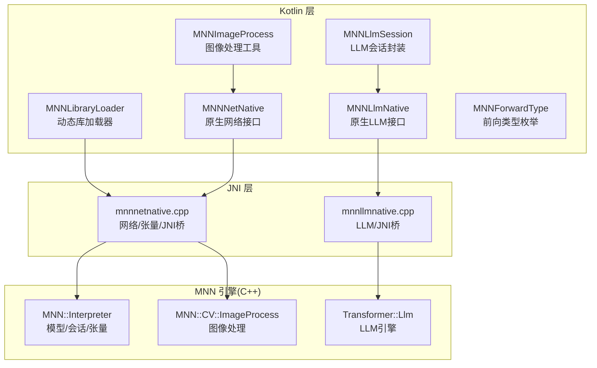
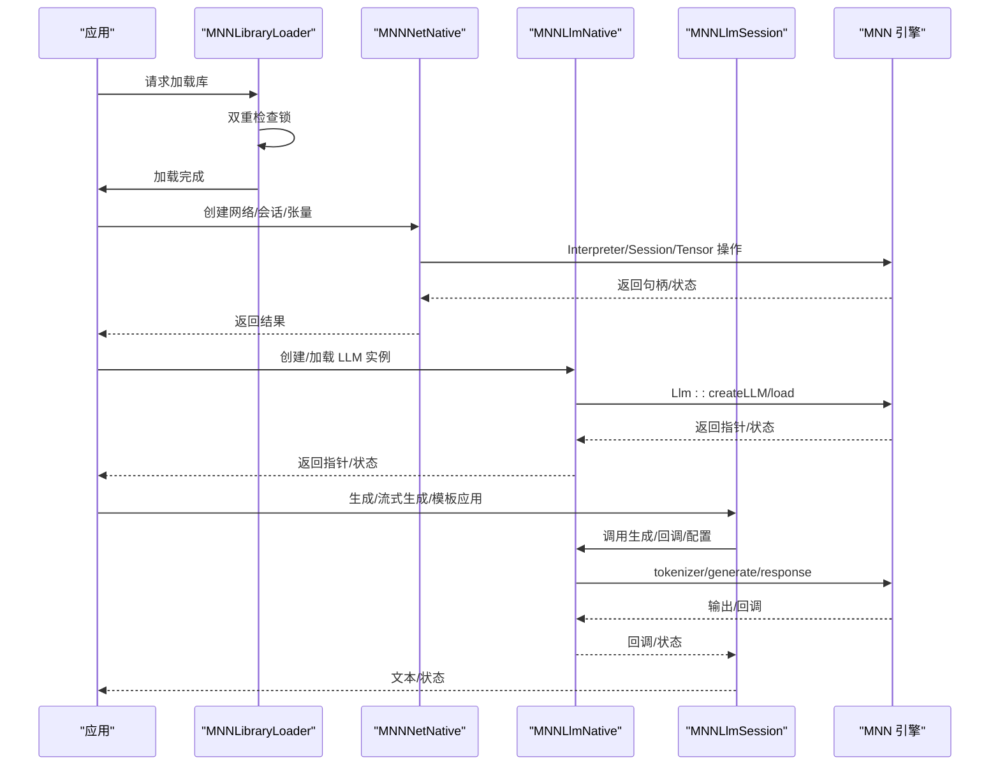
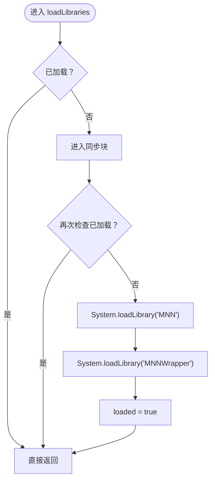
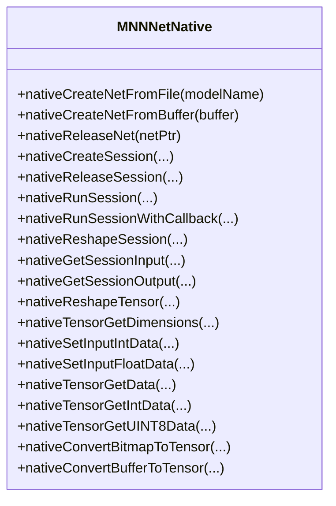
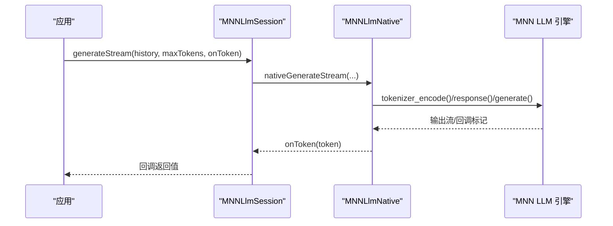
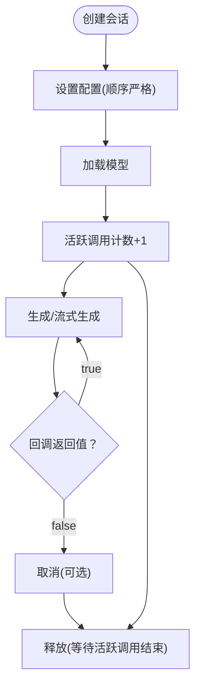
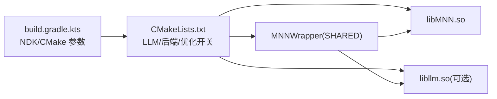

# MNN 模型集成

<cite>
**本文引用的文件**
- [MNNLibraryLoader.kt](file://mnn/src/main/java/com/ai/assistance/mnn/MNNLibraryLoader.kt)
- [MNNNetNative.kt](file://mnn/src/main/java/com/ai/assistance/mnn/MNNNetNative.kt)
- [MNNLlmNative.kt](file://mnn/src/main/java/com/ai/assistance/mnn/MNNLlmNative.kt)
- [MNNLlmSession.kt](file://mnn/src/main/java/com/ai/assistance/mnn/MNNLlmSession.kt)
- [MNNLlmContextInfo.kt](file://mnn/src/main/java/com/ai/assistance/mnn/MNNLlmContextInfo.kt)
- [MNNImageProcess.kt](file://mnn/src/main/java/com/ai/assistance/mnn/MNNImageProcess.kt)
- [MNNForwardType.kt](file://mnn/src/main/java/com/ai/assistance/mnn/MNNForwardType.kt)
- [mnnnetnative.cpp](file://mnn/src/main/cpp/mnnnetnative.cpp)
- [mnnllmnative.cpp](file://mnn/src/main/cpp/mnnllmnative.cpp)
- [CMakeLists.txt](file://mnn/CMakeLists.txt)
- [build.gradle.kts](file://mnn/build.gradle.kts)
- [consumer-rules.pro](file://mnn/consumer-rules.pro)
- [mnn_toolcall_research.md](file://docs/mnn_toolcall_research.md)
</cite>

## 目录
1. [简介](#简介)
2. [项目结构](#项目结构)
3. [核心组件](#核心组件)
4. [架构总览](#架构总览)
5. [详细组件分析](#详细组件分析)
6. [依赖关系分析](#依赖关系分析)
7. [性能考量](#性能考量)
8. [故障排查指南](#故障排查指南)
9. [结论](#结论)
10. [附录](#附录)

## 简介
本技术文档围绕 Operit 项目中的 MNN 模型集成子系统，系统性解析以下关键主题：
- 动态库加载与线程安全：MNNLibraryLoader 的实现机制与初始化流程
- 网络与会话管理：MNNNetNative 与 MNNLlmSession 的架构设计、网络实例管理、LLM 会话处理、内存分配策略
- JNI 桥接细节：C++ 到 Kotlin 的数据转换、回调机制、异常处理
- 推理流程：模型文件格式、权重加载、前向传播过程
- 性能优化：内存池管理、批处理优化、硬件加速利用
- 使用示例：如何集成新模型、调试推理问题、监控内存使用

## 项目结构
MNN 集成模块位于 mnn 子工程，采用“Kotlin 接口层 + JNI 包装 + C++ MNN 引擎”的分层设计：
- Kotlin 层：对外暴露易用 API（加载器、网络、LLM 会话、图像处理、前向类型枚举）
- JNI 层：通过 native 方法桥接 Kotlin 与 C++，负责数据转换与回调转发
- C++ 层：基于 MNN 引擎实现模型加载、会话创建、张量操作、图像处理、LLM 推理与模板应用

图表来源
- [MNNLibraryLoader.kt:1-54](file://mnn/src/main/java/com/ai/assistance/mnn/MNNLibraryLoader.kt#L1-L54)
- [MNNNetNative.kt:1-109](file://mnn/src/main/java/com/ai/assistance/mnn/MNNNetNative.kt#L1-L109)
- [MNNLlmNative.kt:1-215](file://mnn/src/main/java/com/ai/assistance/mnn/MNNLlmNative.kt#L1-L215)
- [MNNLlmSession.kt:1-433](file://mnn/src/main/java/com/ai/assistance/mnn/MNNLlmSession.kt#L1-L433)
- [MNNImageProcess.kt:1-151](file://mnn/src/main/java/com/ai/assistance/mnn/MNNImageProcess.kt#L1-L151)
- [MNNForwardType.kt:1-34](file://mnn/src/main/java/com/ai/assistance/mnn/MNNForwardType.kt#L1-L34)
- [mnnnetnative.cpp:1-451](file://mnn/src/main/cpp/mnnnetnative.cpp#L1-L451)
- [mnnllmnative.cpp:1-800](file://mnn/src/main/cpp/mnnllmnative.cpp#L1-L800)

章节来源
- [MNNLibraryLoader.kt:1-54](file://mnn/src/main/java/com/ai/assistance/mnn/MNNLibraryLoader.kt#L1-L54)
- [MNNNetNative.kt:1-109](file://mnn/src/main/java/com/ai/assistance/mnn/MNNNetNative.kt#L1-L109)
- [MNNLlmNative.kt:1-215](file://mnn/src/main/java/com/ai/assistance/mnn/MNNLlmNative.kt#L1-L215)
- [MNNLlmSession.kt:1-433](file://mnn/src/main/java/com/ai/assistance/mnn/MNNLlmSession.kt#L1-L433)
- [MNNImageProcess.kt:1-151](file://mnn/src/main/java/com/ai/assistance/mnn/MNNImageProcess.kt#L1-L151)
- [MNNForwardType.kt:1-34](file://mnn/src/main/java/com/ai/assistance/mnn/MNNForwardType.kt#L1-L34)
- [mnnnetnative.cpp:1-451](file://mnn/src/main/cpp/mnnnetnative.cpp#L1-L451)
- [mnnllmnative.cpp:1-800](file://mnn/src/main/cpp/mnnllmnative.cpp#L1-L800)

## 核心组件
- MNNLibraryLoader：确保 MNN 与 MNNWrapper 动态库仅加载一次，提供线程安全的加载与状态查询
- MNNNetNative：提供模型创建、会话管理、张量操作、图像处理等 JNI 接口
- MNNLlmNative：提供 LLM 实例创建、加载、配置、令牌化、生成、回调、音频回调等 JNI 接口
- MNNLlmSession：面向业务的 LLM 会话封装，提供线程安全的并发控制、生命周期管理、流式生成、模板应用、上下文统计、配置热更新等
- MNNImageProcess：Kotlin 层图像处理工具，封装图像格式、滤波器、边界处理、均值/归一化参数与矩阵变换
- MNNForwardType：前向类型枚举，统一 CPU/GPU/OpenCL/OpenGLES/Vulkan 等后端类型

章节来源
- [MNNLibraryLoader.kt:1-54](file://mnn/src/main/java/com/ai/assistance/mnn/MNNLibraryLoader.kt#L1-L54)
- [MNNNetNative.kt:1-109](file://mnn/src/main/java/com/ai/assistance/mnn/MNNNetNative.kt#L1-L109)
- [MNNLlmNative.kt:1-215](file://mnn/src/main/java/com/ai/assistance/mnn/MNNLlmNative.kt#L1-L215)
- [MNNLlmSession.kt:1-433](file://mnn/src/main/java/com/ai/assistance/mnn/MNNLlmSession.kt#L1-L433)
- [MNNImageProcess.kt:1-151](file://mnn/src/main/java/com/ai/assistance/mnn/MNNImageProcess.kt#L1-L151)
- [MNNForwardType.kt:1-34](file://mnn/src/main/java/com/ai/assistance/mnn/MNNForwardType.kt#L1-L34)

## 架构总览
MNN 集成采用“Kotlin API + JNI + MNN 引擎”的三层架构。Kotlin 层负责业务语义与线程安全；JNI 层负责数据类型转换与回调桥接；C++ 层负责高性能计算与引擎能力。

图表来源
- [MNNLibraryLoader.kt:21-46](file://mnn/src/main/java/com/ai/assistance/mnn/MNNLibraryLoader.kt#L21-L46)
- [MNNNetNative.kt:16-106](file://mnn/src/main/java/com/ai/assistance/mnn/MNNNetNative.kt#L16-L106)
- [MNNLlmNative.kt:19-192](file://mnn/src/main/java/com/ai/assistance/mnn/MNNLlmNative.kt#L19-L192)
- [MNNLlmSession.kt:28-86](file://mnn/src/main/java/com/ai/assistance/mnn/MNNLlmSession.kt#L28-L86)
- [mnnnetnative.cpp:17-197](file://mnn/src/main/cpp/mnnnetnative.cpp#L17-L197)
- [mnnllmnative.cpp:401-488](file://mnn/src/main/cpp/mnnllmnative.cpp#L401-L488)

## 详细组件分析

### MNNLibraryLoader：动态库加载与线程安全
- 初始化时机：Kotlin 层对象在初始化时即触发库加载
- 双重检查锁：使用 volatile + synchronized 确保多线程下仅加载一次
- 加载顺序：先加载 MNN，再加载 MNNWrapper，日志记录加载状态
- 异常处理：捕获 UnsatisfiedLinkError 并向上抛出，便于上层感知

图表来源
- [MNNLibraryLoader.kt:21-46](file://mnn/src/main/java/com/ai/assistance/mnn/MNNLibraryLoader.kt#L21-L46)

章节来源
- [MNNLibraryLoader.kt:1-54](file://mnn/src/main/java/com/ai/assistance/mnn/MNNLibraryLoader.kt#L1-L54)

### MNNNetNative：网络与张量操作
- 网络创建：支持从文件路径与字节数组创建 Interpreter
- 会话管理：创建/释放会话，reshape 会话，获取输入/输出张量
- 张量操作：reshape 张量，设置/读取整型/浮点/UINT8 数据
- 图像处理：支持 Bitmap 与 ByteBuffer 转换为张量，支持均值/归一化/滤波/边界/仿射矩阵

图表来源
- [MNNNetNative.kt:16-106](file://mnn/src/main/java/com/ai/assistance/mnn/MNNNetNative.kt#L16-L106)
- [mnnnetnative.cpp:17-451](file://mnn/src/main/cpp/mnnnetnative.cpp#L17-L451)

章节来源
- [MNNNetNative.kt:1-109](file://mnn/src/main/java/com/ai/assistance/mnn/MNNNetNative.kt#L1-L109)
- [mnnnetnative.cpp:1-451](file://mnn/src/main/cpp/mnnnetnative.cpp#L1-L451)

### MNNLlmNative：LLM 引擎原生接口
- 实例管理：创建/加载/释放 LLM 实例，注意“先创建实例，再设置配置，最后加载”
- 令牌化：文本编码与单 token 解码
- 生成：非流式生成与流式生成（回调驱动），支持最大 token 数限制
- 模板与计数：应用聊天模板、统计 tokens（含历史与结构化消息）
- 配置：导出配置、设置配置（支持运行时热更新）
- 上下文：获取最近一次推理上下文统计
- 取消与音频回调：全局取消标志映射、音频数据回调注册与跨线程调用

图表来源
- [MNNLlmSession.kt:228-269](file://mnn/src/main/java/com/ai/assistance/mnn/MNNLlmSession.kt#L228-L269)
- [MNNLlmNative.kt:82-97](file://mnn/src/main/java/com/ai/assistance/mnn/MNNLlmNative.kt#L82-L97)
- [mnnllmnative.cpp:591-800](file://mnn/src/main/cpp/mnnllmnative.cpp#L591-L800)

章节来源
- [MNNLlmNative.kt:1-215](file://mnn/src/main/java/com/ai/assistance/mnn/MNNLlmNative.kt#L1-L215)
- [mnnllmnative.cpp:401-800](file://mnn/src/main/cpp/mnnllmnative.cpp#L401-L800)

### MNNLlmSession：会话生命周期与并发控制
- 生命周期：创建、重置、取消、释放；释放时等待所有活跃调用结束
- 并发控制：withActiveCall 保护临界区，防止并发访问与提前释放
- 令牌化与模板：支持文本与历史的 token 计数、模板应用（含结构化消息）
- 配置热更新：支持运行时设置 max_new_tokens、system_prompt、assistant_prompt_template、thinking 模式
- 上下文统计：获取最近一次推理的上下文信息并转为 Kotlin 数据类
- 音频回调：注册/清除音频回调，触发语音波形生成

图表来源
- [MNNLlmSession.kt:28-86](file://mnn/src/main/java/com/ai/assistance/mnn/MNNLlmSession.kt#L28-L86)
- [MNNLlmSession.kt:390-416](file://mnn/src/main/java/com/ai/assistance/mnn/MNNLlmSession.kt#L390-L416)

章节来源
- [MNNLlmSession.kt:1-433](file://mnn/src/main/java/com/ai/assistance/mnn/MNNLlmSession.kt#L1-L433)
- [MNNLlmContextInfo.kt:1-57](file://mnn/src/main/java/com/ai/assistance/mnn/MNNLlmContextInfo.kt#L1-L57)

### JNI 桥接：数据转换、回调与异常处理
- 数据转换：Kotlin 原生数组与 JNI 数组互转，Bitmap 与 ByteBuffer 到张量的转换
- 回调机制：JavaVM 全局引用、方法 ID 缓存、跨线程 Attach/Detach、异常清理
- 异常处理：捕获 C++ 异常并记录日志，JNI 层返回失败状态，上层进行健壮性处理
- 全局状态：取消标志与音频回调持有者使用全局映射表，线程安全保护

章节来源
- [mnnnetnative.cpp:215-343](file://mnn/src/main/cpp/mnnnetnative.cpp#L215-L343)
- [mnnllmnative.cpp:69-154](file://mnn/src/main/cpp/mnnllmnative.cpp#L69-L154)
- [mnnllmnative.cpp:582-800](file://mnn/src/main/cpp/mnnllmnative.cpp#L582-L800)

### 推理流程：模型文件、权重加载与前向传播
- 模型文件格式：支持从文件路径与内存缓冲创建模型
- 权重加载：LLM 实例创建后需设置配置，再调用加载，确保配置在权重加载前生效
- 前向传播：网络层通过 Interpreter::createSession 创建会话，runSession 或 runSessionWithCallback 执行推理
- 图像预处理：ImageProcess 支持多种格式、滤波、边界处理与仿射变换，结合均值/归一化

章节来源
- [MNNNetNative.kt:16-56](file://mnn/src/main/java/com/ai/assistance/mnn/MNNNetNative.kt#L16-L56)
- [mnnnetnative.cpp:17-197](file://mnn/src/main/cpp/mnnnetnative.cpp#L17-L197)
- [mnnllmnative.cpp:401-469](file://mnn/src/main/cpp/mnnllmnative.cpp#L401-L469)

## 依赖关系分析
- 构建系统：CMakeLists 配置启用 LLM、低内存、融合优化与后端开关，禁用不必要的构建目标
- Gradle 配置：NDK ABI 限定、CMake 参数传递、外部构建与链接 MNN 及 llm 库
- ProGuard：保留 native 方法与公共 API，避免混淆破坏 JNI 接口

图表来源
- [build.gradle.kts:26-53](file://mnn/build.gradle.kts#L26-L53)
- [CMakeLists.txt:16-27](file://mnn/CMakeLists.txt#L16-L27)
- [CMakeLists.txt:44-51](file://mnn/CMakeLists.txt#L44-L51)
- [CMakeLists.txt:77-88](file://mnn/CMakeLists.txt#L77-L88)

章节来源
- [build.gradle.kts:1-107](file://mnn/build.gradle.kts#L1-L107)
- [CMakeLists.txt:1-98](file://mnn/CMakeLists.txt#L1-L98)
- [consumer-rules.pro:1-11](file://mnn/consumer-rules.pro#L1-L11)

## 性能考量
- 内存池与低内存模式：启用 MNN_LOW_MEMORY，减少峰值内存占用
- 硬件加速：根据设备选择 Vulkan/OpenCL/OpenGLES/AUTO 等后端，提升推理速度
- 线程与融合：合理设置线程数，开启 Transformer 融合与 CPU 权重量化 GEMM
- 图像处理：在 CPU/GPU 后端间权衡，避免不必要的拷贝与格式转换
- 批处理：尽量复用会话与张量，减少 reshape 与释放重建的开销
- 分离编译：禁用 MNN_SEP_BUILD，合并后端至单一 so，避免“找不到后端类型”问题

章节来源
- [CMakeLists.txt:16-29](file://mnn/CMakeLists.txt#L16-L29)
- [CMakeLists.txt:31-39](file://mnn/CMakeLists.txt#L31-L39)
- [MNNForwardType.kt:1-34](file://mnn/src/main/java/com/ai/assistance/mnn/MNNForwardType.kt#L1-L34)
- [mnnllmnative.cpp:41-63](file://mnn/src/main/cpp/mnnllmnative.cpp#L41-L63)

## 故障排查指南
- 动态库加载失败：检查 MNNLibraryLoader 日志与异常栈，确认 so 文件与 ABI 兼容
- LLM 加载失败：确认配置项顺序（先创建实例，再设置配置，最后加载），检查 llm_config.json 完整性
- 回调异常：JNI 层已做异常捕获与清理，若回调抛出异常会被吞并并停止生成，检查回调实现
- 取消无效：确认取消标志映射与检查逻辑，避免在生成循环中遗漏检查
- 图像转换错误：校验矩阵长度、格式与均值/归一化数组长度，确保像素数据非空
- 结构化消息工具调用：参考调研文档，确保在 native 层保留结构化消息并在模板应用时正确传递

章节来源
- [MNNLibraryLoader.kt:41-44](file://mnn/src/main/java/com/ai/assistance/mnn/MNNLibraryLoader.kt#L41-L44)
- [MNNLlmSession.kt:55-75](file://mnn/src/main/java/com/ai/assistance/mnn/MNNLlmSession.kt#L55-L75)
- [mnnllmnative.cpp:69-154](file://mnn/src/main/cpp/mnnllmnative.cpp#L69-L154)
- [mnnllmnative.cpp:705-710](file://mnn/src/main/cpp/mnnllmnative.cpp#L705-L710)
- [mnnnetnative.cpp:345-393](file://mnn/src/main/cpp/mnnnetnative.cpp#L345-L393)
- [mnn_toolcall_research.md:1-221](file://docs/mnn_toolcall_research.md#L1-L221)

## 结论
本集成方案通过清晰的分层设计与严格的线程安全控制，提供了稳定高效的 MNN 模型加载与推理能力。LLM 会话封装进一步抽象了复杂的状态管理与回调机制，适合在应用层快速集成。配合构建系统的优化开关与硬件后端选择，可在不同设备上取得良好的性能表现。

## 附录

### 使用示例与最佳实践
- 集成新模型
  - 准备模型文件与 llm_config.json，确保配置项顺序正确
  - 通过 MNNLlmSession.create 创建会话，设置 backend、线程数、精度与内存模式
  - 使用 MNNLlmSession.generate 或 generateStream 进行推理
- 调试推理问题
  - 开启日志，关注 native 层日志与异常栈
  - 使用 getContextInfo 获取最近一次推理上下文，定位耗时阶段
  - 检查回调返回值，确保流式生成按预期停止
- 监控内存使用
  - 启用低内存模式，观察峰值内存变化
  - 避免频繁 reshape 与重建会话/张量
  - 在 GPU 后端下谨慎进行主机与设备间的张量拷贝

章节来源
- [MNNLlmSession.kt:28-86](file://mnn/src/main/java/com/ai/assistance/mnn/MNNLlmSession.kt#L28-L86)
- [MNNLlmContextInfo.kt:27-55](file://mnn/src/main/java/com/ai/assistance/mnn/MNNLlmContextInfo.kt#L27-L55)
- [CMakeLists.txt:16-21](file://mnn/CMakeLists.txt#L16-L21)