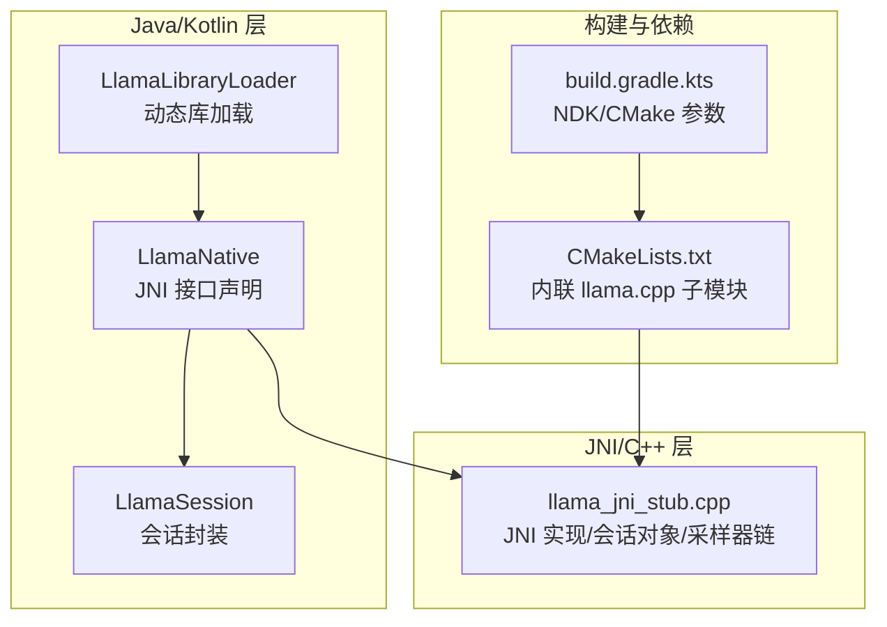
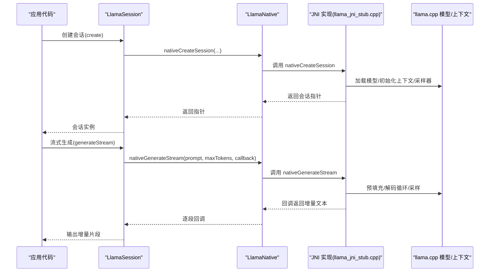
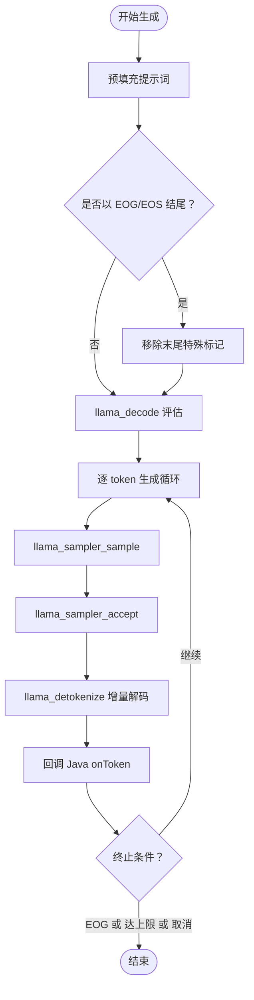
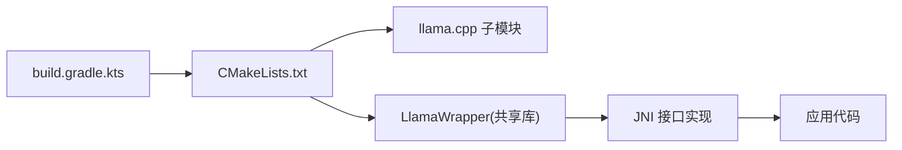

# llama.cpp 集成

<cite>
**本文引用的文件**
- [llama_jni_stub.cpp](file://llama/src/main/cpp/llama_jni_stub.cpp)
- [LlamaLibraryLoader.kt](file://llama/src/main/java/com/ai/assistance/llama/LlamaLibraryLoader.kt)
- [LlamaNative.kt](file://llama/src/main/java/com/ai/assistance/llama/LlamaNative.kt)
- [LlamaSession.kt](file://llama/src/main/java/com/ai/assistance/llama/LlamaSession.kt)
- [CMakeLists.txt](file://llama/CMakeLists.txt)
- [build.gradle.kts](file://llama/build.gradle.kts)
</cite>

## 目录
1. [简介](#简介)
2. [项目结构](#项目结构)
3. [核心组件](#核心组件)
4. [架构总览](#架构总览)
5. [组件详解](#组件详解)
6. [依赖关系分析](#依赖关系分析)
7. [性能考量](#性能考量)
8. [故障排查指南](#故障排查指南)
9. [结论](#结论)
10. [附录：编译与集成指南](#附录编译与集成指南)

## 简介
本文件面向 Operit 项目中的 llama.cpp 集成子系统，系统性阐述以下内容：
- LlamaLibraryLoader 的动态库加载机制、线程安全与幂等加载策略
- LlamaNative 与 LlamaSession 的设计架构与会话生命周期管理
- 上下文窗口与生成参数配置的实现要点
- GGUF 模型支持（基于 llama.cpp 的通用模型加载与聊天模板）
- JNI 桥接的实现细节（Java 到 C++ 的数据传递、字符串与数组处理、回调函数）
- 编译与集成指南（CMake 配置、依赖管理、平台适配）
- 性能调优建议（上下文大小、温度、采样策略）
- 使用示例（加载不同规模模型、长文本处理、流式输出）

## 项目结构
llama 子模块采用“Java/Kotlin 接口 + JNI C++ 实现 + CMake 构建”的分层组织方式：
- Java 层：对外暴露 LlamaLibraryLoader、LlamaNative、LlamaSession
- C++ 层：JNI 入口、会话对象封装、采样器链构建、模板应用与工具调用解析
- 构建层：CMakeLists.txt 内联第三方 llama.cpp 子模块，按需启用/禁用功能

图表来源
- [LlamaLibraryLoader.kt:1-18](file://llama/src/main/java/com/ai/assistance/llama/LlamaLibraryLoader.kt#L1-L18)
- [LlamaNative.kt:1-82](file://llama/src/main/java/com/ai/assistance/llama/LlamaNative.kt#L1-L82)
- [LlamaSession.kt:1-187](file://llama/src/main/java/com/ai/assistance/llama/LlamaSession.kt#L1-L187)
- [llama_jni_stub.cpp:1-1378](file://llama/src/main/cpp/llama_jni_stub.cpp#L1-L1378)
- [CMakeLists.txt:1-50](file://llama/CMakeLists.txt#L1-L50)
- [build.gradle.kts:1-71](file://llama/build.gradle.kts#L1-L71)

章节来源
- [LlamaLibraryLoader.kt:1-18](file://llama/src/main/java/com/ai/assistance/llama/LlamaLibraryLoader.kt#L1-L18)
- [LlamaNative.kt:1-82](file://llama/src/main/java/com/ai/assistance/llama/LlamaNative.kt#L1-L82)
- [LlamaSession.kt:1-187](file://llama/src/main/java/com/ai/assistance/llama/LlamaSession.kt#L1-L187)
- [llama_jni_stub.cpp:1-1378](file://llama/src/main/cpp/llama_jni_stub.cpp#L1-L1378)
- [CMakeLists.txt:1-50](file://llama/CMakeLists.txt#L1-L50)
- [build.gradle.kts:1-71](file://llama/build.gradle.kts#L1-L71)

## 核心组件
- 动态库加载器：LlamaLibraryLoader 提供单例式、线程安全的 System.loadLibrary 调用，确保只加载一次
- JNI 接口：LlamaNative 声明所有 native 方法，涵盖可用性检测、会话创建/释放、取消、令牌计数、采样参数设置、模板应用、流式生成、工具调用语法与解析
- 会话封装：LlamaSession 封装底层指针与生命周期，提供线程安全的同步访问、资源释放与错误保护

章节来源
- [LlamaLibraryLoader.kt:1-18](file://llama/src/main/java/com/ai/assistance/llama/LlamaLibraryLoader.kt#L1-L18)
- [LlamaNative.kt:1-82](file://llama/src/main/java/com/ai/assistance/llama/LlamaNative.kt#L1-L82)
- [LlamaSession.kt:1-187](file://llama/src/main/java/com/ai/assistance/llama/LlamaSession.kt#L1-L187)

## 架构总览
JNI 层通过 C++ 侧的会话对象承载模型、上下文、采样器与聊天模板状态；Java 层通过 LlamaNative 的 native 方法与之交互；构建系统在 CMake 中按需链接 llama.cpp。

图表来源
- [LlamaSession.kt:65-80](file://llama/src/main/java/com/ai/assistance/llama/LlamaSession.kt#L65-L80)
- [LlamaNative.kt:62-67](file://llama/src/main/java/com/ai/assistance/llama/LlamaNative.kt#L62-L67)
- [llama_jni_stub.cpp:1124-1375](file://llama/src/main/cpp/llama_jni_stub.cpp#L1124-L1375)

## 组件详解

### LlamaLibraryLoader：动态库加载机制
- 单例与锁：使用 @Volatile 标记 loaded，配合 synchronized(lock) 保证线程安全与幂等加载
- 加载目标：System.loadLibrary("LlamaWrapper")，对应 CMake 生成的共享库
- 设计动机：避免重复加载导致的异常或资源浪费；确保在首次使用前完成加载

章节来源
- [LlamaLibraryLoader.kt:1-18](file://llama/src/main/java/com/ai/assistance/llama/LlamaLibraryLoader.kt#L1-L18)

### LlamaNative：JNI 接口与回调桥接
- 可用性检测：nativeIsAvailable 与 nativeGetUnavailableReason 用于运行时探测
- 会话管理：nativeCreateSession/nativeReleaseSession/nativeCancel
- 文本处理：nativeCountTokens、nativeApplyChatTemplate、nativeApplyStructuredChatTemplate
- 生成控制：nativeSetSamplingParams、nativeGenerateStream（带 GenerationCallback）
- 工具调用：nativeSetToolCallGrammar、nativeClearToolCallGrammar、nativeParseToolCallResponse

章节来源
- [LlamaNative.kt:1-82](file://llama/src/main/java/com/ai/assistance/llama/LlamaNative.kt#L1-L82)

### LlamaSession：会话生命周期与并发控制
- 生命周期：创建成功后持有 sessionPtr；release 后置零并调用 nativeReleaseSession
- 并发安全：使用 @Volatile released 与内部 lock 保护方法调用
- 关键能力：计数令牌、设置采样参数、应用模板、流式生成、取消、清理工具调用语法

章节来源
- [LlamaSession.kt:1-187](file://llama/src/main/java/com/ai/assistance/llama/LlamaSession.kt#L1-L187)

### 会话对象与采样器链（C++ 侧）
- 会话对象封装：包含模型指针、上下文指针、采样器、聊天模板、采样参数、工具调用语法与解析参数、取消标志
- 初始化顺序：ensureBackendInit → 加载模型 → 初始化聊天模板 → 创建上下文 → 设置线程数 → 重建采样器链
- 采样器链：惩罚项、Top-K、Top-P、温度、可选语法约束、随机种子
- 取消回调：abortCallback 通过原子标志检查中断

章节来源
- [llama_jni_stub.cpp:378-448](file://llama/src/main/cpp/llama_jni_stub.cpp#L378-L448)
- [llama_jni_stub.cpp:392-398](file://llama/src/main/cpp/llama_jni_stub.cpp#L392-L398)
- [llama_jni_stub.cpp:412-415](file://llama/src/main/cpp/llama_jni_stub.cpp#L412-L415)

### 上下文窗口与生成流程（C++ 侧）
- 预填充阶段：将提示词分词并评估，避免以 EOG/EOS 结尾；根据 n_ctx 计算保留生成空间并截断
- 解码循环：逐 token 采样、解码、解码为 UTF-8 片段、计算增量、回调给 Java
- 终止条件：遇到 EOG、达到最大生成数、上下文窗口满、被取消或 decode 失败

图表来源
- [llama_jni_stub.cpp:1124-1375](file://llama/src/main/cpp/llama_jni_stub.cpp#L1124-L1375)

章节来源
- [llama_jni_stub.cpp:1124-1375](file://llama/src/main/cpp/llama_jni_stub.cpp#L1124-L1375)

### 聊天模板与工具调用语法（C++ 侧）
- 模板应用：支持角色-内容列表与结构化消息（含工具）两种输入，返回 Jinja 风格的提示词
- 工具调用语法：可按触发模式（词/正则/全匹配/分词）启用语法约束，必要时预填充生成提示
- 解析：结构化响应解析为标准格式

章节来源
- [llama_jni_stub.cpp:954-1086](file://llama/src/main/cpp/llama_jni_stub.cpp#L954-L1086)
- [llama_jni_stub.cpp:1088-1122](file://llama/src/main/cpp/llama_jni_stub.cpp#L1088-L1122)

### JNI 数据传递与字符串/数组处理
- 字符串：jstringToString/jstringToBytesUtf8（UTF-8 到 UTF-16），bytesUtf8ToJstring（反向）
- 数组：遍历 jobjectArray，逐元素转为 std::string，注意 DeleteLocalRef
- 回调：Resolve 回调类与方法签名，调用 onToken，异常捕获与清理

章节来源
- [llama_jni_stub.cpp:36-190](file://llama/src/main/cpp/llama_jni_stub.cpp#L36-L190)
- [llama_jni_stub.cpp:1148-1152](file://llama/src/main/cpp/llama_jni_stub.cpp#L1148-L1152)
- [llama_jni_stub.cpp:1330-1346](file://llama/src/main/cpp/llama_jni_stub.cpp#L1330-L1346)

## 依赖关系分析
- 运行时依赖：Android NDK、log 日志库；在启用 llama.cpp 时链接 common 与 llama
- 构建依赖：CMake 查找 third_party/llama.cpp 或 ../third_party/llama.cpp，按需关闭测试/工具/示例/服务端
- ABI 限制：当前 Gradle 配置仅启用 arm64-v8a

图表来源
- [build.gradle.kts:19-34](file://llama/build.gradle.kts#L19-L34)
- [CMakeLists.txt:8-23](file://llama/CMakeLists.txt#L8-L23)
- [CMakeLists.txt:25-46](file://llama/CMakeLists.txt#L25-L46)

章节来源
- [build.gradle.kts:1-71](file://llama/build.gradle.kts#L1-L71)
- [CMakeLists.txt:1-50](file://llama/CMakeLists.txt#L1-L50)

## 性能考量
- 上下文窗口与批处理
  - n_ctx：优先使用模型训练上下文，否则按 n_ctx 自动推断；生成时预留部分位置用于安全边界
  - n_batch/n_ubatch：默认批大小不超过 n_ctx，ubatch 不超过 batch
- 线程数：n_threads 与 n_threads_batch 建议与设备核数匹配，避免过高导致调度开销
- GPU 加速
  - n_gpu_layers：仅在支持 GPU Offload 的构建中生效；offload_kqv 需满足条件才启用
- 采样策略
  - 温度：越低越确定，越高越发散
  - Top-K/Top-P：组合使用可提升多样性与质量平衡
  - 重复惩罚：频率/存在惩罚用于减少重复
- I/O 与内存
  - use_mmap：建议开启以利用页缓存
  - Flash Attention：在支持的模型/硬件上可提升吞吐
  - KV 统一与 KQV 下载：在具备 GPU Offload 且显存充足时启用

章节来源
- [llama_jni_stub.cpp:698-764](file://llama/src/main/cpp/llama_jni_stub.cpp#L698-L764)
- [llama_jni_stub.cpp:1194-1205](file://llama/src/main/cpp/llama_jni_stub.cpp#L1194-L1205)

## 故障排查指南
- 动态库不可用
  - nativeIsAvailable 返回 false，nativeGetUnavailableReason 提示未构建 llama.cpp 后端
  - 检查 CMake 是否找到 third_party/llama.cpp 子模块，确认 target_link_libraries 包含 llama/common
- 会话创建失败
  - 模型加载失败：检查模型路径与权限；查看日志错误码
  - 上下文创建失败：检查 n_ctx/n_batch/n_ubatch 合理性
  - 采样器链失败：参数范围校验（Top-P 在 0..1，Top-K 非负，惩罚非负）
- 生成异常
  - decode 返回非 0/1：关注返回码含义（2 表示被取消）
  - 提示词截断：n_ctx 与预留空间不足导致；适当降低提示长度或增大 n_ctx
  - 回调异常：Java 回调抛出异常会被捕获并停止生成
- 取消无效
  - 确认在生成前未设置 cancel；生成循环中会轮询取消标志

章节来源
- [llama_jni_stub.cpp:194-203](file://llama/src/main/cpp/llama_jni_stub.cpp#L194-L203)
- [llama_jni_stub.cpp:723-736](file://llama/src/main/cpp/llama_jni_stub.cpp#L723-L736)
- [llama_jni_stub.cpp:1247-1256](file://llama/src/main/cpp/llama_jni_stub.cpp#L1247-L1256)
- [llama_jni_stub.cpp:1337-1341](file://llama/src/main/cpp/llama_jni_stub.cpp#L1337-L1341)
- [llama_jni_stub.cpp:814-817](file://llama/src/main/cpp/llama_jni_stub.cpp#L814-L817)

## 结论
该集成以清晰的分层设计实现了 llama.cpp 的 Android 原生能力接入：Java 层负责易用性与生命周期管理，JNI 层负责高性能计算与资源控制，构建系统负责依赖整合与平台适配。通过会话对象与采样器链的合理组织，系统在保持灵活性的同时提供了稳定的流式生成能力，并内置了工具调用语法与解析支持。

## 附录：编译与集成指南

### CMake 配置要点
- 子模块定位：优先 third_party/llama.cpp，其次 ../third_party/llama.cpp
- 构建裁剪：关闭 tests/tools/examples/server，仅保留 common
- 目标与链接：生成 LlamaWrapper 共享库，链接 android/log 与 llama/common
- 页面大小：链接选项启用 16KB 页面大小（Android 15+ 要求）

章节来源
- [CMakeLists.txt:1-50](file://llama/CMakeLists.txt#L1-L50)

### Gradle 配置要点
- NDK ABI：当前仅启用 arm64-v8a
- CMake 参数：STL、平台、灵活页面大小、LLAMA_BUILD_COMMON
- C++17 与 TLS 禁用：cppFlags 与外部构建参数

章节来源
- [build.gradle.kts:19-34](file://llama/build.gradle.kts#L19-L34)
- [build.gradle.kts:26-32](file://llama/build.gradle.kts#L26-L32)

### 平台适配与依赖管理
- Android 版本：minSdk 26，targetSdk 34
- ABI 支持：当前仅 arm64-v8a；如需其他 ABI，可在 ndk.abiFilters 添加
- 依赖：log、android；llama.cpp 作为子模块由 CMake 管理

章节来源
- [build.gradle.kts:12-21](file://llama/build.gradle.kts#L12-L21)
- [CMakeLists.txt:42-46](file://llama/CMakeLists.txt#L42-L46)

### 使用示例（步骤说明）
- 加载不同规模模型
  - 选择 GGUF 模型文件路径，调用 LlamaSession.create(pathModel, config)
  - 根据设备能力调整 nGpuLayers/useMmap/flashAttention/kvUnified/offloadKqv
- 处理长文本
  - 使用 applyChatTemplate 或 applyStructuredChatTemplate 生成完整提示
  - 通过 countTokens 预估长度，结合 n_ctx 与预留空间进行截断
- 实现流式输出
  - 调用 generateStream(prompt, maxTokens, onToken) 获取增量文本
  - 在回调中返回 false 可提前终止

章节来源
- [LlamaSession.kt:25-44](file://llama/src/main/java/com/ai/assistance/llama/LlamaSession.kt#L25-L44)
- [LlamaSession.kt:65-80](file://llama/src/main/java/com/ai/assistance/llama/LlamaSession.kt#L65-L80)
- [llama_jni_stub.cpp:1194-1205](file://llama/src/main/cpp/llama_jni_stub.cpp#L1194-L1205)