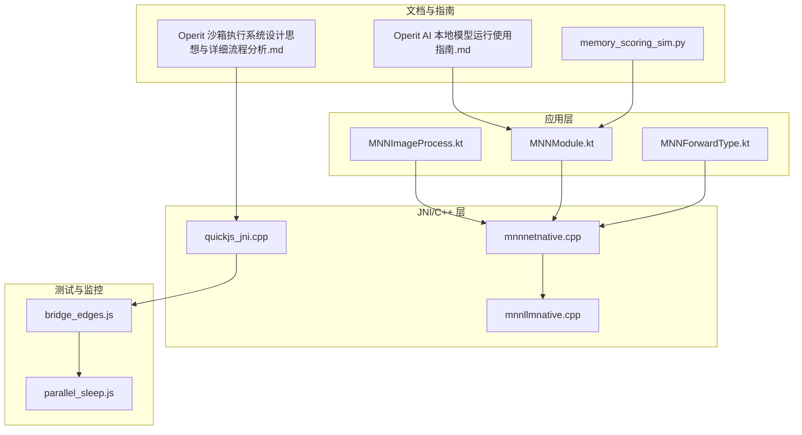
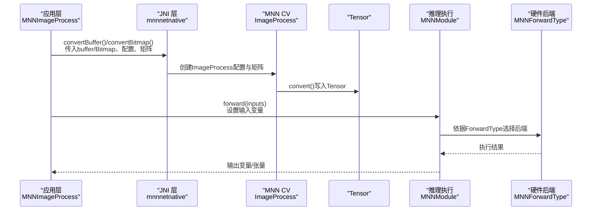
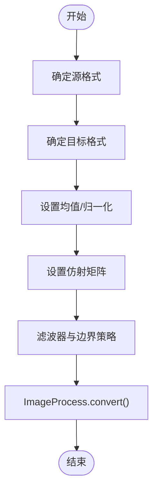
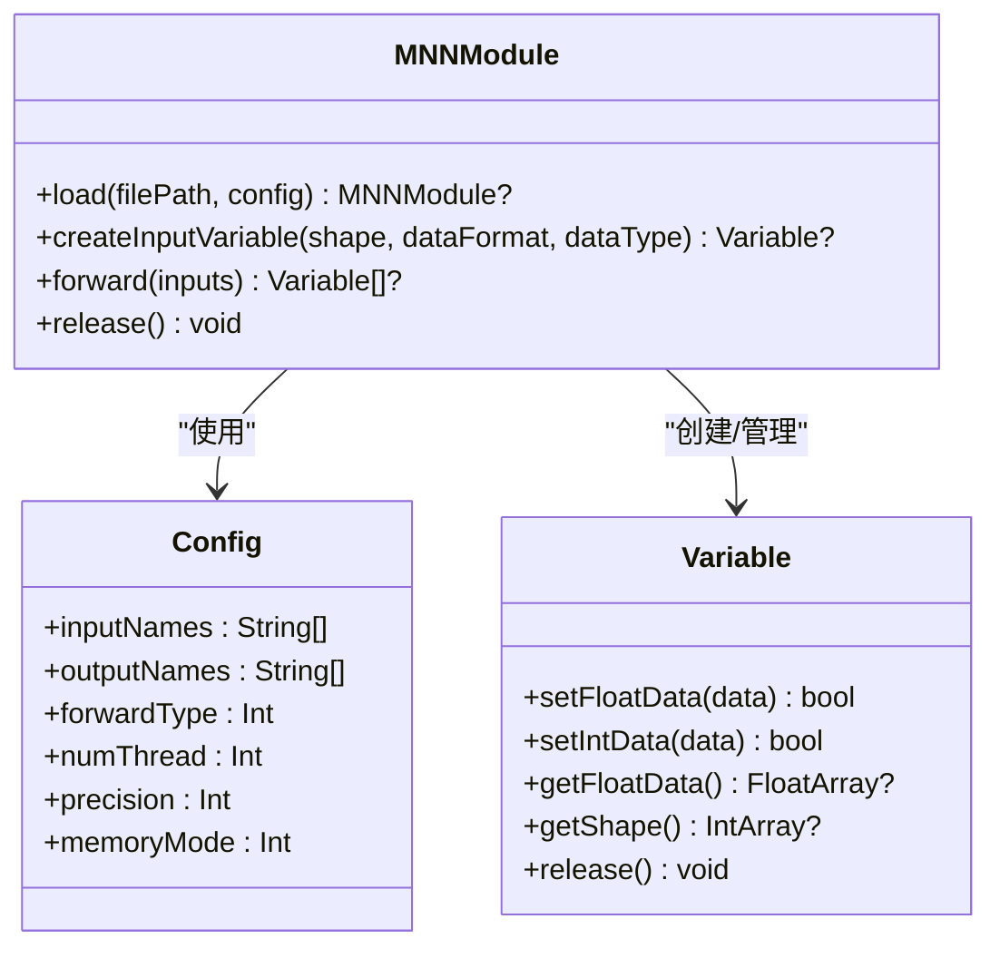
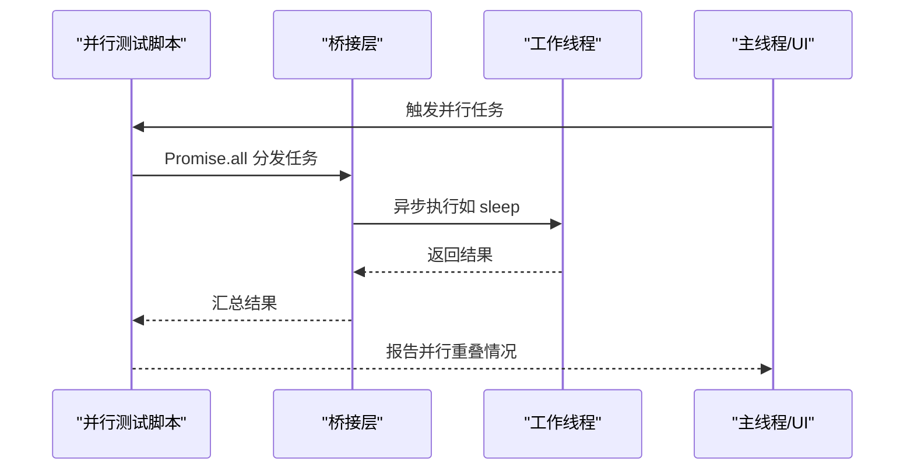
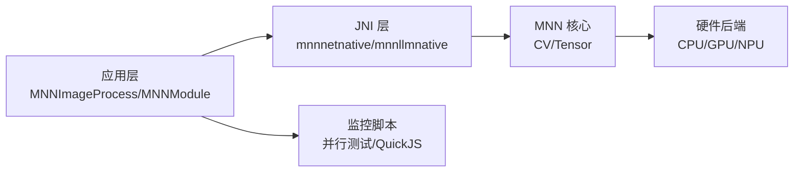

# 性能优化

<cite>
**本文引用的文件**
- [MNNImageProcess.kt](file://mnn/src/main/java/com/ai/assistance/mnn/MNNImageProcess.kt)
- [mnnnetnative.cpp](file://mnn/src/main/cpp/mnnnetnative.cpp)
- [MNNModule.kt](file://mnn/src/main/java/com/ai/assistance/mnn/MNNModule.kt)
- [MNNForwardType.kt](file://mnn/src/main/java/com/ai/assistance/mnn/MNNForwardType.kt)
- [mnn/build.gradle.kts](file://mnn/build.gradle.kts)
- [Operit AI 本地模型运行使用指南.md](file://my_docs/Operit AI 本地模型运行使用指南.md)
- [quickjs_jni.cpp](file://quickjs/src/main/cpp/quickjs_jni.cpp)
- [bridge_edges.js](file://app/src/androidTest/js/com/ai/assistance/operit/core/tools/javascript/bridge_edges/bridge_edges.js)
- [parallel_sleep.js](file://app/src/androidTest/js/com/ai/assistance/operit/core/tools/javascript/script_mode_contract/parallel_sleep.js)
- [mnnllmnative.cpp](file://mnn/src/main/cpp/mnnllmnative.cpp)
- [memory_scoring_sim.py](file://tools/memory/memory_scoring_sim.py)
- [Operit 沙箱执行系统设计思想与详细流程分析.md](file://my_docs/Operit 沙箱执行系统设计思想与详细流程分析.md)
</cite>

## 目录
1. [简介](#简介)
2. [项目结构](#项目结构)
3. [核心组件](#核心组件)
4. [架构总览](#架构总览)
5. [详细组件分析](#详细组件分析)
6. [依赖关系分析](#依赖关系分析)
7. [性能考量](#性能考量)
8. [故障排查指南](#故障排查指南)
9. [结论](#结论)
10. [附录](#附录)

## 简介
本技术文档聚焦于本地 AI 推理性能优化，围绕以下主题展开：
- MNN 图像处理优化：图像预处理、内存对齐、批处理优化、硬件加速利用
- ANR 监控机制：主线程阻塞检测、性能瓶颈分析、优化建议生成
- 内存管理策略：对象池与生命周期管理、垃圾回收优化、内存泄漏预防
- 推理性能调优：模型量化、算子融合、并行计算、缓存策略
- 不同硬件平台优化：ARM、x86 差异、GPU 加速、NPU 利用
- 性能测试与监控：基准测试工具、性能指标采集、瓶颈定位技术
- 具体优化案例：常见性能问题的解决思路、优化效果评估、精度与速度的权衡

## 项目结构
本仓库包含 Android 应用层、JNI/C++ 层、推理引擎封装层以及配套的性能测试与文档。与性能优化直接相关的关键位置如下：
- 图像处理与推理桥接：mnn 模块的 Kotlin 封装与 JNI 实现
- 推理配置与执行：MNNModule、MNNForwardType、构建参数
- 主线程与脚本执行监控：QuickJS JNI、JavaScript 并行测试脚本
- 性能测试与监控：并行睡眠测试、日志与 ADB 工具
- 文档与指南：本地模型运行与优化建议

**图示来源**
- [MNNImageProcess.kt:1-151](file://mnn/src/main/java/com/ai/assistance/mnn/MNNImageProcess.kt#L1-L151)
- [mnnnetnative.cpp:345-451](file://mnn/src/main/cpp/mnnnetnative.cpp#L345-L451)
- [MNNModule.kt:1-237](file://mnn/src/main/java/com/ai/assistance/mnn/MNNModule.kt#L1-L237)
- [MNNForwardType.kt:1-32](file://mnn/src/main/java/com/ai/assistance/mnn/MNNForwardType.kt#L1-L32)
- [quickjs_jni.cpp:333-565](file://quickjs/src/main/cpp/quickjs_jni.cpp#L333-L565)
- [bridge_edges.js:120-528](file://app/src/androidTest/js/com/ai/assistance/operit/core/tools/javascript/bridge_edges/bridge_edges.js#L120-L528)
- [parallel_sleep.js:1-73](file://app/src/androidTest/js/com/ai/assistance/operit/core/tools/javascript/script_mode_contract/parallel_sleep.js#L1-L73)
- [Operit AI 本地模型运行使用指南.md:700-899](file://my_docs/Operit AI 本地模型运行使用指南.md#L700-L899)
- [memory_scoring_sim.py:580-614](file://tools/memory/memory_scoring_sim.py#L580-L614)
- [Operit 沙箱执行系统设计思想与详细流程分析.md:598-650](file://my_docs/Operit 沙箱执行系统设计思想与详细流程分析.md#L598-L650)

**章节来源**
- [MNNImageProcess.kt:1-151](file://mnn/src/main/java/com/ai/assistance/mnn/MNNImageProcess.kt#L1-L151)
- [mnnnetnative.cpp:345-451](file://mnn/src/main/cpp/mnnnetnative.cpp#L345-L451)
- [MNNModule.kt:1-237](file://mnn/src/main/java/com/ai/assistance/mnn/MNNModule.kt#L1-L237)
- [MNNForwardType.kt:1-32](file://mnn/src/main/java/com/ai/assistance/mnn/MNNForwardType.kt#L1-L32)
- [quickjs_jni.cpp:333-565](file://quickjs/src/main/cpp/quickjs_jni.cpp#L333-L565)
- [bridge_edges.js:120-528](file://app/src/androidTest/js/com/ai/assistance/operit/core/tools/javascript/bridge_edges/bridge_edges.js#L120-L528)
- [parallel_sleep.js:1-73](file://app/src/androidTest/js/com/ai/assistance/operit/core/tools/javascript/script_mode_contract/parallel_sleep.js#L1-L73)
- [Operit AI 本地模型运行使用指南.md:700-899](file://my_docs/Operit AI 本地模型运行使用指南.md#L700-L899)
- [memory_scoring_sim.py:580-614](file://tools/memory/memory_scoring_sim.py#L580-L614)
- [Operit 沙箱执行系统设计思想与详细流程分析.md:598-650](file://my_docs/Operit 沙箱执行系统设计思想与详细流程分析.md#L598-L650)

## 核心组件
- MNNImageProcess：提供图像预处理接口，支持多种源/目标格式、滤波器与边界处理，并通过 JNI 将缓冲区或 Bitmap 转换为推理所需的 Tensor。
- MNNModule：高级封装，负责模型加载、输入变量创建、前向推理执行、精度/内存模式配置、线程数控制等。
- MNNForwardType：定义推理硬件类型（CPU、OPENCL、AUTO、OPENGL、VULKAN），用于选择后端。
- mnnnetnative：JNI 实现，完成图像处理配置、矩阵变换、均值/归一化、内存拷贝与 Tensor 转换。
- quickjs_jni：JS 引擎执行跟踪与主机调用记录，便于定位主线程阻塞与跨语言调用开销。
- 并行测试脚本：基于 Promise.all 的并行任务测量，用于评估主线程与桥接层的并发性能。

**章节来源**
- [MNNImageProcess.kt:104-148](file://mnn/src/main/java/com/ai/assistance/mnn/MNNImageProcess.kt#L104-L148)
- [MNNModule.kt:183-203](file://mnn/src/main/java/com/ai/assistance/mnn/MNNModule.kt#L183-L203)
- [MNNForwardType.kt:7-31](file://mnn/src/main/java/com/ai/assistance/mnn/MNNForwardType.kt#L7-L31)
- [mnnnetnative.cpp:345-451](file://mnn/src/main/cpp/mnnnetnative.cpp#L345-L451)
- [quickjs_jni.cpp:333-565](file://quickjs/src/main/cpp/quickjs_jni.cpp#L333-L565)
- [bridge_edges.js:120-528](file://app/src/androidTest/js/com/ai/assistance/operit/core/tools/javascript/bridge_edges/bridge_edges.js#L120-L528)

## 架构总览
下图展示了从图像输入到推理执行的关键路径，以及与硬件加速后端的关系。

**图示来源**
- [MNNImageProcess.kt:104-148](file://mnn/src/main/java/com/ai/assistance/mnn/MNNImageProcess.kt#L104-L148)
- [mnnnetnative.cpp:345-451](file://mnn/src/main/cpp/mnnnetnative.cpp#L345-L451)
- [MNNModule.kt:183-203](file://mnn/src/main/java/com/ai/assistance/mnn/MNNModule.kt#L183-L203)
- [MNNForwardType.kt:7-31](file://mnn/src/main/java/com/ai/assistance/mnn/MNNForwardType.kt#L7-L31)

## 详细组件分析

### 组件 A：MNNImageProcess 与图像预处理流水线
- 功能要点
  - 支持多种图像格式（RGBA、RGB、BGR、GRAY、YUV 等）与目标格式
  - 滤波器（最近邻、双线性、双三次）与边界处理（边缘拉伸、填充零、重复）
  - 均值/归一化参数与仿射矩阵（scale/rotate/skew）注入
  - 从 ByteArray 或 Bitmap 输入，转换为指定格式的 Tensor
- 性能关注点
  - 矩阵变换与滤波器选择直接影响像素采样与插值成本
  - 均值/归一化在 CPU/GPU 上的实现差异
  - 大尺寸图像的内存带宽与缓存命中
- 优化建议
  - 优先使用与模型输入格式一致的源格式，避免额外转换
  - 合理设置滤波器与边界策略，减少插值与越界处理
  - 批量图像统一尺寸，利于内存对齐与向量化

**图示来源**
- [MNNImageProcess.kt:59-92](file://mnn/src/main/java/com/ai/assistance/mnn/MNNImageProcess.kt#L59-L92)
- [mnnnetnative.cpp:363-392](file://mnn/src/main/cpp/mnnnetnative.cpp#L363-L392)

**章节来源**
- [MNNImageProcess.kt:104-148](file://mnn/src/main/java/com/ai/assistance/mnn/MNNImageProcess.kt#L104-L148)
- [mnnnetnative.cpp:345-451](file://mnn/src/main/cpp/mnnnetnative.cpp#L345-L451)

### 组件 B：MNNModule 与推理执行
- 功能要点
  - 模型加载与配置（forwardType、numThread、precision、memoryMode）
  - 输入变量创建（shape、dataFormat、dataType）
  - 前向推理执行与输出变量获取
- 性能关注点
  - 线程数与精度模式影响吞吐与延迟
  - 内存模式与低内存策略的权衡
  - 动态形状模型的适配与缓存复用
- 优化建议
  - 根据硬件能力选择 AUTO 或明确的 GPU/Vulkan 后端
  - 合理设置线程数，避免过度并行导致上下文切换开销
  - 使用低内存模式以缓解内存压力，但可能牺牲部分吞吐

**图示来源**
- [MNNModule.kt:18-43](file://mnn/src/main/java/com/ai/assistance/mnn/MNNModule.kt#L18-L43)
- [MNNModule.kt:48-93](file://mnn/src/main/java/com/ai/assistance/mnn/MNNModule.kt#L48-L93)
- [MNNModule.kt:162-203](file://mnn/src/main/java/com/ai/assistance/mnn/MNNModule.kt#L162-L203)

**章节来源**
- [MNNModule.kt:18-43](file://mnn/src/main/java/com/ai/assistance/mnn/MNNModule.kt#L18-L43)
- [MNNModule.kt:183-203](file://mnn/src/main/java/com/ai/assistance/mnn/MNNModule.kt#L183-L203)

### 组件 C：硬件加速与后端选择
- MNNForwardType 提供多种后端选择，结合构建参数启用相应功能
- 构建参数示例（节选）
  - 关闭 OpenCL/OpenGL/Vulkan（根据设备能力）
  - 启用 ARM82、LLM 支持、Transformer 算子融合、低内存模式、CPU 权重量化 GEMM
- 优化建议
  - 在支持 Vulkan/OpenCL 的设备上启用对应后端
  - 对 ARM 设备启用 ARM82 与算子融合以提升吞吐
  - 低内存设备启用低内存模式，必要时降低线程数

**章节来源**
- [MNNForwardType.kt:7-31](file://mnn/src/main/java/com/ai/assistance/mnn/MNNForwardType.kt#L7-L31)
- [mnn/build.gradle.kts:21-61](file://mnn/build.gradle.kts#L21-L61)

### 组件 D：主线程阻塞检测与 ANR 监控
- 主线程阻塞检测
  - 通过并行测试脚本测量 Promise.all 的总耗时，与串行执行对比判断是否存在重叠
  - 若并行总时长显著接近串行，可能存在主线程阻塞或桥接层同步阻塞
- 性能瓶颈分析
  - 结合 QuickJS JNI 的执行跟踪与主机调用记录，定位跨语言调用热点
  - 记录最近主机调用栈，辅助定位阻塞点
- 优化建议生成
  - 将耗时操作移至工作线程或后台执行
  - 减少主线程上的同步等待与锁竞争
  - 优化桥接层参数传递与序列化开销

**图示来源**
- [bridge_edges.js:120-528](file://app/src/androidTest/js/com/ai/assistance/operit/core/tools/javascript/bridge_edges/bridge_edges.js#L120-L528)
- [parallel_sleep.js:9-73](file://app/src/androidTest/js/com/ai/assistance/operit/core/tools/javascript/script_mode_contract/parallel_sleep.js#L9-L73)
- [quickjs_jni.cpp:333-565](file://quickjs/src/main/cpp/quickjs_jni.cpp#L333-L565)

**章节来源**
- [bridge_edges.js:120-528](file://app/src/androidTest/js/com/ai/assistance/operit/core/tools/javascript/bridge_edges/bridge_edges.js#L120-L528)
- [parallel_sleep.js:9-73](file://app/src/androidTest/js/com/ai/assistance/operit/core/tools/javascript/script_mode_contract/parallel_sleep.js#L9-L73)
- [quickjs_jni.cpp:333-565](file://quickjs/src/main/cpp/quickjs_jni.cpp#L333-L565)

### 组件 E：内存管理策略与对象生命周期
- 对象池与生命周期
  - 沙箱执行系统在销毁阶段显式回收 Bitmap、二进制数据与 Java 对象注册表
  - 在 QuickJS 线程中关闭引擎，确保状态一致性
- 垃圾回收优化
  - 明确释放路径，避免长生命周期持有导致 GC 压力
  - 控制中间对象数量，减少短生命周期对象的分配频率
- 内存泄漏预防
  - 回收全局引用、删除回调引用
  - 严格遵循“获取-释放”对，确保异常路径也能回收

**章节来源**
- [Operit 沙箱执行系统设计思想与详细流程分析.md:598-650](file://my_docs/Operit 沙箱执行系统设计思想与详细流程分析.md#L598-L650)

## 依赖关系分析
- 应用层依赖 JNI 层完成图像处理与推理桥接
- JNI 层依赖 MNN 的 CV 与 Tensor 能力
- 推理执行受硬件后端与构建参数影响
- 监控与测试脚本依赖主线程与桥接层行为

**图示来源**
- [MNNImageProcess.kt:104-148](file://mnn/src/main/java/com/ai/assistance/mnn/MNNImageProcess.kt#L104-L148)
- [mnnnetnative.cpp:345-451](file://mnn/src/main/cpp/mnnnetnative.cpp#L345-L451)
- [MNNModule.kt:183-203](file://mnn/src/main/java/com/ai/assistance/mnn/MNNModule.kt#L183-L203)
- [quickjs_jni.cpp:333-565](file://quickjs/src/main/cpp/quickjs_jni.cpp#L333-L565)

**章节来源**
- [MNNImageProcess.kt:104-148](file://mnn/src/main/java/com/ai/assistance/mnn/MNNImageProcess.kt#L104-L148)
- [mnnnetnative.cpp:345-451](file://mnn/src/main/cpp/mnnnetnative.cpp#L345-L451)
- [MNNModule.kt:183-203](file://mnn/src/main/java/com/ai/assistance/mnn/MNNModule.kt#L183-L203)
- [quickjs_jni.cpp:333-565](file://quickjs/src/main/cpp/quickjs_jni.cpp#L333-L565)

## 性能考量
- 模型量化与算子融合
  - 文档建议按速度优先选择量化等级（如 Q4_K_S/Q4_K_M），并开启提示缓存与减少上下文长度
  - 构建参数启用 Transformer 算子融合与低内存模式，有助于吞吐与内存占用平衡
- 并行计算与批处理
  - 使用 Promise.all 评估并行重叠，指导主线程与桥接层的并发优化
  - 批处理输入时统一尺寸与格式，减少重复转换
- 缓存策略
  - 提示缓存可显著降低重复提示的首字延迟
  - 记忆系统的快照去重机制减少重复检索
- 硬件平台差异
  - ARM 设备启用 ARM82 与算子融合；GPU/NPU 后端需根据设备能力选择
  - 低内存设备启用低内存模式，必要时降低线程数与上下文长度

**章节来源**
- [Operit AI 本地模型运行使用指南.md:708-740](file://my_docs/Operit AI 本地模型运行使用指南.md#L708-L740)
- [mnn/build.gradle.kts:21-61](file://mnn/build.gradle.kts#L21-L61)
- [bridge_edges.js:120-528](file://app/src/androidTest/js/com/ai/assistance/operit/core/tools/javascript/bridge_edges/bridge_edges.js#L120-L528)
- [my_docs/Operit 记忆管理系统设计思想与详细流程分析.md:591-631](file://my_docs/Operit 记忆管理系统设计思想与详细流程分析.md#L591-L631)

## 故障排查指南
- 模型加载失败
  - 检查模型文件完整性、格式支持与路径
- 推理速度极慢
  - 降低量化等级、增加 GPU 卸载层数、减少线程数、开启低内存模式、检查散热
- 内存不足崩溃
  - 使用更小模型、降低量化等级、减少上下文长度、关闭其他应用、开启低内存模式
- 输出乱码或重复
  - 重新下载模型、提高量化等级、确认模型格式、清除缓存
- 性能分析工具
  - 使用内置性能监控、ADB 监控 CPU/内存/GPU 使用率

**章节来源**
- [Operit AI 本地模型运行使用指南.md:742-899](file://my_docs/Operit AI 本地模型运行使用指南.md#L742-L899)

## 结论
通过对图像处理、推理配置、硬件后端、主线程监控与内存管理的系统性优化，可在保证精度的前提下显著提升本地 AI 推理性能。建议在实际部署中结合设备能力与业务场景，动态调整量化等级、线程数与后端选择，并持续使用内置监控与测试脚本进行回归验证。

## 附录
- 量化等级与速度/质量关系参考
- 并行测试脚本使用方法与结果解读
- ADB 性能分析命令与日志过滤技巧

**章节来源**
- [Operit AI 本地模型运行使用指南.md:402-417](file://my_docs/Operit AI 本地模型运行使用指南.md#L402-L417)
- [bridge_edges.js:120-528](file://app/src/androidTest/js/com/ai/assistance/operit/core/tools/javascript/bridge_edges/bridge_edges.js#L120-L528)
- [Operit AI 本地模型运行使用指南.md:866-886](file://my_docs/Operit AI 本地模型运行使用指南.md#L866-L886)