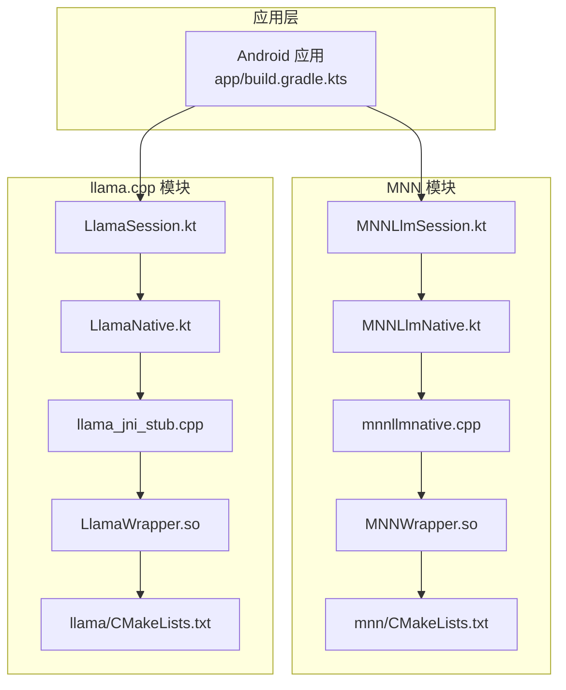
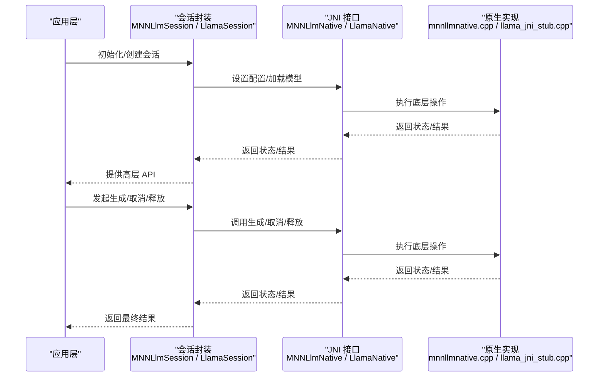
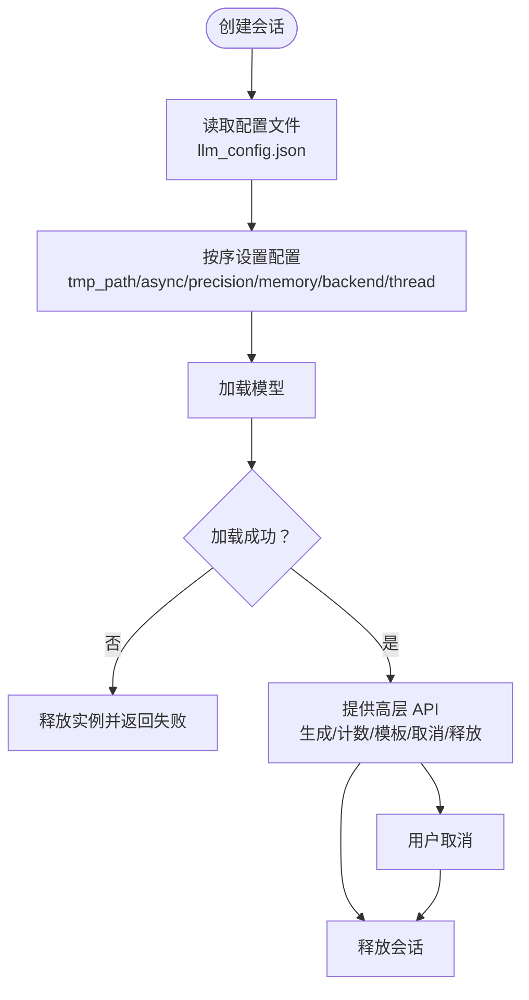
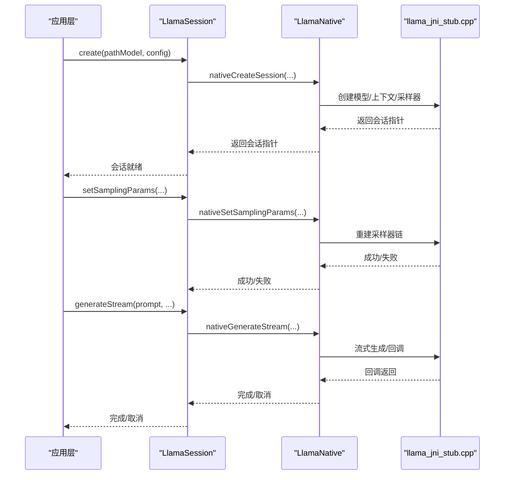
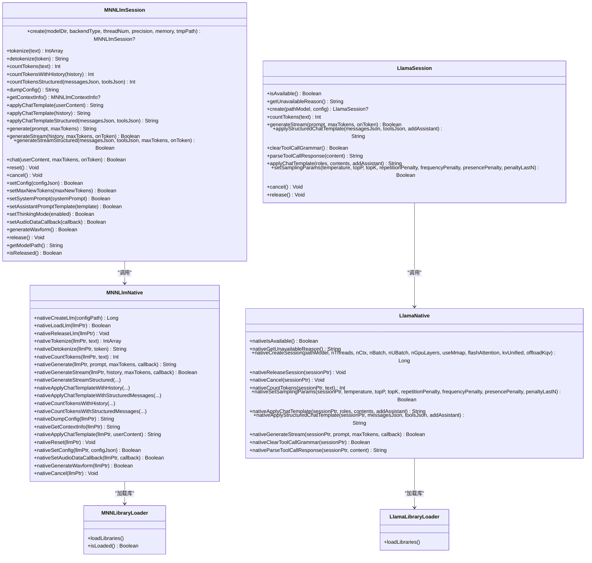
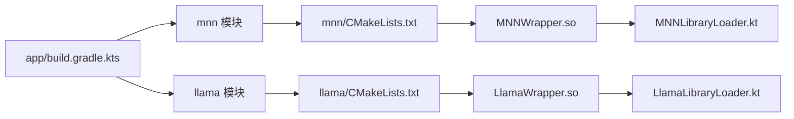

# 本地 AI 推理

<cite>
**本文引用的文件**
- [mnnllmnative.cpp](file://mnn/src/main/cpp/mnnllmnative.cpp)
- [MNNLlmNative.kt](file://mnn/src/main/java/com/ai/assistance/mnn/MNNLlmNative.kt)
- [MNNLlmSession.kt](file://mnn/src/main/java/com/ai/assistance/mnn/MNNLlmSession.kt)
- [MNNLibraryLoader.kt](file://mnn/src/main/java/com/ai/assistance/mnn/MNNLibraryLoader.kt)
- [mnn/CMakeLists.txt](file://mnn/CMakeLists.txt)
- [llama_jni_stub.cpp](file://llama/src/main/cpp/llama_jni_stub.cpp)
- [LlamaNative.kt](file://llama/src/main/java/com/ai/assistance/llama/LlamaNative.kt)
- [LlamaSession.kt](file://llama/src/main/java/com/ai/assistance/llama/LlamaSession.kt)
- [LlamaLibraryLoader.kt](file://llama/src/main/java/com/ai/assistance/llama/LlamaLibraryLoader.kt)
- [llama/CMakeLists.txt](file://llama/CMakeLists.txt)
- [app/build.gradle.kts](file://app/build.gradle.kts)
</cite>

## 目录
1. [引言](#引言)
2. [项目结构](#项目结构)
3. [核心组件](#核心组件)
4. [架构总览](#架构总览)
5. [详细组件分析](#详细组件分析)
6. [依赖关系分析](#依赖关系分析)
7. [性能考量](#性能考量)
8. [故障排查指南](#故障排查指南)
9. [结论](#结论)
10. [附录](#附录)

## 引言
本文件面向 Operit AI 的本地推理模块，系统化梳理 MNN 与 llama.cpp 的集成方案，覆盖模型加载机制、推理会话管理、内存优化策略；详解 GGUF 模型支持与 JNI 桥接实现；给出模型管理（下载、版本、切换、性能测试）与配置优化建议；并提供扩展与定制指导，帮助开发者快速集成新模型、优化性能、处理错误。

## 项目结构
Operit 将本地推理能力拆分为两个子模块：
- MNN 模块：基于 MNN LLM 引擎，提供统一的 LLM 会话封装、配置注入、令牌计数与模板应用等能力。
- llama.cpp 模块：基于 llama.cpp，提供 GGUF 模型加载、采样参数控制、流式生成、工具调用语法约束等功能。

两套 JNI 桥接分别在各自模块内实现，通过 CMake 构建目标导出共享库，并由 Kotlin 层进行加载与调用。应用层在构建脚本中聚合依赖，确保运行时可加载相应原生库。

图表来源
- [app/build.gradle.kts:185-186](file://app/build.gradle.kts#L185-L186)
- [mnn/CMakeLists.txt:44-83](file://mnn/CMakeLists.txt#L44-L83)
- [llama/CMakeLists.txt:25-46](file://llama/CMakeLists.txt#L25-L46)

章节来源
- [app/build.gradle.kts:181-190](file://app/build.gradle.kts#L181-L190)
- [mnn/CMakeLists.txt:1-98](file://mnn/CMakeLists.txt#L1-L98)
- [llama/CMakeLists.txt:1-50](file://llama/CMakeLists.txt#L1-L50)

## 核心组件
- MNN 本地推理
  - MNNLlmNative：提供 JNI 接口，负责 LLM 实例创建、配置设置、模型加载、令牌化、生成、上下文导出、模板应用、音频回调注册等。
  - MNNLlmSession：高层会话封装，负责按配置顺序设置参数、加载模型、令牌计数、模板应用、流式生成、取消与释放。
  - MNNLibraryLoader：确保 MNN 与包装库仅加载一次，避免重复加载导致崩溃。
- llama.cpp 本地推理
  - LlamaNative：提供 JNI 接口，负责会话创建、采样参数设置、模板应用、流式生成、工具调用语法约束、取消与释放。
  - LlamaSession：高层会话封装，负责可用性检测、会话生命周期管理、令牌计数、模板应用、采样参数设置、流式生成、取消与释放。
  - LlamaLibraryLoader：确保 LlamaWrapper 库仅加载一次。

章节来源
- [MNNLlmNative.kt:1-215](file://mnn/src/main/java/com/ai/assistance/mnn/MNNLlmNative.kt#L1-L215)
- [MNNLlmSession.kt:1-433](file://mnn/src/main/java/com/ai/assistance/mnn/MNNLlmSession.kt#L1-L433)
- [MNNLibraryLoader.kt:1-54](file://mnn/src/main/java/com/ai/assistance/mnn/MNNLibraryLoader.kt#L1-L54)
- [LlamaNative.kt:1-82](file://llama/src/main/java/com/ai/assistance/llama/LlamaNative.kt#L1-L82)
- [LlamaSession.kt:1-187](file://llama/src/main/java/com/ai/assistance/llama/LlamaSession.kt#L1-L187)
- [LlamaLibraryLoader.kt:1-18](file://llama/src/main/java/com/ai/assistance/llama/LlamaLibraryLoader.kt#L1-L18)

## 架构总览
下图展示了从应用层到原生层的调用链路与职责分工：

图表来源
- [MNNLlmSession.kt:28-86](file://mnn/src/main/java/com/ai/assistance/mnn/MNNLlmSession.kt#L28-L86)
- [MNNLlmNative.kt:19-35](file://mnn/src/main/java/com/ai/assistance/mnn/MNNLlmNative.kt#L19-L35)
- [mnnllmnative.cpp:401-426](file://mnn/src/main/cpp/mnnllmnative.cpp#L401-L426)
- [LlamaSession.kt:25-44](file://llama/src/main/java/com/ai/assistance/llama/LlamaSession.kt#L25-L44)
- [LlamaNative.kt:14-25](file://llama/src/main/java/com/ai/assistance/llama/LlamaNative.kt#L14-L25)
- [llama_jni_stub.cpp:661-780](file://llama/src/main/cpp/llama_jni_stub.cpp#L661-L780)

## 详细组件分析

### MNN 本地推理组件
- 模型加载机制
  - 通过配置文件路径创建 LLM 实例（不立即加载），随后按顺序设置配置（如 tmp_path、async、precision、memory、backend_type、thread_num），最后调用加载函数完成模型装载。
  - 关键点：配置必须在加载前设置，否则加载失败。
- 推理会话管理
  - 会话封装提供令牌计数、模板应用、非流式与流式生成、取消与释放；内部维护活跃调用计数与锁，保证并发安全。
  - 支持动态更新部分配置（如 max_new_tokens、system_prompt、assistant_prompt_template、thinking 模式）。
- 内存优化策略
  - CMake 启用低内存模式与后端融合优化，禁用不必要的构建项以减小体积；同时支持 Vulkan/OpenCL/GL 等 GPU 后端，按设备能力选择后端类型。
- 结构化模板与工具调用
  - 若具备 minja 支持，可基于模型配置中的 jinja 模板生成结构化提示；否则回退为空实现。

图表来源
- [MNNLlmSession.kt:37-86](file://mnn/src/main/java/com/ai/assistance/mnn/MNNLlmSession.kt#L37-L86)
- [mnnllmnative.cpp:401-469](file://mnn/src/main/cpp/mnnllmnative.cpp#L401-L469)

章节来源
- [MNNLlmSession.kt:18-86](file://mnn/src/main/java/com/ai/assistance/mnn/MNNLlmSession.kt#L18-L86)
- [MNNLlmNative.kt:13-35](file://mnn/src/main/java/com/ai/assistance/mnn/MNNLlmNative.kt#L13-L35)
- [mnn/CMakeLists.txt:16-39](file://mnn/CMakeLists.txt#L16-L39)

### llama.cpp 本地推理组件
- GGUF 模型支持
  - 会话创建时根据模型路径加载 GGUF 文件；支持 GPU Offload（若设备与构建支持）、mmap、flash attention、KV 统一与 K/V 分离卸载等参数。
- JNI 桥接与采样
  - 通过 JNI 暴露会话生命周期、采样参数设置、模板应用、流式生成、工具调用语法约束与解析等接口。
- 取消与资源回收
  - 通过原子标志与回调机制实现取消；释放时清理采样器、上下文与模板资源，防止泄漏。

图表来源
- [LlamaSession.kt:25-44](file://llama/src/main/java/com/ai/assistance/llama/LlamaSession.kt#L25-L44)
- [LlamaNative.kt:14-43](file://llama/src/main/java/com/ai/assistance/llama/LlamaNative.kt#L14-L43)
- [llama_jni_stub.cpp:661-780](file://llama/src/main/cpp/llama_jni_stub.cpp#L661-L780)
- [llama_jni_stub.cpp:417-448](file://llama/src/main/cpp/llama_jni_stub.cpp#L417-L448)

章节来源
- [LlamaSession.kt:1-187](file://llama/src/main/java/com/ai/assistance/llama/LlamaSession.kt#L1-L187)
- [LlamaNative.kt:1-82](file://llama/src/main/java/com/ai/assistance/llama/LlamaNative.kt#L1-L82)
- [llama/CMakeLists.txt:14-23](file://llama/CMakeLists.txt#L14-L23)

### 类关系与依赖

图表来源
- [MNNLlmNative.kt:1-215](file://mnn/src/main/java/com/ai/assistance/mnn/MNNLlmNative.kt#L1-L215)
- [MNNLlmSession.kt:1-433](file://mnn/src/main/java/com/ai/assistance/mnn/MNNLlmSession.kt#L1-L433)
- [MNNLibraryLoader.kt:1-54](file://mnn/src/main/java/com/ai/assistance/mnn/MNNLibraryLoader.kt#L1-L54)
- [LlamaNative.kt:1-82](file://llama/src/main/java/com/ai/assistance/llama/LlamaNative.kt#L1-L82)
- [LlamaSession.kt:1-187](file://llama/src/main/java/com/ai/assistance/llama/LlamaSession.kt#L1-L187)
- [LlamaLibraryLoader.kt:1-18](file://llama/src/main/java/com/ai/assistance/llama/LlamaLibraryLoader.kt#L1-L18)

## 依赖关系分析
- 构建与打包
  - 应用层通过 Gradle 引入 mnn 与 llama 子模块，确保原生库随应用打包。
  - MNN 与 llama 的 CMake 目标分别构建共享库并链接 Android 日志与系统库；MNN 还链接 llm 目标（若存在）。
- 运行时加载
  - Kotlin 层在初始化时调用库加载器，确保原生库仅加载一次；若加载失败，抛出异常以便上层捕获与处理。

图表来源
- [app/build.gradle.kts:185-186](file://app/build.gradle.kts#L185-L186)
- [mnn/CMakeLists.txt:77-83](file://mnn/CMakeLists.txt#L77-L83)
- [llama/CMakeLists.txt:42-46](file://llama/CMakeLists.txt#L42-L46)
- [MNNLibraryLoader.kt:21-46](file://mnn/src/main/java/com/ai/assistance/mnn/MNNLibraryLoader.kt#L21-L46)
- [LlamaLibraryLoader.kt:9-16](file://llama/src/main/java/com/ai/assistance/llama/LlamaLibraryLoader.kt#L9-L16)

章节来源
- [app/build.gradle.kts:181-190](file://app/build.gradle.kts#L181-L190)
- [mnn/CMakeLists.txt:1-98](file://mnn/CMakeLists.txt#L1-L98)
- [llama/CMakeLists.txt:1-50](file://llama/CMakeLists.txt#L1-L50)

## 性能考量
- 线程与批处理
  - MNN：通过 thread_num 控制推理线程数；通过 precision/memory 控制精度与内存占用。
  - llama.cpp：通过 nThreads、nBatch、nUBatch 控制上下文与批处理大小；可通过 flashAttention、kvUnified、offloadKqv 等参数优化吞吐与延迟。
- GPU 加速
  - MNN：启用 Vulkan/OpenCL/GL 后端，按需选择后端类型以提升算力。
  - llama.cpp：当设备与构建支持时启用 GPU Offload，减少 CPU 压力。
- 内存与缓存
  - MNN：tmp_path 指向缓存目录，降低重复加载开销；低内存模式减少峰值占用。
  - llama.cpp：use_mmap 可利用系统页缓存，减少内存占用。
- 采样与生成
  - llama.cpp：通过温度、TopK/TopP、重复惩罚等参数平衡多样性与稳定性；工具调用语法约束可减少无效生成。

章节来源
- [MNNLlmSession.kt:28-86](file://mnn/src/main/java/com/ai/assistance/mnn/MNNLlmSession.kt#L28-L86)
- [mnn/CMakeLists.txt:16-29](file://mnn/CMakeLists.txt#L16-L29)
- [LlamaSession.kt:7-17](file://llama/src/main/java/com/ai/assistance/llama/LlamaSession.kt#L7-L17)
- [llama_jni_stub.cpp:698-754](file://llama/src/main/cpp/llama_jni_stub.cpp#L698-L754)

## 故障排查指南
- 库加载失败
  - 症状：初始化时报 UnsatisfiedLinkError 或日志显示加载失败。
  - 排查：确认库名称正确、ABI 匹配、打包包含对应 .so；检查加载器是否已加载过。
  - 参考
    - [MNNLibraryLoader.kt:31-44](file://mnn/src/main/java/com/ai/assistance/mnn/MNNLibraryLoader.kt#L31-L44)
    - [LlamaLibraryLoader.kt:9-16](file://llama/src/main/java/com/ai/assistance/llama/LlamaLibraryLoader.kt#L9-L16)
- 模型加载失败
  - 症状：nativeLoadLlm 返回失败或日志报错。
  - 排查：确认配置文件路径正确、模型文件存在且格式兼容；检查后端类型与设备能力匹配。
  - 参考
    - [MNNLlmNative.kt:27-28](file://mnn/src/main/java/com/ai/assistance/mnn/MNNLlmNative.kt#L27-L28)
    - [mnnllmnative.cpp:447-469](file://mnn/src/main/cpp/mnnllmnative.cpp#L447-L469)
- 生成卡顿或崩溃
  - 症状：流式生成过程中回调异常或主线程阻塞。
  - 排查：确保回调返回布尔值正确；避免在回调中执行耗时操作；必要时调用 cancel 中断。
  - 参考
    - [MNNLlmNative.kt:197-212](file://mnn/src/main/java/com/ai/assistance/mnn/MNNLlmNative.kt#L197-L212)
    - [mnnllmnative.cpp:591-800](file://mnn/src/main/cpp/mnnllmnative.cpp#L591-L800)
    - [LlamaNative.kt:78-80](file://llama/src/main/java/com/ai/assistance/llama/LlamaNative.kt#L78-L80)
    - [llama_jni_stub.cpp:412-416](file://llama/src/main/cpp/llama_jni_stub.cpp#L412-L416)

## 结论
Operit 的本地推理体系通过 MNN 与 llama.cpp 两条路径覆盖主流本地模型生态：前者强调统一配置与模板能力，后者强调 GGUF 与工具调用语法约束。两套 JNI 桥接清晰、会话封装完备，结合构建脚本与加载器，形成可扩展、可维护的本地推理能力。实际部署中应依据设备能力与模型特性选择合适后端与参数，持续监控内存与性能指标，确保稳定与高效。

## 附录

### 模型管理与版本切换
- 下载与放置
  - 将模型文件与配置文件（如 llm_config.json）置于应用可访问目录；MNN 会话创建时读取配置文件路径。
- 版本管理
  - 建议以目录区分不同版本模型，切换时仅变更路径与相关配置项。
- 切换机制
  - 释放旧会话，创建新会话并按需设置配置；注意配置顺序与加载时机。
- 性能测试
  - 使用会话提供的上下文导出与计数接口评估 token 数与生成时间；对比不同后端与参数组合。

章节来源
- [MNNLlmSession.kt:37-86](file://mnn/src/main/java/com/ai/assistance/mnn/MNNLlmSession.kt#L37-L86)
- [MNNLlmNative.kt:130-139](file://mnn/src/main/java/com/ai/assistance/mnn/MNNLlmNative.kt#L130-L139)

### 配置指南与参数调整
- MNN
  - 关键配置：tmp_path、async、precision、memory、backend_type、thread_num。
  - 动态更新：max_new_tokens、system_prompt、assistant_prompt_template、thinking 模式。
- llama.cpp
  - 关键配置：nThreads、nCtx、nBatch、nUBatch、nGpuLayers、useMmap、flashAttention、kvUnified、offloadKqv。
  - 采样参数：temperature、topP、topK、repetitionPenalty、frequencyPenalty、presencePenalty、penaltyLastN。
- 硬件加速与内存优化
  - MNN：启用 Vulkan/OpenCL/GL 后端；开启低内存模式；按需选择后端类型。
  - llama.cpp：启用 GPU Offload；使用 mmap；合理设置批大小与上下文长度。

章节来源
- [MNNLlmSession.kt:58-75](file://mnn/src/main/java/com/ai/assistance/mnn/MNNLlmSession.kt#L58-L75)
- [MNNLlmSession.kt:333-367](file://mnn/src/main/java/com/ai/assistance/mnn/MNNLlmSession.kt#L333-L367)
- [LlamaSession.kt:7-17](file://llama/src/main/java/com/ai/assistance/llama/LlamaSession.kt#L7-L17)
- [LlamaNative.kt:34-43](file://llama/src/main/java/com/ai/assistance/llama/LlamaNative.kt#L34-L43)
- [mnn/CMakeLists.txt:16-29](file://mnn/CMakeLists.txt#L16-L29)
- [llama/CMakeLists.txt:14-23](file://llama/CMakeLists.txt#L14-L23)

### 实现示例与最佳实践
- 集成新模型（MNN）
  - 准备模型与 llm_config.json；调用会话创建方法，按顺序设置配置并加载；通过高层 API 进行生成与模板应用。
  - 参考
    - [MNNLlmSession.kt:28-86](file://mnn/src/main/java/com/ai/assistance/mnn/MNNLlmSession.kt#L28-L86)
    - [mnnllmnative.cpp:401-469](file://mnn/src/main/cpp/mnnllmnative.cpp#L401-L469)
- 集成新模型（llama.cpp）
  - 准备 GGUF 模型文件；调用会话创建方法，设置采样参数；通过流式生成接口接收回调。
  - 参考
    - [LlamaSession.kt:25-44](file://llama/src/main/java/com/ai/assistance/llama/LlamaSession.kt#L25-L44)
    - [llama_jni_stub.cpp:661-780](file://llama/src/main/cpp/llama_jni_stub.cpp#L661-L780)
- 优化推理性能
  - 选择合适后端与参数；限制最大生成 token；使用 mmap；合理设置批大小与上下文长度。
  - 参考
    - [mnn/CMakeLists.txt:16-29](file://mnn/CMakeLists.txt#L16-L29)
    - [llama/CMakeLists.txt:14-23](file://llama/CMakeLists.txt#L14-L23)
    - [llama_jni_stub.cpp:698-754](file://llama/src/main/cpp/llama_jni_stub.cpp#L698-L754)
- 处理模型错误
  - 捕获加载与生成异常；在回调中谨慎处理异常并及时取消；必要时释放会话并重新初始化。
  - 参考
    - [MNNLibraryLoader.kt:31-44](file://mnn/src/main/java/com/ai/assistance/mnn/MNNLibraryLoader.kt#L31-L44)
    - [mnnllmnative.cpp:591-800](file://mnn/src/main/cpp/mnnllmnative.cpp#L591-L800)
    - [LlamaLibraryLoader.kt:9-16](file://llama/src/main/java/com/ai/assistance/llama/LlamaLibraryLoader.kt#L9-L16)
    - [llama_jni_stub.cpp:412-416](file://llama/src/main/cpp/llama_jni_stub.cpp#L412-L416)