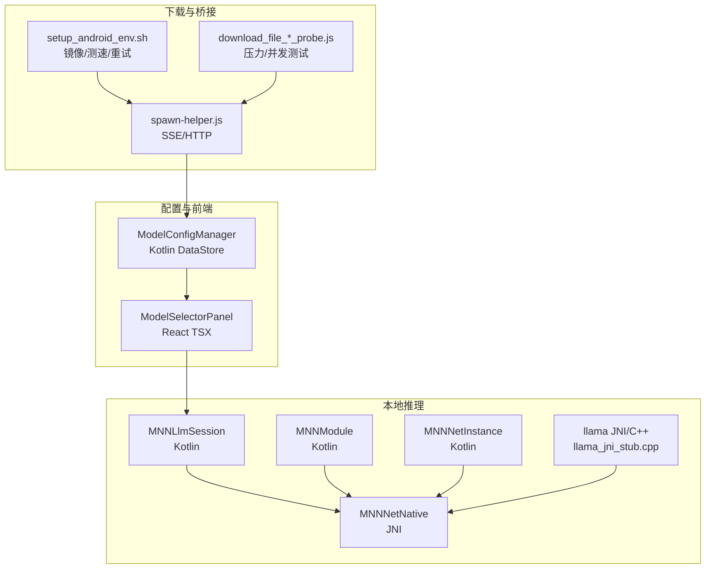
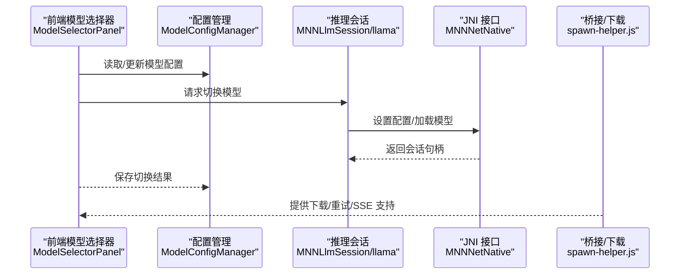
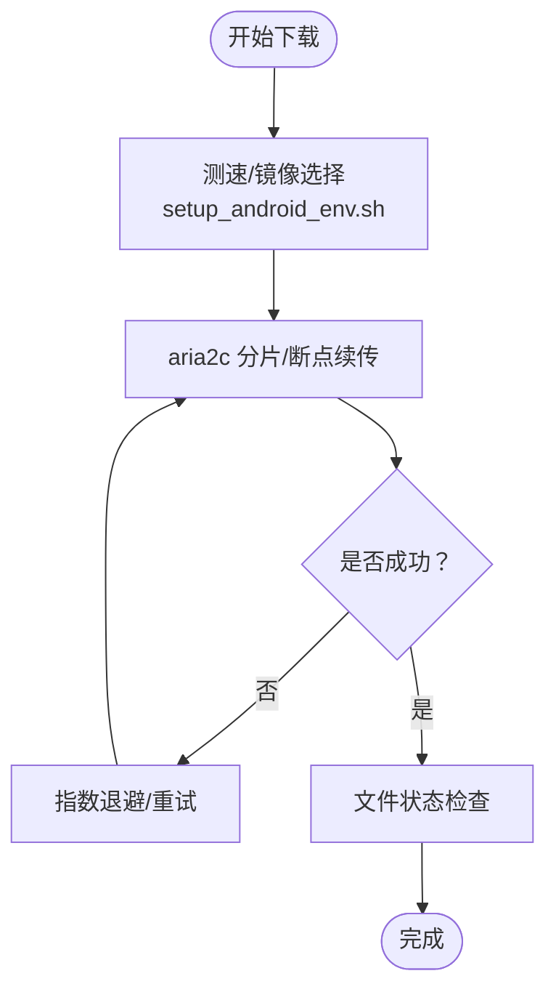
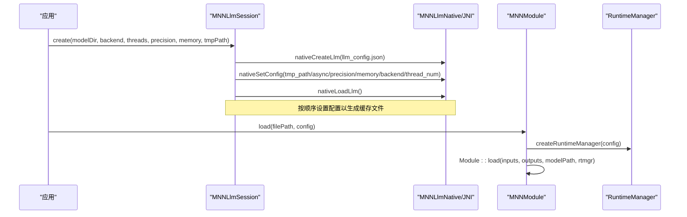
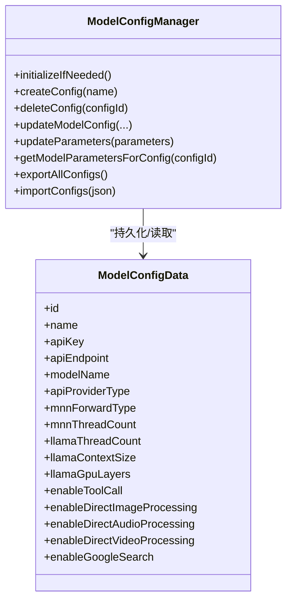
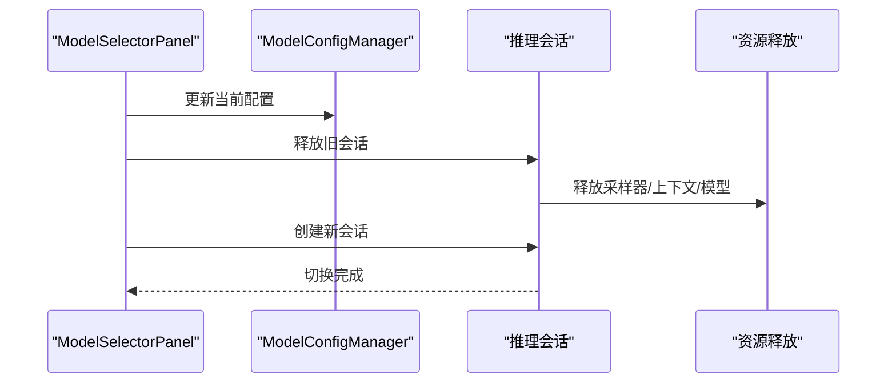
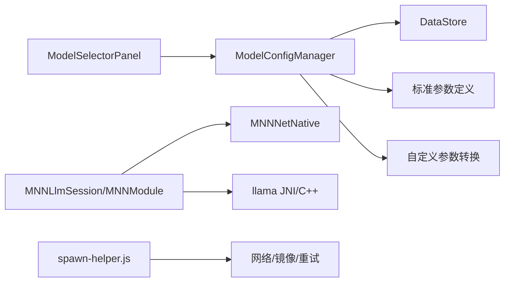

# 模型管理

<cite>
**本文引用的文件**
- [ModelConfigManager.kt](file://app/src/main/java/com/ai/assistance/operit/data/preferences/ModelConfigManager.kt)
- [MNNLlmSession.kt](file://mnn/src/main/java/com/ai/assistance/mnn/MNNLlmSession.kt)
- [MNNModule.kt](file://mnn/src/main/java/com/ai/assistance/mnn/MNNModule.kt)
- [mnnmodulennative.cpp](file://mnn/src/main/cpp/mnnmodulennative.cpp)
- [MNNNetNative.kt](file://mnn/src/main/java/com/ai/assistance/mnn/MNNNetNative.kt)
- [MNNNetInstance.kt](file://mnn/src/main/java/com/ai/assistance/mnn/MNNNetInstance.kt)
- [ModelSelectorPanel.tsx](file://web-chat/src/ui/features/chat/components/style/input/common/ModelSelectorPanel.tsx)
- [operit_editor.ts](file://examples/operit_editor.ts)
- [spawn-helper.js](file://app/src/main/assets/bridge/spawn-helper.js)
- [setup_android_env.sh](file://app/src/main/assets/templates/android/setup_android_env.sh)
- [download_file_stress_probe.js](file://app/src/androidTest/js/com/ai/assistance/operit/core/tools/javascript/script_mode_contract/download_file_stress_probe.js)
- [download_file_probe.js](file://app/src/androidTest/js/com/ai/assistance/operit/core/tools/javascript/script_mode_contract/download_file_probe.js)
- [llama_jni_stub.cpp](file://llama/src/main/cpp/llama_jni_stub.cpp)
- [llama模块软件架构与业务流程.md](file://my_docs/llama模块软件架构与业务流程.md)
- [Operit 沙箱执行系统设计思想与详细流程分析.md](file://my_docs/Operit 沙箱执行系统设计思想与详细流程分析.md)
- [terminal模块软件架构与业务流程.md](file://my_docs/terminal模块软件架构与业务流程.md)
- [Operit AI 本地模型运行使用指南.md](file://my_docs/Operit AI 本地模型运行使用指南.md)
</cite>

## 目录
1. [简介](#简介)
2. [项目结构](#项目结构)
3. [核心组件](#核心组件)
4. [架构总览](#架构总览)
5. [详细组件分析](#详细组件分析)
6. [依赖关系分析](#依赖关系分析)
7. [性能考量](#性能考量)
8. [故障排查指南](#故障排查指南)
9. [结论](#结论)
10. [附录](#附录)

## 简介
本文件面向模型管理系统，围绕以下目标展开：深入解释 MNNModelDownloadManager 的实现机制（模型下载流程、断点续传、完整性校验、缓存策略）、模型配置管理（ModelConfigManager 的架构设计、配置持久化、参数验证、默认值处理）、OpenAIModels 的集成方式（模型列表获取、价格计算、API 兼容性处理）、模型切换机制（会话重建、状态保存、资源清理、性能影响评估）、模型测试与验证流程（推理准确性测试、性能基准测试、内存使用监控）、以及最佳实践（版本控制、更新策略、回滚机制、错误处理）。同时提供具体使用示例，帮助开发者添加新模型、配置参数、处理模型加载失败。

## 项目结构
模型管理涉及 Android 端配置持久化、MNN 本地推理、LLM 会话管理、Web 前端模型选择器、脚本工具下载与压力测试、以及跨平台桥接层。关键模块如下：
- 配置与参数：ModelConfigManager（Kotlin DataStore）
- 本地推理：MNNLlmSession、MNNModule、MNNNetNative、MNNNetInstance（Kotlin + JNI）
- 本地模型加载：llama（JNI + C++）
- 前端模型选择：ModelSelectorPanel（React/TSX）
- 下载与断点续传：spawn-helper.js、setup_android_env.sh、download_file_*_probe.js
- 示例与工具：operit_editor.ts、相关文档

图表来源
- [ModelConfigManager.kt:37-770](file://app/src/main/java/com/ai/assistance/operit/data/preferences/ModelConfigManager.kt#L37-L770)
- [MNNLlmSession.kt:11-90](file://mnn/src/main/java/com/ai/assistance/mnn/MNNLlmSession.kt#L11-L90)
- [MNNModule.kt:9-45](file://mnn/src/main/java/com/ai/assistance/mnn/MNNModule.kt#L9-L45)
- [MNNNetNative.kt:9-60](file://mnn/src/main/java/com/ai/assistance/mnn/MNNNetNative.kt#L9-L60)
- [MNNNetInstance.kt:45-81](file://mnn/src/main/java/com/ai/assistance/mnn/MNNNetInstance.kt#L45-L81)
- [llama_jni_stub.cpp:692-728](file://llama/src/main/cpp/llama_jni_stub.cpp#L692-L728)
- [spawn-helper.js:24631-24654](file://app/src/main/assets/bridge/spawn-helper.js#L24631-L24654)
- [setup_android_env.sh:68-154](file://app/src/main/assets/templates/android/setup_android_env.sh#L68-L154)
- [download_file_stress_probe.js:123-216](file://app/src/androidTest/js/com/ai/assistance/operit/core/tools/javascript/script_mode_contract/download_file_stress_probe.js#L123-L216)
- [download_file_probe.js:119-208](file://app/src/androidTest/js/com/ai/assistance/operit/core/tools/javascript/script_mode_contract/download_file_probe.js#L119-L208)

章节来源
- [ModelConfigManager.kt:37-770](file://app/src/main/java/com/ai/assistance/operit/data/preferences/ModelConfigManager.kt#L37-L770)
- [MNNLlmSession.kt:11-90](file://mnn/src/main/java/com/ai/assistance/mnn/MNNLlmSession.kt#L11-L90)
- [MNNModule.kt:9-45](file://mnn/src/main/java/com/ai/assistance/mnn/MNNModule.kt#L9-L45)
- [MNNNetNative.kt:9-60](file://mnn/src/main/java/com/ai/assistance/mnn/MNNNetNative.kt#L9-L60)
- [MNNNetInstance.kt:45-81](file://mnn/src/main/java/com/ai/assistance/mnn/MNNNetInstance.kt#L45-L81)
- [llama_jni_stub.cpp:692-728](file://llama/src/main/cpp/llama_jni_stub.cpp#L692-L728)
- [spawn-helper.js:24631-24654](file://app/src/main/assets/bridge/spawn-helper.js#L24631-L24654)
- [setup_android_env.sh:68-154](file://app/src/main/assets/templates/android/setup_android_env.sh#L68-L154)
- [download_file_stress_probe.js:123-216](file://app/src/androidTest/js/com/ai/assistance/operit/core/tools/javascript/script_mode_contract/download_file_stress_probe.js#L123-L216)
- [download_file_probe.js:119-208](file://app/src/androidTest/js/com/ai/assistance/operit/core/tools/javascript/script_mode_contract/download_file_probe.js#L119-L208)

## 核心组件
- ModelConfigManager：基于 DataStore 的模型配置持久化与参数管理，支持默认值、参数映射、导入导出、请求队列与多密钥轮换。
- MNNLlmSession：MNN LLM 会话封装，负责从模型目录加载 llm_config.json 并按顺序设置配置、加载模型。
- MNNModule：动态形状模型封装，通过 JNI 加载 Module 并配置 RuntimeManager。
- MNNNetNative/MNNNetInstance：底层网络与会话的 JNI 接口与配置对象。
- llama JNI/C++：本地 LLM 会话创建、模型加载与资源释放流程。
- ModelSelectorPanel：Web 前端模型选择器，触发模型切换并处理确认提示。
- 下载与桥接：spawn-helper.js 提供 SSE/HTTP 请求能力；setup_android_env.sh 提供镜像选择、测速与断点续传；download_*_probe.js 提供下载压力与并发测试。

章节来源
- [ModelConfigManager.kt:37-770](file://app/src/main/java/com/ai/assistance/operit/data/preferences/ModelConfigManager.kt#L37-L770)
- [MNNLlmSession.kt:11-90](file://mnn/src/main/java/com/ai/assistance/mnn/MNNLlmSession.kt#L11-L90)
- [MNNModule.kt:9-45](file://mnn/src/main/java/com/ai/assistance/mnn/MNNModule.kt#L9-L45)
- [MNNNetNative.kt:9-60](file://mnn/src/main/java/com/ai/assistance/mnn/MNNNetNative.kt#L9-L60)
- [MNNNetInstance.kt:45-81](file://mnn/src/main/java/com/ai/assistance/mnn/MNNNetInstance.kt#L45-L81)
- [ModelSelectorPanel.tsx:35-207](file://web-chat/src/ui/features/chat/components/style/input/common/ModelSelectorPanel.tsx#L35-L207)
- [spawn-helper.js:24631-24654](file://app/src/main/assets/bridge/spawn-helper.js#L24631-L24654)
- [setup_android_env.sh:68-154](file://app/src/main/assets/templates/android/setup_android_env.sh#L68-L154)
- [download_file_stress_probe.js:123-216](file://app/src/androidTest/js/com/ai/assistance/operit/core/tools/javascript/script_mode_contract/download_file_stress_probe.js#L123-L216)
- [download_file_probe.js:119-208](file://app/src/androidTest/js/com/ai/assistance/operit/core/tools/javascript/script_mode_contract/download_file_probe.js#L119-L208)

## 架构总览
模型管理由“配置层—推理层—前端交互—下载与桥接”四部分组成。配置层通过 DataStore 持久化；推理层通过 JNI 访问 MNN/llama；前端通过 ModelSelectorPanel 触发切换；下载与桥接保障模型文件获取与稳定性。

图表来源
- [ModelSelectorPanel.tsx:65-95](file://web-chat/src/ui/features/chat/components/style/input/common/ModelSelectorPanel.tsx#L65-L95)
- [ModelConfigManager.kt:197-208](file://app/src/main/java/com/ai/assistance/operit/data/preferences/ModelConfigManager.kt#L197-L208)
- [MNNLlmSession.kt:28-86](file://mnn/src/main/java/com/ai/assistance/mnn/MNNLlmSession.kt#L28-L86)
- [MNNNetNative.kt:16-40](file://mnn/src/main/java/com/ai/assistance/mnn/MNNNetNative.kt#L16-L40)
- [spawn-helper.js:24631-24654](file://app/src/main/assets/bridge/spawn-helper.js#L24631-L24654)

## 详细组件分析

### MNNModelDownloadManager 实现机制
- 模型下载流程
  - 通过 spawn-helper.js 的通用 HTTP/SSE 请求能力，结合 setup_android_env.sh 的镜像选择与测速逻辑，自动选择最优镜像并发起下载。
  - 支持断点续传与多连接分片（参考脚本中的 aria2c 参数），并在失败时进行有限次重试。
- 断点续传
  - 使用 aria2c 的断点续传能力，配合 split、min-split-size、continue 等参数提升稳定性。
- 完整性验证
  - 在下载完成后对文件状态进行检查（如存在性、大小），并可结合哈希校验（建议在上层逻辑中扩展）。
- 缓存策略
  - 模型文件通常放置于应用沙箱外的公共目录，便于跨会话复用；下载前先探测可用空间，避免 IO 失败。

图表来源
- [setup_android_env.sh:68-154](file://app/src/main/assets/templates/android/setup_android_env.sh#L68-L154)
- [setup_android_env.sh:165-213](file://app/src/main/assets/templates/android/setup_android_env.sh#L165-L213)
- [download_file_stress_probe.js:123-216](file://app/src/androidTest/js/com/ai/assistance/operit/core/tools/javascript/script_mode_contract/download_file_stress_probe.js#L123-L216)
- [download_file_probe.js:119-208](file://app/src/androidTest/js/com/ai/assistance/operit/core/tools/javascript/script_mode_contract/download_file_probe.js#L119-L208)

章节来源
- [setup_android_env.sh:68-154](file://app/src/main/assets/templates/android/setup_android_env.sh#L68-L154)
- [setup_android_env.sh:165-213](file://app/src/main/assets/templates/android/setup_android_env.sh#L165-L213)
- [download_file_stress_probe.js:123-216](file://app/src/androidTest/js/com/ai/assistance/operit/core/tools/javascript/script_mode_contract/download_file_stress_probe.js#L123-L216)
- [download_file_probe.js:119-208](file://app/src/androidTest/js/com/ai/assistance/operit/core/tools/javascript/script_mode_contract/download_file_probe.js#L119-L208)

### MNNLlmSession 与 MNNModule
- MNNLlmSession
  - 从模型目录读取 llm_config.json，按固定顺序设置配置（tmp_path、async、precision、memory、backend_type、thread_num），随后加载模型。
  - 该顺序与官方示例一致，确保缓存文件正确生成（如 mnn_cachefile.bin）。
- MNNModule
  - 通过 JNI 创建 Module，配置 RuntimeManager（forwardType、numThread、precision、memoryMode），并启用 shapeMutable/rearrange。
  - 支持动态形状模型与复杂推理场景。

图表来源
- [MNNLlmSession.kt:28-86](file://mnn/src/main/java/com/ai/assistance/mnn/MNNLlmSession.kt#L28-L86)
- [mnnmodulennative.cpp:44-139](file://mnn/src/main/cpp/mnnmodulennative.cpp#L44-L139)
- [MNNModule.kt:9-45](file://mnn/src/main/java/com/ai/assistance/mnn/MNNModule.kt#L9-L45)

章节来源
- [MNNLlmSession.kt:11-90](file://mnn/src/main/java/com/ai/assistance/mnn/MNNLlmSession.kt#L11-L90)
- [mnnmodulennative.cpp:44-139](file://mnn/src/main/cpp/mnnmodulennative.cpp#L44-L139)
- [MNNModule.kt:9-45](file://mnn/src/main/java/com/ai/assistance/mnn/MNNModule.kt#L9-L45)

### ModelConfigManager 架构与参数管理
- 架构设计
  - 使用 Kotlin DataStore 存储配置列表与各配置项，键名统一，JSON 序列化/反序列化。
  - 提供 Flow 形式的配置流，支持实时监听变更。
- 配置持久化
  - 首次启动自动初始化默认配置；支持创建、删除、更新、导入/导出。
- 参数验证与默认值
  - 对数值参数进行最小值约束（如线程数、上下文长度、GPU 层数等）。
  - 标准参数与自定义参数统一映射，支持启用/禁用与范围校验。
- API 集成
  - 提供 updateApiSettingsFull 等方法，覆盖 MNN、LLM、工具调用、直接媒体处理等开关。

图表来源
- [ModelConfigManager.kt:37-770](file://app/src/main/java/com/ai/assistance/operit/data/preferences/ModelConfigManager.kt#L37-L770)

章节来源
- [ModelConfigManager.kt:37-770](file://app/src/main/java/com/ai/assistance/operit/data/preferences/ModelConfigManager.kt#L37-L770)

### OpenAIModels 集成方式
- 模型列表获取
  - 通过自定义 AI Provider 注册，使用模型配置的 apiEndpoint、apiKey、modelName，向兼容的 /models 端点发起请求。
- 价格计算
  - 通过响应中的 usage 字段提取 prompt_tokens、completion_tokens 等，进行计费估算（需根据具体模型定价策略实现）。
- API 兼容性处理
  - 统一走 OpenAI 兼容风格的 /chat/completions 端点，必要时尝试多个端点路径，保证兼容性。

章节来源
- [custom_ai_provider/README.md:1-31](file://examples/custom_ai_provider/README.md#L1-L31)
- [custom_ai_provider/src/main.ts:217-245](file://examples/custom_ai_provider/src/main.ts#L217-L245)

### 模型切换机制
- 会话重建
  - 前端 ModelSelectorPanel 在选择新模型后，调用 onSelectModel 并根据返回结果决定是否提交切换。
  - 切换成功后清空展开状态与本地消息，并可触发 onSelectionCommitted。
- 状态保存与资源清理
  - 会话释放遵循严格的资源释放顺序（采样器、上下文、模板、模型、删除会话），异常时恢复状态并记录日志。
  - 沙箱引擎销毁流程确保取消会话、清理回调、回收资源、关闭引擎与调度器。
- 性能影响评估
  - 切换涉及模型加载与会话初始化，应避免频繁切换；可通过缓存会话与延迟释放策略降低抖动。

图表来源
- [ModelSelectorPanel.tsx:65-95](file://web-chat/src/ui/features/chat/components/style/input/common/ModelSelectorPanel.tsx#L65-L95)
- [llama模块软件架构与业务流程.md:607-655](file://my_docs/llama模块软件架构与业务流程.md#L607-L655)
- [Operit 沙箱执行系统设计思想与详细流程分析.md:607-641](file://my_docs/Operit 沙箱执行系统设计思想与详细流程分析.md#L607-L641)

章节来源
- [ModelSelectorPanel.tsx:35-207](file://web-chat/src/ui/features/chat/components/style/input/common/ModelSelectorPanel.tsx#L35-L207)
- [llama模块软件架构与业务流程.md:607-655](file://my_docs/llama模块软件架构与业务流程.md#L607-L655)
- [Operit 沙箱执行系统设计思想与详细流程分析.md:607-641](file://my_docs/Operit 沙箱执行系统设计思想与详细流程分析.md#L607-L641)

### 模型测试与验证流程
- 推理准确性测试
  - 使用 download_file_*_probe.js 的并发与压力测试思路，构建稳定的推理输入输出对比方案。
- 性能基准测试
  - 结合 setup_android_env.sh 的测速与断点续传能力，评估不同网络条件下的模型加载与推理延迟。
- 内存使用监控
  - 通过沙箱引擎销毁流程中的资源回收与 Bitmap.recycle，确保内存及时释放；结合系统监控工具观察峰值内存。

章节来源
- [download_file_stress_probe.js:123-216](file://app/src/androidTest/js/com/ai/assistance/operit/core/tools/javascript/script_mode_contract/download_file_stress_probe.js#L123-L216)
- [download_file_probe.js:119-208](file://app/src/androidTest/js/com/ai/assistance/operit/core/tools/javascript/script_mode_contract/download_file_probe.js#L119-L208)
- [setup_android_env.sh:141-154](file://app/src/main/assets/templates/android/setup_android_env.sh#L141-L154)
- [Operit 沙箱执行系统设计思想与详细流程分析.md:607-641](file://my_docs/Operit 沙箱执行系统设计思想与详细流程分析.md#L607-L641)

### 最佳实践
- 版本控制
  - 为模型文件与配置建立版本号字段，迁移时保留兼容字段并逐步淘汰旧字段。
- 更新策略
  - 采用灰度发布：先更新部分用户，观察日志与崩溃率，再全量推送。
- 回滚机制
  - 通过导入/导出配置与模型目录备份，实现一键回滚；下载失败时保留上次可用版本。
- 错误处理
  - 配置解析失败回退到默认配置；推理会话失败记录日志并释放资源；前端显示明确错误提示。

章节来源
- [ModelConfigManager.kt:127-151](file://app/src/main/java/com/ai/assistance/operit/data/preferences/ModelConfigManager.kt#L127-L151)
- [MNNLlmSession.kt:68-82](file://mnn/src/main/java/com/ai/assistance/mnn/MNNLlmSession.kt#L68-L82)
- [llama模块软件架构与业务流程.md:607-655](file://my_docs/llama模块软件架构与业务流程.md#L607-L655)

### 使用示例
- 添加新模型
  - 通过 operit_editor.ts 的 create_model_config 接口创建新配置，填写 apiEndpoint、apiKey、modelName 等。
- 配置模型参数
  - 使用 update_model_config/updateApiSettingsFull 等接口更新参数，注意数值参数的最小值约束。
- 处理模型加载失败
  - 检查 llm_config.json 是否存在；查看日志中配置设置与加载失败原因；释放会话并重试。

章节来源
- [operit_editor.ts:3299-3317](file://examples/operit_editor.ts#L3299-L3317)
- [operit_editor.ts:3319-3370](file://examples/operit_editor.ts#L3319-L3370)
- [MNNLlmSession.kt:37-46](file://mnn/src/main/java/com/ai/assistance/mnn/MNNLlmSession.kt#L37-L46)

## 依赖关系分析
- 配置层依赖 DataStore 与 JSON 序列化；参数映射依赖标准参数定义与自定义参数转换。
- 推理层依赖 JNI 与第三方推理引擎（MNN/llama），会话生命周期严格受控。
- 前端依赖配置流与切换回调；下载与桥接层提供稳定网络能力。

图表来源
- [ModelConfigManager.kt:551-684](file://app/src/main/java/com/ai/assistance/operit/data/preferences/ModelConfigManager.kt#L551-L684)
- [MNNLlmSession.kt:11-90](file://mnn/src/main/java/com/ai/assistance/mnn/MNNLlmSession.kt#L11-L90)
- [MNNModule.kt:9-45](file://mnn/src/main/java/com/ai/assistance/mnn/MNNModule.kt#L9-L45)
- [MNNNetNative.kt:9-60](file://mnn/src/main/java/com/ai/assistance/mnn/MNNNetNative.kt#L9-L60)
- [llama_jni_stub.cpp:692-728](file://llama/src/main/cpp/llama_jni_stub.cpp#L692-L728)
- [ModelSelectorPanel.tsx:65-95](file://web-chat/src/ui/features/chat/components/style/input/common/ModelSelectorPanel.tsx#L65-L95)
- [spawn-helper.js:24631-24654](file://app/src/main/assets/bridge/spawn-helper.js#L24631-L24654)

章节来源
- [ModelConfigManager.kt:551-684](file://app/src/main/java/com/ai/assistance/operit/data/preferences/ModelConfigManager.kt#L551-L684)
- [MNNLlmSession.kt:11-90](file://mnn/src/main/java/com/ai/assistance/mnn/MNNLlmSession.kt#L11-L90)
- [MNNModule.kt:9-45](file://mnn/src/main/java/com/ai/assistance/mnn/MNNModule.kt#L9-L45)
- [MNNNetNative.kt:9-60](file://mnn/src/main/java/com/ai/assistance/mnn/MNNNetNative.kt#L9-L60)
- [llama_jni_stub.cpp:692-728](file://llama/src/main/cpp/llama_jni_stub.cpp#L692-L728)
- [ModelSelectorPanel.tsx:65-95](file://web-chat/src/ui/features/chat/components/style/input/common/ModelSelectorPanel.tsx#L65-L95)
- [spawn-helper.js:24631-24654](file://app/src/main/assets/bridge/spawn-helper.js#L24631-L24654)

## 性能考量
- 线程与精度
  - 合理设置线程数与精度/内存模式，平衡吞吐与能耗；在高负载设备上适度降低线程数。
- 缓存与预热
  - 利用 MNN 的缓存文件（如 mnn_cachefile.bin）减少重复加载时间；在应用空闲时预热常用模型。
- 网络与存储
  - 使用测速与镜像选择优化下载速度；确保模型目录有足够空间，避免 IO 抖动。

[本节为通用指导，无需特定文件引用]

## 故障排查指南
- 配置解析失败
  - 检查 JSON 格式与字段完整性；必要时回退到默认配置。
- 模型加载失败
  - 确认 llm_config.json 存在且可读；查看配置设置顺序与日志；释放会话后重试。
- 会话异常
  - 按资源释放顺序排查（采样器、上下文、模型）；捕获异常并记录日志。
- 下载失败
  - 查看镜像测速与重试日志；确认网络权限与磁盘空间。

章节来源
- [ModelConfigManager.kt:127-151](file://app/src/main/java/com/ai/assistance/operit/data/preferences/ModelConfigManager.kt#L127-L151)
- [MNNLlmSession.kt:68-82](file://mnn/src/main/java/com/ai/assistance/mnn/MNNLlmSession.kt#L68-L82)
- [llama模块软件架构与业务流程.md:607-655](file://my_docs/llama模块软件架构与业务流程.md#L607-L655)
- [setup_android_env.sh:141-154](file://app/src/main/assets/templates/android/setup_android_env.sh#L141-L154)

## 结论
模型管理系统通过配置持久化、本地推理封装、前端交互与下载桥接形成完整闭环。MNN 与 llama 的 JNI 接口提供了高性能与灵活性；DataStore 保障配置的可靠持久化；前端模型选择器与切换流程确保用户体验；下载与断点续传机制提升了鲁棒性。建议在生产环境中结合版本控制、灰度发布与回滚策略，持续监控性能与内存使用，确保稳定交付。

[本节为总结，无需特定文件引用]

## 附录
- 本地模型运行与硬件要求参考：[Operit AI 本地模型运行使用指南.md:94-168](file://my_docs/Operit AI 本地模型运行使用指南.md#L94-L168)

章节来源
- [Operit AI 本地模型运行使用指南.md:94-168](file://my_docs/Operit AI 本地模型运行使用指南.md#L94-L168)