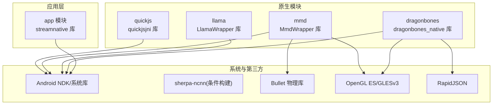
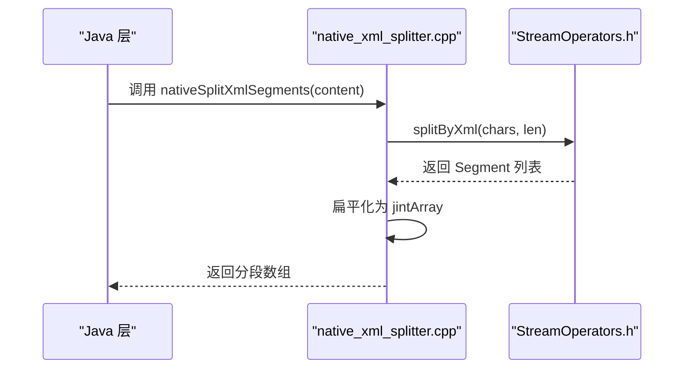
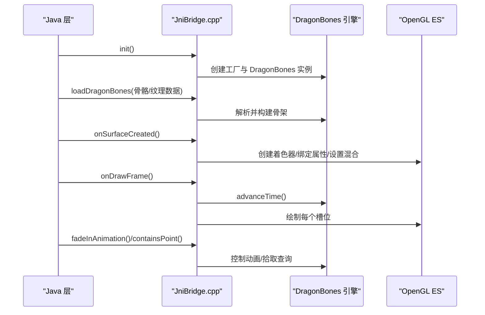
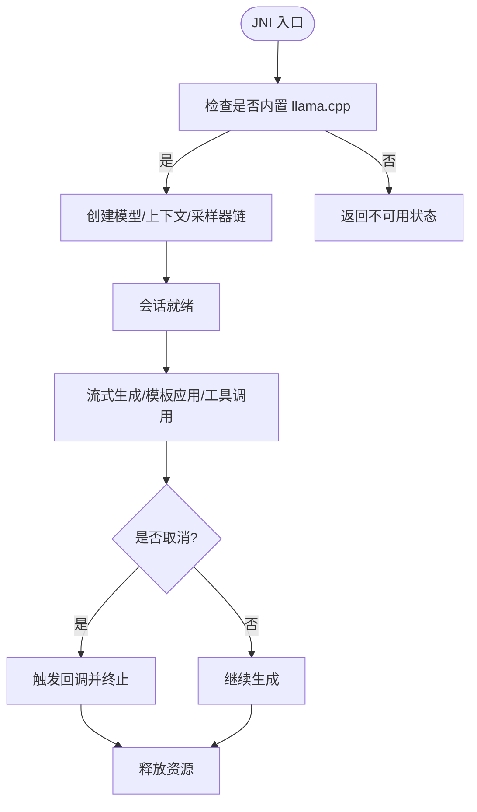
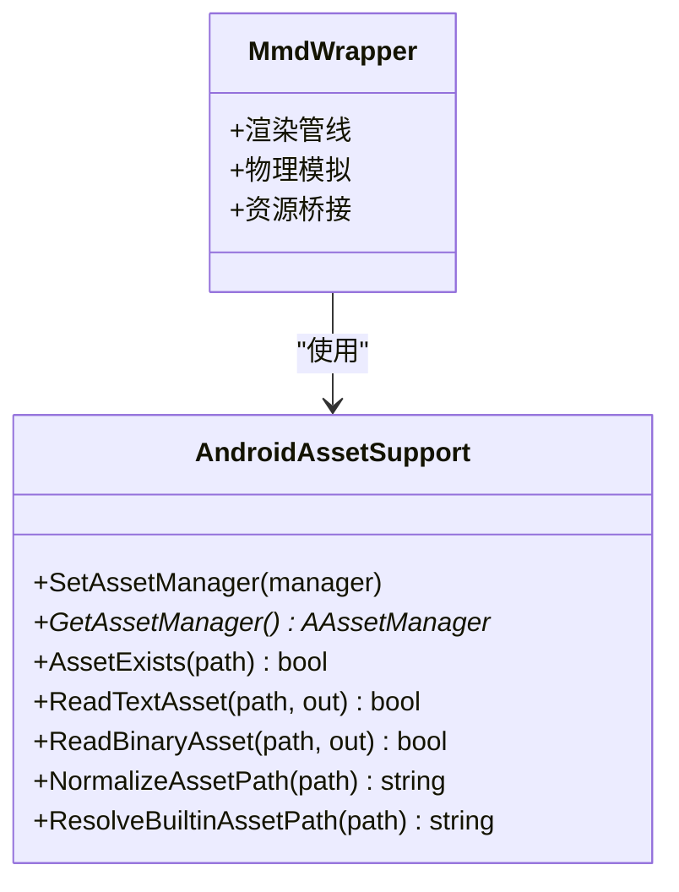
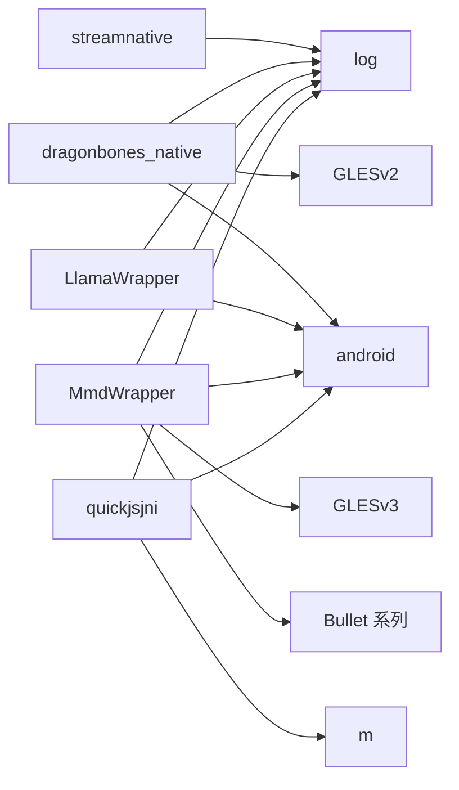

# C++ 模块集成

<cite>
**本文引用的文件**   
- [app/src/main/cpp/CMakeLists.txt](file://app/src/main/cpp/CMakeLists.txt)
- [dragonbones/CMakeLists.txt](file://dragonbones/CMakeLists.txt)
- [llama/CMakeLists.txt](file://llama/CMakeLists.txt)
- [mmd/CMakeLists.txt](file://mmd/CMakeLists.txt)
- [quickjs/src/main/cpp/CMakeLists.txt](file://quickjs/src/main/cpp/CMakeLists.txt)
- [app/src/main/cpp/streamnative/native_xml_splitter.cpp](file://app/src/main/cpp/streamnative/native_xml_splitter.cpp)
- [app/src/main/cpp/streamnative/StreamOperators.h](file://app/src/main/cpp/streamnative/StreamOperators.h)
- [dragonbones/cpp/JniBridge.cpp](file://dragonbones/cpp/JniBridge.cpp)
- [dragonbones/cpp/JniBridge.h](file://dragonbones/cpp/JniBridge.h)
- [llama/src/main/cpp/llama_jni_stub.cpp](file://llama/src/main/cpp/llama_jni_stub.cpp)
- [mmd/src/main/cpp/android/AndroidAssetSupport.cpp](file://mmd/src/main/cpp/android/AndroidAssetSupport.cpp)
- [mmd/src/main/cpp/android/AndroidAssetSupport.h](file://mmd/src/main/cpp/android/AndroidAssetSupport.h)
</cite>

## 目录
1. [简介](#简介)
2. [项目结构](#项目结构)
3. [核心组件](#核心组件)
4. [架构总览](#架构总览)
5. [组件详解](#组件详解)
6. [依赖关系分析](#依赖关系分析)
7. [性能考量](#性能考量)
8. [故障排查指南](#故障排查指南)
9. [结论](#结论)
10. [附录](#附录)

## 简介
本文件面向 C++ 开发者，系统化梳理 Operit 项目中各原生模块的 CMake 集成与构建配置，覆盖模块发现、依赖管理、编译选项、跨平台/跨架构适配、第三方库集成策略（静态库链接、动态库加载、版本兼容）、模块间依赖与资源共享、同步通信协议、头文件组织与命名空间规范、开发与测试调试流程，以及性能优化建议。文档同时提供可直接定位到源码路径的“章节来源”与“图示来源”，便于快速回溯实现细节。

## 项目结构
Operit 的 C++ 原生模块主要分布在以下位置：
- app 模块原生层：负责通用流式解析与分段工具等，构建为共享库并链接 Android 日志库。
- dragonbones：基于本地子模块的动画引擎，通过 JNI 桥接 Java 层，构建为共享库并链接 OpenGL ES 与 Android 系统库。
- llama：嵌入 llama.cpp 子模块，按需启用构建目标，通过 JNI 提供推理会话能力。
- mmd：集成 Saba 渲染与 Bullet 物理，桥接 Android 资源与 OpenGL ES，构建为共享库并链接物理库。
- quickjs：内嵌 QuickJS 引擎，构建为共享库并链接数学库。

图表来源
- [app/src/main/cpp/CMakeLists.txt:54-87](file://app/src/main/cpp/CMakeLists.txt#L54-L87)
- [dragonbones/CMakeLists.txt:19-42](file://dragonbones/CMakeLists.txt#L19-L42)
- [llama/CMakeLists.txt:25-46](file://llama/CMakeLists.txt#L25-L46)
- [mmd/CMakeLists.txt:42-108](file://mmd/CMakeLists.txt#L42-L108)
- [quickjs/src/main/cpp/CMakeLists.txt:9-58](file://quickjs/src/main/cpp/CMakeLists.txt#L9-L58)

章节来源
- [app/src/main/cpp/CMakeLists.txt:1-87](file://app/src/main/cpp/CMakeLists.txt#L1-L87)
- [dragonbones/CMakeLists.txt:1-45](file://dragonbones/CMakeLists.txt#L1-L45)
- [llama/CMakeLists.txt:1-50](file://llama/CMakeLists.txt#L1-L50)
- [mmd/CMakeLists.txt:1-112](file://mmd/CMakeLists.txt#L1-L112)
- [quickjs/src/main/cpp/CMakeLists.txt:1-61](file://quickjs/src/main/cpp/CMakeLists.txt#L1-L61)

## 核心组件
- streamnative：提供 XML/Markdown 流式分段与构建器，暴露 JNI 接口供 Java 调用。
- dragonbones：通过 JNI 桥接 DragonBones 动画引擎，支持骨骼动画加载、渲染与交互。
- llama：通过 JNI 暴露大模型推理会话、采样参数、模板应用与工具调用语法约束。
- mmd：通过 JNI 暴露 MMD 模型加载、相机/光照、物理模拟与渲染管线。
- quickjs：内嵌 JavaScript 运行时，提供脚本执行与宿主交互能力。

章节来源
- [app/src/main/cpp/streamnative/native_xml_splitter.cpp:28-46](file://app/src/main/cpp/streamnative/native_xml_splitter.cpp#L28-L46)
- [dragonbones/cpp/JniBridge.cpp:280-429](file://dragonbones/cpp/JniBridge.cpp#L280-L429)
- [llama/src/main/cpp/llama_jni_stub.cpp:648-780](file://llama/src/main/cpp/llama_jni_stub.cpp#L648-L780)
- [mmd/src/main/cpp/android/AndroidAssetSupport.cpp:28-36](file://mmd/src/main/cpp/android/AndroidAssetSupport.cpp#L28-L36)
- [quickjs/src/main/cpp/CMakeLists.txt:9-58](file://quickjs/src/main/cpp/CMakeLists.txt#L9-L58)

## 架构总览
下图展示了 C++ 模块在 Android 平台上的构建与链接关系，以及与系统库、第三方库的耦合点。

```mermaid
graph TB
A["app/src/main/cpp/CMakeLists.txt<br/>构建 streamnative 库"] --> L1["log 库"]
A --> P1["16KB 页面对齐链接选项"]
B["dragonbones/CMakeLists.txt<br/>构建 dragonbones_native 库"] --> L2["log 库"]
B --> L3["GLESv2 库"]
B --> L4["android 库"]
B --> P2["16KB 页面对齐链接选项"]
C["llama/CMakeLists.txt<br/>构建 LlamaWrapper 库"] --> L5["android 库"]
C --> L6["log 库"]
C --> P3["16KB 页面对齐链接选项"]
C --> |条件| LLAMACPP["llama.cpp 子模块目标"]
D["mmd/CMakeLists.txt<br/>构建 MmdWrapper 库"] --> L7["android 库"]
D --> L8["log 库"]
D --> L9["GLESv3 库"]
D --> BLT["Bullet 系列库"]
D --> P4["16KB 页面对齐链接选项"]
E["quickjs/src/main/cpp/CMakeLists.txt<br/>构建 quickjsjni 库"] --> L10["android 库"]
E --> L11["log 库"]
E --> L12["m 库"]
E --> P5["16KB 页面对齐链接选项"]
```

图表来源
- [app/src/main/cpp/CMakeLists.txt:76-87](file://app/src/main/cpp/CMakeLists.txt#L76-L87)
- [dragonbones/CMakeLists.txt:32-42](file://dragonbones/CMakeLists.txt#L32-L42)
- [llama/CMakeLists.txt:42-46](file://llama/CMakeLists.txt#L42-L46)
- [mmd/CMakeLists.txt:100-108](file://mmd/CMakeLists.txt#L100-L108)
- [quickjs/src/main/cpp/CMakeLists.txt:53-58](file://quickjs/src/main/cpp/CMakeLists.txt#L53-L58)

## 组件详解

### streamnative 模块（XML/Markdown 分段与流式构建）
- 构建目标：共享库 streamnative，包含 XML/Markdown 分段与流式构建相关源文件。
- 头文件组织：通过私有 include 目录统一包含根目录头文件；接口声明位于 StreamOperators.h。
- JNI 接口：提供 XML 分段结果转整型数组的 JNI 方法，供 Java 层消费。
- 编译特性：在 Android 条件下引入 sherpa-ncnn 的 CMake 模块路径与开关，确保静态库构建与禁用 OpenMP，避免运行时异常。
- 性能优化：针对 Debug 配置强制启用 Release 类优化标志，减少重型原生库的调试开销。

图表来源
- [app/src/main/cpp/streamnative/native_xml_splitter.cpp:28-46](file://app/src/main/cpp/streamnative/native_xml_splitter.cpp#L28-L46)
- [app/src/main/cpp/streamnative/StreamOperators.h:10-20](file://app/src/main/cpp/streamnative/StreamOperators.h#L10-L20)

章节来源
- [app/src/main/cpp/CMakeLists.txt:54-87](file://app/src/main/cpp/CMakeLists.txt#L54-L87)
- [app/src/main/cpp/streamnative/native_xml_splitter.cpp:1-47](file://app/src/main/cpp/streamnative/native_xml_splitter.cpp#L1-L47)
- [app/src/main/cpp/streamnative/StreamOperators.h:1-21](file://app/src/main/cpp/streamnative/StreamOperators.h#L1-L21)

### dragonbones 模块（OpenGL 动画渲染）
- 构建目标：共享库 dragonbones_native，聚合 DragonBones 核心与 OpenGL 工厂实现，并引入 RapidJSON。
- JNI 接口：提供初始化、数据加载、生命周期回调（pause/resume/destroy）、GL 表面事件、动画控制、拾取查询等。
- 渲染管线：在 GL 线程中创建着色器程序与矩阵，遍历槽位进行绘制，支持缩放、平移与骨骼偏置覆盖。
- 资源管理：通过工厂与骨架实例的生命周期管理，确保切换模型时正确清理与重建资源。
- 链接与平台：链接 log、GLESv2、android，并启用 16KB 页面大小支持。

图表来源
- [dragonbones/cpp/JniBridge.cpp:280-429](file://dragonbones/cpp/JniBridge.cpp#L280-L429)
- [dragonbones/cpp/JniBridge.h:10-59](file://dragonbones/cpp/JniBridge.h#L10-L59)

章节来源
- [dragonbones/CMakeLists.txt:19-42](file://dragonbones/CMakeLists.txt#L19-L42)
- [dragonbones/cpp/JniBridge.cpp:1-684](file://dragonbones/cpp/JniBridge.cpp#L1-L684)
- [dragonbones/cpp/JniBridge.h:1-66](file://dragonbones/cpp/JniBridge.h#L1-L66)

### llama 模块（大模型推理封装）
- 构建目标：共享库 LlamaWrapper，按子模块存在与否决定是否定义 OPERIT_HAS_LLAMA_CPP 宏。
- 依赖管理：当可用时链接 llama 与 common 目标，并将子模块 include 目录加入头文件搜索路径。
- JNI 接口：提供会话创建/释放、取消、采样参数设置、模板应用、流式生成、工具调用语法约束与解析等。
- 后端初始化：首次调用时初始化 llama 后端，保证线程安全。
- 性能与兼容：根据设备能力选择 GPU offload 层数，动态调整批处理与上下文大小。

图表来源
- [llama/CMakeLists.txt:25-46](file://llama/CMakeLists.txt#L25-L46)
- [llama/src/main/cpp/llama_jni_stub.cpp:648-780](file://llama/src/main/cpp/llama_jni_stub.cpp#L648-L780)

章节来源
- [llama/CMakeLists.txt:1-50](file://llama/CMakeLists.txt#L1-L50)
- [llama/src/main/cpp/llama_jni_stub.cpp:1-800](file://llama/src/main/cpp/llama_jni_stub.cpp#L1-L800)

### mmd 模块（MMD 渲染与物理）
- 构建目标：共享库 MmdWrapper，集成 Saba 渲染与 Bullet 物理，桥接 Android 资源。
- 资源访问：通过 AndroidAssetSupport 提供资产路径标准化、存在性检测与读取。
- 渲染与物理：构建相机/光照/阴影，驱动模型绘制与物理模拟。
- 链接与平台：链接 android、log、GLESv3 与 Bullet 系列库，启用 16KB 页面大小支持。

图表来源
- [mmd/src/main/cpp/android/AndroidAssetSupport.cpp:28-36](file://mmd/src/main/cpp/android/AndroidAssetSupport.cpp#L28-L36)
- [mmd/src/main/cpp/android/AndroidAssetSupport.h:11-21](file://mmd/src/main/cpp/android/AndroidAssetSupport.h#L11-L21)

章节来源
- [mmd/CMakeLists.txt:42-108](file://mmd/CMakeLists.txt#L42-L108)
- [mmd/src/main/cpp/android/AndroidAssetSupport.cpp:1-134](file://mmd/src/main/cpp/android/AndroidAssetSupport.cpp#L1-L134)
- [mmd/src/main/cpp/android/AndroidAssetSupport.h:1-22](file://mmd/src/main/cpp/android/AndroidAssetSupport.h#L1-L22)

### quickjs 模块（JavaScript 运行时）
- 构建目标：共享库 quickjsjni，聚合 QuickJS 源文件并设置编译定义与标准。
- 编译选项：在 Debug 下仍保持优化，减少延迟敏感路径的性能损耗。
- 链接：链接 android、log、m，启用 16KB 页面大小支持。

章节来源
- [quickjs/src/main/cpp/CMakeLists.txt:1-61](file://quickjs/src/main/cpp/CMakeLists.txt#L1-L61)

## 依赖关系分析
- 模块内聚与耦合
  - streamnative 仅依赖 JNI 与内部流式接口，内聚度高，耦合低。
  - dragonbones 与 mmd 对 OpenGL ES 与系统库强耦合，但通过 JNI 抽象与资源桥接降低上层复杂度。
  - llama 与 quickjs 作为独立后端，通过 JNI 与应用解耦。
- 外部依赖
  - Android 系统库：log、android、GLESv2/GLESv3、m。
  - 第三方静态库：llama.cpp、bullet、rapidjson、sherpa-ncnn（条件）。
- 潜在循环依赖
  - 当前模块间无直接循环依赖，JNI 桥接单向连接至各自模块。
- 链接与符号
  - 各模块均通过 target_link_libraries 显式声明依赖，避免隐式链接问题。

图表来源
- [app/src/main/cpp/CMakeLists.txt:76-87](file://app/src/main/cpp/CMakeLists.txt#L76-L87)
- [dragonbones/CMakeLists.txt:32-42](file://dragonbones/CMakeLists.txt#L32-L42)
- [llama/CMakeLists.txt:42-46](file://llama/CMakeLists.txt#L42-L46)
- [mmd/CMakeLists.txt:100-108](file://mmd/CMakeLists.txt#L100-L108)
- [quickjs/src/main/cpp/CMakeLists.txt:53-58](file://quickjs/src/main/cpp/CMakeLists.txt#L53-L58)

章节来源
- [app/src/main/cpp/CMakeLists.txt:76-87](file://app/src/main/cpp/CMakeLists.txt#L76-L87)
- [dragonbones/CMakeLists.txt:32-42](file://dragonbones/CMakeLists.txt#L32-L42)
- [llama/CMakeLists.txt:42-46](file://llama/CMakeLists.txt#L42-L46)
- [mmd/CMakeLists.txt:100-108](file://mmd/CMakeLists.txt#L100-L108)
- [quickjs/src/main/cpp/CMakeLists.txt:53-58](file://quickjs/src/main/cpp/CMakeLists.txt#L53-L58)

## 性能考量
- 编译优化
  - Debug 配置强制启用 Release 类优化标志，减少重型原生库的调试成本。
  - QuickJS 在 Debug 下也启用 -O3，降低延迟敏感路径开销。
- 内存与资源
  - DragonBones 与 MMD 在 GL 上下文重建时清理旧资源，避免悬挂引用。
  - llama 使用 mmap 与 GPU offload（若支持），并动态调整批大小与上下文。
- 链接与页对齐
  - 统一启用 16KB 页面大小链接选项，满足 Android 15+ 要求并提升内存对齐效率。

章节来源
- [app/src/main/cpp/CMakeLists.txt:5-20](file://app/src/main/cpp/CMakeLists.txt#L5-L20)
- [quickjs/src/main/cpp/CMakeLists.txt:28-42](file://quickjs/src/main/cpp/CMakeLists.txt#L28-L42)
- [llama/src/main/cpp/llama_jni_stub.cpp:675-780](file://llama/src/main/cpp/llama_jni_stub.cpp#L675-L780)
- [dragonbones/CMakeLists.txt:44-45](file://dragonbones/CMakeLists.txt#L44-L45)
- [mmd/CMakeLists.txt:110-112](file://mmd/CMakeLists.txt#L110-L112)

## 故障排查指南
- JNI 端点未找到
  - 确认 JNI 函数签名与类名一致，遵循 Java_* 包名与函数命名约定。
- OpenGL 错误
  - DragonBones 在着色器编译/链接失败时记录日志，检查顶点/片段着色器源与属性位置。
- 资源路径问题
  - MMD 资产路径需标准化与大小写归一，必要时使用内置路径映射规则。
- llama 不可用
  - 若未检出 llama.cpp 子模块或未链接到 llama 目标，JNI 将返回不可用状态与原因字符串。
- 链接错误
  - 确保所有依赖库已正确 add_subdirectory 或通过包管理器提供，且 target_link_libraries 中列出。

章节来源
- [dragonbones/cpp/JniBridge.cpp:74-143](file://dragonbones/cpp/JniBridge.cpp#L74-L143)
- [mmd/src/main/cpp/android/AndroidAssetSupport.cpp:38-59](file://mmd/src/main/cpp/android/AndroidAssetSupport.cpp#L38-L59)
- [llama/src/main/cpp/llama_jni_stub.cpp:194-203](file://llama/src/main/cpp/llama_jni_stub.cpp#L194-L203)
- [llama/CMakeLists.txt:31-40](file://llama/CMakeLists.txt#L31-L40)

## 结论
Operit 的 C++ 模块采用清晰的 CMake 分层与 JNI 桥接策略，实现了第三方库的可控集成与平台适配。通过统一的链接选项与编译优化策略，兼顾了性能与稳定性。建议在新增模块时遵循现有命名空间、头文件组织与 JNI 接口设计原则，确保模块内聚、依赖明确、资源管理有序。

## 附录

### CMake 构建最佳实践清单
- 模块发现
  - 使用 add_subdirectory 引入第三方子模块，必要时通过变量强制开关构建目标。
- 依赖管理
  - 明确列出所有依赖库与头文件路径，避免隐式链接。
- 编译选项
  - 针对 Debug 配置适度放宽优化，保持关键路径性能。
- 交叉编译
  - 通过 CMAKE_TOOLCHAIN_FILE 与目标三元组配置，确保 ABI 与架构匹配。
- 静态库链接
  - 对于需要避免符号冲突的库，优先使用静态库并关闭共享库模式。
- 动态库加载
  - 通过系统库或应用侧加载器按需加载，注意权限与路径。
- 版本兼容
  - 通过 VERSION 文件或宏定义标注第三方版本，避免 ABI 不一致。

### 新增 C++ 模块步骤示例
- 创建 CMakeLists.txt，定义目标、包含目录、编译选项与链接库。
- 设计 JNI 接口，确保签名与类名一致。
- 在 app/build.gradle.kts 或对应模块 Gradle 中启用 externalNativeBuild 并指定 CMake 配置。
- 在 Java/Kotlin 侧通过 System.loadLibrary 加载共享库并调用 JNI 方法。
- 验证 Android 15+ 页对齐要求，必要时添加链接选项。

### 模块测试与调试
- 单元测试：在 C++ 层编写最小可运行用例，验证核心算法与 JNI 接口。
- 集成测试：在 Android 端启动 Activity，调用 JNI 并观察日志输出。
- 性能分析：使用 Android Studio CPU Profiler 与 Systrace，定位热点路径。
- 日志：统一使用 __android_log_print 输出 INFO/WARN/ERROR 级别日志，便于排障。