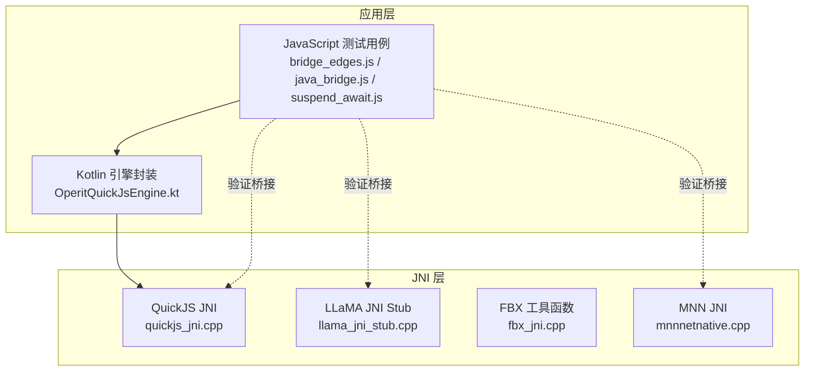
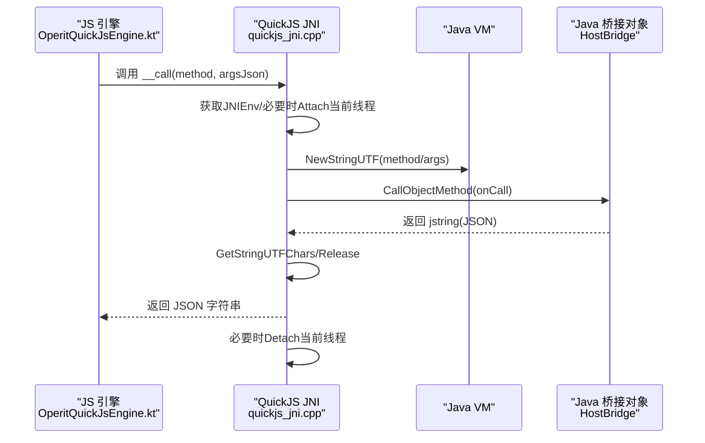
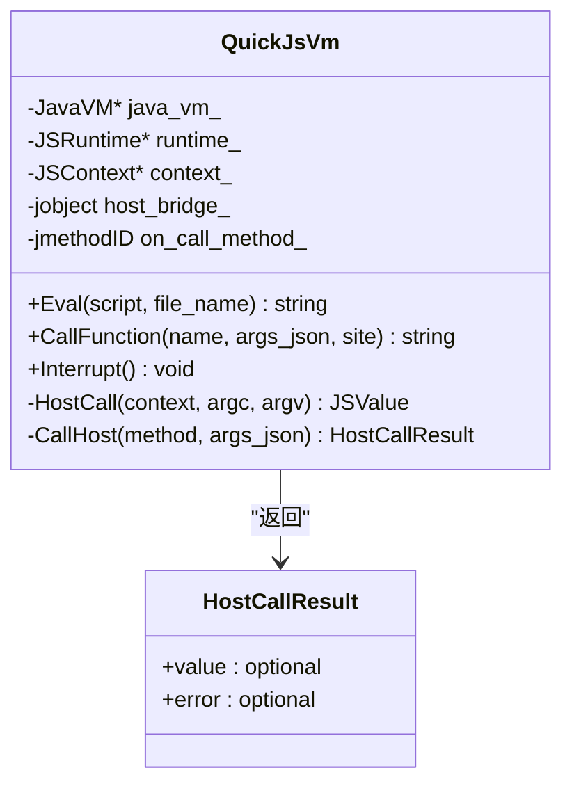
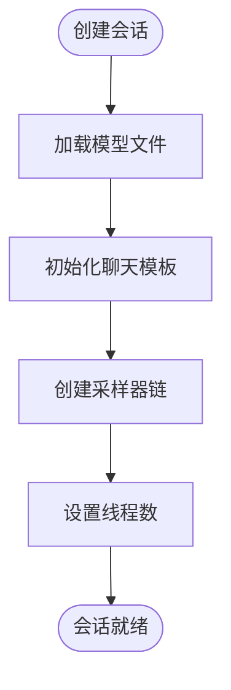
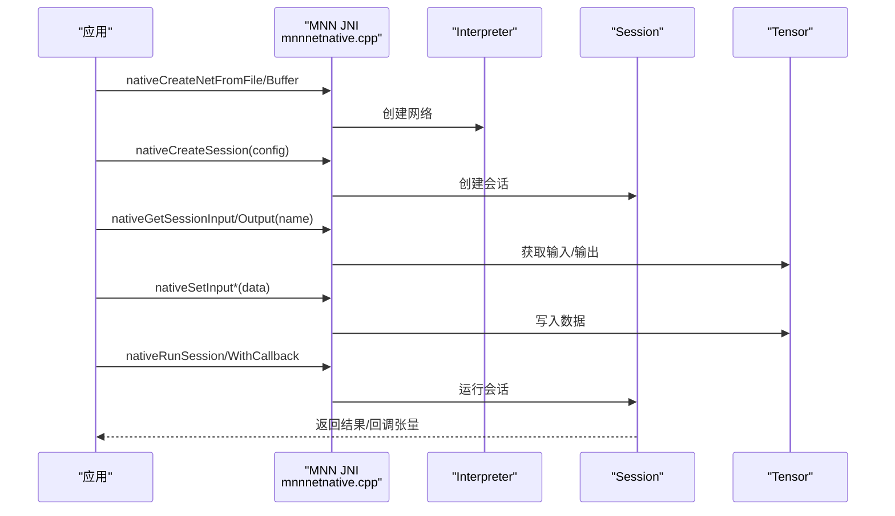
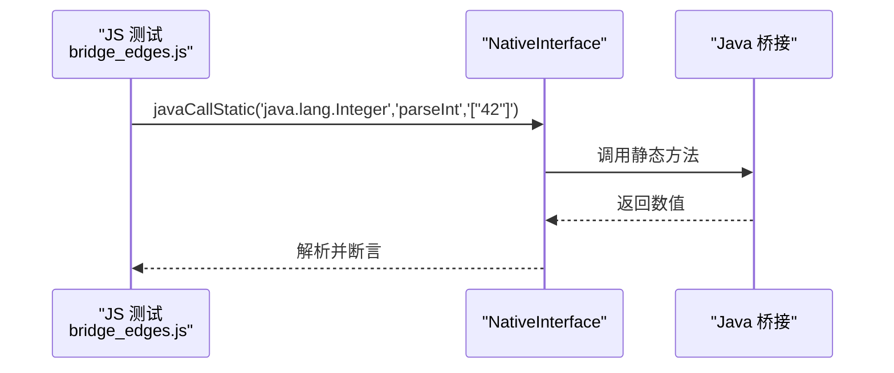
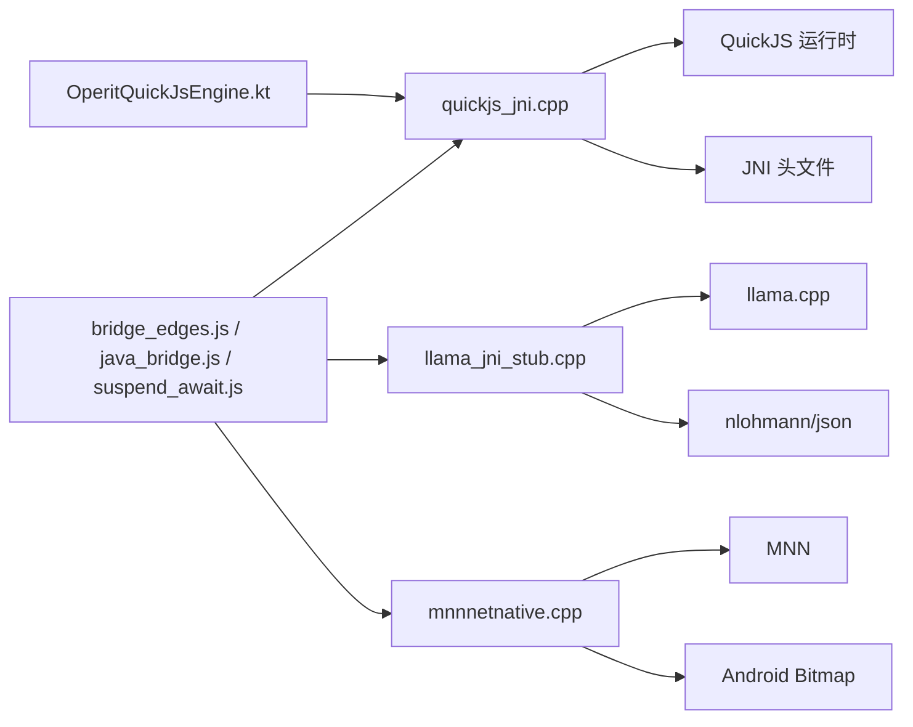

# JNI 桥接开发

<cite>
**本文档引用的文件**
- [quickjs_jni.cpp](file://quickjs/src/main/cpp/quickjs_jni.cpp)
- [OperitQuickJsEngine.kt](file://quickjs/src/main/java/com/ai/assistance/operit/core/tools/javascript/OperitQuickJsEngine.kt)
- [llama_jni_stub.cpp](file://llama/src/main/cpp/llama_jni_stub.cpp)
- [fbx_jni.cpp](file://fbx/src/main/cpp/fbx_jni.cpp)
- [mnnnetnative.cpp](file://mnn/src/main/cpp/mnnnetnative.cpp)
- [bridge_edges.js](file://app/src/androidTest/js/com/ai/assistance/operit/core/tools/javascript/bridge_edges/bridge_edges.js)
- [java_bridge.js](file://examples/java_bridge.js)
- [suspend_await.js](file://app/src/androidTest/js/com/ai/assistance/operit/core/tools/javascript/bridge_contract/suspend_await.js)
- [GLObject.h](file://mmd/src/main/cpp/Saba/GL/GLObject.h)
- [Operit 沙箱执行系统设计思想与详细流程分析.md](file://my_docs/Operit 沙箱执行系统设计思想与详细流程分析.md)
</cite>

## 目录
1. [引言](#引言)
2. [项目结构](#项目结构)
3. [核心组件](#核心组件)
4. [架构总览](#架构总览)
5. [详细组件分析](#详细组件分析)
6. [依赖关系分析](#依赖关系分析)
7. [性能考虑](#性能考虑)
8. [故障排查指南](#故障排查指南)
9. [结论](#结论)
10. [附录](#附录)

## 引言
本文件面向 C++ 开发者，系统性梳理 Operit 项目中的 JNI 桥接开发实践，覆盖 Java 与 C++ 数据类型映射、对象生命周期管理、内存分配与释放策略、JNI 方法注册与动态库加载、异常处理与错误传播、本地方法签名设计、参数验证与返回值处理、线程安全与性能优化、资源管理、回调机制实现与调试技巧。文档以代码为依据，结合测试用例与架构文档，帮助开发者在 Android 平台上构建稳定高效的 JNI 桥接层。

## 项目结构
Operit 在多个模块中实现了 JNI 桥接：
- QuickJS 模块：通过 JNI 将 C++ 的 QuickJS 运行时暴露给 Java，并提供“原生接口”供 JS 调用 Java。
- LLaMA 模块：LLM 推理的 JNI 接口，包含会话创建、采样参数设置、流式生成等。
- FBX 模块：3D 模型加载与预览的 JNI 辅助逻辑（错误信息、路径处理等）。
- MNN 模块：神经网络推理的 JNI 接口，涉及 Tensor 与 Bitmap 的互转。
- 应用层桥接测试：通过 JavaScript 测试用例验证 Java 侧桥接能力（静态方法、实例方法、字段访问、Map/List 转换等）。

**图表来源**
- [quickjs_jni.cpp:736-800](file://quickjs/src/main/cpp/quickjs_jni.cpp#L736-L800)
- [OperitQuickJsEngine.kt:1-178](file://quickjs/src/main/java/com/ai/assistance/operit/core/tools/javascript/OperitQuickJsEngine.kt#L1-L178)
- [llama_jni_stub.cpp:648-800](file://llama/src/main/cpp/llama_jni_stub.cpp#L648-L800)
- [fbx_jni.cpp:1-200](file://fbx/src/main/cpp/fbx_jni.cpp#L1-L200)
- [mnnnetnative.cpp:17-451](file://mnn/src/main/cpp/mnnnetnative.cpp#L17-L451)
- [bridge_edges.js:403-433](file://app/src/androidTest/js/com/ai/assistance/operit/core/tools/javascript/bridge_edges/bridge_edges.js#L403-L433)
- [java_bridge.js:187-221](file://examples/java_bridge.js#L187-L221)
- [suspend_await.js:103-137](file://app/src/androidTest/js/com/ai/assistance/operit/core/tools/javascript/bridge_contract/suspend_await.js#L103-L137)

**章节来源**
- [quickjs_jni.cpp:1-865](file://quickjs/src/main/cpp/quickjs_jni.cpp#L1-L865)
- [OperitQuickJsEngine.kt:1-178](file://quickjs/src/main/java/com/ai/assistance/operit/core/tools/javascript/OperitQuickJsEngine.kt#L1-L178)
- [llama_jni_stub.cpp:1-800](file://llama/src/main/cpp/llama_jni_stub.cpp#L1-L800)
- [fbx_jni.cpp:1-800](file://fbx/src/main/cpp/fbx_jni.cpp#L1-L800)
- [mnnnetnative.cpp:1-451](file://mnn/src/main/cpp/mnnnetnative.cpp#L1-L451)
- [bridge_edges.js:403-715](file://app/src/androidTest/js/com/ai/assistance/operit/core/tools/javascript/bridge_edges/bridge_edges.js#L403-L715)
- [java_bridge.js:187-221](file://examples/java_bridge.js#L187-L221)
- [suspend_await.js:103-137](file://app/src/androidTest/js/com/ai/assistance/operit/core/tools/javascript/bridge_contract/suspend_await.js#L103-L137)

## 核心组件
- QuickJS JNI 桥接：提供 JS 调用 Java 的通道，支持字符串参数、JSON 参数解析、异常捕获与回传、线程附加与分离。
- LLaMA JNI Stub：提供模型加载、会话创建、采样参数设置、模板应用、工具调用语法化等接口。
- FBX 工具函数：路径规范化、错误信息收集、外部文件解析等辅助逻辑。
- MNN JNI：模型加载、会话创建、输入输出张量设置与读取、图像处理转换、Bitmap 互转。
- Kotlin 引擎封装：统一 JS 执行、线程调度、方法缓存、参数解码与类型转换。
- 应用层桥接测试：覆盖静态方法调用、实例方法调用、静态字段访问、Map/List 结果归一化、挂起方法调用等。

**章节来源**
- [quickjs_jni.cpp:270-331](file://quickjs/src/main/cpp/quickjs_jni.cpp#L270-L331)
- [llama_jni_stub.cpp:365-448](file://llama/src/main/cpp/llama_jni_stub.cpp#L365-L448)
- [fbx_jni.cpp:29-44](file://fbx/src/main/cpp/fbx_jni.cpp#L29-L44)
- [mnnnetnative.cpp:17-451](file://mnn/src/main/cpp/mnnnetnative.cpp#L17-L451)
- [OperitQuickJsEngine.kt:13-178](file://quickjs/src/main/java/com/ai/assistance/operit/core/tools/javascript/OperitQuickJsEngine.kt#L13-L178)
- [bridge_edges.js:403-715](file://app/src/androidTest/js/com/ai/assistance/operit/core/tools/javascript/bridge_edges/bridge_edges.js#L403-L715)
- [suspend_await.js:103-137](file://app/src/androidTest/js/com/ai/assistance/operit/core/tools/javascript/bridge_contract/suspend_await.js#L103-L137)

## 架构总览
JNI 桥接在项目中的位置与交互如下：

**图表来源**
- [quickjs_jni.cpp:576-642](file://quickjs/src/main/cpp/quickjs_jni.cpp#L576-L642)
- [OperitQuickJsEngine.kt:103-111](file://quickjs/src/main/java/com/ai/assistance/operit/core/tools/javascript/OperitQuickJsEngine.kt#L103-L111)

**章节来源**
- [quickjs_jni.cpp:508-546](file://quickjs/src/main/cpp/quickjs_jni.cpp#L508-L546)
- [OperitQuickJsEngine.kt:94-111](file://quickjs/src/main/java/com/ai/assistance/operit/core/tools/javascript/OperitQuickJsEngine.kt#L94-L111)

## 详细组件分析

### QuickJS JNI 组件分析
- 设计要点
  - 使用全局引用持有 Java 桥接对象，避免 GC 回收导致悬挂引用。
  - 通过 C 函数包装器暴露到 QuickJS，统一参数解析与返回值序列化。
  - 对 JNI 字符串进行 UTF-8 到 UTF-16 的转换（如需），并正确释放。
  - 捕获并描述 Java 异常链，形成可读的错误消息。
  - 支持中断标记，配合 JS 运行时的中断回调。
- 关键流程
  - 安装 NativeInterface 到 JS 全局对象，暴露 __call 方法。
  - JS 调用 __call 后，C++ 从 JNI 获取当前线程的 JNIEnv，必要时 Attach。
  - 调用 Java onCall(String, String)，接收返回的 JSON 字符串。
  - 将返回值转换为 JS 字符串或 null，并在异常时抛出内部错误。
  - 释放局部引用与必要时 Detach 当前线程。

**图表来源**
- [quickjs_jni.cpp:270-331](file://quickjs/src/main/cpp/quickjs_jni.cpp#L270-L331)
- [quickjs_jni.cpp:576-642](file://quickjs/src/main/cpp/quickjs_jni.cpp#L576-L642)

**章节来源**
- [quickjs_jni.cpp:270-331](file://quickjs/src/main/cpp/quickjs_jni.cpp#L270-L331)
- [quickjs_jni.cpp:567-598](file://quickjs/src/main/cpp/quickjs_jni.cpp#L567-L598)
- [quickjs_jni.cpp:576-642](file://quickjs/src/main/cpp/quickjs_jni.cpp#L576-L642)
- [quickjs_jni.cpp:168-263](file://quickjs/src/main/cpp/quickjs_jni.cpp#L168-L263)

### LLaMA JNI 组件分析
- 设计要点
  - 条件编译：根据是否启用 llama.cpp，决定导出可用性与具体实现。
  - 会话结构体：封装模型、上下文、采样器、聊天模板、工具调用语法配置等。
  - 采样器链：温度、TopK、TopP、重复惩罚、频率/存在惩罚、语法化采样器组合。
  - 线程与取消：Abort 回调用于取消生成；日志打印便于调试。
- 关键流程
  - 创建会话：加载模型、初始化聊天模板、创建采样器链、设置线程数。
  - 设置采样参数：更新采样器链参数并重建采样器。
  - 生成流式输出：将分片回调转发到 Java 层。
  - 工具调用语法：设置/清除工具调用语法化规则。

**图表来源**
- [llama_jni_stub.cpp:661-780](file://llama/src/main/cpp/llama_jni_stub.cpp#L661-L780)
- [llama_jni_stub.cpp:417-448](file://llama/src/main/cpp/llama_jni_stub.cpp#L417-L448)

**章节来源**
- [llama_jni_stub.cpp:365-448](file://llama/src/main/cpp/llama_jni_stub.cpp#L365-L448)
- [llama_jni_stub.cpp:661-780](file://llama/src/main/cpp/llama_jni_stub.cpp#L661-L780)

### MNN JNI 组件分析
- 设计要点
  - 模型与会话：从文件/缓冲区创建 Interpreter，创建 Session。
  - 输入输出：获取输入/输出 Tensor，设置维度与数据，复制到主机张量。
  - 图像处理：将字节数组或 Bitmap 转换为 Tensor，支持矩阵、均值/方差归一化。
  - 线程安全：JNI 调用中注意数组元素的获取/释放顺序，避免悬挂指针。
- 关键流程
  - 创建网络：从文件或缓冲区创建 Interpreter。
  - 创建会话：配置前向类型、线程数、保存/输出张量名称。
  - 运行会话：同步/回调方式运行，回调中复制指定张量到用户地址。
  - 读取张量：根据类型选择 getIntData/getFloatData/getUINT8Data。

**图表来源**
- [mnnnetnative.cpp:17-451](file://mnn/src/main/cpp/mnnnetnative.cpp#L17-L451)

**章节来源**
- [mnnnetnative.cpp:17-451](file://mnn/src/main/cpp/mnnnetnative.cpp#L17-L451)

### 应用层桥接测试与验证
- 静态方法调用：验证 Java.lang.Integer.parseInt 通过 JS 调用桥接成功。
- 实例方法调用：先创建 java.io.File 实例，再调用 getName。
- 静态字段访问：获取 Integer.MAX_VALUE 并断言。
- Map/List 归一化：JSONObject.toMap 返回普通对象；List 归一化为 JS 数组。
- 挂起方法调用：对非挂起方法拒绝并给出明确错误信息。

**图表来源**
- [bridge_edges.js:403-433](file://app/src/androidTest/js/com/ai/assistance/operit/core/tools/javascript/bridge_edges/bridge_edges.js#L403-L433)

**章节来源**
- [bridge_edges.js:403-715](file://app/src/androidTest/js/com/ai/assistance/operit/core/tools/javascript/bridge_edges/bridge_edges.js#L403-L715)
- [suspend_await.js:103-137](file://app/src/androidTest/js/com/ai/assistance/operit/core/tools/javascript/bridge_contract/suspend_await.js#L103-L137)
- [java_bridge.js:187-221](file://examples/java_bridge.js#L187-L221)

### FBX 工具函数与资源管理
- 错误信息管理：全局互斥锁保护最后错误字符串，提供 SetLastError/GetLastError/ClearLastError。
- 路径处理：规范化路径、判断绝对路径、拼接路径、提取目录名与无扩展名基名。
- 外部文件解析：根据相对/绝对/解析路径生成显示路径与最终解析路径，检查文件是否存在。
- 动画名称标准化：去除空白，若重复则追加序号。
- 场景检查：统计动画名称、持续时间、所需外部文件与缺失文件列表，生成 JSON。

**章节来源**
- [fbx_jni.cpp:29-44](file://fbx/src/main/cpp/fbx_jni.cpp#L29-L44)
- [fbx_jni.cpp:166-171](file://fbx/src/main/cpp/fbx_jni.cpp#L166-L171)
- [fbx_jni.cpp:178-219](file://fbx/src/main/cpp/fbx_jni.cpp#L178-L219)
- [fbx_jni.cpp:253-320](file://fbx/src/main/cpp/fbx_jni.cpp#L253-L320)

### OpenGL 资源管理（参考）
- GLObject/GLRef：模板化封装 OpenGL 对象生命周期，自动销毁；引用计数与原子操作保证线程安全。
- 适用于纹理、缓冲、着色器、程序、帧缓冲等资源的创建、释放与共享。

**章节来源**
- [GLObject.h:134-208](file://mmd/src/main/cpp/Saba/GL/GLObject.h#L134-L208)
- [GLObject.h:211-388](file://mmd/src/main/cpp/Saba/GL/GLObject.h#L211-L388)

## 依赖关系分析
- QuickJS JNI 依赖 QuickJS 运行时与 JNI 头文件；通过 JavaVM 获取 JNIEnv，必要时 Attach/Detach。
- LLaMA JNI 依赖 llama.cpp 子模块与 JSON 库；条件编译控制可用性。
- MNN JNI 依赖 MNN 推理框架与图像处理库；与 Android Bitmap 互转。
- Kotlin 引擎封装依赖 JS 运行时、线程池与 JSON 解析库；负责方法缓存与参数类型转换。
- 应用层桥接测试依赖 JavaScript 测试框架与 Java 桥接对象。

**图表来源**
- [quickjs_jni.cpp:1-11](file://quickjs/src/main/cpp/quickjs_jni.cpp#L1-L11)
- [llama_jni_stub.cpp:11-21](file://llama/src/main/cpp/llama_jni_stub.cpp#L11-L21)
- [mnnnetnative.cpp:9-16](file://mnn/src/main/cpp/mnnnetnative.cpp#L9-L16)
- [OperitQuickJsEngine.kt:1-12](file://quickjs/src/main/java/com/ai/assistance/operit/core/tools/javascript/OperitQuickJsEngine.kt#L1-L12)
- [bridge_edges.js:403-433](file://app/src/androidTest/js/com/ai/assistance/operit/core/tools/javascript/bridge_edges/bridge_edges.js#L403-L433)
- [java_bridge.js:187-221](file://examples/java_bridge.js#L187-L221)
- [suspend_await.js:103-137](file://app/src/androidTest/js/com/ai/assistance/operit/core/tools/javascript/bridge_contract/suspend_await.js#L103-L137)

**章节来源**
- [quickjs_jni.cpp:1-11](file://quickjs/src/main/cpp/quickjs_jni.cpp#L1-L11)
- [llama_jni_stub.cpp:11-21](file://llama/src/main/cpp/llama_jni_stub.cpp#L11-L21)
- [mnnnetnative.cpp:9-16](file://mnn/src/main/cpp/mnnnetnative.cpp#L9-L16)
- [OperitQuickJsEngine.kt:1-12](file://quickjs/src/main/java/com/ai/assistance/operit/core/tools/javascript/OperitQuickJsEngine.kt#L1-L12)

## 性能考虑
- 线程模型
  - QuickJS JNI 在调用 Java 前检查当前线程是否已附加，必要时 Attach 并在完成后 Detach，避免线程泄漏。
  - Kotlin 引擎使用单线程执行器保证 JS 运行时线程安全，定时器回调在运行时线程执行。
- 内存管理
  - JNI 字符串与数组元素必须成对获取/释放，避免内存泄漏。
  - 全局引用仅在必要时创建，使用后及时 DeleteGlobalRef。
  - QuickJS 中对 JSValue 的生命周期严格管理，使用 JS_FreeValue 释放。
- I/O 与计算
  - LLaMA 会话创建时设置线程数、批大小、UBatch 等参数，平衡吞吐与延迟。
  - MNN 图像处理使用矩阵与归一化参数，减少额外拷贝。
- 调试与可观测性
  - 日志宏（LOGD/LOGI/LOGE）记录关键路径与参数。
  - QuickJS 提供异常属性读取与堆栈信息，便于定位问题。

**章节来源**
- [quickjs_jni.cpp:581-641](file://quickjs/src/main/cpp/quickjs_jni.cpp#L581-L641)
- [OperitQuickJsEngine.kt:18-30](file://quickjs/src/main/java/com/ai/assistance/operit/core/tools/javascript/OperitQuickJsEngine.kt#L18-L30)
- [llama_jni_stub.cpp:675-780](file://llama/src/main/cpp/llama_jni_stub.cpp#L675-L780)
- [mnnnetnative.cpp:345-393](file://mnn/src/main/cpp/mnnnetnative.cpp#L345-L393)

## 故障排查指南
- JNI 字符串与数组元素
  - 必须在使用后释放，避免内存泄漏；注意 GetStringUTFChars/ReleaseStringUTFChars 与 Get/ReleaseByteArrayElements 的配对。
- 异常处理
  - 使用 TakeJavaExceptionMessage 捕获并描述 Java 异常链；在调用 Java 方法前后检查 ExceptionCheck/ExceptionOccurred。
- 线程附加
  - 若 GetEnv 返回非 JNI_OK，使用 AttachCurrentThread 获取 JNIEnv；完成后 DetachCurrentThread。
- 资源释放
  - 全局引用 DeleteGlobalRef；局部引用 DeleteLocalRef；JSValue JS_FreeValue；OpenGL 对象通过 GLObject/GLRef 自动销毁。
- 回调与挂起方法
  - 挂起方法调用需确保目标方法声明为 suspend；否则测试用例会拒绝并提示详细信息。

**章节来源**
- [quickjs_jni.cpp:152-166](file://quickjs/src/main/cpp/quickjs_jni.cpp#L152-L166)
- [quickjs_jni.cpp:256-263](file://quickjs/src/main/cpp/quickjs_jni.cpp#L256-L263)
- [quickjs_jni.cpp:581-641](file://quickjs/src/main/cpp/quickjs_jni.cpp#L581-L641)
- [GLObject.h:162-208](file://mmd/src/main/cpp/Saba/GL/GLObject.h#L162-L208)
- [suspend_await.js:115-135](file://app/src/androidTest/js/com/ai/assistance/operit/core/tools/javascript/bridge_contract/suspend_await.js#L115-L135)

## 结论
Operit 的 JNI 桥接实践体现了以下关键原则：
- 明确的数据类型映射与严格的生命周期管理；
- 完善的异常捕获与错误传播；
- 线程安全与资源释放的细节把控；
- 通过测试用例验证桥接行为的一致性；
- 在性能与可维护性之间取得平衡。

这些经验可作为新 JNI 接口开发的参考范式。

## 附录
- JNI 方法注册与动态库加载
  - 通过标准 JNI 导出函数（如 nativeCreate/nativeEvaluate）实现方法注册；动态库由 Gradle/NDK 构建并打包。
- 最佳实践清单
  - 参数校验：空指针检查、长度检查、类型匹配。
  - 返回值处理：统一 JSON 包装，错误与成功分支清晰分离。
  - 回调机制：在 C++ 中通过 JNI 调用 Java 回调，注意线程切换与异常处理。
  - 调试技巧：启用日志宏、捕获异常链、记录最近宿主调用轨迹、使用测试用例覆盖边界场景。