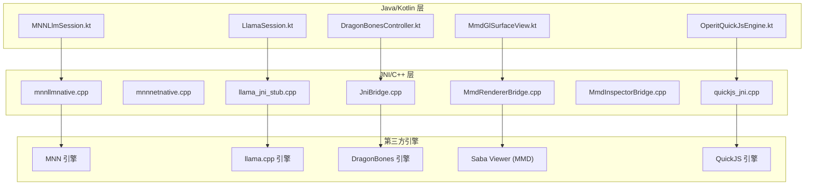
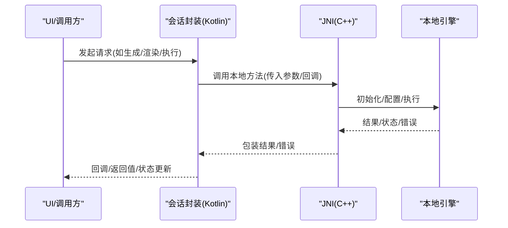
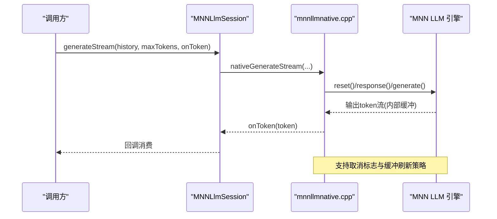
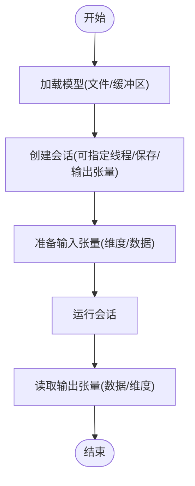
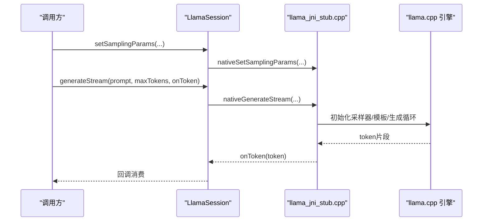
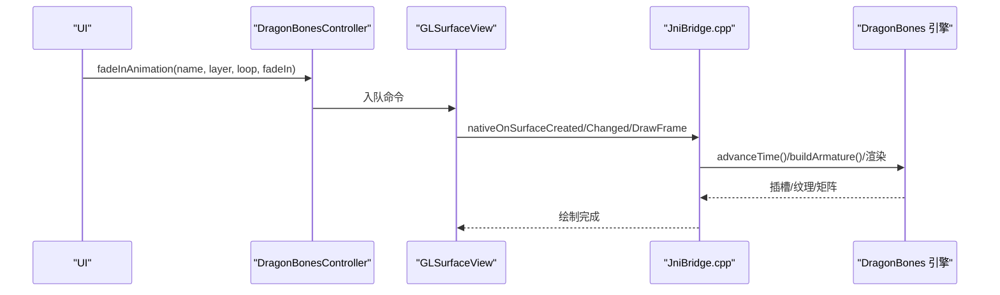
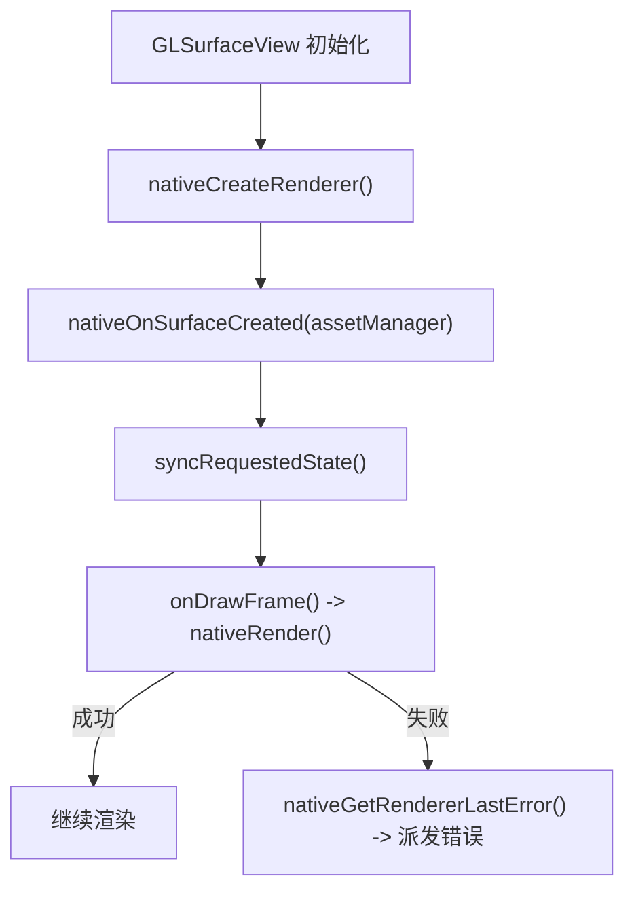
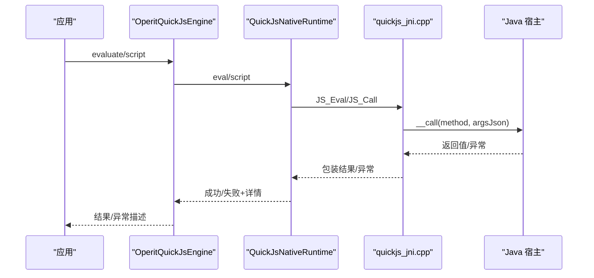
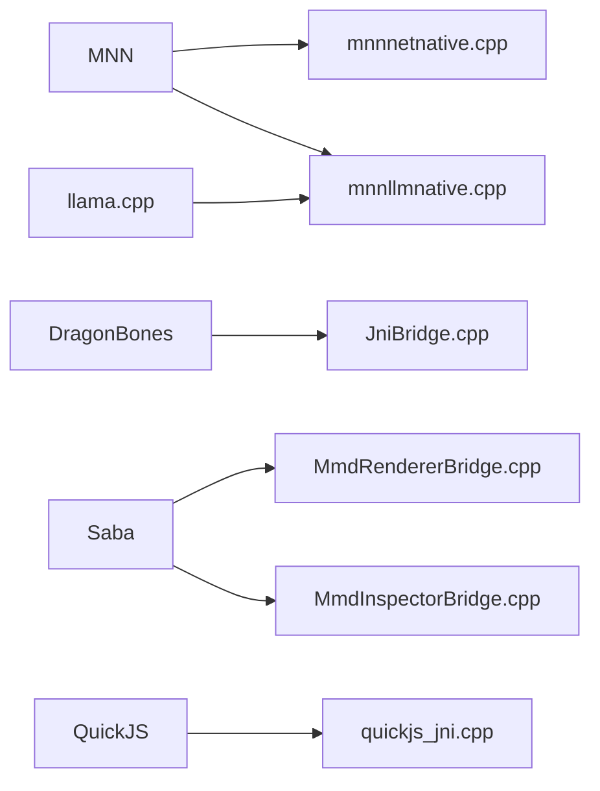

# 具体模块实现

<cite>
**本文引用的文件**
- [mnnllmnative.cpp](file://mnn/src/main/cpp/mnnllmnative.cpp)
- [MNNLlmSession.kt](file://mnn/src/main/java/com/ai/assistance/mnn/MNNLlmSession.kt)
- [mnnnetnative.cpp](file://mnn/src/main/cpp/mnnnetnative.cpp)
- [llama_jni_stub.cpp](file://llama/src/main/cpp/llama_jni_stub.cpp)
- [LlamaSession.kt](file://llama/src/main/java/com/ai/assistance/llama/LlamaSession.kt)
- [JniBridge.cpp](file://dragonbones/cpp/JniBridge.cpp)
- [DragonBonesController.kt](file://dragonbones/src/main/java/com/dragonbones/DragonBonesController.kt)
- [MmdNative.kt](file://mmd/src/main/java/com/ai/assistance/mmd/MmdNative.kt)
- [MmdGlSurfaceView.kt](file://mmd/src/main/java/com/ai/assistance/mmd/MmdGlSurfaceView.kt)
- [MmdRendererBridge.cpp](file://mmd/src/main/cpp/android/MmdRendererBridge.cpp)
- [MmdInspectorBridge.cpp](file://mmd/src/main/cpp/android/MmdInspectorBridge.cpp)
- [quickjs_jni.cpp](file://quickjs/src/main/cpp/quickjs_jni.cpp)
- [OperitQuickJsEngine.kt](file://quickjs/src/main/java/com/ai/assistance/operit/core/tools/javascript/OperitQuickJsEngine.kt)
</cite>

## 目录
1. [简介](#简介)
2. [项目结构](#项目结构)
3. [核心组件](#核心组件)
4. [架构总览](#架构总览)
5. [详细组件分析](#详细组件分析)
6. [依赖关系分析](#依赖关系分析)
7. [性能考量](#性能考量)
8. [故障排查指南](#故障排查指南)
9. [结论](#结论)
10. [附录](#附录)

## 简介
本文件聚焦 Operit 项目中的四个具体本地模块：MNN 模型推理引擎（含 LLM 与通用网络）、llama.cpp 本地大语言模型、DragonBones 2D 动画渲染、MMD 模型加载与骨骼绑定、QuickJS 脚本引擎执行环境。文档从架构、数据流、处理逻辑、集成方式、状态管理、资源清理、错误处理与性能优化等维度进行系统化梳理，并提供扩展指南与最佳实践。

## 项目结构
- 模块划分清晰，每个子模块均包含：
  - Java/Kotlin 层：对外 API、会话封装、生命周期管理
  - C++/JNI 层：底层引擎桥接、资源分配与释放、线程与回调
  - 第三方库：MNN、llama.cpp、DragonBones、Saba（MMD）等
- 关键交互路径：
  - Java/Kotlin → JNI → C++ 引擎 → OpenGL/GLSurfaceView（动画/模型）
  - Java/Kotlin → JNI → C++ 引擎 → 回调/流式输出（LLM）

图示来源
- [MNNLlmSession.kt:1-433](file://mnn/src/main/java/com/ai/assistance/mnn/MNNLlmSession.kt#L1-L433)
- [LlamaSession.kt:1-187](file://llama/src/main/java/com/ai/assistance/llama/LlamaSession.kt#L1-L187)
- [DragonBonesController.kt:1-218](file://dragonbones/src/main/java/com/dragonbones/DragonBonesController.kt#L1-L218)
- [MmdGlSurfaceView.kt:1-303](file://mmd/src/main/java/com/ai/assistance/mmd/MmdGlSurfaceView.kt#L1-L303)
- [OperitQuickJsEngine.kt:1-178](file://quickjs/src/main/java/com/ai/assistance/operit/core/tools/javascript/OperitQuickJsEngine.kt#L1-L178)
- [mnnllmnative.cpp:1-800](file://mnn/src/main/cpp/mnnllmnative.cpp#L1-L800)
- [mnnnetnative.cpp:1-451](file://mnn/src/main/cpp/mnnnetnative.cpp#L1-L451)
- [llama_jni_stub.cpp:1-800](file://llama/src/main/cpp/llama_jni_stub.cpp#L1-L800)
- [JniBridge.cpp:1-684](file://dragonbones/cpp/JniBridge.cpp#L1-L684)
- [MmdRendererBridge.cpp:1-370](file://mmd/src/main/cpp/android/MmdRendererBridge.cpp#L1-L370)
- [MmdInspectorBridge.cpp:1-436](file://mmd/src/main/cpp/android/MmdInspectorBridge.cpp#L1-L436)
- [quickjs_jni.cpp:1-865](file://quickjs/src/main/cpp/quickjs_jni.cpp#L1-L865)

章节来源
- [MNNLlmSession.kt:1-433](file://mnn/src/main/java/com/ai/assistance/mnn/MNNLlmSession.kt#L1-L433)
- [LlamaSession.kt:1-187](file://llama/src/main/java/com/ai/assistance/llama/LlamaSession.kt#L1-L187)
- [DragonBonesController.kt:1-218](file://dragonbones/src/main/java/com/dragonbones/DragonBonesController.kt#L1-L218)
- [MmdGlSurfaceView.kt:1-303](file://mmd/src/main/java/com/ai/assistance/mmd/MmdGlSurfaceView.kt#L1-L303)
- [OperitQuickJsEngine.kt:1-178](file://quickjs/src/main/java/com/ai/assistance/operit/core/tools/javascript/OperitQuickJsEngine.kt#L1-L178)

## 核心组件
- MNN LLM 会话与推理
  - Java 封装：MNNLlmSession 提供配置、模板应用、token 计数、非流式/流式生成、取消、重置、音频回调等能力
  - JNI/C++：mnnllmnative.cpp 实现 LLM 实例创建、配置设置、模型加载、分词/反分词、流式生成、取消标志、音频回调桥接
- MNN 通用网络推理
  - JNI：mnnnetnative.cpp 提供模型文件/缓冲区加载、会话创建、输入输出张量访问、图像处理转换、运行会话等
- llama.cpp 本地大语言模型
  - Java 封装：LlamaSession 提供会话创建、采样参数设置、模板应用、工具调用语法、流式生成、取消与释放
  - JNI/C++：llama_jni_stub.cpp 实现会话生命周期、采样器链构建、模板解析、工具调用语法、流式回调
- DragonBones 2D 动画渲染
  - Java 控制：DragonBonesController 提供动画队列、缩放/平移、骨骼覆盖/重置、点击反馈
  - JNI/C++：JniBridge.cpp 实现工厂/骨架/时钟管理、OpenGL 初始化、帧推进与绘制、动画控制
- MMD 模型加载与骨骼绑定
  - Java 控制：MmdGlSurfaceView 通过 NativeMmdRenderer 统一管理渲染器句柄、状态同步与错误派发
  - JNI/C++：MmdRendererBridge.cpp 实现 Viewer 生命周期、模型/动画设置、相机参数；MmdInspectorBridge.cpp 实现模型/动作解析与统计
- QuickJS 脚本引擎执行环境
  - Java 封装：OperitQuickJsEngine 提供运行时线程隔离、宿主接口绑定、JSON 参数解码、异常描述、中断与清理
  - JNI/C++：quickjs_jni.cpp 实现 VM/Context 创建与销毁、JS 评估/函数调用、宿主桥接、异常包装与执行跟踪

章节来源
- [mnnllmnative.cpp:1-800](file://mnn/src/main/cpp/mnnllmnative.cpp#L1-L800)
- [MNNLlmSession.kt:1-433](file://mnn/src/main/java/com/ai/assistance/mnn/MNNLlmSession.kt#L1-L433)
- [mnnnetnative.cpp:1-451](file://mnn/src/main/cpp/mnnnetnative.cpp#L1-L451)
- [llama_jni_stub.cpp:1-800](file://llama/src/main/cpp/llama_jni_stub.cpp#L1-L800)
- [LlamaSession.kt:1-187](file://llama/src/main/java/com/ai/assistance/llama/LlamaSession.kt#L1-L187)
- [JniBridge.cpp:1-684](file://dragonbones/cpp/JniBridge.cpp#L1-L684)
- [DragonBonesController.kt:1-218](file://dragonbones/src/main/java/com/dragonbones/DragonBonesController.kt#L1-L218)
- [MmdNative.kt:1-62](file://mmd/src/main/java/com/ai/assistance/mmd/MmdNative.kt#L1-L62)
- [MmdGlSurfaceView.kt:1-303](file://mmd/src/main/java/com/ai/assistance/mmd/MmdGlSurfaceView.kt#L1-L303)
- [MmdRendererBridge.cpp:1-370](file://mmd/src/main/cpp/android/MmdRendererBridge.cpp#L1-L370)
- [MmdInspectorBridge.cpp:1-436](file://mmd/src/main/cpp/android/MmdInspectorBridge.cpp#L1-L436)
- [quickjs_jni.cpp:1-865](file://quickjs/src/main/cpp/quickjs_jni.cpp#L1-L865)
- [OperitQuickJsEngine.kt:1-178](file://quickjs/src/main/java/com/ai/assistance/operit/core/tools/javascript/OperitQuickJsEngine.kt#L1-L178)

## 架构总览
- 会话与状态管理
  - 所有本地模块均采用“句柄 + JNI”模式管理底层资源，Java 层通过单例/静态方法或会话类持有指针，确保生命周期可控
  - 取消/中断：LLM 与 QuickJS 均提供中断/取消机制，避免长时间阻塞
- 数据流与回调
  - LLM：Java 回调/流式输出 → JNI → C++ 流缓冲 → 分词片段回调
  - 动画/模型：Java 控制命令 → JNI → C++ 渲染器 → OpenGL 帧推进与绘制
  - 脚本：Java 宿主方法 → JNI → C++ 宿主桥接 → JS 引擎执行
- 错误处理
  - 多数模块在 JNI 层维护 lastError 并通过 Java 方法暴露，便于上层统一处理
  - QuickJS 提供异常属性提取与堆栈封装，便于定位问题

图示来源
- [MNNLlmSession.kt:214-286](file://mnn/src/main/java/com/ai/assistance/mnn/MNNLlmSession.kt#L214-L286)
- [mnnllmnative.cpp:544-576](file://mnn/src/main/cpp/mnnllmnative.cpp#L544-L576)
- [LlamaSession.kt:65-79](file://llama/src/main/java/com/ai/assistance/llama/LlamaSession.kt#L65-L79)
- [llama_jni_stub.cpp:320-328](file://llama/src/main/cpp/llama_jni_stub.cpp#L320-L328)
- [MmdGlSurfaceView.kt:254-271](file://mmd/src/main/java/com/ai/assistance/mmd/MmdGlSurfaceView.kt#L254-L271)
- [MmdRendererBridge.cpp:181-200](file://mmd/src/main/cpp/android/MmdRendererBridge.cpp#L181-L200)
- [OperitQuickJsEngine.kt:38-63](file://quickjs/src/main/java/com/ai/assistance/operit/core/tools/javascript/OperitQuickJsEngine.kt#L38-L63)
- [quickjs_jni.cpp:768-799](file://quickjs/src/main/cpp/quickjs_jni.cpp#L768-L799)

## 详细组件分析

### MNN LLM 会话与推理
- 初始化流程
  - Java：读取 llm_config.json，按顺序设置 tmp_path、async、精度、内存、后端、线程数等配置，随后加载模型
  - JNI：创建 LLM 实例（不立即加载），设置配置，再调用 load
- 生成流程（流式）
  - Java：构造历史/结构化消息，注册 onToken 回调
  - JNI：建立回调流缓冲，按 UTF-8 完整字符切片，遇到换行/标点/结束标记或缓冲阈值触发回调
  - 支持取消：全局标志位 + 检查，及时中止生成
- 音频回调
  - 注册 AudioDataCallback，JNI 层在生成过程中将浮点波形数据回调到 Java
- 上下文统计
  - 提供 context info JSON，包含 token 计数、耗时、状态码等

图示来源
- [MNNLlmSession.kt:228-269](file://mnn/src/main/java/com/ai/assistance/mnn/MNNLlmSession.kt#L228-L269)
- [mnnllmnative.cpp:581-800](file://mnn/src/main/cpp/mnnllmnative.cpp#L581-L800)

章节来源
- [MNNLlmSession.kt:1-433](file://mnn/src/main/java/com/ai/assistance/mnn/MNNLlmSession.kt#L1-L433)
- [mnnllmnative.cpp:1-800](file://mnn/src/main/cpp/mnnllmnative.cpp#L1-L800)

### MNN 通用网络推理
- 能力概览
  - 从文件/缓冲区创建网络、创建会话、设置保存/输出张量名、运行会话、动态 reshape、输入输出张量数据读写、图像处理转换
- 图像处理
  - 支持多种源格式、目标格式、归一化/均值、滤波/边界策略、仿射矩阵，将像素数据转换为张量

图示来源
- [mnnnetnative.cpp:17-451](file://mnn/src/main/cpp/mnnnetnative.cpp#L17-L451)

章节来源
- [mnnnetnative.cpp:1-451](file://mnn/src/main/cpp/mnnnetnative.cpp#L1-L451)

### llama.cpp 本地大语言模型
- 会话封装
  - 提供 nThreads/nCtx/nBatch/nUBatch/nGpuLayers/useMmap/flashAttention/kvUnified/offloadKqv 等配置
  - 支持采样参数设置、结构化模板应用、工具调用语法、流式生成、取消与释放
- 采样器链
  - 基于温度/TopK/TopP/重复惩罚/频率/存在性惩罚构建采样链，支持延迟语法采样

图示来源
- [LlamaSession.kt:140-165](file://llama/src/main/java/com/ai/assistance/llama/LlamaSession.kt#L140-L165)
- [llama_jni_stub.cpp:320-328](file://llama/src/main/cpp/llama_jni_stub.cpp#L320-L328)

章节来源
- [LlamaSession.kt:1-187](file://llama/src/main/java/com/ai/assistance/llama/LlamaSession.kt#L1-L187)
- [llama_jni_stub.cpp:1-800](file://llama/src/main/cpp/llama_jni_stub.cpp#L1-L800)

### DragonBones 2D 动画渲染
- 控制器
  - DragonBonesController 维护动画命令队列、缩放/平移、骨骼覆盖/重置、点击回调
- 渲染管线
  - JNI 初始化 OpenGL、创建着色器程序、构建投影矩阵、推进时间、遍历插槽绘制
  - 支持按层混合、淡入/停止动画、拾取检测

图示来源
- [DragonBonesController.kt:119-148](file://dragonbones/src/main/java/com/dragonbones/DragonBonesController.kt#L119-L148)
- [JniBridge.cpp:376-527](file://dragonbones/cpp/JniBridge.cpp#L376-L527)

章节来源
- [DragonBonesController.kt:1-218](file://dragonbones/src/main/java/com/dragonbones/DragonBonesController.kt#L1-L218)
- [JniBridge.cpp:1-684](file://dragonbones/cpp/JniBridge.cpp#L1-L684)

### MMD 模型加载与骨骼绑定
- 渲染器
  - MmdGlSurfaceView 通过 NativeMmdRenderer 统一管理渲染器句柄、状态同步（模型路径/动画/旋转/相机）与错误派发
  - 渲染循环：JNI 调用 Viewer::RenderFrame，失败则记录 lastError
- 检查器
  - MmdInspectorBridge 解析 PMD/PMX/VMD，输出模型/动作统计信息（顶点/面/材质/骨骼/形态/刚体/关节/IK 等）

图示来源
- [MmdGlSurfaceView.kt:232-291](file://mmd/src/main/java/com/ai/assistance/mmd/MmdGlSurfaceView.kt#L232-L291)
- [MmdRendererBridge.cpp:77-200](file://mmd/src/main/cpp/android/MmdRendererBridge.cpp#L77-L200)
- [MmdInspectorBridge.cpp:137-225](file://mmd/src/main/cpp/android/MmdInspectorBridge.cpp#L137-L225)

章节来源
- [MmdNative.kt:1-62](file://mmd/src/main/java/com/ai/assistance/mmd/MmdNative.kt#L1-L62)
- [MmdGlSurfaceView.kt:1-303](file://mmd/src/main/java/com/ai/assistance/mmd/MmdGlSurfaceView.kt#L1-L303)
- [MmdRendererBridge.cpp:1-370](file://mmd/src/main/cpp/android/MmdRendererBridge.cpp#L1-L370)
- [MmdInspectorBridge.cpp:1-436](file://mmd/src/main/cpp/android/MmdInspectorBridge.cpp#L1-L436)

### QuickJS 脚本引擎执行环境
- 运行时
  - OperitQuickJsEngine 在专用线程执行 JS，提供 eval/callFunction、中断、定时器派发、宿主接口绑定
  - JNI 层安装 NativeInterface.__call，将 JS 调用转发至 Java 宿主
- 异常与参数
  - 提取 JS 异常属性（message/stack/name/fileName/lineNumber/cause），封装为统一错误包
  - JSON 参数解码与类型转换，支持多态参数

图示来源
- [OperitQuickJsEngine.kt:38-101](file://quickjs/src/main/java/com/ai/assistance/operit/core/tools/javascript/OperitQuickJsEngine.kt#L38-L101)
- [quickjs_jni.cpp:736-800](file://quickjs/src/main/cpp/quickjs_jni.cpp#L736-L800)

章节来源
- [OperitQuickJsEngine.kt:1-178](file://quickjs/src/main/java/com/ai/assistance/operit/core/tools/javascript/OperitQuickJsEngine.kt#L1-L178)
- [quickjs_jni.cpp:1-865](file://quickjs/src/main/cpp/quickjs_jni.cpp#L1-L865)

## 依赖关系分析
- 模块内聚与耦合
  - 各模块 Java 层与 JNI 层职责清晰，JNI 仅负责桥接与资源管理，业务逻辑集中在 Java/Kotlin
  - QuickJS 通过宿主接口与应用解耦，便于扩展新的原生方法
- 外部依赖
  - MNN：推理引擎、图像处理
  - llama.cpp：本地 LLM 推理、采样器链、模板与工具调用语法
  - DragonBones：2D 动画时钟、骨架、OpenGL 插槽
  - Saba：MMD Viewer、相机/光照/阴影、模型/动作解析
  - QuickJS：轻量 JS 引擎与宿主桥接

图示来源
- [mnnnetnative.cpp:1-451](file://mnn/src/main/cpp/mnnnetnative.cpp#L1-L451)
- [mnnllmnative.cpp:1-800](file://mnn/src/main/cpp/mnnllmnative.cpp#L1-L800)
- [llama_jni_stub.cpp:1-800](file://llama/src/main/cpp/llama_jni_stub.cpp#L1-L800)
- [JniBridge.cpp:1-684](file://dragonbones/cpp/JniBridge.cpp#L1-L684)
- [MmdRendererBridge.cpp:1-370](file://mmd/src/main/cpp/android/MmdRendererBridge.cpp#L1-L370)
- [MmdInspectorBridge.cpp:1-436](file://mmd/src/main/cpp/android/MmdInspectorBridge.cpp#L1-L436)
- [quickjs_jni.cpp:1-865](file://quickjs/src/main/cpp/quickjs_jni.cpp#L1-L865)

章节来源
- [mnnnetnative.cpp:1-451](file://mnn/src/main/cpp/mnnnetnative.cpp#L1-L451)
- [mnnllmnative.cpp:1-800](file://mnn/src/main/cpp/mnnllmnative.cpp#L1-L800)
- [llama_jni_stub.cpp:1-800](file://llama/src/main/cpp/llama_jni_stub.cpp#L1-L800)
- [JniBridge.cpp:1-684](file://dragonbones/cpp/JniBridge.cpp#L1-L684)
- [MmdRendererBridge.cpp:1-370](file://mmd/src/main/cpp/android/MmdRendererBridge.cpp#L1-L370)
- [MmdInspectorBridge.cpp:1-436](file://mmd/src/main/cpp/android/MmdInspectorBridge.cpp#L1-L436)
- [quickjs_jni.cpp:1-865](file://quickjs/src/main/cpp/quickjs_jni.cpp#L1-L865)

## 性能考量
- 线程与并发
  - QuickJS 通过专用线程执行，避免阻塞主线程；LLM 与 MMD 渲染在 GL 线程中推进，减少跨线程数据拷贝
- 缓冲与刷新
  - LLM 流式输出按 UTF-8 完整字符切片，结合换行/标点/结束标记与阈值触发回调，平衡实时性与稳定性
- 资源复用
  - 会话级句柄复用，避免频繁创建销毁；OpenGL 程序与纹理在表面重建时清理并重建
- GPU 加速
  - LLM 与 MMD 均支持 GPU offload 与相机/纹理资源优化，需根据设备能力选择合适参数

## 故障排查指南
- 常见问题定位
  - MMD：nativeGetRendererLastError 返回错误字符串，逐项检查模型路径、动画名称、表面尺寸
  - LLM：检查配置顺序（先 setConfig 再 load）、取消标志、回调异常
  - QuickJS：查看异常详情 JSON 中的 fileName/lineNumber/stack/cause，确认宿主方法签名与参数类型
- 日志与诊断
  - 各模块 JNI 层使用 Android log 输出关键事件与错误，便于快速定位
  - MMD Inspector 提供模型/动作解析统计，辅助验证文件完整性

章节来源
- [MmdGlSurfaceView.kt:254-271](file://mmd/src/main/java/com/ai/assistance/mmd/MmdGlSurfaceView.kt#L254-L271)
- [MmdRendererBridge.cpp:27-58](file://mmd/src/main/cpp/android/MmdRendererBridge.cpp#L27-L58)
- [mnnllmnative.cpp:428-488](file://mnn/src/main/cpp/mnnllmnative.cpp#L428-L488)
- [quickjs_jni.cpp:663-713](file://quickjs/src/main/cpp/quickjs_jni.cpp#L663-L713)

## 结论
本文件系统梳理了 Operit 项目四大本地模块的实现要点：会话管理、初始化流程、配置参数、状态与资源管理、数据传递与回调、错误处理与性能优化。通过清晰的 Java/Kotlin 封装与 JNI/C++ 桥接，模块实现了高内聚、低耦合、可扩展的本地推理与渲染能力。建议在扩展新功能时遵循现有模式：先完善 Java API 与回调契约，再实现 JNI 桥接与引擎集成，最后补充日志与错误处理。

## 附录
- 扩展指南
  - 新增 LLM 模型：在 Java 层新增会话配置项，JNI 层设置对应配置键值，确保在 load 前完成
  - 新增动画：在 DragonBonesController 增加命令类型，JNI 层实现对应操作，注意线程安全
  - 新增 MMD 功能：在 MmdNative 增加外部方法，JNI 桥接中实现 Viewer 调用，维护 lastError
  - 新增脚本宿主方法：在 Java 宿主类增加方法，OperitQuickJsEngine 清空方法缓存并重新绑定
- 最佳实践
  - 统一使用句柄管理资源，释放前先取消/中断所有活动任务
  - 流式输出/渲染应具备缓冲阈值与异常保护，避免阻塞 UI 线程
  - 严格区分配置阶段与执行阶段，确保配置在加载/初始化前完成