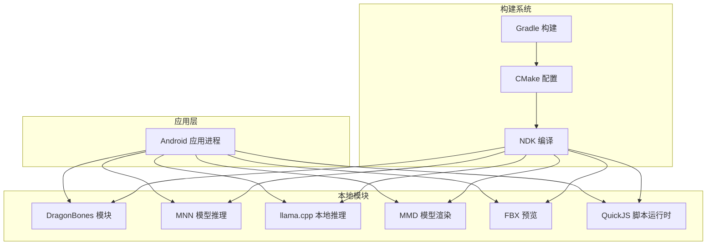
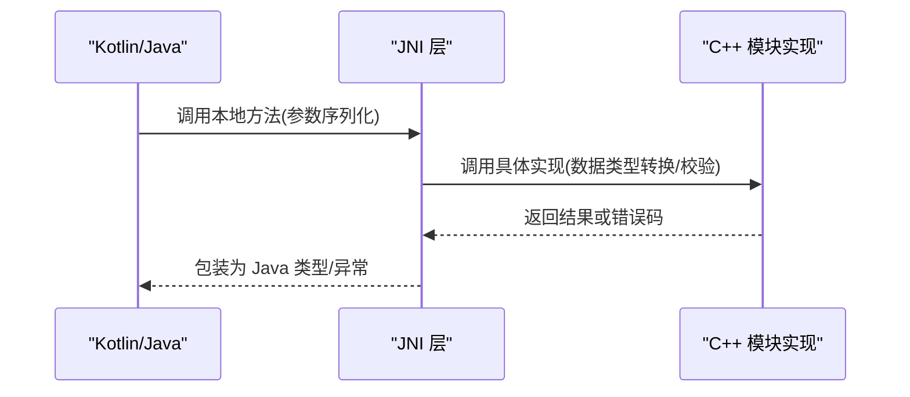
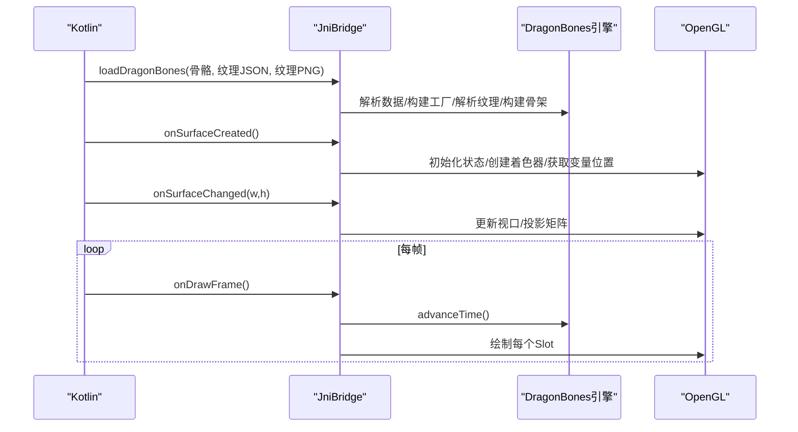
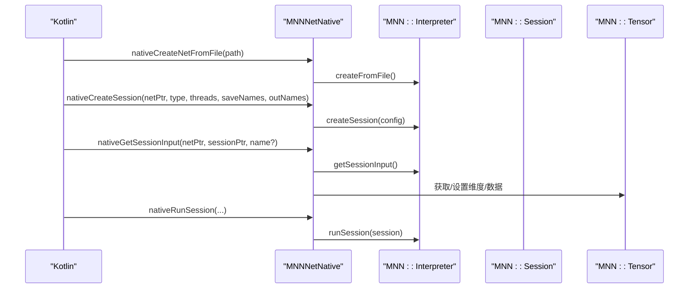
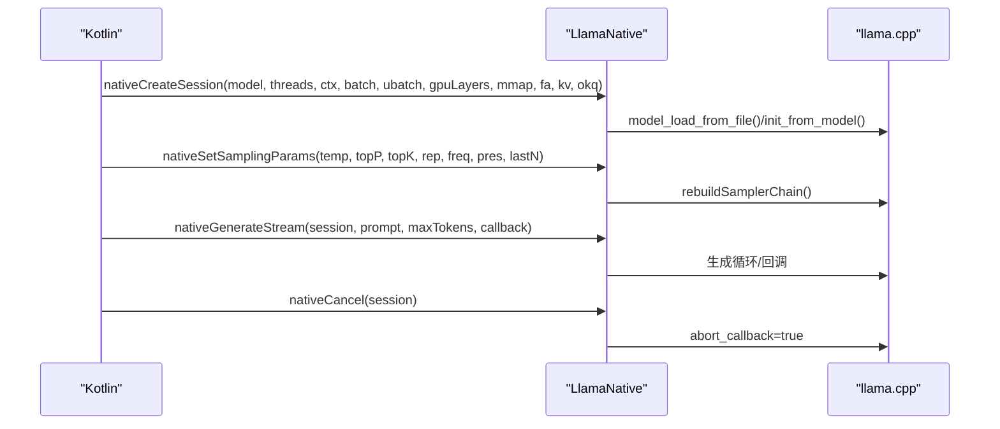
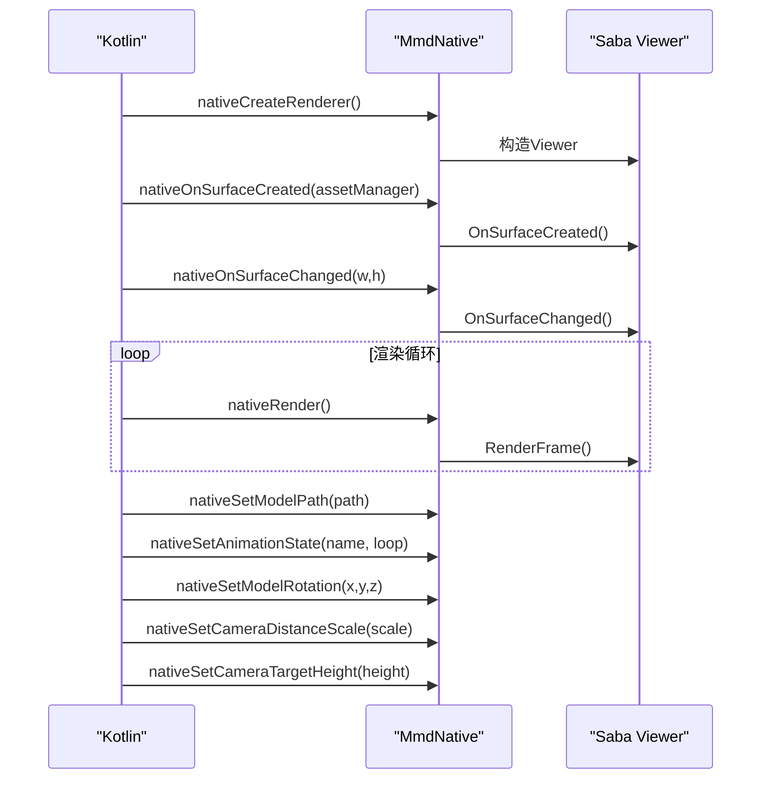
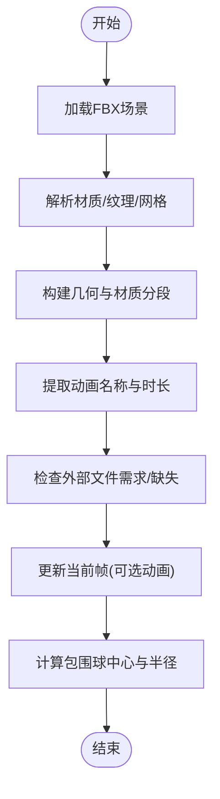
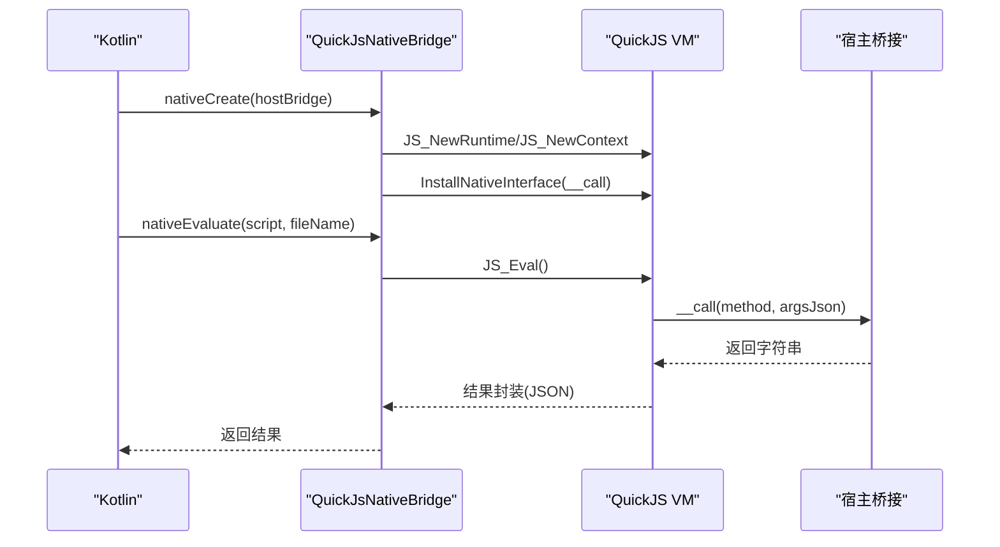
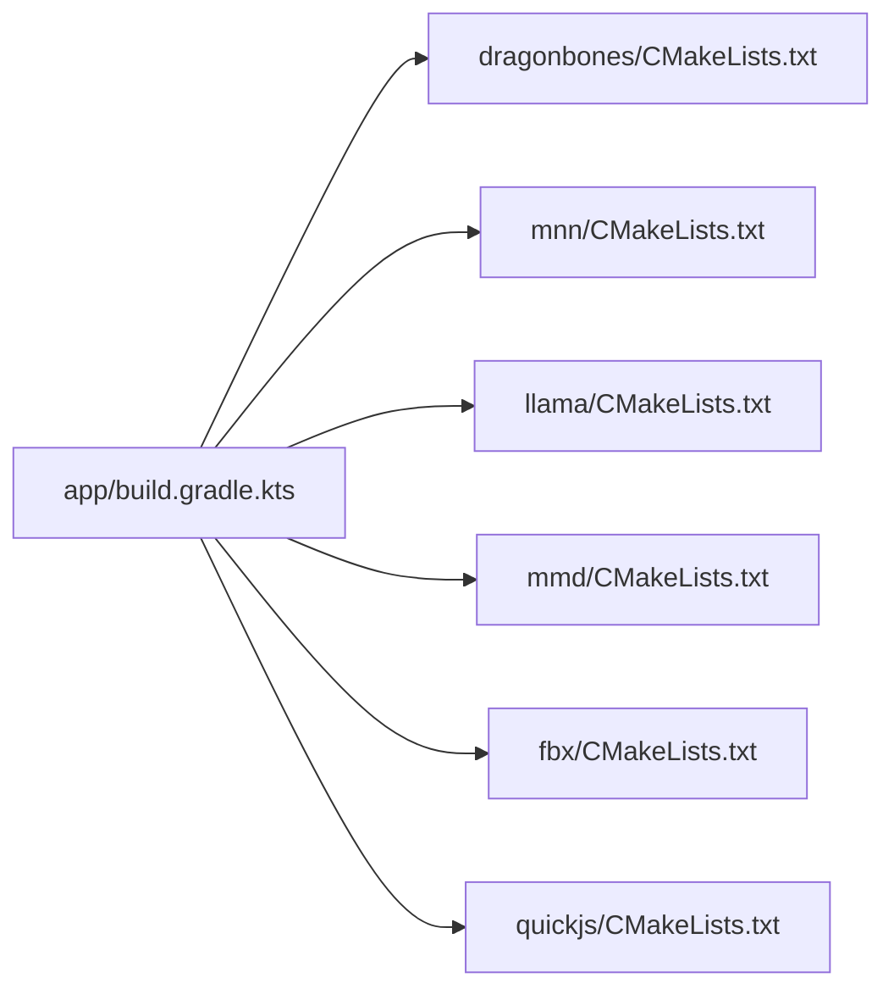

# 本地模块开发

<cite>
**本文引用的文件**
- [README.md](file://README.md)
- [app/build.gradle.kts](file://app/build.gradle.kts)
- [dragonbones/CMakeLists.txt](file://dragonbones/CMakeLists.txt)
- [dragonbones/cpp/JniBridge.h](file://dragonbones/cpp/JniBridge.h)
- [dragonbones/cpp/JniBridge.cpp](file://dragonbones/cpp/JniBridge.cpp)
- [llama/CMakeLists.txt](file://llama/CMakeLists.txt)
- [llama/src/main/cpp/llama_jni_stub.cpp](file://llama/src/main/cpp/llama_jni_stub.cpp)
- [mmd/CMakeLists.txt](file://mmd/CMakeLists.txt)
- [mmd/src/main/cpp/android/MmdRendererBridge.cpp](file://mmd/src/main/cpp/android/MmdRendererBridge.cpp)
- [mnn/CMakeLists.txt](file://mnn/CMakeLists.txt)
- [mnn/src/main/cpp/mnnnetnative.cpp](file://mnn/src/main/cpp/mnnnetnative.cpp)
- [fbx/CMakeLists.txt](file://fbx/CMakeLists.txt)
- [fbx/src/main/cpp/fbx_jni.cpp](file://fbx/src/main/cpp/fbx_jni.cpp)
- [quickjs/CMakeLists.txt](file://quickjs/CMakeLists.txt)
- [quickjs/src/main/cpp/quickjs_jni.cpp](file://quickjs/src/main/cpp/quickjs_jni.cpp)
</cite>

## 目录
1. [引言](#引言)
2. [项目结构](#项目结构)
3. [核心组件](#核心组件)
4. [架构总览](#架构总览)
5. [详细组件分析](#详细组件分析)
6. [依赖关系分析](#依赖关系分析)
7. [性能考量](#性能考量)
8. [故障排查指南](#故障排查指南)
9. [结论](#结论)
10. [附录](#附录)

## 引言
本文件面向 C++ 开发者，系统化梳理 Operit AI 的本地模块开发与集成实践，重点覆盖以下方面：
- JNI 桥接开发：接口设计、数据类型转换、异常处理、内存管理
- C++ 模块集成：CMake 配置、构建系统、依赖管理、跨平台/ABI 注意事项
- 本地模块实现原理：MNN 模型推理、llama.cpp 本地推理、DragonBones 动画渲染、MMD 模型处理、FBX 预览、QuickJS 脚本运行时
- 开发指南：环境搭建、调试技巧、性能优化、错误排查
- 模块协作机制：资源共享、同步通信、错误传播与隔离

## 项目结构
Operit 将本地模块以子工程形式组织，统一由 Gradle 驱动 CMake 构建，最终产物以 .so 形式打包进 APK 的对应 ABI 目录。核心模块与关键文件如下：
- DragonBones 动画：JNI 接口与 OpenGL 渲染桥接
- MNN 推理：模型加载、会话管理、张量输入输出与图像处理
- llama.cpp 本地推理：会话生命周期、采样器链、工具调用语法约束
- MMD 模型渲染：基于 Saba Viewer 的 Android 渲染桥接
- FBX 预览：场景解析、材质纹理、网格几何与动画
- QuickJS 脚本运行时：宿主桥接、中断控制、异常封装

**图表来源**
- [app/build.gradle.kts:48-52](file://app/build.gradle.kts#L48-L52)
- [dragonbones/CMakeLists.txt:1-45](file://dragonbones/CMakeLists.txt#L1-L45)
- [mnn/CMakeLists.txt:1-98](file://mnn/CMakeLists.txt#L1-L98)
- [llama/CMakeLists.txt:1-50](file://llama/CMakeLists.txt#L1-L50)
- [mmd/CMakeLists.txt:1-112](file://mmd/CMakeLists.txt#L1-L112)
- [fbx/CMakeLists.txt:1-33](file://fbx/CMakeLists.txt#L1-L33)
- [quickjs/CMakeLists.txt](file://quickjs/CMakeLists.txt)

**章节来源**
- [README.md:39-469](file://README.md#L39-L469)
- [app/build.gradle.kts:48-52](file://app/build.gradle.kts#L48-L52)

## 核心组件
- JNI 接口设计：统一以 Java_com_ai_assistance_*_Native 命名空间导出，参数遵循 JNI 约束，返回值明确错误码或空指针
- 数据类型转换：字符串使用 UTF-8/UTF-16 转换；数组通过 Get/Release 系列 API 安全拷贝；图像数据通过 AndroidBitmap/ByteBuffer 传递
- 异常处理：JNI 层捕获并封装异常，向上抛出统一的错误信息；模块内部使用 RAII 与智能指针管理资源
- 内存管理：静态单例与全局对象在合适生命周期释放；JNI 字符串与数组元素及时 Release；避免跨线程共享未保护的裸指针

**章节来源**
- [dragonbones/cpp/JniBridge.h:10-63](file://dragonbones/cpp/JniBridge.h#L10-L63)
- [dragonbones/cpp/JniBridge.cpp:318-345](file://dragonbones/cpp/JniBridge.cpp#L318-L345)
- [llama/src/main/cpp/llama_jni_stub.cpp:36-42](file://llama/src/main/cpp/llama_jni_stub.cpp#L36-L42)
- [quickjs/src/main/cpp/quickjs_jni.cpp:152-166](file://quickjs/src/main/cpp/quickjs_jni.cpp#L152-L166)

## 架构总览
本地模块通过 JNI 与 Kotlin/Java 交互，底层由 CMake 统一编译，NDK 提供 ABI 支持。各模块职责清晰，边界明确，便于独立演进与替换。

**图表来源**
- [dragonbones/cpp/JniBridge.cpp:280-291](file://dragonbones/cpp/JniBridge.cpp#L280-L291)
- [mmd/src/main/cpp/android/MmdRendererBridge.cpp:77-92](file://mmd/src/main/cpp/android/MmdRendererBridge.cpp#L77-L92)
- [llama/src/main/cpp/llama_jni_stub.cpp:661-780](file://llama/src/main/cpp/llama_jni_stub.cpp#L661-L780)

## 详细组件分析

### DragonBones 动画渲染
- 接口设计：初始化、加载骨骼数据与贴图、GL 生命周期回调、动画播放控制、命中检测、世界缩放与平移、骨骼覆盖与重置、停止动画
- 数据流：Kotlin 传入字节数组 -> JNI 解析 -> DragonBones 工厂解析 -> Armature 构建 -> OpenGLSlot 渲染
- 关键点：GL 上下文重建时清理旧资源；着色器编译与链接失败需记录日志；矩阵转换与视口映射；空槽/不可见槽跳过渲染

**图表来源**
- [dragonbones/cpp/JniBridge.h:10-63](file://dragonbones/cpp/JniBridge.h#L10-L63)
- [dragonbones/cpp/JniBridge.cpp:293-429](file://dragonbones/cpp/JniBridge.cpp#L293-L429)
- [dragonbones/cpp/JniBridge.cpp:431-527](file://dragonbones/cpp/JniBridge.cpp#L431-L527)

**章节来源**
- [dragonbones/cpp/JniBridge.h:10-63](file://dragonbones/cpp/JniBridge.h#L10-L63)
- [dragonbones/cpp/JniBridge.cpp:280-527](file://dragonbones/cpp/JniBridge.cpp#L280-L527)
- [dragonbones/CMakeLists.txt:1-45](file://dragonbones/CMakeLists.txt#L1-L45)

### MNN 模型推理
- 接口设计：创建/释放网络、创建/释放会话、会话运行、输入输出张量访问、尺寸调整、图像处理转换
- 数据流：模型文件/缓冲区 -> Interpreter 创建 -> ScheduleConfig -> Session -> Tensor 输入/输出 -> 运行/回调
- 关键点：保存中间张量与输出张量名；回调中复制主机张量；图像处理配置与矩阵变换

**图表来源**
- [mnn/src/main/cpp/mnnnetnative.cpp:17-100](file://mnn/src/main/cpp/mnnnetnative.cpp#L17-L100)
- [mnn/src/main/cpp/mnnnetnative.cpp:171-197](file://mnn/src/main/cpp/mnnnetnative.cpp#L171-L197)
- [mnn/src/main/cpp/mnnnetnative.cpp:215-241](file://mnn/src/main/cpp/mnnnetnative.cpp#L215-L241)

**章节来源**
- [mnn/src/main/cpp/mnnnetnative.cpp:17-451](file://mnn/src/main/cpp/mnnnetnative.cpp#L17-L451)
- [mnn/CMakeLists.txt:44-83](file://mnn/CMakeLists.txt#L44-L83)

### llama.cpp 本地推理
- 接口设计：会话创建/释放、取消、采样参数设置、模板应用、流式生成、工具调用语法约束、解析工具调用响应
- 数据流：模型路径与上下文参数 -> llama_model_load -> llama_init -> 采样器链 -> 生成回调
- 关键点：GPU offload 支持检测；线程数与批大小约束；采样器链构建与懒加载语法；取消回调；模板与工具调用语法

**图表来源**
- [llama/src/main/cpp/llama_jni_stub.cpp:661-780](file://llama/src/main/cpp/llama_jni_stub.cpp#L661-L780)
- [llama/src/main/cpp/llama_jni_stub.cpp:417-448](file://llama/src/main/cpp/llama_jni_stub.cpp#L417-L448)
- [llama/src/main/cpp/llama_jni_stub.cpp:320-328](file://llama/src/main/cpp/llama_jni_stub.cpp#L320-L328)

**章节来源**
- [llama/CMakeLists.txt:14-46](file://llama/CMakeLists.txt#L14-L46)
- [llama/src/main/cpp/llama_jni_stub.cpp:648-800](file://llama/src/main/cpp/llama_jni_stub.cpp#L648-L800)

### MMD 模型渲染
- 接口设计：创建/销毁渲染器、GL 表面创建/变更、渲染帧、暂停/恢复、设置模型路径/动画状态、旋转/相机缩放/目标高度
- 数据流：Android AssetManager -> Viewer 初始化 -> SetModelPath -> SetAnimationState -> RenderFrame
- 关键点：错误状态记录与清空；Viewer 生命周期管理；相机与模型姿态控制

**图表来源**
- [mmd/src/main/cpp/android/MmdRendererBridge.cpp:77-200](file://mmd/src/main/cpp/android/MmdRendererBridge.cpp#L77-L200)
- [mmd/src/main/cpp/android/MmdRendererBridge.cpp:226-357](file://mmd/src/main/cpp/android/MmdRendererBridge.cpp#L226-L357)

**章节来源**
- [mmd/CMakeLists.txt:42-108](file://mmd/CMakeLists.txt#L42-L108)
- [mmd/src/main/cpp/android/MmdRendererBridge.cpp:77-370](file://mmd/src/main/cpp/android/MmdRendererBridge.cpp#L77-L370)

### FBX 预览
- 接口设计：场景检查与信息提取、动画列表与时长、外部文件需求与缺失、几何构建与当前帧更新
- 数据流：模型路径 -> ufbx_load_file -> 场景评估 -> 材质/纹理/网格 -> 顶点数据与包围球
- 关键点：路径规范化与绝对/相对路径解析；纹理嵌入与外部文件；三角化与材质分段；动画栈索引映射

**图表来源**
- [fbx/src/main/cpp/fbx_jni.cpp:322-347](file://fbx/src/main/cpp/fbx_jni.cpp#L322-L347)
- [fbx/src/main/cpp/fbx_jni.cpp:559-669](file://fbx/src/main/cpp/fbx_jni.cpp#L559-L669)
- [fbx/src/main/cpp/fbx_jni.cpp:671-780](file://fbx/src/main/cpp/fbx_jni.cpp#L671-L780)

**章节来源**
- [fbx/CMakeLists.txt:1-33](file://fbx/CMakeLists.txt#L1-L33)
- [fbx/src/main/cpp/fbx_jni.cpp:1-1054](file://fbx/src/main/cpp/fbx_jni.cpp#L1-L1054)

### QuickJS 脚本运行时
- 接口设计：创建/销毁 VM、执行脚本、调用函数、处理宿主桥接、中断控制、异常封装
- 数据流：宿主桥接对象 -> 注入 NativeInterface.__call -> JS 调用宿主方法 -> 返回 JSON 字符串
- 关键点：线程附加/分离；异常属性读取与堆栈；最近宿主调用记录；JSON 序列化与转义

**图表来源**
- [quickjs/src/main/cpp/quickjs_jni.cpp:736-800](file://quickjs/src/main/cpp/quickjs_jni.cpp#L736-L800)
- [quickjs/src/main/cpp/quickjs_jni.cpp:508-546](file://quickjs/src/main/cpp/quickjs_jni.cpp#L508-L546)
- [quickjs/src/main/cpp/quickjs_jni.cpp:663-713](file://quickjs/src/main/cpp/quickjs_jni.cpp#L663-L713)

**章节来源**
- [quickjs/CMakeLists.txt](file://quickjs/CMakeLists.txt)
- [quickjs/src/main/cpp/quickjs_jni.cpp:1-865](file://quickjs/src/main/cpp/quickjs_jni.cpp#L1-L865)

## 依赖关系分析
- Gradle 通过 externalNativeBuild 指定 CMakeLists.txt，统一编译所有本地模块
- 模块间无直接耦合，通过 JNI 接口与平台层交互
- 依赖管理：第三方库通过 CMake 子目录或 vendoring 方式引入，如 MNN、llama.cpp、Saba/Bullet、ufbx、QuickJS

**图表来源**
- [app/build.gradle.kts:48-52](file://app/build.gradle.kts#L48-L52)
- [dragonbones/CMakeLists.txt:1-45](file://dragonbones/CMakeLists.txt#L1-L45)
- [mnn/CMakeLists.txt:1-98](file://mnn/CMakeLists.txt#L1-L98)
- [llama/CMakeLists.txt:1-50](file://llama/CMakeLists.txt#L1-L50)
- [mmd/CMakeLists.txt:1-112](file://mmd/CMakeLists.txt#L1-L112)
- [fbx/CMakeLists.txt:1-33](file://fbx/CMakeLists.txt#L1-L33)
- [quickjs/CMakeLists.txt](file://quickjs/CMakeLists.txt)

**章节来源**
- [app/build.gradle.kts:48-52](file://app/build.gradle.kts#L48-L52)

## 性能考量
- 构建优化
  - Android 15+ 页面对齐：各模块均设置链接选项以满足 16KB 页面大小要求
  - 分离后端禁用：MNN 禁止分离编译，减少“找不到 type=3 后端”问题
  - TLS 优化：禁用 emulated TLS 以降低开销
- 运行时优化
  - GPU offload：llama.cpp 检测并按需启用 GPU 层；MNN 启用 Vulkan/OpenCL/GL 后端
  - 线程与批大小：合理设置线程数与批大小，平衡吞吐与延迟
  - 采样器链：按需启用惩罚与 Top-K/Top-P，避免过度采样
  - 渲染路径：DragonBones/MMD 仅绘制可见槽/节点，减少无效绘制
  - 图像处理：MNN 使用 ImageProcess 配置与矩阵变换，避免重复拷贝

**章节来源**
- [mnn/CMakeLists.txt:28-39](file://mnn/CMakeLists.txt#L28-L39)
- [mnn/CMakeLists.txt:63-74](file://mnn/CMakeLists.txt#L63-L74)
- [llama/CMakeLists.txt:48-49](file://llama/CMakeLists.txt#L48-L49)
- [mnn/CMakeLists.txt:90-96](file://mnn/CMakeLists.txt#L90-L96)
- [dragonbones/CMakeLists.txt:44-45](file://dragonbones/CMakeLists.txt#L44-L45)
- [mmd/CMakeLists.txt:110-112](file://mmd/CMakeLists.txt#L110-L112)

## 故障排查指南
- JNI 空指针与越界
  - 检查 jstring/jbyteArray/jintArray 等是否为空；使用 Release 系列 API 释放
  - 参考：字符串与数组转换与释放
- GL 渲染异常
  - 着色器编译/链接失败需记录日志；GL 上下文重建后清理旧资源
  - 参考：DragonBones 着色器创建与 GL 生命周期
- 模型加载失败
  - MNN 检查模型路径与缓冲区；llama.cpp 检查 GPU offload 支持与参数范围
- 渲染器错误
  - MMD 渲染器通过错误状态记录与清空，定位具体阶段
- 脚本运行异常
  - QuickJS 捕获异常属性与堆栈，结合最近宿主调用记录定位问题

**章节来源**
- [dragonbones/cpp/JniBridge.cpp:74-143](file://dragonbones/cpp/JniBridge.cpp#L74-L143)
- [dragonbones/cpp/JniBridge.cpp:376-417](file://dragonbones/cpp/JniBridge.cpp#L376-L417)
- [mmd/src/main/cpp/android/MmdRendererBridge.cpp:27-58](file://mmd/src/main/cpp/android/MmdRendererBridge.cpp#L27-L58)
- [llama/src/main/cpp/llama_jni_stub.cpp:675-780](file://llama/src/main/cpp/llama_jni_stub.cpp#L675-L780)
- [quickjs/src/main/cpp/quickjs_jni.cpp:663-713](file://quickjs/src/main/cpp/quickjs_jni.cpp#L663-L713)

## 结论
Operit 的本地模块体系以 JNI 为桥梁，围绕 CMake/NDK 实现跨平台构建，模块职责清晰、边界明确。通过规范的数据类型转换、异常处理与内存管理，以及针对不同硬件后端的优化策略，实现了稳定高效的本地推理与渲染能力。开发者可据此扩展新模块或优化现有模块，同时遵循统一的构建与调试流程。

## 附录
- 开发环境搭建
  - 安装 Android Studio + NDK + CMake
  - 同步子模块与依赖库（参考项目说明）
  - 在 Gradle 中配置 externalNativeBuild 指向 CMakeLists.txt
- 调试技巧
  - 使用 log 打印关键路径；在 JNI 层捕获并上报异常
  - 使用断点定位 C++ 侧问题；结合日志与错误码定位
- 平台差异
  - ABI 与 NDK 版本：当前默认 arm64-v8a，必要时扩展
  - Android 15+ 页面对齐：确保链接选项一致
- 扩展与维护建议
  - 新增模块：遵循 JNI 命名规范与生命周期管理；提供最小可用接口
  - 性能优化：关注 GPU offload、批大小、采样器链与渲染剔除
  - 错误隔离：模块内错误状态记录与清空，避免泄漏到其他模块

**章节来源**
- [README.md:409-469](file://README.md#L409-L469)
- [app/build.gradle.kts:66-71](file://app/build.gradle.kts#L66-L71)
- [dragonbones/CMakeLists.txt:44-45](file://dragonbones/CMakeLists.txt#L44-L45)
- [mmd/CMakeLists.txt:110-112](file://mmd/CMakeLists.txt#L110-L112)
- [mnn/CMakeLists.txt:90-96](file://mnn/CMakeLists.txt#L90-L96)
- [llama/CMakeLists.txt:48-49](file://llama/CMakeLists.txt#L48-L49)