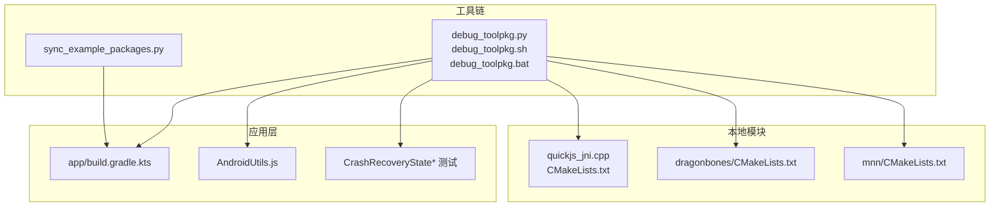
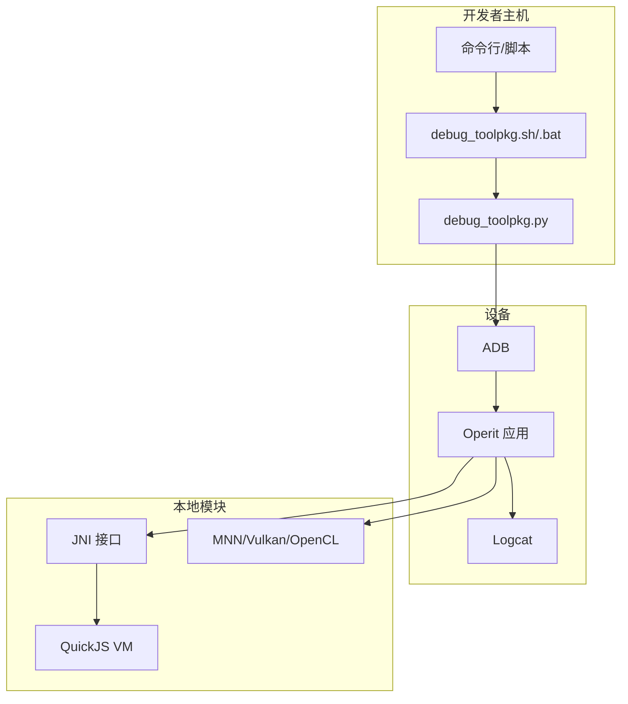
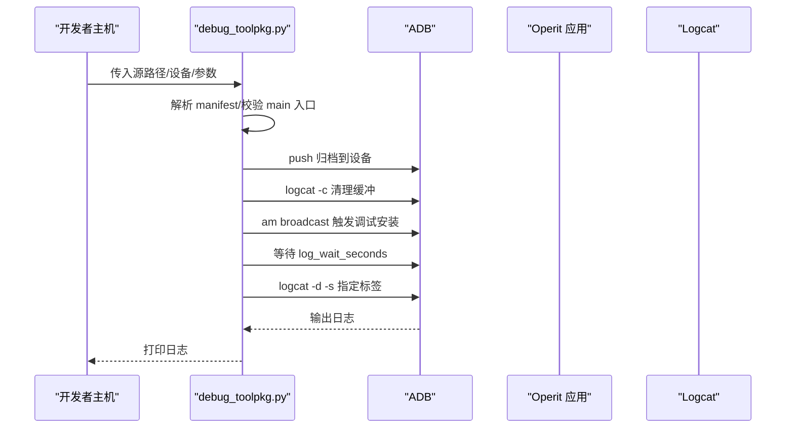
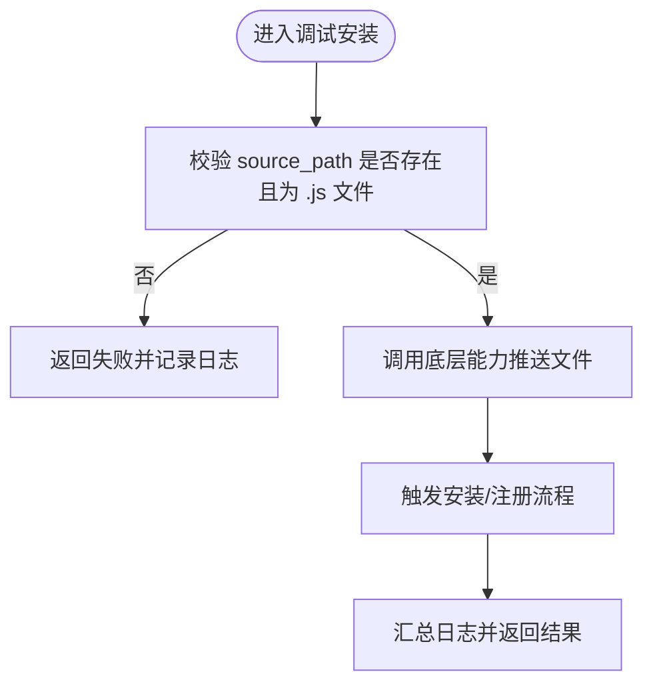
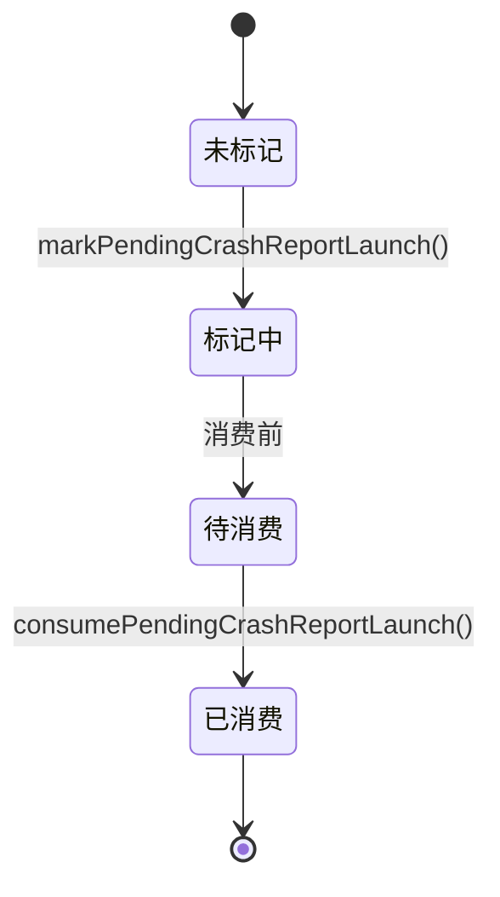
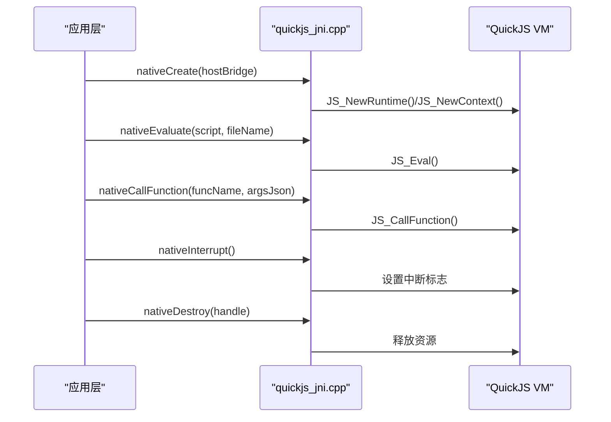
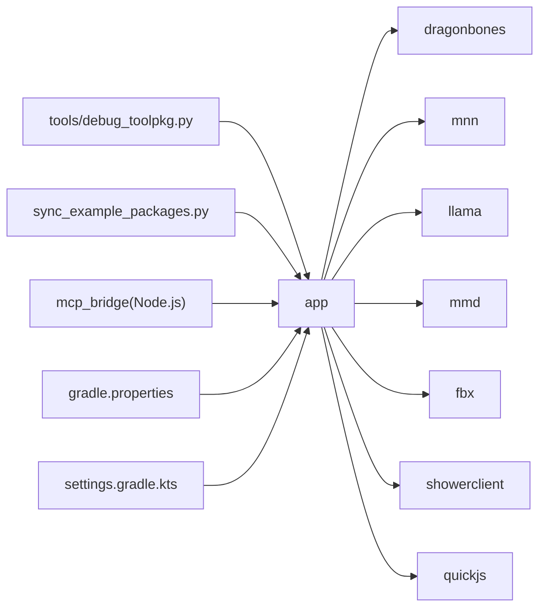

# 调试与性能优化

<cite>
**本文引用的文件**
- [tools/debug_toolpkg.py](file://tools/debug_toolpkg.py)
- [tools/debug_toolpkg.sh](file://tools/debug_toolpkg.sh)
- [tools/debug_toolpkg.bat](file://tools/debug_toolpkg.bat)
- [examples/operit_editor.ts](file://examples/operit_editor.ts)
- [app/src/main/assets/js/AndroidUtils.js](file://app/src/main/assets/js/AndroidUtils.js)
- [app/src/androidTest/java/com/ai/assistance/operit/util/CrashRecoveryStateAndroidTest.kt](file://app/src/androidTest/java/com/ai/assistance/operit/util/CrashRecoveryStateAndroidTest.kt)
- [app/src/androidTest/java/com/ai/assistance/operit/util/CrashRecoveryStateRepeatAndroidTest.kt](file://app/src/androidTest/java/com/ai/assistance/operit/util/CrashRecoveryStateRepeatAndroidTest.kt)
- [app/src/androidTest/java/com/ai/assistance/operit/util/CrashRecoveryStateLifecycleAndroidTest.kt](file://app/src/androidTest/java/com/ai/assistance/operit/util/CrashRecoveryStateLifecycleAndroidTest.kt)
- [app/src/androidTest/java/com/ai/assistance/operit/util/CrashRecoveryStatePrefsAndroidTest.kt](file://app/src/androidTest/java/com/ai/assistance/operit/util/CrashRecoveryStatePrefsAndroidTest.kt)
- [quickjs/src/main/cpp/quickjs_jni.cpp](file://quickjs/src/main/cpp/quickjs_jni.cpp)
- [quickjs/src/main/cpp/CMakeLists.txt](file://quickjs/src/main/cpp/CMakeLists.txt)
- [dragonbones/CMakeLists.txt](file://dragonbones/CMakeLists.txt)
- [mnn/CMakeLists.txt](file://mnn/CMakeLists.txt)
- [app/build.gradle.kts](file://app/build.gradle.kts)
- [gradle.properties](file://gradle.properties)
- [settings.gradle.kts](file://settings.gradle.kts)
- [sync_example_packages.py](file://sync_example_packages.py)
- [my_docs/tools模块软件架构与业务流程.md](file://my_docs/tools模块软件架构与业务流程.md)
- [my_docs/quickjs模块软件架构与业务流程.md](file://my_docs/quickjs模块软件架构与业务流程.md)
</cite>

## 目录
1. [简介](#简介)
2. [项目结构](#项目结构)
3. [核心组件](#核心组件)
4. [架构总览](#架构总览)
5. [详细组件分析](#详细组件分析)
6. [依赖分析](#依赖分析)
7. [性能考虑](#性能考虑)
8. [故障排查指南](#故障排查指南)
9. [结论](#结论)
10. [附录](#附录)

## 简介
本文件面向 Operit 项目的本地模块开发者，提供系统化的调试与性能优化指导。内容涵盖：
- 本地模块调试方法：ADB 调试、日志输出配置、断点设置、变量检查、崩溃恢复状态管理
- 性能分析工具应用：CPU/内存/GPU/I/O 性能评估思路与实践建议
- 常见问题排查：崩溃分析、死锁检测、竞态条件、内存溢出定位与修复
- 性能优化策略：算法优化、数据结构选择、缓存机制、并行计算
- 开发环境配置、调试脚本使用、自动化测试方法

## 项目结构
Operit 采用多模块工程，包含 Android 应用层、本地 C/C++ 模块（DragonBones、QuickJS、MNN 等）、工具链脚本与示例包。调试与性能优化涉及以下关键路径：
- 应用层与工具链：通过 ADB 推送工具包、触发调试安装广播、捕获日志
- 本地模块：JNI 接口、CMake 构建、NDK ABI 配置
- 测试与稳定性：崩溃恢复状态管理、单元测试与仪器测试

**图表来源**
- [tools/debug_toolpkg.py:1-394](file://tools/debug_toolpkg.py#L1-L394)
- [tools/debug_toolpkg.sh:1-16](file://tools/debug_toolpkg.sh#L1-L16)
- [tools/debug_toolpkg.bat:1-25](file://tools/debug_toolpkg.bat#L1-L25)
- [app/build.gradle.kts:1-446](file://app/build.gradle.kts#L1-L446)
- [app/src/main/assets/js/AndroidUtils.js:42-77](file://app/src/main/assets/js/AndroidUtils.js#L42-L77)
- [quickjs/src/main/cpp/quickjs_jni.cpp:1-598](file://quickjs/src/main/cpp/quickjs_jni.cpp#L1-L598)
- [quickjs/src/main/cpp/CMakeLists.txt:1-60](file://quickjs/src/main/cpp/CMakeLists.txt#L1-L60)
- [dragonbones/CMakeLists.txt:1-45](file://dragonbones/CMakeLists.txt#L1-L45)
- [mnn/CMakeLists.txt:1-29](file://mnn/CMakeLists.txt#L1-L29)
- [sync_example_packages.py:490-539](file://sync_example_packages.py#L490-L539)

**章节来源**
- [app/build.gradle.kts:1-446](file://app/build.gradle.kts#L1-L446)
- [settings.gradle.kts:1-30](file://settings.gradle.kts#L1-L30)
- [gradle.properties:1-29](file://gradle.properties#L1-L29)

## 核心组件
- 调试安装与日志采集：通过 ADB 广播触发应用内调试安装流程，清理日志缓冲、等待安装完成并抓取指定标签日志
- JS/工具包调试：支持 .js 文件调试安装、参数校验、日志记录与结果回传
- 崩溃恢复状态：基于 SharedPreferences 的一次性标记与消费机制，保障崩溃后日志保留与状态一致性
- 本地模块 JNI：QuickJS VM 生命周期、宿主调用桥接、异常处理与线程附加
- 构建与优化：CMake 编译选项、NDK ABI 过滤、链接器页面大小优化、GPU 后端开关

**章节来源**
- [tools/debug_toolpkg.py:256-317](file://tools/debug_toolpkg.py#L256-L317)
- [examples/operit_editor.ts:2536-2580](file://examples/operit_editor.ts#L2536-L2580)
- [app/src/androidTest/java/com/ai/assistance/operit/util/CrashRecoveryStateAndroidTest.kt:1-98](file://app/src/androidTest/java/com/ai/assistance/operit/util/CrashRecoveryStateAndroidTest.kt#L1-L98)
- [quickjs/src/main/cpp/quickjs_jni.cpp:270-598](file://quickjs/src/main/cpp/quickjs_jni.cpp#L270-L598)
- [quickjs/src/main/cpp/CMakeLists.txt:20-42](file://quickjs/src/main/cpp/CMakeLists.txt#L20-L42)
- [dragonbones/CMakeLists.txt:32-45](file://dragonbones/CMakeLists.txt#L32-L45)
- [mnn/CMakeLists.txt:16-29](file://mnn/CMakeLists.txt#L16-L29)

## 架构总览
下图展示了“工具链 → 应用 → 本地模块”的调试与性能优化交互路径。

**图表来源**
- [tools/debug_toolpkg.py:354-394](file://tools/debug_toolpkg.py#L354-L394)
- [tools/debug_toolpkg.sh:1-16](file://tools/debug_toolpkg.sh#L1-L16)
- [tools/debug_toolpkg.bat:1-25](file://tools/debug_toolpkg.bat#L1-L25)
- [quickjs/src/main/cpp/quickjs_jni.cpp:567-598](file://quickjs/src/main/cpp/quickjs_jni.cpp#L567-L598)
- [mnn/CMakeLists.txt:22-26](file://mnn/CMakeLists.txt#L22-L26)

## 详细组件分析

### 组件A：调试安装与日志采集（工具链）
- 功能概述
  - 解析工具包源（文件夹/归档），生成临时归档
  - 选择设备、推送归档至 /sdcard/Android/data/<package>/files/packages
  - 发送调试安装广播，触发应用内安装流程
  - 清理日志缓冲、等待安装完成、按标签抓取日志并输出
- 关键流程

**图表来源**
- [tools/debug_toolpkg.py:256-317](file://tools/debug_toolpkg.py#L256-L317)

- 断点与变量检查建议
  - 在应用侧接收广播处设置断点，观察安装状态与错误信息
  - 使用 Log 输出关键变量（包名、入口、等待时间），结合日志过滤器定位问题
- 常见问题
  - 设备未授权或多设备冲突：脚本已内置选择逻辑；若失败，检查 ADB 版本与权限
  - manifest 缺失字段：确保 toolpkg_id 与 main 存在且可访问
  - 安装后无日志：确认 LOGCAT_TAGS 是否匹配应用标签

**章节来源**
- [tools/debug_toolpkg.py:138-172](file://tools/debug_toolpkg.py#L138-L172)
- [tools/debug_toolpkg.py:207-249](file://tools/debug_toolpkg.py#L207-L249)
- [tools/debug_toolpkg.py:256-317](file://tools/debug_toolpkg.py#L256-L317)
- [tools/debug_toolpkg.sh:1-16](file://tools/debug_toolpkg.sh#L1-L16)
- [tools/debug_toolpkg.bat:1-25](file://tools/debug_toolpkg.bat#L1-L25)

### 组件B：JS/工具包调试（JS 层）
- 功能概述
  - 对 .js 文件进行调试安装：参数校验、类型判断、日志记录、结果回传
- 关键流程

**图表来源**
- [examples/operit_editor.ts:2536-2580](file://examples/operit_editor.ts#L2536-L2580)

**章节来源**
- [examples/operit_editor.ts:2536-2580](file://examples/operit_editor.ts#L2536-L2580)

### 组件C：崩溃恢复状态（稳定性保障）
- 功能概述
  - 提供一次性“待上报崩溃”标记与消费机制，确保崩溃后日志保留与状态一致性
- 行为验证（测试覆盖）
  - 标记后消费仅一次
  - 多次标记仍只保留单一待处理标志
  - 消费后清除存储键
  - 不影响其他偏好键值
- 关键流程

**图表来源**
- [app/src/androidTest/java/com/ai/assistance/operit/util/CrashRecoveryStateAndroidTest.kt:26-98](file://app/src/androidTest/java/com/ai/assistance/operit/util/CrashRecoveryStateAndroidTest.kt#L26-L98)

**章节来源**
- [app/src/androidTest/java/com/ai/assistance/operit/util/CrashRecoveryStateAndroidTest.kt:1-98](file://app/src/androidTest/java/com/ai/assistance/operit/util/CrashRecoveryStateAndroidTest.kt#L1-L98)
- [app/src/androidTest/java/com/ai/assistance/operit/util/CrashRecoveryStateRepeatAndroidTest.kt:1-33](file://app/src/androidTest/java/com/ai/assistance/operit/util/CrashRecoveryStateRepeatAndroidTest.kt#L1-L33)
- [app/src/androidTest/java/com/ai/assistance/operit/util/CrashRecoveryStateLifecycleAndroidTest.kt:1-40](file://app/src/androidTest/java/com/ai/assistance/operit/util/CrashRecoveryStateLifecycleAndroidTest.kt#L1-L40)
- [app/src/androidTest/java/com/ai/assistance/operit/util/CrashRecoveryStatePrefsAndroidTest.kt:1-28](file://app/src/androidTest/java/com/ai/assistance/operit/util/CrashRecoveryStatePrefsAndroidTest.kt#L1-L28)

### 组件D：JNI 与本地 VM（QuickJS）
- 功能概述
  - 初始化 QuickJS 运行时与上下文，建立宿主调用桥接，处理异常与线程附加
- 关键流程

**图表来源**
- [quickjs/src/main/cpp/quickjs_jni.cpp:270-598](file://quickjs/src/main/cpp/quickjs_jni.cpp#L270-L598)
- [my_docs/quickjs模块软件架构与业务流程.md:209-218](file://my_docs/quickjs模块软件架构与业务流程.md#L209-L218)

**章节来源**
- [quickjs/src/main/cpp/quickjs_jni.cpp:1-598](file://quickjs/src/main/cpp/quickjs_jni.cpp#L1-L598)
- [my_docs/quickjs模块软件架构与业务流程.md:209-218](file://my_docs/quickjs模块软件架构与业务流程.md#L209-L218)

### 组件E：本地模块构建与优化（CMake/NDK）
- 关键点
  - QuickJS：启用 O3 优化、关闭多余警告、链接 log/m
  - DragonBones：GLESv2、log、android 链接，设置最大页大小
  - MNN：开启 LLM、低内存、Transformer Fuse、Vulkan/OpenCL/OpenGLES 渲染
  - 应用层：ABI 过滤 arm64-v8a，NDK 配置显式声明
- 优化建议
  - 仅保留目标 ABI，减少包体与构建时间
  - 合理选择后端（Vulkan/OpenCL/OpenGLES），平衡性能与兼容性
  - 针对延迟敏感路径保持优化级别

**章节来源**
- [quickjs/src/main/cpp/CMakeLists.txt:20-42](file://quickjs/src/main/cpp/CMakeLists.txt#L20-L42)
- [dragonbones/CMakeLists.txt:32-45](file://dragonbones/CMakeLists.txt#L32-L45)
- [mnn/CMakeLists.txt:16-29](file://mnn/CMakeLists.txt#L16-L29)
- [app/build.gradle.kts:66-71](file://app/build.gradle.kts#L66-L71)

## 依赖分析
- 模块依赖
  - app 依赖 dragonbones、mnn、llama、mmd、fbx、showerclient、quickjs 等子模块
  - 工具链与脚本（debug_toolpkg、sync_example_packages）与 app 交互
- 关键外部依赖
  - ADB、Android NDK、Node.js（mcp_bridge）、Python3（tools）

**图表来源**
- [app/build.gradle.kts:181-191](file://app/build.gradle.kts#L181-L191)
- [my_docs/tools模块软件架构与业务流程.md:526-603](file://my_docs/tools模块软件架构与业务流程.md#L526-L603)
- [settings.gradle.kts:20-30](file://settings.gradle.kts#L20-L30)

**章节来源**
- [app/build.gradle.kts:181-191](file://app/build.gradle.kts#L181-L191)
- [my_docs/tools模块软件架构与业务流程.md:526-603](file://my_docs/tools模块软件架构与业务流程.md#L526-L603)
- [settings.gradle.kts:20-30](file://settings.gradle.kts#L20-L30)

## 性能考虑
- CPU 性能
  - 保持 QuickJS 在延迟敏感路径的优化级别（O3）
  - 仅打包目标 ABI，减少解压与加载开销
- 内存
  - 启用 MNN 低内存模式，避免峰值过高
  - 使用对象池与复用策略，减少频繁分配
- GPU
  - 合理选择 Vulkan/OpenCL/OpenGLES 后端，优先 Vulkan 获取更好吞吐
  - 控制帧缓冲尺寸与 MSAA 级别，平衡画质与性能
- I/O
  - 工具包安装与热重载时注意磁盘写入频率，必要时批量操作
  - 使用日志标签过滤，避免无谓输出造成 I/O 压力

[本节为通用指导，无需特定文件引用]

## 故障排查指南
- 崩溃分析
  - 使用崩溃恢复状态测试验证一次性标记与消费行为，确保崩溃后日志保留
  - 结合 ADB 日志抓取与应用内日志输出，定位异常发生点
- 死锁与竞态
  - JNI 调用需注意线程附加与异常捕获，避免跨线程访问导致的未定义行为
  - 在高频调用路径增加轻量计时与采样日志，识别热点与阻塞点
- 内存溢出
  - 检查本地模块对象生命周期与引用计数，避免循环引用
  - 使用应用层内存监控工具（如 Android Studio Profiler）配合日志定位
- 安装与调试失败
  - 确认 ADB 可用、设备授权、manifest 字段完整
  - 使用脚本提供的等待时间参数与日志标签过滤，提升诊断效率

**章节来源**
- [app/src/androidTest/java/com/ai/assistance/operit/util/CrashRecoveryStateAndroidTest.kt:1-98](file://app/src/androidTest/java/com/ai/assistance/operit/util/CrashRecoveryStateAndroidTest.kt#L1-L98)
- [tools/debug_toolpkg.py:256-317](file://tools/debug_toolpkg.py#L256-L317)
- [quickjs/src/main/cpp/quickjs_jni.cpp:567-598](file://quickjs/src/main/cpp/quickjs_jni.cpp#L567-L598)

## 结论
通过工具链脚本、日志采集、崩溃恢复状态与本地模块 JNI/构建优化，Operit 提供了完善的本地模块调试与性能优化基础。建议在日常开发中：
- 固化调试脚本使用流程，统一日志标签与等待时间
- 在关键路径保留轻量计时与采样日志，便于后续性能回归
- 严格控制本地模块生命周期与资源释放，避免内存与线程问题
- 根据设备特性选择合适的 GPU 后端与 ABI，兼顾性能与兼容性

[本节为总结，无需特定文件引用]

## 附录
- 开发环境配置
  - Gradle：启用并行、守护进程、按需配置、工作线程上限与缓存
  - NDK：明确 ABI 过滤，避免不必要的多 ABI 构建
- 调试脚本使用
  - Windows：debug_toolpkg.bat
  - Linux/macOS：debug_toolpkg.sh
  - Python 脚本：debug_toolpkg.py，支持设备选择、等待时间、日志标签过滤
- 自动化测试
  - 工具包热重载与设备选择逻辑参考 sync_example_packages.py
  - 崩溃恢复状态测试覆盖多种边界场景

**章节来源**
- [gradle.properties:9-29](file://gradle.properties#L9-L29)
- [app/build.gradle.kts:66-71](file://app/build.gradle.kts#L66-L71)
- [tools/debug_toolpkg.sh:1-16](file://tools/debug_toolpkg.sh#L1-L16)
- [tools/debug_toolpkg.bat:1-25](file://tools/debug_toolpkg.bat#L1-L25)
- [tools/debug_toolpkg.py:354-394](file://tools/debug_toolpkg.py#L354-L394)
- [sync_example_packages.py:490-539](file://sync_example_packages.py#L490-L539)