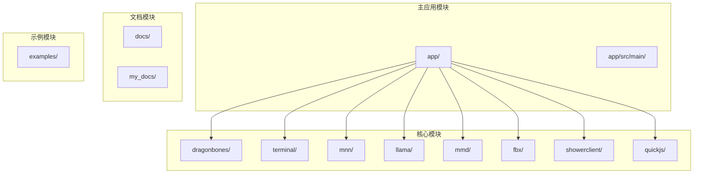
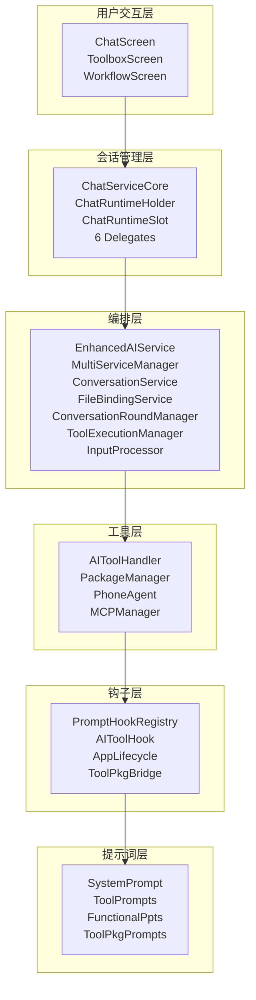
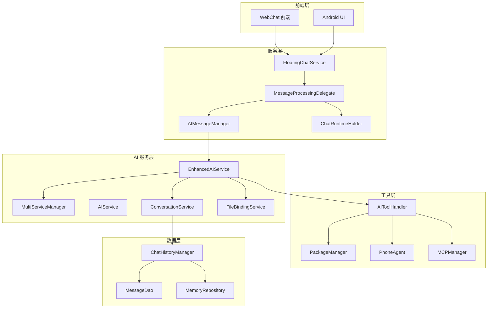
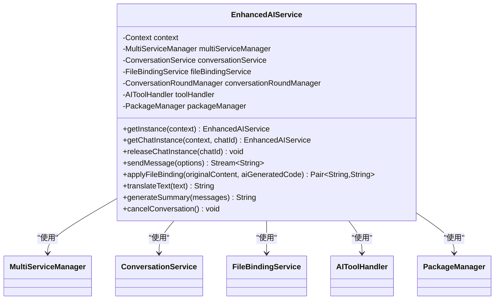
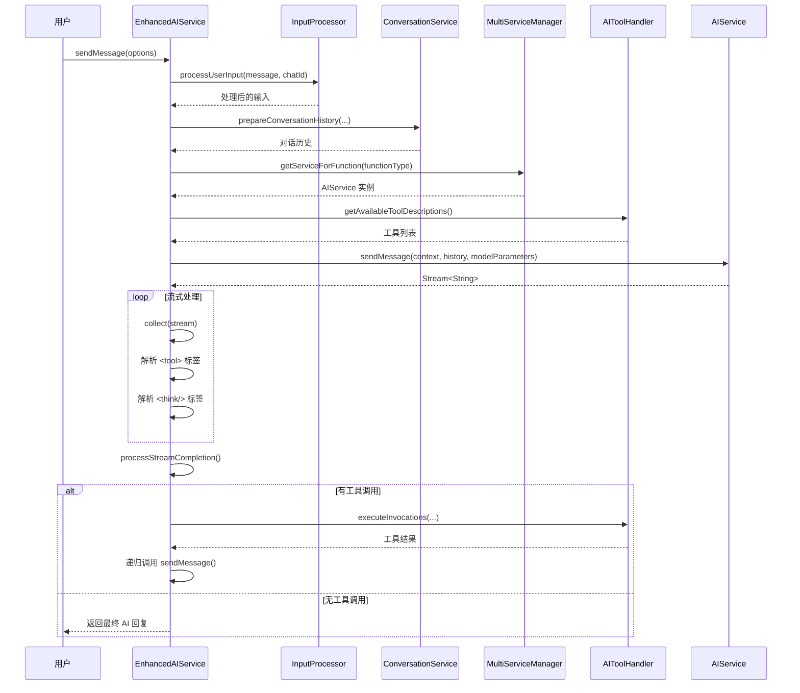
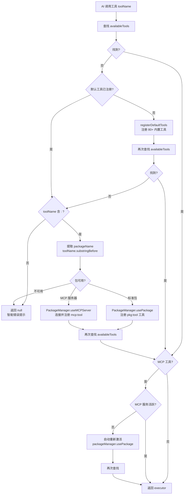
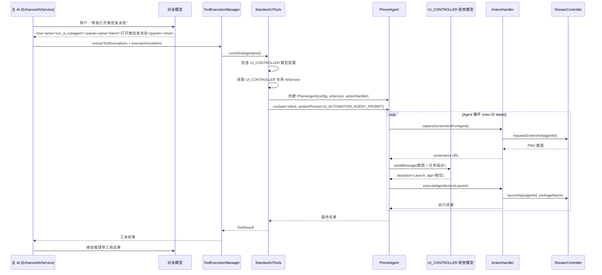
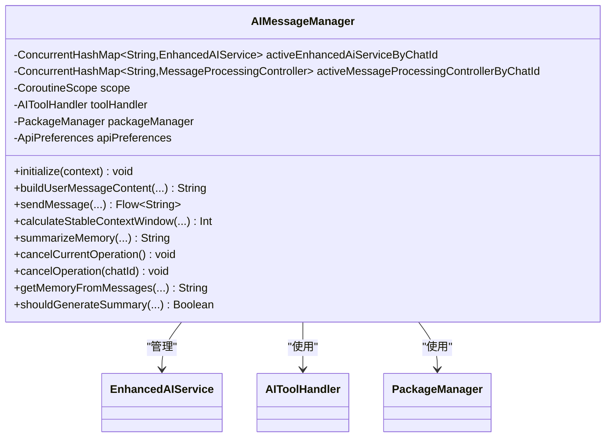
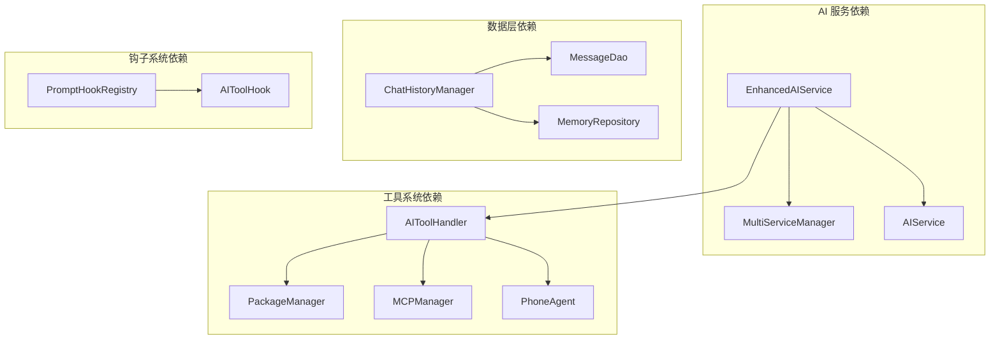

# AI Agent软件架构设计与业务流程

<cite>
**本文档引用的文件**
- [README.md](file://README.md)
- [AI Agent软件架构设计与业务流程.md](file://my_docs/AI Agent软件架构设计与业务流程.md)
- [Operit AI 对话系统设计思想与详细流程分析.md](file://my_docs/Operit AI 对话系统设计思想与详细流程分析.md)
- [Operit Agent 意图路由机制详解.md](file://my_docs/Operit Agent 意图路由机制详解.md)
- [app/build.gradle.kts](file://app/build.gradle.kts)
- [settings.gradle.kts](file://settings.gradle.kts)
- [gradle/libs.versions.toml](file://gradle/libs.versions.toml)
- [AndroidManifest.xml](file://app/src/main/AndroidManifest.xml)
- [AIMessageManager.kt](file://app/src/main/java/com/ai/assistance/operit/core/chat/AIMessageManager.kt)
- [AIToolHandler.kt](file://app/src/main/java/com/ai/assistance/operit/core/tools/AIToolHandler.kt)
- [PromptHookRegistry.kt](file://app/src/main/java/com/ai/assistance/operit/core/chat/hooks/PromptHookRegistry.kt)
- [PhoneAgent.kt](file://app/src/main/java/com/ai/assistance/operit/core/tools/agent/PhoneAgent.kt)
</cite>

## 目录
1. [引言](#引言)
2. [项目结构](#项目结构)
3. [核心组件](#核心组件)
4. [架构概览](#架构概览)
5. [详细组件分析](#详细组件分析)
6. [依赖分析](#依赖分析)
7. [性能考虑](#性能考虑)
8. [故障排除指南](#故障排除指南)
9. [结论](#结论)

## 引言

Operit AI 是移动端首个功能完备的 AI 智能助手应用，完全独立运行于 Android 设备上，拥有强大的工具调用能力、深度搜索、工作流与自动化、智能记忆库等功能。该项目采用多层架构设计，实现了从用户交互到工具执行的完整 AI Agent 系统。

## 项目结构

项目采用模块化的 Gradle 构建系统，主要包含以下核心模块：



**图表来源**
- [settings.gradle.kts:21-29](file://settings.gradle.kts#L21-L29)
- [app/build.gradle.kts:183-190](file://app/build.gradle.kts#L183-L190)

**章节来源**
- [settings.gradle.kts:1-30](file://settings.gradle.kts#L1-L30)
- [app/build.gradle.kts:1-446](file://app/build.gradle.kts#L1-L446)

## 核心组件

### 六层架构设计

Operit AI 采用六层架构设计，每一层都有明确的职责分工：



**图表来源**
- [AI Agent软件架构设计与业务流程.md:25-82](file://my_docs/AI Agent软件架构设计与业务流程.md#L25-L82)

### 核心设计模式

| 模式 | 应用位置 | 说明 |
|------|----------|------|
| **ReAct 循环** | EnhancedAIService | Reasoning + Acting 交替，AI 思考→调用工具→观察结果→继续思考 |
| **中央编排器** | EnhancedAIService | 单一入口管理对话、工具、文件绑定等全部流程 |
| **策略模式** | AIService / MultiServiceManager | 按功能类型路由到不同 AI 提供商 |
| **钩子链** | PromptHookRegistry | 7 阶段钩子链，支持 ToolPkg 注入修改 |
| **委托模式** | ChatServiceCore 6 Delegates | 将聊天业务拆分为独立委托 |
| **观察者模式** | AIToolHook / ToolProgressBus | 工具执行生命周期通知 |
| **Agent 循环** | PhoneAgent | 截屏→AI分析→执行动作→截屏 循环 |

**章节来源**
- [AI Agent软件架构设计与业务流程.md:84-104](file://my_docs/AI Agent软件架构设计与业务流程.md#L84-L104)

## 架构概览

### 整体系统架构



**图表来源**
- [Operit AI 对话系统设计思想与详细流程分析.md:21-88](file://my_docs/Operit AI 对话系统设计思想与详细流程分析.md#L21-L88)

## 详细组件分析

### EnhancedAIService 核心编排器

EnhancedAIService 是整个 AI Agent 系统的核心编排器，负责协调各个组件的工作。

#### 类结构设计



**图表来源**
- [AI Agent软件架构设计与业务流程.md:111-134](file://my_docs/AI Agent软件架构设计与业务流程.md#L111-L134)

#### sendMessage 核心流程

sendMessage 方法实现了完整的 ReAct 循环：



**图表来源**
- [AI Agent软件架构设计与业务流程.md:138-220](file://my_docs/AI Agent软件架构设计与业务流程.md#L138-L220)

**章节来源**
- [AI Agent软件架构设计与业务流程.md:107-220](file://my_docs/AI Agent软件架构设计与业务流程.md#L107-L220)

### 意图路由机制

Operit AI 采用三层意图路由体系，实现了从自然语言到具体工具执行的智能分发。

#### 三层路由架构

```mermaid
flowchart TD
subgraph "第一层：LLM 意图分类路由"
LLM[LLM 推理<br/>输出 <tool name="xxx"> 标签]
end
subgraph "第二层：工具发现与激活路由"
ATH[AIToolHandler.getToolExecutorOrActivate(toolName)]
FIND[三阶段查找：<br/>① 直接查找<br/>② 含 ":" 自动激活<br/>③ MCP 不活跃自动重新激活]
end
subgraph "第三层：执行器路由"
EXEC[根据 ToolExecutor 类型分发：<br/>• 内置工具 → Kotlin ToolExecutor<br/>• Package 工具 → PackageToolExecutor → JS 运行时<br/>• MCP 工具 → MCPToolExecutor → Node.js 进程<br/>• SubAgent → PhoneAgent / ChatManagerTool]
end
LLM --> ATH
ATH --> FIND
FIND --> EXEC
```

**图表来源**
- [AI Agent软件架构设计与业务流程.md:226-262](file://my_docs/AI Agent软件架构设计与业务流程.md#L226-L262)

#### 工具发现与激活流程



**图表来源**
- [AI Agent软件架构设计与业务流程.md:415-449](file://my_docs/AI Agent软件架构设计与业务流程.md#L415-L449)

**章节来源**
- [AI Agent软件架构设计与业务流程.md:224-449](file://my_docs/AI Agent软件架构设计与业务流程.md#L224-L449)

### SubAgent 路由模式

SubAgent 是意图路由中的特殊模式，工具执行器内部启动一个嵌套的 AI 推理循环。

#### run_ui_subagent 调用链路



**图表来源**
- [AI Agent软件架构设计与业务流程.md:560-601](file://my_docs/AI Agent软件架构设计与业务流程.md#L560-L601)

**章节来源**
- [AI Agent软件架构设计与业务流程.md:531-601](file://my_docs/AI Agent软件架构设计与业务流程.md#L531-L601)

### 对话系统设计

#### AIMessageManager 设计思想

AIMessageManager 作为单例对象，不持有任何特定聊天的状态，所有数据通过方法参数传入，确保高并发场景下的线程安全与可复用性。



**图表来源**
- [Operit AI 对话系统设计思想与详细流程分析.md:94-104](file://my_docs/Operit AI 对话系统设计思想与详细流程分析.md#L94-L104)

**章节来源**
- [Operit AI 对话系统设计思想与详细流程分析.md:1-175](file://my_docs/Operit AI 对话系统设计思想与详细流程分析.md#L1-L175)

## 依赖分析

### 核心依赖关系



**图表来源**
- [Operit AI 对话系统设计思想与详细流程分析.md:92-175](file://my_docs/Operit AI 对话系统设计思想与详细流程分析.md#L92-L175)

### 构建配置分析

项目使用 Gradle 构建系统，包含多个核心依赖模块：

| 依赖模块 | 用途 | 版本 |
|----------|------|------|
| **ObjectBox** | 数据库 ORM | 5.3.0 |
| **Room** | Android Room 数据库 | 2.8.4 |
| **Compose BOM** | Jetpack Compose UI | 2026.02.01 |
| **WorkManager** | 后台任务调度 | 2.9.0 |
| **OkHttp** | 网络请求 | 4.12.0 |
| **Shizuku** | Root 权限管理 | 13.1.5 |
| **ZXing** | 二维码扫描 | 3.5.3 |

**章节来源**
- [gradle/libs.versions.toml:1-271](file://gradle/libs.versions.toml#L1-L271)
- [app/build.gradle.kts:181-445](file://app/build.gradle.kts#L181-L445)

## 性能考虑

### 并发安全设计

系统采用了多种并发安全机制：

1. **无状态设计**：AIMessageManager 作为单例对象，不持有任何特定聊天的状态
2. **线程安全集合**：使用 `ConcurrentHashMap` 和 `CopyOnWriteArrayList`
3. **协程作用域**：独立的协程作用域确保 AI 操作的生命周期独立
4. **互斥锁保护**：使用 `Mutex` 保护聊天与消息的写入操作

### 流式处理优化

- **SharedStream 流式输出**：支持实时渲染和内容回溯
- **TextStreamRevisionTracker**：实现内容修订和回溯
- **流式工具调用**：支持工具执行的实时反馈

### 缓存策略

- **服务实例缓存**：MultiServiceManager 缓存 AIService 实例
- **工具描述缓存**：工具注册表缓存工具描述信息
- **模型配置缓存**：按 FunctionType 缓存模型配置

## 故障排除指南

### 常见问题诊断

#### 工具调用失败

当工具查找失败时，系统会根据工具名格式给出针对性提示：

| 情况 | 错误提示 | 示例 |
|------|----------|------|
| 含 `.` 不含 `:` | "请使用 `packName:toolName` 格式" | `weather.forecast` → 提示用 `weather:forecast` |
| 含 `:` 但包不存在 | "Package not found" | `unknown:tool` |
| 含 `:` 但工具是 advice-only | "This tool is advice-only" | `pkg:info_tool` |
| 直接用包名当工具名 | "是工具包不是工具，请先 use_package" | `weather` |

#### 权限相关问题

系统提供了完善的权限检查和管理机制：

1. **工具权限系统**：基于 ToolPermissionSystem 的权限管理
2. **权限状态刷新**：支持刷新权限请求状态
3. **权限级别检查**：支持不同权限级别的执行（Standard/Admin/Root）

**章节来源**
- [AI Agent软件架构设计与业务流程.md:520-530](file://my_docs/AI Agent软件架构设计与业务流程.md#L520-L530)

### 系统监控

#### 日志记录

系统实现了详细的性能监控和日志记录：

- **消息处理计时**：`MESSAGE_PROCESS_TIMING_TAG` 标签记录各阶段耗时
- **工具执行监控**：AIToolHook 提供工具执行生命周期通知
- **性能指标**：记录输入输出 Token 统计和缓存命中率

**章节来源**
- [AIMessageManager.kt:47-55](file://app/src/main/java/com/ai/assistance/operit/core/chat/AIMessageManager.kt#L47-L55)

## 结论

Operit AI 的软件架构设计体现了现代 AI Agent 系统的最佳实践，通过分层架构、模块化设计和灵活的路由机制，实现了强大的 AI 助手功能。系统的主要优势包括：

1. **高度模块化**：清晰的层次结构和职责分离
2. **灵活的路由机制**：支持多种工具扩展方式和意图路由
3. **并发安全**：完善的安全机制确保高并发场景下的稳定性
4. **可扩展性**：支持插件化扩展和自定义工具开发
5. **性能优化**：流式处理、缓存策略和并发优化

该架构为移动端 AI Agent 系统提供了一个优秀的参考实现，具有很强的学习价值和实用意义。