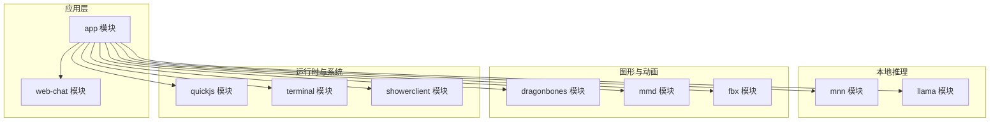
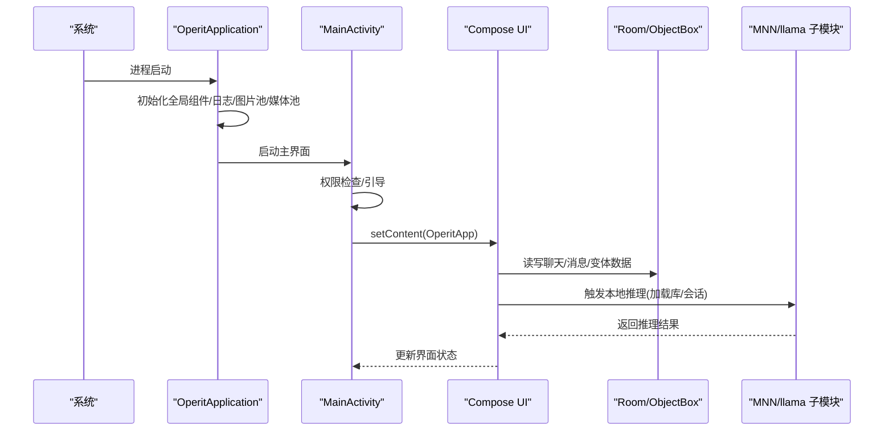
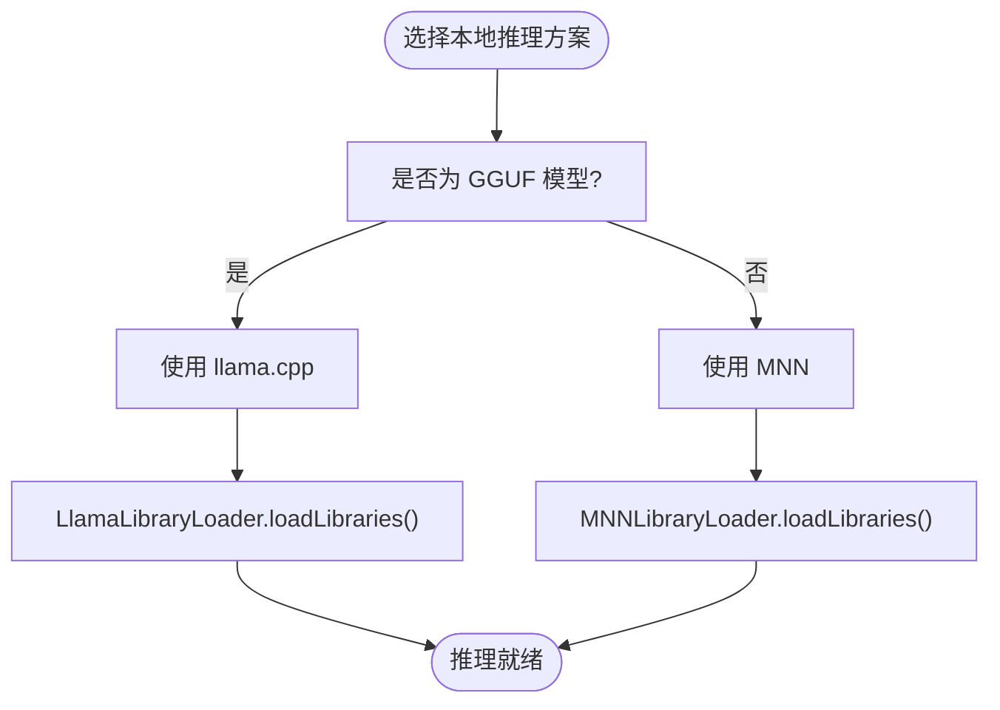
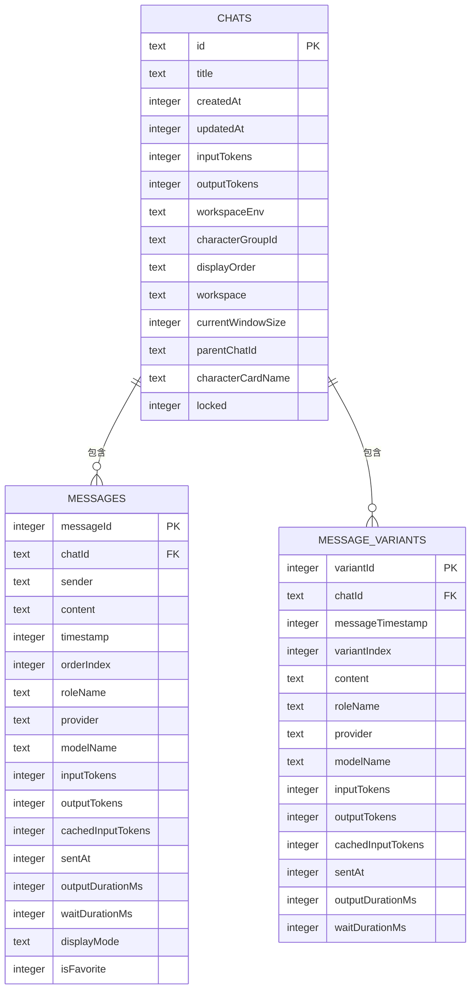
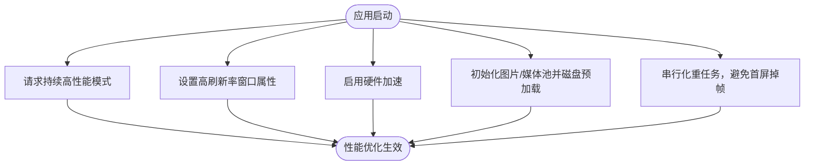
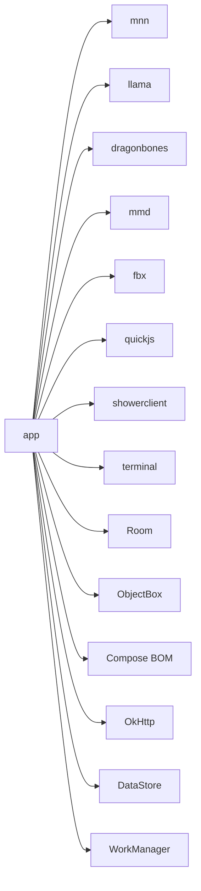

# 技术决策与权衡

<cite>
**本文引用的文件**
- [README.md](file://README.md)
- [settings.gradle.kts](file://settings.gradle.kts)
- [app/build.gradle.kts](file://app/build.gradle.kts)
- [gradle/libs.versions.toml](file://gradle/libs.versions.toml)
- [app/src/main/AndroidManifest.xml](file://app/src/main/AndroidManifest.xml)
- [app/src/main/java/com/ai/assistance/operit/core/application/OperitApplication.kt](file://app/src/main/java/com/ai/assistance/operit/core/application/OperitApplication.kt)
- [app/src/main/java/com/ai/assistance/operit/ui/main/MainActivity.kt](file://app/src/main/java/com/ai/assistance/operit/ui/main/MainActivity.kt)
- [app/src/main/java/com/ai/assistance/operit/data/db/AppDatabase.kt](file://app/src/main/java/com/ai/assistance/operit/data/db/AppDatabase.kt)
- [mnn/build.gradle.kts](file://mnn/build.gradle.kts)
- [llama/build.gradle.kts](file://llama/build.gradle.kts)
- [mnn/src/main/java/com/ai/assistance/mnn/MNNLibraryLoader.kt](file://mnn/src/main/java/com/ai/assistance/mnn/MNNLibraryLoader.kt)
- [llama/src/main/java/com/ai/assistance/llama/LlamaLibraryLoader.kt](file://llama/src/main/java/com/ai/assistance/llama/LlamaLibraryLoader.kt)
- [dragonbones/src/main/java/com/dragonbones/JniBridge.kt](file://dragonbones/src/main/java/com/dragonbones/JniBridge.kt)
</cite>

## 目录
1. [引言](#引言)
2. [项目结构](#项目结构)
3. [核心组件](#核心组件)
4. [架构总览](#架构总览)
5. [详细组件分析](#详细组件分析)
6. [依赖关系分析](#依赖关系分析)
7. [性能考量](#性能考量)
8. [故障排查指南](#故障排查指南)
9. [结论](#结论)
10. [附录](#附录)

## 引言
本文件面向 Operit AI 的技术决策与权衡，围绕技术栈选择、模块化架构、本地 AI 推理、性能优化与跨平台兼容性等方面，结合工程实际配置与源码证据，系统梳理各关键决策的动机、取舍与落地方式，并提供技术选型对比与决策矩阵，帮助开发者在理解现状的同时做出更稳健的演进决策。

## 项目结构
Operit 采用多模块聚合工程，主模块 app 负责 UI、业务与集成；推理子模块 mnn、llama 分别封装 MNN 与 llama.cpp 的本地推理；dragonbones、mmd、fbx 等模块负责图形与动画；quickjs 提供脚本运行时；terminal、showerclient 等模块承载系统与终端能力；web-chat 为可选前端工作区。



**图表来源**
- [settings.gradle.kts:21-29](file://settings.gradle.kts#L21-L29)

**章节来源**
- [settings.gradle.kts:1-30](file://settings.gradle.kts#L1-L30)

## 核心组件
- Kotlin 为主要开发语言：统一在 app 与各子模块中使用 Kotlin 编译与运行，配合 Kotlin 协程、Kotlinx Serialization、Parcelize 等插件，提升开发效率与类型安全。
- Jetpack Compose 作为 UI 框架：app 模块启用 compose 构建特性，UI 以声明式方式组织，配合 Material3、Navigation Compose 等生态。
- 数据库：Room 与 ObjectBox 并行使用，Room 用于结构化聊天与消息表，ObjectBox 用于高性能对象存储与向量检索等场景。
- 本地 AI 推理：MNN 与 llama.cpp 双轨并行，分别通过 CMake 构建与 JNI 桥接，提供 GGUF 与 Transformer 风格的本地推理能力。
- 模块化与 JNI：各子模块独立构建，通过 System.loadLibrary 与自定义 Loader 管理本地库加载，降低耦合并便于替换与演进。
- 性能优化：持续高性能模式、高刷新率窗口属性、硬件加速、图片/媒体池预加载与磁盘缓存策略。
- 跨平台兼容：Android 8.0+ 最低版本，针对不同 Android 版本的权限、窗口刷新率、高耗电与前台服务类型进行适配。

**章节来源**
- [app/build.gradle.kts:6-15](file://app/build.gradle.kts#L6-L15)
- [app/build.gradle.kts:129-133](file://app/build.gradle.kts#L129-L133)
- [app/build.gradle.kts:181-191](file://app/build.gradle.kts#L181-L191)
- [app/build.gradle.kts:311-321](file://app/build.gradle.kts#L311-L321)
- [mnn/build.gradle.kts:10-54](file://mnn/build.gradle.kts#L10-L54)
- [llama/build.gradle.kts:8-35](file://llama/build.gradle.kts#L8-L35)

## 架构总览
Operit 的应用生命周期由 Application 统一初始化，随后在 MainActivity 中完成权限与引导流程，再进入主 UI。本地推理通过 mnn/llama 子模块加载本地库，Room/ObjectBox 提供数据持久化，Compose 负责 UI 呈现，系统能力通过各子模块与系统服务对接。



**图表来源**
- [app/src/main/java/com/ai/assistance/operit/core/application/OperitApplication.kt:118-375](file://app/src/main/java/com/ai/assistance/operit/core/application/OperitApplication.kt#L118-L375)
- [app/src/main/java/com/ai/assistance/operit/ui/main/MainActivity.kt:200-247](file://app/src/main/java/com/ai/assistance/operit/ui/main/MainActivity.kt#L200-L247)
- [app/src/main/java/com/ai/assistance/operit/data/db/AppDatabase.kt:290-335](file://app/src/main/java/com/ai/assistance/operit/data/db/AppDatabase.kt#L290-L335)
- [mnn/src/main/java/com/ai/assistance/mnn/MNNLibraryLoader.kt:21-46](file://mnn/src/main/java/com/ai/assistance/mnn/MNNLibraryLoader.kt#L21-L46)
- [llama/src/main/java/com/ai/assistance/llama/LlamaLibraryLoader.kt:9-16](file://llama/src/main/java/com/ai/assistance/llama/LlamaLibraryLoader.kt#L9-L16)

## 详细组件分析

### 技术栈选择与权衡
- Kotlin
  - 优势：现代语言、空安全、协程、Kotlinx Serialization、Parcelable/Parcelize、KSP/KAPT 等生态完善；与 Android Gradle Plugin 高度契合。
  - 权衡：学习成本与团队迁移；与 Java 互操作良好，渐进式引入可行。
  - 证据：app 与各子模块均启用 Kotlin 插件与 Compose 插件，Room、Serialization、Kapt 等依赖明确。
- Jetpack Compose
  - 优势：声明式 UI、状态驱动、与 Material3/Navigation 集成度高、热重载友好。
  - 权衡：复杂动画/自绘场景可能需要与 View 混用；对老项目重构成本较高。
  - 证据：app 启用 compose 构建特性，大量 Material3 组件与 Navigation 使用。
- Room + ObjectBox
  - 优势：Room 适合结构化数据与事务，ObjectBox 适合高性能对象与向量检索。
  - 权衡：维护两套 ORM/存储方案增加复杂度；需注意迁移与一致性。
  - 证据：app 依赖 Room 与 ObjectBox，AppDatabase 定义实体与迁移。
- 本地 AI 推理：MNN vs llama.cpp
  - MNN：CMake 构建，开启 LLM/Transformer Fuse/低内存等选项，适合 Android 端轻量化部署。
  - llama.cpp：JNI stub + CMake 构建，支持 GGUF，适合纯推理场景。
  - 证据：mnn/llama 子模块各自配置 CMake 参数与 abiFilters，各自 Loader 管理库加载。

**章节来源**
- [app/build.gradle.kts:6-15](file://app/build.gradle.kts#L6-L15)
- [app/build.gradle.kts:181-191](file://app/build.gradle.kts#L181-L191)
- [app/build.gradle.kts:311-321](file://app/build.gradle.kts#L311-L321)
- [mnn/build.gradle.kts:10-54](file://mnn/build.gradle.kts#L10-L54)
- [llama/build.gradle.kts:8-35](file://llama/build.gradle.kts#L8-L35)

### 模块化架构与 JNI 桥接
- 独立本地模块
  - 将 MNN/llama/dragonbones 等原生能力拆分为独立模块，便于版本管理、CMake 配置与替换。
  - 通过 System.loadLibrary 与自定义 Loader（如 MNNLibraryLoader、LlamaLibraryLoader）确保库只加载一次，避免重复加载引发的问题。
- JNI 桥接
  - 通过 JNI 暴露本地接口给 Kotlin 使用，例如 DragonBones 的 JniBridge 定义了 init/loadDragonBones/onDrawFrame 等方法。
  - 优点：隔离原生逻辑、统一 Kotlin 接口；缺点：需要维护 ABI 与版本兼容。
- 证据：mnn/llama 的 build.gradle.kts 中配置 externalNativeBuild 与 CMake 参数；各自 Loader 管理库加载；dragonbones 的 JniBridge 定义本地方法。

```mermaid
classDiagram
class MNNLibraryLoader {
+loadLibraries()
+isLoaded() Boolean
}
class LlamaLibraryLoader {
+loadLibraries()
}
class JniBridge {
+init()
+loadDragonBones(...)
+onDrawFrame()
+...()
}
MNNLibraryLoader --> "System.loadLibrary" : "加载 MNN/MNNWrapper"
LlamaLibraryLoader --> "System.loadLibrary" : "加载 LlamaWrapper"
JniBridge --> "native" : "JNI 方法"
```

**图表来源**
- [mnn/src/main/java/com/ai/assistance/mnn/MNNLibraryLoader.kt:9-52](file://mnn/src/main/java/com/ai/assistance/mnn/MNNLibraryLoader.kt#L9-L52)
- [llama/src/main/java/com/ai/assistance/llama/LlamaLibraryLoader.kt:3-17](file://llama/src/main/java/com/ai/assistance/llama/LlamaLibraryLoader.kt#L3-L17)
- [dragonbones/src/main/java/com/dragonbones/JniBridge.kt:3-46](file://dragonbones/src/main/java/com/dragonbones/JniBridge.kt#L3-L46)

**章节来源**
- [mnn/build.gradle.kts:10-54](file://mnn/build.gradle.kts#L10-L54)
- [llama/build.gradle.kts:8-35](file://llama/build.gradle.kts#L8-L35)
- [mnn/src/main/java/com/ai/assistance/mnn/MNNLibraryLoader.kt:21-46](file://mnn/src/main/java/com/ai/assistance/mnn/MNNLibraryLoader.kt#L21-L46)
- [llama/src/main/java/com/ai/assistance/llama/LlamaLibraryLoader.kt:9-16](file://llama/src/main/java/com/ai/assistance/llama/LlamaLibraryLoader.kt#L9-L16)
- [dragonbones/src/main/java/com/dragonbones/JniBridge.kt:8-46](file://dragonbones/src/main/java/com/dragonbones/JniBridge.kt#L8-L46)

### 本地 AI 推理技术对比与选择
- MNN
  - 技术特点：C++ 核心，Android 端优化，支持 Transformer Fuse、低内存、ARM82 等特性；通过 CMake 构建，开启 LLM 支持。
  - 适用场景：Android 轻量化部署、Transformer 类模型、对内存占用敏感的场景。
- llama.cpp
  - 技术特点：纯 C++ 推理引擎，支持 GGUF 模型；通过 JNI stub 与 CMake 构建，便于后续接入真实实现。
  - 适用场景：纯推理、GGUF 模型、对模型格式灵活性要求高的场景。
- 选择理由
  - 双轨并行：兼顾不同模型格式与部署需求；逐步替换与演进更安全。
  - Loader 管理：避免重复加载，保证稳定性。
- 证据：mnn/llama 子模块的 CMake 参数与 Loader 实现。



**图表来源**
- [mnn/build.gradle.kts:26-51](file://mnn/build.gradle.kts#L26-L51)
- [llama/build.gradle.kts:24-33](file://llama/build.gradle.kts#L24-L33)
- [mnn/src/main/java/com/ai/assistance/mnn/MNNLibraryLoader.kt:21-46](file://mnn/src/main/java/com/ai/assistance/mnn/MNNLibraryLoader.kt#L21-L46)
- [llama/src/main/java/com/ai/assistance/llama/LlamaLibraryLoader.kt:9-16](file://llama/src/main/java/com/ai/assistance/llama/LlamaLibraryLoader.kt#L9-L16)

**章节来源**
- [mnn/build.gradle.kts:10-54](file://mnn/build.gradle.kts#L10-L54)
- [llama/build.gradle.kts:8-35](file://llama/build.gradle.kts#L8-L35)
- [mnn/src/main/java/com/ai/assistance/mnn/MNNLibraryLoader.kt:21-46](file://mnn/src/main/java/com/ai/assistance/mnn/MNNLibraryLoader.kt#L21-L46)
- [llama/src/main/java/com/ai/assistance/llama/LlamaLibraryLoader.kt:9-16](file://llama/src/main/java/com/ai/assistance/llama/LlamaLibraryLoader.kt#L9-L16)

### 数据库与持久化
- Room
  - 用于聊天与消息表，定义实体与 DAO，提供迁移脚本以保障版本演进。
  - 证据：AppDatabase 定义实体、DAO 与多版本迁移。
- ObjectBox
  - 用于高性能对象存储与向量检索等场景，与 Room 并行使用。
  - 证据：app 依赖 ObjectBox 与 Room。



**图表来源**
- [app/src/main/java/com/ai/assistance/operit/data/db/AppDatabase.kt:17-31](file://app/src/main/java/com/ai/assistance/operit/data/db/AppDatabase.kt#L17-L31)
- [app/src/main/java/com/ai/assistance/operit/data/db/AppDatabase.kt:142-172](file://app/src/main/java/com/ai/assistance/operit/data/db/AppDatabase.kt#L142-L172)

**章节来源**
- [app/src/main/java/com/ai/assistance/operit/data/db/AppDatabase.kt:290-335](file://app/src/main/java/com/ai/assistance/operit/data/db/AppDatabase.kt#L290-L335)
- [app/build.gradle.kts:311-321](file://app/build.gradle.kts#L311-L321)

### 性能优化决策
- 持续高性能模式
  - 在 Android 11+ 请求 sustained performance mode，减少 CPU/GPU 降频带来的卡顿。
  - 证据：MainActivity 中调用 setSustainedPerformanceMode(true)。
- 高刷新率优化
  - Android 11+ 通过 preferredDisplayModeId，Android 6.0+ 通过 preferredRefreshRate 设置窗口首选刷新率；同时启用硬件加速。
  - 证据：MainActivity 中根据系统版本设置窗口属性。
- 图片/媒体池与缓存
  - Application 中配置全局 ImageLoader，设置磁盘/内存缓存上限与超时策略；图片池与媒体池支持磁盘预加载。
  - 证据：OperitApplication 中全局 ImageLoader 与池管理初始化。
- 启动阶段串行化重任务
  - 避免首屏渲染期间并发大任务导致掉帧，采用串行预热策略。
  - 证据：OperitApplication 中对图片/媒体池与工具注册的串行化处理。



**图表来源**
- [app/src/main/java/com/ai/assistance/operit/ui/main/MainActivity.kt:650-685](file://app/src/main/java/com/ai/assistance/operit/ui/main/MainActivity.kt#L650-L685)
- [app/src/main/java/com/ai/assistance/operit/core/application/OperitApplication.kt:276-339](file://app/src/main/java/com/ai/assistance/operit/core/application/OperitApplication.kt#L276-L339)

**章节来源**
- [app/src/main/java/com/ai/assistance/operit/ui/main/MainActivity.kt:649-685](file://app/src/main/java/com/ai/assistance/operit/ui/main/MainActivity.kt#L649-L685)
- [app/src/main/java/com/ai/assistance/operit/core/application/OperitApplication.kt:276-339](file://app/src/main/java/com/ai/assistance/operit/core/application/OperitApplication.kt#L276-L339)

### 跨平台兼容性与权限管理
- Android 版本适配
  - 最低版本 Android 8.0（API 26），targetSdk 34；针对不同版本设置语言、窗口刷新率、前台服务类型等。
  - 证据：app/build.gradle.kts 中 minSdk/targetSdk；AndroidManifest.xml 中权限与前台服务类型声明。
- 设备兼容性
  - 通过 CMake 指定 ABI（arm64-v8a），并为 terminal 等模块提供 x86_64 二进制以适配模拟器。
  - 证据：app/build.gradle.kts 中 abiFilters 与 externalNativeBuild。
- 权限管理
  - 申请通知、存储、安装包、悬浮窗、录音、相机、位置、高耗电、前台服务等权限；针对 Android 13+ 的通知权限进行运行时请求。
  - 证据：AndroidManifest.xml 权限清单；MainActivity 中通知权限请求逻辑。
- 前台服务类型
  - 针对不同用途（数据同步、麦克风、媒体投影、特殊用途）设置合适的 foregroundServiceType。
  - 证据：AndroidManifest.xml 中服务声明与 property。

**章节来源**
- [app/build.gradle.kts:54-81](file://app/build.gradle.kts#L54-L81)
- [app/src/main/AndroidManifest.xml:13-56](file://app/src/main/AndroidManifest.xml#L13-L56)
- [app/src/main/AndroidManifest.xml:350-359](file://app/src/main/AndroidManifest.xml#L350-L359)
- [app/src/main/java/com/ai/assistance/operit/ui/main/MainActivity.kt:590-618](file://app/src/main/java/com/ai/assistance/operit/ui/main/MainActivity.kt#L590-L618)

## 依赖关系分析
- 依赖管理
  - 使用 libs.versions.toml 统一版本，确保 Compose BOM、Room、ObjectBox、WorkManager、OkHttp、DataStore 等依赖版本一致。
- 模块间依赖
  - app 依赖 mnn、llama、dragonbones、mmd、fbx、quickjs、showerclient、terminal 等模块，体现模块化与能力解耦。
- 外部库
  - Room/ObjectBox、Compose、OkHttp、DataStore、WorkManager、libsu、ZXing、Glide、ExoPlayer、Filament、ONNX Runtime 等广泛使用。



**图表来源**
- [app/build.gradle.kts:181-191](file://app/build.gradle.kts#L181-L191)
- [app/build.gradle.kts:311-321](file://app/build.gradle.kts#L311-L321)
- [gradle/libs.versions.toml:83-271](file://gradle/libs.versions.toml#L83-L271)

**章节来源**
- [app/build.gradle.kts:181-191](file://app/build.gradle.kts#L181-L191)
- [app/build.gradle.kts:311-321](file://app/build.gradle.kts#L311-L321)
- [gradle/libs.versions.toml:83-271](file://gradle/libs.versions.toml#L83-L271)

## 性能考量
- 启动性能
  - 通过 Application 阶段预热 TextSegmenter、PDFBox、Shower 环境、全局 ImageLoader 与池管理，减少首屏等待。
  - 证据：OperitApplication 中多处异步/串行初始化。
- UI 流畅度
  - 高刷新率与硬件加速；避免启动阶段并发重任务；图片/媒体池磁盘预加载。
  - 证据：MainActivity 中高刷新率与硬件加速设置；Application 中池预加载。
- 数据持久化
  - Room 迁移脚本与索引优化；ObjectBox 与 Room 并行使用，满足不同场景。
  - 证据：AppDatabase 的迁移与索引定义。

**章节来源**
- [app/src/main/java/com/ai/assistance/operit/core/application/OperitApplication.kt:257-339](file://app/src/main/java/com/ai/assistance/operit/core/application/OperitApplication.kt#L257-L339)
- [app/src/main/java/com/ai/assistance/operit/ui/main/MainActivity.kt:649-685](file://app/src/main/java/com/ai/assistance/operit/ui/main/MainActivity.kt#L649-L685)
- [app/src/main/java/com/ai/assistance/operit/data/db/AppDatabase.kt:139-200](file://app/src/main/java/com/ai/assistance/operit/data/db/AppDatabase.kt#L139-L200)

## 故障排查指南
- 权限相关
  - 通知权限（Android 13+）、存储权限、安装包权限、悬浮窗权限、录音/相机权限等；若缺失可能导致功能受限或崩溃。
  - 证据：AndroidManifest.xml 权限清单；MainActivity 中通知权限请求。
- 前台服务
  - 不同用途需设置对应 foregroundServiceType；若类型不匹配可能导致系统限制或无法运行。
  - 证据：AndroidManifest.xml 中服务声明与 property。
- 本地库加载
  - MNN/llama 库加载失败通常由 ABI 不匹配或缺失导致；确认 abiFilters 与 jniLibs 配置。
  - 证据：mnn/llama 子模块 CMake 与 abiFilters 配置；Loader 管理加载。
- 数据库迁移
  - Room 迁移失败多因字段缺失或类型不兼容；核对迁移脚本与实体定义。
  - 证据：AppDatabase 的迁移脚本。

**章节来源**
- [app/src/main/AndroidManifest.xml:13-56](file://app/src/main/AndroidManifest.xml#L13-L56)
- [app/src/main/AndroidManifest.xml:350-359](file://app/src/main/AndroidManifest.xml#L350-L359)
- [mnn/build.gradle.kts:19-24](file://mnn/build.gradle.kts#L19-L24)
- [llama/build.gradle.kts:19-21](file://llama/build.gradle.kts#L19-L21)
- [app/src/main/java/com/ai/assistance/operit/data/db/AppDatabase.kt:36-200](file://app/src/main/java/com/ai/assistance/operit/data/db/AppDatabase.kt#L36-L200)

## 结论
Operit 的技术选型以“模块化、可演进、强兼容”为核心：Kotlin/Compose 提升开发效率与 UI 表达力；Room/ObjectBox 满足结构化与高性能对象存储；MNN/llama 双轨本地推理满足多样化模型需求；通过持续高性能模式、高刷新率与硬件加速等手段保障用户体验；Android 8.0+ 的最低版本与完善的权限体系确保跨设备兼容。未来演进可在模型格式统一、模块边界收敛、缓存与迁移策略标准化方面进一步优化。

## 附录

### 技术选型对比与决策矩阵
- Kotlin vs Java
  - 优势：空安全、协程、Kotlinx Serialization、KSP/KAPT 生态完善。
  - 权衡：团队学习成本、与既有 Java 代码的过渡。
  - 决策：在新模块与重构中优先 Kotlin，渐进式迁移。
- Compose vs XML+View
  - 优势：声明式、状态驱动、热重载友好。
  - 权衡：复杂自绘/动画场景可能需要与 View 混用。
  - 决策：UI 以 Compose 为主，必要时混用 View。
- Room vs ObjectBox
  - 优势：Room 适合结构化数据与事务；ObjectBox 适合高性能对象与向量检索。
  - 权衡：维护两套 ORM 增加复杂度。
  - 决策：按场景分工，Room 负责聊天/消息，ObjectBox 负责高性能对象。
- MNN vs llama.cpp
  - 优势：MNN 适合 Android 端轻量化与 Transformer；llama.cpp 适合 GGUF 模型。
  - 权衡：双轨维护成本。
  - 决策：按模型格式与性能需求选择，逐步统一。

### 关键配置与路径参考
- 应用与构建
  - app/build.gradle.kts：插件、编译选项、abiFilters、externalNativeBuild、依赖。
  - gradle/libs.versions.toml：统一版本管理。
- 权限与前台服务
  - AndroidManifest.xml：权限清单、前台服务类型、高刷新率元数据。
- 数据库
  - AppDatabase.kt：实体、DAO、迁移脚本。
- 本地推理
  - mnn/build.gradle.kts、llama/build.gradle.kts：CMake 参数与 abiFilters。
  - MNNLibraryLoader.kt、LlamaLibraryLoader.kt：库加载管理。
- UI 与性能
  - MainActivity.kt：高刷新率、硬件加速、权限请求。
  - OperitApplication.kt：全局 ImageLoader、池管理、串行化重任务。

**章节来源**
- [app/build.gradle.kts:54-81](file://app/build.gradle.kts#L54-L81)
- [gradle/libs.versions.toml:83-271](file://gradle/libs.versions.toml#L83-L271)
- [app/src/main/AndroidManifest.xml:13-56](file://app/src/main/AndroidManifest.xml#L13-L56)
- [app/src/main/AndroidManifest.xml:126-135](file://app/src/main/AndroidManifest.xml#L126-L135)
- [app/src/main/java/com/ai/assistance/operit/data/db/AppDatabase.kt:290-335](file://app/src/main/java/com/ai/assistance/operit/data/db/AppDatabase.kt#L290-L335)
- [mnn/build.gradle.kts:26-51](file://mnn/build.gradle.kts#L26-L51)
- [llama/build.gradle.kts:24-33](file://llama/build.gradle.kts#L24-L33)
- [mnn/src/main/java/com/ai/assistance/mnn/MNNLibraryLoader.kt:21-46](file://mnn/src/main/java/com/ai/assistance/mnn/MNNLibraryLoader.kt#L21-L46)
- [llama/src/main/java/com/ai/assistance/llama/LlamaLibraryLoader.kt:9-16](file://llama/src/main/java/com/ai/assistance/llama/LlamaLibraryLoader.kt#L9-L16)
- [app/src/main/java/com/ai/assistance/operit/ui/main/MainActivity.kt:649-685](file://app/src/main/java/com/ai/assistance/operit/ui/main/MainActivity.kt#L649-L685)
- [app/src/main/java/com/ai/assistance/operit/core/application/OperitApplication.kt:276-339](file://app/src/main/java/com/ai/assistance/operit/core/application/OperitApplication.kt#L276-L339)