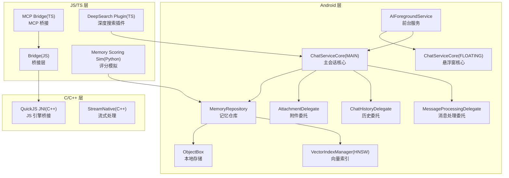
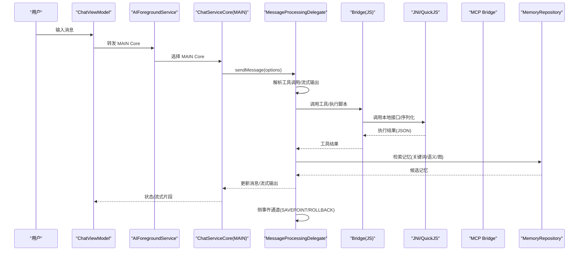
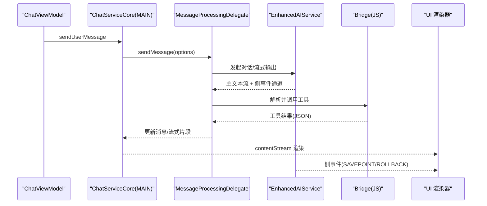
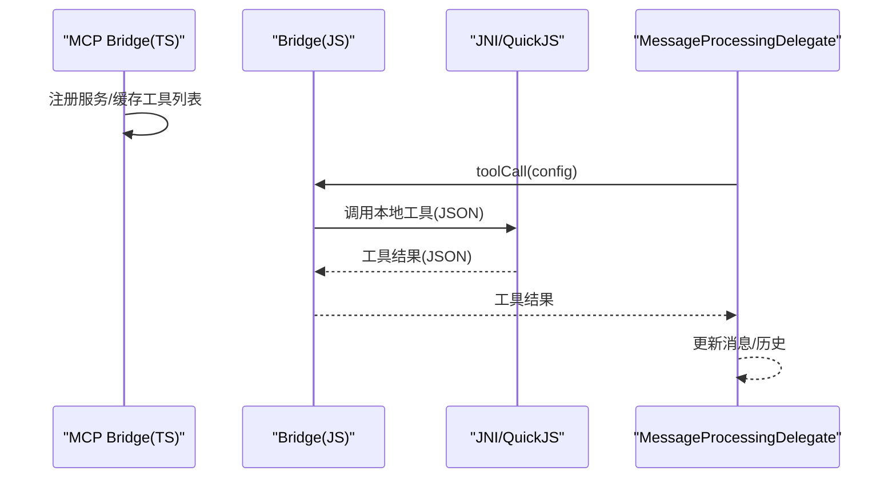
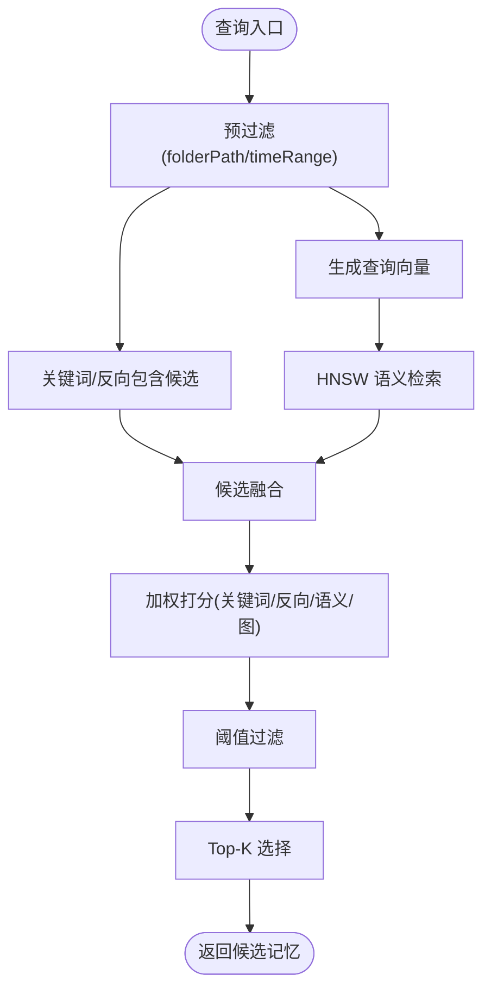
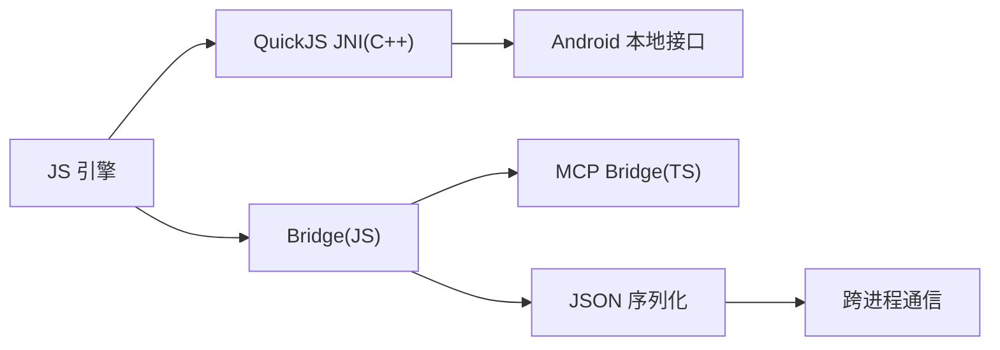
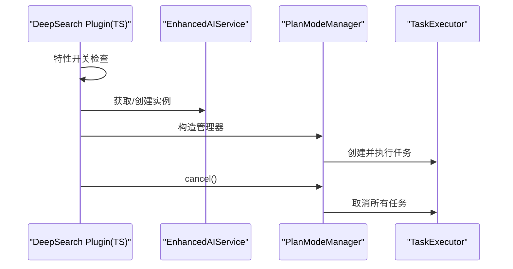
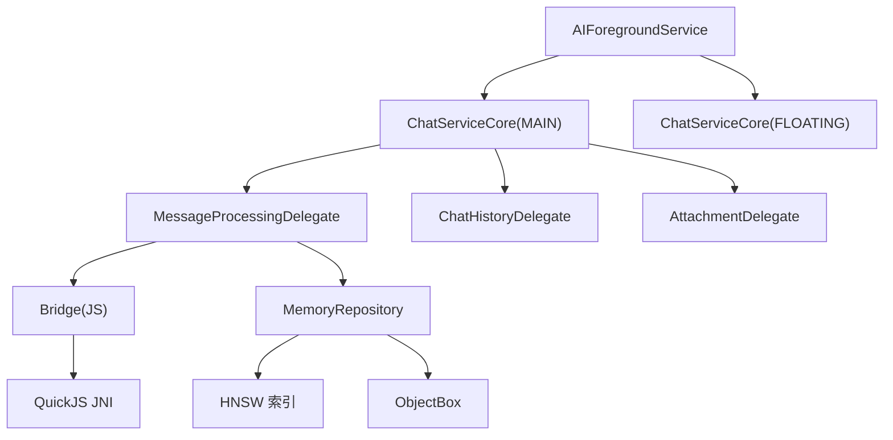

# 数据流架构

<cite>
**本文引用的文件**
- [README.md](file://README.md)
- [chat_runtime_foreground_service_plan.md](file://docs/chat_runtime_foreground_service_plan.md)
- [tool_stream_reconcile_plan.md](file://docs/tool_stream_reconcile_plan.md)
- [memory_candidate_scoring_formula.md](file://docs/memory_candidate_scoring_formula.md)
- [memory_scoring_sim.py](file://tools/memory/memory_scoring_sim.py)
- [README.md](file://tools/memory/README.md)
- [bridge_edges.js](file://app/src/androidTest/js/com/ai/assistance/operit/core/tools/javascript/bridge_edges/bridge_edges.js)
- [host_runtime.js](file://app/src/androidTest/js/com/ai/assistance/operit/core/tools/javascript/bridge_contract/host_runtime.js)
- [tool_error_surface.js](file://app/src/androidTest/js/com/ai/assistance/operit/core/tools/javascript/script_mode_contract/tool_error_surface.js)
- [index.js](file://app/src/main/assets/bridge/index.js)
- [index.ts](file://tools/mcp_bridge/index.ts)
- [quickjs_jni.cpp](file://quickjs/src/main/cpp/quickjs_jni.cpp)
- [java_bridge.js](file://examples/java_bridge.js)
- [deep-search-plugin.ts](file://examples/deepsearching/src/plugin/deep-search-plugin.ts)
- [plan-mode-manager.ts](file://examples/deepsearching/src/planning/plan-mode-manager.ts)
</cite>

## 目录
1. [简介](#简介)
2. [项目结构](#项目结构)
3. [核心组件](#核心组件)
4. [架构总览](#架构总览)
5. [详细组件分析](#详细组件分析)
6. [依赖分析](#依赖分析)
7. [性能考虑](#性能考虑)
8. [故障排查指南](#故障排查指南)
9. [结论](#结论)
10. [附录](#附录)

## 简介
本文件面向 Operit AI 的数据流架构，系统性描述从用户输入到最终结果输出的完整数据流，重点覆盖：
- AI 对话数据流：用户消息接收、AI 处理、工具调用解析、工具执行、结果返回
- 工具调用数据流：工具注册、权限检查、执行器调用、结果处理
- 内存管理数据流：记忆存储、向量化处理、搜索检索、结果返回
- 本地模块间数据交换：JNI 调用、数据序列化、跨进程通信
- 数据缓存策略、异步处理机制、错误处理与回滚机制

## 项目结构
Operit 采用 Android 原生与 JS/TS 混合架构，核心模块包括：
- Android 层：前台服务承载双会话运行时、消息处理委托、工具执行器、内存检索与向量索引
- JS/TS 层：桥接层、工具调用协议、MCP 桥接、深度搜索插件、内存评分模拟
- C/C++ 层：QuickJS 引擎桥接、JNI 边界、流式处理与序列化

**图示来源**
- [chat_runtime_foreground_service_plan.md:90-172](file://docs/chat_runtime_foreground_service_plan.md#L90-L172)
- [index.js:918-947](file://app/src/main/assets/bridge/index.js#L918-L947)
- [index.ts:1046-1076](file://tools/mcp_bridge/index.ts#L1046-L1076)
- [quickjs_jni.cpp:1-293](file://quickjs/src/main/cpp/quickjs_jni.cpp#L1-L293)
- [memory_scoring_sim.py:248-919](file://tools/memory/memory_scoring_sim.py#L248-L919)

**章节来源**
- [README.md:39-126](file://README.md#L39-L126)
- [chat_runtime_foreground_service_plan.md:1-409](file://docs/chat_runtime_foreground_service_plan.md#L1-L409)

## 核心组件
- 前台服务与双会话运行时：将聊天运行时从 UI 组件剥离至前台服务，维持 MAIN 与 FLOATING 两个独立会话核心，避免 UI 生命周期耦合。
- 消息处理与历史委托：负责消息解析、流式输出、工具调用解析、历史归档与状态管理。
- 工具执行与桥接：通过 JS/TS 桥接层与 JNI 接口，实现工具注册、权限校验、执行器调用与结果返回。
- 内存检索与向量索引：关键词/反向包含/语义/图传播多模态融合打分，HNSW 向量索引与 ObjectBox 存储。
- 异步流与回滚：侧事件通道（SAVEPOINT/ROLLBACK）保障流式显示与落库一致性。

**章节来源**
- [chat_runtime_foreground_service_plan.md:174-335](file://docs/chat_runtime_foreground_service_plan.md#L174-L335)
- [tool_stream_reconcile_plan.md:1-304](file://docs/tool_stream_reconcile_plan.md#L1-L304)
- [memory_candidate_scoring_formula.md:1-46](file://docs/memory_candidate_scoring_formula.md#L1-L46)

## 架构总览
Operit 的数据流遵循“前台服务承载 + 多委托协作 + 多模态检索 + 事件驱动回滚”的设计。用户输入经由前台服务内的 MAIN/FLOATING 会话核心，进入消息处理委托，解析工具调用并下发至桥接层与 JNI，工具执行结果回流至委托并写入历史；同时，记忆检索通过多模态打分与向量索引提供上下文增强；流式输出通过侧事件通道实现异常回滚与一致性保证。

**图示来源**
- [chat_runtime_foreground_service_plan.md:256-335](file://docs/chat_runtime_foreground_service_plan.md#L256-L335)
- [tool_stream_reconcile_plan.md:137-303](file://docs/tool_stream_reconcile_plan.md#L137-L303)
- [index.js:918-947](file://app/src/main/assets/bridge/index.js#L918-L947)
- [index.ts:1046-1076](file://tools/mcp_bridge/index.ts#L1046-L1076)

## 详细组件分析

### AI 对话数据流
- 用户输入接收：ChatViewModel 将 UI 操作转发至 MAIN Core，避免直接装配运行时。
- AI 处理与流式输出：EnhancedAIService 包装 provider 返回的主文本流，同时透传侧事件通道（SAVEPOINT/ROLLBACK）。
- 工具调用解析与执行：MessageProcessingDelegate 解析工具标记，桥接层将调用参数序列化并通过 JNI 调用本地工具，结果回流后继续流式渲染。
- 结果返回：消息内容与流式片段经 MAIN Core 返回 UI，同时写入历史与附件委托。

**图示来源**
- [chat_runtime_foreground_service_plan.md:174-253](file://docs/chat_runtime_foreground_service_plan.md#L174-L253)
- [tool_stream_reconcile_plan.md:162-230](file://docs/tool_stream_reconcile_plan.md#L162-L230)

**章节来源**
- [chat_runtime_foreground_service_plan.md:174-335](file://docs/chat_runtime_foreground_service_plan.md#L174-L335)
- [tool_stream_reconcile_plan.md:41-136](file://docs/tool_stream_reconcile_plan.md#L41-L136)

### 工具调用数据流
- 工具注册与缓存：MCP Bridge 通过 RPC 接口缓存工具列表，验证服务是否已注册后再写入缓存。
- 权限检查与执行器调用：桥接层将工具调用参数序列化为 JSON，通过 JNI 调用本地执行器；工具错误表面通过同步/异步调用暴露明确错误信息。
- 结果处理：工具结果经桥接层解析并返回给消息处理委托，委托根据结果更新消息与历史。

**图示来源**
- [index.ts:1046-1076](file://tools/mcp_bridge/index.ts#L1046-L1076)
- [index.js:918-947](file://app/src/main/assets/bridge/index.js#L918-L947)
- [bridge_edges.js:657-678](file://app/src/androidTest/js/com/ai/assistance/operit/core/tools/javascript/bridge_edges/bridge_edges.js#L657-L678)
- [host_runtime.js:106-135](file://app/src/androidTest/js/com/ai/assistance/operit/core/tools/javascript/bridge_contract/host_runtime.js#L106-L135)
- [tool_error_surface.js:1-37](file://app/src/androidTest/js/com/ai/assistance/operit/core/tools/javascript/script_mode_contract/tool_error_surface.js#L1-L37)

**章节来源**
- [index.ts:1046-1076](file://tools/mcp_bridge/index.ts#L1046-L1076)
- [index.js:918-947](file://app/src/main/assets/bridge/index.js#L918-L947)
- [bridge_edges.js:1-715](file://app/src/androidTest/js/com/ai/assistance/operit/core/tools/javascript/bridge_edges/bridge_edges.js#L1-L715)
- [host_runtime.js:106-135](file://app/src/androidTest/js/com/ai/assistance/operit/core/tools/javascript/bridge_contract/host_runtime.js#L106-L135)
- [tool_error_surface.js:1-37](file://app/src/androidTest/js/com/ai/assistance/operit/core/tools/javascript/script_mode_contract/tool_error_surface.js#L1-L37)

### 内存管理数据流
- 记忆存储与检索：MemoryRepository 负责按文件夹路径与时间范围预过滤，构建关键词与反向包含候选，调用 CloudEmbeddingService 生成查询向量，通过 HNSW 索引查找语义近邻，结合图传播与链接遍历融合打分。
- 多模态打分公式：关键词命中、反向包含、语义相似、图传播四类得分加权求和，经阈值过滤与 Top-K 截断，形成候选集供模型决策。
- 写回与去重：按“合并→更新→新增→建关系”顺序写回，避免重复与冲突；本地高相似去重优先复用旧记忆。

**图示来源**
- [memory_candidate_scoring_formula.md:1-46](file://docs/memory_candidate_scoring_formula.md#L1-L46)
- [memory_scoring_sim.py:248-919](file://tools/memory/memory_scoring_sim.py#L248-L919)
- [README.md:1-75](file://tools/memory/README.md#L1-L75)

**章节来源**
- [memory_candidate_scoring_formula.md:1-46](file://docs/memory_candidate_scoring_formula.md#L1-L46)
- [memory_scoring_sim.py:248-919](file://tools/memory/memory_scoring_sim.py#L248-L919)
- [README.md:1-75](file://tools/memory/README.md#L1-L75)

### 本地模块间数据交换
- JNI 调用与序列化：QuickJS JNI 将 JS 与本地桥接，负责 JSON 转义、对象引用与错误封装；Java 桥接脚本演示通过 Java 类型访问 Android 系统 API。
- 跨进程通信：MCP Bridge 通过 RPC 接口与桥接层交互，支持服务注册与工具缓存；Bridge(JS) 通过 JSON 传输参数与结果。
- 流式处理：StreamNative 提供 JSON/XML/纯文本等插件与分片器，配合桥接层实现流式输出与解析。

**图示来源**
- [quickjs_jni.cpp:1-293](file://quickjs/src/main/cpp/quickjs_jni.cpp#L1-L293)
- [java_bridge.js:187-221](file://examples/java_bridge.js#L187-L221)
- [index.js:918-947](file://app/src/main/assets/bridge/index.js#L918-L947)
- [index.ts:1046-1076](file://tools/mcp_bridge/index.ts#L1046-L1076)

**章节来源**
- [quickjs_jni.cpp:1-293](file://quickjs/src/main/cpp/quickjs_jni.cpp#L1-L293)
- [java_bridge.js:187-221](file://examples/java_bridge.js#L187-L221)
- [index.js:918-947](file://app/src/main/assets/bridge/index.js#L918-L947)
- [index.ts:1046-1076](file://tools/mcp_bridge/index.ts#L1046-L1076)

### 深度搜索与工作流
- 深度搜索插件：根据特性开关与聊天上下文选择 EnhancedAIService 实例，创建 PlanModeManager 管理任务执行与取消。
- 工作流取消：通过取消令牌与任务执行器中断当前计划，确保资源回收与状态一致。

**图示来源**
- [deep-search-plugin.ts:124-143](file://examples/deepsearching/src/plugin/deep-search-plugin.ts#L124-L143)
- [plan-mode-manager.ts:179-219](file://examples/deepsearching/src/planning/plan-mode-manager.ts#L179-L219)

**章节来源**
- [deep-search-plugin.ts:124-143](file://examples/deepsearching/src/plugin/deep-search-plugin.ts#L124-L143)
- [plan-mode-manager.ts:179-219](file://examples/deepsearching/src/planning/plan-mode-manager.ts#L179-L219)

## 依赖分析
- 前台服务与会话核心：AIForegroundService 持有两个 ChatServiceCore，分别服务 MAIN 与 FLOATING，避免 UI 生命周期耦合。
- 委托职责分离：MessageProcessingDelegate 不再共享 companion 状态，实例内维护加载状态与活跃流式会话 ID。
- 工具与桥接：MCP Bridge 与 Bridge(JS) 通过 JSON 传输参数，QuickJS JNI 负责序列化与错误封装。
- 内存检索：MemoryRepository 聚合关键词、语义与图传播，HNSW 索引与 ObjectBox 存储协同。

**图示来源**
- [chat_runtime_foreground_service_plan.md:256-335](file://docs/chat_runtime_foreground_service_plan.md#L256-L335)
- [index.js:918-947](file://app/src/main/assets/bridge/index.js#L918-L947)
- [quickjs_jni.cpp:1-293](file://quickjs/src/main/cpp/quickjs_jni.cpp#L1-L293)

**章节来源**
- [chat_runtime_foreground_service_plan.md:225-253](file://docs/chat_runtime_foreground_service_plan.md#L225-L253)
- [index.js:918-947](file://app/src/main/assets/bridge/index.js#L918-L947)
- [quickjs_jni.cpp:1-293](file://quickjs/src/main/cpp/quickjs_jni.cpp#L1-L293)

## 性能考虑
- 并行工具执行：只读工具可并行执行，缩短响应时间。
- 对话并行：支持并行对话处理与工具包 state 决策，提升吞吐。
- 流式渲染与回滚：侧事件通道保障异常回滚，避免重复渲染与无效计算。
- 向量索引与预过滤：按 folderPath 与时间范围预过滤，降低检索成本；HNSW 索引按维度分文件管理，支持增量重建。

[本节为通用指导，无需列出具体文件来源]

## 故障排查指南
- 工具调用错误：通过同步/异步工具调用暴露明确错误信息，定位空工具名、参数缺失等问题。
- 流式回滚：若出现“半截旧 tool + 新 tool”污染，确认侧事件通道（SAVEPOINT/ROLLBACK）在链路中透传，UI 与委托均需响应回滚事件。
- MCP 缓存：若服务未注册，检查缓存工具列表与服务注册状态，确保参数 name 与 tools 正确。
- JNI 序列化：核对 JSON 转义与对象引用，避免跨语言边界错误。

**章节来源**
- [tool_error_surface.js:1-37](file://app/src/androidTest/js/com/ai/assistance/operit/core/tools/javascript/script_mode_contract/tool_error_surface.js#L1-L37)
- [tool_stream_reconcile_plan.md:248-289](file://docs/tool_stream_reconcile_plan.md#L248-L289)
- [index.js:918-947](file://app/src/main/assets/bridge/index.js#L918-L947)
- [index.ts:1046-1076](file://tools/mcp_bridge/index.ts#L1046-L1076)
- [quickjs_jni.cpp:1-293](file://quickjs/src/main/cpp/quickjs_jni.cpp#L1-L293)

## 结论
Operit 的数据流架构通过“前台服务承载 + 多委托协作 + 多模态检索 + 事件驱动回滚”实现了从用户输入到结果输出的高可靠、高性能与可扩展的数据处理链路。工具调用、内存检索与流式输出均具备清晰的边界与回滚机制，确保在复杂场景下的稳定性与一致性。

[本节为总结性内容，无需列出具体文件来源]

## 附录
- 参考文档与指南：README 中的功能速览、集成能力与数据备份策略；工具开发与脚本开发指南；内存评分公式与模拟工具。

**章节来源**
- [README.md:78-146](file://README.md#L78-L146)
- [README.md:409-458](file://README.md#L409-L458)