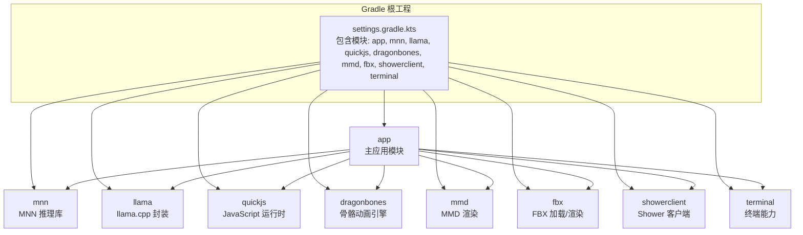
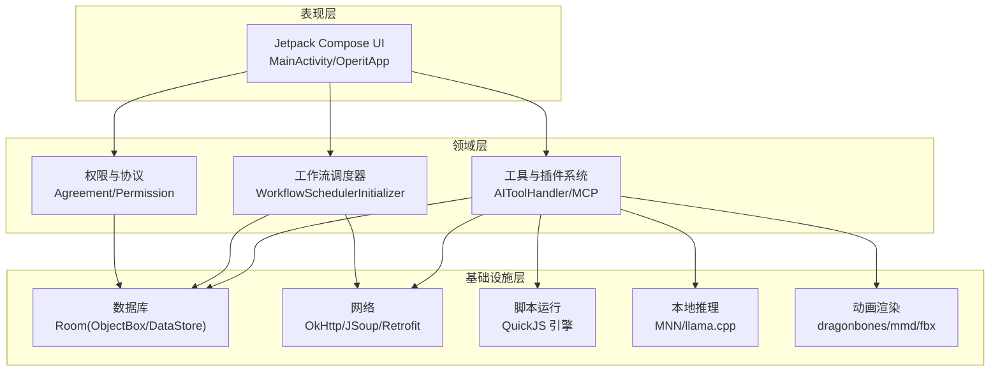
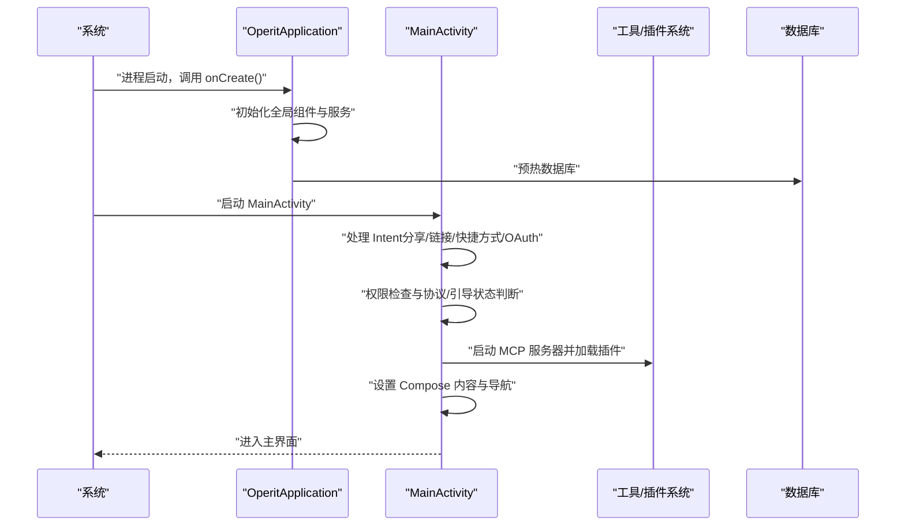
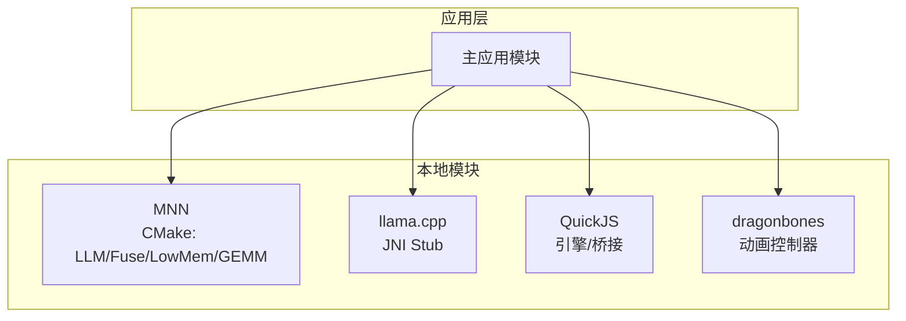
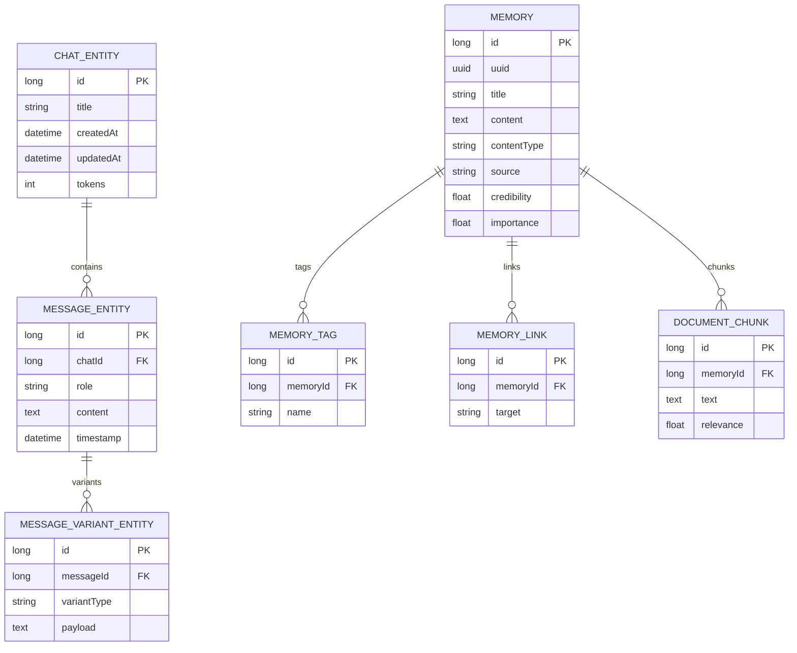
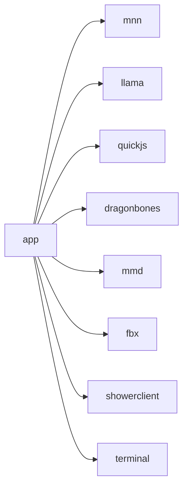

# 整体架构设计

<cite>
**本文档引用的文件**
- [AndroidManifest.xml](file://app/src/main/AndroidManifest.xml)
- [OperitApplication.kt](file://app/src/main/java/com/ai/assistance/operit/core/application/OperitApplication.kt)
- [MainActivity.kt](file://app/src/main/java/com/ai/assistance/operit/ui/main/MainActivity.kt)
- [build.gradle.kts（应用）](file://app/build.gradle.kts)
- [settings.gradle.kts](file://settings.gradle.kts)
- [libs.versions.toml](file://gradle/libs.versions.toml)
- [build.gradle.kts（MNN）](file://mnn/build.gradle.kts)
- [build.gradle.kts（llama）](file://llama/build.gradle.kts)
- [build.gradle.kts（quickjs）](file://quickjs/build.gradle.kts)
- [default.json（ObjectBox 模型）](file://app/objectbox-models/default.json)
- [MemoryRepository.kt](file://app/src/main/java/com/ai/assistance/operit/data/repository/MemoryRepository.kt)
- [QUICK_START_GUIDE.md](file://QUICK_START_GUIDE.md)
</cite>

## 目录
1. [引言](#引言)
2. [项目结构](#项目结构)
3. [核心组件](#核心组件)
4. [架构总览](#架构总览)
5. [详细组件分析](#详细组件分析)
6. [依赖分析](#依赖分析)
7. [性能考虑](#性能考虑)
8. [故障排除指南](#故障排除指南)
9. [结论](#结论)
10. [附录](#附录)

## 引言
本文件为 Operit AI 的整体架构设计文档，聚焦于模块化与分层架构的设计理念与实现方式，系统阐述应用从 OperitApplication 初始化到 MainActivity 启动的完整启动流程，并深入解析主应用模块与本地模块（MNN、llama.cpp、QuickJS、dragonbones 等）的集成架构。文档同时说明技术栈选择的原因（如 Kotlin/Jetpack Compose、ObjectBox、Room 等），并提供系统架构图与模块依赖图，帮助开发者快速理解系统布局。

## 项目结构
Operit 采用多模块 Gradle 架构，根工程包含主应用模块与若干本地/第三方能力模块。模块间通过 Gradle 依赖进行耦合，主应用负责 UI、业务与集成，本地模块封装原生推理与脚本运行能力。

图表来源
- [settings.gradle.kts:21-29](file://settings.gradle.kts#L21-L29)
- [build.gradle.kts（应用）:183-190](file://app/build.gradle.kts#L183-L190)

章节来源
- [settings.gradle.kts:1-30](file://settings.gradle.kts#L1-L30)
- [build.gradle.kts（应用）:1-445](file://app/build.gradle.kts#L1-L445)

## 核心组件
- 应用生命周期与初始化
  - OperitApplication：全局应用入口，负责语言设置、全局异常处理、WorkManager 初始化、JSON 序列化器、图片/媒体池、工具注册、工作流调度器、持久后台服务等。
  - MainActivity：基于 Jetpack Compose 的主界面，负责权限检查、插件加载、路由导航、分享/链接处理、高刷与硬件加速配置等。
- 本地模块集成
  - MNN：通过 CMake 编译与链接，启用 LLM 支持与低内存优化。
  - llama.cpp：JNI 封装，提供会话与推理能力。
  - QuickJS：提供 JavaScript 脚本运行与桥接能力，支持与 Java/Kotlin 的互操作。
  - dragonbones：骨骼动画渲染与视图封装。
- 数据存储与偏好
  - Room：聊天历史与消息实体。
  - ObjectBox：长期记忆与文档分块。
  - DataStore：用户设置、模型偏好与主题配置。

章节来源
- [OperitApplication.kt:118-375](file://app/src/main/java/com/ai/assistance/operit/core/application/OperitApplication.kt#L118-L375)
- [MainActivity.kt:200-247](file://app/src/main/java/com/ai/assistance/operit/ui/main/MainActivity.kt#L200-L247)
- [build.gradle.kts（MNN）:26-51](file://mnn/build.gradle.kts#L26-L51)
- [build.gradle.kts（llama）:23-33](file://llama/build.gradle.kts#L23-L33)
- [build.gradle.kts（quickjs）:15-24](file://quickjs/build.gradle.kts#L15-L24)
- [QUICK_START_GUIDE.md:546-596](file://QUICK_START_GUIDE.md#L546-L596)

## 架构总览
Operit 采用模块化与分层架构：
- 分层架构
  - 表现层：Jetpack Compose UI，负责界面与交互。
  - 领域层：工具与工作流调度、MCP 服务器、权限与协议管理。
  - 基础设施层：数据库（Room/ObjectBox）、网络（OkHttp/JSoup）、脚本运行（QuickJS）、本地推理（MNN/llama.cpp）。
- 模块化架构
  - 主应用模块聚合各本地模块；本地模块通过 CMake/NDK 与 JNI 暴露接口；应用通过 Gradle 依赖装配。

图表来源
- [MainActivity.kt:688-794](file://app/src/main/java/com/ai/assistance/operit/ui/main/MainActivity.kt#L688-L794)
- [OperitApplication.kt:149-151](file://app/src/main/java/com/ai/assistance/operit/core/application/OperitApplication.kt#L149-L151)
- [QUICK_START_GUIDE.md:546-596](file://QUICK_START_GUIDE.md#L546-L596)

## 详细组件分析

### 启动流程：从 OperitApplication 到 MainActivity
- Application 初始化
  - 设置 OpenMP 环境变量、应用图标组件状态、崩溃恢复日志、WorkManager 初始化。
  - 注册全局异常处理器、初始化 JSON 序列化器、语言设置（AppCompatDelegate 或 Configuration）。
  - 初始化用户偏好、权限偏好、功能提示词、自定义表情、Shower 环境、PDFBox 资源加载、语言工厂、Waifu 消息处理器。
  - 预热 TextSegmenter、数据库、全局图片加载器（Coil）、图片/媒体池、工具注册、工作流调度器、备份计划、无障碍服务预绑定。
- Activity 启动
  - MainActivity 在 onCreate 中处理 Intent（分享/链接/快捷方式/OAuth 回调），进行通知权限检查、权限级别检查、插件加载状态管理。
  - 配置高刷与硬件加速，设置 Compose 内容，根据协议与权限状态决定显示协议界面、权限引导或主界面。
  - 启动 MCP 服务器并加载插件，处理待处理的分享文件/链接，支持双击返回退出。

图表来源
- [OperitApplication.kt:118-375](file://app/src/main/java/com/ai/assistance/operit/core/application/OperitApplication.kt#L118-L375)
- [MainActivity.kt:200-247](file://app/src/main/java/com/ai/assistance/operit/ui/main/MainActivity.kt#L200-L247)
- [MainActivity.kt:431-466](file://app/src/main/java/com/ai/assistance/operit/ui/main/MainActivity.kt#L431-L466)

章节来源
- [OperitApplication.kt:118-375](file://app/src/main/java/com/ai/assistance/operit/core/application/OperitApplication.kt#L118-L375)
- [MainActivity.kt:200-247](file://app/src/main/java/com/ai/assistance/operit/ui/main/MainActivity.kt#L200-L247)
- [AndroidManifest.xml:195-240](file://app/src/main/AndroidManifest.xml#L195-L240)

### 本地模块集成架构
- MNN
  - 通过 CMake 参数控制编译选项，启用 LLM 支持、Transformer Fuse、低内存与 GEMM 量化等特性；ABI 限定为 arm64-v8a。
- llama.cpp
  - 当前为 JNI stub，后续可接入真实 llama.cpp；CMake 参数启用通用构建。
- QuickJS
  - 提供 JavaScript 运行时与桥接接口，支持静态方法/实例方法/字段访问、挂起调用、结果 JSON 化与类型转换。
- dragonbones
  - 提供骨骼动画控制器与视图封装，配合 Compose 使用。

图表来源
- [build.gradle.kts（MNN）:26-51](file://mnn/build.gradle.kts#L26-L51)
- [build.gradle.kts（llama）:23-33](file://llama/build.gradle.kts#L23-L33)
- [build.gradle.kts（quickjs）:15-24](file://quickjs/build.gradle.kts#L15-L24)

章节来源
- [build.gradle.kts（MNN）:26-51](file://mnn/build.gradle.kts#L26-L51)
- [build.gradle.kts（llama）:23-33](file://llama/build.gradle.kts#L23-L33)
- [build.gradle.kts（quickjs）:15-24](file://quickjs/build.gradle.kts#L15-L24)

### 数据存储与偏好
- Room：聊天历史（ChatEntity/MessageEntity/MessageVariantEntity）。
- ObjectBox：长期记忆（Memory）、标签（MemoryTag）、链接（MemoryLink）、文档分块（DocumentChunk）。
- DataStore：用户设置、模型偏好、主题配置。
- 访问层：ChatHistoryManager、MemoryRepository、PreferencesManager。

图表来源
- [QUICK_START_GUIDE.md:546-596](file://QUICK_START_GUIDE.md#L546-L596)
- [default.json（ObjectBox 模型）:1-53](file://app/objectbox-models/default.json#L1-L53)
- [MemoryRepository.kt:55-88](file://app/src/main/java/com/ai/assistance/operit/data/repository/MemoryRepository.kt#L55-L88)

章节来源
- [QUICK_START_GUIDE.md:546-596](file://QUICK_START_GUIDE.md#L546-L596)
- [default.json（ObjectBox 模型）:1-53](file://app/objectbox-models/default.json#L1-L53)
- [MemoryRepository.kt:55-88](file://app/src/main/java/com/ai/assistance/operit/data/repository/MemoryRepository.kt#L55-L88)

### 技术栈选择与权衡
- Kotlin + Jetpack Compose
  - 类型安全、协程生态完善、声明式 UI，适合复杂交互与跨平台脚本桥接。
- ObjectBox vs Room
  - ObjectBox 适合高吞吐写入与复杂查询（长期记忆），Room 适合结构化聊天历史与事务一致性。
- QuickJS
  - 轻量、可嵌入、与 Java/Kotlin 桥接良好，满足动态 UI 与工具包渲染需求。
- MNN/llama.cpp
  - MNN 面向移动端推理优化（低内存、量化），llama.cpp 提供灵活的本地推理能力。
- 网络与多媒体
  - OkHttp/JSoup/Retrofit 用于网络，ExoPlayer/Coil/Filament 等用于多媒体与渲染。

章节来源
- [libs.versions.toml:83-261](file://gradle/libs.versions.toml#L83-L261)
- [build.gradle.kts（应用）:181-444](file://app/build.gradle.kts#L181-L444)

## 依赖分析
- 模块依赖
  - app 依赖 mnn、llama、quickjs、dragonbones、mmd、fbx、showerclient、terminal 等本地模块。
- 运行时依赖
  - Compose BOM、Room、ObjectBox、WorkManager、OkHttp、DataStore、协程、日志等。
- NDK/ABI
  - 统一 ABI 为 arm64-v8a，保证本地模块与主应用二进制兼容。

图表来源
- [build.gradle.kts（应用）:183-190](file://app/build.gradle.kts#L183-L190)
- [settings.gradle.kts:21-29](file://settings.gradle.kts#L21-L29)

章节来源
- [build.gradle.kts（应用）:181-444](file://app/build.gradle.kts#L181-L444)
- [settings.gradle.kts:1-30](file://settings.gradle.kts#L1-L30)

## 性能考虑
- 启动阶段
  - 使用协程与串行化后台任务，避免首屏掉帧；预热图片/媒体池与数据库；延迟注册工具与预绑定无障碍服务。
- 渲染与显示
  - 高刷率与硬件加速配置，提升 UI 流畅度；Compose 与 Filament/ExoPlayer 等结合优化多媒体体验。
- 存储与检索
  - Room 与 ObjectBox 分层存储，减少热点表压力；向量检索与分块索引提升记忆查询效率。
- 本地推理
  - MNN 低内存与量化参数，llama.cpp JNI 封装，平衡性能与功耗。

## 故障排除指南
- 启动异常
  - 全局异常处理器捕获未处理异常，建议检查崩溃日志与 WorkManager 初始化状态。
- 权限问题
  - Android 13+ 需要通知权限；权限级别缺失会导致引导界面显示；检查权限偏好与协议接受状态。
- 插件加载失败
  - 检查 MCP 服务器初始化与超时；确认插件包状态与路由参数。
- 本地模块加载失败
  - 确认 ABI 与 NDK 配置一致；检查 CMake 参数与 so 库打包情况。

章节来源
- [OperitApplication.kt:170-172](file://app/src/main/java/com/ai/assistance/operit/core/application/OperitApplication.kt#L170-L172)
- [MainActivity.kt:590-618](file://app/src/main/java/com/ai/assistance/operit/ui/main/MainActivity.kt#L590-L618)
- [MainActivity.kt:453-466](file://app/src/main/java/com/ai/assistance/operit/ui/main/MainActivity.kt#L453-L466)
- [build.gradle.kts（MNN）:21-24](file://mnn/build.gradle.kts#L21-L24)

## 结论
Operit 通过模块化与分层架构实现了清晰的职责划分：主应用负责 UI 与集成，本地模块提供推理与脚本能力，基础设施层保障数据与网络。启动流程在 Application 层完成全局初始化，在 Activity 层完成权限与插件加载，最终进入主界面。技术栈选择兼顾性能、可维护性与扩展性，适合在移动平台上构建复杂的智能代理系统。

## 附录
- 关键清单
  - 启动计时日志：用于定位初始化耗时瓶颈。
  - WorkManager 配置：确保后台任务稳定运行。
  - ABI 与 NDK：统一 arm64-v8a，避免二进制不兼容。
  - 数据模型：Room/ObjectBox/DataStore 的职责边界明确。