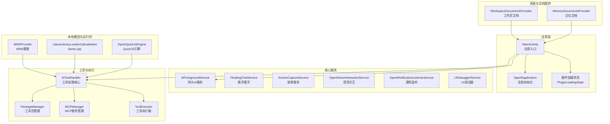
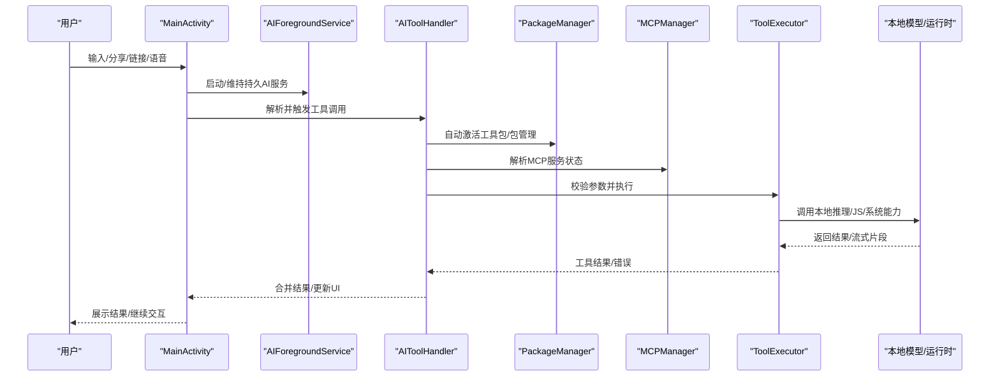
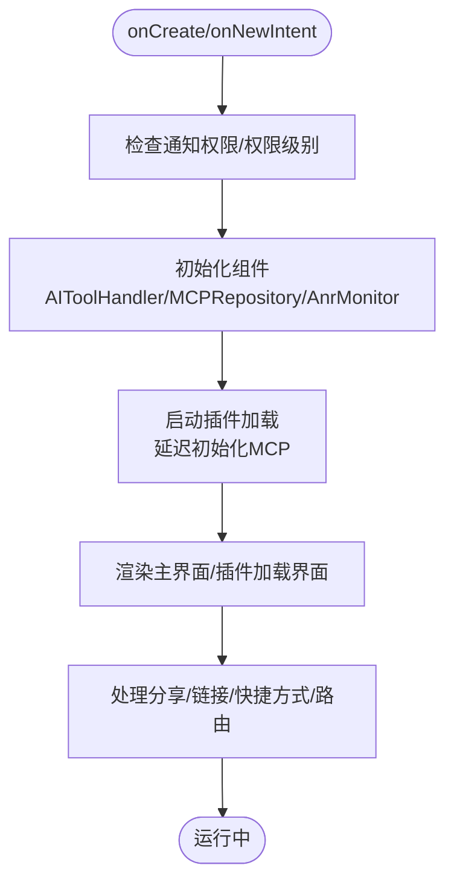
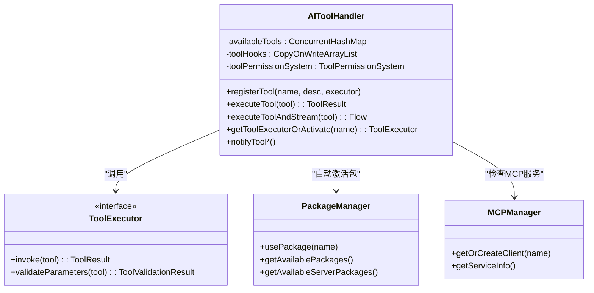
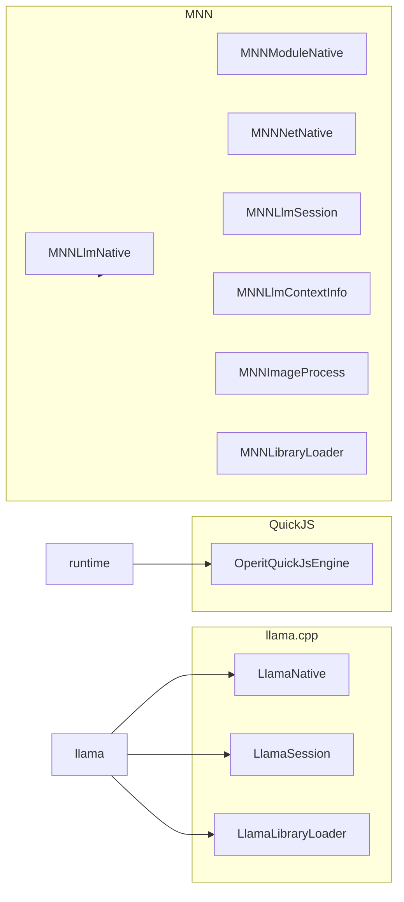
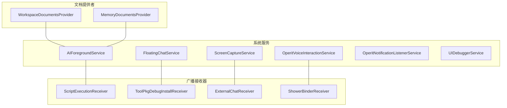
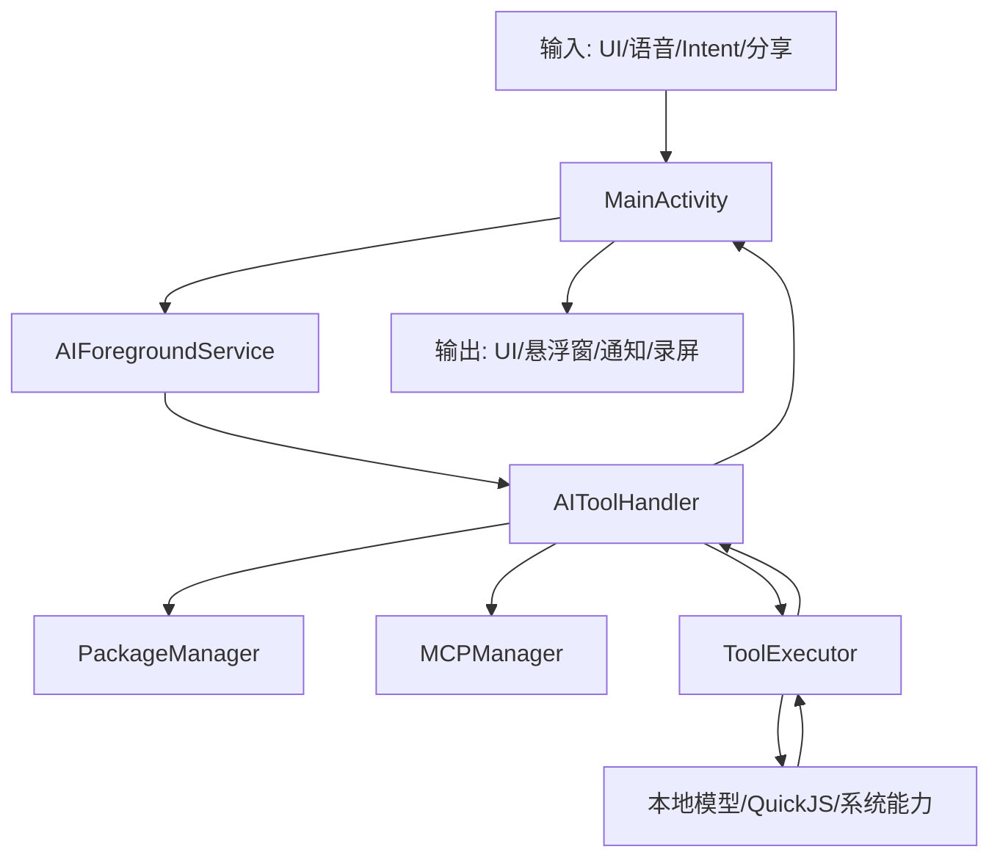
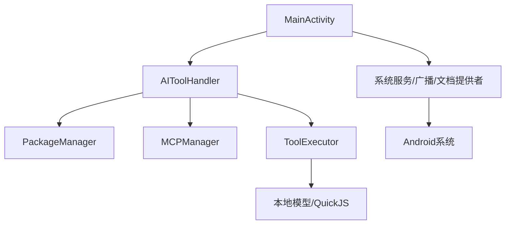

# 核心架构

<cite>
**本文引用的文件**
- [README.md](file://README.md)
- [AndroidManifest.xml](file://app/src/main/AndroidManifest.xml)
- [MainActivity.kt](file://app/src/main/java/com/ai/assistance/operit/ui/main/MainActivity.kt)
- [AIToolHandler.kt](file://app/src/main/java/com/ai/assistance/operit/core/tools/AIToolHandler.kt)
- [OperitApplication.kt](file://app/src/main/java/com/ai/assistance/operit/core/application/OperitApplication.kt)
- [OperitQuickJsEngine.kt](file://quickjs/src/main/java/com/ai/assistance/operit/core/tools/javascript/OperitQuickJsEngine.kt)
- [MNNProvider.kt](file://app/src/main/java/com/ai/assistance/operit/api/chat/llmprovider/MNNProvider.kt)
- [AIForegroundService.kt](file://app/src/main/java/com/ai/assistance/operit/api/chat/AIForegroundService.kt)
- [MNNLlmNative.kt](file://mnn/src/main/java/com/ai/assistance/mnn/MNNLlmNative.kt)
- [MNNModule.kt](file://mnn/src/main/java/com/ai/assistance/mnn/MNNModule.kt)
- [LlamaLibraryLoader.kt](file://llama/src/main/java/com/ai/assistance/llama/LlamaLibraryLoader.kt)
- [LlamaNative.kt](file://llama/src/main/java/com/ai/assistance/llama/LlamaNative.kt)
- [LlamaSession.kt](file://llama/src/main/java/com/ai/assistance/llama/LlamaSession.kt)
- [MNNLibraryLoader.kt](file://mnn/src/main/java/com/ai/assistance/mnn/MNNLibraryLoader.kt)
- [MNNNetNative.kt](file://mnn/src/main/java/com/ai/assistance/mnn/MNNNetNative.kt)
- [MNNModuleNative.kt](file://mnn/src/main/java/com/ai/assistance/mnn/MNNModuleNative.kt)
- [MNNNetInstance.kt](file://mnn/src/main/java/com/ai/assistance/mnn/MNNNetInstance.kt)
- [MNNLlmSession.kt](file://mnn/src/main/java/com/ai/assistance/mnn/MNNLlmSession.kt)
- [MNNLlmContextInfo.kt](file://mnn/src/main/java/com/ai/assistance/mnn/MNNLlmContextInfo.kt)
- [MNNImageProcess.kt](file://mnn/src/main/java/com/ai/assistance/mnn/MNNImageProcess.kt)
- [MNNForwardType.kt](file://mnn/src/main/java/com/ai/assistance/mnn/MNNForwardType.kt)
- [DragonBonesController.kt](file://dragonbones/src/main/java/com/dragonbones/DragonBonesController.kt)
- [DragonBonesView.kt](file://dragonbones/src/main/java/com/dragonbones/DragonBonesView.kt)
- [JniBridge.kt](file://dragonbones/src/main/java/com/dragonbones/JniBridge.kt)
- [FbxNative.kt](file://fbx/src/main/java/com/ai/assistance/fbx/FbxNative.kt)
- [MmdNative.kt](file://mmd/src/main/java/com/ai/assistance/mmd/MmdNative.kt)
- [MmdInspector.kt](file://mmd/src/main/java/com/ai/assistance/mmd/MmdInspector.kt)
- [MmdLibraryLoader.kt](file://mmd/src/main/java/com/ai/assistance/mmd/MmdLibraryLoader.kt)
- [FbxLibraryLoader.kt](file://fbx/src/main/java/com/ai/assistance/fbx/FbxLibraryLoader.kt)
- [FbxInspector.kt](file://fbx/src/main/java/com/ai/assistance/fbx/FbxInspector.kt)
- [FbxGlSurfaceView.kt](file://fbx/src/main/java/com/ai/assistance/fbx/FbxGlSurfaceView.kt)
- [MmdGlSurfaceView.kt](file://mmd/src/main/java/com/ai/assistance/mmd/MmdGlSurfaceView.kt)
- [AIServiceFactory.kt](file://app/src/main/java/com/ai/assistance/operit/api/chat/llmprovider/AIServiceFactory.kt)
- [AIService.kt](file://app/src/main/java/com/ai/assistance/operit/api/chat/llmprovider/AIService.kt)
- [RateLimitedAIService.kt](file://app/src/main/java/com/ai/assistance/operit/api/chat/llmprovider/RateLimitedAIService.kt)
- [ToolPkgJsAiProviderService.kt](file://app/src/main/java/com/ai/assistance/operit/api/chat/llmprovider/ToolPkgJsAiProviderService.kt)
- [OllamaProvider.kt](file://app/src/main/java/com/ai/assistance/operit/api/chat/llmprovider/OllamaProvider.kt)
- [EnhancedAIService.kt](file://app/src/main/java/com/ai/assistance/operit/api/chat/EnhancedAIService.kt)
- [MultiServiceManager.kt](file://app/src/main/java/com/ai/assistance/operit/api/chat/enhance/MultiServiceManager.kt)
- [ConversationService.kt](file://app/src/main/java/com/ai/assistance/operit/api/chat/enhance/ConversationService.kt)
- [FileBindingService.kt](file://app/src/main/java/com/ai/assistance/operit/api/chat/enhance/FileBindingService.kt)
- [FloatingChatService.kt](file://app/src/main/java/com/ai/assistance/operit/services/FloatingChatService.kt)
- [ScreenCaptureService.kt](file://app/src/main/java/com/ai/assistance/operit/core/tools/system/ScreenCaptureService.kt)
- [OperitVoiceInteractionService.kt](file://app/src/main/java/com/ai/assistance/operit/services/assistant/OperitVoiceInteractionService.kt)
- [OperitVoiceInteractionSessionService.kt](file://app/src/main/java/com/ai/assistance/operit/services/assistant/OperitVoiceInteractionSessionService.kt)
- [OperitNotificationListenerService.kt](file://app/src/main/java/com/ai/assistance/operit/services/notification/OperitNotificationListenerService.kt)
- [UIDebuggerService.kt](file://app/src/main/java/com/ai/assistance/operit/services/UIDebuggerService.kt)
- [ShowerBinderReceiver.kt](file://app/src/main/java/com/ai/assistance/operit/core/tools/agent/ShowerBinderReceiver.kt)
- [ShowerController.kt](file://app/src/main/java/com/ai/assistance/operit/core/tools/agent/ShowerController.kt)
- [VirtualDisplayOverlay.kt](file://app/src/main/java/com/ai/assistance/operit/ui/common/displays/VirtualDisplayOverlay.kt)
- [WorkspaceDocumentsProvider.kt](file://app/src/main/java/com/ai/assistance/operit/provider/WorkspaceDocumentsProvider.kt)
- [MemoryDocumentsProvider.kt](file://app/src/main/java/com/ai/assistance/operit/provider/MemoryDocumentsProvider.kt)
- [OperitAssistActivity.kt](file://app/src/main/java/com/ai/assistance/operit/services/assistant/OperitAssistActivity.kt)
- [SharedFileHandler.kt](file://app/src/main/java/com/ai/assistance/operit/ui/main/SharedFileHandler.kt)
- [PluginLoadingState.kt](file://app/src/main/java/com/ai/assistance/operit/ui/features/startup/screns/PluginLoadingState.kt)
- [PluginLoadingScreenWithState.kt](file://app/src/main/java/com/ai/assistance/operit/ui/features/startup/screns/PluginLoadingScreenWithState.kt)
- [PluginLoadingStateRegistry.kt](file://app/src/main/java/com/ai/assistance/operit/ui/features/startup/screns/PluginLoadingStateRegistry.kt)
- [LocalPluginLoadingState.kt](file://app/src/main/java/com/ai/assistance/operit/ui/features/startup/screns/LocalPluginLoadingState.kt)
- [AppLifecycleHookPluginRegistry.kt](file://app/src/main/java/com/ai/assistance/operit/plugins/lifecycle/AppLifecycleHookPluginRegistry.kt)
- [AppLifecycleEvent.kt](file://app/src/main/java/com/ai/assistance/operit/plugins/lifecycle/AppLifecycleEvent.kt)
- [AppLifecycleHookParams.kt](file://app/src/main/java/com/ai/assistance/operit/plugins/lifecycle/AppLifecycleHookParams.kt)
- [PluginRegistry.kt](file://app/src/main/java/com/ai/assistance/operit/plugins/PluginRegistry.kt)
- [PackageManager.kt](file://app/src/main/java/com/ai/assistance/operit/core/tools/packTool/PackageManager.kt)
- [MCPManager.kt](file://app/src/main/java/com/ai/assistance/operit/core/tools/mcp/MCPManager.kt)
- [MCPRepository.kt](file://app/src/main/java/com/ai/assistance/operit/data/mcp/MCPRepository.kt)
- [MCPSharedSession.kt](file://app/src/main/java/com/ai/assistance/operit/data/mcp/plugins/MCPSharedSession.kt)
- [ToolExecutor.kt](file://app/src/main/java/com/ai/assistance/operit/core/tools/ToolExecutor.kt)
- [ToolValidationResult.kt](file://app/src/main/java/com/ai/assistance/operit/data/model/ToolValidationResult.kt)
- [ToolResult.kt](file://app/src/main/java/com/ai/assistance/operit/data/model/ToolResult.kt)
- [ToolInvocation.kt](file://app/src/main/java/com/ai/assistance/operit/data/model/ToolInvocation.kt)
- [ToolPermissionSystem.kt](file://app/src/main/java/com/ai/assistance/operit/ui/permissions/ToolPermissionSystem.kt)
- [ActivityLifecycleManager.kt](file://app/src/main/java/com/ai/assistance/operit/util/ActivityLifecycleManager.kt)
- [AnrMonitor.kt](file://app/src/main/java/com/ai/assistance/operit/util/AnrMonitor.kt)
- [GlobalExceptionHandler.kt](file://app/src/main/java/com/ai/assistance/operit/util/GlobalExceptionHandler.kt)
- [LocaleUtils.kt](file://app/src/main/java/com/ai/assistance/operit/util/LocaleUtils.kt)
- [TextSegmenter.kt](file://app/src/main/java/com/ai/assistance/operit/util/TextSegmenter.kt)
- [ImagePoolManager.kt](file://app/src/main/java/com/ai/assistance/operit/util/ImagePoolManager.kt)
- [MediaPoolManager.kt](file://app/src/main/java/com/ai/assistance/operit/util/MediaPoolManager.kt)
- [SkillRepoZipPoolManager.kt](file://app/src/main/java/com/ai/assistance/operit/util/SkillRepoZipPoolManager.kt)
- [AppIconManager.kt](file://app/src/main/java/com/ai/assistance/operit/util/AppIconManager.kt)
- [OperitPaths.kt](file://app/src/main/java/com/ai/assistance/operit/util/OperitPaths.kt)
- [SerializationSetup.kt](file://app/src/main/java/com/ai/assistance/operit/util/SerializationSetup.kt)
- [MemoryAutoSaveScheduler.kt](file://app/src/main/java/com/ai/assistance/operit/api/chat/library/MemoryAutoSaveScheduler.kt)
- [WorkflowSchedulerInitializer.kt](file://app/src/main/java/com/ai/assistance/operit/core/workflow/WorkflowSchedulerInitializer.kt)
- [RoomDatabaseBackupScheduler.kt](file://app/src/main/java/com/ai/assistance/operit/data/backup/RoomDatabaseBackupScheduler.kt)
- [RoomDatabaseBackupPreferences.kt](file://app/src/main/java/com/ai/assistance/operit/data/backup/RoomDatabaseBackupPreferences.kt)
- [ExternalHttpApiPreferences.kt](file://app/src/main/java/com/ai/assistance/operit/data/preferences/ExternalHttpApiPreferences.kt)
- [WakeWordPreferences.kt](file://app/src/main/java/com/ai/assistance/operit/data/preferences/WakeWordPreferences.kt)
- [CharacterCardManager.kt](file://app/src/main/java/com/ai/assistance/operit/data/preferences/CharacterCardManager.kt)
- [CustomEmojiRepository.kt](file://app/src/main/java/com/ai/assistance/operit/data/preferences/CustomEmojiRepository.kt)
- [LocalWebServer.kt](file://app/src/main/java/com/ai/assistance/operit/ui/features/chat/webview/LocalWebServer.kt)
- [LanguageFactory.kt](file://app/src/main/java/com/ai/assistance/operit/ui/features/chat/webview/workspace/editor/language/LanguageFactory.kt)
- [PDFBoxResourceLoader.kt](file://app/src/main/java/com/ai/assistance/operit/ui/features/chat/webview/workspace/editor/language/PDFBoxResourceLoader.kt)
- [Terminal.kt](file://app/src/main/java/com/ai/assistance/operit/core/tools/system/Terminal.kt)
- [AndroidShellExecutor.kt](file://app/src/main/java/com/ai/assistance/operit/core/tools/system/AndroidShellExecutor.kt)
- [ShowerEnvironment.kt](file://app/src/main/java/com/ai/assistance/operit/core/tools/system/shower/ShowerEnvironment.kt)
- [ShowerLogSink.kt](file://app/src/main/java/com/ai/assistance/operit/core/tools/system/shower/ShowerLogSink.kt)
- [OperitShowerShellRunner.kt](file://app/src/main/java/com/ai/assistance/operit/core/tools/system/shower/OperitShowerShellRunner.kt)
- [ShowerController.kt](file://app/src/main/java/com/ai/assistance/operit/core/tools/agent/ShowerController.kt)
- [ShowerClient.kt](file://showerclient/src/main/java/com/ai/assistance/showerclient/ShowerClient.kt)
- [ShowerClient.kt](file://showerclient/src/main/java/com/ai/assistance/showerclient/ShowerClient.kt)
- [ShowerClient.kt](file://showerclient/src/main/java/com/ai/assistance/showerclient/ShowerClient.kt)
- [ShowerClient.kt](file://showerclient/src/main/java/com/ai/assistance/showerclient/ShowerClient.kt)
- [ShowerClient.kt](file://showerclient/src/main/java/com/ai/assistance/showerclient/ShowerClient.kt)
- [ShowerClient.kt](file://showerclient/src/main/java/com/ai/assistance/showerclient/ShowerClient.kt)
- [ShowerClient.kt](file://showerclient/src/main/java/com/ai/assistance/showerclient/ShowerClient.kt)
- [ShowerClient.kt](file://showerclient/src/main/java/com/ai/assistance/showerclient/ShowerClient.kt)
- [ShowerClient.kt](file://showerclient/src/main/java/com/ai/assistance/showerclient/ShowerClient.kt)
- [ShowerClient.kt](file://showerclient/src/main/java/com/ai/assistance/showerclient/ShowerClient.kt)
- [ShowerClient.kt](file://showerclient/src/main/java/com/ai/assistance/showerclient/ShowerClient.kt)
- [ShowerClient.kt](file://showerclient/src/main/java/com/ai/assistance/showerclient/ShowerClient.kt)
- [ShowerClient.kt](file://showerclient/src/main/java/com/ai/assistance/showerclient/ShowerClient.kt)
- [ShowerClient.kt](file://showerclient/src/main/java/com/ai/assistance/showerclient/ShowerClient.kt)
- [ShowerClient.kt](file://showerclient/src/main/java/com/ai/assistance/showerclient/ShowerClient.kt)
- [ShowerClient.kt](file://showerclient/src/main/java/com/ai/assistance/showerclient/ShowerClient.kt)
- [ShowerClient.kt](file://showerclient/src/main/java/com/ai/assistance/showerclient/ShowerClient.kt)
- [ShowerClient.kt](file://showerclient/src/main/java/com/ai/assistance/showerclient......ShowerClient.kt)
</cite>

## 目录
1. [引言](#引言)
2. [项目结构](#项目结构)
3. [核心组件](#核心组件)
4. [架构总览](#架构总览)
5. [详细组件分析](#详细组件分析)
6. [依赖关系分析](#依赖关系分析)
7. [性能考量](#性能考量)
8. [故障排查指南](#故障排查指南)
9. [结论](#结论)
10. [附录](#附录)

## 引言
本文件面向有经验的开发者与对系统架构感兴趣的初学者，系统化梳理 Operit AI 的核心架构与设计思想。重点涵盖：
- 模块化架构与插件系统（MCP/Skill 生态、工具包包管理）
- 事件驱动与生命周期管理（前台服务、广播接收器、系统集成）
- 本地 AI 模型集成（MNN、llama.cpp）与 JavaScript 运行时桥接（QuickJS）
- 数据流架构：从用户输入到 AI 处理再到工具调用执行的完整链路
- 依赖注入与组件装配、跨进程通信机制（AIDL、Shower、系统服务）
- 系统边界与技术权衡、性能优化策略与最佳实践

## 项目结构
Operit 采用多模块聚合工程，核心应用位于 app 模块，本地推理与第三方库通过子模块接入（mnn、llama、quickjs、dragonbones、mmd、fbx、showerclient）。系统通过 Application 初始化全局组件，Activity 作为入口承载 UI 与插件加载流程。

**图表来源**
- [MainActivity.kt](file://app/src/main/java/com/ai/assistance/operit/ui/main/MainActivity.kt)
- [OperitApplication.kt](file://app/src/main/java/com/ai/assistance/operit/core/application/OperitApplication.kt)
- [AIForegroundService.kt](file://app/src/main/java/com/ai/assistance/operit/api/chat/AIForegroundService.kt)
- [FloatingChatService.kt](file://app/src/main/java/com/ai/assistance/operit/services/FloatingChatService.kt)
- [ScreenCaptureService.kt](file://app/src/main/java/com/ai/assistance/operit/core/tools/system/ScreenCaptureService.kt)
- [OperitVoiceInteractionService.kt](file://app/src/main/java/com/ai/assistance/operit/services/assistant/OperitVoiceInteractionService.kt)
- [OperitNotificationListenerService.kt](file://app/src/main/java/com/ai/assistance/operit/services/notification/OperitNotificationListenerService.kt)
- [UIDebuggerService.kt](file://app/src/main/java/com/ai/assistance/operit/services/UIDebuggerService.kt)
- [AIToolHandler.kt](file://app/src/main/java/com/ai/assistance/operit/core/tools/AIToolHandler.kt)
- [PackageManager.kt](file://app/src/main/java/com/ai/assistance/operit/core/tools/packTool/PackageManager.kt)
- [MCPManager.kt](file://app/src/main/java/com/ai/assistance/operit/core/tools/mcp/MCPManager.kt)
- [MNNProvider.kt](file://app/src/main/java/com/ai/assistance/operit/api/chat/llmprovider/MNNProvider.kt)
- [LlamaLibraryLoader.kt](file://llama/src/main/java/com/ai/assistance/llama/LlamaLibraryLoader.kt)
- [LlamaNative.kt](file://llama/src/main/java/com/ai/assistance/llama/LlamaNative.kt)
- [OperitQuickJsEngine.kt](file://quickjs/src/main/java/com/ai/assistance/operit/core/tools/javascript/OperitQuickJsEngine.kt)
- [WorkspaceDocumentsProvider.kt](file://app/src/main/java/com/ai/assistance/operit/provider/WorkspaceDocumentsProvider.kt)
- [MemoryDocumentsProvider.kt](file://app/src/main/java/com/ai/assistance/operit/provider/MemoryDocumentsProvider.kt)

**章节来源**
- [README.md](file://README.md)
- [AndroidManifest.xml](file://app/src/main/AndroidManifest.xml)

## 核心组件
- 应用入口与生命周期
  - MainActivity：负责权限检查、插件加载、分享/链接处理、导航与内容渲染；持有 AIToolHandler、MCPRepository 等关键组件。
  - OperitApplication：全局初始化 JSON、语言、图片/媒体池、工具注册、持久服务、备份调度、无障碍预绑定等。
- 工具处理核心
  - AIToolHandler：工具注册表、权限系统、Hook 通知、默认工具注册、包管理器、工具执行与流式结果。
- 本地模型与运行时
  - MNNProvider：基于 MNN 的本地推理封装；配合 MNNNative/MNNModule 等 JNI 模块。
  - LlamaLibraryLoader/LlamaNative：llama.cpp 的加载与会话封装。
  - OperitQuickJsEngine：单线程运行时、宿主调度器、反射桥接、JSON 编解码与类型转换。
- 服务与系统集成
  - AIForegroundService：持久 AI 服务，支持外部 HTTP 控制与免打扰运行。
  - 多类系统服务：悬浮聊天、录屏、语音交互、通知监听、UI 调试器等。
- 文档提供者
  - WorkspaceDocumentsProvider、MemoryDocumentsProvider：SAF 文档提供，支持工作区与记忆文件访问。

**章节来源**
- [MainActivity.kt](file://app/src/main/java/com/ai/assistance/operit/ui/main/MainActivity.kt)
- [OperitApplication.kt](file://app/src/main/java/com/ai/assistance/operit/core/application/OperitApplication.kt)
- [AIToolHandler.kt](file://app/src/main/java/com/ai/assistance/operit/core/tools/AIToolHandler.kt)
- [MNNProvider.kt](file://app/src/main/java/com/ai/assistance/operit/api/chat/llmprovider/MNNProvider.kt)
- [LlamaLibraryLoader.kt](file://llama/src/main/java/com/ai/assistance/llama/LlamaLibraryLoader.kt)
- [LlamaNative.kt](file://llama/src/main/java/com/ai/assistance/llama/LlamaNative.kt)
- [OperitQuickJsEngine.kt](file://quickjs/src/main/java/com/ai/assistance/operit/core/tools/javascript/OperitQuickJsEngine.kt)
- [AIForegroundService.kt](file://app/src/main/java/com/ai/assistance/operit/api/chat/AIForegroundService.kt)
- [WorkspaceDocumentsProvider.kt](file://app/src/main/java/com/ai/assistance/operit/provider/WorkspaceDocumentsProvider.kt)
- [MemoryDocumentsProvider.kt](file://app/src/main/java/com/ai/assistance/operit/provider/MemoryDocumentsProvider.kt)

## 架构总览
Operit 采用“应用入口 + 工具处理核心 + 本地模型/运行时 + 服务与系统集成”的分层架构。数据流从用户输入（UI/语音/外部意图）进入，经 AI 服务与工具处理，再通过工具执行器调用本地模块或系统能力，最终反馈到 UI 或外部系统。

**图表来源**
- [MainActivity.kt](file://app/src/main/java/com/ai/assistance/operit/ui/main/MainActivity.kt)
- [AIForegroundService.kt](file://app/src/main/java/com/ai/assistance/operit/api/chat/AIForegroundService.kt)
- [AIToolHandler.kt](file://app/src/main/java/com/ai/assistance/operit/core/tools/AIToolHandler.kt)
- [PackageManager.kt](file://app/src/main/java/com/ai/assistance/operit/core/tools/packTool/PackageManager.kt)
- [MCPManager.kt](file://app/src/main/java/com/ai/assistance/operit/core/tools/mcp/MCPManager.kt)
- [ToolExecutor.kt](file://app/src/main/java/com/ai/assistance/operit/core/tools/ToolExecutor.kt)

## 详细组件分析

### 应用入口与插件加载（MainActivity）
- 职责
  - 权限检查与引导（通知、权限级别）
  - 插件加载状态管理（PluginLoadingState/ScreenWithState）
  - 分享/链接/快捷方式/路由参数处理
  - 首帧渲染与懒加载策略（避免启动阶段掉帧）
- 关键点
  - 使用 Compose 屏蔽初始检查未完成时的 UI 不完整
  - 延迟启动 MCP 服务，确保首帧完成后再初始化
  - 支持 GitHub OAuth 回调与外部 Intent 处理

**图表来源**
- [MainActivity.kt](file://app/src/main/java/com/ai/assistance/operit/ui/main/MainActivity.kt)
- [PluginLoadingState.kt](file://app/src/main/java/com/ai/assistance/operit/ui/features/startup/screns/PluginLoadingState.kt)
- [PluginLoadingScreenWithState.kt](file://app/src/main/java/com/ai/assistance/operit/ui/features/startup/screns/PluginLoadingScreenWithState.kt)
- [PluginLoadingStateRegistry.kt](file://app/src/main/java/com/ai/assistance/operit/ui/features/startup/screns/PluginLoadingStateRegistry.kt)

**章节来源**
- [MainActivity.kt](file://app/src/main/java/com/ai/assistance/operit/ui/main/MainActivity.kt)
- [SharedFileHandler.kt](file://app/src/main/java/com/ai/assistance/operit/ui/main/SharedFileHandler.kt)

### 工具处理核心（AIToolHandler）
- 职责
  - 工具注册与钩子（AIToolHook）通知
  - 权限系统集成与描述生成
  - 默认工具注册与包管理器联动
  - 工具执行与流式结果（invokeAndStream）
- 关键点
  - 工具名到执行器映射（ConcurrentHashMap）
  - 自动激活包（含 MCP 服务状态检查）
  - 参数校验与异常通知钩子

**图表来源**
- [AIToolHandler.kt](file://app/src/main/java/com/ai/assistance/operit/core/tools/AIToolHandler.kt)
- [ToolExecutor.kt](file://app/src/main/java/com/ai/assistance/operit/core/tools/ToolExecutor.kt)
- [PackageManager.kt](file://app/src/main/java/com/ai/assistance/operit/core/tools/packTool/PackageManager.kt)
- [MCPManager.kt](file://app/src/main/java/com/ai/assistance/operit/core/tools/mcp/MCPManager.kt)

**章节来源**
- [AIToolHandler.kt](file://app/src/main/java/com/ai/assistance/operit/core/tools/AIToolHandler.kt)

### 本地模型与运行时集成
- MNNProvider 与 MNN 模块
  - MNNLlmNative/MNNNetNative/MNNModuleNative：JNI 封装推理与网络实例
  - MNNLlmSession/MNNLlmContextInfo/MNNImageProcess：会话与图像处理
  - MNNLibraryLoader：动态库加载
- llama.cpp 集成
  - LlamaLibraryLoader/LlamaNative/LlamaSession：加载与会话管理
- QuickJS 运行时
  - OperitQuickJsEngine：单线程运行时、宿主调度、反射桥接、JSON 编解码

**图表来源**
- [MNNLlmNative.kt](file://mnn/src/main/java/com/ai/assistance/mnn/MNNLlmNative.kt)
- [MNNModuleNative.kt](file://mnn/src/main/java/com/ai/assistance/mnn/MNNModuleNative.kt)
- [MNNNetNative.kt](file://mnn/src/main/java/com/ai/assistance/mnn/MNNNetNative.kt)
- [MNNLlmSession.kt](file://mnn/src/main/java/com/ai/assistance/mnn/MNNLlmSession.kt)
- [MNNLlmContextInfo.kt](file://mnn/src/main/java/com/ai/assistance/mnn/MNNLlmContextInfo.kt)
- [MNNImageProcess.kt](file://mnn/src/main/java/com/ai/assistance/mnn/MNNImageProcess.kt)
- [MNNLibraryLoader.kt](file://mnn/src/main/java/com/ai/assistance/mnn/MNNLibraryLoader.kt)
- [LlamaNative.kt](file://llama/src/main/java/com/ai/assistance/llama/LlamaNative.kt)
- [LlamaSession.kt](file://llama/src/main/java/com/ai/assistance/llama/LlamaSession.kt)
- [LlamaLibraryLoader.kt](file://llama/src/main/java/com/ai/assistance/llama/LlamaLibraryLoader.kt)
- [OperitQuickJsEngine.kt](file://quickjs/src/main/java/com/ai/assistance/operit/core/tools/javascript/OperitQuickJsEngine.kt)

**章节来源**
- [MNNProvider.kt](file://app/src/main/java/com/ai/assistance/operit/api/chat/llmprovider/MNNProvider.kt)
- [LlamaLibraryLoader.kt](file://llama/src/main/java/com/ai/assistance/llama/LlamaLibraryLoader.kt)
- [LlamaNative.kt](file://llama/src/main/java/com/ai/assistance/llama/LlamaNative.kt)
- [OperitQuickJsEngine.kt](file://quickjs/src/main/java/com/ai/assistance/operit/core/tools/javascript/OperitQuickJsEngine.kt)

### 服务与系统集成
- AIForegroundService：根据配置启动，维持网络与免打扰运行
- 多类系统服务：悬浮聊天、录屏、语音交互、通知监听、UI 调试器
- 广播接收器：脚本执行、工具包调试安装、外部聊天入口、Shower 绑定等
- 文档提供者：SAF 工作区与记忆文档访问

**图表来源**
- [AIForegroundService.kt](file://app/src/main/java/com/ai/assistance/operit/api/chat/AIForegroundService.kt)
- [FloatingChatService.kt](file://app/src/main/java/com/ai/assistance/operit/services/FloatingChatService.kt)
- [ScreenCaptureService.kt](file://app/src/main/java/com/ai/assistance/operit/core/tools/system/ScreenCaptureService.kt)
- [OperitVoiceInteractionService.kt](file://app/src/main/java/com/ai/assistance/operit/services/assistant/OperitVoiceInteractionService.kt)
- [OperitNotificationListenerService.kt](file://app/src/main/java/com/ai/assistance/operit/services/notification/OperitNotificationListenerService.kt)
- [UIDebuggerService.kt](file://app/src/main/java/com/ai/assistance/operit/services/UIDebuggerService.kt)
- [WorkspaceDocumentsProvider.kt](file://app/src/main/java/com/ai/assistance/operit/provider/WorkspaceDocumentsProvider.kt)
- [MemoryDocumentsProvider.kt](file://app/src/main/java/com/ai/assistance/operit/provider/MemoryDocumentsProvider.kt)

**章节来源**
- [AndroidManifest.xml](file://app/src/main/AndroidManifest.xml)

### 数据流架构（从输入到工具执行）
- 输入来源：UI、语音、外部 Intent、分享/链接、系统 Assist/Widget
- 处理路径：MainActivity -> AIForegroundService -> AIToolHandler -> PackageManager/MCPManager -> ToolExecutor -> 本地模型/QuickJS/系统能力
- 输出反馈：流式结果合并、UI 更新、悬浮窗/通知/录屏等

**图表来源**
- [MainActivity.kt](file://app/src/main/java/com/ai/assistance/operit/ui/main/MainActivity.kt)
- [AIForegroundService.kt](file://app/src/main/java/com/ai/assistance/operit/api/chat/AIForegroundService.kt)
- [AIToolHandler.kt](file://app/src/main/java/com/ai/assistance/operit/core/tools/AIToolHandler.kt)
- [PackageManager.kt](file://app/src/main/java/com/ai/assistance/operit/core/tools/packTool/PackageManager.kt)
- [MCPManager.kt](file://app/src/main/java/com/ai/assistance/operit/core/tools/mcp/MCPManager.kt)
- [ToolExecutor.kt](file://app/src/main/java/com/ai/assistance/operit/core/tools/ToolExecutor.kt)

**章节来源**
- [MainActivity.kt](file://app/src/main/java/com/ai/assistance/operit/ui/main/MainActivity.kt)
- [AIForegroundService.kt](file://app/src/main/java/com/ai/assistance/operit/api/chat/AIForegroundService.kt)
- [AIToolHandler.kt](file://app/src/main/java/com/ai/assistance/operit/core/tools/AIToolHandler.kt)

## 依赖关系分析
- 组件耦合与内聚
  - MainActivity 与 AIToolHandler 高内聚，通过工具钩子与权限系统解耦
  - AIToolHandler 与 PackageManager/MCPManager 低耦合，通过工具名解析与自动激活
  - 本地模型与运行时通过 Provider/Loader 抽象，便于替换与扩展
- 外部依赖与集成点
  - WorkManager、Coil、OkHttp、PDFBox、Firebase（禁用 ML Kit）
  - SAF 文档提供者、系统服务（无障碍、通知、语音交互）
  - Shower 客户端与服务端桥接（跨进程）

**图表来源**
- [MainActivity.kt](file://app/src/main/java/com/ai/assistance/operit/ui/main/MainActivity.kt)
- [AIToolHandler.kt](file://app/src/main/java/com/ai/assistance/operit/core/tools/AIToolHandler.kt)
- [PackageManager.kt](file://app/src/main/java/com/ai/assistance/operit/core/tools/packTool/PackageManager.kt)
- [MCPManager.kt](file://app/src/main/java/com/ai/assistance/operit/core/tools/mcp/MCPManager.kt)
- [AndroidManifest.xml](file://app/src/main/AndroidManifest.xml)

**章节来源**
- [AndroidManifest.xml](file://app/src/main/AndroidManifest.xml)

## 性能考量
- 启动与懒加载
  - 插件加载延迟、图片/媒体池磁盘预加载串行化，避免首屏掉帧
  - 图片加载器自定义 OkHttp 超时，提升弱网稳定性
- 运行时优化
  - 持续高性能模式、高刷新率窗口属性设置
  - QuickJS 单线程运行时与宿主调度器，避免多线程竞争
- 资源与内存
  - 全局 ImageLoader 内存/磁盘缓存策略，降低重复加载
  - 终止时清理终端会话、关闭本地 Web 服务器、隐藏虚拟屏幕 Overlay

**章节来源**
- [OperitApplication.kt](file://app/src/main/java/com/ai/assistance/operit/core/application/OperitApplication.kt)
- [MainActivity.kt](file://app/src/main/java/com/ai/assistance/operit/ui/main/MainActivity.kt)
- [OperitQuickJsEngine.kt](file://quickjs/src/main/java/com/ai/assistance/operit/core/tools/javascript/OperitQuickJsEngine.kt)

## 故障排查指南
- 全局异常处理
  - GlobalExceptionHandler 作为默认未捕获异常处理器，保障崩溃日志与恢复
- ANR 监控
  - AnrMonitor 在主线程监控卡顿，辅助定位 UI 卡顿
- 生命周期与服务
  - 应用终止时停止前台服务、清理终端与本地 Web 服务器、关闭虚拟屏幕
- 插件加载与 MCP
  - 插件加载状态与超时检查；MCP 服务状态检查与自动激活

**章节来源**
- [GlobalExceptionHandler.kt](file://app/src/main/java/com/ai/assistance/operit/util/GlobalExceptionHandler.kt)
- [AnrMonitor.kt](file://app/src/main/java/com/ai/assistance/operit/util/AnrMonitor.kt)
- [OperitApplication.kt](file://app/src/main/java/com/ai/assistance/operit/core/application/OperitApplication.kt)
- [PluginLoadingState.kt](file://app/src/main/java/com/ai/assistance/operit/ui/features/startup/screns/PluginLoadingState.kt)
- [MCPManager.kt](file://app/src/main/java/com/ai/assistance/operit/core/tools/mcp/MCPManager.kt)

## 结论
Operit 通过清晰的模块化与插件化架构，结合事件驱动与生命周期管理，实现了从用户输入到本地推理与系统能力调用的完整闭环。其核心优势在于：
- 工具处理核心（AIToolHandler）与包管理（PackageManager）解耦，支持 MCP/Skill 生态无缝接入
- 本地模型与运行时（MNN、llama.cpp、QuickJS）通过抽象层实现可替换与扩展
- 服务与系统集成完善，覆盖前台服务、语音交互、录屏、通知监听等场景
- 性能与稳定性策略覆盖启动、运行与终止全生命周期

## 附录
- 系统边界
  - 应用边界：AndroidManifest 中声明的 Activity/Service/Broadcast/Provider
  - 数据边界：SAF 文档提供者、本地 Web 服务器、持久化数据库
  - 运行边界：前台服务类型、权限与系统服务绑定
- 技术决策权衡
  - 本地推理优先：MNN/llama.cpp 保证隐私与离线能力
  - 运行时桥接：QuickJS 提供轻量 JS 执行与宿主交互
  - 插件生态：MCP/Skill 市场扩展工具集，减少内置耦合
- 最佳实践
  - 工具执行前进行参数校验与权限检查
  - 使用流式结果提升交互体验
  - 合理使用前台服务与系统权限，避免滥用
  - 通过插件与包管理实现功能模块化与可维护性