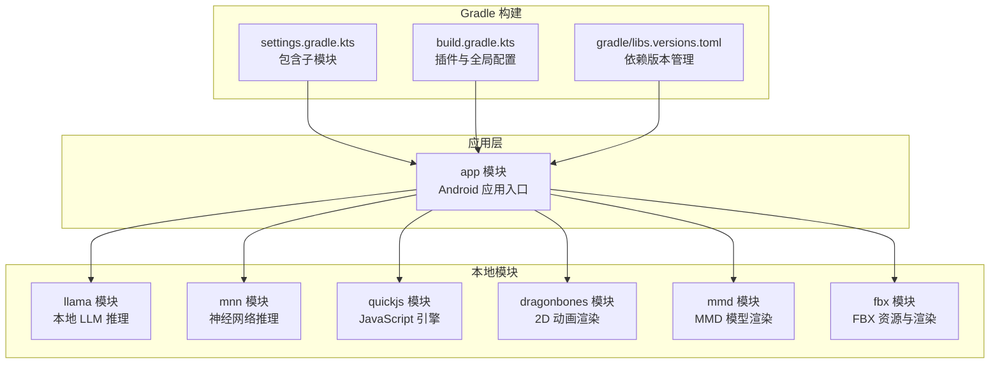
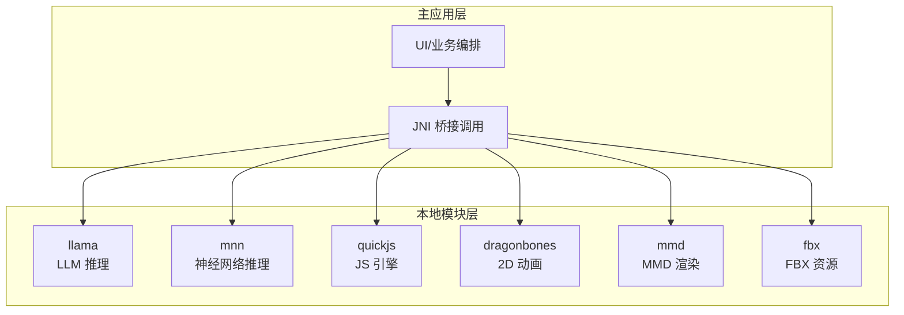
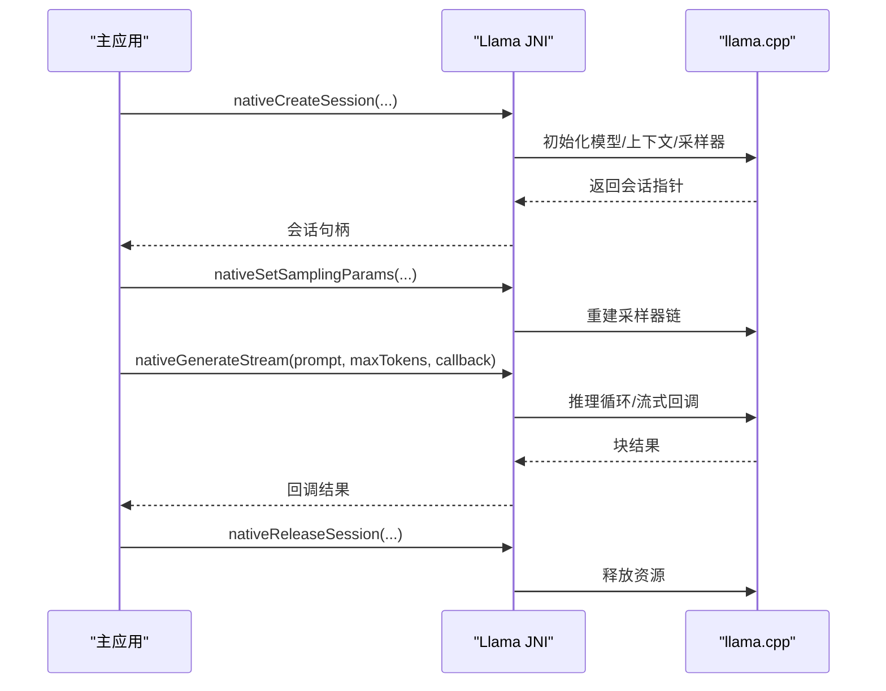
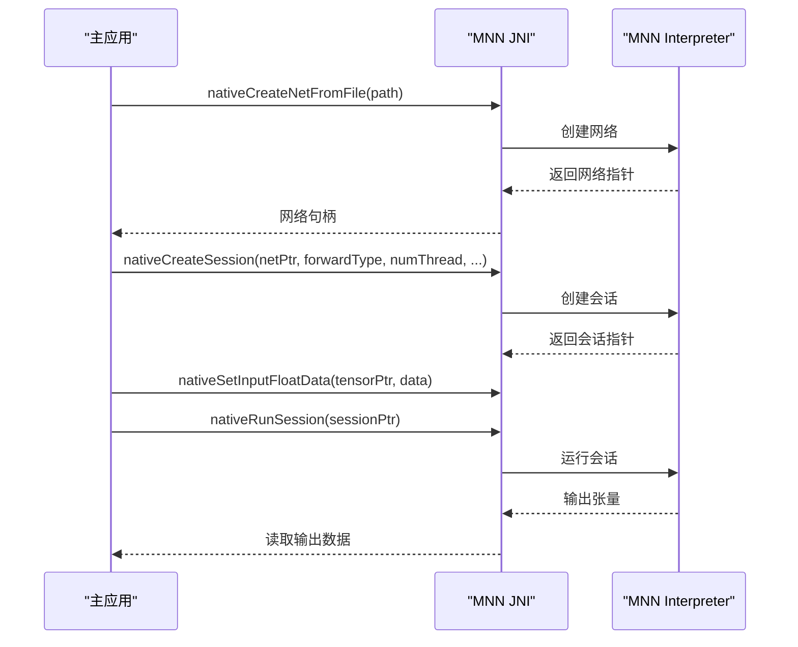
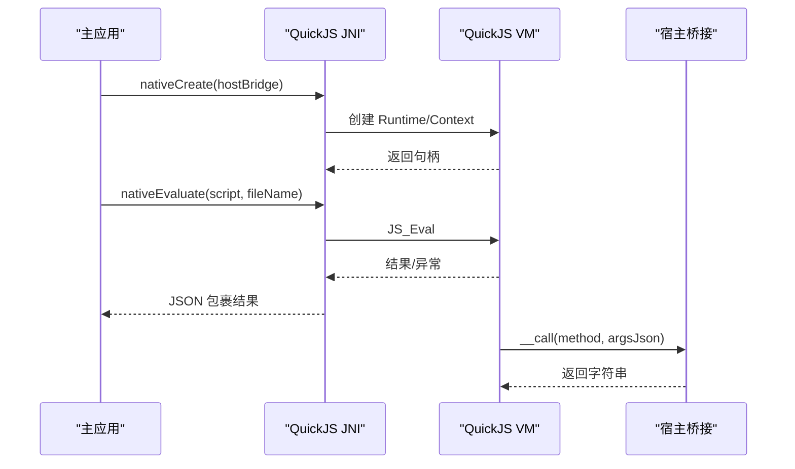
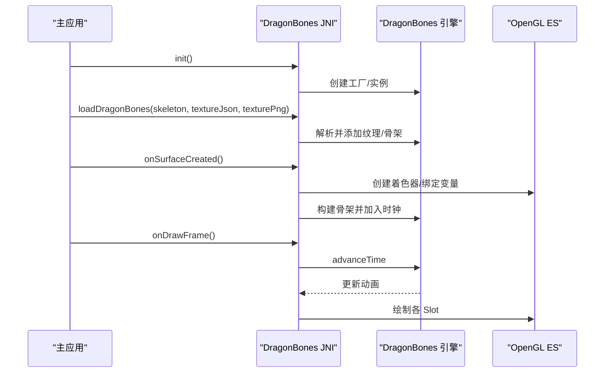
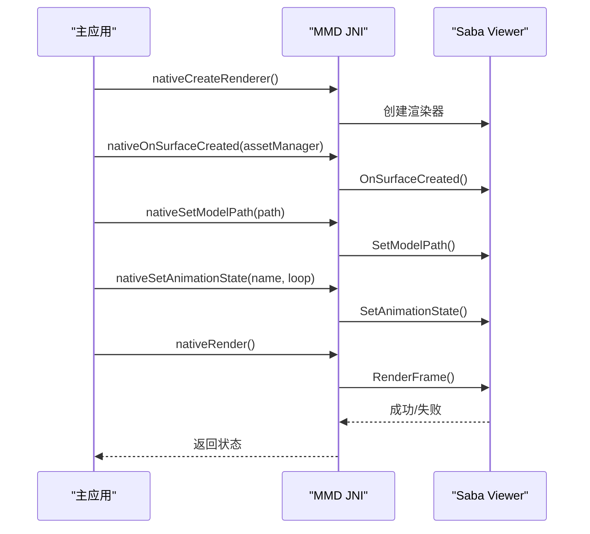
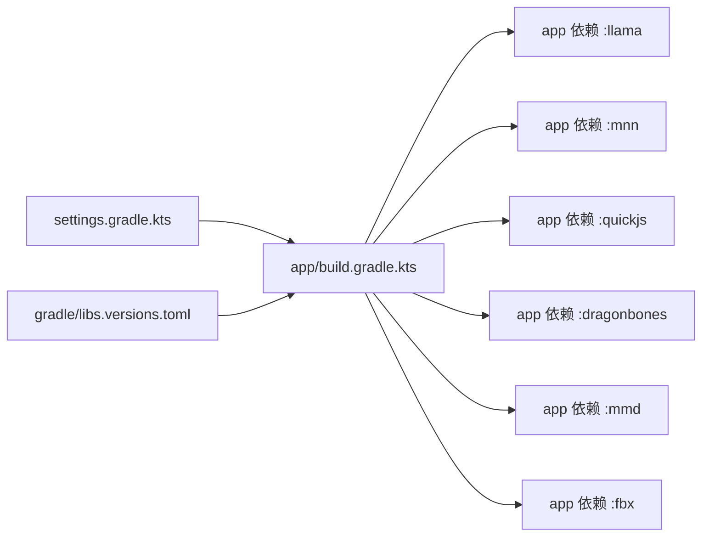

# 模块化架构

<cite>
**本文档引用的文件**
- [README.md](file://README.md)
- [settings.gradle.kts](file://settings.gradle.kts)
- [build.gradle.kts](file://build.gradle.kts)
- [gradle/libs.versions.toml](file://gradle/libs.versions.toml)
- [app/build.gradle.kts](file://app/build.gradle.kts)
- [llama/CMakeLists.txt](file://llama/CMakeLists.txt)
- [mnn/CMakeLists.txt](file://mnn/CMakeLists.txt)
- [dragonbones/CMakeLists.txt](file://dragonbones/CMakeLists.txt)
- [mmd/CMakeLists.txt](file://mmd/CMakeLists.txt)
- [llama/src/main/cpp/llama_jni_stub.cpp](file://llama/src/main/cpp/llama_jni_stub.cpp)
- [mnn/src/main/cpp/mnnnetnative.cpp](file://mnn/src/main/cpp/mnnnetnative.cpp)
- [quickjs/src/main/cpp/quickjs_jni.cpp](file://quickjs/src/main/cpp/quickjs_jni.cpp)
- [dragonbones/cpp/JniBridge.cpp](file://dragonbones/cpp/JniBridge.cpp)
- [mmd/src/main/cpp/android/MmdRendererBridge.cpp](file://mmd/src/main/cpp/android/MmdRendererBridge.cpp)
</cite>

## 目录
1. [引言](#引言)
2. [项目结构](#项目结构)
3. [核心组件](#核心组件)
4. [架构总览](#架构总览)
5. [详细组件分析](#详细组件分析)
6. [依赖分析](#依赖分析)
7. [性能考虑](#性能考虑)
8. [故障排查指南](#故障排查指南)
9. [结论](#结论)
10. [附录](#附录)

## 引言
本项目采用模块化架构，将不同能力域拆分为独立模块，主应用模块（app）作为聚合层，各本地模块（llama、mnn、quickjs、dragonbones、mmd、fbx 等）通过 JNI 桥接与主应用协同工作。模块间职责清晰、边界明确，既保证了功能的可扩展性，又便于维护与测试。

## 项目结构
- 顶层 Gradle 配置统一管理版本与仓库，子模块通过 settings.gradle.kts 统一纳入构建。
- app 模块是 Android 应用入口，聚合各本地模块并通过 CMake 编译原生库。
- 各本地模块（llama、mnn、quickjs、dragonbones、mmd、fbx）各自维护 CMakeLists.txt，封装第三方库与 JNI 接口。
- 依赖版本集中在 gradle/libs.versions.toml，确保一致性与可维护性。

**图表来源**
- [settings.gradle.kts:1-30](file://settings.gradle.kts#L1-L30)
- [build.gradle.kts:1-25](file://build.gradle.kts#L1-L25)
- [gradle/libs.versions.toml:1-271](file://gradle/libs.versions.toml#L1-L271)
- [app/build.gradle.kts:181-191](file://app/build.gradle.kts#L181-L191)

**章节来源**
- [settings.gradle.kts:1-30](file://settings.gradle.kts#L1-L30)
- [build.gradle.kts:1-25](file://build.gradle.kts#L1-L25)
- [gradle/libs.versions.toml:1-271](file://gradle/libs.versions.toml#L1-L271)
- [app/build.gradle.kts:181-191](file://app/build.gradle.kts#L181-L191)

## 核心组件
- 主应用模块（app）
  - 聚合本地模块依赖，配置 NDK ABI 过滤、CMake 外部构建、打包策略与资源排除。
  - 通过 externalNativeBuild 指定 app 层 CMakeLists.txt，统一管理原生构建入口。
- 本地模块
  - llama：本地 LLM 推理，提供 JNI 接口封装会话创建、采样参数、流式生成、工具调用语法等。
  - mnn：神经网络推理，提供网络加载、会话创建、输入输出张量操作、图像处理等 JNI 接口。
  - quickjs：JavaScript 引擎，提供 VM 生命周期、脚本求值、函数调用、宿主桥接回调等。
  - dragonbones：2D 骨骼动画渲染，提供初始化、纹理与骨架数据加载、GL 上下文生命周期、动画播放与交互。
  - mmd：MMD 模型渲染，提供渲染器生命周期、模型路径设置、动画状态、相机与旋转控制。
  - fbx：FBX 资源与渲染（模块存在但当前未在 app 中启用）。

**章节来源**
- [app/build.gradle.kts:48-52](file://app/build.gradle.kts#L48-L52)
- [app/build.gradle.kts:66-71](file://app/build.gradle.kts#L66-L71)
- [app/build.gradle.kts:181-191](file://app/build.gradle.kts#L181-L191)

## 架构总览
模块间通过 JNI 桥接与主应用交互，主应用负责业务编排与 UI，本地模块负责具体能力实现。CMake 在各模块内完成第三方库与原生目标的构建，最终由 app 模块统一打包。

**图表来源**
- [app/build.gradle.kts:181-191](file://app/build.gradle.kts#L181-L191)
- [llama/src/main/cpp/llama_jni_stub.cpp:648-780](file://llama/src/main/cpp/llama_jni_stub.cpp#L648-L780)
- [mnn/src/main/cpp/mnnnetnative.cpp:17-47](file://mnn/src/main/cpp/mnnnetnative.cpp#L17-L47)
- [quickjs/src/main/cpp/quickjs_jni.cpp:736-799](file://quickjs/src/main/cpp/quickjs_jni.cpp#L736-L799)
- [dragonbones/cpp/JniBridge.cpp:280-429](file://dragonbones/cpp/JniBridge.cpp#L280-L429)
- [mmd/src/main/cpp/android/MmdRendererBridge.cpp:77-200](file://mmd/src/main/cpp/android/MmdRendererBridge.cpp#L77-L200)

## 详细组件分析

### llama 模块（本地 LLM 推理）
- 职责边界
  - 提供本地 LLM 会话生命周期管理、采样参数配置、模板应用、流式生成、工具调用语法支持。
  - 当未嵌入 llama.cpp 时，提供不可用状态与原因返回，避免运行时错误。
- 关键 JNI 接口
  - 会话创建与释放、取消、令牌计数、采样参数设置、模板应用、结构化模板应用、流式生成、工具调用语法设置与清理、工具调用解析。
- CMake 配置
  - 动态检测 llama.cpp 子模块，按需启用构建；定义编译宏以区分可用/不可用路径；链接 android、log 与 llama/common 目标。
- 性能与稳定性
  - 支持 GPU Offload 与 mmap；提供采样器链构建与懒加载语法；异常与取消回调保障稳定性。

**图表来源**
- [llama/src/main/cpp/llama_jni_stub.cpp:648-780](file://llama/src/main/cpp/llama_jni_stub.cpp#L648-L780)
- [llama/src/main/cpp/llama_jni_stub.cpp:363-800](file://llama/src/main/cpp/llama_jni_stub.cpp#L363-L800)

**章节来源**
- [llama/CMakeLists.txt:14-40](file://llama/CMakeLists.txt#L14-L40)
- [llama/src/main/cpp/llama_jni_stub.cpp:648-780](file://llama/src/main/cpp/llama_jni_stub.cpp#L648-L780)

### mnn 模块（神经网络推理）
- 职责边界
  - 提供模型加载、会话创建、输入输出张量设置与读取、图像处理（均值/归一化/矩阵变换）、会话重塑与回调。
- 关键 JNI 接口
  - 网络创建/释放、会话创建/释放/运行、输入输出张量获取、维度设置、数据填充（int/float/uint8）、缓冲区转换（Bitmap/字节数组）。
- CMake 配置
  - 启用 LLM 支持与低内存模式，禁用不必要的工具与测试；链接 MNN、MNN llm（若存在）、android、log、jnigraphics。
- 性能与稳定性
  - 禁用分离编译，合并后端以减少查找失败；TLS 相关编译选项规避线程局部存储问题。

**图表来源**
- [mnn/src/main/cpp/mnnnetnative.cpp:17-47](file://mnn/src/main/cpp/mnnnetnative.cpp#L17-L47)
- [mnn/src/main/cpp/mnnnetnative.cpp:102-159](file://mnn/src/main/cpp/mnnnetnative.cpp#L102-L159)
- [mnn/src/main/cpp/mnnnetnative.cpp:215-241](file://mnn/src/main/cpp/mnnnetnative.cpp#L215-L241)

**章节来源**
- [mnn/CMakeLists.txt:16-39](file://mnn/CMakeLists.txt#L16-L39)
- [mnn/src/main/cpp/mnnnetnative.cpp:17-47](file://mnn/src/main/cpp/mnnnetnative.cpp#L17-L47)

### quickjs 模块（JavaScript 引擎）
- 职责边界
  - 提供 JS VM 生命周期、脚本求值、函数调用、中断控制、宿主桥接回调（通过 NativeInterface.__call 调用 Java）。
- 关键 JNI 接口
  - 创建/销毁 VM、求值、调用函数、执行待处理任务、中断。
- CMake 配置
  - 集成第三方 quickjs 源码，提供 VM、Context、Runtime 管理与宿主桥接。
- 性能与稳定性
  - 线程安全锁、异常属性读取与堆栈捕获、最近宿主调用记录，便于诊断。

**图表来源**
- [quickjs/src/main/cpp/quickjs_jni.cpp:736-799](file://quickjs/src/main/cpp/quickjs_jni.cpp#L736-L799)
- [quickjs/src/main/cpp/quickjs_jni.cpp:270-331](file://quickjs/src/main/cpp/quickjs_jni.cpp#L270-L331)

**章节来源**
- [quickjs/src/main/cpp/quickjs_jni.cpp:736-799](file://quickjs/src/main/cpp/quickjs_jni.cpp#L736-L799)

### dragonbones 模块（2D 动画渲染）
- 职责边界
  - 提供 DragonBones 骨骼动画的初始化、纹理与骨架数据加载、GL 上下文生命周期管理、动画播放与交互（点击检测、骨骼位移覆盖）。
- 关键 JNI 接口
  - 初始化、加载数据、GL 创建/变更/绘制、动画列表、动画时长、淡入播放、停止、世界缩放与平移、骨骼覆盖/重置、点击检测。
- CMake 配置
  - 收集 dragonBones 与 OpenGL 实现源文件，链接 android、log、GLESv2。
- 性能与稳定性
  - 16KB 页面对齐链接选项；GL 状态与着色器程序在 GL 线程创建；数据加载与 GL 就绪状态协调，避免竞态。

**图表来源**
- [dragonbones/cpp/JniBridge.cpp:280-429](file://dragonbones/cpp/JniBridge.cpp#L280-L429)
- [dragonbones/cpp/JniBridge.cpp:530-596](file://dragonbones/cpp/JniBridge.cpp#L530-L596)

**章节来源**
- [dragonbones/CMakeLists.txt:19-42](file://dragonbones/CMakeLists.txt#L19-L42)
- [dragonbones/cpp/JniBridge.cpp:280-429](file://dragonbones/cpp/JniBridge.cpp#L280-L429)

### mmd 模块（MMD 模型渲染）
- 职责边界
  - 提供 MMD 模型渲染器生命周期、模型路径设置、动画状态切换、相机与旋转控制、错误状态上报。
- 关键 JNI 接口
  - 创建/销毁渲染器、GL 创建/变更/渲染、暂停/恢复、设置模型路径、设置动画状态、设置模型旋转、相机距离与目标高度、获取最后错误。
- CMake 配置
  - 依赖 Saba 与 Bullet3，链接 android、log、GLESv3；条件编译启用 Saba。
- 性能与稳定性
  - 渲染器内部错误状态加锁保护；与 AssetManager 集成，确保资源加载稳定。

**图表来源**
- [mmd/src/main/cpp/android/MmdRendererBridge.cpp:77-200](file://mmd/src/main/cpp/android/MmdRendererBridge.cpp#L77-L200)
- [mmd/src/main/cpp/android/MmdRendererBridge.cpp:227-299](file://mmd/src/main/cpp/android/MmdRendererBridge.cpp#L227-L299)

**章节来源**
- [mmd/CMakeLists.txt:42-108](file://mmd/CMakeLists.txt#L42-L108)
- [mmd/src/main/cpp/android/MmdRendererBridge.cpp:77-200](file://mmd/src/main/cpp/android/MmdRendererBridge.cpp#L77-L200)

### fbx 模块（FBX 资源与渲染）
- 状态与职责
  - 模块存在且具备 CMake 与 JNI 适配层，当前在 app 中未启用依赖。
- 建议
  - 若后续启用，建议复用现有 JNI 模板与 CMake 配置，保持与其它本地模块一致的构建与桥接规范。

**章节来源**
- [app/build.gradle.kts:188](file://app/build.gradle.kts#L188)

## 依赖分析
- Gradle 层
  - settings.gradle.kts 统一包含 app、dragonbones、mnn、llama、mmd、fbx、showerclient、quickjs 等模块。
  - build.gradle.kts 配置插件与 ObjectBox 插件，app/build.gradle.kts 在 dependencies 中显式声明各本地模块依赖。
- 依赖版本
  - gradle/libs.versions.toml 集中管理第三方库版本，app/build.gradle.kts 引用版本别名，确保一致性。
- 打包与资源
  - app/build.gradle.kts 配置 abiFilters、externalNativeBuild、CMake cppFlags、资源排除与 pickFirst 以避免重复。

**图表来源**
- [settings.gradle.kts:21-29](file://settings.gradle.kts#L21-L29)
- [app/build.gradle.kts:181-191](file://app/build.gradle.kts#L181-L191)
- [gradle/libs.versions.toml:83-271](file://gradle/libs.versions.toml#L83-L271)

**章节来源**
- [settings.gradle.kts:21-29](file://settings.gradle.kts#L21-L29)
- [app/build.gradle.kts:181-191](file://app/build.gradle.kts#L181-L191)
- [gradle/libs.versions.toml:83-271](file://gradle/libs.versions.toml#L83-L271)

## 性能考虑
- NDK 与 ABI
  - app 模块仅打包 arm64-v8a，减少体积与兼容性问题；mmd 模块额外包含 x86_64 以支持模拟器（通过 app 层 abiFilters 控制）。
- 构建优化
  - 各模块 CMakeLists 中禁用不必要的工具/测试/转换器，减少编译时间与产物体积。
  - mnn 禁止分离编译，合并后端以避免“找不到 type=3 后端”问题。
- 运行时优化
  - llama 支持 GPU Offload 与 mmap；mnn 启用低内存模式与 Transformer Fuse；dragonbones 与 mmd 使用 16KB 页面对齐链接选项。
- 资源与打包
  - app 打包阶段 pickFirst *.so，避免重复；资源排除常见冲突文件，减少合并冲突。

**章节来源**
- [app/build.gradle.kts:66-71](file://app/build.gradle.kts#L66-L71)
- [mnn/CMakeLists.txt:28-39](file://mnn/CMakeLists.txt#L28-L39)
- [dragonbones/CMakeLists.txt:44](file://dragonbones/CMakeLists.txt#L44)
- [mmd/CMakeLists.txt:110](file://mmd/CMakeLists.txt#L110)

## 故障排查指南
- llama 模块不可用
  - 现象：nativeIsAvailable 返回 false，nativeGetUnavailableReason 返回不可用原因。
  - 排查：确认 llama/third_party/llama.cpp 子模块存在，CMake 能找到 llama 与 common 目标。
- mnn 模块崩溃
  - 现象：创建会话失败或运行时报错。
  - 排查：检查 forwardType 与 numThread 参数；确认模型文件路径正确；查看是否启用分离编译导致后端缺失。
- quickjs 宿主桥接异常
  - 现象：__call 回调抛出异常或返回空值。
  - 排查：检查宿主桥接对象方法签名与参数；查看最近宿主调用记录与异常详情 JSON。
- dragonbones 渲染空白
  - 现象：GL 创建成功但无内容。
  - 排查：确认纹理与骨架数据已加载；检查 isGlReady 与 isDataLoaded 状态；验证着色器变量位置与纹理绑定。
- mmd 渲染失败
  - 现象：RenderFrame 返回失败并记录错误。
  - 排查：检查模型路径与动画名称；确认 AssetManager 正确设置；查看 nativeGetRendererLastError 获取详细错误。

**章节来源**
- [llama/src/main/cpp/llama_jni_stub.cpp:192-203](file://llama/src/main/cpp/llama_jni_stub.cpp#L192-L203)
- [mnn/src/main/cpp/mnnnetnative.cpp:40-47](file://mnn/src/main/cpp/mnnnetnative.cpp#L40-L47)
- [quickjs/src/main/cpp/quickjs_jni.cpp:576-642](file://quickjs/src/main/cpp/quickjs_jni.cpp#L576-L642)
- [dragonbones/cpp/JniBridge.cpp:376-429](file://dragonbones/cpp/JniBridge.cpp#L376-L429)
- [mmd/src/main/cpp/android/MmdRendererBridge.cpp:360-367](file://mmd/src/main/cpp/android/MmdRendererBridge.cpp#L360-L367)

## 结论
本项目通过模块化架构实现了清晰的职责划分与强健的构建体系。主应用模块负责编排与打包，本地模块通过 JNI 桥接提供专业能力。CMake 与 Gradle 配置相互配合，确保第三方库与原生目标的稳定构建与部署。遵循本文档的模块边界、通信机制与最佳实践，可高效扩展新模块并维护现有模块。

## 附录
- 模块开发最佳实践
  - 保持 JNI 接口简洁、幂等与线程安全；提供不可用状态与错误详情。
  - CMake 中明确启用/禁用功能，避免冗余目标；统一链接选项与编译宏。
  - 在 app 中统一声明依赖，避免模块间隐式耦合。
- 扩展指南
  - 新增模块：参考现有模块的 CMakeLists.txt 与 JNI 模板，提供最小可用接口；在 app/build.gradle.kts 中添加依赖；在 settings.gradle.kts 中纳入构建。
  - 跨进程通信：当前以 JNI 为主，如需跨进程可基于 AIDL 或进程间服务抽象，但需评估性能与复杂度。
  - 事件传递：建议通过主应用层统一事件总线或回调接口，避免模块间直接耦合。