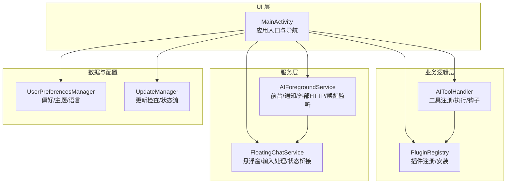
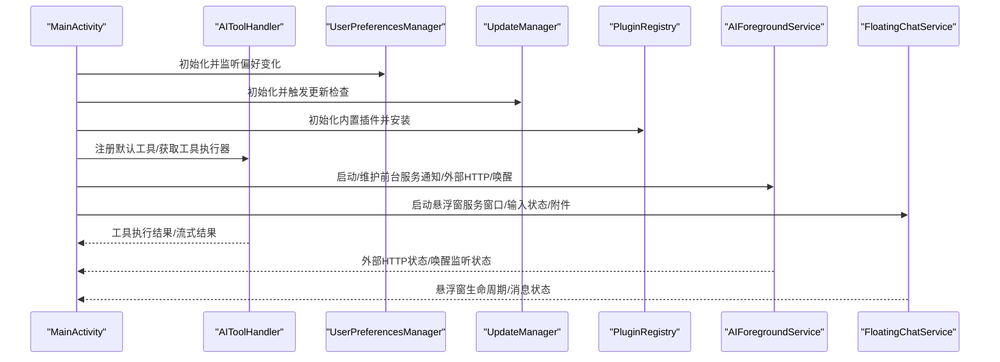
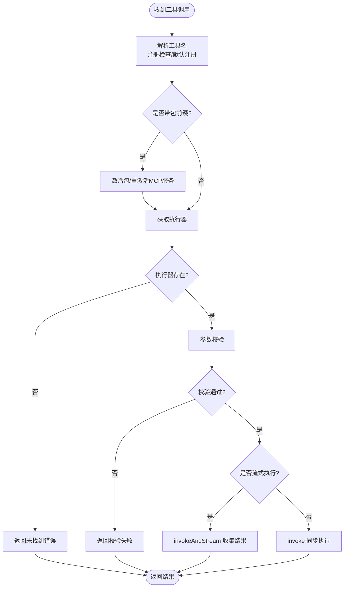
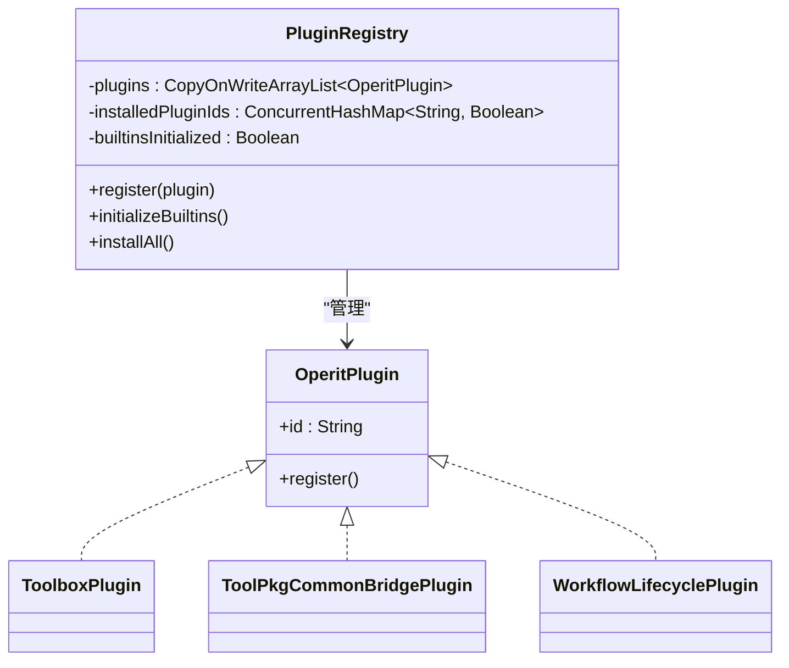
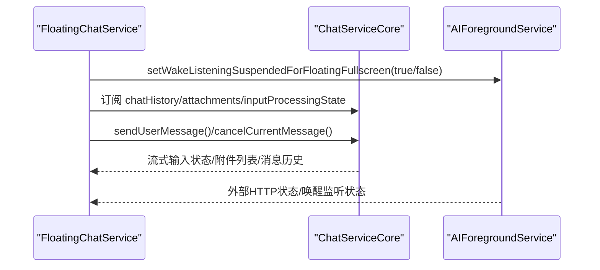
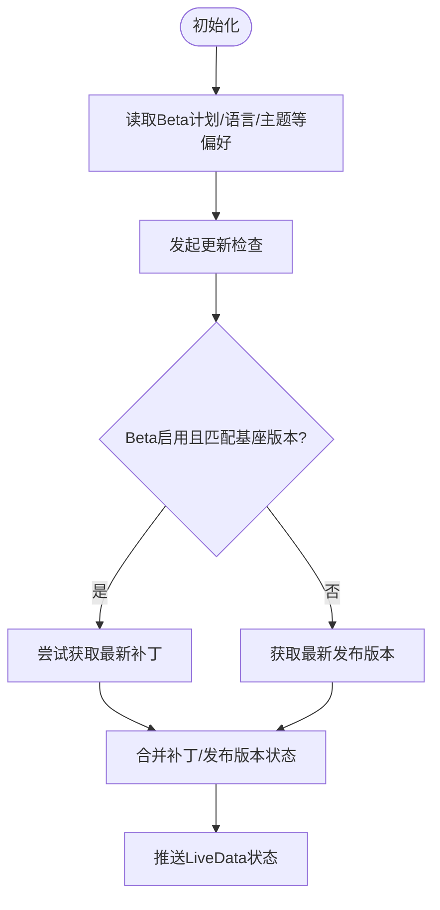
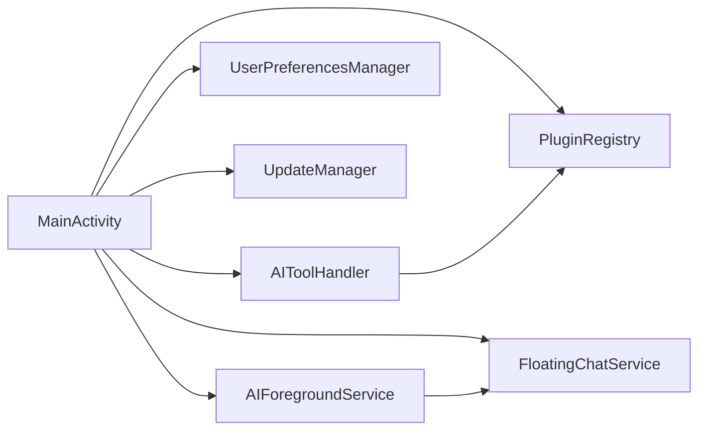

# 组件交互关系

<cite>
**本文引用的文件**
- [MainActivity.kt](file://app/src/main/java/com/ai/assistance/operit/ui/main/MainActivity.kt)
- [AIToolHandler.kt](file://app/src/main/java/com/ai/assistance/operit/core/tools/AIToolHandler.kt)
- [AIForegroundService.kt](file://app/src/main/java/com/ai/assistance/operit/api/chat/AIForegroundService.kt)
- [FloatingChatService.kt](file://app/src/main/java/com/ai/assistance/operit/services/FloatingChatService.kt)
- [PluginRegistry.kt](file://app/src/main/java/com/ai/assistance/operit/plugins/PluginRegistry.kt)
- [UpdateManager.kt](file://app/src/main/java/com/ai/assistance/operit/data/updates/UpdateManager.kt)
- [UserPreferencesManager.kt](file://app/src/main/java/com/ai/assistance/operit/data/preferences/UserPreferencesManager.kt)
</cite>

## 目录
1. [引言](#引言)
2. [项目结构](#项目结构)
3. [核心组件](#核心组件)
4. [架构总览](#架构总览)
5. [详细组件分析](#详细组件分析)
6. [依赖分析](#依赖分析)
7. [性能考虑](#性能考虑)
8. [故障排查指南](#故障排查指南)
9. [结论](#结论)

## 引言
本文件聚焦 Operit AI 的组件交互关系，系统梳理 UI 组件、业务逻辑组件、数据访问组件与服务组件之间的协作方式，重点覆盖：
- MainActivity 与工具处理器、偏好管理器、更新管理器、插件加载等的协调机制
- AI 工具处理组件与本地模块（包管理、MCP）的交互与数据流
- 插件系统的注册、生命周期与接口调用机制
- 服务组件间（前台服务、悬浮窗服务、通知服务）的协同
- 组件解耦策略、事件总线与状态流模式的应用

## 项目结构
Operit 采用多模块与多组件协作的架构，核心 UI 由 MainActivity 驱动，业务逻辑通过 AIToolHandler 统一调度，服务层由 AIForegroundService 与 FloatingChatService 提供长时任务与悬浮窗能力，插件系统通过 PluginRegistry 管理内置与外部插件，数据与配置通过 UserPreferencesManager 与 UpdateManager 提供。

图表来源
- [MainActivity.kt:67-794](file://app/src/main/java/com/ai/assistance/operit/ui/main/MainActivity.kt#L67-L794)
- [AIToolHandler.kt:29-416](file://app/src/main/java/com/ai/assistance/operit/core/tools/AIToolHandler.kt#L29-L416)
- [AIForegroundService.kt:101-518](file://app/src/main/java/com/ai/assistance/operit/api/chat/AIForegroundService.kt#L101-L518)
- [FloatingChatService.kt:59-798](file://app/src/main/java/com/ai/assistance/operit/services/FloatingChatService.kt#L59-L798)
- [PluginRegistry.kt:15-47](file://app/src/main/java/com/ai/assistance/operit/plugins/PluginRegistry.kt#L15-L47)
- [UserPreferencesManager.kt:46-314](file://app/src/main/java/com/ai/assistance/operit/data/preferences/UserPreferencesManager.kt#L46-L314)
- [UpdateManager.kt:37-130](file://app/src/main/java/com/ai/assistance/operit/data/updates/UpdateManager.kt#L37-L130)

章节来源
- [MainActivity.kt:67-794](file://app/src/main/java/com/ai/assistance/operit/ui/main/MainActivity.kt#L67-L794)
- [PluginRegistry.kt:15-47](file://app/src/main/java/com/ai/assistance/operit/plugins/PluginRegistry.kt#L15-L47)

## 核心组件
- MainActivity：应用入口，负责初始化工具处理器、偏好管理器、更新管理器、插件加载状态机；协调权限检查、协议接受、GitHub OAuth 回调、分享文件/链接处理、以及主界面与插件加载界面的切换。
- AIToolHandler：统一的工具注册与执行中枢，支持参数校验、权限钩子通知、默认工具注册、包管理器集成、MCP 服务自动激活与工具执行（含流式结果）。
- AIForegroundService：前台服务，负责维持进程优先级、通知通道与提醒、外部 HTTP 服务、唤醒词监听、麦克风前台、后台保活等。
- FloatingChatService：悬浮窗服务，承载聊天 UI、输入处理状态、附件管理、与 ChatRuntimeHolder 的桥接，提供状态持久化与生命周期广播。
- PluginRegistry：插件注册中心，内置 Toolbox、ToolPkgCommonBridge、WorkflowLifecycle 等插件，支持初始化与批量安装。
- UserPreferencesManager：基于 DataStore 的偏好管理，提供主题、语言、布局、无障碍、Beta 计划等多维配置的 Flow 化读写。
- UpdateManager：更新检查与状态流，支持静默检查、可用更新/补丁更新、错误回退，并通过 LiveData 对外暴露状态。

章节来源
- [MainActivity.kt:567-587](file://app/src/main/java/com/ai/assistance/operit/ui/main/MainActivity.kt#L567-L587)
- [AIToolHandler.kt:29-416](file://app/src/main/java/com/ai/assistance/operit/core/tools/AIToolHandler.kt#L29-L416)
- [AIForegroundService.kt:101-518](file://app/src/main/java/com/ai/assistance/operit/api/chat/AIForegroundService.kt#L101-L518)
- [FloatingChatService.kt:59-798](file://app/src/main/java/com/ai/assistance/operit/services/FloatingChatService.kt#L59-L798)
- [PluginRegistry.kt:15-47](file://app/src/main/java/com/ai/assistance/operit/plugins/PluginRegistry.kt#L15-L47)
- [UserPreferencesManager.kt:46-314](file://app/src/main/java/com/ai/assistance/operit/data/preferences/UserPreferencesManager.kt#L46-L314)
- [UpdateManager.kt:37-130](file://app/src/main/java/com/ai/assistance/operit/data/updates/UpdateManager.kt#L37-L130)

## 架构总览
下图展示 MainActivity 与各子组件的交互路径与控制流：

图表来源
- [MainActivity.kt:200-247](file://app/src/main/java/com/ai/assistance/operit/ui/main/MainActivity.kt#L200-L247)
- [UserPreferencesManager.kt:46-314](file://app/src/main/java/com/ai/assistance/operit/data/preferences/UserPreferencesManager.kt#L46-L314)
- [UpdateManager.kt:118-130](file://app/src/main/java/com/ai/assistance/operit/data/updates/UpdateManager.kt#L118-L130)
- [PluginRegistry.kt:29-46](file://app/src/main/java/com/ai/assistance/operit/plugins/PluginRegistry.kt#L29-L46)
- [AIToolHandler.kt:170-190](file://app/src/main/java/com/ai/assistance/operit/core/tools/AIToolHandler.kt#L170-L190)
- [AIForegroundService.kt:442-497](file://app/src/main/java/com/ai/assistance/operit/api/chat/AIForegroundService.kt#L442-L497)
- [FloatingChatService.kt:368-526](file://app/src/main/java/com/ai/assistance/operit/services/FloatingChatService.kt#L368-L526)

## 详细组件分析

### MainActivity 与子组件的协调机制
- 初始化与监听
  - 初始化工具处理器、MCP 仓库、ANR 监控、用户偏好管理器与协议偏好。
  - 监听用户偏好 Flow，动态决定是否显示引导界面。
- 权限与协议
  - Android 13+ 通知权限请求；权限级别缺失时引导设置。
  - 协议未接受时进入协议界面，接受后继续权限检查与插件加载。
- 插件加载
  - 通过 PluginLoadingState 与 PluginLoadingStateRegistry 控制加载界面与超时。
  - 启动 MCP 服务器并异步初始化插件，避免首帧卡顿。
- 分享与路由
  - 处理 Intent 中的分享文件/链接、GitHub OAuth 回调、桌面部件路由请求。
- 性能与显示
  - 高刷新率与硬件加速设置；方向变化时弹窗确认并重建 Activity。

章节来源
- [MainActivity.kt:567-794](file://app/src/main/java/com/ai/assistance/operit/ui/main/MainActivity.kt#L567-L794)

### AI 工具处理组件与本地模块交互
- 工具注册与钩子
  - 支持注册 ToolExecutor 或函数式执行器；提供工具钩子（请求、权限、执行、结果、异常、完成）通知链。
  - 默认工具一次性注册，后续按需激活包与 MCP 服务。
- 参数校验与执行
  - 执行前进行参数校验；支持同步执行与流式执行，流式结果通过 Flow 下游消费。
  - 若工具名包含包前缀，自动激活对应包或 MCP 服务，保证可用性。
- 包管理与 MCP
  - 通过 PackageManager 获取可用包与服务器包，必要时 usePackage 激活；若 MCP 服务非活动则自动重激活。

图表来源
- [AIToolHandler.kt:264-415](file://app/src/main/java/com/ai/assistance/operit/core/tools/AIToolHandler.kt#L264-L415)

章节来源
- [AIToolHandler.kt:29-416](file://app/src/main/java/com/ai/assistance/operit/core/tools/AIToolHandler.kt#L29-L416)

### 插件系统的组件交互
- 注册与安装
  - PluginRegistry 初始化内置插件（Toolbox、ToolPkgCommonBridge、WorkflowLifecycle），去重安装并记录已安装 ID。
- 生命周期与接口
  - 插件通过统一接口注册，注册时幂等替换同 ID 插件；安装时仅对未安装 ID 执行一次 register。
- 与工具链协作
  - 插件注册后可扩展工具集与桥接能力，配合 AIToolHandler 的工具注册与执行形成闭环。

图表来源
- [PluginRegistry.kt:9-47](file://app/src/main/java/com/ai/assistance/operit/plugins/PluginRegistry.kt#L9-L47)

章节来源
- [PluginRegistry.kt:15-47](file://app/src/main/java/com/ai/assistance/operit/plugins/PluginRegistry.kt#L15-L47)

### 服务组件间的通信
- AIForegroundService
  - 维持前台运行、通知通道、外部 HTTP 服务启停、唤醒监听挂起状态（IME/外部录音/悬浮全屏）。
  - 提供静态方法对外部请求（如麦克风前台、外部 HTTP 刷新、后台保活）。
- FloatingChatService
  - 通过 ChatRuntimeHolder 获取 ChatServiceCore，订阅聊天历史、附件、输入处理状态。
  - 与 AIForegroundService 协作，根据悬浮窗模式暂停/恢复唤醒监听。
  - 提供状态持久化、生命周期广播、消息发送/取消、附件增删等接口。

图表来源
- [FloatingChatService.kt:395-453](file://app/src/main/java/com/ai/assistance/operit/services/FloatingChatService.kt#L395-L453)
- [AIForegroundService.kt:387-416](file://app/src/main/java/com/ai/assistance/operit/api/chat/AIForegroundService.kt#L387-L416)

章节来源
- [AIForegroundService.kt:101-518](file://app/src/main/java/com/ai/assistance/operit/api/chat/AIForegroundService.kt#L101-L518)
- [FloatingChatService.kt:59-798](file://app/src/main/java/com/ai/assistance/operit/services/FloatingChatService.kt#L59-L798)

### 数据与配置交互
- UserPreferencesManager
  - 基于 DataStore 的 Flow 化偏好读写，提供主题、语言、布局、无障碍、Beta 计划等配置。
  - 提供默认配置文件初始化与 Profile 列表管理。
- UpdateManager
  - 暴露 LiveData 更新状态，支持静默检查与显式检查；根据 Beta 计划选择补丁更新或常规发布版本。
  - 版本比较与仓库解析通过 GitHub API 服务与字符串资源解析。

图表来源
- [UserPreferencesManager.kt:34-44](file://app/src/main/java/com/ai/assistance/operit/data/preferences/UserPreferencesManager.kt#L34-L44)
- [UpdateManager.kt:118-221](file://app/src/main/java/com/ai/assistance/operit/data/updates/UpdateManager.kt#L118-L221)

章节来源
- [UserPreferencesManager.kt:46-314](file://app/src/main/java/com/ai/assistance/operit/data/preferences/UserPreferencesManager.kt#L46-L314)
- [UpdateManager.kt:37-130](file://app/src/main/java/com/ai/assistance/operit/data/updates/UpdateManager.kt#L37-L130)

## 依赖分析
- 组件耦合与内聚
  - MainActivity 与各子组件通过明确职责边界耦合：UI 负责入口与导航，业务逻辑集中于 AIToolHandler，服务层独立于 UI，插件系统与工具链解耦。
  - UserPreferencesManager 与 UpdateManager 通过 Flow/LiveData 提供状态流，降低 UI 与数据层耦合。
- 外部依赖与集成点
  - AIForegroundService 与系统通知、音频录制回调、外部 HTTP 服务集成。
  - FloatingChatService 与 ChatRuntimeHolder、语音/声学服务工厂集成。
- 循环依赖规避
  - 插件注册与工具执行通过接口与单例管理，避免循环引用；服务间通过静态方法与广播/通知通道交互。

图表来源
- [MainActivity.kt:567-587](file://app/src/main/java/com/ai/assistance/operit/ui/main/MainActivity.kt#L567-L587)
- [AIToolHandler.kt:29-416](file://app/src/main/java/com/ai/assistance/operit/core/tools/AIToolHandler.kt#L29-L416)
- [AIForegroundService.kt:101-518](file://app/src/main/java/com/ai/assistance/operit/api/chat/AIForegroundService.kt#L101-L518)
- [FloatingChatService.kt:59-798](file://app/src/main/java/com/ai/assistance/operit/services/FloatingChatService.kt#L59-L798)
- [PluginRegistry.kt:15-47](file://app/src/main/java/com/ai/assistance/operit/plugins/PluginRegistry.kt#L15-L47)
- [UserPreferencesManager.kt:46-314](file://app/src/main/java/com/ai/assistance/operit/data/preferences/UserPreferencesManager.kt#L46-L314)
- [UpdateManager.kt:37-130](file://app/src/main/java/com/ai/assistance/operit/data/updates/UpdateManager.kt#L37-L130)

## 性能考虑
- UI 启动与首帧
  - MainActivity 在插件加载前显示占位界面，延迟初始化 MCP 服务器以避免首帧掉帧。
- 渲染与显示
  - 高刷新率与硬件加速设置减少渲染抖动；悬浮窗服务在低内存/UI 隐藏时保存状态，降低资源占用。
- 服务保活
  - AIForegroundService 通过前台通知与外部 HTTP/唤醒监听需求维持进程优先级；FloatingChatService 使用 WakeLock 保障关键操作。
- 数据流与状态
  - UserPreferencesManager 与 UpdateManager 基于 Flow/LiveData 推送状态，避免阻塞 UI 线程。

## 故障排查指南
- 插件加载超时
  - 检查 PluginLoadingState 的超时检测与 MCP 服务器初始化日志；确认权限与协议接受流程已完成。
- 工具执行失败
  - 查看 AIToolHandler 的参数校验与执行钩子回调；确认包/服务是否已激活；检查工具名格式（包前缀）。
- 通知与唤醒问题
  - 检查 AIForegroundService 的通知通道创建与权限；确认 IME/外部录音/悬浮全屏状态是否导致唤醒监听挂起。
- 悬浮窗无法显示
  - 检查 FloatingChatService 的窗口管理器初始化与生命周期广播；确认系统悬浮窗权限与内存回收策略。
- 更新检查异常
  - 观察 UpdateManager 的状态流与错误回退；核对 Beta 计划开关与仓库解析结果。

章节来源
- [MainActivity.kt:452-466](file://app/src/main/java/com/ai/assistance/operit/ui/main/MainActivity.kt#L452-L466)
- [AIToolHandler.kt:324-367](file://app/src/main/java/com/ai/assistance/operit/core/tools/AIToolHandler.kt#L324-L367)
- [AIForegroundService.kt:284-385](file://app/src/main/java/com/ai/assistance/operit/api/chat/AIForegroundService.kt#L284-L385)
- [FloatingChatService.kt:516-533](file://app/src/main/java/com/ai/assistance/operit/services/FloatingChatService.kt#L516-L533)
- [UpdateManager.kt:118-130](file://app/src/main/java/com/ai/assistance/operit/data/updates/UpdateManager.kt#L118-L130)

## 结论
Operit AI 通过清晰的组件划分与状态流驱动，实现了 UI、业务、服务与数据的解耦协作。MainActivity 作为编排者，结合 AIToolHandler 的工具执行与插件系统，配合 AIForegroundService 与 FloatingChatService 的长时任务与悬浮窗能力，构建了稳定、可扩展的交互体系。UserPreferencesManager 与 UpdateManager 提供了可靠的配置与更新机制，整体架构具备良好的可维护性与扩展性。