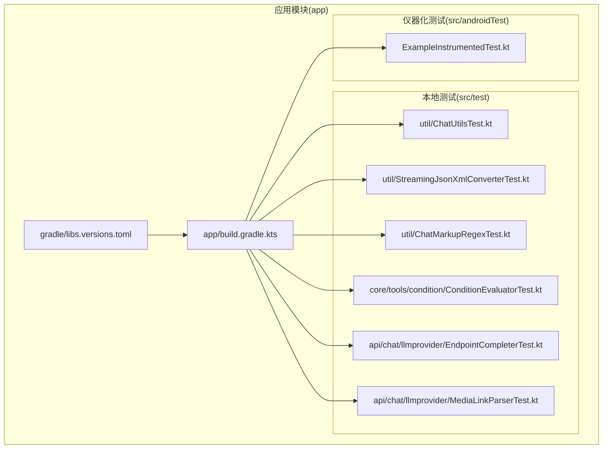
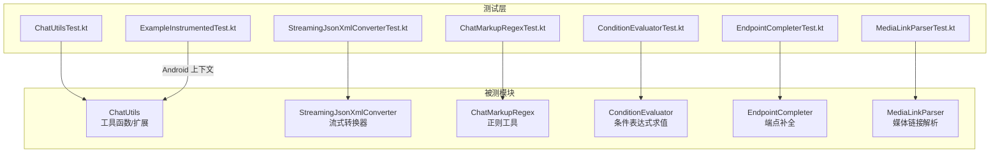
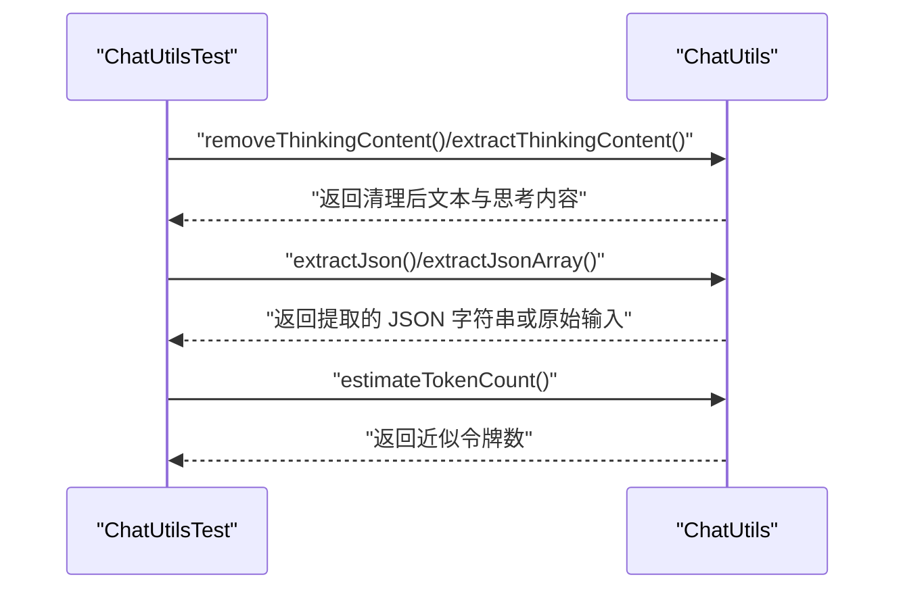
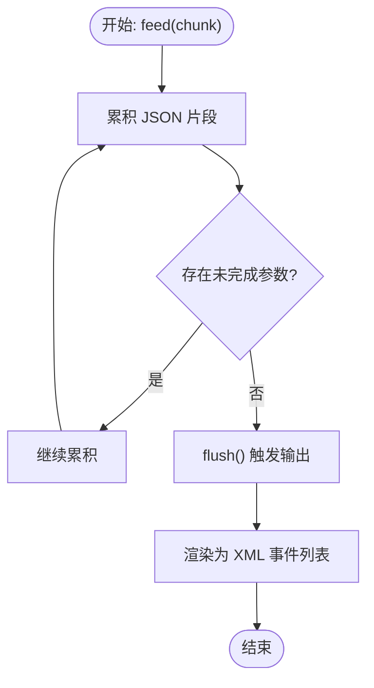
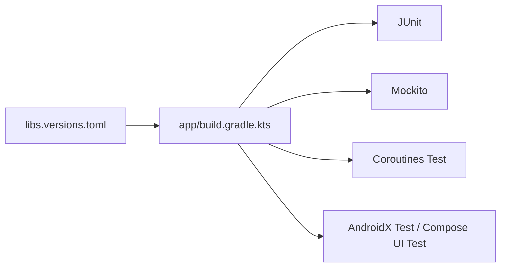

# 单元测试

<cite>
**本文引用的文件**
- [app/build.gradle.kts](file://app/build.gradle.kts)
- [gradle/libs.versions.toml](file://gradle/libs.versions.toml)
- [app/src/test/java/com/ai/assistance/operit/util/ChatUtilsTest.kt](file://app/src/test/java/com/ai/assistance/operit/util/ChatUtilsTest.kt)
- [app/src/test/java/com/ai/assistance/operit/api/chat/llmprovider/EndpointCompleterTest.kt](file://app/src/test/java/com/ai/assistance/operit/api/chat/llmprovider/EndpointCompleterTest.kt)
- [app/src/test/java/com/ai/assistance/operit/util/StreamingJsonXmlConverterTest.kt](file://app/src/test/java/com/ai/assistance/operit/util/StreamingJsonXmlConverterTest.kt)
- [app/src/test/java/com/ai/assistance/operit/core/tools/condition/ConditionEvaluatorTest.kt](file://app/src/test/java/com/ai/assistance/operit/core/tools/condition/ConditionEvaluatorTest.kt)
- [app/src/test/java/com/ai/assistance/operit/util/ChatMarkupRegexTest.kt](file://app/src/test/java/com/ai/assistance/operit/util/ChatMarkupRegexTest.kt)
- [app/src/test/java/com/ai/assistance/operit/api/chat/llmprovider/MediaLinkParserTest.kt](file://app/src/test/java/com/ai/assistance/operit/api/chat/llmprovider/MediaLinkParserTest.kt)
- [app/src/androidTest/java/com/ai/assistance/operit/ExampleInstrumentedTest.kt](file://app/src/androidTest/java/com/ai/assistance/operit/ExampleInstrumentedTest.kt)
</cite>

## 目录
1. [引言](#引言)
2. [项目结构](#项目结构)
3. [核心组件](#核心组件)
4. [架构总览](#架构总览)
5. [详细组件分析](#详细组件分析)
6. [依赖分析](#依赖分析)
7. [性能考虑](#性能考虑)
8. [故障排查指南](#故障排查指南)
9. [结论](#结论)
10. [附录](#附录)

## 引言
本文件面向 Operit 项目的开发者，系统化梳理 Kotlin 单元测试的实践与最佳实践，覆盖 JUnit 5（在本项目中以 JUnit 4 的方式使用）配置、测试注解与断言、测试用例设计原则（边界值、异常、状态）、Mock 对象与测试替身（Mockito 集成、Fake 对象、依赖注入测试）、测试数据准备策略（测试夹具、生成与隔离），并结合实际测试文件给出可复用的测试示例路径，帮助团队建立高质量、可维护的单元测试体系。

## 项目结构
Operit 在 Android 应用模块中采用标准的源码目录组织：测试代码位于 app/src/test 与 app/src/androidTest 下，分别对应本地 JVM 测试与仪器化测试。构建脚本通过 Gradle 版本目录统一管理第三方依赖版本，并在 app/build.gradle.kts 中声明了测试相关的依赖项（JUnit、Mockito、协程测试等）。

**图表来源**
- [app/build.gradle.kts:360-402](file://app/build.gradle.kts#L360-L402)
- [gradle/libs.versions.toml:1-271](file://gradle/libs.versions.toml#L1-L271)

**章节来源**
- [app/build.gradle.kts:360-402](file://app/build.gradle.kts#L360-L402)
- [gradle/libs.versions.toml:1-271](file://gradle/libs.versions.toml#L1-L271)

## 核心组件
- 测试运行器与断言
  - 运行器：JVM 测试使用 JUnit Runner；仪器化测试使用 AndroidJUnitRunner。
  - 断言：广泛使用 org.junit.Assert 提供的断言方法进行结果验证。
- 测试分类
  - 工具类测试：如 ChatUtils、StreamingJsonXmlConverter、ChatMarkupRegex 等。
  - 条件表达式测试：ConditionEvaluator。
  - LLM Provider 辅助逻辑测试：EndpointCompleter、MediaLinkParser。
  - 仪器化测试：ExampleInstrumentedTest 展示设备上下文校验。
- 测试依赖
  - JUnit、Mockito（core/kotlin/android）、协程测试、Compose UI 测试依赖等。

**章节来源**
- [app/build.gradle.kts:360-402](file://app/build.gradle.kts#L360-L402)
- [app/src/test/java/com/ai/assistance/operit/util/ChatUtilsTest.kt:1-122](file://app/src/test/java/com/ai/assistance/operit/util/ChatUtilsTest.kt#L1-L122)
- [app/src/test/java/com/ai/assistance/operit/util/StreamingJsonXmlConverterTest.kt:1-135](file://app/src/test/java/com/ai/assistance/operit/util/StreamingJsonXmlConverterTest.kt#L1-L135)
- [app/src/test/java/com/ai/assistance/operit/util/ChatMarkupRegexTest.kt:1-167](file://app/src/test/java/com/ai/assistance/operit/util/ChatMarkupRegexTest.kt#L1-L167)
- [app/src/test/java/com/ai/assistance/operit/core/tools/condition/ConditionEvaluatorTest.kt:1-161](file://app/src/test/java/com/ai/assistance/operit/core/tools/condition/ConditionEvaluatorTest.kt#L1-L161)
- [app/src/test/java/com/ai/assistance/operit/api/chat/llmprovider/EndpointCompleterTest.kt:1-165](file://app/src/test/java/com/ai/assistance/operit/api/chat/llmprovider/EndpointCompleterTest.kt#L1-L165)
- [app/src/test/java/com/ai/assistance/operit/api/chat/llmprovider/MediaLinkParserTest.kt:1-78](file://app/src/test/java/com/ai/assistance/operit/api/chat/llmprovider/MediaLinkParserTest.kt#L1-L78)
- [app/src/androidTest/java/com/ai/assistance/operit/ExampleInstrumentedTest.kt:1-24](file://app/src/androidTest/java/com/ai/assistance/operit/ExampleInstrumentedTest.kt#L1-L24)

## 架构总览
下图展示了测试层与被测模块的关系：测试类直接依赖被测函数或类，部分测试通过 Mockito 创建替身对象模拟外部依赖，从而实现对核心逻辑的隔离验证。

**图表来源**
- [app/src/test/java/com/ai/assistance/operit/util/ChatUtilsTest.kt:1-122](file://app/src/test/java/com/ai/assistance/operit/util/ChatUtilsTest.kt#L1-L122)
- [app/src/test/java/com/ai/assistance/operit/util/StreamingJsonXmlConverterTest.kt:1-135](file://app/src/test/java/com/ai/assistance/operit/util/StreamingJsonXmlConverterTest.kt#L1-L135)
- [app/src/test/java/com/ai/assistance/operit/util/ChatMarkupRegexTest.kt:1-167](file://app/src/test/java/com/ai/assistance/operit/util/ChatMarkupRegexTest.kt#L1-L167)
- [app/src/test/java/com/ai/assistance/operit/core/tools/condition/ConditionEvaluatorTest.kt:1-161](file://app/src/test/java/com/ai/assistance/operit/core/tools/condition/ConditionEvaluatorTest.kt#L1-L161)
- [app/src/test/java/com/ai/assistance/operit/api/chat/llmprovider/EndpointCompleterTest.kt:1-165](file://app/src/test/java/com/ai/assistance/operit/api/chat/llmprovider/EndpointCompleterTest.kt#L1-L165)
- [app/src/test/java/com/ai/assistance/operit/api/chat/llmprovider/MediaLinkParserTest.kt:1-78](file://app/src/test/java/com/ai/assistance/operit/api/chat/llmprovider/MediaLinkParserTest.kt#L1-L78)
- [app/src/androidTest/java/com/ai/assistance/operit/ExampleInstrumentedTest.kt:1-24](file://app/src/androidTest/java/com/ai/assistance/operit/ExampleInstrumentedTest.kt#L1-L24)

## 详细组件分析

### 组件一：聊天工具与标记解析测试（ChatUtils、ChatMarkupRegex）
- 设计原则
  - 边界值测试：空字符串、纯文本、仅标签、未闭合标签等。
  - 异常测试：非法输入、不完整结构应保持稳健（返回原值或安全处理）。
  - 状态测试：标记移除、提取、归一化等状态转换。
- 关键断言与场景
  - ChatUtils：思考块移除、思维内容提取、JSON 提取、令牌估算、特定前缀识别等。
  - ChatMarkupRegex：工具标签识别、随机标签生成、Gemini 思维签名处理、工具调用与结果解析等。
- 示例路径
  - [ChatUtilsTest.kt:1-122](file://app/src/test/java/com/ai/assistance/operit/util/ChatUtilsTest.kt#L1-L122)
  - [ChatMarkupRegexTest.kt:1-167](file://app/src/test/java/com/ai/assistance/operit/util/ChatMarkupRegexTest.kt#L1-L167)

**图表来源**
- [app/src/test/java/com/ai/assistance/operit/util/ChatUtilsTest.kt:1-122](file://app/src/test/java/com/ai/assistance/operit/util/ChatUtilsTest.kt#L1-L122)

**章节来源**
- [app/src/test/java/com/ai/assistance/operit/util/ChatUtilsTest.kt:1-122](file://app/src/test/java/com/ai/assistance/operit/util/ChatUtilsTest.kt#L1-L122)
- [app/src/test/java/com/ai/assistance/operit/util/ChatMarkupRegexTest.kt:1-167](file://app/src/test/java/com/ai/assistance/operit/util/ChatMarkupRegexTest.kt#L1-L167)

### 组件二：流式 JSON 到 XML 转换器测试（StreamingJsonXmlConverter）
- 设计原则
  - 分块输入：模拟流式输入，验证累积与 flush 行为。
  - 转义与编码：XML 特殊字符转义、Unicode 解码、换行处理。
  - 复杂结构：数组、对象、嵌套对象的序列化与闭合。
- 关键断言与场景
  - 基础类型与数组/对象作为字符串输出。
  - 未完成参数的持续状态与最终闭合。
  - flush 无待处理时返回空事件。
- 示例路径
  - [StreamingJsonXmlConverterTest.kt:1-135](file://app/src/test/java/com/ai/assistance/operit/util/StreamingJsonXmlConverterTest.kt#L1-L135)

**图表来源**
- [app/src/test/java/com/ai/assistance/operit/util/StreamingJsonXmlConverterTest.kt:1-135](file://app/src/test/java/com/ai/assistance/operit/util/StreamingJsonXmlConverterTest.kt#L1-L135)

**章节来源**
- [app/src/test/java/com/ai/assistance/operit/util/StreamingJsonXmlConverterTest.kt:1-135](file://app/src/test/java/com/ai/assistance/operit/util/StreamingJsonXmlConverterTest.kt#L1-L135)

### 组件三：条件表达式求值器测试（ConditionEvaluator）
- 设计原则
  - 语法覆盖：布尔字面量、标识符、一元/二元运算、比较、括号优先级。
  - 类型语义：数字/字符串/布尔/null 的比较与相等性。
  - 错误处理：未终止字符串、不平衡括号、非法字符返回 false。
- 关键断言与场景
  - 空/空白表达式默认为真。
  - 数组/字符串字面量的真值判断。
  - in 操作符对数组与能力集合的支持。
- 示例路径
  - [ConditionEvaluatorTest.kt:1-161](file://app/src/test/java/com/ai/assistance/operit/core/tools/condition/ConditionEvaluatorTest.kt#L1-L161)

**章节来源**
- [app/src/test/java/com/ai/assistance/operit/core/tools/condition/ConditionEvaluatorTest.kt:1-161](file://app/src/test/java/com/ai/assistance/operit/core/tools/condition/ConditionEvaluatorTest.kt#L1-L161)

### 组件四：LLM Provider 端点补全与媒体链接解析测试（EndpointCompleter、MediaLinkParser）
- 设计原则
  - URL 完整性：根路径、尾随斜杠、查询参数、哈希禁用。
  - Provider 特定逻辑：不同提供商的端点后缀规则。
  - 媒体链接：去重、错误 ID 过滤、替换与移除。
- 关键断言与场景
  - EndpointCompleter：根 URL、v1 路径、响应接口、Anthropic 消息、Google/Gemini/MNN 不变等。
  - MediaLinkParser：图片、音频、视频标签提取、去重、替换与检测。
- 示例路径
  - [EndpointCompleterTest.kt:1-165](file://app/src/test/java/com/ai/assistance/operit/api/chat/llmprovider/EndpointCompleterTest.kt#L1-L165)
  - [MediaLinkParserTest.kt:1-78](file://app/src/test/java/com/ai/assistance/operit/api/chat/llmprovider/MediaLinkParserTest.kt#L1-L78)

**章节来源**
- [app/src/test/java/com/ai/assistance/operit/api/chat/llmprovider/EndpointCompleterTest.kt:1-165](file://app/src/test/java/com/ai/assistance/operit/api/chat/llmprovider/EndpointCompleterTest.kt#L1-L165)
- [app/src/test/java/com/ai/assistance/operit/api/chat/llmprovider/MediaLinkParserTest.kt:1-78](file://app/src/test/java/com/ai/assistance/operit/api/chat/llmprovider/MediaLinkParserTest.kt#L1-L78)

### 组件五：仪器化测试（ExampleInstrumentedTest）
- 设计原则
  - 设备上下文验证：确保包名正确、应用上下文可用。
  - 与本地测试互补：仪器化测试用于验证 Android 环境相关行为。
- 示例路径
  - [ExampleInstrumentedTest.kt:1-24](file://app/src/androidTest/java/com/ai/assistance/operit/ExampleInstrumentedTest.kt#L1-L24)

**章节来源**
- [app/src/androidTest/java/com/ai/assistance/operit/ExampleInstrumentedTest.kt:1-24](file://app/src/androidTest/java/com/ai/assistance/operit/ExampleInstrumentedTest.kt#L1-L24)

## 依赖分析
- 测试运行与断言
  - JUnit：本地与仪器化测试的基础运行器与断言。
  - AndroidX JUnit、Espresso、Compose UI 测试依赖：仪器化测试与 UI 相关测试。
- Mock 与协程
  - Mockito（core/kotlin/android）：创建替身对象，隔离外部依赖。
  - 协程测试（kotlinx-coroutines-test）：用于异步逻辑的测试与调度控制。
- 版本管理
  - gradle/libs.versions.toml 统一管理依赖版本，app/build.gradle.kts 引用版本别名。

**图表来源**
- [gradle/libs.versions.toml:1-271](file://gradle/libs.versions.toml#L1-L271)
- [app/build.gradle.kts:360-402](file://app/build.gradle.kts#L360-L402)

**章节来源**
- [gradle/libs.versions.toml:1-271](file://gradle/libs.versions.toml#L1-L271)
- [app/build.gradle.kts:360-402](file://app/build.gradle.kts#L360-L402)

## 性能考虑
- 测试执行效率
  - 将昂贵的外部依赖（网络、IO）替换为轻量级替身或内存态，避免真实调用。
  - 使用协程测试的虚拟时间或测试调度器，减少等待与超时。
- 覆盖率与回归
  - 优先保证核心业务分支与异常路径被覆盖，逐步提升整体覆盖率。
  - 对热点模块（聊天解析、工具调用、端点补全）进行重点覆盖。

## 故障排查指南
- 常见问题
  - 断言失败：检查输入边界与期望值是否匹配；确认正则与字符串处理逻辑。
  - 流式转换异常：关注未闭合参数与 flush 时机，确保累积与输出顺序正确。
  - 条件表达式解析错误：检查括号平衡、字符串转义与类型语义。
- 排查步骤
  - 缩小用例范围，定位具体断言失败点。
  - 打印中间状态（如累积片段、事件列表、解析结果）辅助定位。
  - 使用最小可复现输入，逐步增加复杂度。

## 结论
Operit 的单元测试体系以 JUnit 为基础，配合 Mockito 与协程测试，覆盖工具类、表达式求值、端点补全与媒体链接解析等核心功能。通过清晰的测试组织、严谨的断言与边界测试，能够有效保障关键逻辑的稳定性与可维护性。建议持续完善覆盖率与测试命名规范，强化异常与状态测试，进一步提升质量。

## 附录

### 测试命名规范（建议）
- 测试类：被测类名 + Test（如 ChatUtilsTest）
- 测试方法：动词短语 + 场景描述（如 stripGeminiThoughtSignatureMeta_removesMatchingMeta）
- 前缀区分：成功场景用 isXxx/returnsXxx，失败场景用 rejectsXxx/throwsXxx

### 测试组织结构（建议）
- 按功能域分包：util、api.chat.llmprovider、core.tools.condition 等
- 每个功能域内按被测类划分测试类，保持一一对应
- 共享测试夹具与工具类集中管理，避免重复

### 测试覆盖率要求（建议）
- 关键模块目标：主线逻辑覆盖率 ≥ 80%，分支覆盖率 ≥ 60%
- 持续集成中设置阈值，阻断低覆盖率合并

### 具体测试示例路径（参考）
- 聊天工具与标记解析
  - [ChatUtilsTest.kt:1-122](file://app/src/test/java/com/ai/assistance/operit/util/ChatUtilsTest.kt#L1-L122)
  - [ChatMarkupRegexTest.kt:1-167](file://app/src/test/java/com/ai/assistance/operit/util/ChatMarkupRegexTest.kt#L1-L167)
- 流式转换器
  - [StreamingJsonXmlConverterTest.kt:1-135](file://app/src/test/java/com/ai/assistance/operit/util/StreamingJsonXmlConverterTest.kt#L1-L135)
- 条件表达式
  - [ConditionEvaluatorTest.kt:1-161](file://app/src/test/java/com/ai/assistance/operit/core/tools/condition/ConditionEvaluatorTest.kt#L1-L161)
- LLM Provider 辅助
  - [EndpointCompleterTest.kt:1-165](file://app/src/test/java/com/ai/assistance/operit/api/chat/llmprovider/EndpointCompleterTest.kt#L1-L165)
  - [MediaLinkParserTest.kt:1-78](file://app/src/test/java/com/ai/assistance/operit/api/chat/llmprovider/MediaLinkParserTest.kt#L1-L78)
- 仪器化测试
  - [ExampleInstrumentedTest.kt:1-24](file://app/src/androidTest/java/com/ai/assistance/operit/ExampleInstrumentedTest.kt#L1-L24)