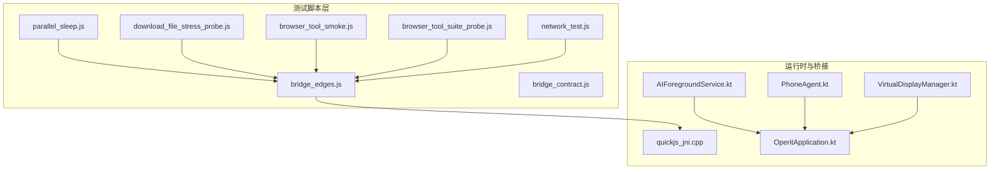
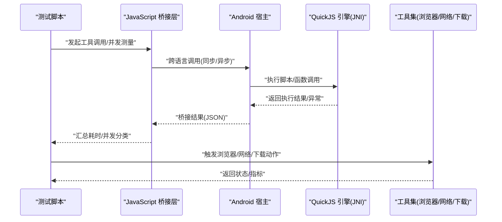
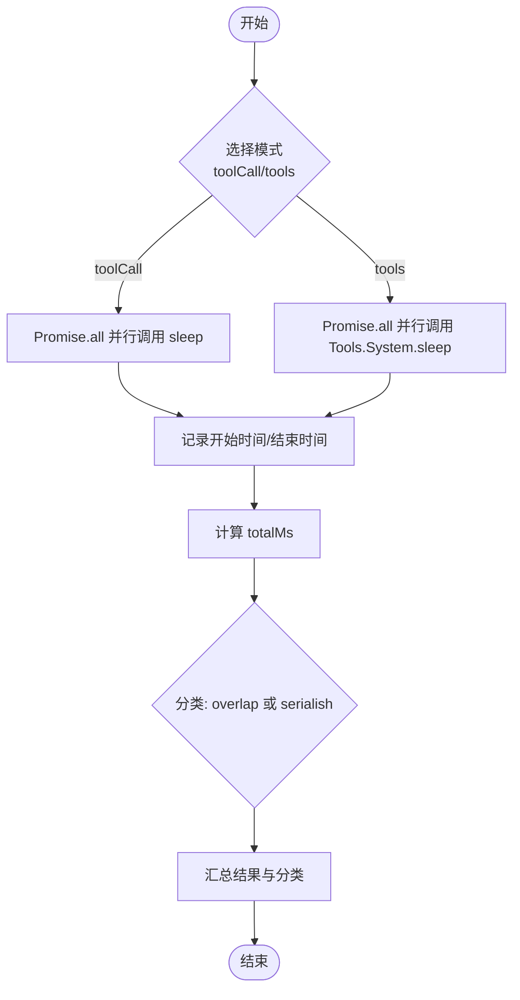
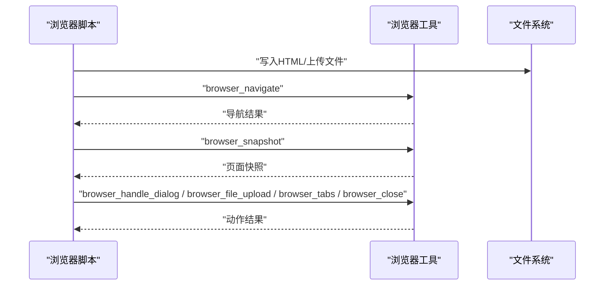
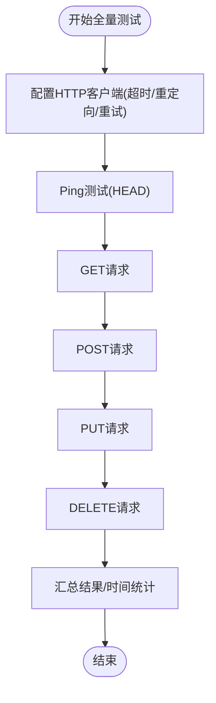
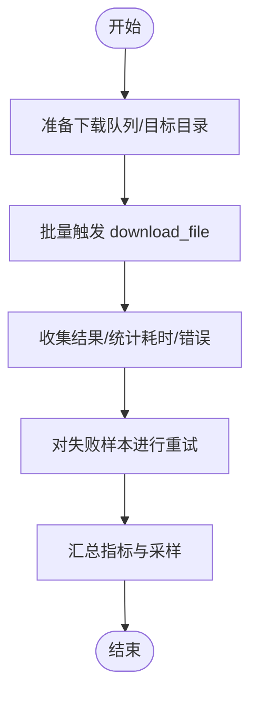
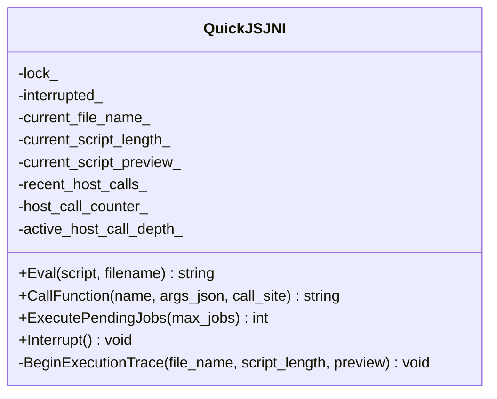
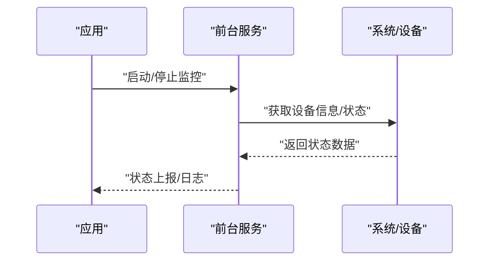
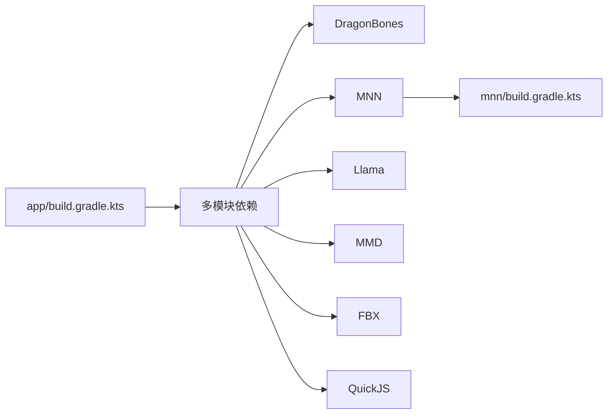

# 性能测试

<cite>
**本文引用的文件**
- [app/build.gradle.kts](file://app/build.gradle.kts)
- [bridge_contract.js](file://app/src/androidTest/js/com/ai/assistance/operit/core/tools/javascript/bridge_contract/bridge_contract.js)
- [bridge_edges.js](file://app/src/androidTest/js/com/ai/assistance/operit/core/tools/javascript/bridge_edges/bridge_edges.js)
- [parallel_sleep.js](file://app/src/androidTest/js/com/ai/assistance/operit/core/tools/javascript/script_mode_contract/parallel_sleep.js)
- [download_file_stress_probe.js](file://app/src/androidTest/js/com/ai/assistance/operit/core/tools/javascript/script_mode_contract/download_file_stress_probe.js)
- [browser_tool_smoke.js](file://app/src/androidTest/js/browser_tool_smoke.js)
- [browser_tool_suite_probe.js](file://app/src/androidTest/js/browser_tool_suite_probe.js)
- [network_test.js](file://examples/network_test.js)
- [quickjs_jni.cpp](file://quickjs/src/main/cpp/quickjs_jni.cpp)
- [AIForegroundService.kt](file://app/src/main/java/com/ai/assistance/operit/api/chat/AIForegroundService.kt)
- [OperitApplication.kt](file://app/src/main/java/com/ai/assistance/operit/core/application/OperitApplication.kt)
- [PhoneAgent.kt](file://app/src/main/java/com/ai/assistance/operit/core/tools/agent/PhoneAgent.kt)
- [VirtualDisplayManager.kt](file://app/src/main/java/com/ai/assistance/operit/core/tools/agent/VirtualDisplayManager.kt)
- [mnn/build.gradle.kts](file://mnn/build.gradle.kts)
</cite>

## 目录
1. [引言](#引言)
2. [项目结构](#项目结构)
3. [核心组件](#核心组件)
4. [架构总览](#架构总览)
5. [详细组件分析](#详细组件分析)
6. [依赖关系分析](#依赖关系分析)
7. [性能考量](#性能考量)
8. [故障排查指南](#故障排查指南)
9. [结论](#结论)
10. [附录](#附录)

## 引言
本文件面向 Operit 项目的开发者，系统性梳理并构建一套可落地的性能测试体系，覆盖基准测试、并发与压力测试、长时间运行测试、资源消耗测试、性能回归与阈值管理，并提供可复用的测试脚本与分析流程。文档重点围绕现有测试脚本与工具链（如 JavaScript 桥接层、浏览器工具、网络测试工具、下载压力探针）进行深入剖析，帮助团队在 Android 应用与脚本运行环境中稳定评估与持续改进性能。

## 项目结构
Operit 的性能测试相关能力主要分布在以下区域：
- Android Instrumentation 测试中的 JavaScript 桥接与并发测量脚本
- 浏览器工具的冒烟与探测脚本
- 网络测试工具（基于 OkHttp3）
- 下载压力探针脚本
- 快速脚本引擎（QuickJS）JNI 层
- 运行时服务与应用上下文（前台服务、应用初始化、设备信息采集）

图表来源
- [bridge_edges.js:1-862](file://app/src/androidTest/js/com/ai/assistance/operit/core/tools/javascript/bridge_edges/bridge_edges.js#L1-L862)
- [bridge_contract.js:1-67](file://app/src/androidTest/js/com/ai/assistance/operit/core/tools/javascript/bridge_contract/bridge_contract.js#L1-L67)
- [parallel_sleep.js:1-54](file://app/src/androidTest/js/com/ai/assistance/operit/core/tools/javascript/script_mode_contract/parallel_sleep.js#L1-L54)
- [download_file_stress_probe.js:1-216](file://app/src/androidTest/js/com/ai/assistance/operit/core/tools/javascript/script_mode_contract/download_file_stress_probe.js#L1-L216)
- [browser_tool_smoke.js:1-158](file://app/src/androidTest/js/browser_tool_smoke.js#L1-L158)
- [browser_tool_suite_probe.js:1-104](file://app/src/androidTest/js/browser_tool_suite_probe.js#L1-L104)
- [network_test.js:1-748](file://examples/network_test.js#L1-L748)
- [quickjs_jni.cpp:333-498](file://quickjs/src/main/cpp/quickjs_jni.cpp#L333-L498)
- [AIForegroundService.kt:568-1436](file://app/src/main/java/com/ai/assistance/operit/api/chat/AIForegroundService.kt#L568-L1436)
- [OperitApplication.kt:542-542](file://app/src/main/java/com/ai/assistance/operit/core/application/OperitApplication.kt#L542-L542)
- [PhoneAgent.kt:204-207](file://app/src/main/java/com/ai/assistance/operit/core/tools/agent/PhoneAgent.kt#L204-L207)
- [VirtualDisplayManager.kt:127-132](file://app/src/main/java/com/ai/assistance/operit/core/tools/agent/VirtualDisplayManager.kt#L127-L132)

章节来源
- [app/build.gradle.kts:1-446](file://app/build.gradle.kts#L1-L446)

## 核心组件
- JavaScript 桥接与并发测量：通过桥接层对宿主（Android）与 JS 的互操作进行计时与并发验证，支撑工具调用路径的性能观测。
- 浏览器工具脚本：提供页面导航、交互、上传、标签页管理等动作的端到端测试，可用于界面渲染与交互延迟的评估。
- 网络测试工具：基于 OkHttp3 的 HTTP 客户端封装，支持 GET/POST/PUT/DELETE、超时配置、重定向与拦截器，便于网络连通性与吞吐测试。
- 下载压力探针：批量触发下载任务，统计成功率、失败样本与重试行为，评估存储与网络在高负载下的稳定性。
- 快速脚本引擎 JNI：暴露脚本执行、函数调用、挂起与中断机制，便于在 C++ 层进行执行轨迹与性能追踪。
- 运行时服务与应用上下文：前台服务与应用初始化逻辑，提供设备信息采集与系统状态监控入口，辅助资源消耗测试。

章节来源
- [bridge_edges.js:1-862](file://app/src/androidTest/js/com/ai/assistance/operit/core/tools/javascript/bridge_edges/bridge_edges.js#L1-L862)
- [parallel_sleep.js:1-54](file://app/src/androidTest/js/com/ai/assistance/operit/core/tools/javascript/script_mode_contract/parallel_sleep.js#L1-L54)
- [download_file_stress_probe.js:1-216](file://app/src/androidTest/js/com/ai/assistance/operit/core/tools/javascript/script_mode_contract/download_file_stress_probe.js#L1-L216)
- [browser_tool_smoke.js:1-158](file://app/src/androidTest/js/browser_tool_smoke.js#L1-L158)
- [browser_tool_suite_probe.js:1-104](file://app/src/androidTest/js/browser_tool_suite_probe.js#L1-L104)
- [network_test.js:1-748](file://examples/network_test.js#L1-L748)
- [quickjs_jni.cpp:333-498](file://quickjs/src/main/cpp/quickjs_jni.cpp#L333-L498)
- [AIForegroundService.kt:568-1436](file://app/src/main/java/com/ai/assistance/operit/api/chat/AIForegroundService.kt#L568-L1436)
- [OperitApplication.kt:542-542](file://app/src/main/java/com/ai/assistance/operit/core/application/OperitApplication.kt#L542-L542)
- [PhoneAgent.kt:204-207](file://app/src/main/java/com/ai/assistance/operit/core/tools/agent/PhoneAgent.kt#L204-L207)
- [VirtualDisplayManager.kt:127-132](file://app/src/main/java/com/ai/assistance/operit/core/tools/agent/VirtualDisplayManager.kt#L127-L132)

## 架构总览
下图展示了性能测试从脚本层到运行时的调用链路与数据流：

图表来源
- [bridge_edges.js:142-189](file://app/src/androidTest/js/com/ai/assistance/operit/core/tools/javascript/bridge_edges/bridge_edges.js#L142-L189)
- [quickjs_jni.cpp:333-498](file://quickjs/src/main/cpp/quickjs_jni.cpp#L333-L498)
- [browser_tool_smoke.js:110-155](file://app/src/androidTest/js/browser_tool_smoke.js#L110-L155)
- [network_test.js:170-748](file://examples/network_test.js#L170-L748)
- [download_file_stress_probe.js:49-216](file://app/src/androidTest/js/com/ai/assistance/operit/core/tools/javascript/script_mode_contract/download_file_stress_probe.js#L49-L216)

## 详细组件分析

### JavaScript 桥接与并发测量
- 并发测量：通过 Promise.all 并行触发多个睡眠工具调用，计算总耗时与单次请求耗时，判断是否存在串行或重叠现象。
- 工具调用路径：支持三种调用形式（工具名、带类型、配置对象），并提供原生调用路径校验。
- 结果汇总：对多次套件运行进行汇总，包含通过数、失败数、总耗时与失败详情。

图表来源
- [bridge_edges.js:142-189](file://app/src/androidTest/js/com/ai/assistance/operit/core/tools/javascript/bridge_edges/bridge_edges.js#L142-L189)
- [parallel_sleep.js:9-54](file://app/src/androidTest/js/com/ai/assistance/operit/core/tools/javascript/script_mode_contract/parallel_sleep.js#L9-L54)

章节来源
- [bridge_edges.js:1-862](file://app/src/androidTest/js/com/ai/assistance/operit/core/tools/javascript/bridge_edges/bridge_edges.js#L1-L862)
- [parallel_sleep.js:1-54](file://app/src/androidTest/js/com/ai/assistance/operit/core/tools/javascript/script_mode_contract/parallel_sleep.js#L1-L54)

### 浏览器工具脚本（冒烟与探测）
- 冒烟脚本：准备本地 HTML 页面，执行导航、快照、对话框处理、文件上传、标签页管理、关闭等动作，验证浏览器工具链可用性。
- 探测脚本：生成测试页面，执行导航与代码注入，验证页面交互与事件处理。

图表来源
- [browser_tool_smoke.js:100-155](file://app/src/androidTest/js/browser_tool_smoke.js#L100-L155)
- [browser_tool_suite_probe.js:80-101](file://app/src/androidTest/js/browser_tool_suite_probe.js#L80-L101)

章节来源
- [browser_tool_smoke.js:1-158](file://app/src/androidTest/js/browser_tool_smoke.js#L1-L158)
- [browser_tool_suite_probe.js:1-104](file://app/src/androidTest/js/browser_tool_suite_probe.js#L1-L104)

### 网络测试工具（基于 OkHttp3）
- 功能覆盖：GET/POST/PUT/DELETE 请求、超时配置、重定向控制、拦截器管理、Ping 测试。
- 结果格式：统一返回状态码、状态消息、头部、内容类型、内容长度、JSON 解析结果与时间信息。
- 全量测试：一键运行所有网络功能，汇总配置、Ping、各类 HTTP 请求的结果。

图表来源
- [network_test.js:170-748](file://examples/network_test.js#L170-L748)

章节来源
- [network_test.js:1-748](file://examples/network_test.js#L1-L748)

### 下载压力探针
- 批量下载：构造多个下载任务，记录每个任务的耗时、错误与文件状态。
- 失败采样：对失败样本进行重试与高阶调用验证，输出采样结果。
- 指标汇总：总耗时、请求数、失败数、畸形响应数与采样高阶结果。

图表来源
- [download_file_stress_probe.js:1-216](file://app/src/androidTest/js/com/ai/assistance/operit/core/tools/javascript/script_mode_contract/download_file_stress_probe.js#L1-L216)

章节来源
- [download_file_stress_probe.js:1-216](file://app/src/androidTest/js/com/ai/assistance/operit/core/tools/javascript/script_mode_contract/download_file_stress_probe.js#L1-L216)

### 快速脚本引擎（QuickJS）JNI
- 执行跟踪：在执行前记录脚本长度、预览与最近宿主调用，支持中断与挂起作业处理。
- 线程安全：使用互斥锁保护上下文访问，避免竞态。
- 性能观测：通过开始/结束标记与异常封装，便于定位慢调用与异常点。

图表来源
- [quickjs_jni.cpp:333-498](file://quickjs/src/main/cpp/quickjs_jni.cpp#L333-L498)

章节来源
- [quickjs_jni.cpp:333-498](file://quickjs/src/main/cpp/quickjs_jni.cpp#L333-L498)

### 运行时服务与应用上下文
- 前台服务：提供唤醒监控、外部 HTTP 监控与状态录制，便于在长时间运行场景中观察系统行为。
- 应用初始化：在应用启动阶段更新配置与资源，确保测试环境一致性。
- 设备信息：采集屏幕分辨率与 DPI，辅助渲染与布局相关性能测试。

图表来源
- [AIForegroundService.kt:568-1436](file://app/src/main/java/com/ai/assistance/operit/api/chat/AIForegroundService.kt#L568-L1436)
- [OperitApplication.kt:542-542](file://app/src/main/java/com/ai/assistance/operit/core/application/OperitApplication.kt#L542-L542)
- [PhoneAgent.kt:204-207](file://app/src/main/java/com/ai/assistance/operit/core/tools/agent/PhoneAgent.kt#L204-L207)
- [VirtualDisplayManager.kt:127-132](file://app/src/main/java/com/ai/assistance/operit/core/tools/agent/VirtualDisplayManager.kt#L127-L132)

章节来源
- [AIForegroundService.kt:568-1436](file://app/src/main/java/com/ai/assistance/operit/api/chat/AIForegroundService.kt#L568-L1436)
- [OperitApplication.kt:542-542](file://app/src/main/java/com/ai/assistance/operit/core/application/OperitApplication.kt#L542-L542)
- [PhoneAgent.kt:204-207](file://app/src/main/java/com/ai/assistance/operit/core/tools/agent/PhoneAgent.kt#L204-L207)
- [VirtualDisplayManager.kt:127-132](file://app/src/main/java/com/ai/assistance/operit/core/tools/agent/VirtualDisplayManager.kt#L127-L132)

## 依赖关系分析
- 构建与打包：Gradle 配置启用 Android Instrumentation Runner，为性能测试提供测试运行环境；同时引入多模块依赖（DragonBones、MNN、Llama、MMD、FBX、QuickJS 等），这些模块可能影响整体性能表现。
- 模块编译选项：MNN 构建脚本开启低内存与量化相关选项，有助于在受限设备上的性能优化与资源占用控制。

图表来源
- [app/build.gradle.kts:1-446](file://app/build.gradle.kts#L1-L446)
- [mnn/build.gradle.kts:39-49](file://mnn/build.gradle.kts#L39-L49)

章节来源
- [app/build.gradle.kts:1-446](file://app/build.gradle.kts#L1-L446)
- [mnn/build.gradle.kts:39-49](file://mnn/build.gradle.kts#L39-L49)

## 性能考量
- 并发与串行：通过并发测量脚本识别工具调用是否存在串行瓶颈或重叠，从而优化批处理策略。
- 网络与存储：网络测试工具提供超时与重定向配置，结合下载压力探针评估在高并发下的稳定性与吞吐。
- 资源占用：前台服务与设备信息采集可用于长时间运行测试中的 CPU、内存与电量消耗观测。
- 引擎开销：QuickJS JNI 提供执行轨迹与异常封装，便于定位脚本执行热点与异常路径。

## 故障排查指南
- 并发测量失败：检查工具调用返回的 requestedMs/sleptMs 是否一致，确认桥接层 JSON 解析与断言逻辑。
- 浏览器工具异常：核对页面路径、上传文件存在性与权限，确认快照引用查找是否正确。
- 网络测试错误：检查客户端配置（超时/重定向/重试），关注状态码与响应体长度，必要时启用拦截器调试。
- 下载压力失败：记录失败样本与重试结果，检查目标路径权限与网络连通性。
- 引擎中断：在脚本执行期间调用中断接口，确保异常路径被正确捕获与封装。

章节来源
- [bridge_edges.js:508-527](file://app/src/androidTest/js/com/ai/assistance/operit/core/tools/javascript/bridge_edges/bridge_edges.js#L508-L527)
- [browser_tool_smoke.js:100-155](file://app/src/androidTest/js/browser_tool_smoke.js#L100-L155)
- [network_test.js:170-748](file://examples/network_test.js#L170-L748)
- [download_file_stress_probe.js:49-216](file://app/src/androidTest/js/com/ai/assistance/operit/core/tools/javascript/script_mode_contract/download_file_stress_probe.js#L49-L216)
- [quickjs_jni.cpp:481-498](file://quickjs/src/main/cpp/quickjs_jni.cpp#L481-L498)

## 结论
通过现有脚本与工具链，Operit 已具备从工具调用、浏览器交互、网络连通到下载压力的多维度性能测试能力。建议在此基础上完善基准线建立、阈值设定与回归检测流程，并结合前台服务与设备信息采集开展长时间运行与资源消耗测试，以形成闭环的性能质量保障体系。

## 附录
- 性能测试环境配置
  - 构建与打包：确保启用 Android Instrumentation Runner，按需调整 ABI 与 NDK 配置。
  - 模块依赖：根据目标设备特性选择性启用/禁用重型模块，平衡功能与性能。
- 测试数据准备
  - 浏览器脚本：准备本地 HTML 与上传文件，确保路径与权限正确。
  - 网络测试：使用稳定的外部服务（如 httpbin）进行连通性与功能验证。
  - 下载压力：准备多个不同大小的目标文件，覆盖常见场景。
- 性能分析报告
  - 指标采集：并发测量的 totalMs、分类；网络测试的状态码、响应长度、平均耗时；下载压力的成功率、失败样本与重试结果。
  - 回归检测：建立基线与阈值，定期对比历史数据，发现异常波动。