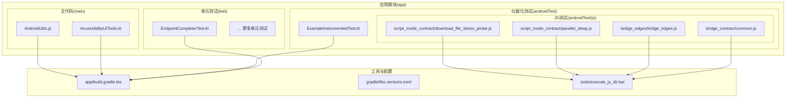
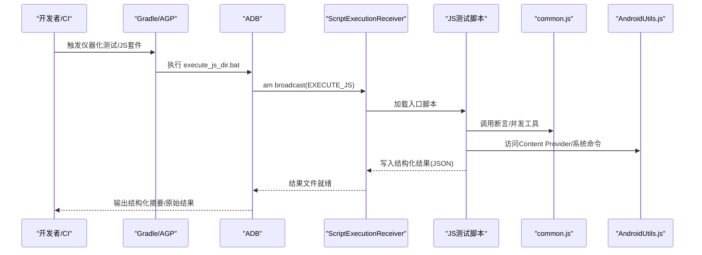
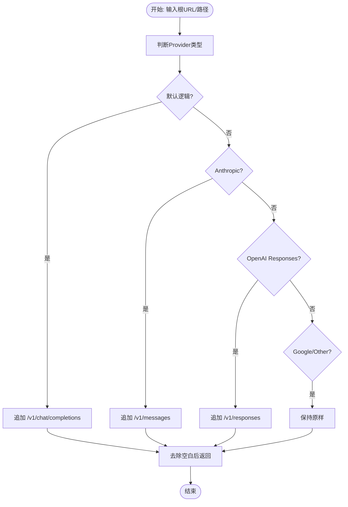
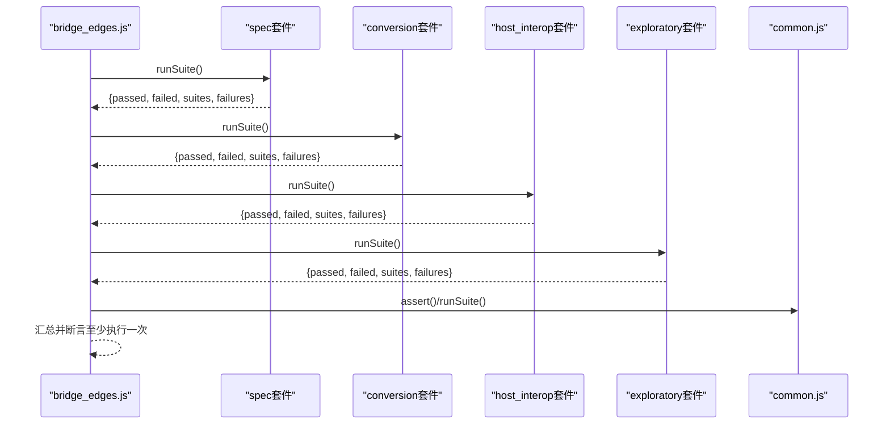
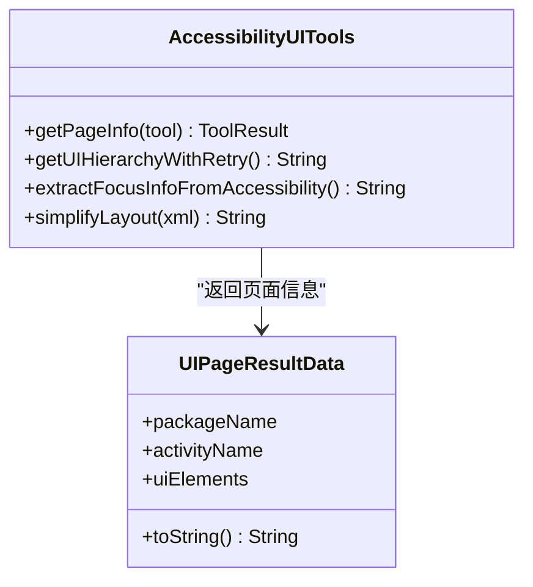
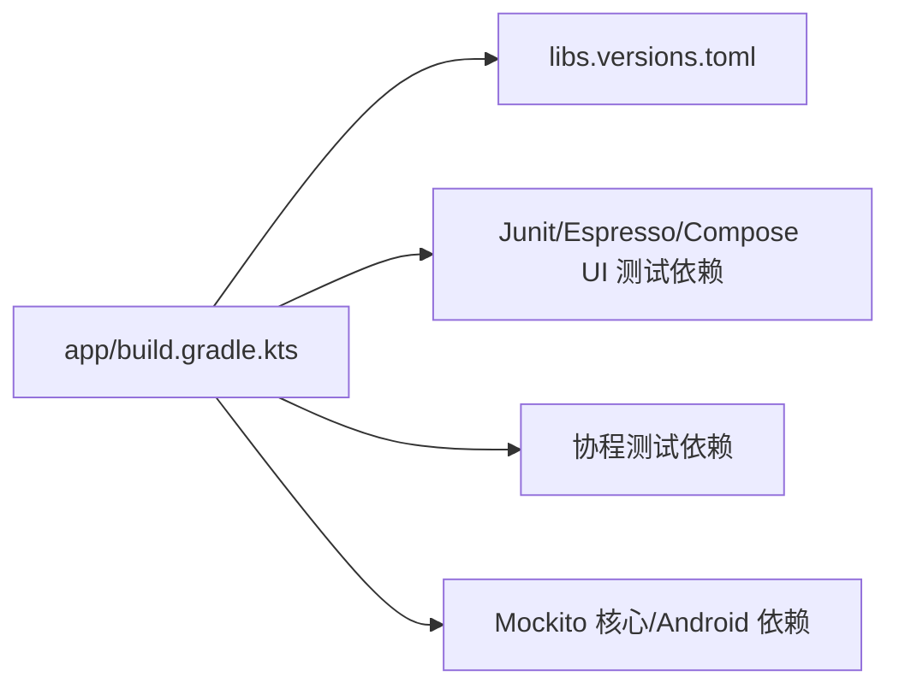

# 测试策略

<cite>
**本文引用的文件**
- [app/build.gradle.kts](file://app/build.gradle.kts)
- [gradle/libs.versions.toml](file://gradle/libs.versions.toml)
- [app/src/test/java/com/ai/assistance/operit/api/chat/llmprovider/EndpointCompleterTest.kt](file://app/src/test/java/com/ai/assistance/operit/api/chat/llmprovider/EndpointCompleterTest.kt)
- [app/src/androidTest/java/com/ai/assistance/operit/ExampleInstrumentedTest.kt](file://app/src/androidTest/java/com/ai/assistance/operit/ExampleInstrumentedTest.kt)
- [app/src/androidTest/js/com/ai/assistance/operit/core/tools/javascript/bridge_contract/common.js](file://app/src/androidTest/js/com/ai/assistance/operit/core/tools/javascript/bridge_contract/common.js)
- [app/src/androidTest/js/com/ai/assistance/operit/core/tools/javascript/bridge_edges/bridge_edges.js](file://app/src/androidTest/js/com/ai/assistance/operit/core/tools/javascript/bridge_edges/bridge_edges.js)
- [app/src/androidTest/js/com/ai/assistance/operit/core/tools/javascript/script_mode_contract/parallel_sleep.js](file://app/src/androidTest/js/com/ai/assistance/operit/core/tools/javascript/script_mode_contract/parallel_sleep.js)
- [app/src/androidTest/js/com/ai/assistance/operit/core/tools/javascript/script_mode_contract/download_file_stress_probe.js](file://app/src/androidTest/js/com/ai/assistance/operit/core/tools/javascript/script_mode_contract/download_file_stress_probe.js)
- [tools/execute_js_dir.bat](file://tools/execute_js_dir.bat)
- [app/src/main/java/com/ai/assistance/operit/core/tools/defaultTool/accessbility/AccessibilityUITools.kt](file://app/src/main/java/com/ai/assistance/operit/core/tools/defaultTool/accessbility/AccessibilityUITools.kt)
- [examples/automatic_ui_base.ts](file://examples/automatic_ui_base.ts)
- [examples/types/results.d.ts](file://examples/types/results.d.ts)
- [examples/system_tools.ts](file://examples/system_tools.ts)
- [app/src/main/assets/js/AndroidUtils.js](file://app/src/main/assets/js/AndroidUtils.js)
- [examples/java_bridge.ts](file://examples/java_bridge.ts)
</cite>

## 目录
1. [引言](#引言)
2. [项目结构](#项目结构)
3. [核心组件](#核心组件)
4. [架构总览](#架构总览)
5. [详细组件分析](#详细组件分析)
6. [依赖关系分析](#依赖关系分析)
7. [性能考量](#性能考量)
8. [故障排查指南](#故障排查指南)
9. [结论](#结论)
10. [附录](#附录)

## 引言
本文件面向 Operit AI 的开发者与测试工程师，系统化梳理并输出项目的测试策略与实施路径。内容覆盖单元测试框架与配置、Mock 对象使用、测试数据准备；集成测试方法（组件交互、API 接口、数据库操作）；性能测试策略（压力/负载、并发、内存泄漏检测）；用户验收测试流程（功能验证、用户体验、兼容性）；以及测试自动化方案（CI/CD 集成、自动化执行、测试报告生成）。同时提供可复用的测试示例与最佳实践，帮助团队建立稳定、高效、可维护的测试体系。

## 项目结构
Operit AI 在 Android 应用模块中采用标准的源集组织：单元测试位于 app/src/test，仪器化测试位于 app/src/androidTest。JS 测试脚本位于 app/src/androidTest/js 下，配合工具链在设备侧执行。构建脚本通过 Gradle 配置了 JUnit、Espresso、Compose UI 测试、协程测试、Mockito 等依赖，并在 Android 构建配置中指定仪器化测试运行器。

**图示来源**
- [app/build.gradle.kts](file://app/build.gradle.kts)
- [gradle/libs.versions.toml](file://gradle/libs.versions.toml)
- [app/src/test/java/com/ai/assistance/operit/api/chat/llmprovider/EndpointCompleterTest.kt](file://app/src/test/java/com/ai/assistance/operit/api/chat/llmprovider/EndpointCompleterTest.kt)
- [app/src/androidTest/java/com/ai/assistance/operit/ExampleInstrumentedTest.kt](file://app/src/androidTest/java/com/ai/assistance/operit/ExampleInstrumentedTest.kt)
- [app/src/androidTest/js/com/ai/assistance/operit/core/tools/javascript/bridge_contract/common.js](file://app/src/androidTest/js/com/ai/assistance/operit/core/tools/javascript/bridge_contract/common.js)
- [app/src/androidTest/js/com/ai/assistance/operit/core/tools/javascript/bridge_edges/bridge_edges.js](file://app/src/androidTest/js/com/ai/assistance/operit/core/tools/javascript/bridge_edges/bridge_edges.js)
- [app/src/androidTest/js/com/ai/assistance/operit/core/tools/javascript/script_mode_contract/parallel_sleep.js](file://app/src/androidTest/js/com/ai/assistance/operit/core/tools/javascript/script_mode_contract/parallel_sleep.js)
- [app/src/androidTest/js/com/ai/assistance/operit/core/tools/javascript/script_mode_contract/download_file_stress_probe.js](file://app/src/androidTest/js/com/ai/assistance/operit/core/tools/javascript/script_mode_contract/download_file_stress_probe.js)
- [tools/execute_js_dir.bat](file://tools/execute_js_dir.bat)
- [app/src/main/java/com/ai/assistance/operit/core/tools/defaultTool/accessbility/AccessibilityUITools.kt](file://app/src/main/java/com/ai/assistance/operit/core/tools/defaultTool/accessbility/AccessibilityUITools.kt)
- [app/src/main/assets/js/AndroidUtils.js](file://app/src/main/assets/js/AndroidUtils.js)

**章节来源**
- [app/build.gradle.kts](file://app/build.gradle.kts)
- [gradle/libs.versions.toml](file://gradle/libs.versions.toml)

## 核心组件
- 单元测试框架与配置
  - JUnit 4/4.x 与 AndroidX Test Ext JUnit 运行器已配置，测试运行器在构建脚本中明确指定。
  - 协程测试与 Mockito（核心与 Android）依赖已引入，便于异步与依赖替换。
- 仪器化测试与 UI 测试
  - Espresso 与 Compose UI 测试依赖已配置，支持 UI 层端到端验证。
  - AccessibilityUITools 提供基于无障碍服务的 UI 获取与简化能力，便于测试页面信息与交互。
- JS 测试与桥接
  - JS 测试脚本通过 Android 广播触发执行，common.js 提供断言与并发工具，bridge_edges.js 组织多套测试套件。
  - tools/execute_js_dir.bat 封装了打包、推送、广播执行、等待结果与结构化输出的完整流程。
- 工具与实用函数
  - AndroidUtils.js 提供 content provider 的查询/插入/更新/删除等能力，便于数据库操作测试。
  - examples/java_bridge.ts 提供跨语言桥接的测试样例，含超时等待、断言与用例执行流程。

**章节来源**
- [app/build.gradle.kts](file://app/build.gradle.kts)
- [gradle/libs.versions.toml](file://gradle/libs.versions.toml)
- [app/src/main/java/com/ai/assistance/operit/core/tools/defaultTool/accessbility/AccessibilityUITools.kt](file://app/src/main/java/com/ai/assistance/operit/core/tools/defaultTool/accessbility/AccessibilityUITools.kt)
- [app/src/main/assets/js/AndroidUtils.js](file://app/src/main/assets/js/AndroidUtils.js)
- [examples/java_bridge.ts](file://examples/java_bridge.ts)

## 架构总览
下图展示了测试体系在本地与设备侧的协作关系：Gradle/AGP 触发仪器化测试；JS 测试脚本通过 Android 广播被 ScriptExecutionReceiver 接收并在设备侧执行；common.js 提供断言与并发工具；bridge_edges.js 组织多个子套件；tools/execute_js_dir.bat 完成打包、推送、广播、等待与结果解析。

**图示来源**
- [tools/execute_js_dir.bat](file://tools/execute_js_dir.bat)
- [app/src/androidTest/js/com/ai/assistance/operit/core/tools/javascript/bridge_contract/common.js](file://app/src/androidTest/js/com/ai/assistance/operit/core/tools/javascript/bridge_contract/common.js)
- [app/src/main/assets/js/AndroidUtils.js](file://app/src/main/assets/js/AndroidUtils.js)

## 详细组件分析

### 单元测试：EndpointCompleterTest
该测试用例验证端点补全逻辑，覆盖多种 Provider 类型与路径形态，确保在不同输入条件下输出符合预期的最终端点地址。测试覆盖了尾斜杠、查询参数、哈希禁用、不同 Provider 的特化路径等边界情况。

**图示来源**
- [app/src/test/java/com/ai/assistance/operit/api/chat/llmprovider/EndpointCompleterTest.kt](file://app/src/test/java/com/ai/assistance/operit/api/chat/llmprovider/EndpointCompleterTest.kt)

**章节来源**
- [app/src/test/java/com/ai/assistance/operit/api/chat/llmprovider/EndpointCompleterTest.kt](file://app/src/test/java/com/ai/assistance/operit/api/chat/llmprovider/EndpointCompleterTest.kt)

### 仪器化测试：ExampleInstrumentedTest
基础仪器化测试示例，验证目标应用上下文与包名一致性，确保测试运行环境正确初始化。

**章节来源**
- [app/src/androidTest/java/com/ai/assistance/operit/ExampleInstrumentedTest.kt](file://app/src/androidTest/java/com/ai/assistance/operit/ExampleInstrumentedTest.kt)

### JS 测试：桥接与并发对比
bridge_contract/common.js 提供断言、线程与并发任务执行工具；bridge_edges.js 组织多个测试套件并汇总结果；parallel_sleep.js 对比并行与串行 sleep 的耗时差异，评估桥接层并发性能；download_file_stress_probe.js 进行批量下载压力测试，记录失败与异常样本。

**图示来源**
- [app/src/androidTest/js/com/ai/assistance/operit/core/tools/javascript/bridge_edges/bridge_edges.js](file://app/src/androidTest/js/com/ai/assistance/operit/core/tools/javascript/bridge_edges/bridge_edges.js)
- [app/src/androidTest/js/com/ai/assistance/operit/core/tools/javascript/bridge_contract/common.js](file://app/src/androidTest/js/com/ai/assistance/operit/core/tools/javascript/bridge_contract/common.js)

**章节来源**
- [app/src/androidTest/js/com/ai/assistance/operit/core/tools/javascript/bridge_contract/common.js](file://app/src/androidTest/js/com/ai/assistance/operit/core/tools/javascript/bridge_contract/common.js)
- [app/src/androidTest/js/com/ai/assistance/operit/core/tools/javascript/bridge_edges/bridge_edges.js](file://app/src/androidTest/js/com/ai/assistance/operit/core/tools/javascript/bridge_edges/bridge_edges.js)
- [app/src/androidTest/js/com/ai/assistance/operit/core/tools/javascript/script_mode_contract/parallel_sleep.js](file://app/src/androidTest/js/com/ai/assistance/operit/core/tools/javascript/script_mode_contract/parallel_sleep.js)
- [app/src/androidTest/js/com/ai/assistance/operit/core/tools/javascript/script_mode_contract/download_file_stress_probe.js](file://app/src/androidTest/js/com/ai/assistance/operit/core/tools/javascript/script_mode_contract/download_file_stress_probe.js)

### 性能测试：并发与压力
- 并发对比：parallel_sleep.js 对比 toolCall 与 Tools.System.sleep 的并行/串行耗时，评估桥接调用开销与系统调度行为。
- 压力测试：download_file_stress_probe.js 发起批量下载请求，记录原始回调异常、畸形响应与采样重试结果，定位瓶颈与失败模式。
- 内存泄漏检测建议：结合设备侧日志采集与长时间运行监控，观察堆内存峰值与 GC 行为；对高频对象池与回调注册进行生命周期管理检查。

**章节来源**
- [app/src/androidTest/js/com/ai/assistance/operit/core/tools/javascript/script_mode_contract/parallel_sleep.js](file://app/src/androidTest/js/com/ai/assistance/operit/core/tools/javascript/script_mode_contract/parallel_sleep.js)
- [app/src/androidTest/js/com/ai/assistance/operit/core/tools/javascript/script_mode_contract/download_file_stress_probe.js](file://app/src/androidTest/js/com/ai/assistance/operit/core/tools/javascript/script_mode_contract/download_file_stress_probe.js)

### UI 自动化测试：AccessibilityUITools 与示例脚本
- AccessibilityUITools 提供基于无障碍服务的页面信息获取与简化布局能力，支持 UI 页面信息与焦点信息提取，便于断言页面状态与元素存在性。
- examples/automatic_ui_base.ts 展示了滑动、点击等常见 UI 动作的自动化测试流程，包含结果汇总与错误处理，适合作为 UI 工具测试模板。

**图示来源**
- [app/src/main/java/com/ai/assistance/operit/core/tools/defaultTool/accessbility/AccessibilityUITools.kt](file://app/src/main/java/com/ai/assistance/operit/core/tools/defaultTool/accessbility/AccessibilityUITools.kt)
- [examples/types/results.d.ts](file://examples/types/results.d.ts)

**章节来源**
- [app/src/main/java/com/ai/assistance/operit/core/tools/defaultTool/accessbility/AccessibilityUITools.kt](file://app/src/main/java/com/ai/assistance/operit/core/tools/defaultTool/accessbility/AccessibilityUITools.kt)
- [examples/automatic_ui_base.ts](file://examples/automatic_ui_base.ts)
- [examples/types/results.d.ts](file://examples/types/results.d.ts)

### 数据库操作测试：Content Provider 工具
AndroidUtils.js 提供 content 命令封装，支持查询、插入、更新、删除，便于在测试中构造/清理测试数据，验证数据一致性与边界条件。

**章节来源**
- [app/src/main/assets/js/AndroidUtils.js](file://app/src/main/assets/js/AndroidUtils.js)

### 桥接测试：Java/JS 互操作
examples/java_bridge.ts 提供跨语言桥接的测试样例，包含等待、断言、用例执行与结果统计，可用于验证桥接层稳定性与性能。

**章节来源**
- [examples/java_bridge.ts](file://examples/java_bridge.ts)

## 依赖关系分析
- 测试运行器与框架
  - testImplementation 与 androidTestImplementation 分别声明了本地与设备侧的 JUnit、Espresso、Compose UI 测试依赖。
  - testImplementation(libs.coroutines.test) 与 androidTestImplementation(libs.coroutines.test) 支持协程测试。
  - testImplementation(libs.mockito.core, libs.mockito.kotlin) 与 androidTestImplementation(libs.mockito.android) 提供 Mock 能力。
- 版本统一管理
  - gradle/libs.versions.toml 统一管理各依赖版本，确保一致性与可维护性。

**图示来源**
- [app/build.gradle.kts](file://app/build.gradle.kts)
- [gradle/libs.versions.toml](file://gradle/libs.versions.toml)

**章节来源**
- [app/build.gradle.kts](file://app/build.gradle.kts)
- [gradle/libs.versions.toml](file://gradle/libs.versions.toml)

## 性能考量
- 压力与负载测试
  - 使用 download_file_stress_probe.js 构造批量下载场景，统计失败率、畸形响应与重试效果，定位网络与存储瓶颈。
  - parallel_sleep.js 对比并行/串行调用耗时，评估桥接层与系统调度效率。
- 并发与资源竞争
  - 在 JS 测试中使用 common.js 的并发工具，注意回调清理与全局变量回收，避免内存泄漏。
- 数据库与 I/O
  - 通过 AndroidUtils.js 的 content 命令进行批量写入/读取，关注事务提交与索引影响，必要时分批执行以降低峰值压力。
- 可观测性
  - 在设备侧启用日志采集与性能监控，持续跟踪 CPU、内存、GC、网络吞吐等指标，形成回归基线。

[本节为通用指导，无需特定文件来源]

## 故障排查指南
- 设备连接与广播执行
  - 若 execute_js_dir.bat 报错“无授权设备”或“推送失败”，请确认 ADB 权限、设备已授权且连接正常；检查广播 Action 与参数是否匹配。
- 结果文件与超时
  - 若等待超时，检查设备侧 ScriptExecutionReceiver 是否成功接收并执行；确认结果文件路径与权限；适当增大等待时间。
- JS 断言与异常
  - 使用 common.js 的断言工具快速定位问题；对异常回调与畸形响应进行采样重试，缩小问题范围。
- UI 自动化失败
  - AccessibilityUITools 的页面信息获取可能受无障碍服务状态影响，检查服务可用性与权限；对不稳定元素增加重试与显式等待。

**章节来源**
- [tools/execute_js_dir.bat](file://tools/execute_js_dir.bat)
- [app/src/androidTest/js/com/ai/assistance/operit/core/tools/javascript/bridge_contract/common.js](file://app/src/androidTest/js/com/ai/assistance/operit/core/tools/javascript/bridge_contract/common.js)
- [app/src/main/java/com/ai/assistance/operit/core/tools/defaultTool/accessbility/AccessibilityUITools.kt](file://app/src/main/java/com/ai/assistance/operit/core/tools/defaultTool/accessbility/AccessibilityUITools.kt)

## 结论
Operit AI 的测试体系以 Gradle/AGP 为基础，结合 JUnit/Espresso/Compose UI 测试与 JS 测试脚本，覆盖单元、集成与性能层面的关键场景。通过统一的依赖版本管理、规范化的仪器化测试运行器配置、完善的 JS 执行与结果解析工具链，团队可以高效地开展自动化测试与回归验证。建议在现有基础上进一步完善覆盖率度量、持续集成流水线与测试报告可视化，以提升质量保障能力与交付效率。

[本节为总结性内容，无需特定文件来源]

## 附录

### 测试覆盖率要求（建议）
- 单元测试：核心算法与业务逻辑达到高覆盖率（建议 ≥ 80%），边界与异常分支全覆盖。
- 仪器化测试：关键 UI 路径与交互流程覆盖，重点页面与操作序列通过自动化回归。
- JS 测试：桥接层与工具链关键路径覆盖，压力与并发场景具备代表性用例。
- 数据库操作：CRUD 场景与事务边界测试完备，异常与并发写入具备防护与回滚验证。

[本节为通用指导，无需特定文件来源]

### 测试环境配置
- 本地环境
  - 安装 Android SDK/NDK、Gradle、Node.js（用于 esbuild 打包）、ADB。
  - 在 local.properties 中配置签名与密钥信息（如需发布变体）。
- 设备环境
  - 开启开发者选项与无障碍服务；确保允许安装/调试应用；准备测试账号与必要的权限。
- JS 测试
  - 使用 tools/execute_js_dir.bat 执行测试套件，确保 esbuild 可用且网络可达（下载类测试）。

**章节来源**
- [tools/execute_js_dir.bat](file://tools/execute_js_dir.bat)
- [app/build.gradle.kts](file://app/build.gradle.kts)

### 测试自动化方案
- CI/CD 集成
  - 在流水线中执行 Gradle 测试任务与 JS 套件执行脚本；对关键分支与 PR 设置强制性测试通过门槛。
- 自动化执行
  - 使用 execute_js_dir.bat 封装的流程，支持选择入口脚本、函数名、参数与环境文件，便于在不同设备上重复执行。
- 测试报告生成
  - 利用 common.js 的断言与汇总能力，结合结构化输出，生成 PASS/FAIL 摘要与详细失败列表，便于问题追踪与修复闭环。

**章节来源**
- [tools/execute_js_dir.bat](file://tools/execute_js_dir.bat)
- [app/src/androidTest/js/com/ai/assistance/operit/core/tools/javascript/bridge_contract/common.js](file://app/src/androidTest/js/com/ai/assistance/operit/core/tools/javascript/bridge_contract/common.js)