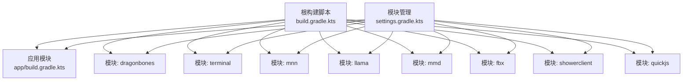
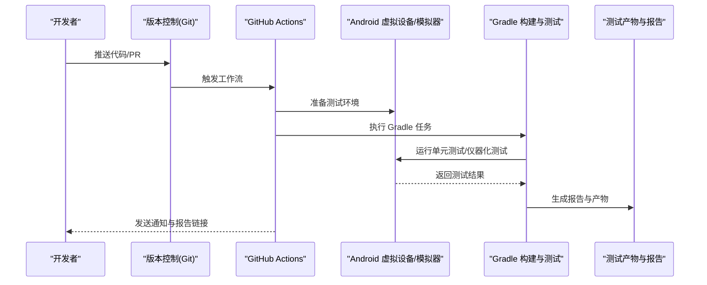
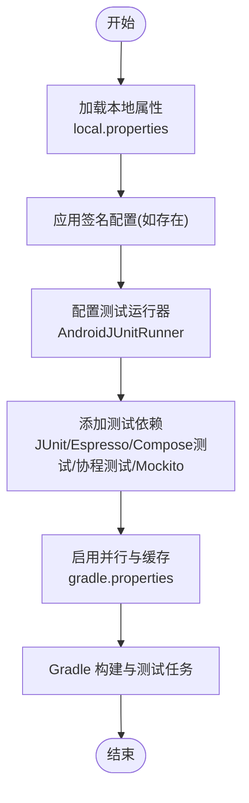
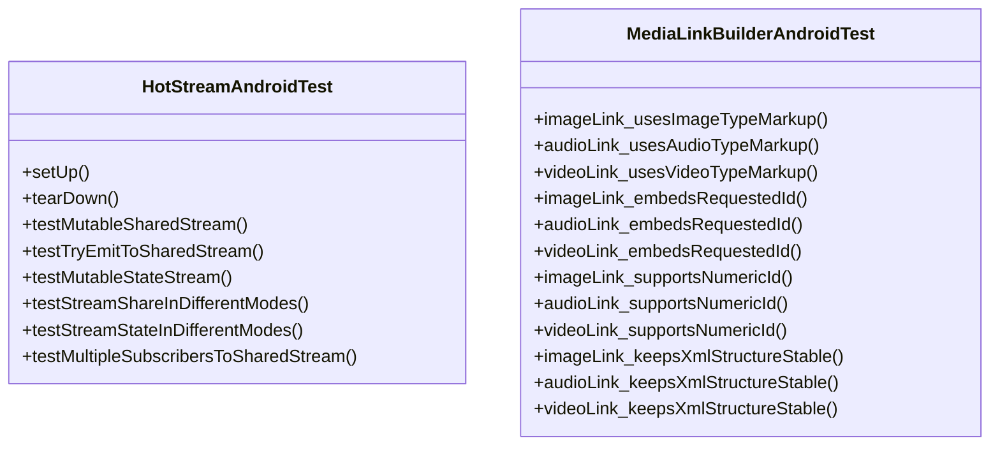
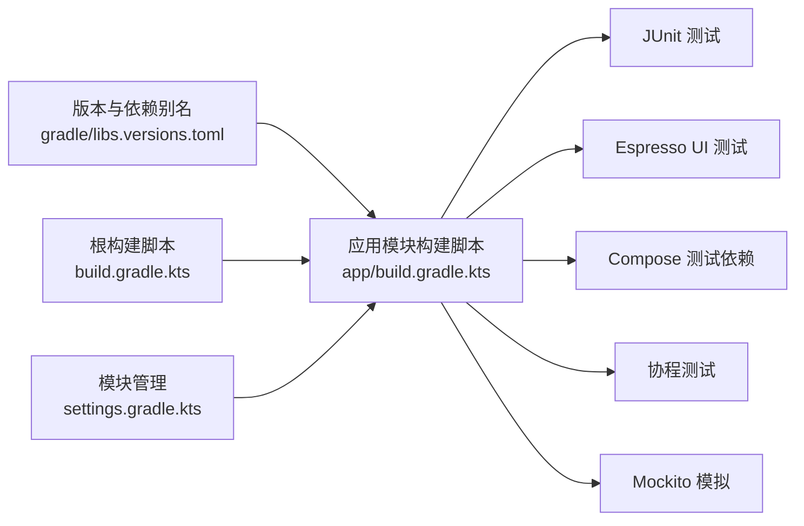

# 自动化测试

<cite>
**本文引用的文件**
- [build.gradle.kts](file://build.gradle.kts)
- [settings.gradle.kts](file://settings.gradle.kts)
- [gradle/libs.versions.toml](file://gradle/libs.versions.toml)
- [gradle.properties](file://gradle.properties)
- [app/build.gradle.kts](file://app/build.gradle.kts)
- [app/src/androidTest/java/com/ai/assistance/operit/ExampleInstrumentedTest.kt](file://app/src/androidTest/java/com/ai/assistance/operit/ExampleInstrumentedTest.kt)
- [app/src/androidTest/java/com/ai/assistance/operit/util/stream/HotStreamAndroidTest.kt](file://app/src/androidTest/java/com/ai/assistance/operit/util/stream/HotStreamAndroidTest.kt)
- [app/src/androidTest/java/com/ai/assistance/operit/api/chat/llmprovider/MediaLinkBuilderAndroidTest.kt](file://app/src/androidTest/java/com/ai/assistance/operit/api/chat/llmprovider/MediaLinkBuilderAndroidTest.kt)
</cite>

## 目录
1. [引言](#引言)
2. [项目结构](#项目结构)
3. [核心组件](#核心组件)
4. [架构总览](#架构总览)
5. [详细组件分析](#详细组件分析)
6. [依赖关系分析](#依赖关系分析)
7. [性能考量](#性能考量)
8. [故障排查指南](#故障排查指南)
9. [结论](#结论)
10. [附录](#附录)

## 引言
本文件面向 Operit 项目的开发者与测试工程师，系统性阐述项目的自动化测试体系与持续集成实践。内容覆盖：
- CI/CD 集成策略：基于 GitHub Actions 的配置思路、自动化构建与测试流水线设计
- 测试自动化框架：Gradle 测试任务、测试报告生成与结果分析
- 持续集成中的测试策略：代码变更触发、并行执行、结果缓存
- 测试报告与度量：覆盖率、性能基准、失败分析
- 实操指南：测试环境搭建、参数配置、失败处理、通知与数据同步

说明：仓库中未发现现成的 GitHub Actions 工作流文件，本文提供可落地的配置建议与最佳实践，帮助团队快速落地。

## 项目结构
Operit 采用多模块 Gradle 架构，主应用模块位于 app，核心依赖与版本由 libs.versions.toml 统一管理；根构建脚本集中声明插件与对象数据库插件；settings.gradle.kts 控制模块包含关系。

图表来源
- [build.gradle.kts](file://build.gradle.kts)
- [settings.gradle.kts](file://settings.gradle.kts)

章节来源
- [build.gradle.kts](file://build.gradle.kts)
- [settings.gradle.kts](file://settings.gradle.kts)

## 核心组件
- Gradle 版本与插件管理：通过 libs.versions.toml 统一管理依赖版本与插件别名，提升一致性与可维护性。
- 应用模块测试配置：app/build.gradle.kts 中定义了 Android 测试运行器、Espresso、Compose 测试依赖、协程测试与 Mockito 等。
- 并行与缓存：gradle.properties 启用并行构建、守护进程、按需配置与构建缓存，显著缩短 CI 时间。
- 示例测试用例：包含基础仪器化测试与针对流式处理、媒体链接构建等场景的专项测试。

章节来源
- [gradle/libs.versions.toml](file://gradle/libs.versions.toml)
- [app/build.gradle.kts](file://app/build.gradle.kts)
- [gradle.properties](file://gradle.properties)
- [app/src/androidTest/java/com/ai/assistance/operit/ExampleInstrumentedTest.kt](file://app/src/androidTest/java/com/ai/assistance/operit/ExampleInstrumentedTest.kt)

## 架构总览
下图展示了从代码提交到测试执行与结果反馈的端到端流程。该流程适用于 GitHub Actions 环境，开发者可根据自身需求调整步骤与缓存策略。

## 详细组件分析

### Gradle 测试任务与配置
- 测试运行器与依赖
  - Android 仪器化测试运行器：用于在设备/模拟器上执行 UI 与集成测试
  - Espresso：用于 UI 自动化测试
  - Compose 测试依赖：支持 Jetpack Compose UI 测试
  - 协程测试：便于异步逻辑测试
  - Mockito：提供模拟对象能力
- 关键配置要点
  - 在 app/build.gradle.kts 中启用测试运行器与相关依赖
  - 使用 libs.versions.toml 统一版本，避免冲突
  - 在 gradle.properties 中开启并行与缓存以提升 CI 效率

图表来源
- [app/build.gradle.kts](file://app/build.gradle.kts)
- [gradle.properties](file://gradle.properties)

章节来源
- [app/build.gradle.kts](file://app/build.gradle.kts)
- [gradle/libs.versions.toml](file://gradle/libs.versions.toml)
- [gradle.properties](file://gradle.properties)

### 仪器化测试示例：流式处理与媒体链接
- 流式处理测试（HotStreamAndroidTest）
  - 验证共享流的重放缓存、订阅并发、不同启动模式（EAGERLY/LAZILY）下的行为
  - 使用协程作用域与超时控制，确保测试稳定性
- 媒体链接构建测试（MediaLinkBuilderAndroidTest）
  - 验证不同类型媒体链接的标记结构与 ID 注入
  - 保证 XML 结构稳定性与可读性

图表来源
- [app/src/androidTest/java/com/ai/assistance/operit/util/stream/HotStreamAndroidTest.kt](file://app/src/androidTest/java/com/ai/assistance/operit/util/stream/HotStreamAndroidTest.kt)
- [app/src/androidTest/java/com/ai/assistance/operit/api/chat/llmprovider/MediaLinkBuilderAndroidTest.kt](file://app/src/androidTest/java/com/ai/assistance/operit/api/chat/llmprovider/MediaLinkBuilderAndroidTest.kt)

章节来源
- [app/src/androidTest/java/com/ai/assistance/operit/util/stream/HotStreamAndroidTest.kt](file://app/src/androidTest/java/com/ai/assistance/operit/util/stream/HotStreamAndroidTest.kt)
- [app/src/androidTest/java/com/ai/assistance/operit/api/chat/llmprovider/MediaLinkBuilderAndroidTest.kt](file://app/src/androidTest/java/com/ai/assistance/operit/api/chat/llmprovider/MediaLinkBuilderAndroidTest.kt)

### 基础仪器化测试示例：应用上下文验证
- ExampleInstrumentedTest 展示了如何获取目标应用上下文并进行基本断言，适合作为仪器化测试的入门模板。

章节来源
- [app/src/androidTest/java/com/ai/assistance/operit/ExampleInstrumentedTest.kt](file://app/src/androidTest/java/com/ai/assistance/operit/ExampleInstrumentedTest.kt)

## 依赖关系分析
- 插件与版本管理
  - 根构建脚本统一声明 Android 应用/库插件、Kotlin 插件、Compose 插件、序列化与 KAPT 等
  - libs.versions.toml 定义各依赖版本与别名，减少重复与冲突
- 模块包含关系
  - settings.gradle.kts 明确包含 app 与多个子模块，确保 Gradle 能正确解析依赖树
- 测试依赖链
  - app 模块在 androidTestImplementation 中引入 JUnit、Espresso、Compose 测试依赖与协程测试、Mockito，形成完整的测试栈

图表来源
- [gradle/libs.versions.toml](file://gradle/libs.versions.toml)
- [build.gradle.kts](file://build.gradle.kts)
- [settings.gradle.kts](file://settings.gradle.kts)
- [app/build.gradle.kts](file://app/build.gradle.kts)

章节来源
- [gradle/libs.versions.toml](file://gradle/libs.versions.toml)
- [build.gradle.kts](file://build.gradle.kts)
- [settings.gradle.kts](file://settings.gradle.kts)
- [app/build.gradle.kts](file://app/build.gradle.kts)

## 性能考量
- 并行与缓存
  - gradle.properties 已启用并行构建、守护进程、按需配置与构建缓存，建议在 CI 中保持开启以降低重复构建时间
- 任务拆分
  - 将单元测试与仪器化测试拆分为独立 Job，充分利用缓存与并行资源
- 设备/模拟器选择
  - 在 CI 中优先使用 ARM64 虚拟设备镜像，减少兼容性问题；必要时为不同 ABI/SDK 设置矩阵
- 产物与报告缓存
  - 对 Gradle 缓存目录、测试报告目录进行缓存，避免重复下载与重复测试

章节来源
- [gradle.properties](file://gradle.properties)

## 故障排查指南
- 测试超时与不稳定
  - 使用协程超时与 CountDownLatch 等机制；在复杂流式测试中，适当放宽等待时间并加入轮询校验
- 设备兼容性问题
  - 确保测试目标 ABI 与 app 模块一致；必要时在 CI 中指定设备规格
- 依赖冲突
  - 通过 libs.versions.toml 统一版本，避免手动版本不一致导致的类冲突
- 报告缺失
  - 确保 Gradle 任务输出报告路径正确，并在 CI 中上传 artifacts

章节来源
- [app/src/androidTest/java/com/ai/assistance/operit/util/stream/HotStreamAndroidTest.kt](file://app/src/androidTest/java/com/ai/assistance/operit/util/stream/HotStreamAndroidTest.kt)
- [gradle/libs.versions.toml](file://gradle/libs.versions.toml)

## 结论
Operit 已具备完善的测试基础设施：统一的版本与插件管理、明确的模块划分、丰富的测试依赖与示例用例。结合本文提供的 CI/CD 集成策略与最佳实践，团队可快速落地自动化测试流水线，实现高效、稳定、可观测的持续交付。

## 附录

### CI/CD 集成策略（基于现有配置的落地建议）
- 触发策略
  - 推送主分支与 Pull Request 均触发测试；对非功能性变更（如文档）可增加跳过条件
- 任务拆分
  - 单元测试 Job：仅运行本地测试，使用缓存加速
  - 仪器化测试 Job：准备设备/模拟器，运行 Android 仪器化测试
- 缓存与工件
  - 缓存 Gradle 用户目录与构建缓存
  - 上传测试报告与 APK 作为工件
- 通知与质量门禁
  - 失败时发送通知；对关键分支设置质量门禁（如测试通过率阈值）

### 测试报告与度量
- 测试报告
  - 使用 Gradle 内置报告或生成 JUnit/XML 报告，供 CI 平台解析
- 覆盖率
  - 建议引入覆盖率工具（如 Jacoco），在 CI 中生成覆盖率报告并与平台集成
- 性能基准
  - 对关键路径（如流式处理、媒体链接构建）建立基准测试，定期回归
- 失败分析
  - 记录失败堆栈、设备日志与截图；对间歇性失败建立重试与降采样策略

### 测试环境管理与数据同步
- 环境变量与密钥
  - 在 CI 中安全注入签名密钥、第三方服务 Token 等敏感信息
- 数据同步
  - 对于需要真实数据的测试，建议使用预置数据或沙箱环境；避免污染生产数据
- 结果通知
  - 通过邮件、IM 或平台通知渠道发送测试结果摘要与链接