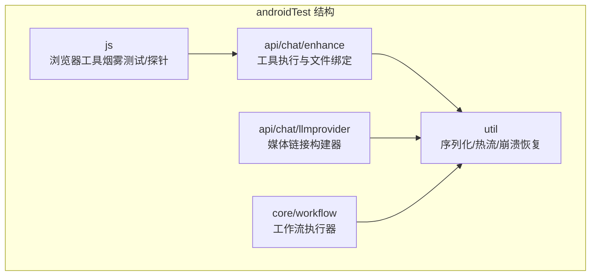
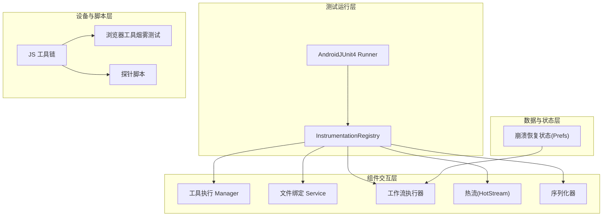
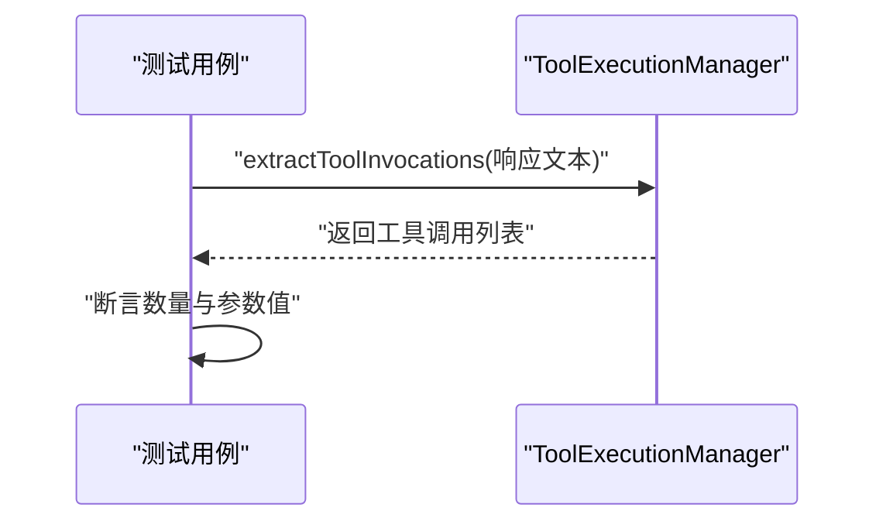
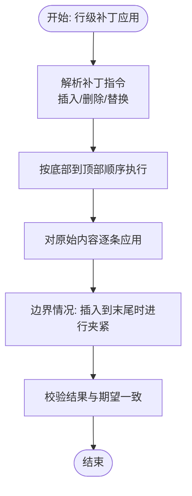
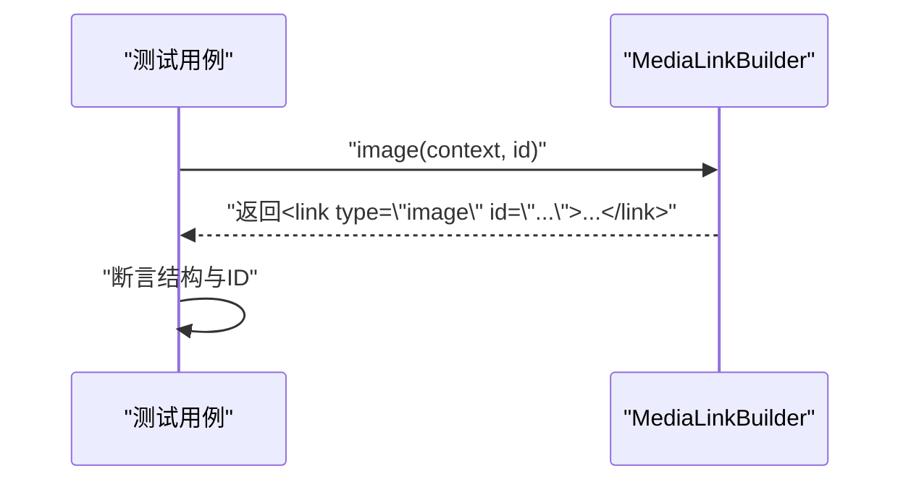
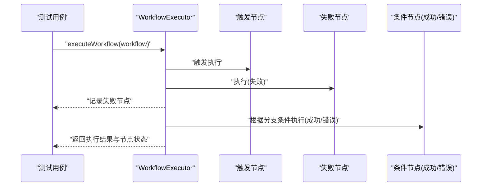
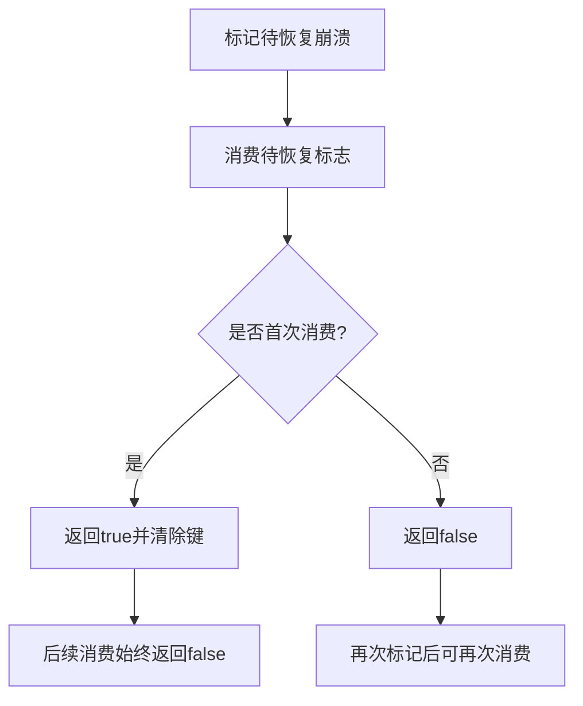
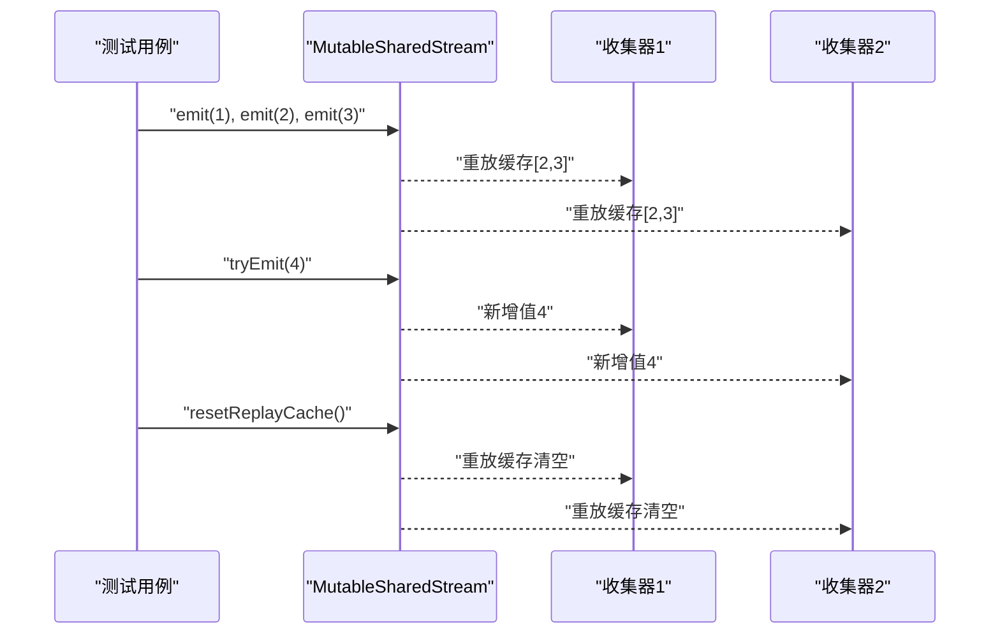
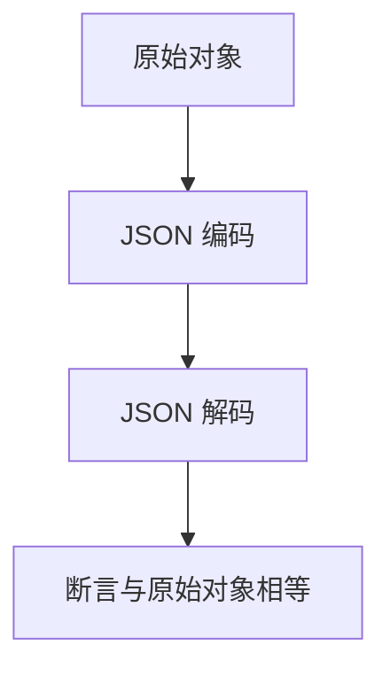
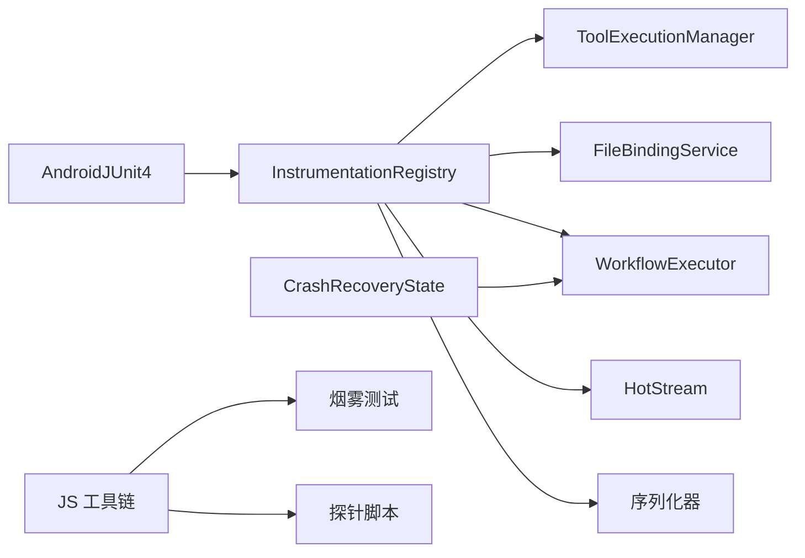

# 集成测试

<cite>
**本文引用的文件**
- [app/src/androidTest/java/com/ai/assistance/operit/ExampleInstrumentedTest.kt](file://app/src/androidTest/java/com/ai/assistance/operit/ExampleInstrumentedTest.kt)
- [app/src/androidTest/java/com/ai/assistance/operit/api/chat/enhance/ToolExecutionManagerTest.kt](file://app/src/androidTest/java/com/ai/assistance/operit/api/chat/enhance/ToolExecutionManagerTest.kt)
- [app/src/androidTest/java/com/ai/assistance/operit/api/chat/enhance/FileBindingServiceTest.kt](file://app/src/androidTest/java/com/ai/assistance/operit/api/chat/enhance/FileBindingServiceTest.kt)
- [app/src/androidTest/java/com/ai/assistance/operit/api/chat/llmprovider/MediaLinkBuilderAndroidTest.kt](file://app/src/androidTest/java/com/ai/assistance/operit/api/chat/llmprovider/MediaLinkBuilderAndroidTest.kt)
- [app/src/androidTest/java/com/ai/assistance/operit/core/workflow/WorkflowExecutorAndroidTest.kt](file://app/src/androidTest/java/com/ai/assistance/operit/core/workflow/WorkflowExecutorAndroidTest.kt)
- [app/src/androidTest/java/com/ai/assistance/operit/util/CrashRecoveryStateAndroidTest.kt](file://app/src/androidTest/java/com/ai/assistance/operit/util/CrashRecoveryStateAndroidTest.kt)
- [app/src/androidTest/java/com/ai/assistance/operit/util/stream/HotStreamAndroidTest.kt](file://app/src/androidTest/java/com/ai/assistance/operit/util/stream/HotStreamAndroidTest.kt)
- [app/src/androidTest/java/com/ai/assistance/operit/util/SerializerAndroidTest.kt](file://app/src/androidTest/java/com/ai/assistance/operit/util/SerializerAndroidTest.kt)
- [app/src/androidTest/java/com/ai/assistance/operit/util/SerializerRoundTripAndroidTest.kt](file://app/src/androidTest/java/com/ai/assistance/operit/util/SerializerRoundTripAndroidTest.kt)
- [app/src/androidTest/js/browser_tool_smoke.js](file://app/src/androidTest/js/browser_tool_smoke.js)
- [app/src/androidTest/js/browser_tool_suite_probe.js](file://app/src/androidTest/js/browser_tool_suite_probe.js)
</cite>

## 目录
1. [简介](#简介)
2. [项目结构](#项目结构)
3. [核心组件](#核心组件)
4. [架构总览](#架构总览)
5. [详细组件分析](#详细组件分析)
6. [依赖关系分析](#依赖关系分析)
7. [性能考量](#性能考量)
8. [故障排查指南](#故障排查指南)
9. [结论](#结论)
10. [附录](#附录)

## 简介
本文件面向开发者，系统性梳理 Operit 项目的集成测试体系与实践，覆盖 Android Instrumentation 测试框架、Espresso 配置与 UI 测试、设备测试、组件交互测试（服务绑定、广播接收器、后台服务）、API 接口测试（网络请求、响应验证、错误处理）、数据库集成测试（Room/ObjectBox 与数据迁移）、以及复杂场景测试（工具包执行、工作流调度、崩溃恢复）。文档以仓库中现有的 androidTest 代码为依据，提供可操作的测试设计思路、流程图与最佳实践。

## 项目结构
Operit 的集成测试主要位于 app 模块的 androidTest 目录，按功能域划分：
- api/chat：增强型工具与媒体链接构建器测试
- core/workflow：工作流执行器测试
- util：通用工具与序列化测试、热流测试、崩溃恢复状态测试
- js：浏览器工具烟雾测试与探针脚本（用于 JavaScript 工具链集成）

**图表来源**
- [app/src/androidTest/java/com/ai/assistance/operit/api/chat/enhance/ToolExecutionManagerTest.kt:1-35](file://app/src/androidTest/java/com/ai/assistance/operit/api/chat/enhance/ToolExecutionManagerTest.kt#L1-L35)
- [app/src/androidTest/java/com/ai/assistance/operit/api/chat/llmprovider/MediaLinkBuilderAndroidTest.kt:1-63](file://app/src/androidTest/java/com/ai/assistance/operit/api/chat/llmprovider/MediaLinkBuilderAndroidTest.kt#L1-L63)
- [app/src/androidTest/java/com/ai/assistance/operit/core/workflow/WorkflowExecutorAndroidTest.kt:1-130](file://app/src/androidTest/java/com/ai/assistance/operit/core/workflow/WorkflowExecutorAndroidTest.kt#L1-L130)
- [app/src/androidTest/java/com/ai/assistance/operit/util/stream/HotStreamAndroidTest.kt:1-376](file://app/src/androidTest/java/com/ai/assistance/operit/util/stream/HotStreamAndroidTest.kt#L1-L376)
- [app/src/androidTest/js/browser_tool_smoke.js](file://app/src/androidTest/js/browser_tool_smoke.js)

**章节来源**
- [app/src/androidTest/java/com/ai/assistance/operit/ExampleInstrumentedTest.kt:1-24](file://app/src/androidTest/java/com/ai/assistance/operit/ExampleInstrumentedTest.kt#L1-L24)

## 核心组件
- 工具执行与文件绑定测试：验证工具调用提取、行级补丁应用、边界与高复杂度混合操作、模糊替换稳健性、极端压力测试。
- 媒体链接构建器测试：验证不同媒体类型标记输出、ID 嵌入、XML 结构稳定性。
- 工作流执行器测试：验证节点失败不影响整体执行、错误分支 on_error 路径、成功分支 on_success 路径。
- 崩溃恢复状态测试：验证标记与消费、持久化、多上下文共享、重复标记与重复消费行为。
- 热流测试：验证 MutableSharedStream/MutableStateStream 的重放缓存、tryEmit、compareAndSet、EAGERLY/LAZILY 启动模式、多订阅者一致性。
- 序列化测试：验证 Uri、IntRange、LocalDateTime 的编解码与往返一致性。
- 浏览器工具烟雾测试与探针：验证浏览器工具链端到端执行与异常路径。

**章节来源**
- [app/src/androidTest/java/com/ai/assistance/operit/api/chat/enhance/ToolExecutionManagerTest.kt:1-35](file://app/src/androidTest/java/com/ai/assistance/operit/api/chat/enhance/ToolExecutionManagerTest.kt#L1-L35)
- [app/src/androidTest/java/com/ai/assistance/operit/api/chat/enhance/FileBindingServiceTest.kt:1-413](file://app/src/androidTest/java/com/ai/assistance/operit/api/chat/enhance/FileBindingServiceTest.kt#L1-L413)
- [app/src/androidTest/java/com/ai/assistance/operit/api/chat/llmprovider/MediaLinkBuilderAndroidTest.kt:1-63](file://app/src/androidTest/java/com/ai/assistance/operit/api/chat/llmprovider/MediaLinkBuilderAndroidTest.kt#L1-L63)
- [app/src/androidTest/java/com/ai/assistance/operit/core/workflow/WorkflowExecutorAndroidTest.kt:1-130](file://app/src/androidTest/java/com/ai/assistance/operit/core/workflow/WorkflowExecutorAndroidTest.kt#L1-L130)
- [app/src/androidTest/java/com/ai/assistance/operit/util/CrashRecoveryStateAndroidTest.kt:1-99](file://app/src/androidTest/java/com/ai/assistance/operit/util/CrashRecoveryStateAndroidTest.kt#L1-L99)
- [app/src/androidTest/java/com/ai/assistance/operit/util/stream/HotStreamAndroidTest.kt:1-376](file://app/src/androidTest/java/com/ai/assistance/operit/util/stream/HotStreamAndroidTest.kt#L1-L376)
- [app/src/androidTest/java/com/ai/assistance/operit/util/SerializerAndroidTest.kt:1-73](file://app/src/androidTest/java/com/ai/assistance/operit/util/SerializerAndroidTest.kt#L1-L73)
- [app/src/androidTest/java/com/ai/assistance/operit/util/SerializerRoundTripAndroidTest.kt:1-29](file://app/src/androidTest/java/com/ai/assistance/operit/util/SerializerRoundTripAndroidTest.kt#L1-L29)
- [app/src/androidTest/js/browser_tool_smoke.js](file://app/src/androidTest/js/browser_tool_smoke.js)
- [app/src/androidTest/js/browser_tool_suite_probe.js](file://app/src/androidTest/js/browser_tool_suite_probe.js)

## 架构总览
集成测试围绕以下层次展开：
- 测试运行层：AndroidJUnit4 Runner、InstrumentationRegistry 提供目标上下文
- 组件交互层：工具执行、文件绑定、工作流调度、热流与序列化
- 设备与脚本层：JS 工具链烟雾测试与探针
- 数据与状态层：偏好存储驱动的崩溃恢复状态

**图表来源**
- [app/src/androidTest/java/com/ai/assistance/operit/api/chat/enhance/ToolExecutionManagerTest.kt:1-35](file://app/src/androidTest/java/com/ai/assistance/operit/api/chat/enhance/ToolExecutionManagerTest.kt#L1-L35)
- [app/src/androidTest/java/com/ai/assistance/operit/api/chat/enhance/FileBindingServiceTest.kt:1-413](file://app/src/androidTest/java/com/ai/assistance/operit/api/chat/enhance/FileBindingServiceTest.kt#L1-L413)
- [app/src/androidTest/java/com/ai/assistance/operit/core/workflow/WorkflowExecutorAndroidTest.kt:1-130](file://app/src/androidTest/java/com/ai/assistance/operit/core/workflow/WorkflowExecutorAndroidTest.kt#L1-L130)
- [app/src/androidTest/java/com/ai/assistance/operit/util/stream/HotStreamAndroidTest.kt:1-376](file://app/src/androidTest/java/com/ai/assistance/operit/util/stream/HotStreamAndroidTest.kt#L1-L376)
- [app/src/androidTest/java/com/ai/assistance/operit/util/SerializerAndroidTest.kt:1-73](file://app/src/androidTest/java/com/ai/assistance/operit/util/SerializerAndroidTest.kt#L1-L73)
- [app/src/androidTest/java/com/ai/assistance/operit/util/CrashRecoveryStateAndroidTest.kt:1-99](file://app/src/androidTest/java/com/ai/assistance/operit/util/CrashRecoveryStateAndroidTest.kt#L1-L99)
- [app/src/androidTest/js/browser_tool_smoke.js](file://app/src/androidTest/js/browser_tool_smoke.js)
- [app/src/androidTest/js/browser_tool_suite_probe.js](file://app/src/androidTest/js/browser_tool_suite_probe.js)

## 详细组件分析

### 工具执行与文件绑定测试
- 工具执行：验证从大段文本中提取多个工具调用块，参数解析正确性。
- 文件绑定：通过反射访问私有方法，验证行级补丁（插入/删除/替换）组合操作；边界条件（首尾行）、仅插入、模糊替换稳健性、高复杂度混合操作、极端压力测试。

**图表来源**
- [app/src/androidTest/java/com/ai/assistance/operit/api/chat/enhance/ToolExecutionManagerTest.kt:13-33](file://app/src/androidTest/java/com/ai/assistance/operit/api/chat/enhance/ToolExecutionManagerTest.kt#L13-L33)

**图表来源**
- [app/src/androidTest/java/com/ai/assistance/operit/api/chat/enhance/FileBindingServiceTest.kt:34-37](file://app/src/androidTest/java/com/ai/assistance/operit/api/chat/enhance/FileBindingServiceTest.kt#L34-L37)
- [app/src/androidTest/java/com/ai/assistance/operit/api/chat/enhance/FileBindingServiceTest.kt:40-93](file://app/src/androidTest/java/com/ai/assistance/operit/api/chat/enhance/FileBindingServiceTest.kt#L40-L93)

**章节来源**
- [app/src/androidTest/java/com/ai/assistance/operit/api/chat/enhance/ToolExecutionManagerTest.kt:1-35](file://app/src/androidTest/java/com/ai/assistance/operit/api/chat/enhance/ToolExecutionManagerTest.kt#L1-L35)
- [app/src/androidTest/java/com/ai/assistance/operit/api/chat/enhance/FileBindingServiceTest.kt:1-413](file://app/src/androidTest/java/com/ai/assistance/operit/api/chat/enhance/FileBindingServiceTest.kt#L1-L413)

### 媒体链接构建器测试
- 验证图像/音频/视频三种类型的链接标记输出、ID 嵌入、XML 结构稳定性。

**图表来源**
- [app/src/androidTest/java/com/ai/assistance/operit/api/chat/llmprovider/MediaLinkBuilderAndroidTest.kt:15-28](file://app/src/androidTest/java/com/ai/assistance/operit/api/chat/llmprovider/MediaLinkBuilderAndroidTest.kt#L15-L28)

**章节来源**
- [app/src/androidTest/java/com/ai/assistance/operit/api/chat/llmprovider/MediaLinkBuilderAndroidTest.kt:1-63](file://app/src/androidTest/java/com/ai/assistance/operit/api/chat/llmprovider/MediaLinkBuilderAndroidTest.kt#L1-L63)

### 工作流执行器测试
- 节点失败不应阻断后续节点执行；on_error 分支在节点失败时应执行；on_success 分支在成功时执行。

**图表来源**
- [app/src/androidTest/java/com/ai/assistance/operit/core/workflow/WorkflowExecutorAndroidTest.kt:22-69](file://app/src/androidTest/java/com/ai/assistance/operit/core/workflow/WorkflowExecutorAndroidTest.kt#L22-L69)
- [app/src/androidTest/java/com/ai/assistance/operit/core/workflow/WorkflowExecutorAndroidTest.kt:71-128](file://app/src/androidTest/java/com/ai/assistance/operit/core/workflow/WorkflowExecutorAndroidTest.kt#L71-L128)

**章节来源**
- [app/src/androidTest/java/com/ai/assistance/operit/core/workflow/WorkflowExecutorAndroidTest.kt:1-130](file://app/src/androidTest/java/com/ai/assistance/operit/core/workflow/WorkflowExecutorAndroidTest.kt#L1-L130)

### 崩溃恢复状态测试
- 标记与消费、持久化、多上下文共享、重复标记与重复消费、键清理与保留。

**图表来源**
- [app/src/androidTest/java/com/ai/assistance/operit/util/CrashRecoveryStateAndroidTest.kt:26-45](file://app/src/androidTest/java/com/ai/assistance/operit/util/CrashRecoveryStateAndroidTest.kt#L26-L45)
- [app/src/androidTest/java/com/ai/assistance/operit/util/CrashRecoveryStateAndroidTest.kt:80-91](file://app/src/androidTest/java/com/ai/assistance/operit/util/CrashRecoveryStateAndroidTest.kt#L80-L91)

**章节来源**
- [app/src/androidTest/java/com/ai/assistance/operit/util/CrashRecoveryStateAndroidTest.kt:1-99](file://app/src/androidTest/java/com/ai/assistance/operit/util/CrashRecoveryStateAndroidTest.kt#L1-L99)

### 热流测试
- MutableSharedStream 重放缓存与 tryEmit；MutableStateStream compareAndSet；EAGERLY/LAZILY 启动模式；多订阅者一致性。

**图表来源**
- [app/src/androidTest/java/com/ai/assistance/operit/util/stream/HotStreamAndroidTest.kt:50-85](file://app/src/androidTest/java/com/ai/assistance/operit/util/stream/HotStreamAndroidTest.kt#L50-L85)
- [app/src/androidTest/java/com/ai/assistance/operit/util/stream/HotStreamAndroidTest.kt:326-375](file://app/src/androidTest/java/com/ai/assistance/operit/util/stream/HotStreamAndroidTest.kt#L326-L375)

**章节来源**
- [app/src/androidTest/java/com/ai/assistance/operit/util/stream/HotStreamAndroidTest.kt:1-376](file://app/src/androidTest/java/com/ai/assistance/operit/util/stream/HotStreamAndroidTest.kt#L1-L376)

### 序列化测试
- Uri、IntRange、LocalDateTime 的编解码与往返一致性。

**图表来源**
- [app/src/androidTest/java/com/ai/assistance/operit/util/SerializerAndroidTest.kt:15-32](file://app/src/androidTest/java/com/ai/assistance/operit/util/SerializerAndroidTest.kt#L15-L32)
- [app/src/androidTest/java/com/ai/assistance/operit/util/SerializerRoundTripAndroidTest.kt:14-27](file://app/src/androidTest/java/com/ai/assistance/operit/util/SerializerRoundTripAndroidTest.kt#L14-L27)

**章节来源**
- [app/src/androidTest/java/com/ai/assistance/operit/util/SerializerAndroidTest.kt:1-73](file://app/src/androidTest/java/com/ai/assistance/operit/util/SerializerAndroidTest.kt#L1-L73)
- [app/src/androidTest/java/com/ai/assistance/operit/util/SerializerRoundTripAndroidTest.kt:1-29](file://app/src/androidTest/java/com/ai/assistance/operit/util/SerializerRoundTripAndroidTest.kt#L1-L29)

### 浏览器工具烟雾测试与探针
- 验证浏览器工具链端到端执行与异常路径，使用探针脚本进行稳定性与健壮性评估。

**章节来源**
- [app/src/androidTest/js/browser_tool_smoke.js](file://app/src/androidTest/js/browser_tool_smoke.js)
- [app/src/androidTest/js/browser_tool_suite_probe.js](file://app/src/androidTest/js/browser_tool_suite_probe.js)

## 依赖关系分析
- 测试运行依赖 AndroidJUnit4 与 InstrumentationRegistry 获取目标上下文
- 工具执行与文件绑定测试依赖具体业务实现类
- 工作流测试依赖 Workflow/Node 数据模型与执行器
- 热流测试依赖 Kotlin Coroutines 与共享流 API
- 序列化测试依赖 kotlinx.serialization
- 崩溃恢复状态测试依赖 SharedPreferences
- JS 工具链测试依赖探针脚本与宿主桥接

**图表来源**
- [app/src/androidTest/java/com/ai/assistance/operit/ExampleInstrumentedTest.kt:17-23](file://app/src/androidTest/java/com/ai/assistance/operit/ExampleInstrumentedTest.kt#L17-L23)
- [app/src/androidTest/java/com/ai/assistance/operit/api/chat/enhance/ToolExecutionManagerTest.kt:1-35](file://app/src/androidTest/java/com/ai/assistance/operit/api/chat/enhance/ToolExecutionManagerTest.kt#L1-L35)
- [app/src/androidTest/java/com/ai/assistance/operit/api/chat/enhance/FileBindingServiceTest.kt:1-413](file://app/src/androidTest/java/com/ai/assistance/operit/api/chat/enhance/FileBindingServiceTest.kt#L1-L413)
- [app/src/androidTest/java/com/ai/assistance/operit/core/workflow/WorkflowExecutorAndroidTest.kt:1-130](file://app/src/androidTest/java/com/ai/assistance/operit/core/workflow/WorkflowExecutorAndroidTest.kt#L1-L130)
- [app/src/androidTest/java/com/ai/assistance/operit/util/stream/HotStreamAndroidTest.kt:1-376](file://app/src/androidTest/java/com/ai/assistance/operit/util/stream/HotStreamAndroidTest.kt#L1-L376)
- [app/src/androidTest/java/com/ai/assistance/operit/util/SerializerAndroidTest.kt:1-73](file://app/src/androidTest/java/com/ai/assistance/operit/util/SerializerAndroidTest.kt#L1-L73)
- [app/src/androidTest/java/com/ai/assistance/operit/util/CrashRecoveryStateAndroidTest.kt:1-99](file://app/src/androidTest/java/com/ai/assistance/operit/util/CrashRecoveryStateAndroidTest.kt#L1-L99)
- [app/src/androidTest/js/browser_tool_smoke.js](file://app/src/androidTest/js/browser_tool_smoke.js)
- [app/src/androidTest/js/browser_tool_suite_probe.js](file://app/src/androidTest/js/browser_tool_suite_probe.js)

**章节来源**
- [app/src/androidTest/java/com/ai/assistance/operit/ExampleInstrumentedTest.kt:1-24](file://app/src/androidTest/java/com/ai/assistance/operit/ExampleInstrumentedTest.kt#L1-L24)

## 性能考量
- 协程与超时控制：热流测试广泛使用 withTimeout 与延迟，避免无限等待；建议在真实设备上适当放宽超时阈值。
- 多订阅者与重放缓存：合理设置 replay 与缓冲容量，平衡内存占用与实时性。
- I/O 与 UI 线程：避免在主线程执行耗时任务，使用 Dispatchers.IO 与 SupervisorJob 管理子任务生命周期。
- 网络与脚本：JS 工具链测试需考虑网络波动与脚本执行时间，采用探针脚本进行压力与稳定性评估。

## 故障排查指南
- 崩溃恢复状态
  - 现象：重复消费返回 true
  - 排查：确认标记与消费逻辑、键是否存在、上下文是否一致
  - 参考：[CrashRecoveryStateAndroidTest.kt:93-97](file://app/src/androidTest/java/com/ai/assistance/operit/util/CrashRecoveryStateAndroidTest.kt#L93-L97)
- 工作流分支
  - 现象：on_error 分支未执行
  - 排查：检查连接条件、节点状态、执行回调
  - 参考：[WorkflowExecutorAndroidTest.kt:119-127](file://app/src/androidTest/java/com/ai/assistance/operit/core/workflow/WorkflowExecutorAndroidTest.kt#L119-L127)
- 热流重放
  - 现象：新订阅者未收到重放值
  - 排查：确认 replay 缓存大小、启动模式、发射时机
  - 参考：[HotStreamAndroidTest.kt:164-182](file://app/src/androidTest/java/com/ai/assistance/operit/util/stream/HotStreamAndroidTest.kt#L164-L182)
- 序列化往返
  - 现象：URI/日期时间解析不一致
  - 排查：核对编码格式、空值处理、精度保留
  - 参考：[SerializerAndroidTest.kt:15-32](file://app/src/androidTest/java/com/ai/assistance/operit/util/SerializerAndroidTest.kt#L15-L32), [SerializerRoundTripAndroidTest.kt:14-27](file://app/src/androidTest/java/com/ai/assistance/operit/util/SerializerRoundTripAndroidTest.kt#L14-L27)

**章节来源**
- [app/src/androidTest/java/com/ai/assistance/operit/util/CrashRecoveryStateAndroidTest.kt:1-99](file://app/src/androidTest/java/com/ai/assistance/operit/util/CrashRecoveryStateAndroidTest.kt#L1-L99)
- [app/src/androidTest/java/com/ai/assistance/operit/core/workflow/WorkflowExecutorAndroidTest.kt:1-130](file://app/src/androidTest/java/com/ai/assistance/operit/core/workflow/WorkflowExecutorAndroidTest.kt#L1-L130)
- [app/src/androidTest/java/com/ai/assistance/operit/util/stream/HotStreamAndroidTest.kt:1-376](file://app/src/androidTest/java/com/ai/assistance/operit/util/stream/HotStreamAndroidTest.kt#L1-L376)
- [app/src/androidTest/java/com/ai/assistance/operit/util/SerializerAndroidTest.kt:1-73](file://app/src/androidTest/java/com/ai/assistance/operit/util/SerializerAndroidTest.kt#L1-L73)
- [app/src/androidTest/java/com/ai/assistance/operit/util/SerializerRoundTripAndroidTest.kt:1-29](file://app/src/androidTest/java/com/ai/assistance/operit/util/SerializerRoundTripAndroidTest.kt#L1-L29)

## 结论
Operit 的集成测试以 androidTest 为核心，覆盖工具链、工作流、热流、序列化与崩溃恢复等关键模块，并通过 JS 探针脚本保障浏览器工具链的稳定性。建议在持续集成中引入设备矩阵与压力测试，完善网络与权限相关场景，同时保持测试用例的可读性与可维护性。

## 附录
- 测试环境配置要点
  - 使用 AndroidJUnit4 Runner 与 InstrumentationRegistry 获取目标上下文
  - 对于协程密集型测试，合理设置超时与调度器
  - 对于 UI 相关场景，结合 Espresso 进行 UI 测试（如存在）
- 测试设备管理
  - 建议在 CI 中使用多种分辨率与 API 级别设备矩阵
  - 对于脚本链路测试，准备稳定的网络与代理环境
- 测试数据清理
  - 崩溃恢复状态测试中显式清理偏好存储键
  - 工作流测试中确保节点状态与连接在每次测试前可重置