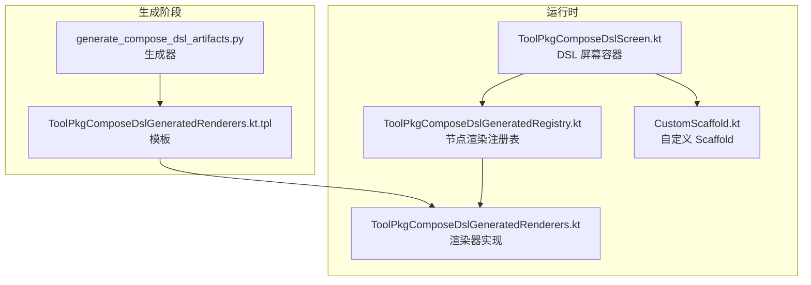
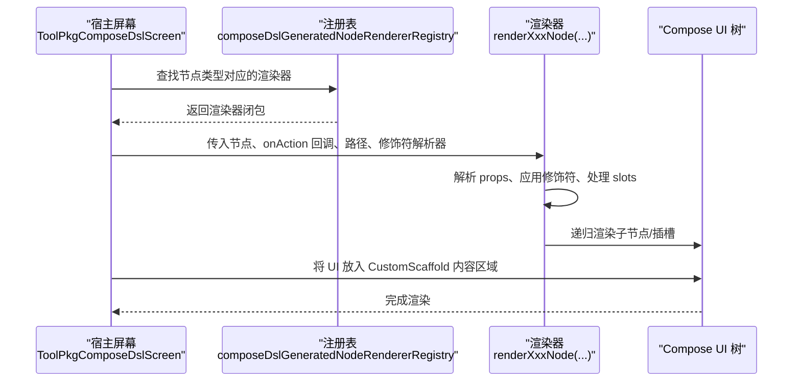
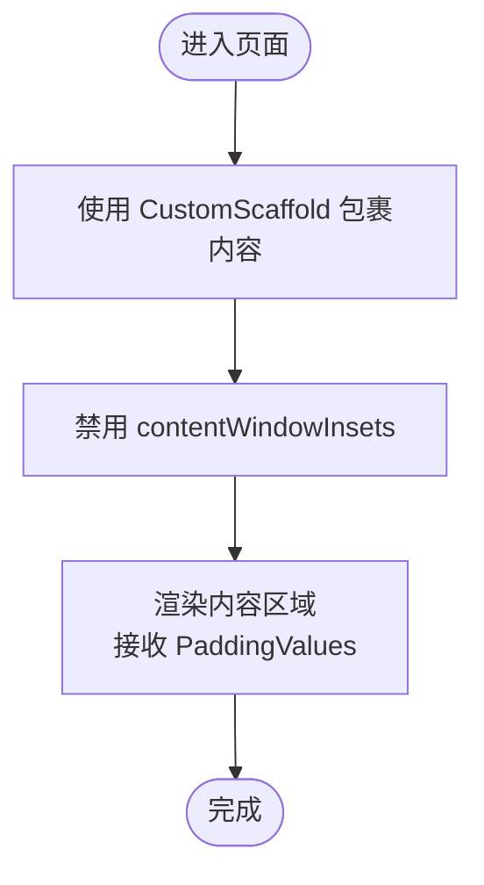
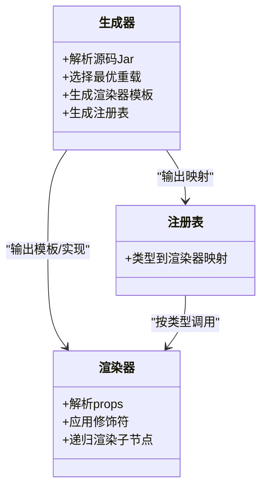
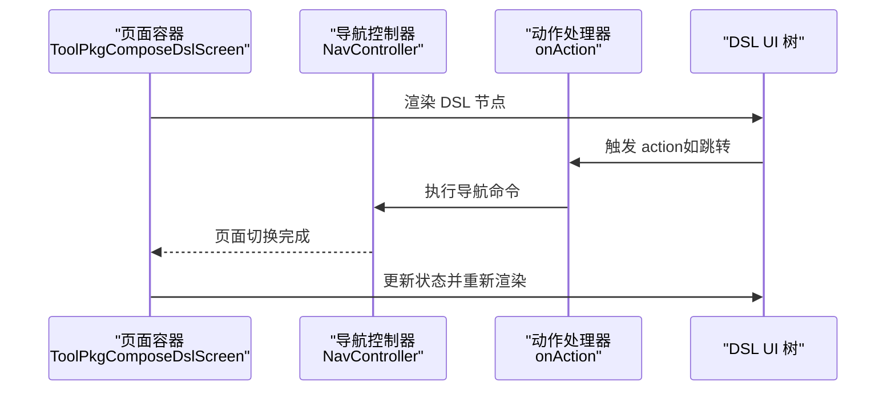
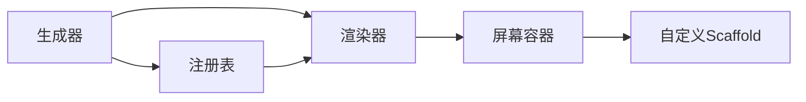

# Jetpack Compose 组件

<cite>
**本文引用的文件**
- [generate_compose_dsl_artifacts.py](file://tools/compose_dsl/generate_compose_dsl_artifacts.py)
- [README.md](file://tools/compose_dsl/README.md)
- [ToolPkgComposeDslGeneratedRenderers.kt.tpl](file://tools/compose_dsl/templates/ToolPkgComposeDslGeneratedRenderers.kt.tpl)
- [ToolPkgComposeDslGeneratedRenderers.kt](file://app/src/main/java/com/ai/assistance/operit/ui/common/composedsl/ToolPkgComposeDslGeneratedRenderers.kt)
- [ToolPkgComposeDslGeneratedRegistry.kt](file://app/src/main/java/com/ai/assistance/operit/ui/common/composedsl/ToolPkgComposeDslGeneratedRegistry.kt)
- [ToolPkgComposeDslScreen.kt](file://app/src/main/java/com/ai/assistance/operit/ui/common/composedsl/ToolPkgComposeDslScreen.kt)
- [CustomScaffold.kt](file://app/src/main/java/com/ai/assistance/operit/ui/components/CustomScaffold.kt)
</cite>

## 目录
1. [简介](#简介)
2. [项目结构](#项目结构)
3. [核心组件](#核心组件)
4. [架构总览](#架构总览)
5. [详细组件分析](#详细组件分析)
6. [依赖关系分析](#依赖关系分析)
7. [性能考量](#性能考量)
8. [故障排查指南](#故障排查指南)
9. [结论](#结论)
10. [附录](#附录)

## 简介
本文件面向 UI 开发者，系统性梳理 Operit 的 Jetpack Compose 组件体系，重点围绕以下目标展开：
- 深入解析自定义 Scaffold 组件的设计理念与实现细节（布局结构、导航集成、状态管理）
- 总结 Compose DSL 的生成与使用方法（声明式 UI 构建、状态提升、副作用处理）
- 阐述组件间通信机制（回调函数、共享状态、事件总线）
- 提供可复用组件开发范式、性能优化策略与复杂交互处理建议
- 给出测试策略、调试技巧与最佳实践

## 项目结构
Operit 在 Compose 方向的关键资产由“代码生成器 + 渲染器 + 注册表 + 屏幕容器”构成：
- 代码生成器：从 Compose Material3/Foundation 源码 Jar 中解析 @Composable 函数签名，生成 TypeScript 与 Kotlin 的绑定与渲染器
- 渲染器：将 DSL 节点树渲染为实际的 Compose UI 树，并内置通用修饰符解析与作用域适配
- 注册表：将节点类型映射到具体渲染器
- 屏幕容器：承载 DSL 渲染结果并注入导航、主题、状态等上下文

**图表来源**
- [generate_compose_dsl_artifacts.py:35-55](file://tools/compose_dsl/generate_compose_dsl_artifacts.py#L35-L55)
- [ToolPkgComposeDslGeneratedRenderers.kt.tpl:1-252](file://tools/compose_dsl/templates/ToolPkgComposeDslGeneratedRenderers.kt.tpl#L1-L252)
- [ToolPkgComposeDslGeneratedRegistry.kt:7-91](file://app/src/main/java/com/ai/assistance/operit/ui/common/composedsl/ToolPkgComposeDslGeneratedRegistry.kt#L7-L91)
- [ToolPkgComposeDslGeneratedRenderers.kt:1-200](file://app/src/main/java/com/ai/assistance/operit/ui/common/composedsl/ToolPkgComposeDslGeneratedRenderers.kt#L1-L200)
- [ToolPkgComposeDslScreen.kt:154-155](file://app/src/main/java/com/ai/assistance/operit/ui/common/composedsl/ToolPkgComposeDslScreen.kt#L154-L155)
- [CustomScaffold.kt:10-38](file://app/src/main/java/com/ai/assistance/operit/ui/components/CustomScaffold.kt#L10-L38)

**章节来源**
- [README.md:1-27](file://tools/compose_dsl/README.md#L1-L27)
- [generate_compose_dsl_artifacts.py:35-55](file://tools/compose_dsl/generate_compose_dsl_artifacts.py#L35-L55)

## 核心组件
- 自定义 Scaffold（CustomScaffold）：在标准 Scaffold 基础上禁用 contentWindowInsets，避免系统栏重复边距导致的布局异常；同时保留顶部/底部导航、悬浮按钮、消息提示等能力
- Compose DSL 渲染器与注册表：通过注册表将节点类型映射到渲染器，渲染器负责参数解析、修饰符应用、子节点递归渲染
- DSL 屏幕容器（ToolPkgComposeDslScreen）：承载 DSL 渲染结果，提供导航、主题、状态、WebView 集成、事件桥接等能力

**章节来源**
- [CustomScaffold.kt:10-38](file://app/src/main/java/com/ai/assistance/operit/ui/components/CustomScaffold.kt#L10-L38)
- [ToolPkgComposeDslGeneratedRegistry.kt:7-91](file://app/src/main/java/com/ai/assistance/operit/ui/common/composedsl/ToolPkgComposeDslGeneratedRegistry.kt#L7-L91)
- [ToolPkgComposeDslGeneratedRenderers.kt:1-200](file://app/src/main/java/com/ai/assistance/operit/ui/common/composedsl/ToolPkgComposeDslGeneratedRenderers.kt#L1-L200)
- [ToolPkgComposeDslScreen.kt:154-155](file://app/src/main/java/com/ai/assistance/operit/ui/common/composedsl/ToolPkgComposeDslScreen.kt#L154-L155)

## 架构总览
下图展示了从 DSL 节点到最终 UI 的渲染链路，以及与自定义 Scaffold 的集成方式。

**图表来源**
- [ToolPkgComposeDslGeneratedRegistry.kt:7-91](file://app/src/main/java/com/ai/assistance/operit/ui/common/composedsl/ToolPkgComposeDslGeneratedRegistry.kt#L7-L91)
- [ToolPkgComposeDslGeneratedRenderers.kt:125-155](file://app/src/main/java/com/ai/assistance/operit/ui/common/composedsl/ToolPkgComposeDslGeneratedRenderers.kt#L125-L155)
- [ToolPkgComposeDslScreen.kt:154-155](file://app/src/main/java/com/ai/assistance/operit/ui/common/composedsl/ToolPkgComposeDslScreen.kt#L154-L155)

## 详细组件分析

### 自定义 Scaffold 设计与实现
- 设计目标
  - 解决系统栏（状态栏/导航栏）与内容内边距叠加导致的视觉偏移
  - 保持与 Material3 Scaffold 的一致 API，便于替换与迁移
- 关键实现
  - 通过禁用 contentWindowInsets，确保内容不被额外 inset 影响
  - 保留 topBar/bottomBar/snackbarHost/fab 等标准插槽，统一布局语义
- 使用场景
  - 所有基于 DSL 的页面均应包裹在 CustomScaffold 中，保证全局一致的内边距策略

**图表来源**
- [CustomScaffold.kt:10-38](file://app/src/main/java/com/ai/assistance/operit/ui/components/CustomScaffold.kt#L10-L38)

**章节来源**
- [CustomScaffold.kt:10-38](file://app/src/main/java/com/ai/assistance/operit/ui/components/CustomScaffold.kt#L10-L38)

### Compose DSL 生成器与渲染器
- 生成器职责
  - 从 Gradle 缓存中的 Compose Material3/Foundation 源码 Jar 中解析 @Composable 函数签名
  - 选择最优重载、映射参数类型到 TS/Kotlin 可用的属性模型
  - 生成渲染器模板与注册表条目
- 渲染器职责
  - 将节点 props 解析为 Compose 参数
  - 应用通用修饰符解析器（支持 Row/Column/Box 作用域下的权重、对齐等）
  - 递归渲染 children 与 slots
- 注册表职责
  - 将节点类型字符串映射到对应渲染器闭包，支持自动发现与专用渲染器共存

**图表来源**
- [generate_compose_dsl_artifacts.py:35-55](file://tools/compose_dsl/generate_compose_dsl_artifacts.py#L35-L55)
- [ToolPkgComposeDslGeneratedRenderers.kt.tpl:1-252](file://tools/compose_dsl/templates/ToolPkgComposeDslGeneratedRenderers.kt.tpl#L1-L252)
- [ToolPkgComposeDslGeneratedRegistry.kt:7-91](file://app/src/main/java/com/ai/assistance/operit/ui/common/composedsl/ToolPkgComposeDslGeneratedRegistry.kt#L7-L91)

**章节来源**
- [generate_compose_dsl_artifacts.py:266-286](file://tools/compose_dsl/generate_compose_dsl_artifacts.py#L266-L286)
- [ToolPkgComposeDslGeneratedRenderers.kt.tpl:54-123](file://tools/compose_dsl/templates/ToolPkgComposeDslGeneratedRenderers.kt.tpl#L54-L123)
- [ToolPkgComposeDslGeneratedRegistry.kt:7-91](file://app/src/main/java/com/ai/assistance/operit/ui/common/composedsl/ToolPkgComposeDslGeneratedRegistry.kt#L7-L91)

### DSL 屏幕容器与导航集成
- 屏幕容器职责
  - 接收 DSL 渲染结果，将其放入 CustomScaffold
  - 提供导航、主题、状态、WebView 集成、JS 桥接等能力
- 导航集成
  - 通过 NavController 与路由约定进行页面跳转
  - 与 ToolPkgComposeDslScreen 协作，将 DSL 节点中的 action 映射为导航动作
- 状态管理
  - 使用 remember、mutableStateOf、LaunchedEffect 等管理局部状态与副作用
  - 通过 CompositionLocal 或参数传递实现跨层级共享状态

**图表来源**
- [ToolPkgComposeDslScreen.kt:154-155](file://app/src/main/java/com/ai/assistance/operit/ui/common/composedsl/ToolPkgComposeDslScreen.kt#L154-L155)

**章节来源**
- [ToolPkgComposeDslScreen.kt:1-200](file://app/src/main/java/com/ai/assistance/operit/ui/common/composedsl/ToolPkgComposeDslScreen.kt#L1-L200)

### 组件封装、属性传递与事件处理
- 组件封装
  - 将常用布局组合（如 Row/Column/Box）与 Material3 组件封装为更高层的节点类型
  - 通过 props 统一配置外观与行为，隐藏内部实现细节
- 属性传递
  - 采用“props → 解析 → 参数”的单向数据流
  - 对于复杂属性（如颜色、排版、对齐），提供类型安全的映射
- 事件处理
  - 将 onXxx 回调转换为 action ID，由 onAction 统一调度
  - 通过 LaunchedEffect/SideEffect 处理副作用（如网络请求、日志上报）

**章节来源**
- [ToolPkgComposeDslGeneratedRenderers.kt.tpl:289-384](file://tools/compose_dsl/templates/ToolPkgComposeDslGeneratedRenderers.kt.tpl#L289-L384)
- [ToolPkgComposeDslGeneratedRenderers.kt:125-155](file://app/src/main/java/com/ai/assistance/operit/ui/common/composedsl/ToolPkgComposeDslGeneratedRenderers.kt#L125-L155)

### 组件间通信机制
- 回调函数
  - 通过 onAction 将节点事件上抛至宿主，再由宿主决定下一步（导航、弹窗、刷新）
- 共享状态
  - 使用 remember、rememberSaveable 存储页面级状态
  - 使用 CompositionLocal 提供跨层级共享（如主题、软键盘模式）
- 事件总线
  - 通过 onAction 与宿主协作实现轻量事件分发
  - 对于高频事件，建议结合协程与 Mutex 控制并发

**章节来源**
- [ToolPkgComposeDslScreen.kt:154-160](file://app/src/main/java/com/ai/assistance/operit/ui/common/composedsl/ToolPkgComposeDslScreen.kt#L154-L160)

### 复杂交互与性能优化示例
- 复杂交互
  - 列表滚动 + 悬浮按钮联动：在 DSL 中通过 LazyColumn + FloatingActionButton 组合，利用 rememberLazyListState 与滚动状态同步
  - 动态内容更新：通过 props 变化触发重渲染，必要时使用 key 保证稳定重建
- 性能优化
  - 合理拆分 Composable，避免不必要的重组
  - 使用 remember、derivedStateOf 降低计算成本
  - 对图片/WebView 等重资源使用懒加载与缓存策略

**章节来源**
- [ToolPkgComposeDslGeneratedRenderers.kt:19-21](file://app/src/main/java/com/ai/assistance/operit/ui/common/composedsl/ToolPkgComposeDslGeneratedRenderers.kt#L19-L21)

## 依赖关系分析
- 生成器依赖 Gradle 缓存中的 Compose Material3/Foundation 源码 Jar
- 渲染器依赖注册表提供的类型映射
- 屏幕容器依赖渲染器与自定义 Scaffold
- DSL 节点通过 onAction 与宿主解耦

**图表来源**
- [generate_compose_dsl_artifacts.py:73-86](file://tools/compose_dsl/generate_compose_dsl_artifacts.py#L73-L86)
- [ToolPkgComposeDslGeneratedRegistry.kt:7-91](file://app/src/main/java/com/ai/assistance/operit/ui/common/composedsl/ToolPkgComposeDslGeneratedRegistry.kt#L7-L91)
- [ToolPkgComposeDslGeneratedRenderers.kt:1-200](file://app/src/main/java/com/ai/assistance/operit/ui/common/composedsl/ToolPkgComposeDslGeneratedRenderers.kt#L1-L200)
- [ToolPkgComposeDslScreen.kt:154-155](file://app/src/main/java/com/ai/assistance/operit/ui/common/composedsl/ToolPkgComposeDslScreen.kt#L154-L155)

**章节来源**
- [README.md:12-27](file://tools/compose_dsl/README.md#L12-L27)

## 性能考量
- 重组控制
  - 将大块 UI 拆分为多个 @Composable，减少无关重组范围
  - 使用 remember、derivedStateOf 缓存昂贵计算
- 列表与滚动
  - 使用 LazyColumn/LazyRow 并提供稳定的 key
  - 避免在列表项中创建新的 lambda/对象
- 图片与 WebView
  - 图片使用 Coil 等库进行异步加载与缓存
  - WebView 按需初始化，避免频繁销毁重建
- 副作用管理
  - 将副作用集中在 LaunchedEffect/SideEffect 中，避免在 recomposition 过程中执行
  - 对网络请求与 IO 使用 Dispatchers.IO 与协程取消机制

## 故障排查指南
- DSL 无法渲染或报错
  - 检查生成器是否成功解析源码 Jar（确认 Gradle 缓存路径存在）
  - 核对节点类型是否在注册表中，或是否需要手动添加专用渲染器
- 布局异常（边距/对齐问题）
  - 确认使用 CustomScaffold 并未被外层容器再次 inset
  - 检查 props 是否正确映射（如对齐、权重、padding）
- 事件无响应
  - 确认 onAction 回调已正确传入渲染器
  - 检查 action ID 是否与宿主逻辑匹配
- WebView/导航问题
  - 检查 ToolPkgComposeDslScreen 中的 WebView 配置与权限
  - 确认 NavController 已正确初始化并处理路由

**章节来源**
- [README.md:18-27](file://tools/compose_dsl/README.md#L18-L27)
- [ToolPkgComposeDslGeneratedRegistry.kt:7-91](file://app/src/main/java/com/ai/assistance/operit/ui/common/composedsl/ToolPkgComposeDslGeneratedRegistry.kt#L7-L91)
- [ToolPkgComposeDslScreen.kt:1-200](file://app/src/main/java/com/ai/assistance/operit/ui/common/composedsl/ToolPkgComposeDslScreen.kt#L1-L200)

## 结论
Operit 的 Compose 组件体系通过“生成器 + 渲染器 + 注册表 + 屏幕容器 + 自定义 Scaffold”的组合，实现了从 DSL 到 UI 的高可靠映射与一致的布局体验。开发者可基于该框架快速构建可复用、可维护的 UI 组件，并通过状态提升与事件总线实现清晰的组件间通信。配合性能优化与完善的故障排查流程，可在复杂业务场景中稳定交付高质量界面。

## 附录
- 快速开始
  - 运行生成器脚本，生成渲染器与注册表
  - 在页面中使用 CustomScaffold 包裹 DSL 渲染结果
  - 通过 onAction 实现导航与交互
- 最佳实践
  - 优先使用 Material3 组件与样式主题
  - 将复杂交互抽象为 DSL 节点，保持 UI 与逻辑分离
  - 对关键路径进行性能监控与回归测试