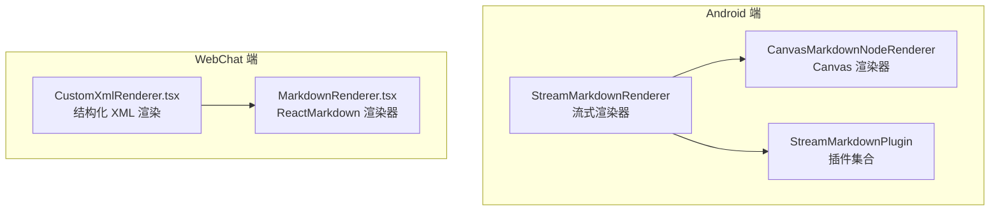
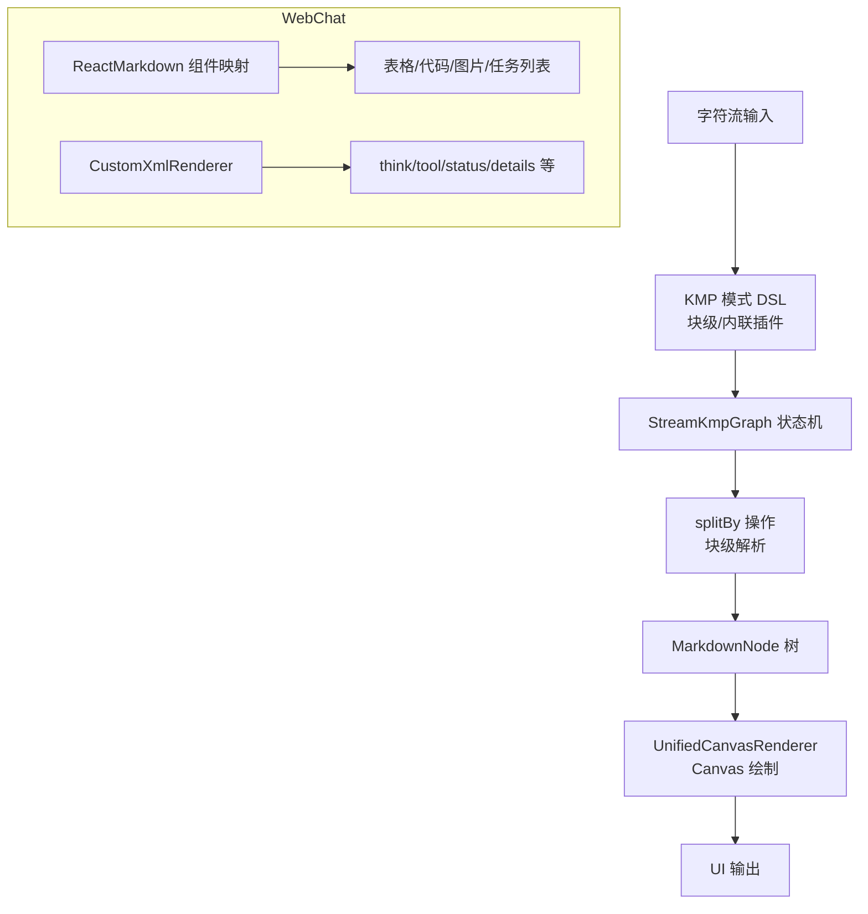
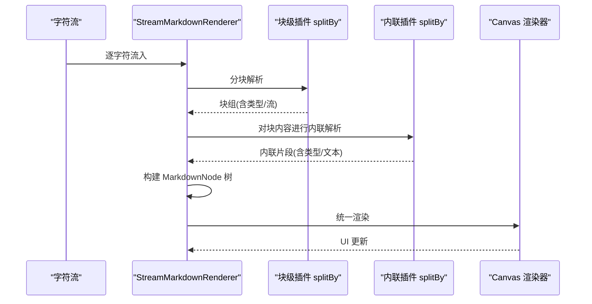
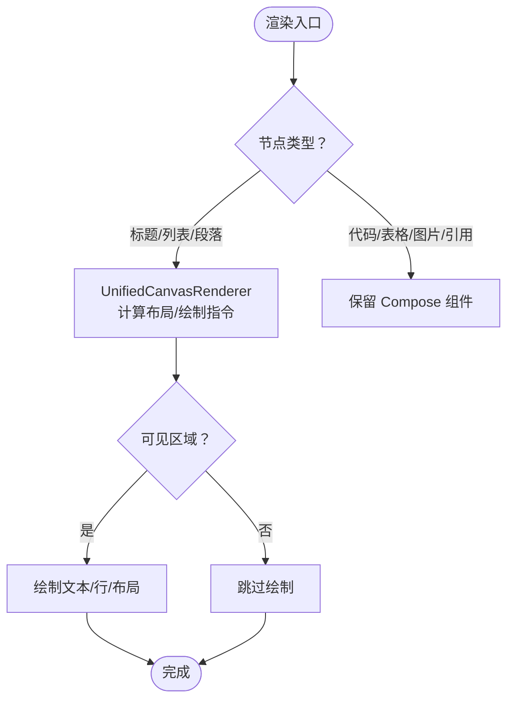
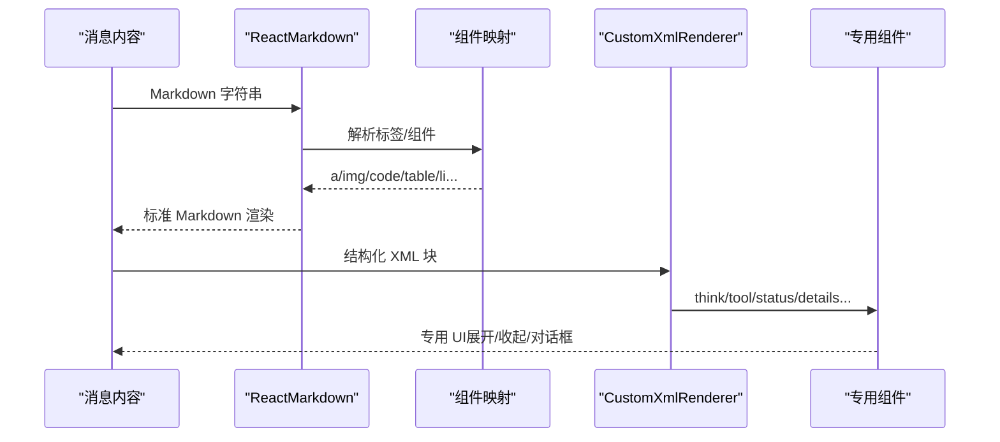
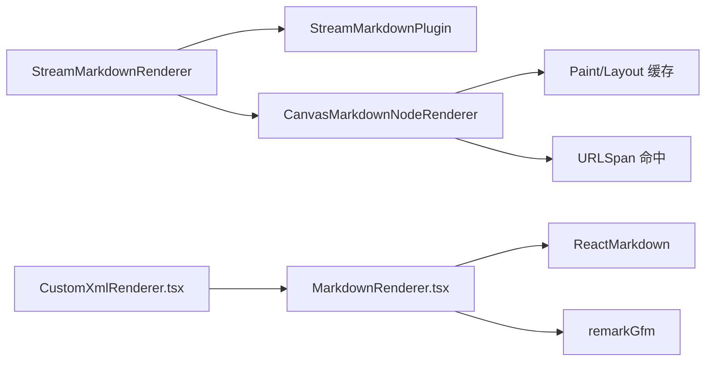

# Markdown 渲染引擎

<cite>
**本文档引用的文件**
- [RENDERER_ARCH.md](file://docs/RENDERER_ARCH.md)
- [StreamMarkdownRenderer.kt](file://app/src/main/java/com/ai/assistance/operit/ui/common/markdown/StreamMarkdownRenderer.kt)
- [CanvasMarkdownNodeRenderer.kt](file://app/src/main/java/com/ai/assistance/operit/ui/common/markdown/CanvasMarkdownNodeRenderer.kt)
- [StreamMarkdownPlugin.kt](file://app/src/main/java/com/ai/assistance/operit/util/stream/plugins/StreamMarkdownPlugin.kt)
- [MarkdownRenderer.tsx](file://web-chat/src/ui/features/chat/components/part/MarkdownRenderer.tsx)
- [CustomXmlRenderer.tsx](file://web-chat/src/ui/features/chat/components/part/CustomXmlRenderer.tsx)
</cite>

## 目录
1. [简介](#简介)
2. [项目结构](#项目结构)
3. [核心组件](#核心组件)
4. [架构总览](#架构总览)
5. [详细组件分析](#详细组件分析)
6. [依赖关系分析](#依赖关系分析)
7. [性能考量](#性能考量)
8. [故障排查指南](#故障排查指南)
9. [结论](#结论)
10. [附录](#附录)

## 简介
本文件为 Operit 的 Markdown 渲染引擎技术文档，覆盖从语法解析、节点构建、渲染规则匹配，到富文本与交互元素支持、性能优化与扩展机制的完整体系。文档同时给出前端 WebChat 的 Markdown 渲染实现与扩展思路，帮助开发者在 Android 与 Web 双端高效使用与扩展渲染能力。

## 项目结构
Operit 的 Markdown 渲染由两条主线构成：
- Android 端：基于 Kotlin 的高性能流式渲染引擎，采用 KMP 算法与插件化架构，支持增量渲染与 UI 动画。
- WebChat 端：基于 React + ReactMarkdown 的渲染管线，支持自定义组件映射与结构化 XML 渲染。

**图表来源**
- [StreamMarkdownRenderer.kt:355-611](file://app/src/main/java/com/ai/assistance/operit/ui/common/markdown/StreamMarkdownRenderer.kt#L355-L611)
- [CanvasMarkdownNodeRenderer.kt:413-753](file://app/src/main/java/com/ai/assistance/operit/ui/common/markdown/CanvasMarkdownNodeRenderer.kt#L413-L753)
- [StreamMarkdownPlugin.kt:1-1510](file://app/src/main/java/com/ai/assistance/operit/util/stream/plugins/StreamMarkdownPlugin.kt#L1-L1510)
- [MarkdownRenderer.tsx:127-145](file://web-chat/src/ui/features/chat/components/part/MarkdownRenderer.tsx#L127-L145)
- [CustomXmlRenderer.tsx:409-475](file://web-chat/src/ui/features/chat/components/part/CustomXmlRenderer.tsx#L409-L475)

**章节来源**
- [RENDERER_ARCH.md:1-154](file://docs/RENDERER_ARCH.md#L1-L154)
- [StreamMarkdownRenderer.kt:355-611](file://app/src/main/java/com/ai/assistance/operit/ui/common/markdown/StreamMarkdownRenderer.kt#L355-L611)
- [CanvasMarkdownNodeRenderer.kt:413-753](file://app/src/main/java/com/ai/assistance/operit/ui/common/markdown/CanvasMarkdownNodeRenderer.kt#L413-L753)
- [StreamMarkdownPlugin.kt:1-1510](file://app/src/main/java/com/ai/assistance/operit/util/stream/plugins/StreamMarkdownPlugin.kt#L1-L1510)
- [MarkdownRenderer.tsx:127-145](file://web-chat/src/ui/features/chat/components/part/MarkdownRenderer.tsx#L127-L145)
- [CustomXmlRenderer.tsx:409-475](file://web-chat/src/ui/features/chat/components/part/CustomXmlRenderer.tsx#L409-L475)

## 核心组件
- 流式渲染器（Android）：接收字符流，分块与内联解析，构建 MarkdownNode 树，统一交由 Canvas 渲染器绘制。
- Canvas 渲染器（Android）：针对标题、段落、列表等简单文本使用单一 Canvas 绘制，复杂组件（代码块、表格、LaTeX、图片）保留 Compose 组件，兼顾性能与可维护性。
- 插件系统（Android）：以 KMP 状态机为核心，提供粗体、斜体、链接、图片、代码块、表格、列表、水平线、删除线、下划线、行内/块级 LaTeX 等插件。
- React 渲染器（WebChat）：基于 ReactMarkdown 的组件映射，支持表格、代码块、图片、任务列表等；自定义 XML 渲染器支持 think、tool、status、details 等结构化标签。

**章节来源**
- [StreamMarkdownRenderer.kt:355-611](file://app/src/main/java/com/ai/assistance/operit/ui/common/markdown/StreamMarkdownRenderer.kt#L355-L611)
- [CanvasMarkdownNodeRenderer.kt:413-753](file://app/src/main/java/com/ai/assistance/operit/ui/common/markdown/CanvasMarkdownNodeRenderer.kt#L413-L753)
- [StreamMarkdownPlugin.kt:1-1510](file://app/src/main/java/com/ai/assistance/operit/util/stream/plugins/StreamMarkdownPlugin.kt#L1-L1510)
- [MarkdownRenderer.tsx:103-125](file://web-chat/src/ui/features/chat/components/part/MarkdownRenderer.tsx#L103-L125)
- [CustomXmlRenderer.tsx:334-407](file://web-chat/src/ui/features/chat/components/part/CustomXmlRenderer.tsx#L334-L407)

## 架构总览
Android 端采用“两阶段嵌套解析 + KMP 插件化”的架构，先块级后内联，保证复杂嵌套语法的正确识别；WebChat 端采用 ReactMarkdown 的组件映射与结构化 XML 渲染扩展。

**图表来源**
- [RENDERER_ARCH.md:50-154](file://docs/RENDERER_ARCH.md#L50-L154)
- [StreamMarkdownRenderer.kt:426-569](file://app/src/main/java/com/ai/assistance/operit/ui/common/markdown/StreamMarkdownRenderer.kt#L426-L569)
- [CanvasMarkdownNodeRenderer.kt:759-1100](file://app/src/main/java/com/ai/assistance/operit/ui/common/markdown/CanvasMarkdownNodeRenderer.kt#L759-L1100)
- [MarkdownRenderer.tsx:103-145](file://web-chat/src/ui/features/chat/components/part/MarkdownRenderer.tsx#L103-L145)
- [CustomXmlRenderer.tsx:334-407](file://web-chat/src/ui/features/chat/components/part/CustomXmlRenderer.tsx#L334-L407)

## 详细组件分析

### Android：流式渲染器（StreamMarkdownRenderer）
- 输入：字符流或完整字符串，支持静态与流式两种渲染模式。
- 处理：块级 splitBy（标题、列表、代码块、水平线等）→ 内联 splitBy（粗体、斜体、链接、图片、删除线、下划线、LaTeX 等）。
- 节点树：MarkdownNode 列表，支持 HTML_BREAK、水平线、代码块、表格、XML_BLOCK 等类型。
- 同步与缓存：BatchNodeUpdater 批量更新，LruCache 缓存解析结果，避免重复计算。
- 动画与可见性：淡入动画、打字机效果、仅在可见区域绘制。

**图表来源**
- [StreamMarkdownRenderer.kt:426-589](file://app/src/main/java/com/ai/assistance/operit/ui/common/markdown/StreamMarkdownRenderer.kt#L426-L589)
- [CanvasMarkdownNodeRenderer.kt:413-753](file://app/src/main/java/com/ai/assistance/operit/ui/common/markdown/CanvasMarkdownNodeRenderer.kt#L413-L753)

**章节来源**
- [StreamMarkdownRenderer.kt:355-611](file://app/src/main/java/com/ai/assistance/operit/ui/common/markdown/StreamMarkdownRenderer.kt#L355-L611)
- [StreamMarkdownRenderer.kt:662-800](file://app/src/main/java/com/ai/assistance/operit/ui/common/markdown/StreamMarkdownRenderer.kt#L662-L800)
- [StreamMarkdownRenderer.kt:800-1207](file://app/src/main/java/com/ai/assistance/operit/ui/common/markdown/StreamMarkdownRenderer.kt#L800-L1207)

### Android：Canvas 渲染器（UnifiedCanvasRenderer）
- 性能优化：Paint/TextPaint/Layer 缓存、Layout 缓存、仅可见区域绘制、延迟测量降级回退。
- 文本绘制：标题、有序/无序列表、段落等走单一 Canvas，复杂组件（代码块、表格、LaTeX、图片、引用块）保留 Compose 组件。
- 交互：Canvas 手势命中 URLSpan，触发 onLinkClick 回调。
- 动画：打字机效果 Typewriter，按行/字符渐显，支持部分字符淡入。

**图表来源**
- [CanvasMarkdownNodeRenderer.kt:759-1100](file://app/src/main/java/com/ai/assistance/operit/ui/common/markdown/CanvasMarkdownNodeRenderer.kt#L759-L1100)
- [CanvasMarkdownNodeRenderer.kt:1127-1478](file://app/src/main/java/com/ai/assistance/operit/ui/common/markdown/CanvasMarkdownNodeRenderer.kt#L1127-L1478)

**章节来源**
- [CanvasMarkdownNodeRenderer.kt:413-753](file://app/src/main/java/com/ai/assistance/operit/ui/common/markdown/CanvasMarkdownNodeRenderer.kt#L413-L753)
- [CanvasMarkdownNodeRenderer.kt:800-1599](file://app/src/main/java/com/ai/assistance/operit/ui/common/markdown/CanvasMarkdownNodeRenderer.kt#L800-L1599)

### Android：插件系统（StreamMarkdownPlugin）
- 插件职责：识别特定 Markdown 语法，返回匹配结果与捕获组，参与 splitBy 流式分组。
- 核心插件：粗体、斜体、链接、图片、代码块（含围栏/行内）、表格、有序/无序列表、水平线、删除线、下划线、行内/块级 LaTeX。
- 顺序规则：重叠分隔符（如 ** 与 *）需按“长模式优先”排列，避免误判。

```mermaid
classDiagram
class StreamPlugin {
+state : PluginState
+processChar(c, atStartOfLine) : Boolean
+initPlugin() : Boolean
+destroy() : void
+reset() : void
}
class StreamMarkdownBoldPlugin
class StreamMarkdownItalicPlugin
class StreamMarkdownLinkPlugin
class StreamMarkdownImagePlugin
class StreamMarkdownFencedCodeBlockPlugin
class StreamMarkdownTablePlugin
class StreamMarkdownOrderedListPlugin
class StreamMarkdownUnorderedListPlugin
class StreamMarkdownHorizontalRulePlugin
class StreamMarkdownStrikethroughPlugin
class StreamMarkdownUnderlinePlugin
class StreamMarkdownInlineLaTeXPlugin
class StreamMarkdownBlockLaTeXPlugin
StreamMarkdownBoldPlugin --> StreamPlugin
StreamMarkdownItalicPlugin --> StreamPlugin
StreamMarkdownLinkPlugin --> StreamPlugin
StreamMarkdownImagePlugin --> StreamPlugin
StreamMarkdownFencedCodeBlockPlugin --> StreamPlugin
StreamMarkdownTablePlugin --> StreamPlugin
StreamMarkdownOrderedListPlugin --> StreamPlugin
StreamMarkdownUnorderedListPlugin --> StreamPlugin
StreamMarkdownHorizontalRulePlugin --> StreamPlugin
StreamMarkdownStrikethroughPlugin --> StreamPlugin
StreamMarkdownUnderlinePlugin --> StreamPlugin
StreamMarkdownInlineLaTeXPlugin --> StreamPlugin
StreamMarkdownBlockLaTeXPlugin --> StreamPlugin
```

**图表来源**
- [StreamMarkdownPlugin.kt:1-1510](file://app/src/main/java/com/ai/assistance/operit/util/stream/plugins/StreamMarkdownPlugin.kt#L1-L1510)

**章节来源**
- [StreamMarkdownPlugin.kt:1-800](file://app/src/main/java/com/ai/assistance/operit/util/stream/plugins/StreamMarkdownPlugin.kt#L1-L800)
- [StreamMarkdownPlugin.kt:800-1510](file://app/src/main/java/com/ai/assistance/operit/util/stream/plugins/StreamMarkdownPlugin.kt#L800-L1510)

### WebChat：React 渲染器与结构化 XML
- ReactMarkdown 组件映射：支持表格、代码块、图片、任务列表、引用块、分隔线等。
- 自定义 XML 渲染：内置 think、tool、status、details 等标签的专用组件，支持展开/收起、错误弹窗、工具调用分组等。
- 代码高亮与行号：提供代码块渲染与行号显示组件。

**图表来源**
- [MarkdownRenderer.tsx:103-145](file://web-chat/src/ui/features/chat/components/part/MarkdownRenderer.tsx#L103-L145)
- [CustomXmlRenderer.tsx:334-407](file://web-chat/src/ui/features/chat/components/part/CustomXmlRenderer.tsx#L334-L407)

**章节来源**
- [MarkdownRenderer.tsx:60-145](file://web-chat/src/ui/features/chat/components/part/MarkdownRenderer.tsx#L60-L145)
- [CustomXmlRenderer.tsx:1-476](file://web-chat/src/ui/features/chat/components/part/CustomXmlRenderer.tsx#L1-L476)

## 依赖关系分析
- Android 端：StreamMarkdownRenderer 依赖插件系统与 Canvas 渲染器；插件基于 KMP 状态机；渲染器依赖 LruCache 与协程进行批处理与缓存。
- WebChat 端：MarkdownRenderer 依赖 ReactMarkdown 与 remarkGfm；CustomXmlRenderer 依赖 MarkdownRenderer 与专用组件。

**图表来源**
- [StreamMarkdownRenderer.kt:355-611](file://app/src/main/java/com/ai/assistance/operit/ui/common/markdown/StreamMarkdownRenderer.kt#L355-L611)
- [CanvasMarkdownNodeRenderer.kt:176-335](file://app/src/main/java/com/ai/assistance/operit/ui/common/markdown/CanvasMarkdownNodeRenderer.kt#L176-L335)
- [MarkdownRenderer.tsx:127-145](file://web-chat/src/ui/features/chat/components/part/MarkdownRenderer.tsx#L127-L145)
- [CustomXmlRenderer.tsx:409-475](file://web-chat/src/ui/features/chat/components/part/CustomXmlRenderer.tsx#L409-L475)

**章节来源**
- [StreamMarkdownRenderer.kt:613-660](file://app/src/main/java/com/ai/assistance/operit/ui/common/markdown/StreamMarkdownRenderer.kt#L613-L660)
- [CanvasMarkdownNodeRenderer.kt:176-335](file://app/src/main/java/com/ai/assistance/operit/ui/common/markdown/CanvasMarkdownNodeRenderer.kt#L176-L335)
- [MarkdownRenderer.tsx:127-145](file://web-chat/src/ui/features/chat/components/part/MarkdownRenderer.tsx#L127-L145)
- [CustomXmlRenderer.tsx:409-475](file://web-chat/src/ui/features/chat/components/part/CustomXmlRenderer.tsx#L409-L475)

## 性能考量
- 流式与批处理：通过 BatchNodeUpdater 将频繁更新合并为批次，降低重组成本；渲染间隔固定，避免过度刷新。
- 缓存策略：Paint/TextPaint/Layer 与 Layout 的 LruCache，静态内容解析结果缓存，减少重复计算。
- 可见性优化：仅在可见区域绘制，避免全量重绘；对超大内容限制最大高度，防止 UI 卡顿。
- UI 线程优化：Canvas 绘制替代大量 Compose 组件，减少重组；打字机动画按行/字符渐显，避免全量重绘。
- 内存管理：节点树稳定化转换、LRU 缓存上限估算、字符串与节点字节估算，避免内存膨胀。

**章节来源**
- [StreamMarkdownRenderer.kt:76-80](file://app/src/main/java/com/ai/assistance/operit/ui/common/markdown/StreamMarkdownRenderer.kt#L76-L80)
- [StreamMarkdownRenderer.kt:613-660](file://app/src/main/java/com/ai/assistance/operit/ui/common/markdown/StreamMarkdownRenderer.kt#L613-L660)
- [CanvasMarkdownNodeRenderer.kt:176-335](file://app/src/main/java/com/ai/assistance/operit/ui/common/markdown/CanvasMarkdownNodeRenderer.kt#L176-L335)
- [CanvasMarkdownNodeRenderer.kt:898-901](file://app/src/main/java/com/ai/assistance/operit/ui/common/markdown/CanvasMarkdownNodeRenderer.kt#L898-L901)

## 故障排查指南
- 渲染异常：流式渲染器在 finally 中同步节点树，确保最终一致性；异常被捕获并记录日志，避免 UI 闪退。
- LaTeX 渲染失败：Canvas 中对 JLatexMathDrawable 渲染失败进行回退，显示原文本，保证稳定性。
- 链接点击：Canvas 渲染器通过 URLSpan 命中点击区域，触发 onLinkClick；若未命中则忽略。
- 结构化 XML：CustomXmlRenderer 对 think、tool、status、details 等标签进行专用渲染，隐藏 meta/mood 等元信息标签。

**章节来源**
- [StreamMarkdownRenderer.kt:570-589](file://app/src/main/java/com/ai/assistance/operit/ui/common/markdown/StreamMarkdownRenderer.kt#L570-L589)
- [CanvasMarkdownNodeRenderer.kt:708-736](file://app/src/main/java/com/ai/assistance/operit/ui/common/markdown/CanvasMarkdownNodeRenderer.kt#L708-L736)
- [CanvasMarkdownNodeRenderer.kt:944-977](file://app/src/main/java/com/ai/assistance/operit/ui/common/markdown/CanvasMarkdownNodeRenderer.kt#L944-L977)
- [CustomXmlRenderer.tsx:334-407](file://web-chat/src/ui/features/chat/components/part/CustomXmlRenderer.tsx#L334-L407)

## 结论
Operit 的 Markdown 渲染引擎在 Android 端以 KMP 插件化与 Canvas 渲染为核心，实现高性能、低内存、可动画的流式渲染；在 WebChat 端以 ReactMarkdown 与结构化 XML 渲染为基础，提供灵活的扩展能力。整体架构清晰、可维护性强，适合在大型聊天与工具链场景中稳定运行。

## 附录

### 自定义渲染扩展指南
- Android（新增插件）：实现 StreamPlugin 接口，使用 kmpPattern DSL 定义状态机，注意“长模式优先”顺序；在 splitBy 中注册插件。
- Android（自定义 XML 渲染）：实现 XmlContentRenderer 接口，通过 DefaultXmlRenderer 的方式扩展卡片式渲染。
- WebChat（自定义组件映射）：在 ReactMarkdown 的 components 映射中增加自定义组件，或在 CustomXmlRenderer 中新增标签分支。
- 富文本与多媒体：LaTeX 使用 JLatexMathDrawable 渲染；图片与代码块分别采用 Compose 组件与代码高亮组件；表格采用增强表格组件。

**章节来源**
- [StreamMarkdownPlugin.kt:1-1510](file://app/src/main/java/com/ai/assistance/operit/util/stream/plugins/StreamMarkdownPlugin.kt#L1-L1510)
- [StreamMarkdownRenderer.kt:227-302](file://app/src/main/java/com/ai/assistance/operit/ui/common/markdown/StreamMarkdownRenderer.kt#L227-L302)
- [CanvasMarkdownNodeRenderer.kt:675-737](file://app/src/main/java/com/ai/assistance/operit/ui/common/markdown/CanvasMarkdownNodeRenderer.kt#L675-L737)
- [MarkdownRenderer.tsx:103-125](file://web-chat/src/ui/features/chat/components/part/MarkdownRenderer.tsx#L103-L125)
- [CustomXmlRenderer.tsx:334-407](file://web-chat/src/ui/features/chat/components/part/CustomXmlRenderer.tsx#L334-L407)