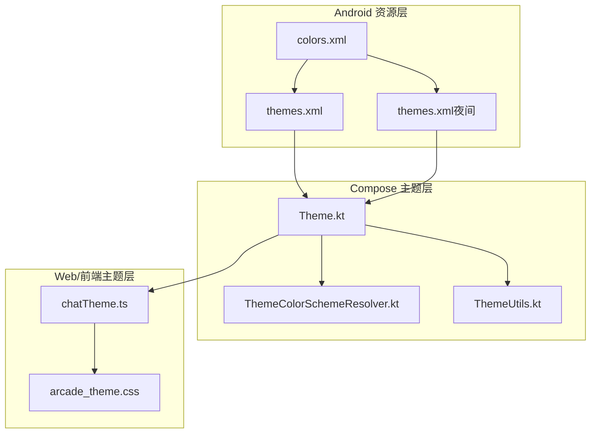
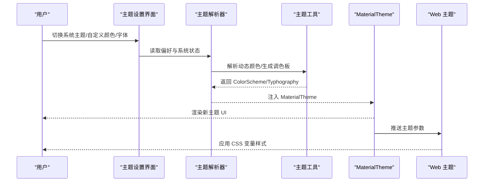
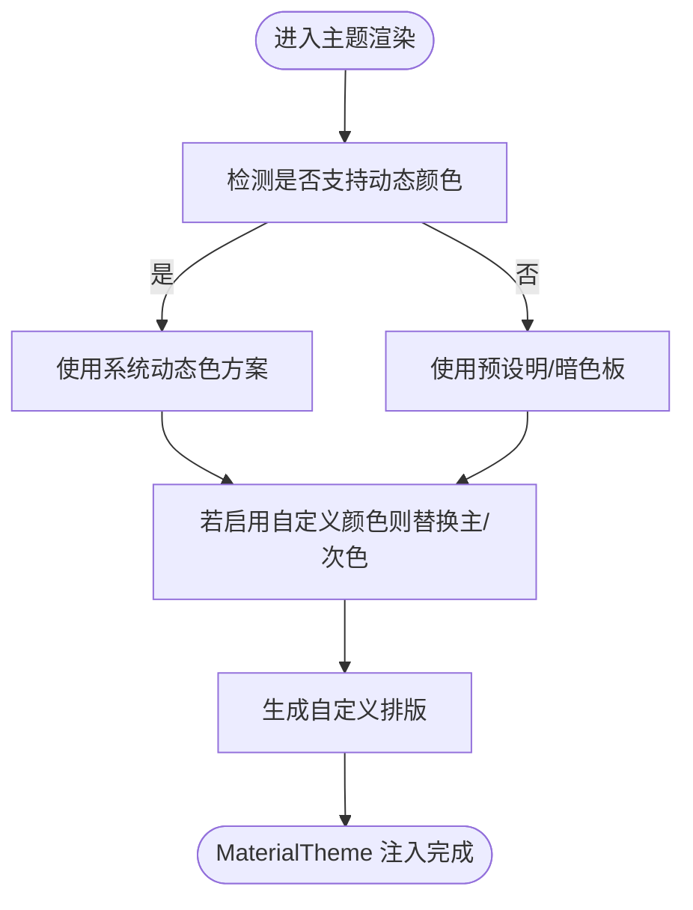
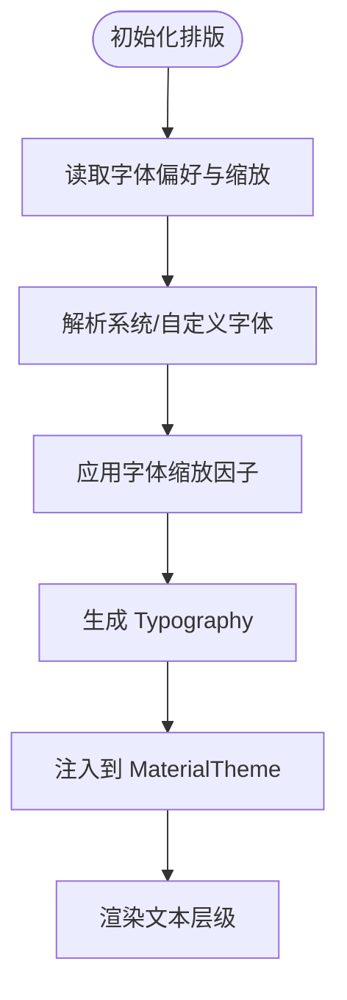
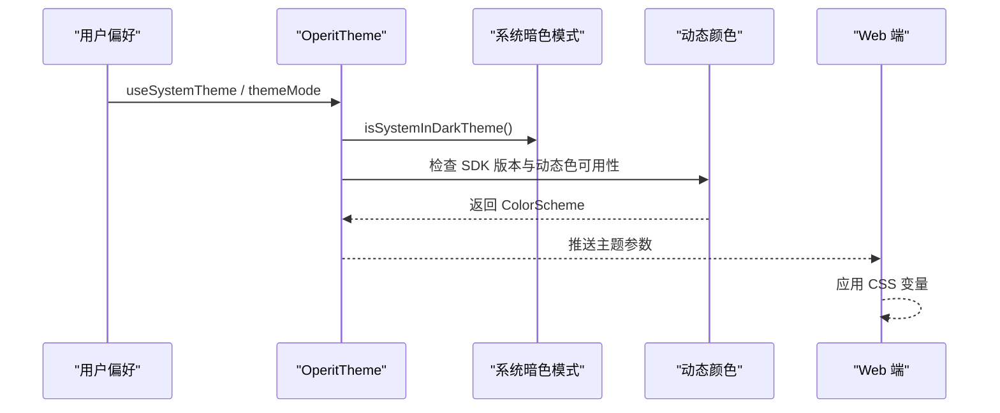
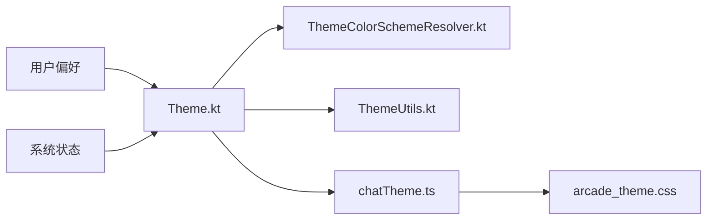

# 主题系统

<cite>
**本文引用的文件**
- [colors.xml](file://app/src/main/res/values/colors.xml)
- [themes.xml](file://app/src/main/res/values/themes.xml)
- [themes.xml（夜间）](file://app/src/main/res/values-night/themes.xml)
- [Theme.kt](file://app/src/main/java/com/ai/assistance/operit/ui/theme/Theme.kt)
- [ThemeColorSchemeResolver.kt](file://app/src/main/java/com/ai/assistance/operit/ui/theme/ThemeColorSchemeResolver.kt)
- [ThemeUtils.kt](file://app/src/main/java/com/ai/assistance/operit/ui/theme/ThemeUtils.kt)
- [ThemeSettingsScreen.kt](file://app/src/main/java/com/ai/assistance/operit/ui/features/settings/screens/ThemeSettingsScreen.kt)
- [ThemeSettingsColorSection.kt](file://app/src/main/java/com/ai/assistance/operit/ui/features/settings/sections/ThemeSettingsColorSection.kt)
- [ThemeSettingsFontAvatarSections.kt](file://app/src/main/java/com/ai/assistance/operit/ui/features/settings/sections/ThemeSettingsFontAvatarSections.kt)
- [chatTheme.ts](file://web-chat/src/ui/features/chat/util/chatTheme.ts)
- [arcade_theme.css](file://examples/dino_runner/resources/webview/arcade_theme.css)
</cite>

## 目录
1. [简介](#简介)
2. [项目结构](#项目结构)
3. [核心组件](#核心组件)
4. [架构总览](#架构总览)
5. [详细组件分析](#详细组件分析)
6. [依赖关系分析](#依赖关系分析)
7. [性能考量](#性能考量)
8. [故障排查指南](#故障排查指南)
9. [结论](#结论)
10. [附录](#附录)

## 简介
本文件为 Operit 的主题系统提供全面技术文档，覆盖颜色体系、字体管理、主题切换机制、样式规范、主题配置实现、定制指南、兼容性与性能优化等。内容面向设计师与开发者，既提供高层概览，也给出代码级定位与可视化图示，帮助快速理解与扩展。

## 项目结构
Operit 的主题系统由三部分构成：
- Android 资源层：颜色与基础主题（values/values-night）
- Compose 主题层：动态颜色、自定义排版与主题注入
- Web/前端主题层：CSS 变量与运行时主题映射

图表来源
- [colors.xml:1-10](file://app/src/main/res/values/colors.xml#L1-L10)
- [themes.xml:1-18](file://app/src/main/res/values/themes.xml#L1-L18)
- [themes.xml（夜间）:1-19](file://app/src/main/res/values-night/themes.xml#L1-L19)
- [Theme.kt:396-457](file://app/src/main/java/com/ai/assistance/operit/ui/theme/Theme.kt#L396-L457)
- [chatTheme.ts:127-227](file://web-chat/src/ui/features/chat/util/chatTheme.ts#L127-L227)
- [arcade_theme.css:1-37](file://examples/dino_runner/resources/webview/arcade_theme.css#L1-L37)

章节来源
- [colors.xml:1-10](file://app/src/main/res/values/colors.xml#L1-L10)
- [themes.xml:1-18](file://app/src/main/res/values/themes.xml#L1-L18)
- [themes.xml（夜间）:1-19](file://app/src/main/res/values-night/themes.xml#L1-L19)

## 核心组件
- 颜色资源与基础主题：通过 values 与 values-night 定义主色、次色、前景色与状态栏等基础属性，作为 Android 系统级主题入口。
- Compose 动态主题：在 Theme.kt 中根据系统主题、偏好与动态颜色能力生成最终 ColorScheme，并结合自定义 Typography 注入到 MaterialTheme。
- 设置界面与主题参数：ThemeSettingsScreen 与各 Section 提供主题开关、颜色与字体设置入口；ThemeColorSchemeResolver/ThemeUtils 提供解析与工具方法。
- Web/前端主题：chatTheme.ts 将后端主题配置映射为 CSS 变量，arcade_theme.css 展示了基于 CSS 变量的页面样式组织方式。

章节来源
- [Theme.kt:396-457](file://app/src/main/java/com/ai/assistance/operit/ui/theme/Theme.kt#L396-L457)
- [ThemeSettingsScreen.kt](file://app/src/main/java/com/ai/assistance/operit/ui/features/settings/screens/ThemeSettingsScreen.kt)
- [ThemeSettingsColorSection.kt](file://app/src/main/java/com/ai/assistance/operit/ui/features/settings/sections/ThemeSettingsColorSection.kt)
- [ThemeSettingsFontAvatarSections.kt](file://app/src/main/java/com/ai/assistance/operit/ui/features/settings/sections/ThemeSettingsFontAvatarSections.kt)
- [chatTheme.ts:127-227](file://web-chat/src/ui/features/chat/util/chatTheme.ts#L127-L227)

## 架构总览
Operit 的主题系统采用“资源层 + Compose 主题层 + Web 主题层”的分层设计，确保跨平台一致性与可扩展性。

图表来源
- [Theme.kt:396-457](file://app/src/main/java/com/ai/assistance/operit/ui/theme/Theme.kt#L396-L457)
- [ThemeColorSchemeResolver.kt](file://app/src/main/java/com/ai/assistance/operit/ui/theme/ThemeColorSchemeResolver.kt)
- [ThemeUtils.kt](file://app/src/main/java/com/ai/assistance/operit/ui/theme/ThemeUtils.kt)
- [chatTheme.ts:127-227](file://web-chat/src/ui/features/chat/util/chatTheme.ts#L127-L227)

## 详细组件分析

### 颜色体系设计
- 资源层颜色：定义主色、次色与黑白色板，供 Android 主题与 Compose 动态颜色回退使用。
- 明/暗两套主题：values 与 values-night 分别声明 colorPrimary、colorOnPrimary、colorSecondary、colorOnSecondary、statusBarColor 等属性，确保系统暗色模式下视觉一致。
- 动态颜色：在 Android 12+ 条件下优先使用系统动态色，否则回退至预设 Light/Dark ColorScheme。
- 自定义颜色：当启用自定义颜色时，按当前明/暗模式生成新的主色/次色与对应 onColor，保证可读性与对比度。

图表来源
- [Theme.kt:417-437](file://app/src/main/java/com/ai/assistance/operit/ui/theme/Theme.kt#L417-L437)
- [themes.xml:3-11](file://app/src/main/res/values/themes.xml#L3-L11)
- [themes.xml（夜间）:3-11](file://app/src/main/res/values-night/themes.xml#L3-L11)

章节来源
- [colors.xml:1-10](file://app/src/main/res/values/colors.xml#L1-L10)
- [themes.xml:1-18](file://app/src/main/res/values/themes.xml#L1-L18)
- [themes.xml（夜间）:1-19](file://app/src/main/res/values-night/themes.xml#L1-L19)
- [Theme.kt:417-437](file://app/src/main/java/com/ai/assistance/operit/ui/theme/Theme.kt#L417-L437)

### 字体管理系统
- 字体族与字号层级：通过 createCustomTypography 统一生成排版，支持系统字体、自定义字体文件路径与字体缩放因子。
- 行高与字重：排版中包含标题、正文、标注等层级的字体度量，确保信息层级清晰。
- Web 对齐：chatTheme.ts 将主题字体家族与缩放映射为 CSS 变量，保持移动端与网页端一致的阅读体验。

图表来源
- [Theme.kt:439-442](file://app/src/main/java/com/ai/assistance/operit/ui/theme/Theme.kt#L439-L442)
- [chatTheme.ts:217-218](file://web-chat/src/ui/features/chat/util/chatTheme.ts#L217-L218)

章节来源
- [Theme.kt:439-442](file://app/src/main/java/com/ai/assistance/operit/ui/theme/Theme.kt#L439-L442)
- [chatTheme.ts:217-218](file://web-chat/src/ui/features/chat/util/chatTheme.ts#L217-L218)

### 主题切换机制
- 系统主题跟随：当开启“跟随系统”时，以系统暗色模式为准；否则使用用户手动选择的明/暗模式。
- 动态主题更新：偏好变更时，重新计算 ColorScheme 与 Typography 并触发重组。
- Web 同步：MaterialTheme 的主题参数同步到 Web 端，通过 CSS 变量即时生效。

图表来源
- [Theme.kt:405-411](file://app/src/main/java/com/ai/assistance/operit/ui/theme/Theme.kt#L405-L411)
- [chatTheme.ts:127-149](file://web-chat/src/ui/features/chat/util/chatTheme.ts#L127-L149)

章节来源
- [Theme.kt:405-411](file://app/src/main/java/com/ai/assistance/operit/ui/theme/Theme.kt#L405-L411)
- [chatTheme.ts:127-149](file://web-chat/src/ui/features/chat/util/chatTheme.ts#L127-L149)

### 样式规范制定
- 间距系统：通过 Compose 的 PaddingValues 与内边距/外边距统一管理，避免硬编码值。
- 圆角规范：按钮、卡片、头像等组件使用 RoundedCornerShape 或特定半径，保持视觉一致性。
- 阴影效果：Material3 默认阴影策略与 elevation 结合使用，Web 端通过 CSS 变量映射阴影颜色。
- 动画曲线：Material3 内置动画插值与过渡，Web 端通过 CSS 过渡与变量控制动画时长与缓动。

章节来源
- [chatTheme.ts:203-227](file://web-chat/src/ui/features/chat/util/chatTheme.ts#L203-L227)

### 主题配置实现
- 主题参数传递：ThemeSettingsScreen 与各 Section 负责收集用户输入，写入偏好存储。
- 样式继承：ThemeColorSchemeResolver 依据明/暗模式与动态颜色能力生成 ColorScheme；ThemeUtils 提供颜色对比度与可读性工具。
- 条件样式应用：根据主题模式与偏好，决定是否启用动态颜色、自定义颜色或默认色板。

章节来源
- [ThemeSettingsScreen.kt](file://app/src/main/java/com/ai/assistance/operit/ui/features/settings/screens/ThemeSettingsScreen.kt)
- [ThemeSettingsColorSection.kt](file://app/src/main/java/com/ai/assistance/operit/ui/features/settings/sections/ThemeSettingsColorSection.kt)
- [ThemeColorSchemeResolver.kt](file://app/src/main/java/com/ai/assistance/operit/ui/theme/ThemeColorSchemeResolver.kt)
- [ThemeUtils.kt](file://app/src/main/java/com/ai/assistance/operit/ui/theme/ThemeUtils.kt)

### 主题定制指南
- 添加新颜色：在 colors.xml 中新增颜色资源，随后在 themes.xml 与 values-night/themes.xml 中引用；如需动态色回退，确保明/暗两套均完整。
- 扩展字体：在 Theme.kt 的 createCustomTypography 中增加字体族与字号层级；同时在 chatTheme.ts 中补充 CSS 变量映射。
- 创建新主题变体：通过 ThemeSettingsScreen 新增选项，结合 ThemeColorSchemeResolver 与 ThemeUtils 生成新变体的 ColorScheme 与 Typography。

章节来源
- [colors.xml:1-10](file://app/src/main/res/values/colors.xml#L1-L10)
- [themes.xml:1-18](file://app/src/main/res/values/themes.xml#L1-L18)
- [themes.xml（夜间）:1-19](file://app/src/main/res/values-night/themes.xml#L1-L19)
- [Theme.kt:439-442](file://app/src/main/java/com/ai/assistance/operit/ui/theme/Theme.kt#L439-L442)
- [chatTheme.ts:217-218](file://web-chat/src/ui/features/chat/util/chatTheme.ts#L217-L218)

### 兼容性与跨平台一致性
- Android：通过 values 与 values-night 适配不同密度与暗色模式；动态颜色仅在 Android 12+ 生效。
- Web：通过 CSS 变量集中管理颜色与排版，确保与移动端一致的视觉语言。
- 示例参考：arcade_theme.css 展示了基于 :root 变量与 CSS 自定义属性的样式组织方式。

章节来源
- [themes.xml:1-18](file://app/src/main/res/values/themes.xml#L1-L18)
- [themes.xml（夜间）:1-19](file://app/src/main/res/values-night/themes.xml#L1-L19)
- [arcade_theme.css:1-37](file://examples/dino_runner/resources/webview/arcade_theme.css#L1-L37)

## 依赖关系分析
主题系统内部模块耦合度低，职责清晰：
- Theme.kt 依赖偏好存储与系统状态，负责最终主题注入。
- ThemeColorSchemeResolver 与 ThemeUtils 提供纯函数式的颜色与排版解析。
- 设置界面与 Web 端通过主题参数进行解耦协作。

图表来源
- [Theme.kt:396-457](file://app/src/main/java/com/ai/assistance/operit/ui/theme/Theme.kt#L396-L457)
- [ThemeColorSchemeResolver.kt](file://app/src/main/java/com/ai/assistance/operit/ui/theme/ThemeColorSchemeResolver.kt)
- [ThemeUtils.kt](file://app/src/main/java/com/ai/assistance/operit/ui/theme/ThemeUtils.kt)
- [chatTheme.ts:127-227](file://web-chat/src/ui/features/chat/util/chatTheme.ts#L127-L227)
- [arcade_theme.css:1-37](file://examples/dino_runner/resources/webview/arcade_theme.css#L1-L37)

## 性能考量
- 动态颜色仅在满足系统版本时启用，避免不必要的计算。
- 使用 remember 缓存 Typography 与 ColorScheme，减少重组成本。
- Web 端通过 CSS 变量批量更新，避免逐元素重绘。
- 字体加载建议使用系统字体或预加载自定义字体，避免阻塞首屏。

## 故障排查指南
- 明/暗主题不生效：检查 useSystemTheme 与 themeMode 偏好，确认 isSystemInDarkTheme 返回值与设备设置一致。
- 动态颜色未生效：确认设备系统版本是否满足 Android 12+，并检查动态色 API 是否被正确调用。
- 自定义颜色对比度不足：使用 ThemeUtils 的可读性工具校验 onColor 与背景色对比度。
- Web 端样式异常：核对 chatTheme.ts 生成的 CSS 变量键名与 arcade_theme.css 的引用是否一致。

章节来源
- [Theme.kt:405-411](file://app/src/main/java/com/ai/assistance/operit/ui/theme/Theme.kt#L405-L411)
- [ThemeUtils.kt](file://app/src/main/java/com/ai/assistance/operit/ui/theme/ThemeUtils.kt)
- [chatTheme.ts:127-227](file://web-chat/src/ui/features/chat/util/chatTheme.ts#L127-L227)

## 结论
Operit 的主题系统通过资源层、Compose 主题层与 Web 主题层的协同，实现了跨平台一致的主题体验。其设计兼顾灵活性与性能，支持系统主题跟随、动态颜色、自定义颜色与字体，并提供了完善的设置入口与工具函数，便于后续扩展与维护。

## 附录
- 颜色资源命名建议：遵循主色/次色/背景/表面/轮廓等语义化命名，便于在多平台复用。
- 字体层级建议：建立标题、正文、标注、代码等层级，统一行高与字重，提升可读性。
- CSS 变量命名建议：以 --chat- 前缀区分 Operit 主题变量，避免与第三方样式冲突。