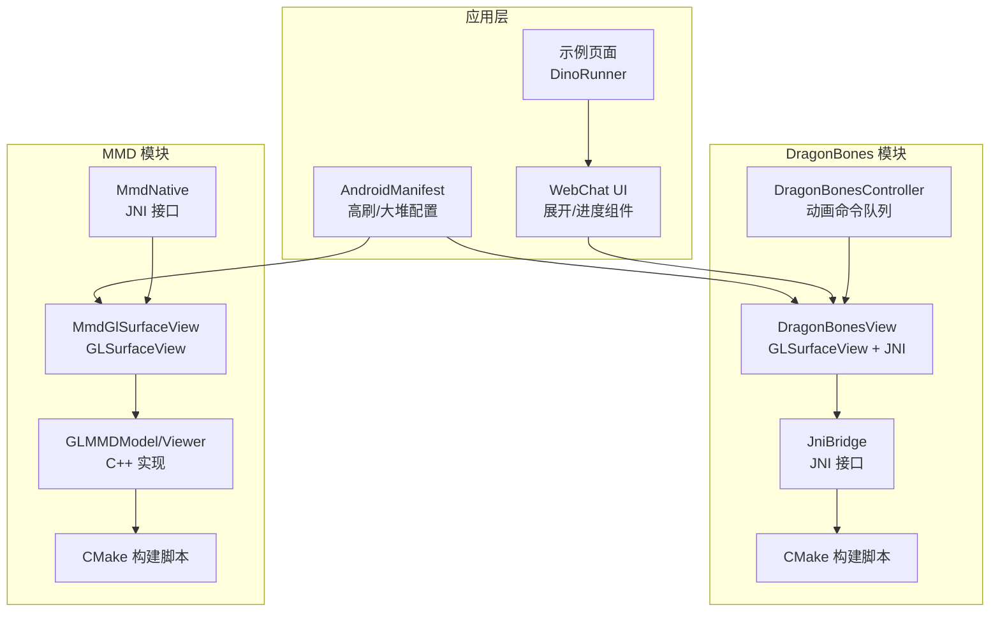
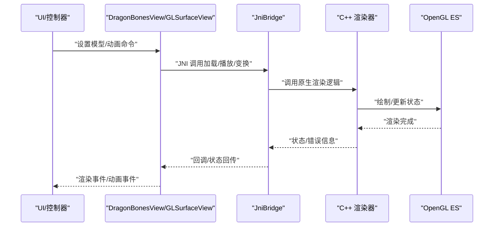
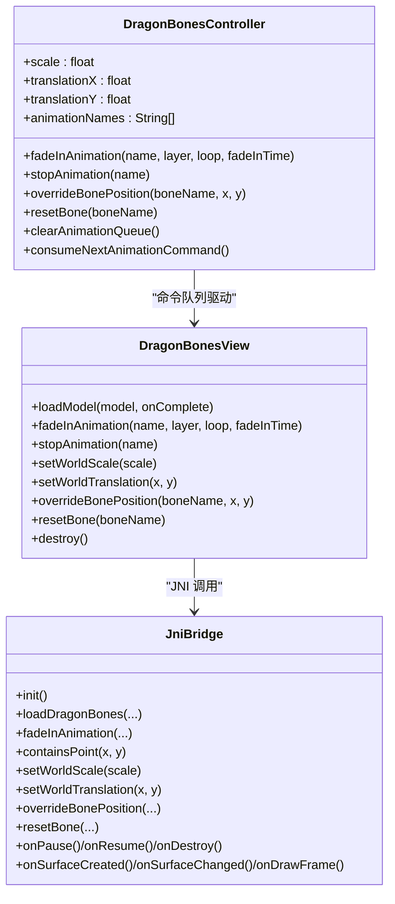
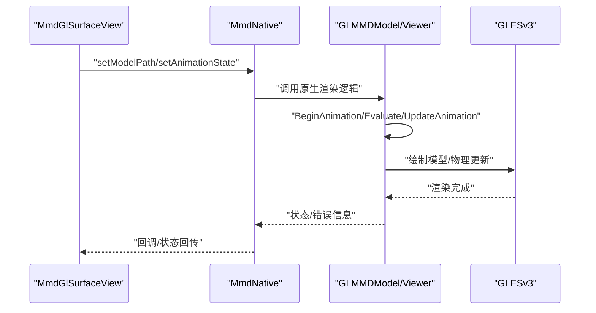
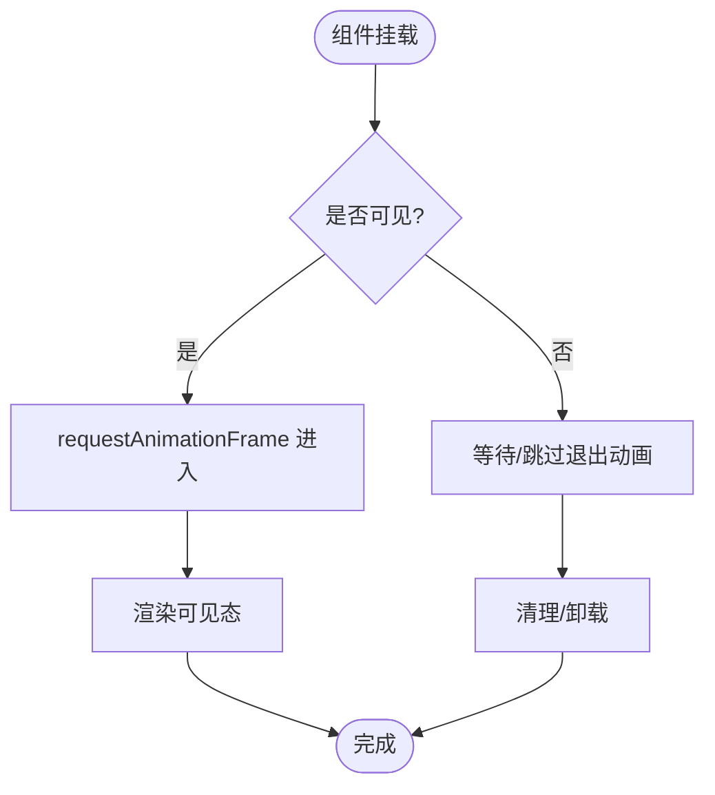
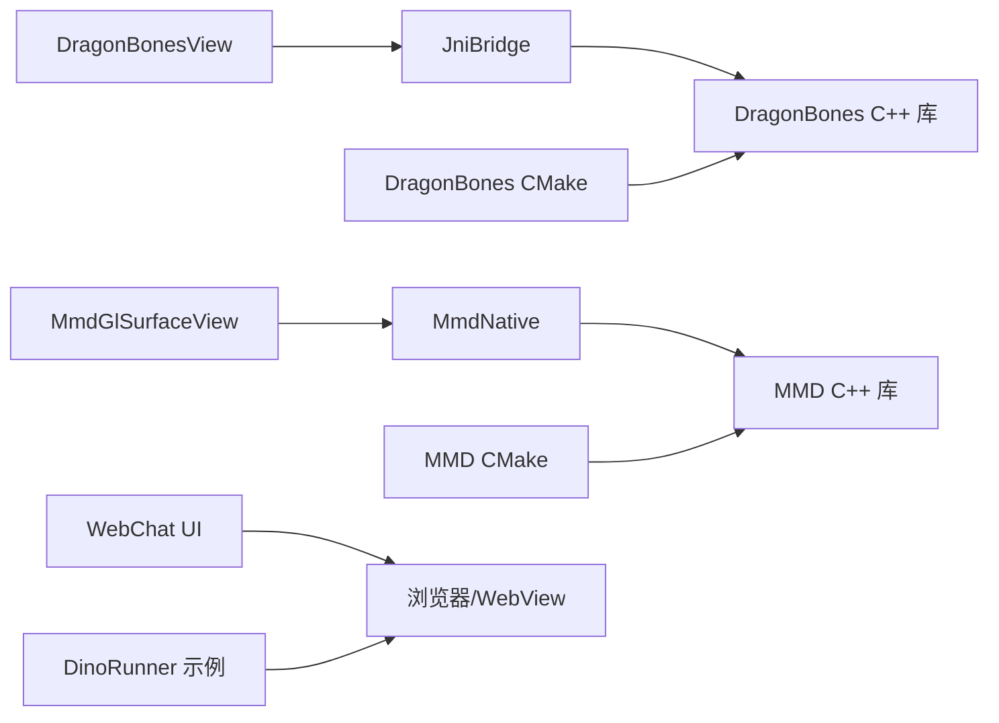

# 动画与可视化

<cite>
**本文引用的文件**   
- [DragonBones 控制器](file://dragonbones/src/main/java/com/dragonbones/DragonBonesController.kt)
- [DragonBones 视图](file://dragonbones/src/main/java/com/dragonbones/DragonBonesView.kt)
- [DragonBones JNI 桥接](file://dragonbones/src/main/java/com/dragonbones/JniBridge.kt)
- [DragonBones CMake 构建脚本](file://dragonbones/CMakeLists.txt)
- [MMD 视图桥接](file://mmd/src/main/java/com/ai/assistance/mmd/MmdNative.kt)
- [MMD GL 表面视图](file://mmd/src/main/java/com/ai/assistance/mmd/MmdGlSurfaceView.kt)
- [MMD 渲染器接口](file://mmd/src/main/cpp/Saba/GL/Model/MMD/GLMMDModel.cpp)
- [MMD 查看器](file://mmd/src/main/cpp/Saba/Viewer/Viewer.cpp)
- [MMD 纹理工具](file://mmd/src/main/cpp/Saba/GL/GLTextureUtil.cpp)
- [MMD CMake 构建脚本](file://mmd/CMakeLists.txt)
- [网页聊天展开动画组件](file://web-chat/src/ui/features/chat/components/part/StructuredExpand.tsx)
- [网页 DinoRunner 示例](file://examples/dino_runner/resources/webview/arcade_console.js)
- [示例 DinoRunner UI](file://examples/dino_runner/src/ui/dino_runner/index.ui.ts)
- [应用清单（高刷/大堆）](file://app/src/main/AndroidManifest.xml)
- [AI 绘图工具（SiliconFlow）](file://examples/siliconflow_draw.ts)
- [AI 绘图工具（xAI）](file://examples/xai_draw.ts)
- [AI 绘图工具（NanoBanana）](file://examples/nanobanana_draw.js)
- [网页进度条组件](file://web-chat/src/ui/features/chat/components/SimpleLinearProgressIndicator.tsx)
</cite>

## 目录
1. [简介](#简介)
2. [项目结构](#项目结构)
3. [核心组件](#核心组件)
4. [架构总览](#架构总览)
5. [详细组件分析](#详细组件分析)
6. [依赖关系分析](#依赖关系分析)
7. [性能考量](#性能考量)
8. [故障排查指南](#故障排查指南)
9. [结论](#结论)
10. [附录](#附录)

## 简介
本文件为 Operit 的动画与可视化系统提供全面技术文档，覆盖以下主题：
- 波形可视化与实时绘制（结合网页示例与进度指示器）
- 动画系统实现（补间、物理、状态与过渡）
- DragonBones 2D 骨骼动画集成（骨骼绑定、动画播放、事件处理、JNI 与 OpenGL）
- 可视化组件设计（自适应布局、响应式动画、多分辨率支持）
- 动画性能优化（帧率控制、内存管理、GPU 加速、电池优化）
- 动画定制指南（创建新动画、参数调整、第三方库集成）
- 动画调试工具、性能监控与用户体验优化

## 项目结构
Operit 的动画与可视化能力由多模块协同实现：
- DragonBones 模块：提供基于 OpenGL ES 的高性能 2D 骨骼动画渲染与交互。
- MMD 模块：提供 PMD/PMX 模型与 VMD 动作的加载、物理与动画更新。
- WebChat 模块：提供网页端 UI 组件与动画（如展开动画、进度条）。
- 示例模块：包含 DinoRunner 等网页小游戏，展示 2D Canvas 动画与自适应布局。
- 应用层：通过 AndroidManifest 配置高刷新率与大堆内存，提升动画流畅度。

**图表来源**
- [DragonBones 视图](file://dragonbones/src/main/java/com/dragonbones/DragonBonesView.kt)
- [DragonBones 控制器](file://dragonbones/src/main/java/com/dragonbones/DragonBonesController.kt)
- [DragonBones JNI 桥接](file://dragonbones/src/main/java/com/dragonbones/JniBridge.kt)
- [DragonBones CMake 构建脚本](file://dragonbones/CMakeLists.txt)
- [MMD 视图桥接](file://mmd/src/main/java/com/ai/assistance/mmd/MmdNative.kt)
- [MMD GL 表面视图](file://mmd/src/main/java/com/ai/assistance/mmd/MmdGlSurfaceView.kt)
- [MMD 渲染器接口](file://mmd/src/main/cpp/Saba/GL/Model/MMD/GLMMDModel.cpp)
- [MMD 查看器](file://mmd/src/main/cpp/Saba/Viewer/Viewer.cpp)
- [MMD CMake 构建脚本](file://mmd/CMakeLists.txt)
- [网页聊天展开动画组件](file://web-chat/src/ui/features/chat/components/part/StructuredExpand.tsx)
- [网页 DinoRunner 示例](file://examples/dino_runner/resources/webview/arcade_console.js)
- [应用清单（高刷/大堆）](file://app/src/main/AndroidManifest.xml)

**章节来源**
- [DragonBones 视图](file://dragonbones/src/main/java/com/dragonbones/DragonBonesView.kt)
- [DragonBones 控制器](file://dragonbones/src/main/java/com/dragonbones/DragonBonesController.kt)
- [DragonBones JNI 桥接](file://dragonbones/src/main/java/com/dragonbones/JniBridge.kt)
- [DragonBones CMake 构建脚本](file://dragonbones/CMakeLists.txt)
- [MMD 视图桥接](file://mmd/src/main/java/com/ai/assistance/mmd/MmdNative.kt)
- [MMD GL 表面视图](file://mmd/src/main/java/com/ai/assistance/mmd/MmdGlSurfaceView.kt)
- [MMD 渲染器接口](file://mmd/src/main/cpp/Saba/GL/Model/MMD/GLMMDModel.cpp)
- [MMD 查看器](file://mmd/src/main/cpp/Saba/Viewer/Viewer.cpp)
- [MMD CMake 构建脚本](file://mmd/CMakeLists.txt)
- [网页聊天展开动画组件](file://web-chat/src/ui/features/chat/components/part/StructuredExpand.tsx)
- [网页 DinoRunner 示例](file://examples/dino_runner/resources/webview/arcade_console.js)
- [应用清单（高刷/大堆）](file://app/src/main/AndroidManifest.xml)

## 核心组件
- DragonBones 骨骼动画系统
  - 视图层：基于 GLSurfaceView，启用透明背景与连续渲染，支持触摸拾取槽位事件。
  - 控制层：控制器维护动画命令队列，支持分层播放、淡入、停止与骨骼位置覆盖。
  - JNI 层：通过 JniBridge 提供加载模型、播放动画、世界缩放与平移等接口。
  - 构建层：CMake 链接 GLESv2、log、android，构建共享库并支持 16KB 页面对齐。
- MMD 3D 动画系统
  - 视图桥接：Java 层封装 JNI 接口，提供模型设置、动画状态、相机参数与生命周期控制。
  - C++ 渲染器：实现模型加载、动画评估、物理同步与帧性能统计。
  - 查看器：管理动作时间轴、循环与播放模式，驱动动画推进。
  - 构建层：链接 Bullet 物理引擎与 GLESv3，构建共享库。
- WebChat 与示例
  - 展开动画组件：基于 requestAnimationFrame 与定时器实现进入/退出动画。
  - DinoRunner：Canvas 动画、自适应布局与帧循环，演示 2D 动画与响应式设计。
  - 进度条组件：简单线性进度指示器，便于反馈任务进度。

**章节来源**
- [DragonBones 视图](file://dragonbones/src/main/java/com/dragonbones/DragonBonesView.kt)
- [DragonBones 控制器](file://dragonbones/src/main/java/com/dragonbones/DragonBonesController.kt)
- [DragonBones JNI 桥接](file://dragonbones/src/main/java/com/dragonbones/JniBridge.kt)
- [DragonBones CMake 构建脚本](file://dragonbones/CMakeLists.txt)
- [MMD 视图桥接](file://mmd/src/main/java/com/ai/assistance/mmd/MmdNative.kt)
- [MMD GL 表面视图](file://mmd/src/main/java/com/ai/assistance/mmd/MmdGlSurfaceView.kt)
- [MMD 渲染器接口](file://mmd/src/main/cpp/Saba/GL/Model/MMD/GLMMDModel.cpp)
- [MMD 查看器](file://mmd/src/main/cpp/Saba/Viewer/Viewer.cpp)
- [MMD CMake 构建脚本](file://mmd/CMakeLists.txt)
- [网页聊天展开动画组件](file://web-chat/src/ui/features/chat/components/part/StructuredExpand.tsx)
- [网页 DinoRunner 示例](file://examples/dino_runner/resources/webview/arcade_console.js)
- [网页进度条组件](file://web-chat/src/ui/features/chat/components/SimpleLinearProgressIndicator.tsx)

## 架构总览
DragonBones 与 MMD 的渲染管线均采用“视图层（Java/Kotlin）—JNI（C/C++）—GPU（OpenGL ES/GLESv3）”的分层架构。视图层负责生命周期与用户交互，JNI 层负责与底层图形 API 通信，C++ 层实现具体算法与性能优化。

**图表来源**
- [DragonBones 视图](file://dragonbones/src/main/java/com/dragonbones/DragonBonesView.kt)
- [DragonBones JNI 桥接](file://dragonbones/src/main/java/com/dragonbones/JniBridge.kt)
- [DragonBones 控制器](file://dragonbones/src/main/java/com/dragonbones/DragonBonesController.kt)

## 详细组件分析

### DragonBones 骨骼动画系统
- 视图与渲染
  - 透明背景与连续渲染，启用触摸手势检测，支持槽位点击拾取。
  - 通过 queueEvent 将耗时操作调度至 GL 线程，保证线程安全。
- 控制器与命令队列
  - 支持分层播放、循环次数、淡入时间；提供停止命令与骨骼位置覆盖。
  - 使用协程作用域异步获取动画名列表，避免阻塞 UI。
- JNI 与 CMake
  - JniBridge 提供统一的原生接口；CMake 链接 GLESv2/log/android，构建共享库。
- 交互与事件
  - 通过 onSlotTapListener 回调槽位名称；支持渲染开始/结束事件钩子。

**图表来源**
- [DragonBones 控制器](file://dragonbones/src/main/java/com/dragonbones/DragonBonesController.kt)
- [DragonBones 视图](file://dragonbones/src/main/java/com/dragonbones/DragonBonesView.kt)
- [DragonBones JNI 桥接](file://dragonbones/src/main/java/com/dragonbones/JniBridge.kt)

**章节来源**
- [DragonBones 视图](file://dragonbones/src/main/java/com/dragonbones/DragonBonesView.kt)
- [DragonBones 控制器](file://dragonbones/src/main/java/com/dragonbones/DragonBonesController.kt)
- [DragonBones JNI 桥接](file://dragonbones/src/main/java/com/dragonbones/JniBridge.kt)
- [DragonBones CMake 构建脚本](file://dragonbones/CMakeLists.txt)

### MMD 3D 动画系统
- 视图桥接与生命周期
  - 通过 MmdNative 与 MmdGlSurfaceView 提供模型路径设置、动画状态、旋转与相机参数。
- C++ 渲染器与物理
  - GLMMDModel 负责模型初始化、动画评估、物理同步与性能计时。
  - Viewer 管理动作时间轴、循环与播放模式，确保动画推进与边界处理。
- 构建与依赖
  - CMake 链接 Bullet 物理引擎与 GLESv3，构建共享库。

**图表来源**
- [MMD GL 表面视图](file://mmd/src/main/java/com/ai/assistance/mmd/MmdGlSurfaceView.kt)
- [MMD 视图桥接](file://mmd/src/main/java/com/ai/assistance/mmd/MmdNative.kt)
- [MMD 渲染器接口](file://mmd/src/main/cpp/Saba/GL/Model/MMD/GLMMDModel.cpp)
- [MMD 查看器](file://mmd/src/main/cpp/Saba/Viewer/Viewer.cpp)

**章节来源**
- [MMD 视图桥接](file://mmd/src/main/java/com/ai/assistance/mmd/MmdNative.kt)
- [MMD GL 表面视图](file://mmd/src/main/java/com/ai/assistance/mmd/MmdGlSurfaceView.kt)
- [MMD 渲染器接口](file://mmd/src/main/cpp/Saba/GL/Model/MMD/GLMMDModel.cpp)
- [MMD 查看器](file://mmd/src/main/cpp/Saba/Viewer/Viewer.cpp)
- [MMD CMake 构建脚本](file://mmd/CMakeLists.txt)

### 可视化组件设计与响应式动画
- 展开动画组件
  - 基于 requestAnimationFrame 与 setTimeout 实现进入/退出动画，支持变体与跳过退出动画。
- DinoRunner 示例
  - Canvas 动画、自适应布局（根据设备像素比与窗口尺寸计算画布与视口），帧循环使用 requestAnimationFrame。
- 进度条组件
  - 简单线性进度指示器，用于反馈任务进度。

**图表来源**
- [网页聊天展开动画组件](file://web-chat/src/ui/features/chat/components/part/StructuredExpand.tsx)
- [网页 DinoRunner 示例](file://examples/dino_runner/resources/webview/arcade_console.js)
- [网页进度条组件](file://web-chat/src/ui/features/chat/components/SimpleLinearProgressIndicator.tsx)

**章节来源**
- [网页聊天展开动画组件](file://web-chat/src/ui/features/chat/components/part/StructuredExpand.tsx)
- [网页 DinoRunner 示例](file://examples/dino_runner/resources/webview/arcade_console.js)
- [网页进度条组件](file://web-chat/src/ui/features/chat/components/SimpleLinearProgressIndicator.tsx)

### 动画系统实现要点
- 补间动画：DragonBones 支持按轨道分层播放与淡入；MMD 通过 VMD 动作与 Morph/IK 实现补间。
- 物理动画：MMD 使用 Bullet 物理引擎模拟布料与刚体；DragonBones 通过骨骼层级与约束实现物理风格动画。
- 状态动画：Viewer 管理动画时间轴与循环；控制器维护命令队列与状态机。
- 过渡效果：通过控制器的淡入/停止命令与 UI 展开动画实现平滑过渡。

**章节来源**
- [DragonBones 控制器](file://dragonbones/src/main/java/com/dragonbones/DragonBonesController.kt)
- [MMD 渲染器接口](file://mmd/src/main/cpp/Saba/GL/Model/MMD/GLMMDModel.cpp)
- [MMD 查看器](file://mmd/src/main/cpp/Saba/Viewer/Viewer.cpp)

## 依赖关系分析
- DragonBones
  - Java/Kotlin 视图依赖 JNI 接口；JNI 依赖 C++ DragonBones 实现；CMake 链接 GLESv2/log/android。
- MMD
  - Java/Kotlin 视图依赖 JNI 接口；JNI 依赖 C++ 渲染器与物理引擎；CMake 链接 GLESv3/Bullet。
- WebChat 与示例
  - UI 组件依赖浏览器环境与 DOM API；示例页面依赖 WebView 与资源加载。

**图表来源**
- [DragonBones 视图](file://dragonbones/src/main/java/com/dragonbones/DragonBonesView.kt)
- [DragonBones JNI 桥接](file://dragonbones/src/main/java/com/dragonbones/JniBridge.kt)
- [DragonBones CMake 构建脚本](file://dragonbones/CMakeLists.txt)
- [MMD GL 表面视图](file://mmd/src/main/java/com/ai/assistance/mmd/MmdGlSurfaceView.kt)
- [MMD 视图桥接](file://mmd/src/main/java/com/ai/assistance/mmd/MmdNative.kt)
- [MMD CMake 构建脚本](file://mmd/CMakeLists.txt)
- [网页 DinoRunner 示例](file://examples/dino_runner/resources/webview/arcade_console.js)

**章节来源**
- [DragonBones 视图](file://dragonbones/src/main/java/com/dragonbones/DragonBonesView.kt)
- [DragonBones JNI 桥接](file://dragonbones/src/main/java/com/dragonbones/JniBridge.kt)
- [DragonBones CMake 构建脚本](file://dragonbones/CMakeLists.txt)
- [MMD GL 表面视图](file://mmd/src/main/java/com/ai/assistance/mmd/MmdGlSurfaceView.kt)
- [MMD 视图桥接](file://mmd/src/main/java/com/ai/assistance/mmd/MmdNative.kt)
- [MMD CMake 构建脚本](file://mmd/CMakeLists.txt)
- [网页 DinoRunner 示例](file://examples/dino_runner/resources/webview/arcade_console.js)

## 性能考量
- 帧率控制
  - DragonBones 使用连续渲染模式驱动动画；WebChat 展开动画使用 requestAnimationFrame；DinoRunner 使用 requestAnimationFrame 控制帧循环。
- 内存管理
  - MMD 渲染器包含性能计时与清理逻辑；纹理工具提供透明像素检测与格式转换，减少不必要带宽。
- GPU 加速
  - DragonBones 与 MMD 均使用 OpenGL ES/GLESv3；CMake 链接对应库；应用清单启用高刷与大堆内存以提升流畅度。
- 电池优化
  - 在低负载场景建议降低渲染频率或关闭非必要动画；合理使用暂停/恢复生命周期接口。

**章节来源**
- [DragonBones 视图](file://dragonbones/src/main/java/com/dragonbones/DragonBonesView.kt)
- [MMD 渲染器接口](file://mmd/src/main/cpp/Saba/GL/Model/MMD/GLMMDModel.cpp)
- [MMD 纹理工具](file://mmd/src/main/cpp/Saba/GL/GLTextureUtil.cpp)
- [应用清单（高刷/大堆）](file://app/src/main/AndroidManifest.xml)

## 故障排查指南
- DragonBones
  - 检查模型路径与资源读取异常；确认仅有一个活动实例；通过控制器清空命令队列后再加载新模型。
- MMD
  - 检查模型/动作文件路径与最大帧数；确认 GL 线程事件队列正确调度；查看渲染错误回调。
- WebChat 与示例
  - 展开动画组件注意取消动画与超时句柄；DinoRunner 注意自适应布局与帧循环上限。

**章节来源**
- [DragonBones 视图](file://dragonbones/src/main/java/com/dragonbones/DragonBonesView.kt)
- [DragonBones 控制器](file://dragonbones/src/main/java/com/dragonbones/DragonBonesController.kt)
- [MMD GL 表面视图](file://mmd/src/main/java/com/ai/assistance/mmd/MmdGlSurfaceView.kt)
- [网页聊天展开动画组件](file://web-chat/src/ui/features/chat/components/part/StructuredExpand.tsx)
- [网页 DinoRunner 示例](file://examples/dino_runner/resources/webview/arcade_console.js)

## 结论
Operit 的动画与可视化系统通过 DragonBones 与 MMD 的强强联合，实现了高性能的 2D/3D 骨骼动画渲染，并辅以 WebChat UI 组件与示例页面，提供了丰富的交互与响应式体验。借助 JNI 与 OpenGL ES，系统在移动端具备良好的性能与可扩展性；通过控制器与命令队列，动画播放与状态管理清晰可控。

## 附录
- 动画定制指南
  - 新增动画：准备骨骼与纹理资源，通过 DragonBonesView 的模型加载接口注入；或准备 MMD 模型与 VMD 动作文件。
  - 参数调整：通过控制器设置缩放、平移与骨骼覆盖；通过 Viewer 设置动画状态与循环。
  - 第三方库集成：遵循 JNI 接口规范，将外部资源与渲染逻辑接入现有桥接层。
- 动画调试与监控
  - 利用渲染事件回调与日志输出定位问题；使用性能计时与帧循环上限控制进行压力测试。
- 用户体验优化
  - 合理使用展开动画与进度条反馈；确保自适应布局在不同分辨率下稳定表现。