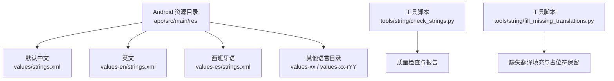
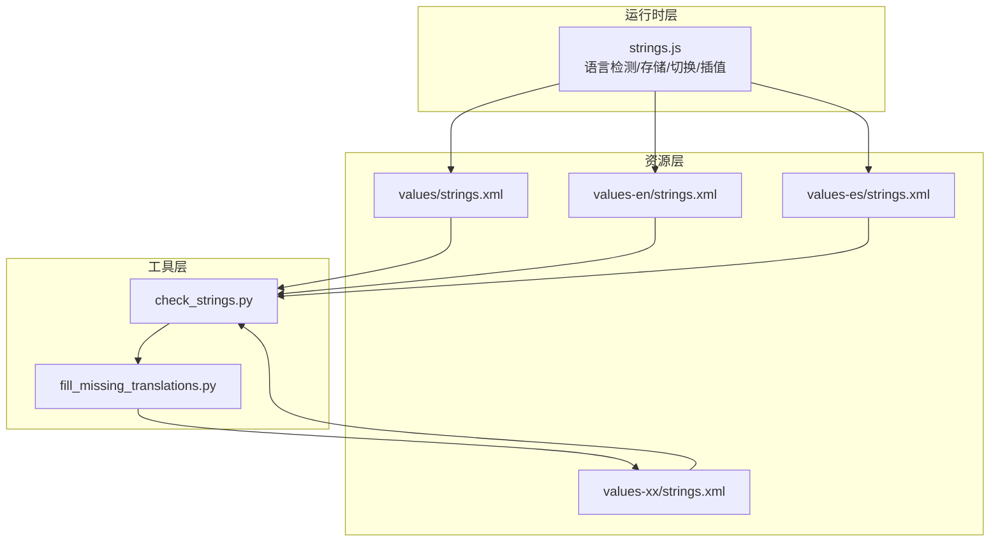
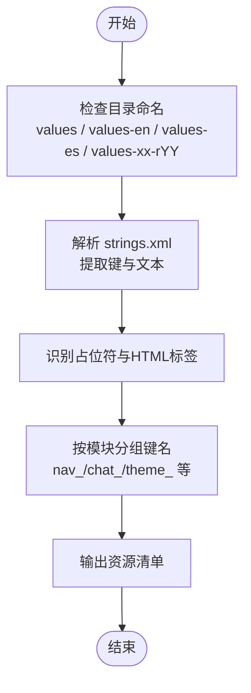
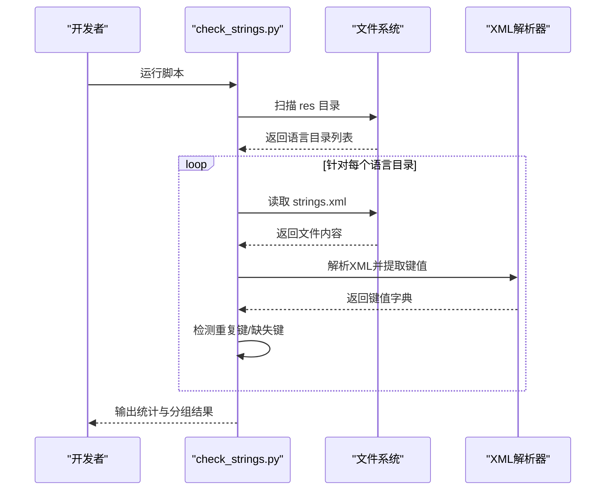
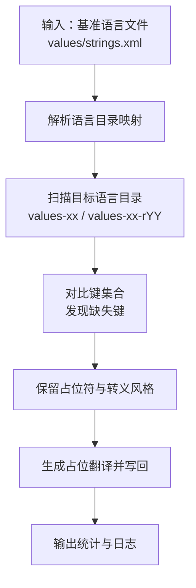
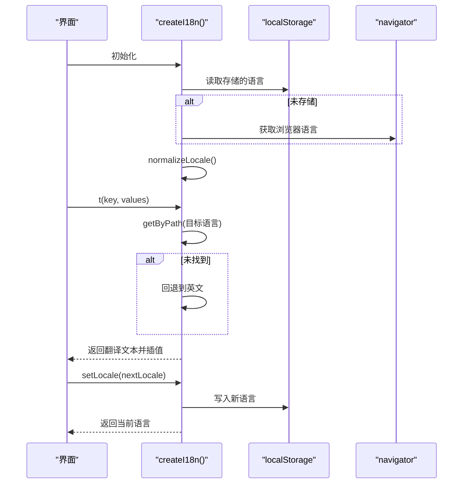
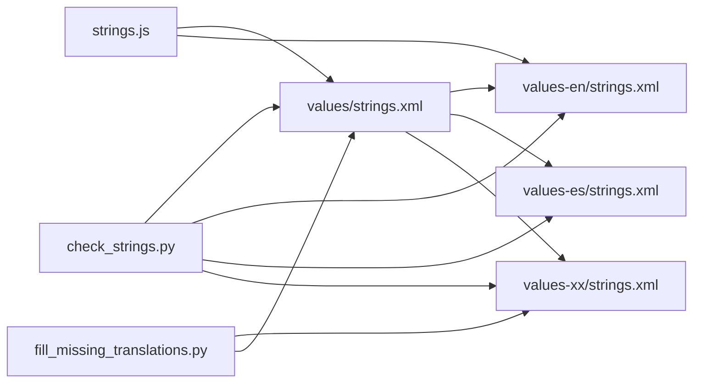

# 多语言支持

<cite>
**本文引用的文件**
- [strings.xml](file://app/src/main/res/values/strings.xml)
- [strings.xml](file://app/src/main/res/values-en/strings.xml)
- [strings.xml](file://app/src/main/res/values-es/strings.xml)
- [check_strings.py](file://tools/string/check_strings.py)
- [fill_missing_translations.py](file://tools/string/fill_missing_translations.py)
- [strings.js](file://examples/windows_control/resources/pc_agent/operit-pc-agent/public/scripts/i18n/strings.js)
</cite>

## 目录
1. [简介](#简介)
2. [项目结构](#项目结构)
3. [核心组件](#核心组件)
4. [架构总览](#架构总览)
5. [详细组件分析](#详细组件分析)
6. [依赖关系分析](#依赖关系分析)
7. [性能考虑](#性能考虑)
8. [故障排查指南](#故障排查指南)
9. [结论](#结论)
10. [附录](#附录)

## 简介
本技术文档围绕 Operit 的多语言支持体系进行系统化梳理，覆盖字符串资源组织、数值资源管理、图像资源适配、本地化实现机制（语言检测、区域设置、文本方向处理）、RTL 支持（布局镜像、文本对齐、图标翻转）、动态语言切换（运行时变更、界面重建、状态保持）、语言包管理（翻译进度跟踪、术语统一、质量保证）、本地化开发指南（新增语言、特殊字符处理、界面测试）以及国际化最佳实践与性能优化建议。

## 项目结构
Operit 在 Android 资源目录中采用标准的多语言资源组织方式：
- 默认中文资源位于 values/strings.xml
- 英文资源位于 values-en/strings.xml
- 其他语言资源位于对应 values-xx 或 values-xx-rYY 的目录中（如西班牙语 values-es）

此外，仓库还提供了两套工具脚本用于字符串资源的质量检查与缺失翻译填充：
- tools/string/check_strings.py：扫描并校验各语言资源文件，输出缺失键与重复键等信息
- tools/string/fill_missing_translations.py：根据目标语言目录推导规则，批量生成缺失的翻译条目并进行占位符与转义风格保留

图表来源
- [strings.xml](file://app/src/main/res/values/strings.xml)
- [strings.xml](file://app/src/main/res/values-en/strings.xml)
- [strings.xml](file://app/src/main/res/values-es/strings.xml)
- [check_strings.py](file://tools/string/check_strings.py)
- [fill_missing_translations.py](file://tools/string/fill_missing_translations.py)

章节来源
- [strings.xml](file://app/src/main/res/values/strings.xml)
- [strings.xml](file://app/src/main/res/values-en/strings.xml)
- [strings.xml](file://app/src/main/res/values-es/strings.xml)
- [check_strings.py](file://tools/string/check_strings.py)
- [fill_missing_translations.py](file://tools/string/fill_missing_translations.py)

## 核心组件
- 字符串资源层
  - values/strings.xml：默认中文字符串集合，作为基准语言
  - values-en/strings.xml：英文字符串集合
  - values-es/strings.xml：西班牙语字符串集合
  - 其他语言通过 values-xx 或 values-xx-rYY 目录组织
- 本地化工具层
  - check_strings.py：发现并解析各语言资源文件，统计缺失键与重复键，辅助质量把控
  - fill_missing_translations.py：根据语言目录命名规则推导目标语言，批量生成缺失翻译，保留占位符与转义风格
- 运行时本地化层（示例）
  - examples/windows_control/resources/pc_agent/operit-pc-agent/public/scripts/i18n/strings.js：浏览器端运行时 i18n 实现，包含语言归一化、存储与切换、模板插值等

章节来源
- [strings.xml](file://app/src/main/res/values/strings.xml)
- [strings.xml](file://app/src/main/res/values-en/strings.xml)
- [strings.xml](file://app/src/main/res/values-es/strings.xml)
- [check_strings.py](file://tools/string/check_strings.py)
- [fill_missing_translations.py](file://tools/string/fill_missing_translations.py)
- [strings.js](file://examples/windows_control/resources/pc_agent/operit-pc-agent/public/scripts/i18n/strings.js)

## 架构总览
Operit 的多语言支持由“资源层 + 工具层 + 运行时层”构成：
- 资源层：Android 标准多语言资源目录，按语言与地区细分
- 工具层：Python 脚本负责质量检查与缺失翻译填充，保障翻译完整性与一致性
- 运行时层：示例中的 JavaScript i18n 提供语言检测、存储与切换能力，可借鉴到移动端 Compose/Activity 层

图表来源
- [strings.xml](file://app/src/main/res/values/strings.xml)
- [strings.xml](file://app/src/main/res/values-en/strings.xml)
- [strings.xml](file://app/src/main/res/values-es/strings.xml)
- [check_strings.py](file://tools/string/check_strings.py)
- [fill_missing_translations.py](file://tools/string/fill_missing_translations.py)
- [strings.js](file://examples/windows_control/resources/pc_agent/operit-pc-agent/public/scripts/i18n/strings.js)

## 详细组件分析

### 组件A：字符串资源组织与命名规范
- 目录命名规则
  - values：默认中文
  - values-en：英文
  - values-es：西班牙语
  - values-xx / values-xx-rYY：通用语言与地区代码
- 资源键命名策略
  - 采用层级化命名（如 nav_、chat_、theme_）便于分组与检索
  - 保持键名稳定，避免频繁变更导致多语言资源散失
- 占位符与 HTML 标签
  - 使用 Android 标准占位符（如 %d、%s）
  - 保留 HTML 标签（如 <mood>）以支持运行时渲染

图表来源
- [strings.xml](file://app/src/main/res/values/strings.xml)
- [strings.xml](file://app/src/main/res/values-en/strings.xml)
- [strings.xml](file://app/src/main/res/values-es/strings.xml)

章节来源
- [strings.xml](file://app/src/main/res/values/strings.xml)
- [strings.xml](file://app/src/main/res/values-en/strings.xml)
- [strings.xml](file://app/src/main/res/values-es/strings.xml)

### 组件B：本地化质量检查工具（check_strings.py）
- 功能概述
  - 发现并解析各语言资源文件
  - 统计重复键与缺失键
  - 输出按模块分组的缺失键列表
- 关键流程
  - 目录扫描：遍历 app/src/main/res 下的 values-* 目录
  - 文件解析：读取 strings.xml 并提取键值
  - 缺失键分组：按前缀分组，便于定位模块
  - 报告输出：打印缺失键与重复键统计

图表来源
- [check_strings.py](file://tools/string/check_strings.py)

章节来源
- [check_strings.py](file://tools/string/check_strings.py)

### 组件C：缺失翻译填充工具（fill_missing_translations.py）
- 功能概述
  - 根据语言目录推导规则，将目标语言映射到 values-xx 或 values-xx-rYY
  - 扫描现有目标语言资源，发现缺失条目
  - 保留占位符与转义风格，生成占位翻译
- 关键流程
  - 目录到语言代码映射：支持 zh、en、es、pt-BR、ms、id 等
  - 目标语言解析：支持 values、values-en、values-es 等
  - 缺失条目发现：对比基准语言与目标语言
  - 翻译生成：保留占位符与 HTML 标签风格

图表来源
- [fill_missing_translations.py](file://tools/string/fill_missing_translations.py)
- [strings.xml](file://app/src/main/res/values/strings.xml)

章节来源
- [fill_missing_translations.py](file://tools/string/fill_missing_translations.py)
- [strings.xml](file://app/src/main/res/values/strings.xml)

### 组件D：运行时本地化（浏览器端示例）
- 功能概述
  - 语言检测：优先使用 localStorage 存储的语言，否则使用 navigator.language
  - 语言归一化：将 zh 开头的语言统一为 zh，其余统一为 en
  - 翻译获取：优先从目标语言资源取值，回退到英文
  - 插值处理：支持 {key} 形式的模板插值
  - 语言切换：setLocale 更新存储并返回当前语言
- 关键流程

图表来源
- [strings.js](file://examples/windows_control/resources/pc_agent/operit-pc-agent/public/scripts/i18n/strings.js)

章节来源
- [strings.js](file://examples/windows_control/resources/pc_agent/operit-pc-agent/public/scripts/i18n/strings.js)

### 组件E：RTL（从右到左）支持设计要点
- 布局镜像
  - 使用 Android 的 layout-ldrtl 与 drawable-ldrtl 目录存放镜像布局与图标
  - 在 Compose 中通过 LayoutDirection.Rtl 控制文本与图标镜像
- 文本对齐
  - 使用 start/end 替代 left/right，确保在 RTL 时自动对齐
- 图标翻转
  - 通过镜像资源或在代码中根据方向动态翻转（如使用 mirror 属性）

（本节为概念性说明，不直接分析具体文件）

## 依赖关系分析
- 资源依赖
  - values/strings.xml 为基准语言，其他语言资源依赖其键集合
  - values-en/strings.xml 作为英文回退语言
- 工具依赖
  - check_strings.py 依赖 xml.etree.ElementTree 解析 XML
  - fill_missing_translations.py 依赖正则表达式与路径解析
- 运行时依赖
  - 浏览器端 strings.js 依赖 localStorage 与 navigator.language

图表来源
- [strings.xml](file://app/src/main/res/values/strings.xml)
- [strings.xml](file://app/src/main/res/values-en/strings.xml)
- [strings.xml](file://app/src/main/res/values-es/strings.xml)
- [check_strings.py](file://tools/string/check_strings.py)
- [fill_missing_translations.py](file://tools/string/fill_missing_translations.py)
- [strings.js](file://examples/windows_control/resources/pc_agent/operit-pc-agent/public/scripts/i18n/strings.js)

章节来源
- [strings.xml](file://app/src/main/res/values/strings.xml)
- [strings.xml](file://app/src/main/res/values-en/strings.xml)
- [strings.xml](file://app/src/main/res/values-es/strings.xml)
- [check_strings.py](file://tools/string/check_strings.py)
- [fill_missing_translations.py](file://tools/string/fill_missing_translations.py)
- [strings.js](file://examples/windows_control/resources/pc_agent/operit-pc-agent/public/scripts/i18n/strings.js)

## 性能考虑
- 资源加载
  - 使用 Android 标准资源选择机制，系统自动选择最匹配语言资源，避免额外分支判断
- 运行时插值
  - 保持插值键数量与复杂度在合理范围，避免过度计算
- 工具脚本
  - 批量处理时尽量减少文件 IO 次数，一次性读取与写回
- 缓存策略
  - 运行时可引入轻量缓存（如内存缓存）减少重复查找

（本节提供一般性建议，不直接分析具体文件）

## 故障排查指南
- 常见问题
  - 缺失翻译：使用 check_strings.py 检查缺失键，再用 fill_missing_translations.py 生成占位翻译
  - 重复键：检查 strings.xml 是否存在重复 name，修正后重新解析
  - 占位符不匹配：确保占位符数量与顺序与基准语言一致
  - HTML 标签丢失：在填充翻译时保留原始标签，避免运行时渲染异常
- 运行时问题
  - 语言切换无效：确认 setLocale 是否正确写入存储，getLocale 是否返回最新值
  - 回退逻辑：确认英文回退是否生效，避免出现键名直接显示

章节来源
- [check_strings.py](file://tools/string/check_strings.py)
- [fill_missing_translations.py](file://tools/string/fill_missing_translations.py)
- [strings.js](file://examples/windows_control/resources/pc_agent/operit-pc-agent/public/scripts/i18n/strings.js)

## 结论
Operit 的多语言支持体系以 Android 标准资源组织为基础，辅以 Python 工具链保障翻译质量与完整性，并在运行时层提供灵活的语言检测与切换能力。通过模块化键命名、占位符与标签保留、缺失翻译填充与质量检查，形成从资源到工具再到运行时的完整闭环。建议在后续迭代中进一步完善 RTL 资源与镜像策略，并在移动端实现类似的运行时切换与状态保持机制。

## 附录

### 本地化开发指南
- 添加新语言
  - 在 app/src/main/res 新建 values-xx 或 values-xx-rYY 目录
  - 复制 values/strings.xml 的键到新语言目录，逐条翻译
  - 使用 check_strings.py 校验缺失与重复键
  - 使用 fill_missing_translations.py 填充缺失翻译
- 特殊字符处理
  - 注意保留占位符与 HTML 标签，避免运行时渲染异常
  - 对引号、尖括号等进行转义处理，确保 XML 正确解析
- 界面测试
  - 在不同语言环境下验证文本截断、换行与布局
  - 测试 RTL 语言时的镜像布局与图标翻转

（本节为实践指导，不直接分析具体文件）