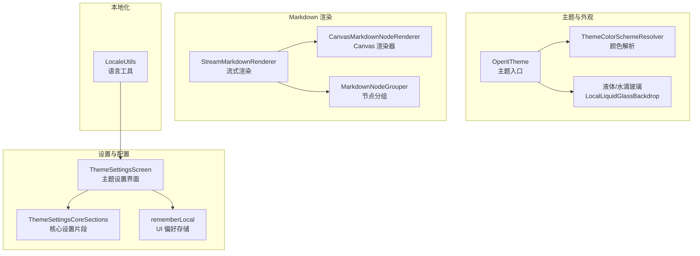
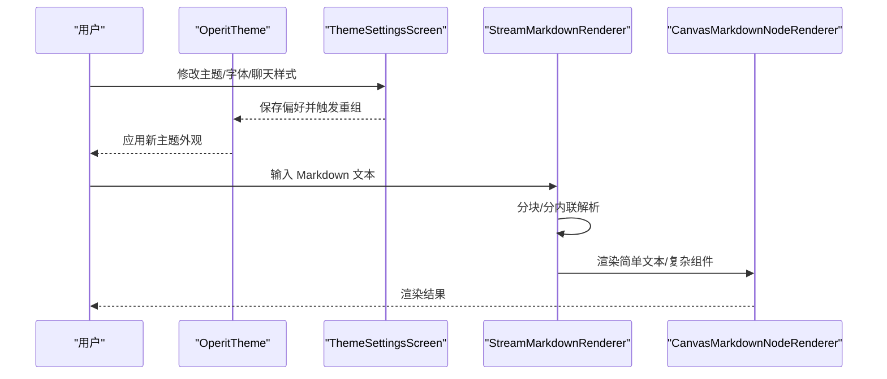
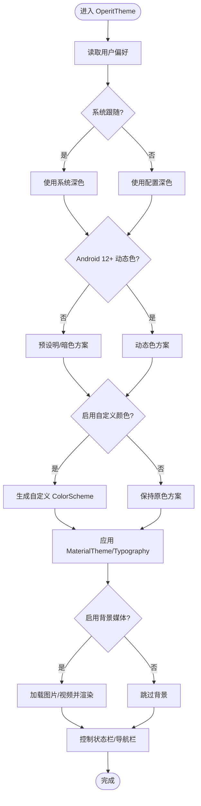
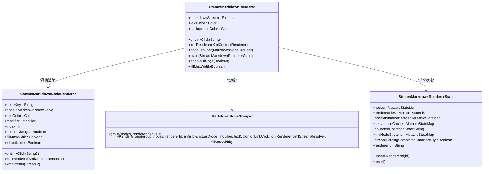
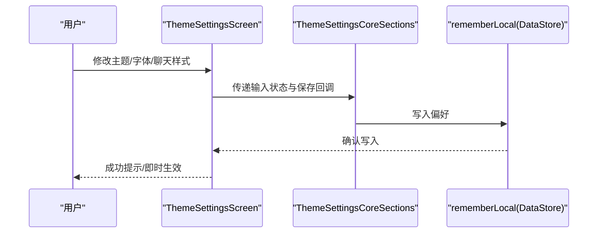
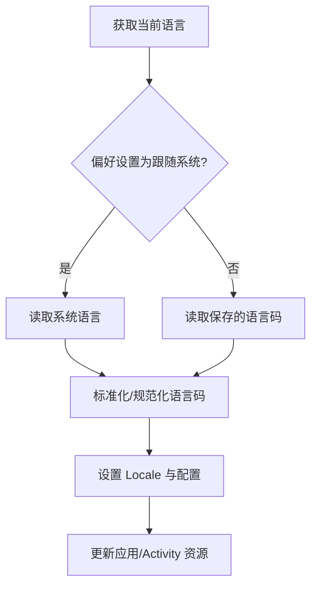
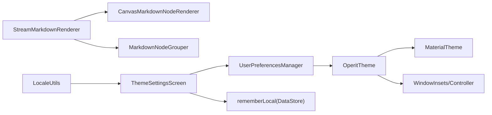

# 界面设计系统

<cite>
**本文档引用的文件**
- [Theme.kt](file://app/src/main/java/com/ai/assistance/operit/ui/theme/Theme.kt)
- [ThemeColorSchemeResolver.kt](file://app/src/main/java/com/ai/assistance/operit/ui/theme/ThemeColorSchemeResolver.kt)
- [MarkdownTextComposable.kt](file://app/src/main/java/com/ai/assistance/operit/ui/common/displays/MarkdownTextComposable.kt)
- [StreamMarkdownRenderer.kt](file://app/src/main/java/com/ai/assistance/operit/ui/common/markdown/StreamMarkdownRenderer.kt)
- [CanvasMarkdownNodeRenderer.kt](file://app/src/main/java/com/ai/assistance/operit/ui/common/markdown/CanvasMarkdownNodeRenderer.kt)
- [MarkdownNodeGrouper.kt](file://app/src/main/java/com/ai/assistance/operit/ui/common/markdown/MarkdownNodeGrouper.kt)
- [ThemeSettingsScreen.kt](file://app/src/main/java/com/ai/assistance/operit/ui/features/settings/screens/ThemeSettingsScreen.kt)
- [ThemeSettingsCoreSections.kt](file://app/src/main/java/com/ai/assistance/operit/ui/features/settings/sections/ThemeSettingsCoreSections.kt)
- [RememberLocal.kt](file://app/src/main/java/com/ai/assistance/operit/ui/common/RememberLocal.kt)
- [LocaleUtils.kt](file://app/src/main/java/com/ai/assistance/operit/util/LocaleUtils.kt)
</cite>

## 目录
1. [简介](#简介)
2. [项目结构](#项目结构)
3. [核心组件](#核心组件)
4. [架构总览](#架构总览)
5. [详细组件分析](#详细组件分析)
6. [依赖关系分析](#依赖关系分析)
7. [性能考量](#性能考量)
8. [故障排查指南](#故障排查指南)
9. [结论](#结论)
10. [附录](#附录)

## 简介
本文件面向 UI 开发者，系统化梳理 Operit AI 的界面设计系统，覆盖 Jetpack Compose 组件架构、主题系统、多语言与 RTL 支持、自定义配置、Markdown 渲染引擎、无障碍与性能优化、跨设备适配等。文档以“可读性强、循序渐进”的方式组织，既适合快速上手，也便于深入扩展。

## 项目结构
界面系统主要由以下模块构成：
- 主题与外观：OperitTheme、主题解析器、水滴玻璃与液体效果、状态栏/导航栏控制
- Markdown 渲染：流式渲染器、Canvas 渲染器、节点分组器、LaTeX/图片/表格/代码块等专用渲染
- 设置与配置：主题设置界面、聊天样式与气泡配置、字体与字号、显示选项
- 本地化与多语言：语言选择、上下文本地化、资源加载
- 数据持久化：UI 偏好本地存储（DataStore）

图表来源
- [Theme.kt:92-536](file://app/src/main/java/com/ai/assistance/operit/ui/theme/Theme.kt#L92-L536)
- [ThemeColorSchemeResolver.kt:28-69](file://app/src/main/java/com/ai/assistance/operit/ui/theme/ThemeColorSchemeResolver.kt#L28-L69)
- [StreamMarkdownRenderer.kt:356-611](file://app/src/main/java/com/ai/assistance/operit/ui/common/markdown/StreamMarkdownRenderer.kt#L356-L611)
- [CanvasMarkdownNodeRenderer.kt:413-753](file://app/src/main/java/com/ai/assistance/operit/ui/common/markdown/CanvasMarkdownNodeRenderer.kt#L413-L753)
- [MarkdownNodeGrouper.kt:19-59](file://app/src/main/java/com/ai/assistance/operit/ui/common/markdown/MarkdownNodeGrouper.kt#L19-L59)
- [ThemeSettingsScreen.kt:166-800](file://app/src/main/java/com/ai/assistance/operit/ui/features/settings/screens/ThemeSettingsScreen.kt#L166-L800)
- [ThemeSettingsCoreSections.kt:150-800](file://app/src/main/java/com/ai/assistance/operit/ui/features/settings/sections/ThemeSettingsCoreSections.kt#L150-L800)
- [RememberLocal.kt:32-102](file://app/src/main/java/com/ai/assistance/operit/ui/common/RememberLocal.kt#L32-L102)
- [LocaleUtils.kt:16-263](file://app/src/main/java/com/ai/assistance/operit/util/LocaleUtils.kt#L16-L263)

章节来源
- [Theme.kt:92-536](file://app/src/main/java/com/ai/assistance/operit/ui/theme/Theme.kt#L92-L536)
- [ThemeSettingsScreen.kt:166-800](file://app/src/main/java/com/ai/assistance/operit/ui/features/settings/screens/ThemeSettingsScreen.kt#L166-L800)

## 核心组件
- 主题入口与外观控制
  - OperitTheme：统一主题入口，聚合用户偏好、动态色彩、背景媒体、状态栏/导航栏控制、水滴玻璃与液体效果、字体与字号
  - 主题解析器：根据快照生成最终 ColorScheme，支持自定义主色与 onColorMode
- Markdown 渲染引擎
  - 流式渲染器：基于 Stream 的增量解析与渲染，支持块/内联分组、LaTeX、XML、图片、表格、代码块等
  - Canvas 渲染器：对简单文本类型进行高效 Canvas 绘制，复杂组件保留 Compose 组件
  - 节点分组器：将连续节点按可见性与渲染特性进行分组，提升渲染效率
- 设置与配置
  - 主题设置界面：主题模式、自定义颜色、背景图片/视频、状态栏/导航栏、聊天样式、气泡样式、字体与字号、显示选项
  - 核心设置片段：主题模式、聊天样式、气泡样式、字体与图像配置等
  - UI 偏好存储：基于 DataStore 的 rememberLocal，支持序列化存储任意类型
- 本地化与多语言
  - LocaleUtils：语言码映射、系统语言检测、上下文本地化、运行时语言切换
- 无障碍与性能
  - 无障碍：链接点击、可访问文本提取、语义描述
  - 性能：节点缓存、Layout 缓存、Paint 缓存、可见性裁剪、流式批处理、ExoPlayer 资源释放

章节来源
- [Theme.kt:92-536](file://app/src/main/java/com/ai/assistance/operit/ui/theme/Theme.kt#L92-L536)
- [StreamMarkdownRenderer.kt:356-611](file://app/src/main/java/com/ai/assistance/operit/ui/common/markdown/StreamMarkdownRenderer.kt#L356-L611)
- [CanvasMarkdownNodeRenderer.kt:413-753](file://app/src/main/java/com/ai/assistance/operit/ui/common/markdown/CanvasMarkdownNodeRenderer.kt#L413-L753)
- [ThemeSettingsScreen.kt:166-800](file://app/src/main/java/com/ai/assistance/operit/ui/features/settings/screens/ThemeSettingsScreen.kt#L166-L800)
- [ThemeSettingsCoreSections.kt:150-800](file://app/src/main/java/com/ai/assistance/operit/ui/features/settings/sections/ThemeSettingsCoreSections.kt#L150-L800)
- [RememberLocal.kt:32-102](file://app/src/main/java/com/ai/assistance/operit/ui/common/RememberLocal.kt#L32-L102)
- [LocaleUtils.kt:16-263](file://app/src/main/java/com/ai/assistance/operit/util/LocaleUtils.kt#L16-L263)

## 架构总览
Operit 的界面系统采用“主题中心 + 流式渲染 + 设置驱动”的架构：
- 主题中心：OperitTheme 负责颜色、字体、背景、状态栏/导航栏、水滴玻璃等全局外观
- 渲染中心：StreamMarkdownRenderer 负责解析与调度，CanvasMarkdownNodeRenderer 负责高性能绘制，MarkdownNodeGrouper 负责分组优化
- 配置中心：ThemeSettingsScreen/Sections 与 rememberLocal 提供丰富的可定制项与持久化
- 本地化中心：LocaleUtils 提供语言切换与上下文本地化

图表来源
- [Theme.kt:92-536](file://app/src/main/java/com/ai/assistance/operit/ui/theme/Theme.kt#L92-L536)
- [ThemeSettingsScreen.kt:166-800](file://app/src/main/java/com/ai/assistance/operit/ui/features/settings/screens/ThemeSettingsScreen.kt#L166-L800)
- [StreamMarkdownRenderer.kt:356-611](file://app/src/main/java/com/ai/assistance/operit/ui/common/markdown/StreamMarkdownRenderer.kt#L356-L611)
- [CanvasMarkdownNodeRenderer.kt:413-753](file://app/src/main/java/com/ai/assistance/operit/ui/common/markdown/CanvasMarkdownNodeRenderer.kt#L413-L753)

## 详细组件分析

### 主题系统与外观控制
- 功能要点
  - 动态色彩：Android 12+ 使用动态色，否则回退至预设明/暗色板
  - 自定义颜色：支持自定义主色/次色与 onColorMode（自动/浅色/深色），生成完整 ColorScheme
  - 背景媒体：支持图片与视频（ExoPlayer），可调节透明度、模糊、循环与静音
  - 状态栏/导航栏：沉浸式控制、图标颜色自适应、透明/隐藏
  - 字体与字号：可选系统字体或自定义字体路径，支持缩放
  - 水滴玻璃/液体效果：通过 CompositionLocal 提供的 backdrop 与 liquid state 实现
- 关键流程
  - 收集偏好 -> 计算主题模式与颜色 -> 应用 MaterialTheme/Typography -> 渲染背景与媒体 -> 控制系统窗口装饰

图表来源
- [Theme.kt:92-536](file://app/src/main/java/com/ai/assistance/operit/ui/theme/Theme.kt#L92-L536)

章节来源
- [Theme.kt:92-536](file://app/src/main/java/com/ai/assistance/operit/ui/theme/Theme.kt#L92-L536)
- [ThemeColorSchemeResolver.kt:28-69](file://app/src/main/java/com/ai/assistance/operit/ui/theme/ThemeColorSchemeResolver.kt#L28-L69)

### Markdown 渲染引擎
- 流式渲染器
  - 基于 Stream 的增量解析，分块/分内联两层拆分，支持 LaTeX、XML、图片、表格、代码块等
  - 批处理更新与节点缓存，避免频繁重组
  - 支持静态/流式两种模式，静态模式可复用流式解析缓存
- Canvas 渲染器
  - 对标题、段落、列表等简单文本使用单一 Canvas 绘制，显著降低组件数量
  - 复杂组件（代码块、表格、LaTeX、XML、图片）保留 Compose 组件
  - 提供可见性裁剪、Paint/Layout 缓存、可访问文本提取
- 节点分组器
  - 将连续节点按可见性与渲染特性分组，减少重组范围

图表来源
- [StreamMarkdownRenderer.kt:356-611](file://app/src/main/java/com/ai/assistance/operit/ui/common/markdown/StreamMarkdownRenderer.kt#L356-L611)
- [CanvasMarkdownNodeRenderer.kt:413-753](file://app/src/main/java/com/ai/assistance/operit/ui/common/markdown/CanvasMarkdownNodeRenderer.kt#L413-L753)
- [MarkdownNodeGrouper.kt:19-59](file://app/src/main/java/com/ai/assistance/operit/ui/common/markdown/MarkdownNodeGrouper.kt#L19-L59)

章节来源
- [StreamMarkdownRenderer.kt:356-611](file://app/src/main/java/com/ai/assistance/operit/ui/common/markdown/StreamMarkdownRenderer.kt#L356-L611)
- [CanvasMarkdownNodeRenderer.kt:413-753](file://app/src/main/java/com/ai/assistance/operit/ui/common/markdown/CanvasMarkdownNodeRenderer.kt#L413-L753)
- [MarkdownNodeGrouper.kt:19-59](file://app/src/main/java/com/ai/assistance/operit/ui/common/markdown/MarkdownNodeGrouper.kt#L19-L59)

### 设置与配置系统
- 主题设置界面
  - 主题模式：跟随系统/浅色/深色
  - 自定义颜色：主色/次色与 onColorMode
  - 背景媒体：图片/视频、透明度、模糊、循环、静音
  - 状态栏/导航栏：透明/隐藏、图标颜色
  - 聊天样式：光标/气泡、输入风格、水滴/液体效果
  - 字体与字号：系统字体/自定义字体路径、缩放
  - 显示选项：思考过程、状态标签、输入处理状态、浮动点动画
- 核心设置片段
  - 主题模式卡片、聊天样式卡片、字体与图像配置、气泡样式与边距
- UI 偏好存储
  - 基于 DataStore 的 rememberLocal，支持布尔/数值/字符串与序列化对象

图表来源
- [ThemeSettingsScreen.kt:166-800](file://app/src/main/java/com/ai/assistance/operit/ui/features/settings/screens/ThemeSettingsScreen.kt#L166-L800)
- [ThemeSettingsCoreSections.kt:150-800](file://app/src/main/java/com/ai/assistance/operit/ui/features/settings/sections/ThemeSettingsCoreSections.kt#L150-L800)
- [RememberLocal.kt:32-102](file://app/src/main/java/com/ai/assistance/operit/ui/common/RememberLocal.kt#L32-L102)

章节来源
- [ThemeSettingsScreen.kt:166-800](file://app/src/main/java/com/ai/assistance/operit/ui/features/settings/screens/ThemeSettingsScreen.kt#L166-L800)
- [ThemeSettingsCoreSections.kt:150-800](file://app/src/main/java/com/ai/assistance/operit/ui/features/settings/sections/ThemeSettingsCoreSections.kt#L150-L800)
- [RememberLocal.kt:32-102](file://app/src/main/java/com/ai/assistance/operit/ui/common/RememberLocal.kt#L32-L102)

### 多语言与本地化
- 语言码与支持列表：系统跟随、中文、英语、西班牙语、马来语、印尼语、巴西葡萄牙语
- 语言解析与切换：标准化语言码、兼容旧码、设置默认 Locale、更新配置与 Activity 上下文
- 上下文本地化：为单例/服务提供带最新本地化资源的 Context

图表来源
- [LocaleUtils.kt:107-200](file://app/src/main/java/com/ai/assistance/operit/util/LocaleUtils.kt#L107-L200)

章节来源
- [LocaleUtils.kt:16-263](file://app/src/main/java/com/ai/assistance/operit/util/LocaleUtils.kt#L16-L263)

### 组件开发指南与最佳实践
- 自定义组件设计
  - 使用 CompositionLocal 提供上下文参数（如渲染模式、布局设置）
  - 合理使用 remember/rememberUpdatedState，避免因引用变化导致的重组
  - 对复杂组件保留 Compose 组件，对简单文本使用 Canvas 绘制
- 样式规范
  - 严格遵循 Material3 色彩与排版体系，必要时通过主题扩展
  - 使用统一的间距与圆角规范，确保视觉一致性
- 响应式布局
  - 使用 BoxWithConstraints/ConstraintLayout 适配不同屏幕尺寸
  - 对长文本与图片进行自适应缩放与裁剪
- 可访问性
  - 为可点击元素提供 contentDescription
  - 提取可读文本，支持无障碍朗读
- 性能优化
  - 使用 LruCache、LayoutCache、PaintCache 缓存昂贵对象
  - 可见性裁剪：仅在组件可见时绘制
  - 流式批处理：合并渲染更新，降低重组频率
  - 资源释放：ExoPlayer 生命周期管理

章节来源
- [CanvasMarkdownNodeRenderer.kt:89-117](file://app/src/main/java/com/ai/assistance/operit/ui/common/markdown/CanvasMarkdownNodeRenderer.kt#L89-L117)
- [CanvasMarkdownNodeRenderer.kt:268-335](file://app/src/main/java/com/ai/assistance/operit/ui/common/markdown/CanvasMarkdownNodeRenderer.kt#L268-L335)
- [StreamMarkdownRenderer.kt:613-660](file://app/src/main/java/com/ai/assistance/operit/ui/common/markdown/StreamMarkdownRenderer.kt#L613-L660)

## 依赖关系分析
- 主题系统依赖用户偏好管理与系统窗口 API，负责全局外观
- Markdown 渲染器依赖流式处理与节点模型，Canvas 渲染器依赖字体解析与缓存
- 设置界面依赖主题解析器与 DataStore，驱动主题变更
- 本地化工具依赖系统 Locale 与 AppCompatDelegate

图表来源
- [Theme.kt:92-536](file://app/src/main/java/com/ai/assistance/operit/ui/theme/Theme.kt#L92-L536)
- [StreamMarkdownRenderer.kt:356-611](file://app/src/main/java/com/ai/assistance/operit/ui/common/markdown/StreamMarkdownRenderer.kt#L356-L611)
- [ThemeSettingsScreen.kt:166-800](file://app/src/main/java/com/ai/assistance/operit/ui/features/settings/screens/ThemeSettingsScreen.kt#L166-L800)
- [RememberLocal.kt:32-102](file://app/src/main/java/com/ai/assistance/operit/ui/common/RememberLocal.kt#L32-L102)
- [LocaleUtils.kt:16-263](file://app/src/main/java/com/ai/assistance/operit/util/LocaleUtils.kt#L16-L263)

章节来源
- [Theme.kt:92-536](file://app/src/main/java/com/ai/assistance/operit/ui/theme/Theme.kt#L92-L536)
- [StreamMarkdownRenderer.kt:356-611](file://app/src/main/java/com/ai/assistance/operit/ui/common/markdown/StreamMarkdownRenderer.kt#L356-L611)
- [ThemeSettingsScreen.kt:166-800](file://app/src/main/java/com/ai/assistance/operit/ui/features/settings/screens/ThemeSettingsScreen.kt#L166-L800)
- [RememberLocal.kt:32-102](file://app/src/main/java/com/ai/assistance/operit/ui/common/RememberLocal.kt#L32-L102)
- [LocaleUtils.kt:16-263](file://app/src/main/java/com/ai/assistance/operit/util/LocaleUtils.kt#L16-L263)

## 性能考量
- 渲染性能
  - 简单文本使用 Canvas 单次绘制，复杂组件保留 Compose 组件
  - 节点缓存与 Layout 编辑缓存，避免重复计算
  - 可见性裁剪，仅绘制可见区域
- 内存与资源
  - ExoPlayer 使用较小缓冲区与循环播放策略，释放时清理媒体项与资源
  - LruCache 限制缓存大小，避免内存膨胀
- 流式处理
  - 批处理更新，减少重组次数
  - 静态渲染可复用流式解析缓存，避免二次解析

章节来源
- [CanvasMarkdownNodeRenderer.kt:268-335](file://app/src/main/java/com/ai/assistance/operit/ui/common/markdown/CanvasMarkdownNodeRenderer.kt#L268-L335)
- [StreamMarkdownRenderer.kt:613-660](file://app/src/main/java/com/ai/assistance/operit/ui/common/markdown/StreamMarkdownRenderer.kt#L613-L660)
- [Theme.kt:256-329](file://app/src/main/java/com/ai/assistance/operit/ui/theme/Theme.kt#L256-L329)

## 故障排查指南
- 背景视频无法播放
  - 检查 URI 是否有效，捕获异常并回退关闭背景
  - 确认 ExoPlayer 缓冲与循环/静音设置
- 背景图片加载失败
  - 检查文件是否存在与可读，记录错误日志
  - 回退到浅色/深色背景
- 颜色对比度问题
  - 使用 getContrastingTextColor 自动选择文本颜色
  - onColorMode 可强制浅色/深色文本
- 无障碍与链接点击
  - 确保链接点击回调正确传递
  - 提取可访问文本，提供语义描述

章节来源
- [Theme.kt:378-418](file://app/src/main/java/com/ai/assistance/operit/ui/theme/Theme.kt#L378-L418)
- [Theme.kt:538-676](file://app/src/main/java/com/ai/assistance/operit/ui/theme/Theme.kt#L538-L676)
- [MarkdownTextComposable.kt:18-42](file://app/src/main/java/com/ai/assistance/operit/ui/common/displays/MarkdownTextComposable.kt#L18-L42)

## 结论
Operit 的界面设计系统以主题为中心、以流式渲染为核心、以设置为驱动，结合本地化与无障碍能力，提供了高可定制、高性能、易扩展的 UI 基础设施。开发者可在不破坏整体风格的前提下，灵活扩展组件、优化渲染路径，并通过设置界面实现用户友好的个性化体验。

## 附录
- 开发建议
  - 在新增组件时，优先考虑是否可由 Canvas 渲染器覆盖
  - 对复杂交互使用 rememberUpdatedState 稳定化回调
  - 对长文本与图片进行自适应处理，避免布局抖动
  - 使用 DataStore 管理 UI 偏好，确保跨进程与重启一致性