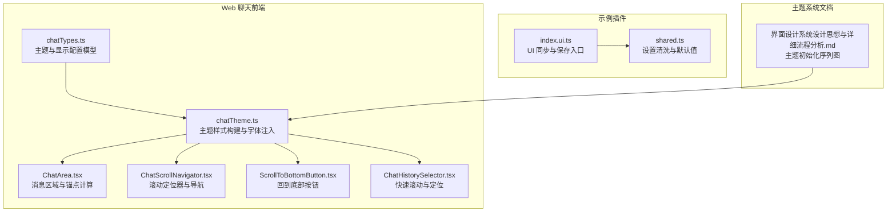
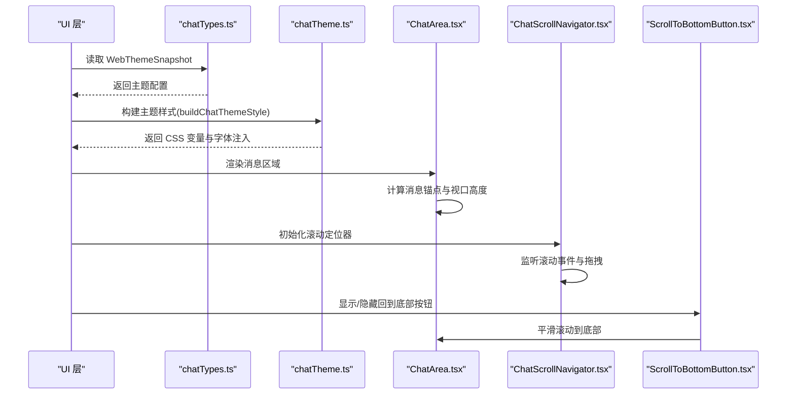
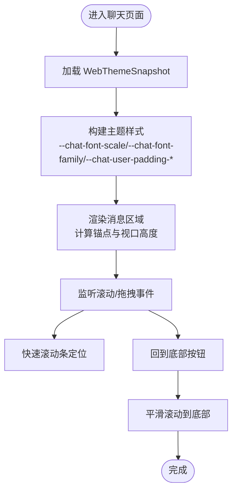
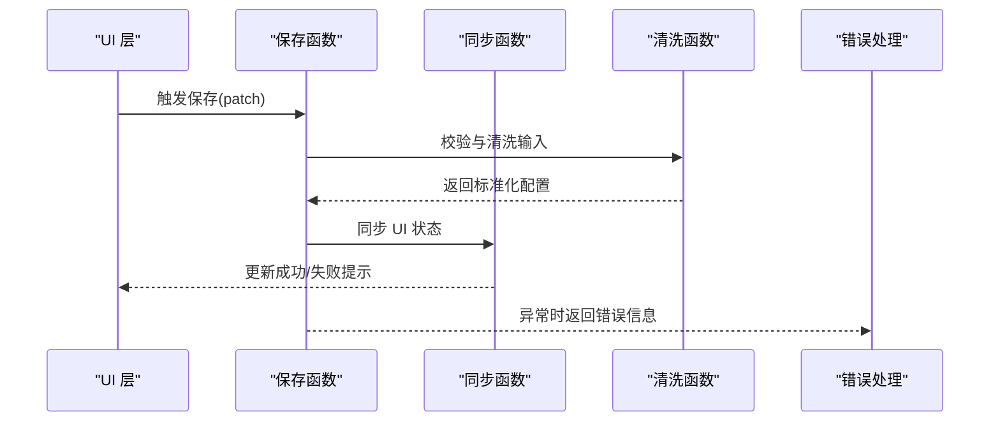
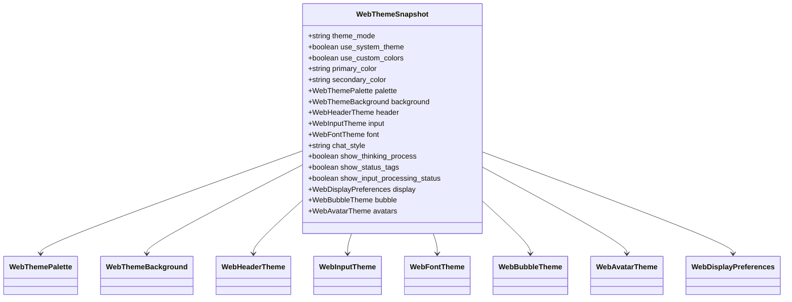
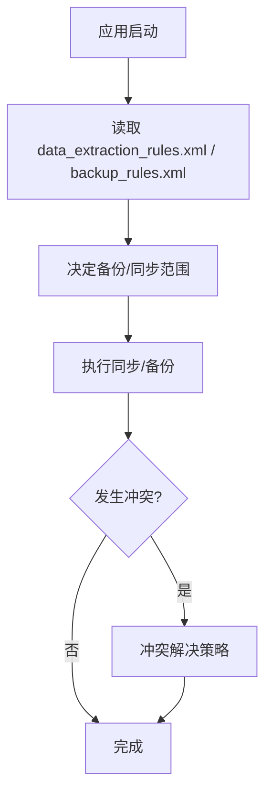
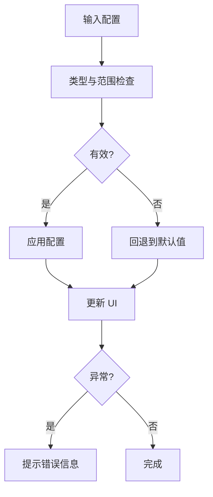
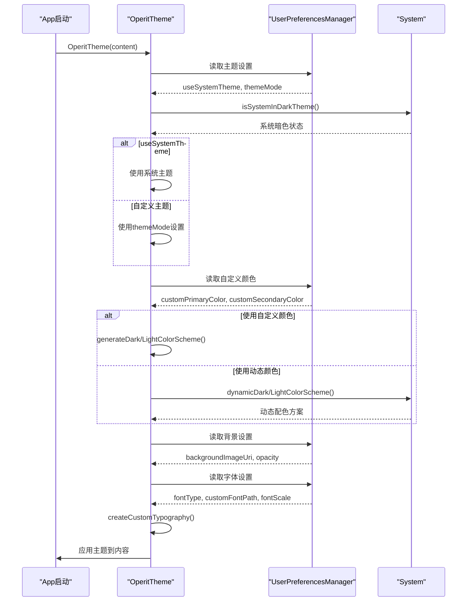
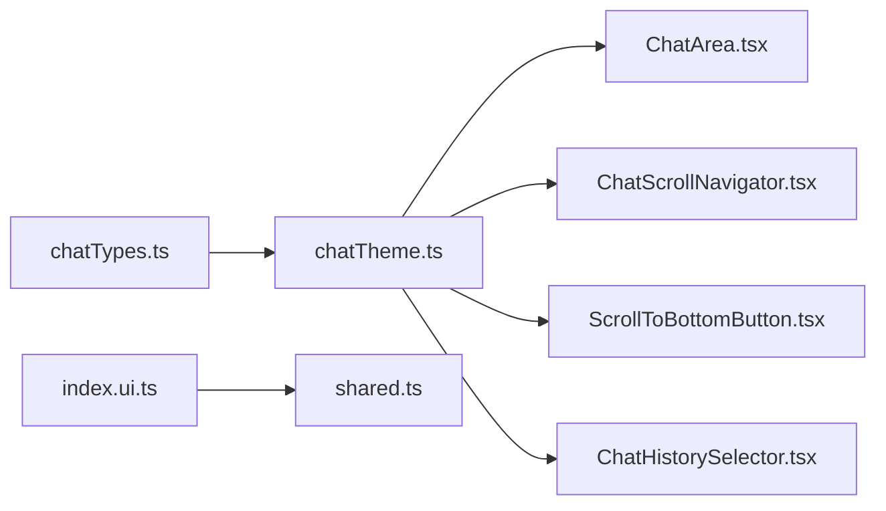

# 自定义配置

<cite>
**本文引用的文件**
- [web-chat/src/ui/features/chat/util/chatTypes.ts](file://web-chat/src/ui/features/chat/util/chatTypes.ts)
- [web-chat/src/ui/features/chat/util/chatTheme.ts](file://web-chat/src/ui/features/chat/util/chatTheme.ts)
- [web-chat/src/ui/features/chat/components/ChatArea.tsx](file://web-chat/src/ui/features/chat/components/ChatArea.tsx)
- [web-chat/src/ui/features/chat/components/ChatScrollNavigator.tsx](file://web-chat/src/ui/features/chat/components/ChatScrollNavigator.tsx)
- [web-chat/src/ui/features/chat/components/ScrollToBottomButton.tsx](file://web-chat/src/ui/features/chat/components/ScrollToBottomButton.tsx)
- [web-chat/src/ui/features/chat/components/ChatHistorySelector.tsx](file://web-chat/src/ui/features/chat/components/ChatHistorySelector.tsx)
- [examples/message_insert/src/ui/index.ui.ts](file://examples/message_insert/src/ui/index.ui.ts)
- [examples/message_insert/src/shared.ts](file://examples/message_insert/src/shared.ts)
- [examples/daily_life.ts](file://examples/daily_life.ts)
- [my_docs/Operit 界面设计系统设计思想与详细流程分析.md](file://my_docs/Operit 界面设计系统设计思想与详细流程分析.md)
- [tools/desktop/app/src/main/res/xml/data_extraction_rules.xml](file://tools/desktop/app/src/main/res/xml/data_extraction_rules.xml)
- [tools/shower/app/src/main/res/xml/data_extraction_rules.xml](file://tools/shower/app/src/main/res/xml/data_extraction_rules.xml)
- [app/src/main/assets/templates/android/app/src/main/res/xml/data_extraction_rules.xml](file://app/src/main/assets/templates/android/app/src/main/res/xml/data_extraction_rules.xml)
- [tools/desktop/app/src/main/res/xml/backup_rules.xml](file://tools/desktop/app/src/main/res/xml/backup_rules.xml)
- [tools/shower/app/src/main/res/xml/backup_rules.xml](file://tools/shower/app/src/main/res/xml/backup_rules.xml)
- [app/src/main/assets/templates/android/app/src/main/res/xml/backup_rules.xml](file://app/src/main/assets/templates/android/app/src/main/res/xml/backup_rules.xml)
</cite>

## 目录
1. [简介](#简介)
2. [项目结构](#项目结构)
3. [核心组件](#核心组件)
4. [架构总览](#架构总览)
5. [详细组件分析](#详细组件分析)
6. [依赖关系分析](#依赖关系分析)
7. [性能考量](#性能考量)
8. [故障排查指南](#故障排查指南)
9. [结论](#结论)
10. [附录](#附录)

## 简介
本文件为 Operit 的自定义配置系统提供全面技术文档，覆盖显示偏好设置（字体大小、聊天边距、滚动行为）、用户偏好管理（持久化、默认值、迁移）、界面定制（主题参数、布局选项、显示模式）、配置同步与备份恢复、配置验证与错误处理、配置扩展指南以及性能、安全与用户体验设计建议。文档同时面向用户与开发者，既提供使用说明也提供扩展与维护指导。

## 项目结构
Operit 的配置体系横跨 Web 聊天前端、示例插件与主题系统文档三部分：
- Web 聊天前端：定义主题快照、样式构建与滚动导航等 UI 配置能力
- 示例插件：演示设置项的持久化、校验与回退机制
- 主题系统文档：阐述主题初始化流程与配置来源

**图表来源**
- [web-chat/src/ui/features/chat/util/chatTypes.ts:200-220](file://web-chat/src/ui/features/chat/util/chatTypes.ts#L200-L220)
- [web-chat/src/ui/features/chat/util/chatTheme.ts:122-268](file://web-chat/src/ui/features/chat/util/chatTheme.ts#L122-L268)
- [web-chat/src/ui/features/chat/components/ChatArea.tsx:69-163](file://web-chat/src/ui/features/chat/components/ChatArea.tsx#L69-L163)
- [web-chat/src/ui/features/chat/components/ChatScrollNavigator.tsx:391-512](file://web-chat/src/ui/features/chat/components/ChatScrollNavigator.tsx#L391-L512)
- [web-chat/src/ui/features/chat/components/ScrollToBottomButton.tsx:1-125](file://web-chat/src/ui/features/chat/components/ScrollToBottomButton.tsx#L1-L125)
- [web-chat/src/ui/features/chat/components/ChatHistorySelector.tsx:142-359](file://web-chat/src/ui/features/chat/components/ChatHistorySelector.tsx#L142-L359)
- [examples/message_insert/src/ui/index.ui.ts:248-283](file://examples/message_insert/src/ui/index.ui.ts#L248-L283)
- [examples/message_insert/src/shared.ts:476-506](file://examples/message_insert/src/shared.ts#L476-L506)
- [my_docs/Operit 界面设计系统设计思想与详细流程分析.md:222-263](file://my_docs/Operit 界面设计系统设计思想与详细流程分析.md#L222-L263)

**章节来源**
- [web-chat/src/ui/features/chat/util/chatTypes.ts:111-220](file://web-chat/src/ui/features/chat/util/chatTypes.ts#L111-L220)
- [web-chat/src/ui/features/chat/util/chatTheme.ts:1-268](file://web-chat/src/ui/features/chat/util/chatTheme.ts#L1-L268)
- [examples/message_insert/src/ui/index.ui.ts:248-283](file://examples/message_insert/src/ui/index.ui.ts#L248-L283)
- [examples/message_insert/src/shared.ts:476-506](file://examples/message_insert/src/shared.ts#L476-L506)
- [my_docs/Operit 界面设计系统设计思想与详细流程分析.md:222-263](file://my_docs/Operit 界面设计系统设计思想与详细流程分析.md#L222-L263)

## 核心组件
- 主题快照与显示配置模型：定义主题模式、系统跟随、自定义颜色、背景、字体、气泡与头像等配置项的数据结构
- 主题样式构建：根据主题快照生成 CSS 变量与字体注入规则
- 消息区域与滚动：基于消息时间戳锚点与视口高度进行滚动定位与导航
- 设置持久化与校验：示例插件展示设置保存、UI 同步、错误提示与默认值回退

**章节来源**
- [web-chat/src/ui/features/chat/util/chatTypes.ts:200-220](file://web-chat/src/ui/features/chat/util/chatTypes.ts#L200-L220)
- [web-chat/src/ui/features/chat/util/chatTheme.ts:122-268](file://web-chat/src/ui/features/chat/util/chatTheme.ts#L122-L268)
- [examples/message_insert/src/ui/index.ui.ts:248-283](file://examples/message_insert/src/ui/index.ui.ts#L248-L283)
- [examples/message_insert/src/shared.ts:476-506](file://examples/message_insert/src/shared.ts#L476-L506)

## 架构总览
下图展示了从“主题快照”到“UI 应用”的端到端路径，以及滚动导航与按钮交互的关键节点。

**图表来源**
- [web-chat/src/ui/features/chat/util/chatTypes.ts:200-220](file://web-chat/src/ui/features/chat/util/chatTypes.ts#L200-L220)
- [web-chat/src/ui/features/chat/util/chatTheme.ts:122-268](file://web-chat/src/ui/features/chat/util/chatTheme.ts#L122-L268)
- [web-chat/src/ui/features/chat/components/ChatArea.tsx:122-156](file://web-chat/src/ui/features/chat/components/ChatArea.tsx#L122-L156)
- [web-chat/src/ui/features/chat/components/ChatScrollNavigator.tsx:391-512](file://web-chat/src/ui/features/chat/components/ChatScrollNavigator.tsx#L391-L512)
- [web-chat/src/ui/features/chat/components/ScrollToBottomButton.tsx:1-125](file://web-chat/src/ui/features/chat/components/ScrollToBottomButton.tsx#L1-L125)

## 详细组件分析

### 显示偏好设置：字体大小、聊天边距、滚动行为
- 字体大小与字体族
  - 字体缩放 scale 与系统字体名 system_font_name、自定义字体 custom_font_asset_url 共同决定最终字体渲染
  - 主题样式构建会生成 --chat-font-scale 与 --chat-font-family，并支持注入自定义字体资源
- 聊天边距与气泡圆角
  - 用户与助手气泡的左右内边距 user_padding_left/right、assistant_padding_left/right 控制文本留白
  - 圆角 user_rounded/assistant_rounded 控制气泡形状
- 滚动行为
  - 消息区域通过消息时间戳锚点与视口高度计算，支持平滑滚动与导航
  - 快速滚动条与“回到底部”按钮提升长对话体验

**图表来源**
- [web-chat/src/ui/features/chat/util/chatTheme.ts:122-268](file://web-chat/src/ui/features/chat/util/chatTheme.ts#L122-L268)
- [web-chat/src/ui/features/chat/components/ChatArea.tsx:122-156](file://web-chat/src/ui/features/chat/components/ChatArea.tsx#L122-L156)
- [web-chat/src/ui/features/chat/components/ChatScrollNavigator.tsx:391-512](file://web-chat/src/ui/features/chat/components/ChatScrollNavigator.tsx#L391-L512)
- [web-chat/src/ui/features/chat/components/ScrollToBottomButton.tsx:1-125](file://web-chat/src/ui/features/chat/components/ScrollToBottomButton.tsx#L1-L125)

**章节来源**
- [web-chat/src/ui/features/chat/util/chatTypes.ts:146-182](file://web-chat/src/ui/features/chat/util/chatTypes.ts#L146-L182)
- [web-chat/src/ui/features/chat/util/chatTheme.ts:122-268](file://web-chat/src/ui/features/chat/util/chatTheme.ts#L122-L268)
- [web-chat/src/ui/features/chat/components/ChatArea.tsx:122-156](file://web-chat/src/ui/features/chat/components/ChatArea.tsx#L122-L156)
- [web-chat/src/ui/features/chat/components/ChatScrollNavigator.tsx:391-512](file://web-chat/src/ui/features/chat/components/ChatScrollNavigator.tsx#L391-L512)
- [web-chat/src/ui/features/chat/components/ScrollToBottomButton.tsx:1-125](file://web-chat/src/ui/features/chat/components/ScrollToBottomButton.tsx#L1-L125)

### 用户偏好管理：持久化、默认值、迁移
- 持久化与保存
  - UI 层调用保存函数，成功后同步更新本地状态并清空错误提示
  - 失败时捕获异常，拼接错误信息并提示用户
- 默认值与清洗
  - 对布尔、数值与字符串字段进行类型转换与范围校验，确保数值为有限整数且不小于阈值
  - 未提供的字段采用默认值，保证配置完整性
- 迁移策略
  - 新增字段时应保持向后兼容；对废弃字段提供映射或清理逻辑

**图表来源**
- [examples/message_insert/src/ui/index.ui.ts:248-283](file://examples/message_insert/src/ui/index.ui.ts#L248-L283)
- [examples/message_insert/src/shared.ts:476-506](file://examples/message_insert/src/shared.ts#L476-L506)

**章节来源**
- [examples/message_insert/src/ui/index.ui.ts:248-283](file://examples/message_insert/src/ui/index.ui.ts#L248-L283)
- [examples/message_insert/src/shared.ts:476-506](file://examples/message_insert/src/shared.ts#L476-L506)

### 界面定制：主题参数、布局选项、显示模式
- 主题参数
  - 主题模式 theme_mode、系统跟随 use_system_theme、自定义颜色 use_custom_colors、主/次色与调色板 palette
  - 背景类型、资源地址与透明度 background
  - 字体类型、系统字体名、自定义字体资源与缩放 font
- 布局选项
  - 头部 header（透明/覆盖）、输入区 input（透明/浮动/液态玻璃等）
  - 气泡 bubble（头像显隐、宽布局、跟随/自定义颜色、圆角、内边距、图像主题）
  - 头像 avatars（形状与圆角）
- 显示模式
  - 聊天样式 chat_style、思考过程与状态标签显示开关

**图表来源**
- [web-chat/src/ui/features/chat/util/chatTypes.ts:111-220](file://web-chat/src/ui/features/chat/util/chatTypes.ts#L111-L220)

**章节来源**
- [web-chat/src/ui/features/chat/util/chatTypes.ts:111-220](file://web-chat/src/ui/features/chat/util/chatTypes.ts#L111-L220)
- [web-chat/src/ui/features/chat/util/chatTheme.ts:122-268](file://web-chat/src/ui/features/chat/util/chatTheme.ts#L122-L268)
- [my_docs/Operit 界面设计系统设计思想与详细流程分析.md:222-263](file://my_docs/Operit 界面设计系统设计思想与详细流程分析.md#L222-L263)

### 配置同步机制：多设备、云端备份与冲突解决
- 数据提取与备份规则
  - Android 平台通过 data_extraction_rules.xml 与 backup_rules.xml 控制云端备份与设备传输的内容范围
  - 建议在应用层明确哪些配置参与备份，避免敏感信息泄露
- 冲突解决
  - 建议引入“最后写入者获胜”或“合并策略”，并在 UI 中提供冲突提示与手动选择

**图表来源**
- [tools/desktop/app/src/main/res/xml/data_extraction_rules.xml:1-19](file://tools/desktop/app/src/main/res/xml/data_extraction_rules.xml#L1-L19)
- [tools/shower/app/src/main/res/xml/data_extraction_rules.xml:1-19](file://tools/shower/app/src/main/res/xml/data_extraction_rules.xml#L1-L19)
- [app/src/main/assets/templates/android/app/src/main/res/xml/data_extraction_rules.xml:1-19](file://app/src/main/assets/templates/android/app/src/main/res/xml/data_extraction_rules.xml#L1-L19)
- [tools/desktop/app/src/main/res/xml/backup_rules.xml:1-13](file://tools/desktop/app/src/main/res/xml/backup_rules.xml#L1-L13)
- [tools/shower/app/src/main/res/xml/backup_rules.xml:1-13](file://tools/shower/app/src/main/res/xml/backup_rules.xml#L1-L13)
- [app/src/main/assets/templates/android/app/src/main/res/xml/backup_rules.xml:1-13](file://app/src/main/assets/templates/android/app/src/main/res/xml/backup_rules.xml#L1-L13)

**章节来源**
- [tools/desktop/app/src/main/res/xml/data_extraction_rules.xml:1-19](file://tools/desktop/app/src/main/res/xml/data_extraction_rules.xml#L1-L19)
- [tools/shower/app/src/main/res/xml/data_extraction_rules.xml:1-19](file://tools/shower/app/src/main/res/xml/data_extraction_rules.xml#L1-L19)
- [app/src/main/assets/templates/android/app/src/main/res/xml/data_extraction_rules.xml:1-19](file://app/src/main/assets/templates/android/app/src/main/res/xml/data_extraction_rules.xml#L1-L19)
- [tools/desktop/app/src/main/res/xml/backup_rules.xml:1-13](file://tools/desktop/app/src/main/res/xml/backup_rules.xml#L1-L13)
- [tools/shower/app/src/main/res/xml/backup_rules.xml:1-13](file://tools/shower/app/src/main/res/xml/backup_rules.xml#L1-L13)
- [app/src/main/assets/templates/android/app/src/main/res/xml/backup_rules.xml:1-13](file://app/src/main/assets/templates/android/app/src/main/res/xml/backup_rules.xml#L1-L13)

### 配置验证与错误处理：无效设置检测、回退机制、用户提示
- 输入验证
  - 数值必须为有限且满足下限；布尔值支持多种字符串形式；字符串需非空
- 回退机制
  - 未提供或非法的字段回退到默认值，保证 UI 正常渲染
- 用户提示
  - 保存失败时以统一前缀提示错误信息，区分业务错误与未知错误

**图表来源**
- [examples/message_insert/src/shared.ts:476-506](file://examples/message_insert/src/shared.ts#L476-L506)
- [examples/message_insert/src/ui/index.ui.ts:266-283](file://examples/message_insert/src/ui/index.ui.ts#L266-L283)

**章节来源**
- [examples/message_insert/src/shared.ts:476-506](file://examples/message_insert/src/shared.ts#L476-L506)
- [examples/message_insert/src/ui/index.ui.ts:266-283](file://examples/message_insert/src/ui/index.ui.ts#L266-L283)

### 配置扩展指南：新增设置项、设置联动、复杂配置
- 新增设置项
  - 在主题快照模型中增加字段，提供默认值与清洗逻辑
  - 在主题样式构建中映射到 CSS 变量或字体注入
- 设置联动
  - 例如“系统跟随主题”与“自定义颜色”互斥，应在 UI 层与保存逻辑中强制约束
- 复杂配置
  - 将相关联的子配置封装为对象（如 palette、background），便于迁移与维护

**章节来源**
- [web-chat/src/ui/features/chat/util/chatTypes.ts:111-220](file://web-chat/src/ui/features/chat/util/chatTypes.ts#L111-L220)
- [web-chat/src/ui/features/chat/util/chatTheme.ts:122-268](file://web-chat/src/ui/features/chat/util/chatTheme.ts#L122-L268)

### 主题初始化流程（参考文档）

**图表来源**
- [my_docs/Operit 界面设计系统设计思想与详细流程分析.md:222-263](file://my_docs/Operit 界面设计系统设计思想与详细流程分析.md#L222-L263)

**章节来源**
- [my_docs/Operit 界面设计系统设计思想与详细流程分析.md:222-263](file://my_docs/Operit 界面设计系统设计思想与详细流程分析.md#L222-L263)

## 依赖关系分析
- 类型依赖
  - chatTheme.ts 依赖 chatTypes.ts 中的主题快照与各子配置类型
- 组件依赖
  - ChatArea.tsx 依赖锚点计算与视口高度
  - ChatScrollNavigator.tsx 与 ScrollToBottomButton.tsx 协作实现滚动导航与回到底部
  - ChatHistorySelector.tsx 提供快速滚动轨道与跳转
- 插件依赖
  - 示例插件 UI 层依赖保存与清洗函数，实现设置持久化与错误提示

**图表来源**
- [web-chat/src/ui/features/chat/util/chatTypes.ts:200-220](file://web-chat/src/ui/features/chat/util/chatTypes.ts#L200-L220)
- [web-chat/src/ui/features/chat/util/chatTheme.ts:122-268](file://web-chat/src/ui/features/chat/util/chatTheme.ts#L122-L268)
- [web-chat/src/ui/features/chat/components/ChatArea.tsx:122-156](file://web-chat/src/ui/features/chat/components/ChatArea.tsx#L122-L156)
- [web-chat/src/ui/features/chat/components/ChatScrollNavigator.tsx:391-512](file://web-chat/src/ui/features/chat/components/ChatScrollNavigator.tsx#L391-L512)
- [web-chat/src/ui/features/chat/components/ScrollToBottomButton.tsx:1-125](file://web-chat/src/ui/features/chat/components/ScrollToBottomButton.tsx#L1-L125)
- [web-chat/src/ui/features/chat/components/ChatHistorySelector.tsx:142-359](file://web-chat/src/ui/features/chat/components/ChatHistorySelector.tsx#L142-L359)
- [examples/message_insert/src/ui/index.ui.ts:248-283](file://examples/message_insert/src/ui/index.ui.ts#L248-L283)
- [examples/message_insert/src/shared.ts:476-506](file://examples/message_insert/src/shared.ts#L476-L506)

**章节来源**
- [web-chat/src/ui/features/chat/util/chatTypes.ts:200-220](file://web-chat/src/ui/features/chat/util/chatTypes.ts#L200-L220)
- [web-chat/src/ui/features/chat/util/chatTheme.ts:122-268](file://web-chat/src/ui/features/chat/util/chatTheme.ts#L122-L268)
- [examples/message_insert/src/ui/index.ui.ts:248-283](file://examples/message_insert/src/ui/index.ui.ts#L248-L283)
- [examples/message_insert/src/shared.ts:476-506](file://examples/message_insert/src/shared.ts#L476-L506)

## 性能考量
- 滚动锚点与视口观测
  - 使用 ResizeObserver 监听容器尺寸变化，避免频繁重排
  - 锚点计算仅在消息列表变化时重建，减少开销
- 字体与样式
  - 自定义字体按需注入，避免重复加载
  - CSS 变量缓存与最小化变更，降低重绘成本
- 保存与校验
  - 在 UI 层进行轻量校验与默认值填充，减少后端压力

[本节为通用指导，无需特定文件引用]

## 故障排查指南
- 保存失败
  - 检查错误信息前缀与异常堆栈，确认是参数校验还是运行时错误
  - 若为数值越界或类型不符，修正输入后再试
- 主题不生效
  - 确认主题快照字段是否正确传入，CSS 变量是否被覆盖
  - 检查自定义字体资源 URL 是否可达
- 滚动异常
  - 确认消息锚点是否正确计算，视口高度是否及时更新
  - 关闭可能干扰滚动的全局样式或第三方脚本

**章节来源**
- [examples/message_insert/src/ui/index.ui.ts:266-283](file://examples/message_insert/src/ui/index.ui.ts#L266-L283)
- [web-chat/src/ui/features/chat/util/chatTheme.ts:122-268](file://web-chat/src/ui/features/chat/util/chatTheme.ts#L122-L268)
- [web-chat/src/ui/features/chat/components/ChatArea.tsx:122-156](file://web-chat/src/ui/features/chat/components/ChatArea.tsx#L122-L156)

## 结论
Operit 的自定义配置系统以“主题快照 + 样式构建 + UI 组件”为核心，结合示例插件的设置持久化与校验实践，形成了从数据模型到界面渲染、从滚动导航到错误处理的完整链路。通过合理的默认值与回退机制、清晰的配置迁移策略以及备份规则的约束，系统在保证可用性的同时兼顾了扩展性与安全性。

[本节为总结，无需特定文件引用]

## 附录
- 深夜模式切换示例（系统命令）
  - 通过系统命令切换夜间模式，体现配置对系统层面的影响

**章节来源**
- [examples/daily_life.ts:1196-1230](file://examples/daily_life.ts#L1196-L1230)