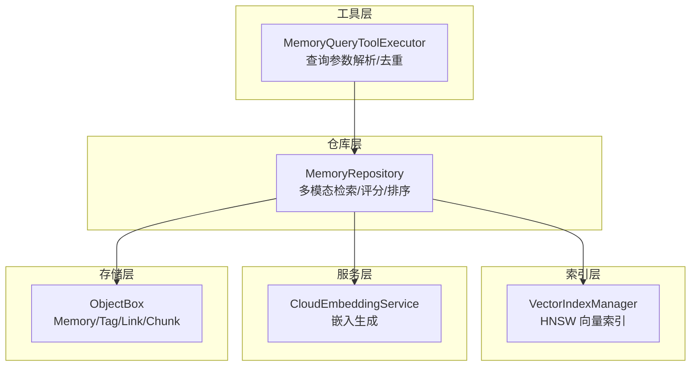
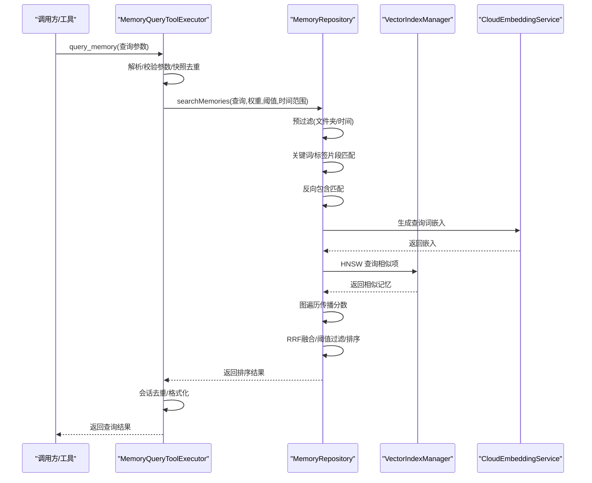
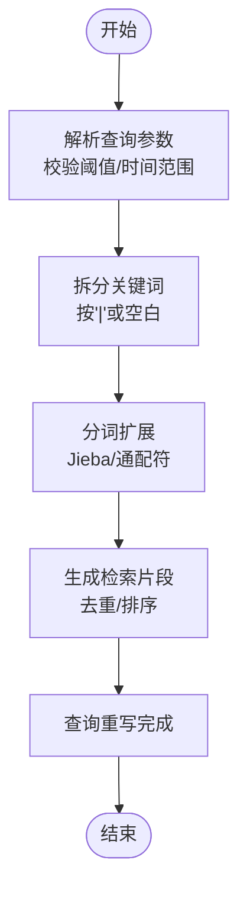
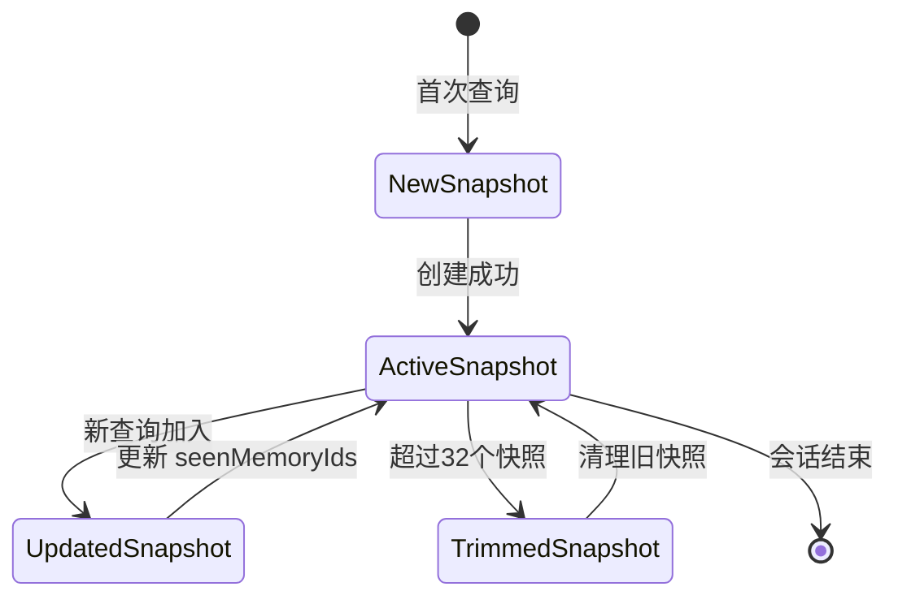
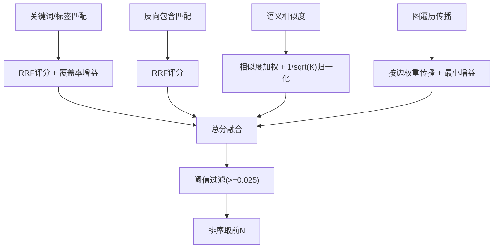
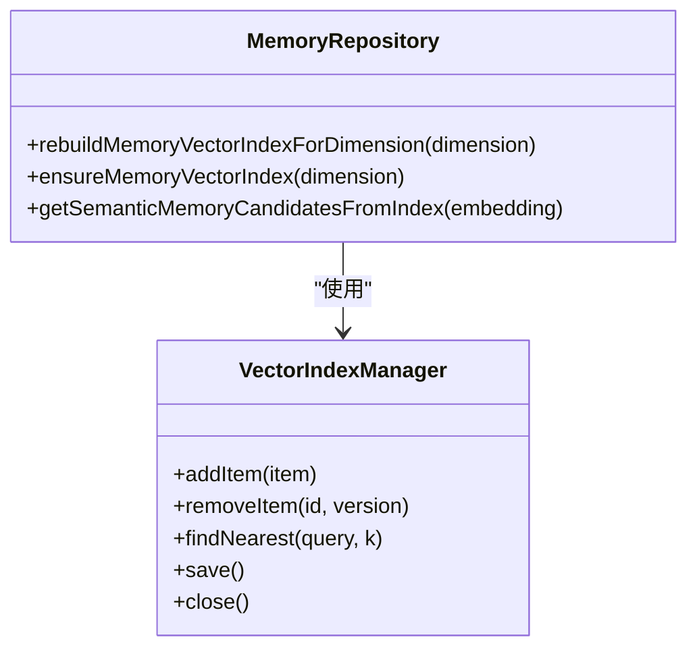
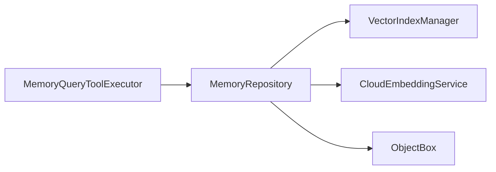

# 检索优化策略

<cite>
**本文引用的文件**
- [MemoryRepository.kt](file://app/src/main/java/com/ai/assistance/operit/data/repository/MemoryRepository.kt)
- [MemoryQueryToolExecutor.kt](file://app/src/main/java/com/ai/assistance/operit/core/tools/defaultTool/standard/MemoryQueryToolExecutor.kt)
- [MemorySearchConfig.kt](file://app/src/main/java/com/ai/assistance/operit/data/model/MemorySearchConfig.kt)
- [CloudEmbeddingService.kt](file://app/src/main/java/com/ai/assistance/operit/services/CloudEmbeddingService.kt)
- [VectorIndexManager.kt](file://app/src/main/java/com/ai/assistance/operit/util/vector/VectorIndexManager.kt)
- [Memory.kt](file://app/src/main/java/com/ai/assistance/operit/data/model/Memory.kt)
- [memory_scoring_sim.py](file://tools/memory/memory_scoring_sim.py)
- [Operit 记忆管理系统设计思想与详细流程分析.md](file://my_docs/Operit 记忆管理系统设计思想与详细流程分析.md)
- [memory_candidate_scoring_formula.md](file://docs/memory_candidate_scoring_formula.md)
- [zhipu_search.js](file://examples/zhipu_search.js)
- [index.js](file://app/src/main/assets/bridge/index.js)
- [logger.js](file://examples/windows_control/resources/pc_agent/operit-pc-agent/src/lib/logger.js)
</cite>

## 目录
1. [简介](#简介)
2. [项目结构](#项目结构)
3. [核心组件](#核心组件)
4. [架构总览](#架构总览)
5. [详细组件分析](#详细组件分析)
6. [依赖关系分析](#依赖关系分析)
7. [性能考虑](#性能考虑)
8. [故障排查指南](#故障排查指南)
9. [结论](#结论)
10. [附录](#附录)

## 简介
本文件围绕 Operit 的检索优化策略，系统阐述查询解析、查询重写、查询缓存与去重、索引优化、并行与分页、排序与相关性控制、以及调试与监控方案。文档以代码为依据，结合设计文档与模拟脚本，给出可操作的优化建议与最佳实践，帮助开发者在保证检索质量的同时提升性能与可扩展性。

## 项目结构
检索系统主要由以下层次构成：
- 工具执行层：负责接收查询参数、解析与校验、调用仓库层执行搜索，并进行会话级去重。
- 仓库层：负责关键词/标签/语义/图遍历的多模态混合检索、评分融合、阈值过滤与排序。
- 向量索引层：基于 HNSW 的近似最近邻检索，按维度分文件存储，支持增量重建。
- 嵌入服务层：调用云端嵌入服务生成向量，支撑语义检索。
- 持久化层：ObjectBox 存储记忆、标签、链接、分块等实体。
- 工具桥与日志：提供工具缓存、日志记录与监控能力。

**图表来源**
- [MemoryQueryToolExecutor.kt:185-308](file://app/src/main/java/com/ai/assistance/operit/core/tools/defaultTool/standard/MemoryQueryToolExecutor.kt#L185-L308)
- [MemoryRepository.kt:1131-1596](file://app/src/main/java/com/ai/assistance/operit/data/repository/MemoryRepository.kt#L1131-L1596)
- [VectorIndexManager.kt:14-91](file://app/src/main/java/com/ai/assistance/operit/util/vector/VectorIndexManager.kt#L14-L91)
- [CloudEmbeddingService.kt:37-61](file://app/src/main/java/com/ai/assistance/operit/services/CloudEmbeddingService.kt#L37-L61)
- [Memory.kt:17-69](file://app/src/main/java/com/ai/assistance/operit/data/model/Memory.kt#L17-L69)

**章节来源**
- [MemoryQueryToolExecutor.kt:185-308](file://app/src/main/java/com/ai/assistance/operit/core/tools/defaultTool/standard/MemoryQueryToolExecutor.kt#L185-L308)
- [MemoryRepository.kt:1131-1596](file://app/src/main/java/com/ai/assistance/operit/data/repository/MemoryRepository.kt#L1131-L1596)
- [VectorIndexManager.kt:14-91](file://app/src/main/java/com/ai/assistance/operit/util/vector/VectorIndexManager.kt#L14-L91)
- [CloudEmbeddingService.kt:37-61](file://app/src/main/java/com/ai/assistance/operit/services/CloudEmbeddingService.kt#L37-L61)
- [Memory.kt:17-69](file://app/src/main/java/com/ai/assistance/operit/data/model/Memory.kt#L17-L69)

## 核心组件
- 查询执行器（MemoryQueryToolExecutor）
  - 负责解析查询参数、时间范围、阈值、快照 ID、默认 limit 等；调用仓库层执行搜索；进行会话级去重与结果格式化。
  - 关键机制：查询快照（ConcurrentHashMap + LRU）、去重锁（synchronized）、默认 limit 控制。
- 仓库层（MemoryRepository）
  - 多模态检索：关键词/标签片段匹配、反向包含、语义相似、图遍历传播。
  - 评分融合：RRF 排名衰减、覆盖率增益、语义相似度归一化、图传播最小增益。
  - 索引管理：按维度分文件的 HNSW 索引、增量重建、文档分块索引。
- 向量索引（VectorIndexManager）
  - HNSW 近似最近邻、Cosine 距离、动态容量、序列化保存。
- 嵌入服务（CloudEmbeddingService）
  - 统一的嵌入生成入口，错误解析与超时控制。
- 数据模型（Memory/Tag/Link/Chunk）
  - 记忆实体、标签、链接、文档分块，支持向量化与图遍历。

**章节来源**
- [MemoryQueryToolExecutor.kt:36-124](file://app/src/main/java/com/ai/assistance/operit/core/tools/defaultTool/standard/MemoryQueryToolExecutor.kt#L36-L124)
- [MemoryRepository.kt:1131-1596](file://app/src/main/java/com/ai/assistance/operit/data/repository/MemoryRepository.kt#L1131-L1596)
- [VectorIndexManager.kt:14-91](file://app/src/main/java/com/ai/assistance/operit/util/vector/VectorIndexManager.kt#L14-L91)
- [CloudEmbeddingService.kt:37-61](file://app/src/main/java/com/ai/assistance/operit/services/CloudEmbeddingService.kt#L37-L61)
- [Memory.kt:17-69](file://app/src/main/java/com/ai/assistance/operit/data/model/Memory.kt#L17-L69)

## 架构总览
检索流程从工具执行器开始，经过参数校验与快照去重，进入仓库层的多模态检索与评分融合，随后进行阈值过滤与排序，最终返回结果。语义检索依赖云端嵌入服务与 HNSW 索引，图遍历基于已有链接传播分数。

**图表来源**
- [MemoryQueryToolExecutor.kt:185-308](file://app/src/main/java/com/ai/assistance/operit/core/tools/defaultTool/standard/MemoryQueryToolExecutor.kt#L185-L308)
- [MemoryRepository.kt:1183-1596](file://app/src/main/java/com/ai/assistance/operit/data/repository/MemoryRepository.kt#L1183-L1596)
- [VectorIndexManager.kt:58-61](file://app/src/main/java/com/ai/assistance/operit/util/vector/VectorIndexManager.kt#L58-L61)
- [CloudEmbeddingService.kt:63-87](file://app/src/main/java/com/ai/assistance/operit/services/CloudEmbeddingService.kt#L63-L87)

## 详细组件分析

### 查询解析与重写
- 参数解析与校验
  - 支持查询、文件夹路径、时间范围、阈值、limit、快照 ID 等参数；对阈值与时间格式进行严格校验。
  - 通配符查询“*”在未显式 limit 时返回全部结果；普通查询默认 limit=20。
- 查询重写与预处理
  - 将查询按“|”或空白拆分为关键词，再对每个关键词进行分词扩展，生成检索片段（lexical fragments）。
  - 支持通配符（*）与长度/字符过滤，避免无效 token。
  - 反向包含：查询文本包含记忆标题的匹配，提升召回。

**图表来源**
- [MemoryQueryToolExecutor.kt:185-261](file://app/src/main/java/com/ai/assistance/operit/core/tools/defaultTool/standard/MemoryQueryToolExecutor.kt#L185-L261)
- [MemoryRepository.kt:189-209](file://app/src/main/java/com/ai/assistance/operit/data/repository/MemoryRepository.kt#L189-L209)
- [MemoryRepository.kt:634-684](file://app/src/main/java/com/ai/assistance/operit/data/repository/MemoryRepository.kt#L634-L684)

**章节来源**
- [MemoryQueryToolExecutor.kt:185-261](file://app/src/main/java/com/ai/assistance/operit/core/tools/defaultTool/standard/MemoryQueryToolExecutor.kt#L185-L261)
- [MemoryRepository.kt:189-209](file://app/src/main/java/com/ai/assistance/operit/data/repository/MemoryRepository.kt#L189-L209)
- [MemoryRepository.kt:634-684](file://app/src/main/java/com/ai/assistance/operit/data/repository/MemoryRepository.kt#L634-L684)

### 查询缓存与去重机制
- 会话级快照去重
  - 每个 profile 维护最多 32 个查询快照，LRU 淘汰；每次访问更新 lastAccessAtMs。
  - 同一快照内的已见记忆 ID 集合（ConcurrentHashMap）用于去重，使用 synchronized 锁保证并发安全。
- 工具缓存（桥接层）
  - 桥接层支持缓存客户端提供的工具清单，便于快速恢复与调试。

**图表来源**
- [MemoryQueryToolExecutor.kt:77-124](file://app/src/main/java/com/ai/assistance/operit/core/tools/defaultTool/standard/MemoryQueryToolExecutor.kt#L77-L124)

**章节来源**
- [MemoryQueryToolExecutor.kt:36-124](file://app/src/main/java/com/ai/assistance/operit/core/tools/defaultTool/standard/MemoryQueryToolExecutor.kt#L36-L124)
- [index.js:918-947](file://app/src/main/assets/bridge/index.js#L918-L947)

### 检索与评分融合
- 多模态检索
  - 关键词/标签：按检索片段匹配标题/标签，RRF 排名衰减 + 覆盖率增益。
  - 反向包含：查询文本包含记忆标题，RRF 加分。
  - 语义：对每个关键词生成嵌入，通过 HNSW 查询相似记忆，相似度加权并按关键词数量做 1/sqrt(K) 归一化。
  - 图遍历：以高分记忆为种子，按边权重传播分数，加入最小增益防止无意义传播。
- 阈值过滤与排序
  - 总分低于阈值（默认 0.025）的记忆过滤掉；按总分降序排序，取前 N 条。

**图表来源**
- [MemoryRepository.kt:1340-1596](file://app/src/main/java/com/ai/assistance/operit/data/repository/MemoryRepository.kt#L1340-L1596)
- [memory_candidate_scoring_formula.md:5-37](file://docs/memory_candidate_scoring_formula.md#L5-L37)

**章节来源**
- [MemoryRepository.kt:1340-1596](file://app/src/main/java/com/ai/assistance/operit/data/repository/MemoryRepository.kt#L1340-L1596)
- [memory_candidate_scoring_formula.md:5-37](file://docs/memory_candidate_scoring_formula.md#L5-L37)

### 索引与向量检索
- HNSW 索引
  - 按维度分文件存储，维度不一致的记忆不参与索引；支持增量重建与文档分块索引。
  - Cosine 距离，findNearest 返回前 K 个近邻；支持保存/加载索引文件。
- 增量重建
  - 新增/删除/更新记忆时重建受影响维度的索引，避免全量重建带来的开销。
- 文档分块索引
  - 文档节点的分块各自建立 HNSW 索引，便于文档内细粒度检索。

**图表来源**
- [VectorIndexManager.kt:14-91](file://app/src/main/java/com/ai/assistance/operit/util/vector/VectorIndexManager.kt#L14-L91)
- [MemoryRepository.kt:354-426](file://app/src/main/java/com/ai/assistance/operit/data/repository/MemoryRepository.kt#L354-L426)
- [MemoryRepository.kt:583-632](file://app/src/main/java/com/ai/assistance/operit/data/repository/MemoryRepository.kt#L583-L632)

**章节来源**
- [VectorIndexManager.kt:14-91](file://app/src/main/java/com/ai/assistance/operit/util/vector/VectorIndexManager.kt#L14-L91)
- [MemoryRepository.kt:354-426](file://app/src/main/java/com/ai/assistance/operit/data/repository/MemoryRepository.kt#L354-L426)
- [MemoryRepository.kt:583-632](file://app/src/main/java/com/ai/assistance/operit/data/repository/MemoryRepository.kt#L583-L632)

### 排序与相关性控制
- 排名衰减与覆盖率
  - RRF 公式：1/(k0 + r)，k0=60；覆盖率增益：λ=1 + 0.6*(命中文本片段数/总片段数)。
- 语义归一化
  - 1/sqrt(K) 归一化避免关键词数量带来的偏差；相似度加权与重要性平方根共同决定语义得分。
- 图传播
  - 从高分种子节点出发，按边权重传播分数，加入最小增益 β·W_edge，防止无意义扩散。
- 阈值过滤
  - 默认阈值 0.025，可通过参数调整，避免低相关结果污染。

**章节来源**
- [MemoryRepository.kt:247-271](file://app/src/main/java/com/ai/assistance/operit/data/repository/MemoryRepository.kt#L247-L271)
- [MemoryRepository.kt:1464-1510](file://app/src/main/java/com/ai/assistance/operit/data/repository/MemoryRepository.kt#L1464-L1510)
- [memory_candidate_scoring_formula.md:11-37](file://docs/memory_candidate_scoring_formula.md#L11-L37)

### 搜索调试与监控
- 日志与调试信息
  - 仓库层输出关键词片段、匹配数量、语义索引命中、图遍历边数、最终结果数量等调试信息。
  - 工具执行器记录查询参数、快照状态、去重数量与格式化结果。
- 工具缓存与桥接
  - 桥接层支持缓存客户端工具清单，便于快速恢复与调试。
- 运行时日志
  - 示例日志模块提供统一的日志写入与级别控制，便于生产环境观测。

**章节来源**
- [MemoryRepository.kt:1235-1271](file://app/src/main/java/com/ai/assistance/operit/data/repository/MemoryRepository.kt#L1235-L1271)
- [MemoryRepository.kt:1301-1320](file://app/src/main/java/com/ai/assistance/operit/data/repository/MemoryRepository.kt#L1301-L1320)
- [MemoryQueryToolExecutor.kt:263-303](file://app/src/main/java/com/ai/assistance/operit/core/tools/defaultTool/standard/MemoryQueryToolExecutor.kt#L263-L303)
- [index.js:918-947](file://app/src/main/assets/bridge/index.js#L918-L947)
- [logger.js:1-38](file://examples/windows_control/resources/pc_agent/operit-pc-agent/src/lib/logger.js#L1-L38)

## 依赖关系分析
- 组件耦合
  - MemoryQueryToolExecutor 依赖 MemoryRepository 与 MemorySearchSettingsPreferences；仓库层依赖 VectorIndexManager、CloudEmbeddingService、ObjectBox。
- 外部依赖
  - HNSW 库（hnswlib）、OkHttp（嵌入服务 HTTP 调用）、ObjectBox（本地存储）。
- 循环依赖
  - 未发现循环依赖；各层职责清晰，接口边界明确。

**图表来源**
- [MemoryQueryToolExecutor.kt:61-71](file://app/src/main/java/com/ai/assistance/operit/core/tools/defaultTool/standard/MemoryQueryToolExecutor.kt#L61-L71)
- [MemoryRepository.kt:90-104](file://app/src/main/java/com/ai/assistance/operit/data/repository/MemoryRepository.kt#L90-L104)

**章节来源**
- [MemoryQueryToolExecutor.kt:61-71](file://app/src/main/java/com/ai/assistance/operit/core/tools/defaultTool/standard/MemoryQueryToolExecutor.kt#L61-L71)
- [MemoryRepository.kt:90-104](file://app/src/main/java/com/ai/assistance/operit/data/repository/MemoryRepository.kt#L90-L104)

## 性能考虑
- 索引优化
  - 按维度分索引与增量重建显著降低重建成本；建议定期检查维度一致性，避免碎片化。
  - 文档分块索引提升细粒度检索效率，注意 chunk 数量与维度匹配。
- 查询优化
  - 预过滤（文件夹/时间）大幅缩小搜索空间；合理设置阈值与 limit。
  - 关键词扩展与通配符需平衡召回与性能，建议对高频查询进行缓存。
- 并行与分页
  - 语义检索可对每个关键词并行生成嵌入与查询，但需控制并发度与队列长度。
  - 分页加载：工具层默认 limit=20，通配符查询可设置为最大值；建议前端分页与后端游标结合。
- 内存与磁盘
  - 向量索引文件序列化到磁盘，启动时自动加载；建议监控索引文件大小与重建频率。
  - 嵌入服务超时与错误重试策略需平衡吞吐与延迟。

[本节为通用性能建议，不直接分析具体文件]

## 故障排查指南
- 嵌入服务异常
  - 检查配置完整性、网络连通性与响应解析；关注 HTTP 状态码与错误消息。
- 索引加载失败
  - 索引文件损坏时自动重建；检查磁盘权限与路径。
- 查询结果为空
  - 检查关键词分词、通配符使用、阈值设置与时间范围；确认维度匹配。
- 去重异常
  - 检查快照 ID 是否正确传递，确认并发锁逻辑与 LRU 清理策略。

**章节来源**
- [CloudEmbeddingService.kt:37-61](file://app/src/main/java/com/ai/assistance/operit/services/CloudEmbeddingService.kt#L37-L61)
- [VectorIndexManager.kt:26-45](file://app/src/main/java/com/ai/assistance/operit/util/vector/VectorIndexManager.kt#L26-L45)
- [MemoryQueryToolExecutor.kt:255-261](file://app/src/main/java/com/ai/assistance/operit/core/tools/defaultTool/standard/MemoryQueryToolExecutor.kt#L255-L261)

## 结论
Operit 的检索系统通过“关键词/标签/语义/图遍历”的多模态融合与 RRF 排名衰减、覆盖率增益、语义归一化与图传播，实现了高质量的召回与排序。配合 HNSW 近似索引、增量重建与会话级去重，系统在准确性与性能之间取得良好平衡。建议在实际部署中结合业务场景调整权重、阈值与分页策略，并完善监控与日志体系以持续优化。

[本节为总结性内容，不直接分析具体文件]

## 附录

### 优化实例与最佳实践
- 分析查询性能瓶颈
  - 使用仓库层调试信息定位：关键词匹配数、语义索引命中、图遍历边数、阈值过滤比例。
  - 若语义检索耗时高，优先检查嵌入服务可用性与并发配置。
- 选择合适的索引策略
  - 高频关键词建议启用分词扩展与覆盖率增益；长尾查询可放宽阈值或增加 tag 权重。
  - 文档检索优先使用文档分块索引，减少全量扫描。
- 平衡内存使用与查询速度
  - 控制维度数量与索引文件大小；定期清理无用索引文件。
  - 合理设置重建频率，避免频繁重建造成抖动。

**章节来源**
- [MemoryRepository.kt:1235-1271](file://app/src/main/java/com/ai/assistance/operit/data/repository/MemoryRepository.kt#L1235-L1271)
- [MemoryRepository.kt:1415-1462](file://app/src/main/java/com/ai/assistance/operit/data/repository/MemoryRepository.kt#L1415-L1462)
- [Operit 记忆管理系统设计思想与详细流程分析.md:725-737](file://my_docs/Operit 记忆管理系统设计思想与详细流程分析.md#L725-L737)

### 相关性与排序公式对照
- 关键词/反向包含：Δ = (p_m · W_kw)/(k0 + r) · λ
- 语义：Δ_sem = (√p_m)/(k0 + r_t) + W_sem · sim(m,t)，再按 K 做 1/sqrt(K) 归一化
- 图传播：Δ_graph(u→v) = S(u) · w_uv · W_edge + β · W_edge
- 总分：S(m) = ΣΔ_kw + ΣΔ_rev + ΣΔ_sem + ΣΔ_graph，≥ θ 保留

**章节来源**
- [memory_candidate_scoring_formula.md:5-37](file://docs/memory_candidate_scoring_formula.md#L5-L37)
- [MemoryRepository.kt:247-271](file://app/src/main/java/com/ai/assistance/operit/data/repository/MemoryRepository.kt#L247-L271)
- [MemoryRepository.kt:1464-1510](file://app/src/main/java/com/ai/assistance/operit/data/repository/MemoryRepository.kt#L1464-L1510)

### 检索测试与验证
- 在线检索示例
  - 示例脚本提供在线检索与延迟统计，可用于端到端验证。
- 评分模拟与公平性分析
  - Python 脚本提供评分重现、蒙特卡洛公平性仿真与热力图可视化，便于验证不同权重与阈值的效果。

**章节来源**
- [zhipu_search.js:124-139](file://examples/zhipu_search.js#L124-L139)
- [memory_scoring_sim.py:745-800](file://tools/memory/memory_scoring_sim.py#L745-L800)
- [memory_scoring_sim.py:550-614](file://tools/memory/memory_scoring_sim.py#L550-L614)
- [memory_scoring_sim.py:665-721](file://tools/memory/memory_scoring_sim.py#L665-L721)