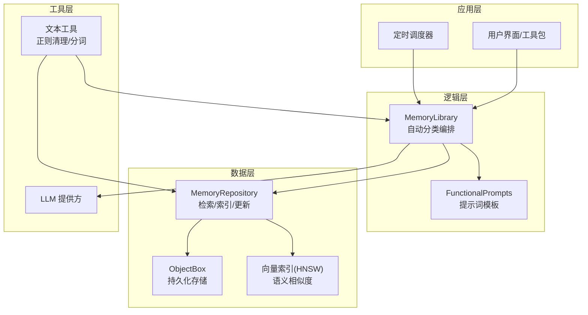
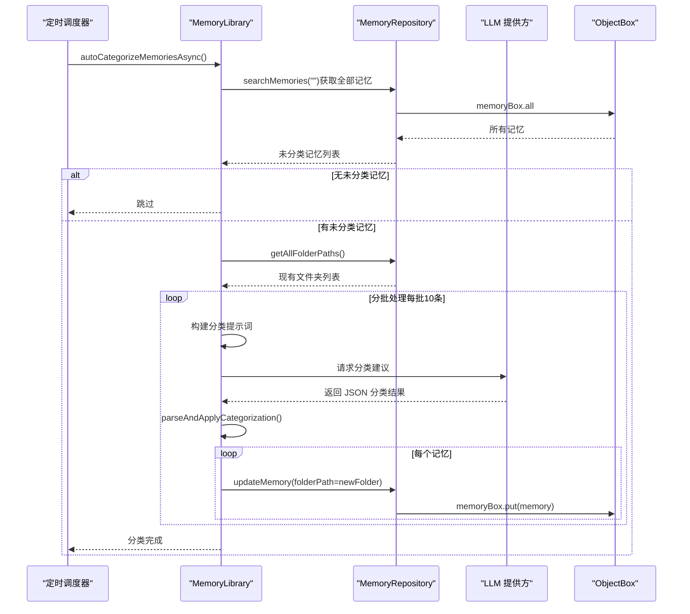
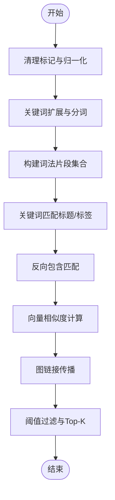
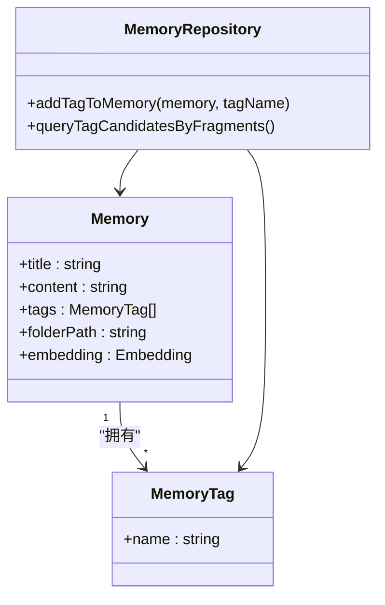
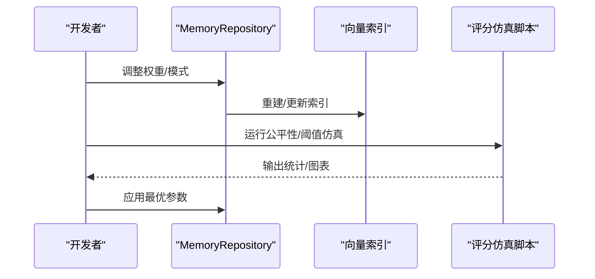
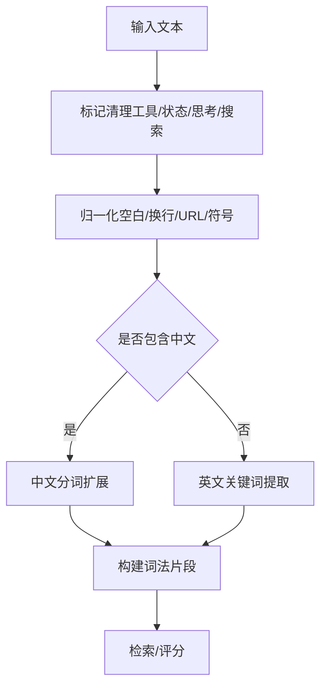
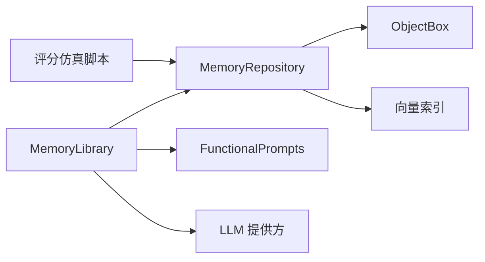

# 自动分类机制

<cite>
**本文引用的文件**
- [MemoryLibrary.kt](file://app/src/main/java/com/ai/assistance/operit/api/chat/library/MemoryLibrary.kt)
- [MemoryRepository.kt](file://app/src/main/java/com/ai/assistance/operit/data/repository/MemoryRepository.kt)
- [memory_scoring_sim.py](file://tools/memory/memory_scoring_sim.py)
- [Operit 记忆管理系统设计思想与详细流程分析.md](file://my_docs/Operit 记忆管理系统设计思想与详细流程分析.md)
- [subagent.ts](file://examples/subagent/src/packages/subagent.ts)
- [extended_memory_tools.js](file://examples/extended_memory_tools.js)
</cite>

## 目录
1. [简介](#简介)
2. [项目结构](#项目结构)
3. [核心组件](#核心组件)
4. [架构总览](#架构总览)
5. [详细组件分析](#详细组件分析)
6. [依赖关系分析](#依赖关系分析)
7. [性能考量](#性能考量)
8. [故障排查指南](#故障排查指南)
9. [结论](#结论)
10. [附录](#附录)

## 简介
本文件系统化阐述 Operit 的自动分类机制，覆盖内容分析算法（文本预处理、关键词提取、语义理解）、标签生成策略（自动标签识别、标签分类体系、标签权重计算）、分类准确性优化（机器学习模型应用、人工校正机制、分类结果验证）、多语言支持（中文分词、英文处理、混合语言策略），并提供可操作的实现示例与配置管理说明，帮助开发者进行定制与优化。

## 项目结构
自动分类机制主要由以下层次构成：
- 应用层：负责触发与编排（如定时任务、批量处理）
- 逻辑层：负责分析与决策（如知识图谱抽取、分类提示词构建）
- 数据层：负责检索与索引（如关键词扩展、向量索引、图遍历）
- 工具层：负责多语言与标记清理（如正则清理、XML/HTML标记剥离）

**图表来源**
- [MemoryLibrary.kt:142-222](file://app/src/main/java/com/ai/assistance/operit/api/chat/library/MemoryLibrary.kt#L142-L222)
- [MemoryRepository.kt:133-159](file://app/src/main/java/com/ai/assistance/operit/data/repository/MemoryRepository.kt#L133-L159)
- [Operit 记忆管理系统设计思想与详细流程分析.md:393-429](file://my_docs/Operit 记忆管理系统设计思想与详细流程分析.md#L393-L429)

**章节来源**
- [MemoryLibrary.kt:142-222](file://app/src/main/java/com/ai/assistance/operit/api/chat/library/MemoryLibrary.kt#L142-L222)
- [MemoryRepository.kt:133-159](file://app/src/main/java/com/ai/assistance/operit/data/repository/MemoryRepository.kt#L133-L159)
- [Operit 记忆管理系统设计思想与详细流程分析.md:393-429](file://my_docs/Operit 记忆管理系统设计思想与详细流程分析.md#L393-L429)

## 核心组件
- MemoryLibrary：负责自动分类的编排与提示词构建，批量调用 LLM，解析 JSON 结果并更新记忆的文件夹路径与嵌入向量。
- MemoryRepository：负责关键词扩展、检索权重计算、向量索引管理、图链接传播等底层检索与索引能力。
- FunctionalPrompts：提供系统提示词模板，用于构建分类与知识抽取的提示词。
- 工具与脚本：文本预处理工具（正则清理、标记剥离）、Python 评分仿真脚本（关键词/反向包含/语义/图传播评分）。

**章节来源**
- [MemoryLibrary.kt:42-54](file://app/src/main/java/com/ai/assistance/operit/api/chat/library/MemoryLibrary.kt#L42-L54)
- [MemoryRepository.kt:133-159](file://app/src/main/java/com/ai/assistance/operit/data/repository/MemoryRepository.kt#L133-L159)
- [Operit 记忆管理系统设计思想与详细流程分析.md:82-195](file://my_docs/Operit 记忆管理系统设计思想与详细流程分析.md#L82-L195)

## 架构总览
自动分类的整体流程如下：
- 定时扫描未分类记忆
- 构建分类提示词（包含现有文件夹列表与待分类记忆摘要）
- 调用 LLM 生成 JSON 分类结果
- 解析并应用分类结果，更新记忆文件夹路径与嵌入向量

**图表来源**
- [Operit 记忆管理系统设计思想与详细流程分析.md:393-429](file://my_docs/Operit 记忆管理系统设计思想与详细流程分析.md#L393-L429)
- [MemoryLibrary.kt:142-222](file://app/src/main/java/com/ai/assistance/operit/api/chat/library/MemoryLibrary.kt#L142-L222)

**章节来源**
- [Operit 记忆管理系统设计思想与详细流程分析.md:393-429](file://my_docs/Operit 记忆管理系统设计思想与详细流程分析.md#L393-L429)
- [MemoryLibrary.kt:142-222](file://app/src/main/java/com/ai/assistance/operit/api/chat/library/MemoryLibrary.kt#L142-L222)

## 详细组件分析

### 内容分析算法
- 文本预处理
  - 清理标记：移除工具调用、状态、思考、搜索等标记，减少噪声。
  - 归一化：统一换行、空白、URL、Markdown 符号，保留关键语义。
  - 中文分词：使用内置分词器对关键词进行切分，提升召回。
- 关键词提取
  - 词法片段构建：将查询与关键词展开为词法片段集合，按长度降序取上限。
  - 通配符支持：支持星号通配，动态生成正则匹配。
- 语义理解
  - 向量相似度：基于 HNSW 向量索引，计算余弦相似度，结合 RRF 排名与重要性加权。
  - 图传播：从关键词匹配结果出发，沿链接传播分数，增强弱相关但结构相关的记忆。

**图表来源**
- [MemoryRepository.kt:133-159](file://app/src/main/java/com/ai/assistance/operit/data/repository/MemoryRepository.kt#L133-L159)
- [MemoryRepository.kt:197-209](file://app/src/main/java/com/ai/assistance/operit/data/repository/MemoryRepository.kt#L197-L209)
- [MemoryRepository.kt:686-730](file://app/src/main/java/com/ai/assistance/operit/data/repository/MemoryRepository.kt#L686-L730)
- [MemoryRepository.kt:583-605](file://app/src/main/java/com/ai/assistance/operit/data/repository/MemoryRepository.kt#L583-L605)

**章节来源**
- [MemoryRepository.kt:133-159](file://app/src/main/java/com/ai/assistance/operit/data/repository/MemoryRepository.kt#L133-L159)
- [MemoryRepository.kt:197-209](file://app/src/main/java/com/ai/assistance/operit/data/repository/MemoryRepository.kt#L197-L209)
- [MemoryRepository.kt:686-730](file://app/src/main/java/com/ai/assistance/operit/data/repository/MemoryRepository.kt#L686-L730)
- [MemoryRepository.kt:583-605](file://app/src/main/java/com/ai/assistance/operit/data/repository/MemoryRepository.kt#L583-L605)

### 标签生成策略
- 自动标签识别
  - 从 LLM 的 JSON 输出中解析实体标签，或从现有记忆中复用标签。
- 标签分类体系
  - 采用扁平标签体系，支持与文件夹路径协同组织。
- 标签权重计算
  - 通过检索权重配置（关键词/标签/语义/图）与模式（平衡/关键词优先/语义优先）影响最终得分。

**图表来源**
- [Operit 记忆管理系统设计思想与详细流程分析.md:130-152](file://my_docs/Operit 记忆管理系统设计思想与详细流程分析.md#L130-L152)
- [MemoryRepository.kt:732-759](file://app/src/main/java/com/ai/assistance/operit/data/repository/MemoryRepository.kt#L732-L759)

**章节来源**
- [Operit 记忆管理系统设计思想与详细流程分析.md:130-152](file://my_docs/Operit 记忆管理系统设计思想与详细流程分析.md#L130-L152)
- [MemoryRepository.kt:732-759](file://app/src/main/java/com/ai/assistance/operit/data/repository/MemoryRepository.kt#L732-L759)

### 分类准确性优化
- 机器学习模型应用
  - 使用云端嵌入服务生成向量，结合 HNSW 索引进行高效近似最近邻搜索。
- 人工校正机制
  - 通过工具包与 UI 提供手动移动、链接、更新记忆的能力，支持人工干预与修正。
- 分类结果验证
  - Python 评分仿真脚本提供公平性分析、阈值行为可视化与蒙特卡洛模拟，辅助调参与验证。

**图表来源**
- [memory_scoring_sim.py:550-614](file://tools/memory/memory_scoring_sim.py#L550-L614)
- [memory_scoring_sim.py:622-721](file://tools/memory/memory_scoring_sim.py#L622-L721)
- [MemoryRepository.kt:354-402](file://app/src/main/java/com/ai/assistance/operit/data/repository/MemoryRepository.kt#L354-L402)

**章节来源**
- [memory_scoring_sim.py:550-614](file://tools/memory/memory_scoring_sim.py#L550-L614)
- [memory_scoring_sim.py:622-721](file://tools/memory/memory_scoring_sim.py#L622-L721)
- [MemoryRepository.kt:354-402](file://app/src/main/java/com/ai/assistance/operit/data/repository/MemoryRepository.kt#L354-L402)

### 多语言支持
- 中文分词：优先使用内置分词器，提升中文检索召回。
- 英文处理：统一大小写、清理 Markdown 符号，保留语义关键词。
- 混合语言处理：通过标记清理与词法片段构建，兼顾中英文与符号混排场景。

**图表来源**
- [MemoryRepository.kt:133-159](file://app/src/main/java/com/ai/assistance/operit/data/repository/MemoryRepository.kt#L133-L159)
- [MemoryRepository.kt:197-209](file://app/src/main/java/com/ai/assistance/operit/data/repository/MemoryRepository.kt#L197-L209)

**章节来源**
- [MemoryRepository.kt:133-159](file://app/src/main/java/com/ai/assistance/operit/data/repository/MemoryRepository.kt#L133-L159)
- [MemoryRepository.kt:197-209](file://app/src/main/java/com/ai/assistance/operit/data/repository/MemoryRepository.kt#L197-L209)

### 实现示例与扩展
- 扩展分类规则
  - 修改提示词模板（FunctionalPrompts），增加领域约束或文件夹规则。
  - 在 MemoryLibrary 中调整批处理大小与提示词构建逻辑。
- 优化分类准确率
  - 使用评分仿真脚本进行阈值与权重敏感性分析，选择最优组合。
  - 调整检索权重与评分模式（平衡/关键词优先/语义优先）。
- 特殊领域分类
  - 通过工具包（如 subagent）与 UI 提供手动移动/链接/更新能力，进行领域知识的人工强化。

**章节来源**
- [MemoryLibrary.kt:181-222](file://app/src/main/java/com/ai/assistance/operit/api/chat/library/MemoryLibrary.kt#L181-L222)
- [memory_scoring_sim.py:745-796](file://tools/memory/memory_scoring_sim.py#L745-L796)
- [subagent.ts:431-466](file://examples/subagent/src/packages/subagent.ts#L431-L466)

### 配置与管理
- 分类规则编辑
  - 通过 FunctionalPrompts 与 MemoryLibrary 的提示词构建逻辑进行规则调整。
- 批量分类处理
  - 通过定时调度器触发 autoCategorizeMemoriesAsync，按批处理未分类记忆。
- 分类效果统计
  - 使用评分仿真脚本输出统计与可视化，辅助效果评估与参数调优。

**章节来源**
- [Operit 记忆管理系统设计思想与详细流程分析.md:393-429](file://my_docs/Operit 记忆管理系统设计思想与详细流程分析.md#L393-L429)
- [memory_scoring_sim.py:745-796](file://tools/memory/memory_scoring_sim.py#L745-L796)

## 依赖关系分析
- 组件耦合
  - MemoryLibrary 依赖 MemoryRepository（检索/索引/更新）与 FunctionalPrompts（提示词模板）。
  - MemoryRepository 依赖向量索引与 ObjectBox 存储。
- 外部依赖
  - LLM 提供方用于生成分类 JSON。
  - Python 评分仿真脚本用于离线验证与调参。

**图表来源**
- [MemoryLibrary.kt:142-222](file://app/src/main/java/com/ai/assistance/operit/api/chat/library/MemoryLibrary.kt#L142-L222)
- [MemoryRepository.kt:354-402](file://app/src/main/java/com/ai/assistance/operit/data/repository/MemoryRepository.kt#L354-L402)

**章节来源**
- [MemoryLibrary.kt:142-222](file://app/src/main/java/com/ai/assistance/operit/api/chat/library/MemoryLibrary.kt#L142-L222)
- [MemoryRepository.kt:354-402](file://app/src/main/java/com/ai/assistance/operit/data/repository/MemoryRepository.kt#L354-L402)

## 性能考量
- 向量索引重建
  - 按维度重建 HNSW 索引，避免增量删除导致的容量异常。
- 评分与过滤
  - 使用 RRF 排名与阈值过滤，控制 Top-K 数量，平衡召回与效率。
- 批处理与并发
  - 分批处理未分类记忆，避免一次性大规模更新造成性能抖动。

**章节来源**
- [MemoryRepository.kt:354-402](file://app/src/main/java/com/ai/assistance/operit/data/repository/MemoryRepository.kt#L354-L402)
- [MemoryRepository.kt:247-258](file://app/src/main/java/com/ai/assistance/operit/data/repository/MemoryRepository.kt#L247-L258)

## 故障排查指南
- 分类结果为空
  - 检查提示词构建与 LLM 输出解析逻辑，确认 JSON 格式正确。
- 分类结果偏差大
  - 使用评分仿真脚本进行阈值与权重敏感性分析，逐步调整参数。
- 向量索引异常
  - 触重建流程，确保维度一致且索引文件存在。

**章节来源**
- [MemoryLibrary.kt:227-264](file://app/src/main/java/com/ai/assistance/operit/api/chat/library/MemoryLibrary.kt#L227-L264)
- [memory_scoring_sim.py:550-614](file://tools/memory/memory_scoring_sim.py#L550-L614)
- [MemoryRepository.kt:354-402](file://app/src/main/java/com/ai/assistance/operit/data/repository/MemoryRepository.kt#L354-L402)

## 结论
Operit 的自动分类机制以“关键词扩展 + 语义相似 + 图传播”的混合评分为核心，结合 LLM 的结构化提示词输出，实现了对未分类记忆的自动化归类。通过 Python 评分仿真脚本与向量索引重建机制，系统具备良好的可调性与可维护性。开发者可通过提示词模板、权重配置与人工校正实现定制化与持续优化。

## 附录
- 相关工具包与脚本
  - 扩展记忆工具包：提供移动、链接、更新等操作接口。
  - 子代理工具：支持被动式子任务执行与进度反馈。
  - 评分仿真脚本：提供公平性分析与阈值可视化。

**章节来源**
- [extended_memory_tools.js:135-234](file://examples/extended_memory_tools.js#L135-L234)
- [subagent.ts:479-545](file://examples/subagent/src/packages/subagent.ts#L479-L545)
- [memory_scoring_sim.py:550-614](file://tools/memory/memory_scoring_sim.py#L550-L614)