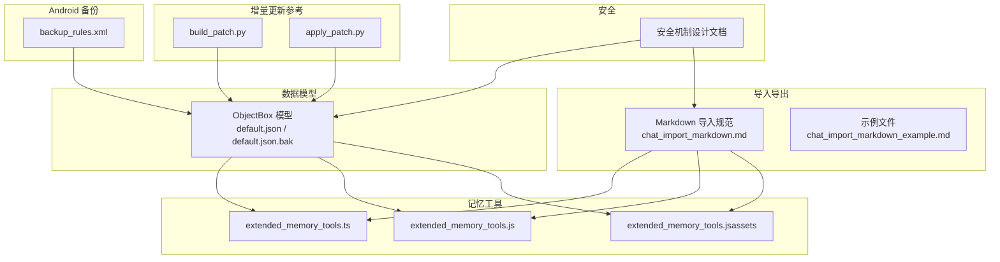
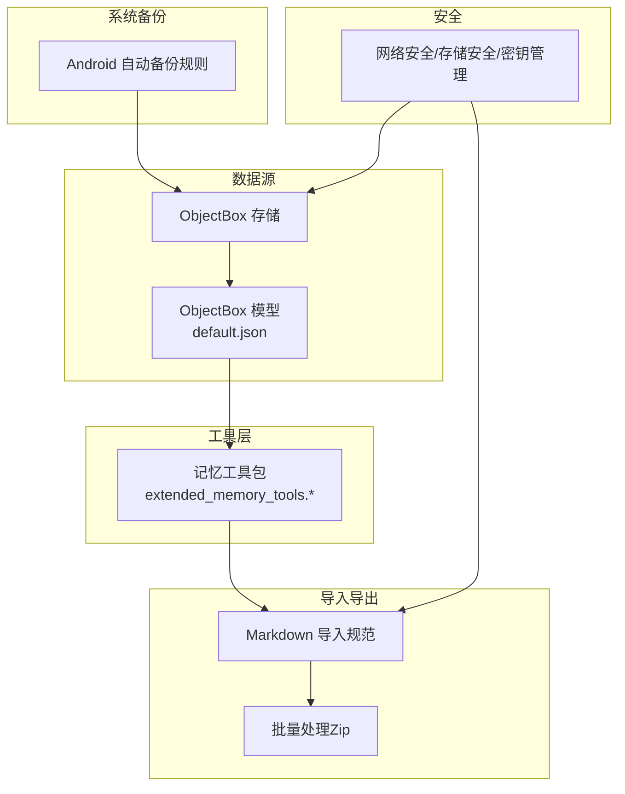
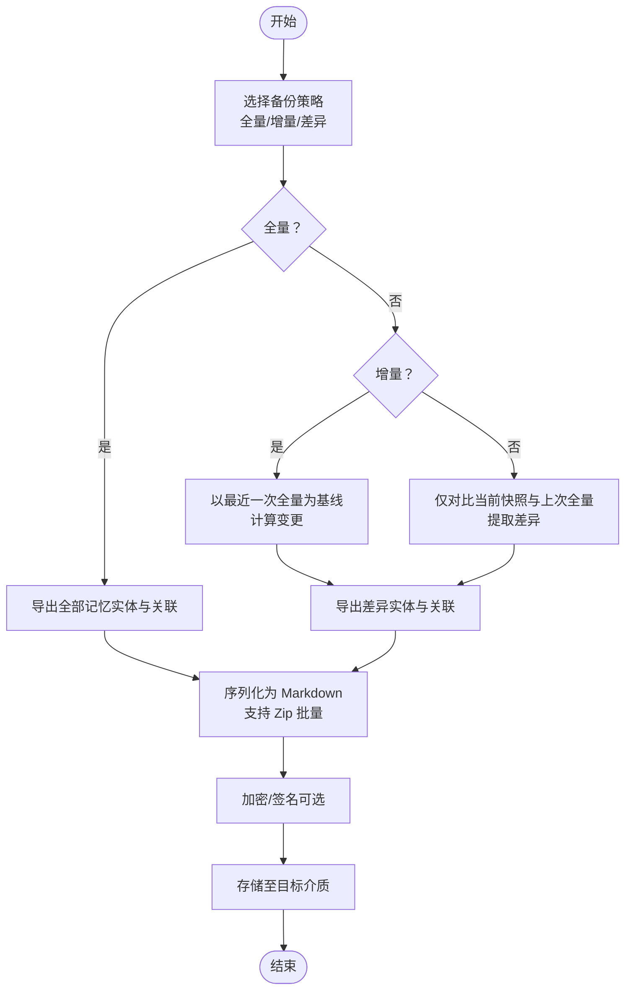
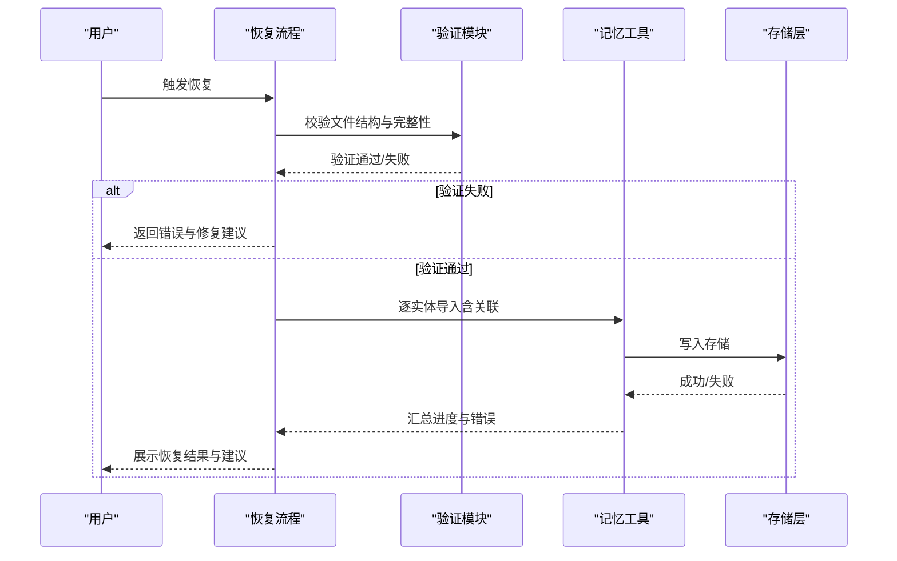
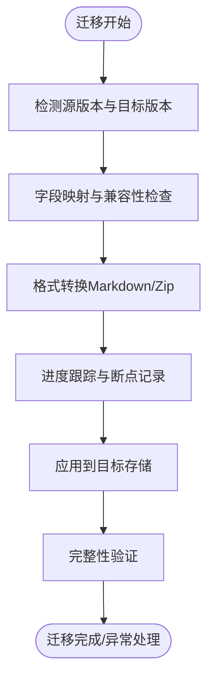
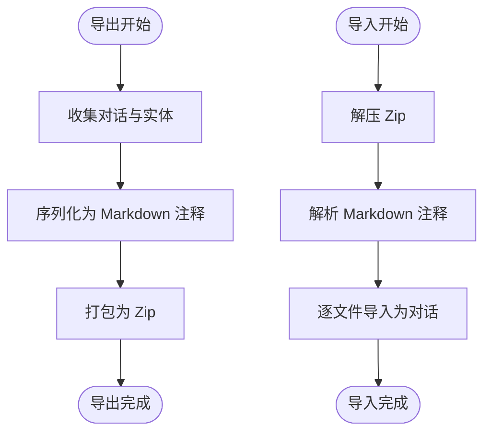
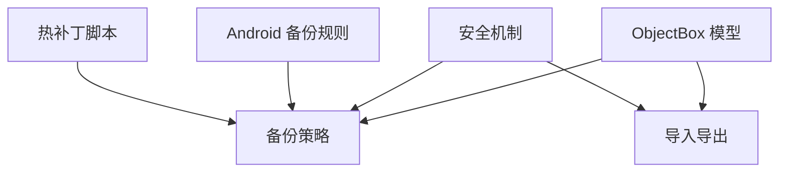

# 记忆备份与恢复

<cite>
**本文引用的文件**
- [backup_rules.xml](file://app/src/main/res/xml/backup_rules.xml)
- [default.json](file://app/objectbox-models/default.json)
- [default.json.bak](file://app/objectbox-models/default.json.bak)
- [chat_import_markdown.md](file://docs/chat_import_markdown.md)
- [chat_import_markdown_example.md](file://docs/chat_import_markdown_example.md)
- [extended_memory_tools.ts](file://examples/extended_memory_tools.ts)
- [extended_memory_tools.js](file://examples/extended_memory_tools.js)
- [extended_memory_tools.js（assets）](file://app/src/main/assets/packages/extended_memory_tools.js)
- [Operit 安全机制设计思想与详细流程分析.md](file://my_docs/Operit 安全机制设计思想与详细流程分析.md)
- [build_patch.py](file://tools/hotbuild/build_patch.py)
- [apply_patch.py](file://tools/hotbuild/apply_patch.py)
</cite>

## 目录
1. [简介](#简介)
2. [项目结构](#项目结构)
3. [核心组件](#核心组件)
4. [架构总览](#架构总览)
5. [详细组件分析](#详细组件分析)
6. [依赖分析](#依赖分析)
7. [性能考量](#性能考量)
8. [故障排查指南](#故障排查指南)
9. [结论](#结论)
10. [附录](#附录)

## 简介
本文件围绕 Operit 的“记忆备份与恢复”机制，系统化梳理备份策略（全量、增量、差异）、恢复流程（数据验证、恢复监控、完整性检查）、数据迁移（版本兼容、格式转换、进度跟踪）、导入导出（序列化、文件格式、批量处理）、安全性保障（加密、访问控制、传输安全），并提供可操作的实践示例与开发者扩展指引。文档同时结合仓库现有文件与设计文档，给出可落地的实施建议。

## 项目结构
与备份恢复直接相关的结构与文件包括：
- Android 自动备份规则：用于声明哪些共享偏好等数据参与系统自动备份。
- ObjectBox 模型定义与备份：用于描述记忆实体结构及变更追踪基础。
- Markdown 导入导出规范：提供对话级数据的序列化与批量处理能力。
- 记忆工具包：提供记忆增删改查、链接维护等能力，支撑备份与恢复的数据一致性。
- 安全机制：涵盖网络传输、存储安全、密钥管理等，为备份数据安全提供基础。
- 热补丁构建与应用：体现增量更新思路，可借鉴为增量备份/恢复的参考。

图表来源
- [backup_rules.xml:1-13](file://app/src/main/res/xml/backup_rules.xml#L1-L13)
- [default.json:1-158](file://app/objectbox-models/default.json#L1-L158)
- [default.json.bak:1-158](file://app/objectbox-models/default.json.bak#L1-L158)
- [chat_import_markdown.md:1-119](file://docs/chat_import_markdown.md#L1-L119)
- [chat_import_markdown_example.md:1-47](file://docs/chat_import_markdown_example.md#L1-L47)
- [extended_memory_tools.ts:119-269](file://examples/extended_memory_tools.ts#L119-L269)
- [extended_memory_tools.js:200-218](file://examples/extended_memory_tools.js#L200-L218)
- [extended_memory_tools.js（assets）:200-218](file://app/src/main/assets/packages/extended_memory_tools.js#L200-L218)
- [Operit 安全机制设计思想与详细流程分析.md:780-817](file://my_docs/Operit 安全机制设计思想与详细流程分析.md#L780-L817)
- [build_patch.py:69-111](file://tools/hotbuild/build_patch.py#L69-L111)
- [apply_patch.py:193-227](file://tools/hotbuild/apply_patch.py#L193-L227)

章节来源
- [backup_rules.xml:1-13](file://app/src/main/res/xml/backup_rules.xml#L1-L13)
- [default.json:1-158](file://app/objectbox-models/default.json#L1-L158)
- [default.json.bak:1-158](file://app/objectbox-models/default.json.bak#L1-L158)
- [chat_import_markdown.md:1-119](file://docs/chat_import_markdown.md#L1-L119)
- [chat_import_markdown_example.md:1-47](file://docs/chat_import_markdown_example.md#L1-L47)
- [extended_memory_tools.ts:119-269](file://examples/extended_memory_tools.ts#L119-L269)
- [extended_memory_tools.js:200-218](file://examples/extended_memory_tools.js#L200-L218)
- [extended_memory_tools.js（assets）:200-218](file://app/src/main/assets/packages/extended_memory_tools.js#L200-L218)
- [Operit 安全机制设计思想与详细流程分析.md:780-817](file://my_docs/Operit 安全机制设计思想与详细流程分析.md#L780-L817)
- [build_patch.py:69-111](file://tools/hotbuild/build_patch.py#L69-L111)
- [apply_patch.py:193-227](file://tools/hotbuild/apply_patch.py#L193-L227)

## 核心组件
- 备份规则与系统集成
  - Android 自动备份规则文件用于声明备份范围，便于系统层面进行全量备份与恢复。
- 数据模型与版本基线
  - ObjectBox 模型文件提供记忆实体结构与关系，是制定全量/增量/差异备份策略的基础。
- 导入导出规范
  - Markdown 导入规范定义了对话级数据的序列化格式与批量处理方式，支撑跨设备/跨版本的数据迁移。
- 记忆工具集
  - 提供记忆的创建、更新、删除、移动、链接维护等能力，是备份恢复过程中数据一致性与完整性的重要保障。
- 安全机制
  - 网络安全、存储安全、密钥管理等机制为备份数据的加密、访问控制与传输安全提供基础。
- 增量更新参考
  - 热补丁构建与应用脚本体现了基于块哈希与差分操作的增量思路，可借鉴为增量备份/恢复的设计参考。

章节来源
- [backup_rules.xml:1-13](file://app/src/main/res/xml/backup_rules.xml#L1-L13)
- [default.json:1-158](file://app/objectbox-models/default.json#L1-L158)
- [default.json.bak:1-158](file://app/objectbox-models/default.json.bak#L1-L158)
- [chat_import_markdown.md:1-119](file://docs/chat_import_markdown.md#L1-L119)
- [extended_memory_tools.ts:119-269](file://examples/extended_memory_tools.ts#L119-L269)
- [Operit 安全机制设计思想与详细流程分析.md:780-817](file://my_docs/Operit 安全机制设计思想与详细流程分析.md#L780-L817)
- [build_patch.py:69-111](file://tools/hotbuild/build_patch.py#L69-L111)
- [apply_patch.py:193-227](file://tools/hotbuild/apply_patch.py#L193-L227)

## 架构总览
下图展示了备份与恢复在系统中的位置与交互关系，包括数据源（ObjectBox）、工具层（记忆工具）、导入导出层（Markdown）、系统备份层（Android 自动备份）以及安全层（加密/访问控制）。

图表来源
- [default.json:1-158](file://app/objectbox-models/default.json#L1-L158)
- [extended_memory_tools.ts:119-269](file://examples/extended_memory_tools.ts#L119-L269)
- [chat_import_markdown.md:1-119](file://docs/chat_import_markdown.md#L1-L119)
- [backup_rules.xml:1-13](file://app/src/main/res/xml/backup_rules.xml#L1-L13)
- [Operit 安全机制设计思想与详细流程分析.md:780-817](file://my_docs/Operit 安全机制设计思想与详细流程分析.md#L780-L817)

## 详细组件分析

### 备份策略设计与适用场景
- 全量备份
  - 定义：在选定时间点对全部记忆实体与关联数据进行完整导出。
  - 实施要点：
    - 基于 ObjectBox 模型结构，遍历实体集合与关联（标签、属性、链接、分块等）。
    - 使用 Markdown 导入规范进行序列化，支持 Zip 批量导出。
    - 结合 Android 自动备份规则，确保系统级全量备份纳入共享偏好等配置数据。
  - 适用场景：首次迁移、重大版本升级、灾难恢复。
- 增量备份
  - 定义：仅备份自上次备份以来发生变化的记忆实体与关联。
  - 实施要点：
    - 基于时间戳或版本号标记（如 createdAt/updatedAt 或模型版本号）识别变更。
    - 参考热补丁构建脚本的块级差分思想，按块计算哈希并仅记录变化块。
    - 导出时仅包含变更实体及其关联，减少体积与时间。
  - 适用场景：日常高频备份、小规模持续演进。
- 差异备份
  - 定义：备份与上一次全量备份相比的差异集合。
  - 实施要点：
    - 以最近一次全量备份为基线，对比当前模型快照，提取差异实体与关联。
    - 与增量备份类似，但基准不同，适合周期性全量+频繁差异组合。
  - 适用场景：长期演进、保留历史快照的组织级备份。

图表来源
- [default.json:1-158](file://app/objectbox-models/default.json#L1-L158)
- [chat_import_markdown.md:1-119](file://docs/chat_import_markdown.md#L1-L119)
- [build_patch.py:69-111](file://tools/hotbuild/build_patch.py#L69-L111)

章节来源
- [default.json:1-158](file://app/objectbox-models/default.json#L1-L158)
- [chat_import_markdown.md:1-119](file://docs/chat_import_markdown.md#L1-L119)
- [build_patch.py:69-111](file://tools/hotbuild/build_patch.py#L69-L111)

### 数据恢复流程
- 备份数据验证
  - 结构校验：确认导出文件符合 Markdown 规范，包含必需注释与结构。
  - 完整性校验：对导出包进行哈希校验或签名验证（可选）。
- 恢复过程监控
  - 进度上报：逐实体导入并记录进度，支持中断恢复。
  - 错误处理：遇到不兼容字段或缺失依赖时，记录失败项并继续处理其余项。
- 数据完整性检查
  - 关联完整性：检查链接、标签、属性是否存在孤立引用。
  - 内容一致性：比对导入前后实体数量、关联数量与关键字段一致性。

图表来源
- [chat_import_markdown.md:1-119](file://docs/chat_import_markdown.md#L1-L119)
- [extended_memory_tools.ts:119-269](file://examples/extended_memory_tools.ts#L119-L269)

章节来源
- [chat_import_markdown.md:1-119](file://docs/chat_import_markdown.md#L1-L119)
- [extended_memory_tools.ts:119-269](file://examples/extended_memory_tools.ts#L119-L269)

### 数据迁移机制
- 版本兼容性处理
  - 模型版本：在 ObjectBox 模型文件中记录实体与属性变更，迁移时进行映射与回退。
  - 导入兼容：Markdown 规范中新增字段采用默认值，缺失字段按兼容策略补齐。
- 数据格式转换
  - 统一序列化：使用 Markdown 注释与键值对，避免复杂 JSON；批量导出使用 Zip。
  - 字段映射：将旧模型字段映射到新模型字段，必要时进行类型转换。
- 迁移进度跟踪
  - 分阶段进度：记录已处理实体数、剩余实体数、错误项列表。
  - 断点续传：记录已成功导入的实体 ID，支持重启后跳过已完成项。

图表来源
- [default.json:1-158](file://app/objectbox-models/default.json#L1-L158)
- [chat_import_markdown.md:1-119](file://docs/chat_import_markdown.md#L1-L119)
- [extended_memory_tools.ts:119-269](file://examples/extended_memory_tools.ts#L119-L269)

章节来源
- [default.json:1-158](file://app/objectbox-models/default.json#L1-L158)
- [chat_import_markdown.md:1-119](file://docs/chat_import_markdown.md#L1-L119)
- [extended_memory_tools.ts:119-269](file://examples/extended_memory_tools.ts#L119-L269)

### 导入导出功能
- 数据序列化
  - Markdown 注释：使用 HTML 注释承载元数据（chat-info、msg），简化书写与解析。
  - 批量处理：Zip 压缩包内包含多个 .md 文件，支持批量导入/导出。
- 文件格式规范
  - 全局元数据：title、created、id、group 等字段，支持简写与默认值。
  - 消息元数据：role、model、timestamp 等字段，支持简写与默认值。
- 批量处理能力
  - 导出：将多个对话导出为 .zip，每个 .md 对应一个对话。
  - 导入：解压并逐文件导入，每个文件独立为一个对话记录。

图表来源
- [chat_import_markdown.md:1-119](file://docs/chat_import_markdown.md#L1-L119)
- [chat_import_markdown_example.md:1-47](file://docs/chat_import_markdown_example.md#L1-L47)

章节来源
- [chat_import_markdown.md:1-119](file://docs/chat_import_markdown.md#L1-L119)
- [chat_import_markdown_example.md:1-47](file://docs/chat_import_markdown_example.md#L1-L47)

### 备份恢复示例
- 制定备份计划
  - 全量：每月首日执行一次全量备份，保留最近 3 个月全量快照。
  - 增量：每日执行增量备份，保留最近 7 天增量包。
  - 差异：每周五执行一次差异备份，保留最近 4 份差异包。
- 执行数据恢复
  - 优先使用最新全量 + 最近差异/增量组合进行恢复，减少回放时间。
  - 若全量损坏，则尝试使用次新全量 + 差异/增量链路恢复。
- 处理备份失败
  - 失败重试：记录失败实体 ID，重启后跳过已完成项并重试失败项。
  - 降级策略：若某类实体导入失败，记录错误并继续导入其他实体，事后人工修复。

章节来源
- [chat_import_markdown.md:1-119](file://docs/chat_import_markdown.md#L1-L119)
- [build_patch.py:69-111](file://tools/hotbuild/build_patch.py#L69-L111)
- [apply_patch.py:193-227](file://tools/hotbuild/apply_patch.py#L193-L227)

### 备份数据安全性保障
- 数据加密
  - 在导出/传输前对敏感字段进行加密（可参考安全机制文档中的加密组件）。
- 访问控制
  - 限制备份文件的读写权限，仅授予必要的系统/用户账户。
- 传输安全
  - 使用受信任的传输通道（如 HTTPS/安全存储），并在必要时启用证书验证。
- 存储安全
  - 将备份文件存放在受保护的目录或加密存储中，并定期轮换密钥。

章节来源
- [Operit 安全机制设计思想与详细流程分析.md:780-817](file://my_docs/Operit 安全机制设计思想与详细流程分析.md#L780-L817)
- [Operit 安全机制设计思想与详细流程分析.md:714-770](file://my_docs/Operit 安全机制设计思想与详细流程分析.md#L714-L770)

### 开发者定制与扩展指导
- 自定义备份策略
  - 基于 ObjectBox 模型文件与实体关系，设计增量/差异策略的时间窗口与触发条件。
- 第三方存储集成
  - 将导出的 Zip 包上传至云存储或私有服务器，配合访问控制与加密。
- 自动化备份流程
  - 结合 Android 自动备份规则与定时任务，实现无人值守的全量/增量备份。
- 增量备份/恢复参考
  - 借鉴热补丁构建与应用脚本的块级差分与哈希比较思路，实现高效增量备份与恢复。

章节来源
- [default.json:1-158](file://app/objectbox-models/default.json#L1-L158)
- [backup_rules.xml:1-13](file://app/src/main/res/xml/backup_rules.xml#L1-L13)
- [build_patch.py:69-111](file://tools/hotbuild/build_patch.py#L69-L111)
- [apply_patch.py:193-227](file://tools/hotbuild/apply_patch.py#L193-L227)

## 依赖分析
- 组件耦合
  - 备份策略依赖 ObjectBox 模型结构与实体关系。
  - 导入导出依赖 Markdown 规范与工具包能力。
  - 安全机制贯穿数据生命周期，为备份/恢复提供加密与访问控制。
- 外部依赖
  - Android 自动备份规则影响系统级备份范围。
  - 热补丁脚本提供增量更新的实现参考。

图表来源
- [default.json:1-158](file://app/objectbox-models/default.json#L1-L158)
- [chat_import_markdown.md:1-119](file://docs/chat_import_markdown.md#L1-L119)
- [Operit 安全机制设计思想与详细流程分析.md:780-817](file://my_docs/Operit 安全机制设计思想与详细流程分析.md#L780-L817)
- [backup_rules.xml:1-13](file://app/src/main/res/xml/backup_rules.xml#L1-L13)
- [build_patch.py:69-111](file://tools/hotbuild/build_patch.py#L69-L111)

章节来源
- [default.json:1-158](file://app/objectbox-models/default.json#L1-L158)
- [chat_import_markdown.md:1-119](file://docs/chat_import_markdown.md#L1-L119)
- [Operit 安全机制设计思想与详细流程分析.md:780-817](file://my_docs/Operit 安全机制设计思想与详细流程分析.md#L780-L817)
- [backup_rules.xml:1-13](file://app/src/main/res/xml/backup_rules.xml#L1-L13)
- [build_patch.py:69-111](file://tools/hotbuild/build_patch.py#L69-L111)

## 性能考量
- 备份体积与速度
  - 全量备份适合离线执行，增量/差异更适合在线高频场景。
  - 使用 Zip 批量导出可显著提升传输效率。
- 导入性能
  - 并行导入多个对话，但需注意存储写入速率与内存占用。
  - 对大文件采用流式处理，避免内存峰值过高。
- 存储与网络
  - 优先使用本地高速存储，远端传输时启用压缩与断点续传。

## 故障排查指南
- 常见问题
  - 导入失败：检查 Markdown 注释是否正确、Zip 包内是否包含 .md 文件。
  - 恢复中断：记录失败实体 ID，重启后跳过已完成项并重试失败项。
  - 安全问题：确认加密与访问控制配置是否生效，证书验证是否开启。
- 排查步骤
  - 校验导出文件结构与完整性。
  - 检查存储权限与磁盘空间。
  - 查看日志与进度记录，定位具体失败环节。

章节来源
- [chat_import_markdown.md:107-119](file://docs/chat_import_markdown.md#L107-L119)
- [Operit 安全机制设计思想与详细流程分析.md:714-770](file://my_docs/Operit 安全机制设计思想与详细流程分析.md#L714-L770)

## 结论
Operit 的记忆备份与恢复机制以 ObjectBox 模型为基础，结合 Markdown 导入导出规范与 Android 自动备份规则，形成可扩展的全量/增量/差异备份策略。通过记忆工具包保证数据一致性，借助安全机制保障数据加密与访问控制。开发者可在此基础上定制策略、集成第三方存储并实现自动化流程，满足不同场景下的备份与恢复需求。

## 附录
- 相关文件路径
  - 备份规则：[backup_rules.xml:1-13](file://app/src/main/res/xml/backup_rules.xml#L1-L13)
  - 模型定义：[default.json:1-158](file://app/objectbox-models/default.json#L1-L158)、[default.json.bak:1-158](file://app/objectbox-models/default.json.bak#L1-L158)
  - 导入规范：[chat_import_markdown.md:1-119](file://docs/chat_import_markdown.md#L1-L119)、[chat_import_markdown_example.md:1-47](file://docs/chat_import_markdown_example.md#L1-L47)
  - 记忆工具：[extended_memory_tools.ts:119-269](file://examples/extended_memory_tools.ts#L119-L269)、[extended_memory_tools.js:200-218](file://examples/extended_memory_tools.js#L200-L218)、[extended_memory_tools.js（assets）:200-218](file://app/src/main/assets/packages/extended_memory_tools.js#L200-L218)
  - 安全机制：[Operit 安全机制设计思想与详细流程分析.md:780-817](file://my_docs/Operit 安全机制设计思想与详细流程分析.md#L780-L817)
  - 增量更新参考：[build_patch.py:69-111](file://tools/hotbuild/build_patch.py#L69-L111)、[apply_patch.py:193-227](file://tools/hotbuild/apply_patch.py#L193-L227)