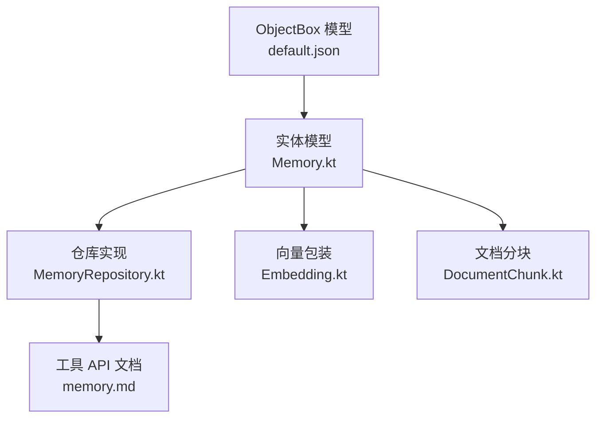
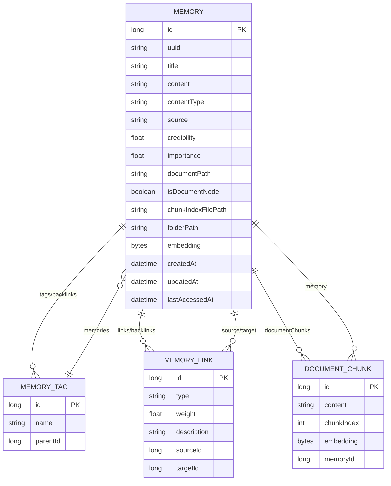
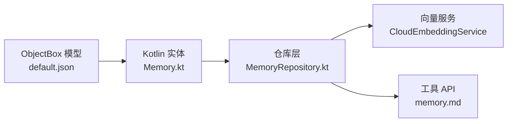

# 记忆存储设计

<cite>
**本文引用的文件**
- [default.json](file://app/objectbox-models/default.json)
- [default.json.bak](file://app/objectbox-models/default.json.bak)
- [Memory.kt](file://app/src/main/java/com/ai/assistance/operit/data/model/Memory.kt)
- [Embedding.kt](file://app/src/main/java/com/ai/assistance/operit/data/model/Embedding.kt)
- [DocumentChunk.kt](file://app/src/main/java/com/ai/assistance/operit/data/model/DocumentChunk.kt)
- [MemoryRepository.kt](file://app/src/main/java/com/ai/assistance/operit/data/repository/MemoryRepository.kt)
- [memory.md](file://docs/package_dev/memory.md)
</cite>

## 目录
1. [简介](#简介)
2. [项目结构](#项目结构)
3. [核心组件](#核心组件)
4. [架构总览](#架构总览)
5. [详细组件分析](#详细组件分析)
6. [依赖分析](#依赖分析)
7. [性能考虑](#性能考虑)
8. [故障排查指南](#故障排查指南)
9. [结论](#结论)
10. [附录](#附录)

## 简介
本文件系统性阐述 Operit 记忆存储的设计与实现，聚焦于 ObjectBox 数据库配置、实体模型定义、字段映射与索引策略，以及 Memory、MemoryLink、MemoryTag 等核心数据模型的关系映射。文档同时覆盖数据持久化机制（实体生命周期、事务处理、数据完整性）、存储优化策略（内存管理、磁盘空间优化、向量索引与压缩思路），并提供扩展与定制指导（新增实体、索引优化、数据迁移策略）。面向开发者，既给出代码级参考路径，也提供可操作的实践建议。

## 项目结构
围绕记忆存储的关键文件分布如下：
- ObjectBox 模型定义：位于 app/objectbox-models/default.json（及备份 default.json.bak），描述实体、属性、索引与关系。
- Kotlin 实体模型：位于 app/src/main/java/com/ai/assistance/operit/data/model/，包含 Memory、MemoryTag、MemoryLink、DocumentChunk、Embedding 等。
- 存储仓库与业务逻辑：位于 app/src/main/java/com/ai/assistance/operit/data/repository/MemoryRepository.kt，封装查询、更新、链接与标签管理、向量相似度计算、搜索权重与分页等。
- API 文档：位于 docs/package_dev/memory.md，描述 Tools.Memory 命名空间的查询、创建、更新、删除、链接等接口与行为。



**图表来源**
- [default.json:1-359](file://app/objectbox-models/default.json#L1-L359)
- [Memory.kt:1-113](file://app/src/main/java/com/ai/assistance/operit/data/model/Memory.kt#L1-L113)
- [MemoryRepository.kt:1-200](file://app/src/main/java/com/ai/assistance/operit/data/repository/MemoryRepository.kt#L1-L200)
- [memory.md:1-234](file://docs/package_dev/memory.md#L1-L234)

**章节来源**
- [default.json:1-359](file://app/objectbox-models/default.json#L1-L359)
- [Memory.kt:1-113](file://app/src/main/java/com/ai/assistance/operit/data/model/Memory.kt#L1-L113)
- [MemoryRepository.kt:1-200](file://app/src/main/java/com/ai/assistance/operit/data/repository/MemoryRepository.kt#L1-L200)
- [memory.md:1-234](file://docs/package_dev/memory.md#L1-L234)

## 核心组件
- Memory（核心记忆单元）
  - 字段：id、uuid、title、content、contentType、source、credibility、importance、documentPath、isDocumentNode、chunkIndexFilePath、folderPath、embedding、createdAt、updatedAt、lastAccessedAt、links、tags、properties、backlinks、documentChunks。
  - 索引：folderPath（索引标识见 default.json）。
  - 关系：ToOne/ToMany 标签、属性、链接、反向链接、文档分块。
- MemoryTag（记忆标签）
  - 字段：id、name、parent、memories。
  - 支持层级父子关系。
- MemoryLink（记忆链接）
  - 字段：id、type、weight、description、sourceId、targetId。
  - 关系：source、target 指向 Memory。
- DocumentChunk（文档分块）
  - 字段：id、content、chunkIndex、embedding、memory。
  - 用于文档型记忆的分块检索与独立向量索引。
- Embedding（向量包装）
  - 用于将 FloatArray 封装为可持久化的对象，避免 ObjectBox 对原生数组的处理问题。

**章节来源**
- [default.json:5-301](file://app/objectbox-models/default.json#L5-L301)
- [Memory.kt:17-113](file://app/src/main/java/com/ai/assistance/operit/data/model/Memory.kt#L17-L113)
- [Embedding.kt:1-21](file://app/src/main/java/com/ai/assistance/operit/data/model/Embedding.kt#L1-L21)
- [DocumentChunk.kt:1-28](file://app/src/main/java/com/ai/assistance/operit/data/model/DocumentChunk.kt#L1-L28)

## 架构总览
下图展示了 ObjectBox 模型与 Kotlin 实体之间的映射关系，以及仓库层对查询、链接与标签管理的封装。



**图表来源**
- [default.json:5-301](file://app/objectbox-models/default.json#L5-L301)
- [Memory.kt:17-113](file://app/src/main/java/com/ai/assistance/operit/data/model/Memory.kt#L17-L113)

## 详细组件分析

### ObjectBox 模型与字段映射
- 实体与属性
  - Memory：包含基础字段、向量 embedding（字节数组存储）、文档相关字段、时间戳、folderPath 索引等。
  - MemoryTag：标签名称与层级父引用。
  - MemoryLink：链接类型、权重、描述、sourceId/targetId 外键。
  - DocumentChunk：分块内容、索引序号、向量 embedding、外键 memoryId。
- 索引策略
  - Memory.folderPath：建立索引以支持按目录快速筛选。
  - MemoryLink.sourceId/targetId：建立索引以加速链接查询与去重。
  - MemoryTag.parentId：建立索引以支持层级查询。
  - DocumentChunk.memoryId：建立索引以按记忆聚合分块。
- 关系映射
  - Memory.links/backlinks：一对多/反向链接。
  - Memory.tags：多对多（通过 ToMany）。
  - Memory.documentChunks：一对多。
  - MemoryLink.source/target：多对一。
  - MemoryTag.parent/children：自引用层级。
  - DocumentChunk.memory：多对一。

**章节来源**
- [default.json:5-301](file://app/objectbox-models/default.json#L5-L301)

### Kotlin 实体模型与注解
- 注解与转换
  - @Entity：声明实体。
  - @Id/@Index：主键与索引。
  - @Convert(converter=..., dbType=ByteArray)：embedding 字段采用自定义转换器持久化为字节数组。
  - @Backlink：反向链接，用于 links/backlinks、documentChunks、memories 等。
  - ToMany/ToOne：多对多/一对多关系。
- 设计要点
  - Memory.embedding 使用 Embedding 包装，便于比较与序列化。
  - folderPath 支持空值，兼容旧数据，null 视为“未分类”。

**章节来源**
- [Memory.kt:17-113](file://app/src/main/java/com/ai/assistance/operit/data/model/Memory.kt#L17-L113)
- [Embedding.kt:1-21](file://app/src/main/java/com/ai/assistance/operit/data/model/Embedding.kt#L1-L21)
- [DocumentChunk.kt:1-28](file://app/src/main/java/com/ai/assistance/operit/data/model/DocumentChunk.kt#L1-L28)

### 仓库层：查询、链接与标签管理
- 查询与排序
  - 支持关键词拆分、分词扩展（中文场景）、时间范围过滤、快照去重、阈值过滤。
  - 语义相似度使用余弦相似度，基于 embedding 字段计算。
- 链接管理
  - 创建、查询、更新、删除链接；删除后主动刷新源实体以保持关系缓存一致。
- 标签管理
  - 按名称查找或新建标签，再附加到记忆；避免重复。
- 文档分块
  - 通过 DocumentChunk 支持文档型记忆的分块检索与独立向量索引。

```mermaid
sequenceDiagram
participant Client as "调用方"
participant Repo as "MemoryRepository"
participant Box as "ObjectBox(Box)"
participant Embed as "向量服务"
Client->>Repo : "query(query, folderPath, limit, ...)"
Repo->>Repo : "解析关键词/分词扩展"
Repo->>Box : "QueryBuilder 构建查询"
Box-->>Repo : "候选记忆列表"
Repo->>Embed : "生成/获取 embedding"
Repo->>Repo : "计算语义相似度/评分"
Repo-->>Client : "返回结果(含快照信息)"
```

**图表来源**
- [MemoryRepository.kt:102-131](file://app/src/main/java/com/ai/assistance/operit/data/repository/MemoryRepository.kt#L102-L131)
- [MemoryRepository.kt:189-200](file://app/src/main/java/com/ai/assistance/operit/data/repository/MemoryRepository.kt#L189-L200)

**章节来源**
- [MemoryRepository.kt:1-200](file://app/src/main/java/com/ai/assistance/operit/data/repository/MemoryRepository.kt#L1-L200)
- [MemoryRepository.kt:984-1025](file://app/src/main/java/com/ai/assistance/operit/data/repository/MemoryRepository.kt#L984-L1025)

### 工具 API 与使用场景
- 查询与读取
  - query：支持自然语言、关键词、通配符、时间范围、快照去重、阈值过滤。
  - getByTitle：按标题精确读取，支持文档分块索引与查询。
- 创建与更新
  - create/update：支持内容、来源、可信度、重要性、标签等字段更新。
- 链接管理
  - link/queryLinks/updateLink/deleteLink：建立、查询、更新、删除记忆间的关系。

**章节来源**
- [memory.md:24-227](file://docs/package_dev/memory.md#L24-L227)

## 依赖分析
- 模型到实现
  - default.json 中的实体与属性映射到 Kotlin 实体类，注解驱动 ObjectBox 映射。
- 仓库层耦合
  - MemoryRepository 依赖 ObjectBox 的 Box 与 QueryBuilder，封装查询、链接与标签管理。
- 外部服务
  - 语义检索依赖云向量服务（CloudEmbeddingService），用于 embedding 生成与相似度计算。



**图表来源**
- [default.json:1-359](file://app/objectbox-models/default.json#L1-L359)
- [Memory.kt:17-113](file://app/src/main/java/com/ai/assistance/operit/data/model/Memory.kt#L17-L113)
- [MemoryRepository.kt:102-104](file://app/src/main/java/com/ai/assistance/operit/data/repository/MemoryRepository.kt#L102-L104)
- [memory.md:1-234](file://docs/package_dev/memory.md#L1-L234)

**章节来源**
- [default.json:1-359](file://app/objectbox-models/default.json#L1-L359)
- [Memory.kt:17-113](file://app/src/main/java/com/ai/assistance/operit/data/model/Memory.kt#L17-L113)
- [MemoryRepository.kt:102-104](file://app/src/main/java/com/ai/assistance/operit/data/repository/MemoryRepository.kt#L102-L104)
- [memory.md:1-234](file://docs/package_dev/memory.md#L1-L234)

## 性能考虑
- 向量相似度计算
  - 使用余弦相似度，注意向量维度一致性与归一化，避免零向量导致的除零风险。
- 查询与索引
  - 利用 folderPath、sourceId/targetId、parentId、memoryId 等索引字段减少全表扫描。
  - 快照去重与阈值过滤降低结果集规模。
- 内存与磁盘
  - embedding 以字节数组存储，建议在高维向量场景评估压缩策略（如量化）与懒加载。
  - 文档分块独立存储，按需加载 content 与 embedding，避免一次性载入大文档。
- 并发与事务
  - 仓库层使用协程调度器切换至 IO 线程执行数据库操作，减少主线程阻塞。
  - 批量更新（如删除链接后 put 源实体）确保关系缓存一致性。

**章节来源**
- [MemoryRepository.kt:102-131](file://app/src/main/java/com/ai/assistance/operit/data/repository/MemoryRepository.kt#L102-L131)
- [default.json:90-93](file://app/objectbox-models/default.json#L90-L93)
- [default.json:142-154](file://app/objectbox-models/default.json#L142-L154)
- [default.json:201-205](file://app/objectbox-models/default.json#L201-L205)
- [default.json:238-242](file://app/objectbox-models/default.json#L238-L242)

## 故障排查指南
- 快照去重异常
  - 确认 snapshotId 是否正确传递，避免重复使用未存在的快照 ID 导致预期不符。
- 链接删除后关系不一致
  - 删除链接后需刷新源实体（put），确保 ToMany 缓存更新。
- 标签重复
  - 新建标签前先按名称查询，避免重复标签导致的重复绑定。
- 文档分块缺失
  - 确保 isDocumentNode 与 chunkIndexFilePath 正确设置，分块查询依赖 memoryId 索引。

**章节来源**
- [MemoryRepository.kt:984-1025](file://app/src/main/java/com/ai/assistance/operit/data/repository/MemoryRepository.kt#L984-L1025)

## 结论
Operit 的记忆存储以 ObjectBox 为核心，通过清晰的实体模型与索引策略支撑语义检索、链接与标签管理、文档分块等能力。仓库层统一抽象数据访问，结合向量服务实现高效检索。针对高维向量与大规模数据，建议引入向量压缩、分片索引与增量重建策略，并持续优化索引与查询条件以提升整体性能。

## 附录

### 扩展与定制指导
- 新增实体
  - 在 ObjectBox 模型中定义实体与属性，生成/同步 Kotlin 实体类与注解。
  - 在仓库层增加对应 Box 与查询/更新方法。
- 索引优化
  - 为高频过滤字段（如 folderPath、sourceId、targetId、parentId、memoryId）建立索引。
  - 谨慎选择复合索引，避免写入放大。
- 数据迁移
  - 使用 ObjectBox 提供的迁移工具，保留实体/属性 UID，逐步演进模型版本。
  - 对 embedding 等大字段迁移时，考虑分步回填与后台重建。
- 大数据量场景
  - 引入分页与快照去重，限制单次返回数量。
  - 对 embedding 采用量化或近似检索（如 IVF/PQ）以降低计算与存储成本。
  - 文档分块按需加载，避免一次性载入全文本。

**章节来源**
- [default.json:1-359](file://app/objectbox-models/default.json#L1-L359)
- [MemoryRepository.kt:1-200](file://app/src/main/java/com/ai/assistance/operit/data/repository/MemoryRepository.kt#L1-L200)