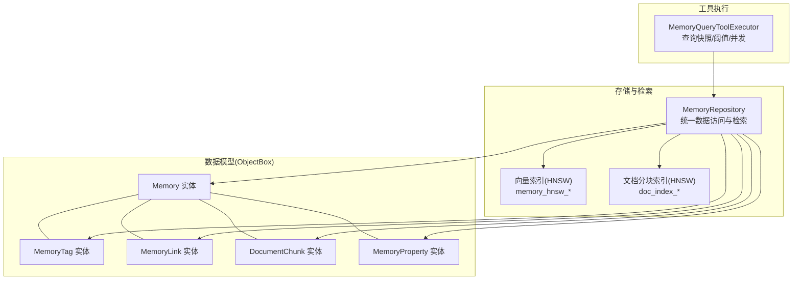
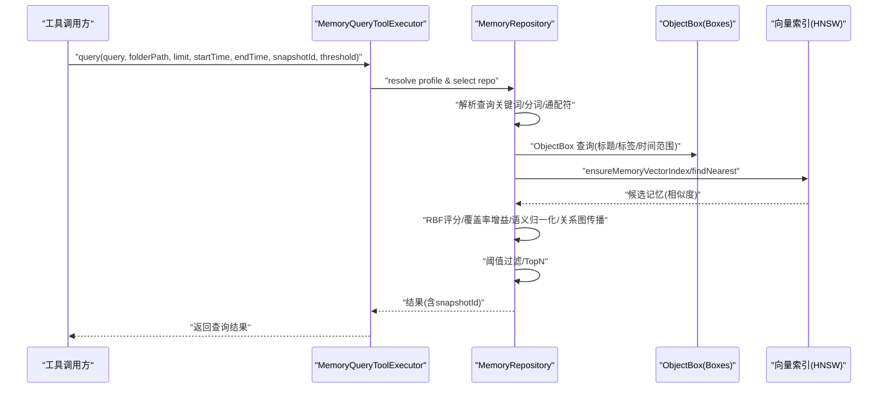
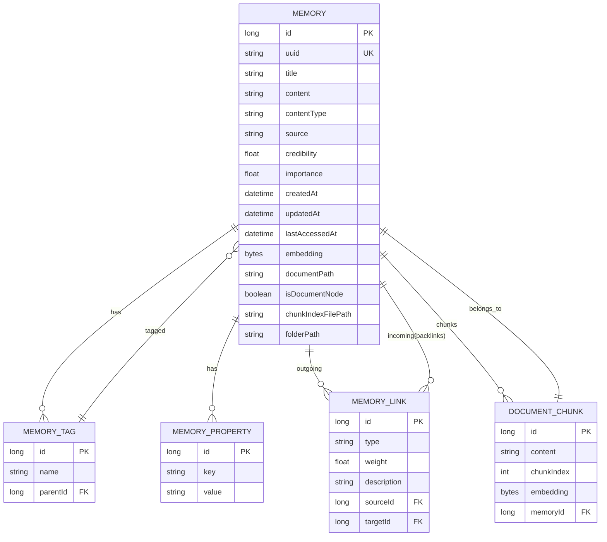
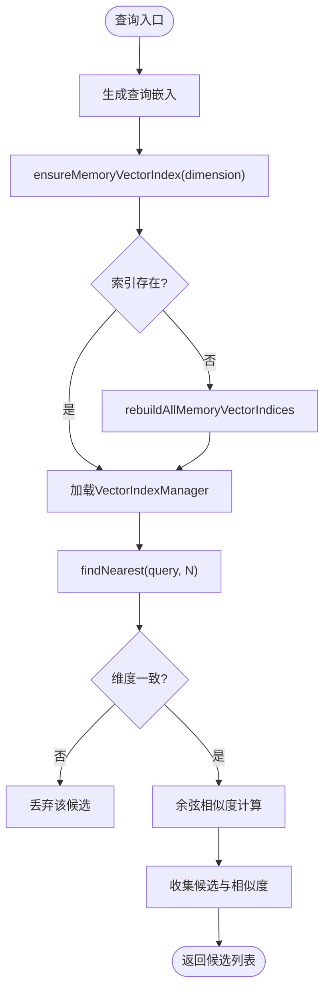
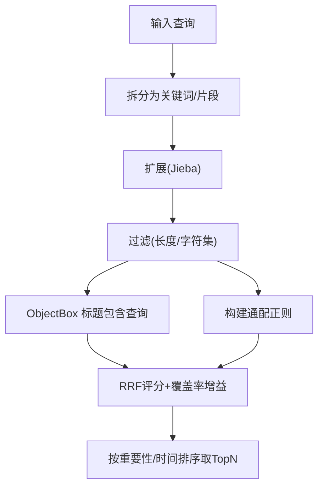
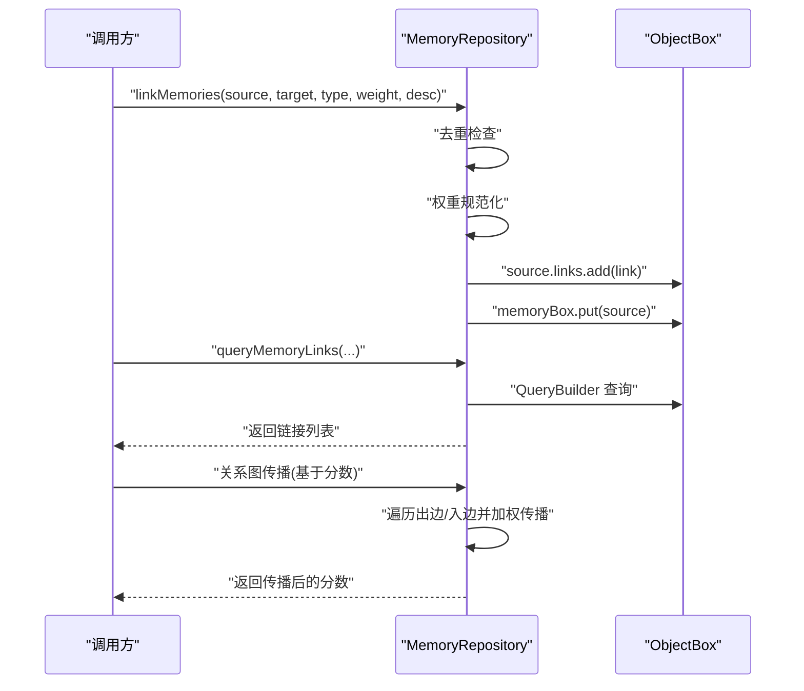
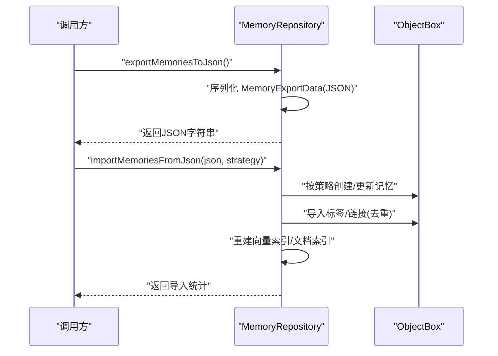
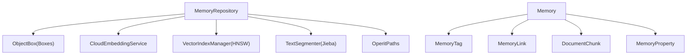

# 记忆管理系统

<cite>
**本文引用的文件**
- [MemoryRepository.kt](file://app/src/main/java/com/ai/assistance/operit/data/repository/MemoryRepository.kt)
- [Memory.kt](file://app/src/main/java/com/ai/assistance/operit/data/model/Memory.kt)
- [default.json](file://app/objectbox-models/default.json)
- [default.json.bak](file://app/objectbox-models/default.json.bak)
- [memory.md](file://docs/package_dev/memory.md)
- [memory_candidate_scoring_formula.md](file://docs/memory_candidate_scoring_formula.md)
- [MemoryQueryToolExecutor.kt](file://app/src/main/java/com/ai/assistance/operit/core/tools/defaultTool/standard/MemoryQueryToolExecutor.kt)
</cite>

## 目录
1. [简介](#简介)
2. [项目结构](#项目结构)
3. [核心组件](#核心组件)
4. [架构总览](#架构总览)
5. [详细组件分析](#详细组件分析)
6. [依赖分析](#依赖分析)
7. [性能考量](#性能考量)
8. [故障排查指南](#故障排查指南)
9. [结论](#结论)
10. [附录](#附录)

## 简介
本文件为 Operit AI 记忆管理系统的全面技术文档，围绕以下目标展开：
- 记忆存储设计：数据模型定义、ObjectBox 数据库配置、索引策略
- 智能搜索算法：向量化处理、相似度计算、时间查询支持
- 记忆链接关系管理：实体间关联、链接权重计算、关系图构建
- 自动分类机制：内容分析、标签生成、分类准确性优化
- 记忆检索优化：查询优化、缓存机制、性能调优
- 备份与恢复：数据迁移、完整性验证、版本兼容性
- 扩展与定制：如何扩展记忆功能、优化搜索性能、处理大规模数据

## 项目结构
记忆系统主要由三层构成：
- 数据模型层：基于 ObjectBox 的实体模型（Memory、MemoryTag、MemoryLink、DocumentChunk、MemoryProperty）
- 存储与检索层：MemoryRepository 提供统一的数据访问与检索能力，包含向量索引、分词与关键词扩展、链接与标签管理、导入导出等
- 工具执行层：MemoryQueryToolExecutor 作为工具入口，负责解析查询快照、阈值控制、跨线程并发安全

**图表来源**
- [MemoryRepository.kt:55-101](file://app/src/main/java/com/ai/assistance/operit/data/repository/MemoryRepository.kt#L55-L101)
- [Memory.kt:17-69](file://app/src/main/java/com/ai/assistance/operit/data/model/Memory.kt#L17-L69)
- [default.json:5-302](file://app/objectbox-models/default.json#L5-L302)

**章节来源**
- [MemoryRepository.kt:55-101](file://app/src/main/java/com/ai/assistance/operit/data/repository/MemoryRepository.kt#L55-L101)
- [Memory.kt:17-69](file://app/src/main/java/com/ai/assistance/operit/data/model/Memory.kt#L17-L69)
- [default.json:5-302](file://app/objectbox-models/default.json#L5-L302)

## 核心组件
- Memory 实体：核心记忆单元，包含标题、内容、类型、可信度、重要性、嵌入向量、文档节点信息、文件夹路径、时间戳等，并维护标签、属性、链接、反向链接、文档分块等关系
- MemoryTag 实体：标签，支持层级父子关系
- MemoryLink 实体：记忆间关系，含类型、权重、描述，并通过 ToOne 关系指向源与目标 Memory
- DocumentChunk 实体：文档分块，支持嵌入向量与所属 Memory 的 Backlink
- MemoryProperty 实体：键值对扩展属性
- MemoryRepository：统一的数据访问与检索引擎，负责：
  - 向量索引管理（HNSW）、文档分块索引重建
  - 语义检索（余弦相似度）、关键词/通配符检索、标签检索
  - 关系图传播（边权重传播）、查询权重归一化
  - 标签与链接的增删改查、批量删除、悬挂链接清理
  - 导入/导出（JSON）与版本兼容处理
- MemoryQueryToolExecutor：工具层入口，负责查询快照、阈值、并发安全与仓库选择

**章节来源**
- [Memory.kt:17-113](file://app/src/main/java/com/ai/assistance/operit/data/model/Memory.kt#L17-L113)
- [MemoryRepository.kt:55-101](file://app/src/main/java/com/ai/assistance/operit/data/repository/MemoryRepository.kt#L55-L101)
- [MemoryQueryToolExecutor.kt:31-65](file://app/src/main/java/com/ai/assistance/operit/core/tools/defaultTool/standard/MemoryQueryToolExecutor.kt#L31-L65)

## 架构总览
记忆系统采用“实体-索引-检索-工具”的分层架构：
- ObjectBox 实体模型定义与索引（folderPath、sourceId、targetId、memoryId 等）
- 向量索引（HNSW）与文档分块索引（HNSW）分别服务于记忆与文档分块的语义检索
- MemoryRepository 统一调度：分词与关键词扩展、RBF 排名、覆盖率增益、语义相似度、关系图传播、阈值过滤
- 工具层通过 MemoryQueryToolExecutor 解析查询参数（时间范围、快照、阈值）并调用 MemoryRepository

**图表来源**
- [MemoryQueryToolExecutor.kt:50-65](file://app/src/main/java/com/ai/assistance/operit/core/tools/defaultTool/standard/MemoryQueryToolExecutor.kt#L50-L65)
- [MemoryRepository.kt:247-271](file://app/src/main/java/com/ai/assistance/operit/data/repository/MemoryRepository.kt#L247-L271)
- [MemoryRepository.kt:583-605](file://app/src/main/java/com/ai/assistance/operit/data/repository/MemoryRepository.kt#L583-L605)

## 详细组件分析

### 数据模型与 ObjectBox 配置
- Memory：核心实体，字段包含 id、uuid、title、content、contentType、source、credibility、importance、createdAt、updatedAt、lastAccessedAt、embedding、documentPath、isDocumentNode、chunkIndexFilePath、folderPath（带索引）、tags、properties、links、backlinks、documentChunks
- MemoryTag：标签实体，支持父子层级（parent/backlink）
- MemoryLink：关系实体，source/target 为 ToOne，sourceId/targetId 建有索引
- DocumentChunk：文档分块，content、chunkIndex、embedding、memoryId（带索引）
- MemoryProperty：键值对扩展属性
- default.json 中定义了实体、属性、索引与关系，modelVersion 为 5，包含 retired 实体/索引/属性/关系列表，体现版本演进与兼容策略

**图表来源**
- [Memory.kt:17-113](file://app/src/main/java/com/ai/assistance/operit/data/model/Memory.kt#L17-L113)
- [default.json:5-302](file://app/objectbox-models/default.json#L5-L302)

**章节来源**
- [Memory.kt:17-113](file://app/src/main/java/com/ai/assistance/operit/data/model/Memory.kt#L17-L113)
- [default.json:5-302](file://app/objectbox-models/default.json#L5-L302)
- [default.json.bak:1-53](file://app/objectbox-models/default.json.bak#L1-L53)

### 向量索引与语义检索
- 向量索引文件命名规则：memory_hnsw_{profile}_{dimension}.idx，按维度分文件
- 文档分块索引文件命名规则：doc_index_{profile}_{memoryId}_{dimension}.hnsw
- 索引重建策略：
  - 单维重建：rebuildMemoryVectorIndexForDimension
  - 影响范围重建：rebuildAffectedMemoryVectorIndices
  - 全部重建：rebuildAllMemoryVectorIndices
  - 文档分块重建：rebuildDocumentChunkIndex
- 语义候选获取：
  - ensureMemoryVectorIndex 确保索引存在并加载
  - findNearest 获取近邻，再通过余弦相似度二次校验维度一致性
- 相似度计算：余弦相似度，支持维度校验与数值稳定性

**图表来源**
- [MemoryRepository.kt:557-568](file://app/src/main/java/com/ai/assistance/operit/data/repository/MemoryRepository.kt#L557-L568)
- [MemoryRepository.kt:583-605](file://app/src/main/java/com/ai/assistance/operit/data/repository/MemoryRepository.kt#L583-L605)

**章节来源**
- [MemoryRepository.kt:273-299](file://app/src/main/java/com/ai/assistance/operit/data/repository/MemoryRepository.kt#L273-L299)
- [MemoryRepository.kt:354-402](file://app/src/main/java/com/ai/assistance/operit/data/repository/MemoryRepository.kt#L354-L402)
- [MemoryRepository.kt:428-459](file://app/src/main/java/com/ai/assistance/operit/data/repository/MemoryRepository.kt#L428-L459)
- [MemoryRepository.kt:570-581](file://app/src/main/java/com/ai/assistance/operit/data/repository/MemoryRepository.kt#L570-L581)
- [MemoryRepository.kt:583-605](file://app/src/main/java/com/ai/assistance/operit/data/repository/MemoryRepository.kt#L583-L605)

### 关键词检索与通配符
- 关键词扩展：保留原始词 + Jieba 分词扩展，中文长句与标题匹配召回提升
- 通配符支持：单个关键词内的 * 作为模糊匹配，构建正则表达式进行匹配
- 词元过滤：长度与字符集限制（2-24，字母数字或中文），避免噪声
- 排名衰减：RRF（Reciprocal Rank Fusion）基础分数 1/(k+rank)，覆盖率增益 1 + 0.6*(命中片段数/总片段数)

**图表来源**
- [MemoryRepository.kt:189-209](file://app/src/main/java/com/ai/assistance/operit/data/repository/MemoryRepository.kt#L189-L209)
- [MemoryRepository.kt:140-159](file://app/src/main/java/com/ai/assistance/operit/data/repository/MemoryRepository.kt#L140-L159)
- [MemoryRepository.kt:634-662](file://app/src/main/java/com/ai/assistance/operit/data/repository/MemoryRepository.kt#L634-L662)
- [MemoryRepository.kt:664-684](file://app/src/main/java/com/ai/assistance/operit/data/repository/MemoryRepository.kt#L664-L684)
- [MemoryRepository.kt:247-258](file://app/src/main/java/com/ai/assistance/operit/data/repository/MemoryRepository.kt#L247-L258)

**章节来源**
- [MemoryRepository.kt:189-209](file://app/src/main/java/com/ai/assistance/operit/data/repository/MemoryRepository.kt#L189-L209)
- [MemoryRepository.kt:140-159](file://app/src/main/java/com/ai/assistance/operit/data/repository/MemoryRepository.kt#L140-L159)
- [MemoryRepository.kt:634-684](file://app/src/main/java/com/ai/assistance/operit/data/repository/MemoryRepository.kt#L634-L684)
- [MemoryRepository.kt:247-258](file://app/src/main/java/com/ai/assistance/operit/data/repository/MemoryRepository.kt#L247-L258)

### 标签检索与属性检索
- 标签检索：遍历目标记忆的标签名，支持通配符匹配，按命中片段数排序
- 属性检索：通过 MemoryProperty 键值对扩展（代码中存在属性实体定义，检索逻辑在仓库中以标签为例）

**章节来源**
- [MemoryRepository.kt:732-759](file://app/src/main/java/com/ai/assistance/operit/data/repository/MemoryRepository.kt#L732-L759)
- [Memory.kt:108-113](file://app/src/main/java/com/ai/assistance/operit/data/model/Memory.kt#L108-L113)

### 关系图传播与链接管理
- 链接创建：去重检查（同源同目标同类型），权重规范化至 [0,1]
- 链接查询：支持按 linkId、sourceId、targetId、类型过滤，限制上限
- 关系传播：从高分源记忆出发，按边权重传播分数，支持双向（出边与入边 backlinks）
- 悬挂链接清理：周期性扫描并移除无效链接，降低关系集合膨胀

**图表来源**
- [MemoryRepository.kt:1038-1066](file://app/src/main/java/com/ai/assistance/operit/data/repository/MemoryRepository.kt#L1038-L1066)
- [MemoryRepository.kt:1086-1096](file://app/src/main/java/com/ai/assistance/operit/data/repository/MemoryRepository.kt#L1086-L1096)
- [MemoryRepository.kt:1476-1501](file://app/src/main/java/com/ai/assistance/operit/data/repository/MemoryRepository.kt#L1476-L1501)
- [MemoryRepository.kt:948-962](file://app/src/main/java/com/ai/assistance/operit/data/repository/MemoryRepository.kt#L948-L962)

**章节来源**
- [MemoryRepository.kt:1038-1066](file://app/src/main/java/com/ai/assistance/operit/data/repository/MemoryRepository.kt#L1038-L1066)
- [MemoryRepository.kt:1086-1096](file://app/src/main/java/com/ai/assistance/operit/data/repository/MemoryRepository.kt#L1086-L1096)
- [MemoryRepository.kt:1476-1501](file://app/src/main/java/com/ai/assistance/operit/data/repository/MemoryRepository.kt#L1476-L1501)
- [MemoryRepository.kt:948-962](file://app/src/main/java/com/ai/assistance/operit/data/repository/MemoryRepository.kt#L948-L962)

### 自动分类与标签生成
- 文件夹路径归一化：normalizeFolderPath 将路径标准化为 “目录/子目录” 形式
- 自动分类：未分类记忆可依据内容与标签自动补全 folderPath，仅影响组织方式，不影响入库决策
- 标签生成：addTagToMemory 支持创建或复用标签并附加到记忆

**章节来源**
- [MemoryRepository.kt:72-82](file://app/src/main/java/com/ai/assistance/operit/data/repository/MemoryRepository.kt#L72-L82)
- [MemoryRepository.kt:1009-1023](file://app/src/main/java/com/ai/assistance/operit/data/repository/MemoryRepository.kt#L1009-L1023)

### 搜索评分与阈值过滤
- 评分组成：关键词命中、反向包含、语义相似、关系传播
- RRF 基础分数：1/(k+rank)，k=60
- 覆盖率增益：1 + 0.6*(命中片段数/总片段数)
- 语义归一化：按关键词数量开平方根进行长度归一
- 阈值过滤：默认阈值 0.025，可通过工具层传入

**章节来源**
- [MemoryRepository.kt:247-271](file://app/src/main/java/com/ai/assistance/operit/data/repository/MemoryRepository.kt#L247-L271)
- [MemoryRepository.kt:1345-1394](file://app/src/main/java/com/ai/assistance/operit/data/repository/MemoryRepository.kt#L1345-L1394)
- [memory_candidate_scoring_formula.md:1-46](file://docs/memory_candidate_scoring_formula.md#L1-L46)

### 备份与恢复（导入/导出）
- 导出：将 MemoryExportData 编码为 JSON 字符串，包含 memories 与 links
- 导入：支持 SKIP/UPDATE/CREATE_NEW 三种策略，自动处理标签与链接去重，重建索引
- 版本兼容：default.json 中包含 retired 列表，便于跨版本迁移与兼容

**图表来源**
- [MemoryRepository.kt:2650-2654](file://app/src/main/java/com/ai/assistance/operit/data/repository/MemoryRepository.kt#L2650-L2654)
- [MemoryRepository.kt:2662-2764](file://app/src/main/java/com/ai/assistance/operit/data/repository/MemoryRepository.kt#L2662-L2764)

**章节来源**
- [MemoryRepository.kt:2650-2764](file://app/src/main/java/com/ai/assistance/operit/data/repository/MemoryRepository.kt#L2650-L2764)
- [default.json:307-359](file://app/objectbox-models/default.json#L307-L359)

### 工具层接口与查询快照
- 工具入口：MemoryQueryToolExecutor 解析当前工具运行上下文中的 memoryProfileId，若无则使用全局活动 profile
- 查询快照：每个 profile 最多维护 32 个快照，支持并发复用同一 snapshotId，自动排除已返回记忆
- 阈值控制：默认阈值 0.0，可在查询时传入自定义阈值

**章节来源**
- [MemoryQueryToolExecutor.kt:31-65](file://app/src/main/java/com/ai/assistance/operit/core/tools/defaultTool/standard/MemoryQueryToolExecutor.kt#L31-L65)
- [memory.md:24-51](file://docs/package_dev/memory.md#L24-L51)

## 依赖分析
- 内部依赖
  - MemoryRepository 依赖 ObjectBox 管理器、CloudEmbeddingService、VectorIndexManager、TextSegmenter、OperitPaths
  - Memory 实体通过 ToMany/ToOne 与 MemoryTag、MemoryLink、DocumentChunk、MemoryProperty 建模
- 外部依赖
  - 向量索引：HNSW（文件系统持久化）
  - 分词：Jieba（内置 TextSegmenter）
  - 序列化：Kotlinx Serialization（JSON）

**图表来源**
- [MemoryRepository.kt:90-98](file://app/src/main/java/com/ai/assistance/operit/data/repository/MemoryRepository.kt#L90-L98)
- [Memory.kt:17-113](file://app/src/main/java/com/ai/assistance/operit/data/model/Memory.kt#L17-L113)

**章节来源**
- [MemoryRepository.kt:90-98](file://app/src/main/java/com/ai/assistance/operit/data/repository/MemoryRepository.kt#L90-L98)
- [Memory.kt:17-113](file://app/src/main/java/com/ai/assistance/operit/data/model/Memory.kt#L17-L113)

## 性能考量
- 向量索引
  - 按维度分文件，重建时按维度重建，避免 HNSW 删除留 tombstone 导致容量异常
  - 索引文件命名与维度解析清晰，便于增量重建与版本管理
- 查询优化
  - RRF 排名 + 覆盖率增益 + 重要性加权，减少无关候选
  - 语义相似度与关键词/标签检索并行，最后统一归一化
- 并发与缓存
  - 查询快照并发安全，避免重复返回
  - 关系集合 reset 与 put 源实体，确保跨线程缓存一致性
- I/O 与存储
  - 索引文件落盘，避免每次启动重建
  - 文档分块索引按记忆维度重建，减少跨维比较

[本节为通用性能建议，无需特定文件引用]

## 故障排查指南
- 向量索引缺失
  - 现象：语义检索无候选
  - 处理：确认 vectorIndexDir 下对应维度索引文件是否存在，触发 rebuildAllMemoryVectorIndices
- 维度不一致
  - 现象：相似度计算失败或返回空
  - 处理：确保查询嵌入与候选嵌入维度一致，参考 ensureMemoryVectorIndex 与 cosineSimilarity
- 悬挂链接
  - 现象：关系集合膨胀或查询异常
  - 处理：定期触发 cleanupDanglingLinksIfNeeded 或等待周期性清理
- 导入失败
  - 现象：导入 JSON 抛异常
  - 处理：检查 MemoryExportData 结构与 UUID 映射，确认策略（SKIP/UPDATE/CREATE_NEW）与去重逻辑

**章节来源**
- [MemoryRepository.kt:557-568](file://app/src/main/java/com/ai/assistance/operit/data/repository/MemoryRepository.kt#L557-L568)
- [MemoryRepository.kt:583-605](file://app/src/main/java/com/ai/assistance/operit/data/repository/MemoryRepository.kt#L583-L605)
- [MemoryRepository.kt:948-962](file://app/src/main/java/com/ai/assistance/operit/data/repository/MemoryRepository.kt#L948-L962)
- [MemoryRepository.kt:2760-2763](file://app/src/main/java/com/ai/assistance/operit/data/repository/MemoryRepository.kt#L2760-L2763)

## 结论
Operit 记忆管理系统通过 ObjectBox 实体模型与 HNSW 向量索引实现了高效的记忆存储与检索，结合关键词扩展、语义相似度、标签检索与关系图传播，形成多维度融合的智能搜索体系。工具层提供查询快照、阈值控制与并发安全，配合导入导出与版本兼容策略，满足大规模数据场景下的扩展与维护需求。

[本节为总结，无需特定文件引用]

## 附录
- API 参考（工具层）
  - query：支持自然语言、通配符、时间范围、快照与阈值
  - getByTitle：精确标题读取，支持文档分块索引
  - create/update/delete/move：记忆 CRUD 与批量移动
  - link/queryLinks/updateLink/deleteLink：链接管理
- 数学公式参考
  - RRF 基础分数、覆盖率增益、语义相似度归一化、关系传播增量

**章节来源**
- [memory.md:24-227](file://docs/package_dev/memory.md#L24-L227)
- [memory_candidate_scoring_formula.md:1-46](file://docs/memory_candidate_scoring_formula.md#L1-L46)