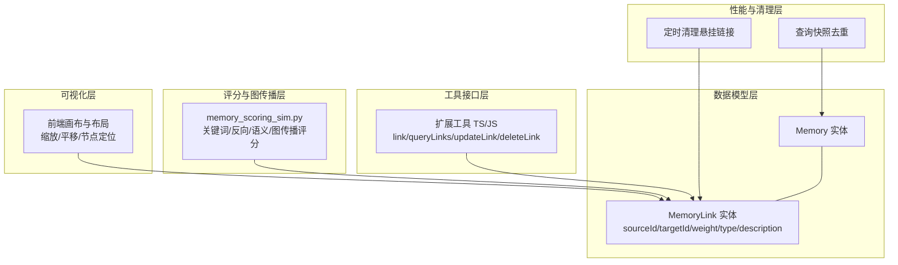
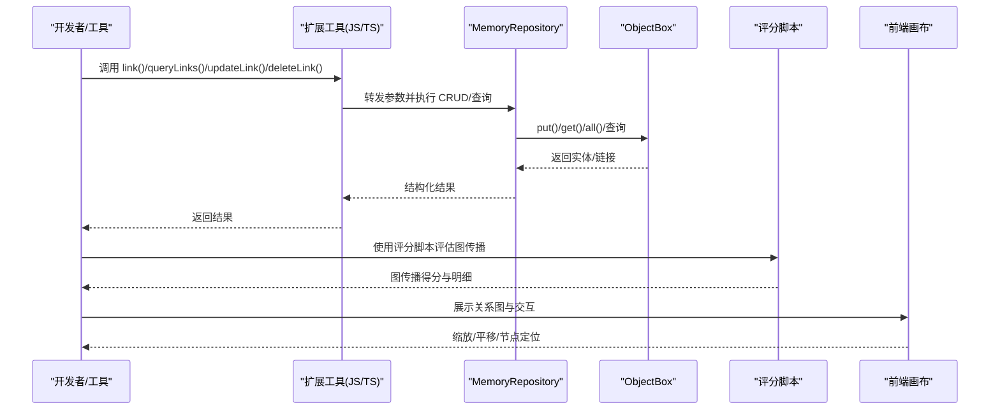
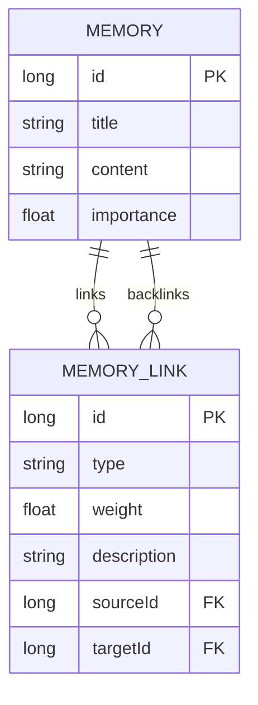
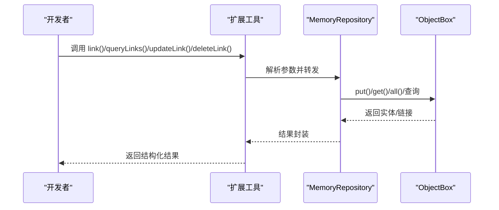
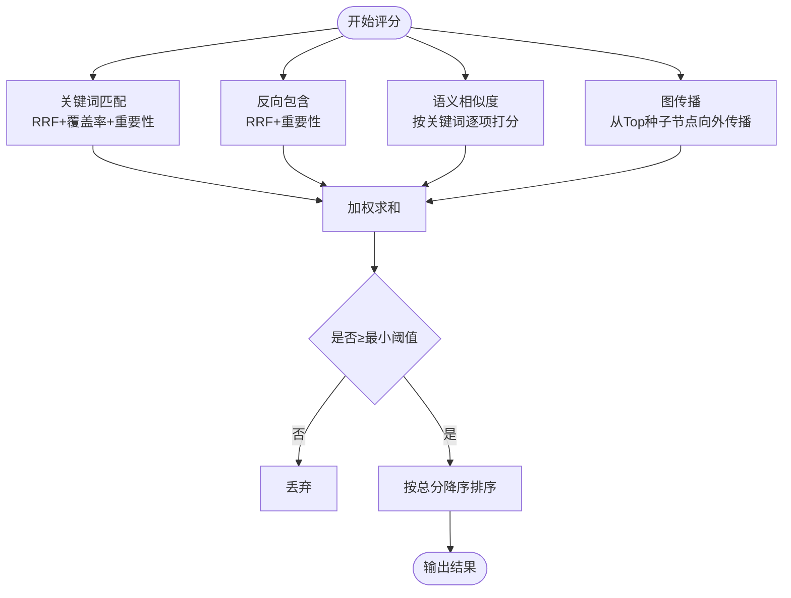
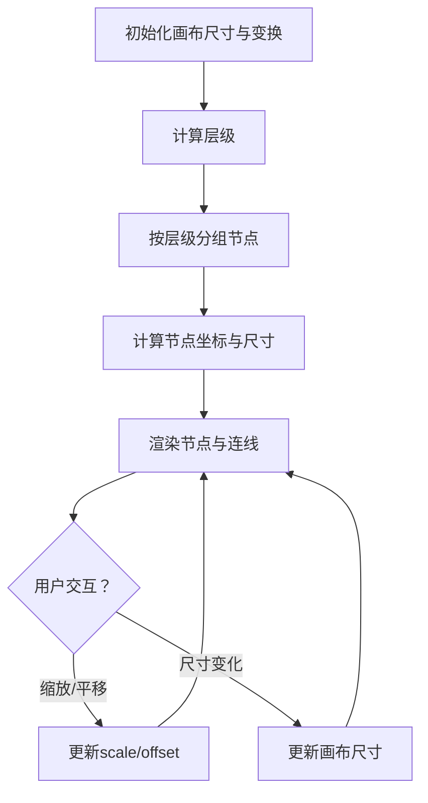
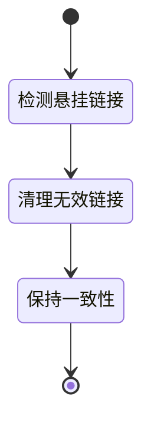
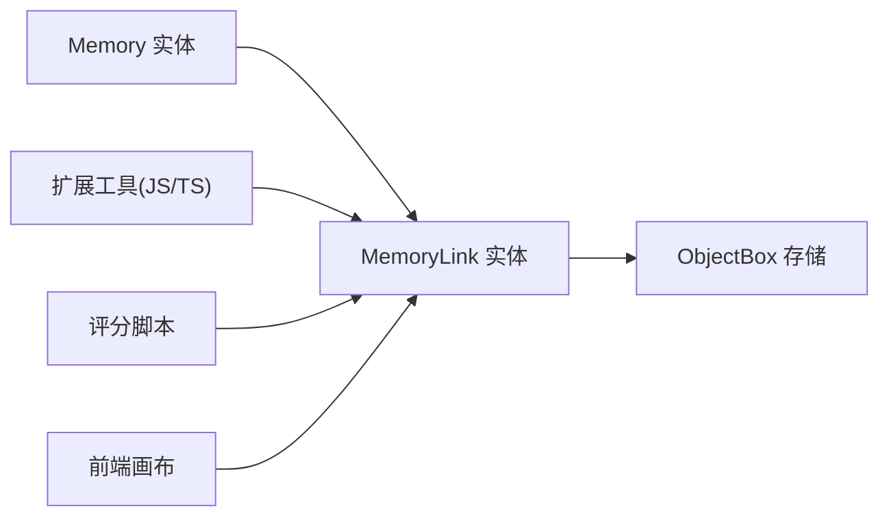

# 记忆链接管理

<cite>
**本文引用的文件**
- [default.json](file://app/objectbox-models/default.json)
- [default.json.bak](file://app/objectbox-models/default.json.bak)
- [memory.md](file://docs/package_dev/memory.md)
- [extended_memory_tools.ts](file://examples/extended_memory_tools.ts)
- [extended_memory_tools.js](file://examples/extended_memory_tools.js)
- [extended_memory_tools.js](file://app/src/main/assets/packages/extended_memory_tools.js)
- [memory_scoring_sim.py](file://tools/memory/memory_scoring_sim.py)
- [Operit 记忆管理系统设计思想与详细流程分析.md](file://my_docs/Operit 记忆管理系统设计思想与详细流程分析.md)
- [plan-execution.ui.ts](file://examples/deepsearching/src/ui/plan-execution.ui.ts)
</cite>

## 目录
1. [简介](#简介)
2. [项目结构](#项目结构)
3. [核心组件](#核心组件)
4. [架构总览](#架构总览)
5. [详细组件分析](#详细组件分析)
6. [依赖分析](#依赖分析)
7. [性能考虑](#性能考虑)
8. [故障排查指南](#故障排查指南)
9. [结论](#结论)
10. [附录](#附录)

## 简介
本文件围绕 Operit 的“记忆链接管理”子系统，系统化阐述记忆之间的关系建模、链接创建/更新/删除流程、链接权重与评分算法、关系图构建与可视化、查询性能优化、以及链接清理与内存优化策略。文档同时提供面向开发者的扩展与定制建议，帮助读者快速理解并高效使用与演进该系统。

## 项目结构
Operit 的记忆链接管理由以下层次构成：
- 数据模型层：基于 ObjectBox 的 Memory 与 MemoryLink 实体及索引
- 工具接口层：JS/TS 扩展工具，提供 link/queryLinks/updateLink/deleteLink 等 API
- 评分与图传播层：Python 脚本实现的链接权重与图遍历评分逻辑
- 可视化层：前端交互式画布与节点布局算法
- 性能与清理层：定时清理悬挂链接、快照去重、索引优化

图表来源
- [default.json:114-157](file://app/objectbox-models/default.json#L114-L157)
- [default.json.bak:114-157](file://app/objectbox-models/default.json.bak#L114-L157)
- [memory.md:104-121](file://docs/package_dev/memory.md#L104-L121)
- [memory_scoring_sim.py:389-422](file://tools/memory/memory_scoring_sim.py#L389-L422)
- [plan-execution.ui.ts:344-427](file://examples/deepsearching/src/ui/plan-execution.ui.ts#L344-L427)

章节来源
- [default.json:114-157](file://app/objectbox-models/default.json#L114-L157)
- [default.json.bak:114-157](file://app/objectbox-models/default.json.bak#L114-L157)
- [memory.md:104-121](file://docs/package_dev/memory.md#L104-L121)

## 核心组件
- MemoryLink 实体：承载链接的类型、权重、描述，以及 sourceId/targetId（指向 Memory 实体），并带有索引字段以提升查询性能
- 扩展工具接口：提供 link、queryLinks、updateLink、deleteLink 的调用入口，参数涵盖 link 类型、权重、描述、过滤条件与上限
- 评分与图传播：基于关键词命中、反向包含、语义相似度与图遍历的加权评分，支持不同 ScoreMode 的权重乘数
- 可视化与交互：前端画布支持缩放与平移，节点位置按层级与间距布局
- 性能与清理：定时清理悬挂链接、查询快照去重、索引优化

章节来源
- [default.json:114-157](file://app/objectbox-models/default.json#L114-L157)
- [default.json.bak:114-157](file://app/objectbox-models/default.json.bak#L114-L157)
- [memory.md:104-121](file://docs/package_dev/memory.md#L104-L121)
- [memory_scoring_sim.py:48-58](file://tools/memory/memory_scoring_sim.py#L48-L58)
- [plan-execution.ui.ts:344-427](file://examples/deepsearching/src/ui/plan-execution.ui.ts#L344-L427)

## 架构总览
记忆链接管理贯穿“数据模型 → 工具接口 → 评分传播 → 可视化 → 性能优化”的完整链路。下图展示了典型调用序列：

图表来源
- [memory.md:104-121](file://docs/package_dev/memory.md#L104-L121)
- [extended_memory_tools.ts:159-186](file://examples/extended_memory_tools.ts#L159-L186)
- [extended_memory_tools.js:64-99](file://examples/extended_memory_tools.js#L64-L99)
- [extended_memory_tools.js:218-234](file://app/src/main/assets/packages/extended_memory_tools.js#L218-L234)
- [memory_scoring_sim.py:389-422](file://tools/memory/memory_scoring_sim.py#L389-L422)
- [plan-execution.ui.ts:344-427](file://examples/deepsearching/src/ui/plan-execution.ui.ts#L344-L427)

## 详细组件分析

### 组件一：MemoryLink 数据模型与索引
- 字段与约束
  - id：自增主键
  - type：字符串，标识链接类型
  - weight：浮点数，表示链接强度
  - description：字符串，链接描述
  - sourceId/targetId：长整型，分别指向 Memory 实体，且带有索引以加速查询
- 关系与索引
  - sourceId/targetId 为关系字段，映射到 Memory 实体
  - 通过索引字段提升按 source/target/type 的过滤效率

图表来源
- [default.json:114-157](file://app/objectbox-models/default.json#L114-L157)
- [default.json.bak:114-157](file://app/objectbox-models/default.json.bak#L114-L157)

章节来源
- [default.json:114-157](file://app/objectbox-models/default.json#L114-L157)
- [default.json.bak:114-157](file://app/objectbox-models/default.json.bak#L114-L157)

### 组件二：扩展工具接口（链接 CRUD 与查询）
- 接口能力
  - link(sourceTitle, targetTitle, linkType?, weight?, description?)
  - queryLinks(linkId?, sourceTitle?, targetTitle?, linkType?, limit?)
  - updateLink(linkId?, sourceTitle?, targetTitle?, linkType?, newLinkType?, weight?, description?)
  - deleteLink(linkId?, sourceTitle?, targetTitle?, linkType?)
- 参数与行为
  - 支持按 ID 或源/目标/类型组合定位链接
  - 支持限制返回数量
  - 返回结构化结果对象

图表来源
- [memory.md:104-121](file://docs/package_dev/memory.md#L104-L121)
- [extended_memory_tools.ts:159-186](file://examples/extended_memory_tools.ts#L159-L186)
- [extended_memory_tools.js:64-99](file://examples/extended_memory_tools.js#L64-L99)
- [extended_memory_tools.js:218-234](file://app/src/main/assets/packages/extended_memory_tools.js#L218-L234)

章节来源
- [memory.md:104-121](file://docs/package_dev/memory.md#L104-L121)
- [extended_memory_tools.ts:159-186](file://examples/extended_memory_tools.ts#L159-L186)
- [extended_memory_tools.js:64-99](file://examples/extended_memory_tools.js#L64-L99)
- [extended_memory_tools.js:218-234](file://app/src/main/assets/packages/extended_memory_tools.js#L218-L234)

### 组件三：链接权重与评分算法（关键词/语义/图传播）
- 评分组成
  - 关键词匹配：基于词干/分词后的词片段在标题中的命中，采用 RRF 排名与覆盖率加权
  - 反向包含：查询词包含标题时的反向匹配
  - 语义相似度：对每个关键词进行相似度打分，支持 sqrt(K) 归一化
  - 图传播：从高分种子节点出发，按链接权重与边权重进行传播，叠加基础系数
- 权重与模式
  - 支持三种 ScoreMode：平衡、关键词优先、语义优先，分别对关键词/语义/图权重施加乘数
  - 最终得分需超过阈值才保留

图表来源
- [memory_scoring_sim.py:272-471](file://tools/memory/memory_scoring_sim.py#L272-L471)
- [memory_scoring_sim.py:389-422](file://tools/memory/memory_scoring_sim.py#L389-L422)

章节来源
- [memory_scoring_sim.py:48-58](file://tools/memory/memory_scoring_sim.py#L48-L58)
- [memory_scoring_sim.py:272-471](file://tools/memory/memory_scoring_sim.py#L272-L471)
- [memory_scoring_sim.py:389-422](file://tools/memory/memory_scoring_sim.py#L389-L422)

### 组件四：关系图构建与可视化
- 节点布局
  - 按层级分组，节点尺寸与水平/垂直间距固定
  - 通过初始偏移与总高度居中，保证画布内均匀分布
- 交互
  - 支持缩放与平移，实时更新变换参数
  - 尺寸变化时重新计算画布大小

图表来源
- [plan-execution.ui.ts:344-427](file://examples/deepsearching/src/ui/plan-execution.ui.ts#L344-L427)

章节来源
- [plan-execution.ui.ts:344-427](file://examples/deepsearching/src/ui/plan-execution.ui.ts#L344-L427)

### 组件五：链接清理机制（悬挂链接检测与定时清理）
- 定时清理
  - 以固定时间间隔（如 30 秒）扫描并清理无效链接
- 目标
  - 保持图谱一致性，避免孤儿边影响查询与评分
- 与查询快照的协同
  - 查询快照去重避免重复返回，配合清理减少冗余

图表来源
- [Operit 记忆管理系统设计思想与详细流程分析.md:725-736](file://my_docs/Operit 记忆管理系统设计思想与详细流程分析.md#L725-L736)

章节来源
- [Operit 记忆管理系统设计思想与详细流程分析.md:725-736](file://my_docs/Operit 记忆管理系统设计思想与详细流程分析.md#L725-L736)

## 依赖分析
- 数据模型依赖
  - MemoryLink 依赖 Memory 实体（sourceId/targetId）
  - ObjectBox 为实体与索引提供持久化与查询能力
- 工具接口依赖
  - 扩展工具依赖 MemoryRepository 的 CRUD 与查询方法
- 评分脚本依赖
  - 评分脚本独立运行，但其公式与权重与系统一致，便于一致性验证
- 可视化依赖
  - 前端画布依赖节点布局算法与交互事件

图表来源
- [default.json:114-157](file://app/objectbox-models/default.json#L114-L157)
- [memory.md:104-121](file://docs/package_dev/memory.md#L104-L121)
- [memory_scoring_sim.py:389-422](file://tools/memory/memory_scoring_sim.py#L389-L422)
- [plan-execution.ui.ts:344-427](file://examples/deepsearching/src/ui/plan-execution.ui.ts#L344-L427)

章节来源
- [default.json:114-157](file://app/objectbox-models/default.json#L114-L157)
- [memory.md:104-121](file://docs/package_dev/memory.md#L104-L121)
- [memory_scoring_sim.py:389-422](file://tools/memory/memory_scoring_sim.py#L389-L422)
- [plan-execution.ui.ts:344-427](file://examples/deepsearching/src/ui/plan-execution.ui.ts#L344-L427)

## 性能考虑
- 索引与过滤
  - sourceId/targetId 建有索引，适合高频过滤场景
- 查询快照去重
  - 通过 ConcurrentHashMap + LRU 控制会话内去重，避免重复返回
- 评分与图传播
  - 仅对 Top N 种子节点进行图传播，控制复杂度
- 增量重建与预过滤
  - 仅重建受影响维度，减少索引重建开销；结合 folderPath 与时间范围预过滤，缩小搜索空间

章节来源
- [Operit 记忆管理系统设计思想与详细流程分析.md:725-736](file://my_docs/Operit 记忆管理系统设计思想与详细流程分析.md#L725-L736)

## 故障排查指南
- 链接查询无结果
  - 检查过滤参数（linkId/sourceTitle/targetTitle/linkType/limit）是否正确
  - 确认是否存在悬挂链接，必要时触发清理
- 评分异常
  - 核对 ScoreMode 与权重配置，确认语义 sqrt 归一化开关
  - 对比评分脚本输出与系统逻辑，确保输入一致
- 可视化异常
  - 检查画布尺寸与变换参数，确认缩放/平移事件处理正常
  - 校验节点布局算法参数（节点宽高、间距、层级）

章节来源
- [memory.md:104-121](file://docs/package_dev/memory.md#L104-L121)
- [memory_scoring_sim.py:48-58](file://tools/memory/memory_scoring_sim.py#L48-L58)
- [plan-execution.ui.ts:344-427](file://examples/deepsearching/src/ui/plan-execution.ui.ts#L344-L427)

## 结论
Operit 的记忆链接管理以结构化实体与工具接口为基础，结合语义与图传播的评分体系，辅以可视化与性能优化策略，形成一套可扩展、可演进的关系图谱管理方案。通过定时清理与快照去重保障数据一致性与查询体验，开发者可在不破坏现有模型的前提下，按需扩展链接类型、权重策略与可视化交互。

## 附录

### A. 常见链接类型与权重建议
- 强链接：用于强因果/强依赖关系，建议权重较高
- 中等链接：用于相关/辅助关系，建议中等权重
- 弱链接：用于泛化/参考关系，建议较低权重
- 说明：权重应结合业务语境与评分脚本的归一化策略综合设定

### B. 代码示例路径（不展示具体代码）
- 建立新链接关系
  - [link 接口定义:106-108](file://docs/package_dev/memory.md#L106-L108)
  - [TS 扩展工具调用:159-161](file://examples/extended_memory_tools.ts#L159-L161)
  - [JS 扩展工具导出:229-230](file://app/src/main/assets/packages/extended_memory_tools.js#L229-L230)
- 查询相关记忆
  - [queryLinks 接口定义:110-112](file://docs/package_dev/memory.md#L110-L112)
  - [TS 扩展工具调用:164-172](file://examples/extended_memory_tools.ts#L164-L172)
  - [JS 扩展工具导出:218-230](file://app/src/main/assets/packages/extended_memory_tools.js#L218-L230)
- 更新链接
  - [updateLink 接口定义:114-116](file://docs/package_dev/memory.md#L114-L116)
  - [TS 扩展工具调用:175-185](file://examples/extended_memory_tools.ts#L175-L185)
  - [JS 扩展工具导出:219-231](file://app/src/main/assets/packages/extended_memory_tools.js#L219-L231)
- 删除链接
  - [deleteLink 接口定义:118-120](file://docs/package_dev/memory.md#L118-L120)
  - [TS 扩展工具调用:186-186](file://examples/extended_memory_tools.ts#L186-L186)
  - [JS 扩展工具导出:220-232](file://app/src/main/assets/packages/extended_memory_tools.js#L220-L232)

### C. 链接权重计算与动态调整策略
- 关键词/语义/图权重可通过 ScoreMode 动态调整
- 建议根据业务反馈与 A/B 实验结果，周期性校准权重与阈值
- 评分脚本提供公平性模拟与热力图分析，可用于策略验证

章节来源
- [memory_scoring_sim.py:48-58](file://tools/memory/memory_scoring_sim.py#L48-L58)
- [memory_scoring_sim.py:745-800](file://tools/memory/memory_scoring_sim.py#L745-L800)