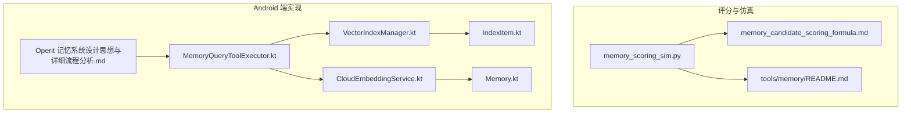
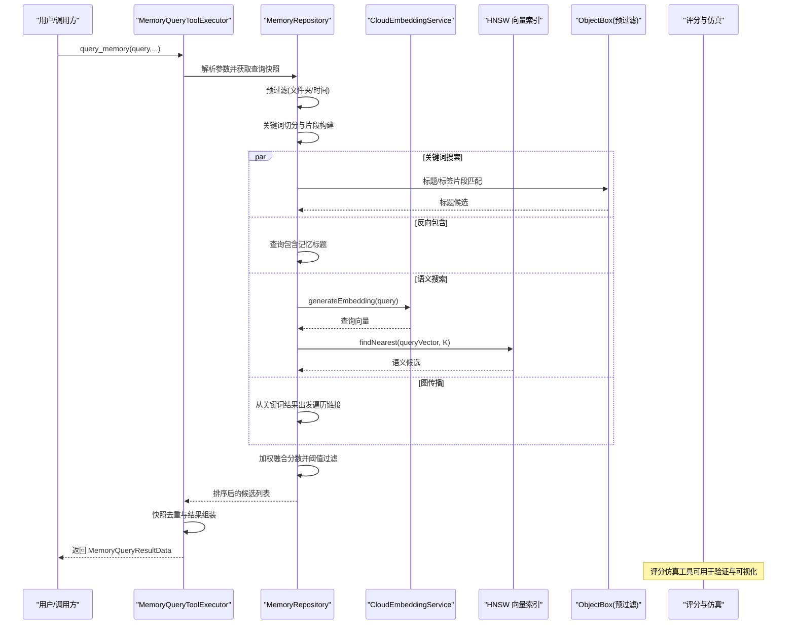
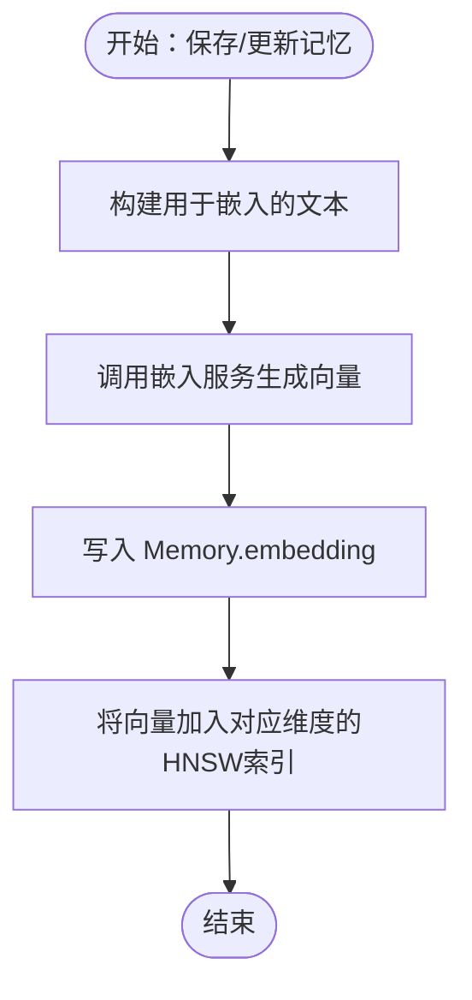
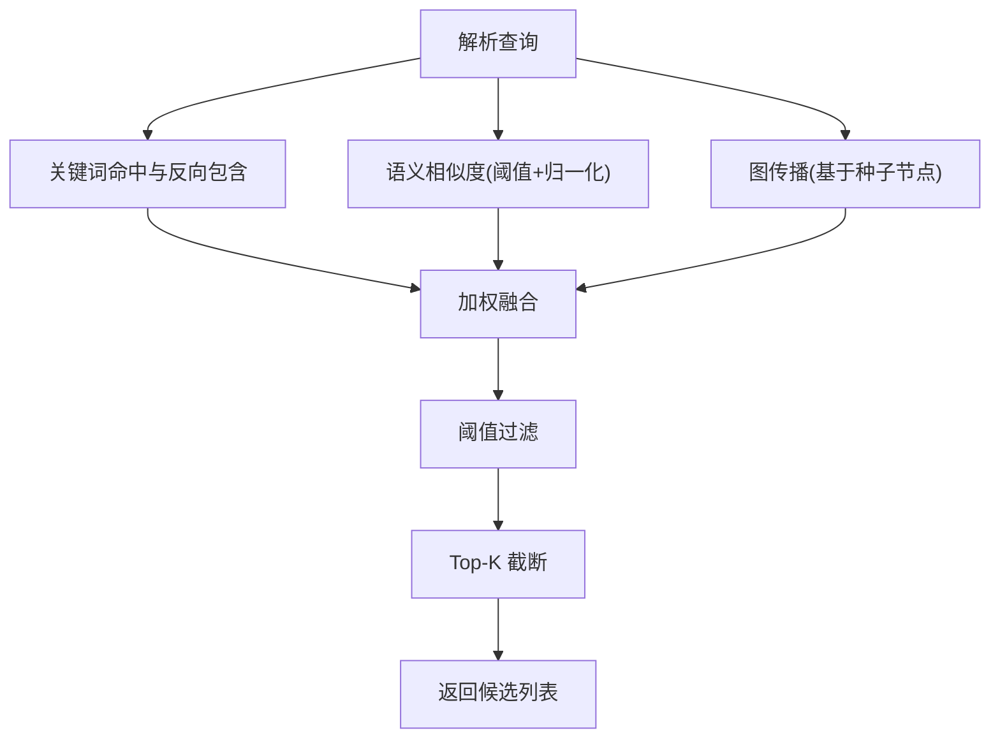
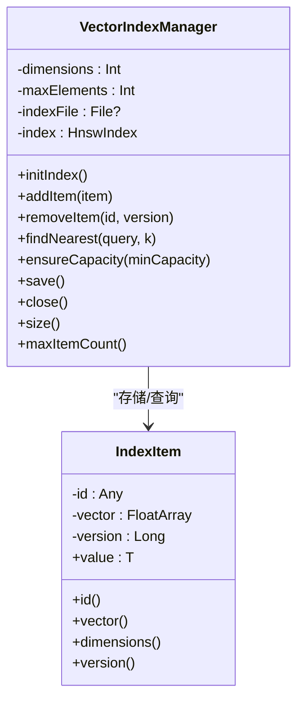
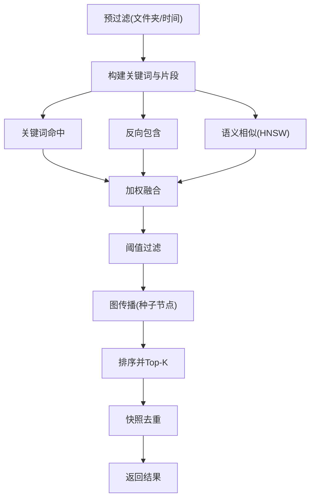
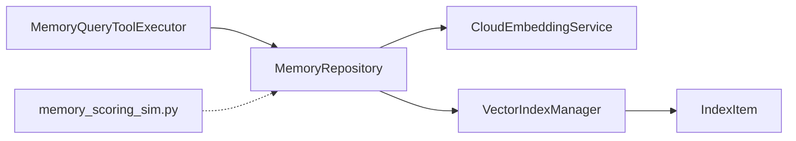

# 语义搜索算法

<cite>
**本文引用的文件**   
- [tools/memory/memory_scoring_sim.py](file://tools/memory/memory_scoring_sim.py)
- [docs/memory_candidate_scoring_formula.md](file://docs/memory_candidate_scoring_formula.md)
- [my_docs/Operit 记忆管理系统设计思想与详细流程分析.md](file://my_docs/Operit 记忆管理系统设计思想与详细流程分析.md)
- [app/src/main/java/com/ai/assistance/operit/util/vector/VectorIndexManager.kt](file://app/src/main/java/com/ai/assistance/operit/util/vector/VectorIndexManager.kt)
- [app/src/main/java/com/ai/assistance/operit/util/vector/IndexItem.kt](file://app/src/main/java/com/ai/assistance/operit/util/vector/IndexItem.kt)
- [app/src/main/java/com/ai/assistance/operit/services/CloudEmbeddingService.kt](file://app/src/main/java/com/ai/assistance/operit/services/CloudEmbeddingService.kt)
- [app/src/main/java/com/ai/assistance/operit/data/model/Memory.kt](file://app/src/main/java/com/ai/assistance/operit/data/model/Memory.kt)
- [app/src/main/java/com/ai/assistance/operit/core/tools/defaultTool/standard/MemoryQueryToolExecutor.kt](file://app/src/main/java/com/ai/assistance/operit/core/tools/defaultTool/standard/MemoryQueryToolExecutor.kt)
- [tools/memory/README.md](file://tools/memory/README.md)
</cite>

## 目录
1. [简介](#简介)
2. [项目结构](#项目结构)
3. [核心组件](#核心组件)
4. [架构总览](#架构总览)
5. [详细组件分析](#详细组件分析)
6. [依赖分析](#依赖分析)
7. [性能考虑](#性能考虑)
8. [故障排查指南](#故障排查指南)
9. [结论](#结论)
10. [附录](#附录)

## 简介
本文件面向开发者系统化梳理 Operit 的语义搜索算法与实现，覆盖以下关键主题：
- 向量化处理流程：文本嵌入生成、向量维度管理、嵌入质量评估思路
- 相似度计算：余弦相似度、阈值过滤、语义归一化
- HNSW 向量索引：索引构建、近似最近邻搜索、索引维护
- 候选记忆选择：候选过滤、排序与阈值、图传播
- 算法实现示例：如何优化搜索性能、调整相似度权重、处理大规模向量数据
- 搜索调试：过程可视化、性能监控、结果分析工具
- 开发者优化与扩展建议

## 项目结构
围绕语义搜索的关键代码分布在以下模块：
- 内存候选评分与仿真：tools/memory/memory_scoring_sim.py 提供评分全流程与可视化工具
- 文档与公式说明：docs/memory_candidate_scoring_formula.md 给出数学公式与流程说明
- 记忆系统设计与流程：my_docs/Operit 记忆管理系统设计思想与详细流程分析.md 描述端侧实现与调用链
- 向量索引与封装：app/src/main/java/com/ai/assistance/operit/util/vector 下的 VectorIndexManager.kt 与 IndexItem.kt
- 嵌入服务与模型：app/src/main/java/com/ai/assistance/operit/services/CloudEmbeddingService.kt
- 数据模型：app/src/main/java/com/ai/assistance/operit/data/model/Memory.kt
- 工具入口：app/src/main/java/com/ai/assistance/operit/core/tools/defaultTool/standard/MemoryQueryToolExecutor.kt

**图表来源**
- [tools/memory/memory_scoring_sim.py:1-1093](file://tools/memory/memory_scoring_sim.py#L1-L1093)
- [docs/memory_candidate_scoring_formula.md:1-46](file://docs/memory_candidate_scoring_formula.md#L1-L46)
- [my_docs/Operit 记忆管理系统设计思想与详细流程分析.md:318-361](file://my_docs/Operit 记忆管理系统设计思想与详细流程分析.md#L318-L361)
- [app/src/main/java/com/ai/assistance/operit/util/vector/VectorIndexManager.kt:1-92](file://app/src/main/java/com/ai/assistance/operit/util/vector/VectorIndexManager.kt#L1-L92)
- [app/src/main/java/com/ai/assistance/operit/util/vector/IndexItem.kt:1-35](file://app/src/main/java/com/ai/assistance/operit/util/vector/IndexItem.kt#L1-L35)
- [app/src/main/java/com/ai/assistance/operit/services/CloudEmbeddingService.kt](file://app/src/main/java/com/ai/assistance/operit/services/CloudEmbeddingService.kt)
- [app/src/main/java/com/ai/assistance/operit/data/model/Memory.kt](file://app/src/main/java/com/ai/assistance/operit/data/model/Memory.kt)
- [app/src/main/java/com/ai/assistance/operit/core/tools/defaultTool/standard/MemoryQueryToolExecutor.kt](file://app/src/main/java/com/ai/assistance/operit/core/tools/defaultTool/standard/MemoryQueryToolExecutor.kt)

**章节来源**
- [tools/memory/memory_scoring_sim.py:1-1093](file://tools/memory/memory_scoring_sim.py#L1-L1093)
- [docs/memory_candidate_scoring_formula.md:1-46](file://docs/memory_candidate_scoring_formula.md#L1-L46)
- [my_docs/Operit 记忆管理系统设计思想与详细流程分析.md:318-361](file://my_docs/Operit 记忆管理系统设计思想与详细流程分析.md#L318-L361)

## 核心组件
- 评分与仿真引擎：提供关键词命中、反向包含、语义相似、图传播、阈值过滤与Top-K截断，并支持公平性模拟与可视化
- 向量索引管理器：基于 HNSW 的近似最近邻索引，支持初始化、添加、删除、查询、容量调整与持久化
- 嵌入服务：负责生成查询与文档的向量表示，支撑语义相似计算
- 记忆模型与工具执行器：定义记忆结构、保存/更新时自动生成嵌入、在搜索流程中调用嵌入与索引

**章节来源**
- [tools/memory/memory_scoring_sim.py:272-471](file://tools/memory/memory_scoring_sim.py#L272-L471)
- [app/src/main/java/com/ai/assistance/operit/util/vector/VectorIndexManager.kt:14-92](file://app/src/main/java/com/ai/assistance/operit/util/vector/VectorIndexManager.kt#L14-L92)
- [app/src/main/java/com/ai/assistance/operit/services/CloudEmbeddingService.kt](file://app/src/main/java/com/ai/assistance/operit/services/CloudEmbeddingService.kt)
- [app/src/main/java/com/ai/assistance/operit/data/model/Memory.kt](file://app/src/main/java/com/ai/assistance/operit/data/model/Memory.kt)

## 架构总览
下图展示了从用户查询到候选记忆返回的完整流程，涵盖关键词、反向包含、语义与图传播四路信号，以及向量嵌入与 HNSW 索引的调用。

**图表来源**
- [my_docs/Operit 记忆管理系统设计思想与详细流程分析.md:318-361](file://my_docs/Operit 记忆管理系统设计思想与详细流程分析.md#L318-L361)
- [tools/memory/memory_scoring_sim.py:272-471](file://tools/memory/memory_scoring_sim.py#L272-L471)
- [app/src/main/java/com/ai/assistance/operit/services/CloudEmbeddingService.kt](file://app/src/main/java/com/ai/assistance/operit/services/CloudEmbeddingService.kt)
- [app/src/main/java/com/ai/assistance/operit/util/vector/VectorIndexManager.kt:58-61](file://app/src/main/java/com/ai/assistance/operit/util/vector/VectorIndexManager.kt#L58-L61)

## 详细组件分析

### 向量化处理流程
- 文本嵌入生成
  - 查询向量：在搜索时由 CloudEmbeddingService 生成
  - 文档向量：保存/更新记忆时自动生成并写入 Memory.embedding
  - 维度追踪：保存时记录向量维度，按维度分索引
- 向量维度确定
  - 索引初始化时指定维度；若后续维度变化，需重建索引或按维度分区
- 嵌入质量评估
  - 可通过评分仿真工具对语义相似度进行阈值与归一化实验，观察覆盖率与公平性

**图表来源**
- [my_docs/Operit 记忆管理系统设计思想与详细流程分析.md:695-724](file://my_docs/Operit 记忆管理系统设计思想与详细流程分析.md#L695-L724)
- [app/src/main/java/com/ai/assistance/operit/services/CloudEmbeddingService.kt](file://app/src/main/java/com/ai/assistance/operit/services/CloudEmbeddingService.kt)
- [app/src/main/java/com/ai/assistance/operit/data/model/Memory.kt](file://app/src/main/java/com/ai/assistance/operit/data/model/Memory.kt)

**章节来源**
- [my_docs/Operit 记忆管理系统设计思想与详细流程分析.md:695-724](file://my_docs/Operit 记忆管理系统设计思想与详细流程分析.md#L695-L724)
- [app/src/main/java/com/ai/assistance/operit/services/CloudEmbeddingService.kt](file://app/src/main/java/com/ai/assistance/operit/services/CloudEmbeddingService.kt)
- [app/src/main/java/com/ai/assistance/operit/data/model/Memory.kt](file://app/src/main/java/com/ai/assistance/operit/data/model/Memory.kt)

### 相似度计算与候选融合
- 余弦相似度
  - 使用点积与范数归一化计算，支持从预存映射或查询/记忆向量实时计算
- 阈值与归一化
  - 语义相似度需超过阈值才计入；对关键词数量进行平方根归一化，避免“关键词越多越占优”
- 候选融合
  - 关键词命中、反向包含、语义相似、图传播分别计算贡献，加权求和后阈值过滤与Top-K截断

**图表来源**
- [tools/memory/memory_scoring_sim.py:233-269](file://tools/memory/memory_scoring_sim.py#L233-L269)
- [tools/memory/memory_scoring_sim.py:272-471](file://tools/memory/memory_scoring_sim.py#L272-L471)
- [docs/memory_candidate_scoring_formula.md:25-37](file://docs/memory_candidate_scoring_formula.md#L25-L37)

**章节来源**
- [tools/memory/memory_scoring_sim.py:233-269](file://tools/memory/memory_scoring_sim.py#L233-L269)
- [tools/memory/memory_scoring_sim.py:272-471](file://tools/memory/memory_scoring_sim.py#L272-L471)
- [docs/memory_candidate_scoring_formula.md:25-37](file://docs/memory_candidate_scoring_formula.md#L25-L37)

### HNSW 向量索引实现
- 索引构建
  - 初始化时指定维度、距离函数（余弦距离）、最大元素数；支持移除能力
- 近似最近邻搜索
  - findNearest(query, k) 返回前 k 个最相似项
- 索引维护
  - addItem/removeItem 支持动态增删
  - ensureCapacity 动态扩容
  - save/close 支持持久化与资源释放

**图表来源**
- [app/src/main/java/com/ai/assistance/operit/util/vector/VectorIndexManager.kt:14-92](file://app/src/main/java/com/ai/assistance/operit/util/vector/VectorIndexManager.kt#L14-L92)
- [app/src/main/java/com/ai/assistance/operit/util/vector/IndexItem.kt:11-35](file://app/src/main/java/com/ai/assistance/operit/util/vector/IndexItem.kt#L11-L35)

**章节来源**
- [app/src/main/java/com/ai/assistance/operit/util/vector/VectorIndexManager.kt:14-92](file://app/src/main/java/com/ai/assistance/operit/util/vector/VectorIndexManager.kt#L14-L92)
- [app/src/main/java/com/ai/assistance/operit/util/vector/IndexItem.kt:11-35](file://app/src/main/java/com/ai/assistance/operit/util/vector/IndexItem.kt#L11-L35)

### 候选记忆选择机制
- 候选过滤
  - 预过滤：按文件夹路径与时间范围缩小候选集
  - 关键词与反向包含：基于片段匹配与标题包含快速筛选
  - 语义相似：通过 HNSW 获取候选并按阈值过滤
  - 图传播：从高分种子节点向外传播，增强关联记忆得分
- 排序与阈值
  - 加权求和后按分数降序排序，低于阈值丢弃，取前 K 条
- 快照去重
  - 工具执行器对已见记忆进行去重，避免重复返回

**图表来源**
- [my_docs/Operit 记忆管理系统设计思想与详细流程分析.md:318-361](file://my_docs/Operit 记忆管理系统设计思想与详细流程分析.md#L318-L361)
- [tools/memory/memory_scoring_sim.py:272-471](file://tools/memory/memory_scoring_sim.py#L272-L471)
- [app/src/main/java/com/ai/assistance/operit/core/tools/defaultTool/standard/MemoryQueryToolExecutor.kt](file://app/src/main/java/com/ai/assistance/operit/core/tools/defaultTool/standard/MemoryQueryToolExecutor.kt)

**章节来源**
- [my_docs/Operit 记忆管理系统设计思想与详细流程分析.md:318-361](file://my_docs/Operit 记忆管理系统设计思想与详细流程分析.md#L318-L361)
- [tools/memory/memory_scoring_sim.py:272-471](file://tools/memory/memory_scoring_sim.py#L272-L471)
- [app/src/main/java/com/ai/assistance/operit/core/tools/defaultTool/standard/MemoryQueryToolExecutor.kt](file://app/src/main/java/com/ai/assistance/operit/core/tools/defaultTool/standard/MemoryQueryToolExecutor.kt)

### 算法实现示例与优化建议
- 优化搜索性能
  - 采用 HNSW 近似搜索替代全量向量扫描，合理设置 K 与图参数
  - 对查询与文档向量进行单位化（余弦距离前提下），提升稳定性
  - 预过滤与分片检索降低无效计算
- 调整相似度权重
  - 通过配置关键字权重、语义权重、边权重与模式（平衡/关键词优先/语义优先）控制不同信号的影响力
  - 使用平方根归一化缓解关键词数量偏差
- 处理大规模向量数据
  - 分维度索引或按业务域拆分索引，避免跨域低效
  - 定期清理与压缩索引，保持查询延迟稳定

**章节来源**
- [tools/memory/memory_scoring_sim.py:745-800](file://tools/memory/memory_scoring_sim.py#L745-L800)
- [tools/memory/memory_scoring_sim.py:473-501](file://tools/memory/memory_scoring_sim.py#L473-L501)
- [app/src/main/java/com/ai/assistance/operit/util/vector/VectorIndexManager.kt:67-72](file://app/src/main/java/com/ai/assistance/operit/util/vector/VectorIndexManager.kt#L67-L72)

### 搜索调试与可视化
- 评分仿真工具
  - 提供命令行接口，读取样本数据集，输出 Top-K 结果与统计信息
  - 支持公平性模拟（蒙特卡洛）与多维热力图绘制，辅助分析阈值与覆盖率行为
- 性能监控与结果分析
  - 通过日志记录索引加载/保存异常、查询耗时与候选规模
  - 在工具执行器中进行快照去重与结果汇总，便于回归验证

**章节来源**
- [tools/memory/README.md:1-75](file://tools/memory/README.md#L1-L75)
- [tools/memory/memory_scoring_sim.py:550-614](file://tools/memory/memory_scoring_sim.py#L550-L614)
- [tools/memory/memory_scoring_sim.py:665-721](file://tools/memory/memory_scoring_sim.py#L665-L721)
- [app/src/main/java/com/ai/assistance/operit/util/vector/VectorIndexManager.kt:27-44](file://app/src/main/java/com/ai/assistance/operit/util/vector/VectorIndexManager.kt#L27-L44)

## 依赖分析
- 组件耦合
  - MemoryQueryToolExecutor 依赖 MemoryRepository、CloudEmbeddingService 与 VectorIndexManager
  - VectorIndexManager 依赖 hnswlib 库与 IndexItem 封装
  - 评分仿真工具独立于端侧实现，便于离线验证
- 外部依赖
  - 余弦距离、HNSW 实现来自第三方库
  - 可选中文分词库（jieba）用于片段扩展

**图表来源**
- [app/src/main/java/com/ai/assistance/operit/core/tools/defaultTool/standard/MemoryQueryToolExecutor.kt](file://app/src/main/java/com/ai/assistance/operit/core/tools/defaultTool/standard/MemoryQueryToolExecutor.kt)
- [app/src/main/java/com/ai/assistance/operit/util/vector/VectorIndexManager.kt:14-92](file://app/src/main/java/com/ai/assistance/operit/util/vector/VectorIndexManager.kt#L14-L92)
- [app/src/main/java/com/ai/assistance/operit/util/vector/IndexItem.kt:11-35](file://app/src/main/java/com/ai/assistance/operit/util/vector/IndexItem.kt#L11-L35)
- [tools/memory/memory_scoring_sim.py:272-471](file://tools/memory/memory_scoring_sim.py#L272-L471)

**章节来源**
- [app/src/main/java/com/ai/assistance/operit/core/tools/defaultTool/standard/MemoryQueryToolExecutor.kt](file://app/src/main/java/com/ai/assistance/operit/core/tools/defaultTool/standard/MemoryQueryToolExecutor.kt)
- [app/src/main/java/com/ai/assistance/operit/util/vector/VectorIndexManager.kt:14-92](file://app/src/main/java/com/ai/assistance/operit/util/vector/VectorIndexManager.kt#L14-L92)
- [app/src/main/java/com/ai/assistance/operit/util/vector/IndexItem.kt:11-35](file://app/src/main/java/com/ai/assistance/operit/util/vector/IndexItem.kt#L11-L35)
- [tools/memory/memory_scoring_sim.py:272-471](file://tools/memory/memory_scoring_sim.py#L272-L471)

## 性能考虑
- 索引参数
  - 合理设置 HNSW 的连接数与回溯参数，权衡召回与速度
  - 使用余弦距离时确保向量单位化，提高稳定性
- 数据规模
  - 分维度/分域索引，避免跨域无效搜索
  - 定期重建索引以维持性能
- 查询路径
  - 先关键词与反向包含快速过滤，再进行语义搜索
  - 控制 Top-K 与阈值，避免下游模型过载

## 故障排查指南
- 索引加载失败
  - 观察日志错误并尝试重建索引；确认索引文件完整性
- 查询无结果或结果偏差大
  - 检查嵌入服务可用性与维度一致性
  - 调整语义阈值与权重，结合评分仿真工具验证
- 性能退化
  - 检查索引容量与扩容策略，确认是否需要分域或分维度

**章节来源**
- [app/src/main/java/com/ai/assistance/operit/util/vector/VectorIndexManager.kt:27-44](file://app/src/main/java/com/ai/assistance/operit/util/vector/VectorIndexManager.kt#L27-L44)
- [tools/memory/memory_scoring_sim.py:745-800](file://tools/memory/memory_scoring_sim.py#L745-L800)

## 结论
Operit 的语义搜索以“关键词+反向包含+语义相似+图传播”的多信号融合为核心，结合 HNSW 近似最近邻索引与云端嵌入服务，实现了高效且可调优的候选记忆检索。通过评分仿真工具与可视化手段，开发者可以系统地验证与优化搜索效果，并针对大规模向量数据制定合理的索引与过滤策略。

## 附录
- 数学公式参考：关键词命中、反向包含、语义相似、图传播与阈值过滤的数学表达
- 命令行工具：评分仿真脚本的输入格式、参数与输出字段说明

**章节来源**
- [docs/memory_candidate_scoring_formula.md:1-46](file://docs/memory_candidate_scoring_formula.md#L1-L46)
- [tools/memory/README.md:24-75](file://tools/memory/README.md#L24-L75)