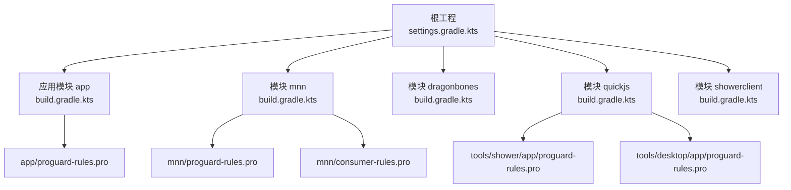
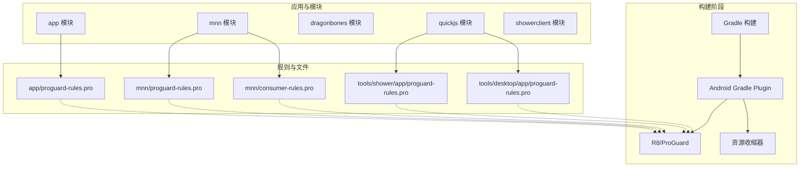
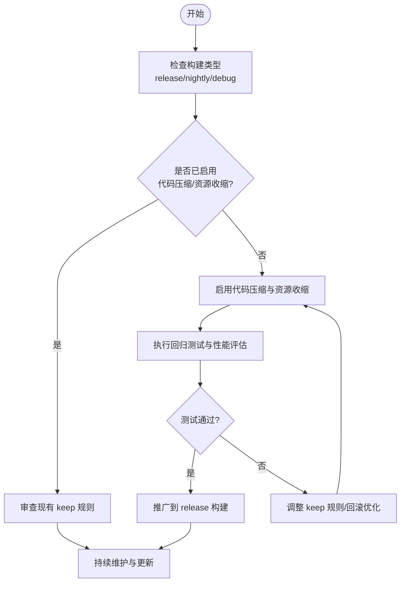
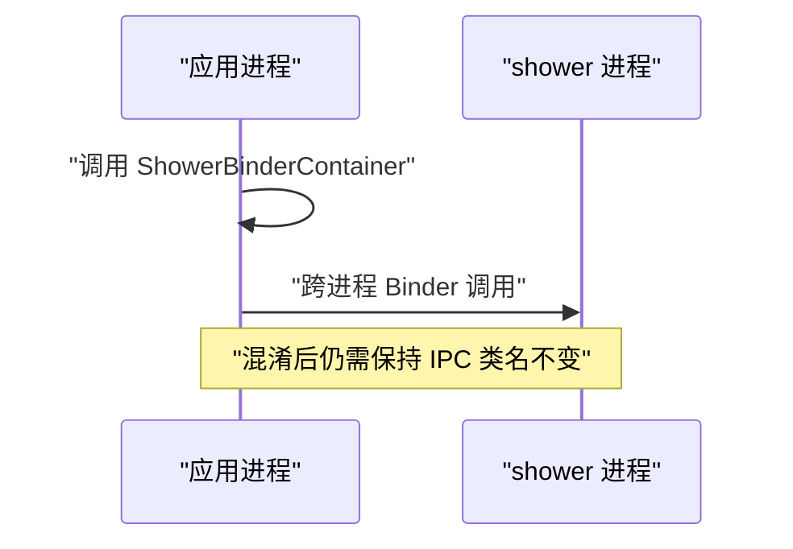
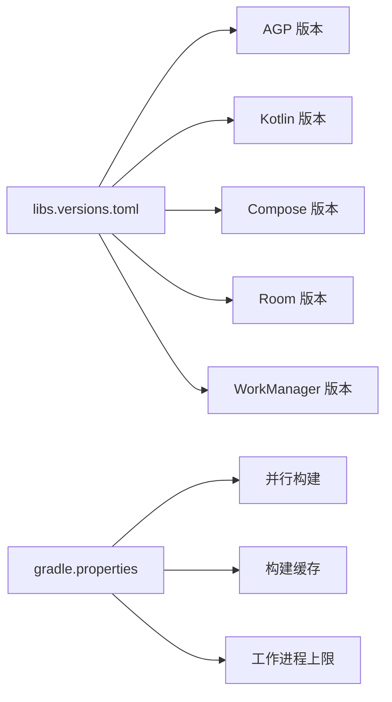

# 代码混淆与优化

<cite>
**本文引用的文件**   
- [app/proguard-rules.pro](file://app/proguard-rules.pro)
- [app/build.gradle.kts](file://app/build.gradle.kts)
- [mnn/proguard-rules.pro](file://mnn/proguard-rules.pro)
- [mnn/consumer-rules.pro](file://mnn/consumer-rules.pro)
- [tools/shower/app/proguard-rules.pro](file://tools/shower/app/proguard-rules.pro)
- [tools/desktop/app/proguard-rules.pro](file://tools/desktop/app/proguard-rules.pro)
- [mnn/build.gradle.kts](file://mnn/build.gradle.kts)
- [dragonbones/build.gradle.kts](file://dragonbones/build.gradle.kts)
- [showerclient/build.gradle.kts](file://showerclient/build.gradle.kts)
- [gradle/libs.versions.toml](file://gradle/libs.versions.toml)
- [settings.gradle.kts](file://settings.gradle.kts)
- [gradle.properties](file://gradle.properties)
</cite>

## 目录
1. [引言](#引言)
2. [项目结构](#项目结构)
3. [核心组件](#核心组件)
4. [架构总览](#架构总览)
5. [详细组件分析](#详细组件分析)
6. [依赖关系分析](#依赖关系分析)
7. [性能考量](#性能考量)
8. [故障排查指南](#故障排查指南)
9. [结论](#结论)
10. [附录](#附录)

## 引言
本指南面向 Operit 项目的 Android 应用与多模块工程，系统性讲解代码混淆与优化实践，覆盖以下主题：
- ProGuard 与 R8 规则配置：keep 规则、混淆规则、优化选项
- 代码压缩策略：无用代码移除、常量折叠、内联优化
- 资源优化技术：资源压缩、无用资源清理、资源混淆
- Kotlin 字节码优化：内联函数、协程优化、注解处理
- Android 特殊优化规则：View binding、Parcelable 自动生成、Kotlin 扩展函数
- 混淆后测试与验证方法
- 常见问题排查与解决
- 在安全与性能之间取得平衡的策略

当前仓库中，应用层与部分模块已具备基础的混淆配置与资源排除策略，但整体未启用代码压缩与资源收缩。本文在现有基础上给出可落地的优化建议与实施路径。

## 项目结构
Operit 采用多模块 Gradle 工程组织，根工程统一管理版本与仓库，应用模块 app 作为聚合入口，集成多个子模块（如 mnn、dragonbones、quickjs 等）。混淆规则分布在 app 与各模块的独立 proguard 文件中；R8/Gradle 配置集中在各模块的 build.gradle.kts 中。



**图表来源**
- [settings.gradle.kts:1-30](file://settings.gradle.kts#L1-L30)
- [app/build.gradle.kts:1-446](file://app/build.gradle.kts#L1-L446)
- [mnn/build.gradle.kts:1-107](file://mnn/build.gradle.kts#L1-L107)
- [dragonbones/build.gradle.kts:1-74](file://dragonbones/build.gradle.kts#L1-L74)
- [showerclient/build.gradle.kts:1-39](file://showerclient/build.gradle.kts#L1-L39)
- [app/proguard-rules.pro:1-91](file://app/proguard-rules.pro#L1-L91)
- [mnn/proguard-rules.pro:1-22](file://mnn/proguard-rules.pro#L1-L22)
- [mnn/consumer-rules.pro:1-13](file://mnn/consumer-rules.pro#L1-L13)
- [tools/shower/app/proguard-rules.pro:1-39](file://tools/shower/app/proguard-rules.pro#L1-L39)
- [tools/desktop/app/proguard-rules.pro:1-21](file://tools/desktop/app/proguard-rules.pro#L1-L21)

**章节来源**
- [settings.gradle.kts:1-30](file://settings.gradle.kts#L1-L30)
- [app/build.gradle.kts:1-446](file://app/build.gradle.kts#L1-L446)

## 核心组件
- 应用层混淆与资源策略
  - 当前应用层未启用代码压缩与资源收缩，保留了默认的 ProGuard/R8 规则文件引用，便于后续逐步开启优化。
  - 包装与资源排除策略已配置，减少重复与冲突文件，提升打包稳定性。
- 模块化混淆
  - mnn 模块提供消费者规则与内部规则，确保对外公开 API 不被破坏，同时保留原生接口与枚举。
  - shower 与 desktop 工具模块也各自维护了最小化的混淆规则，以满足跨进程或桌面运行时的反射/IPC 需求。
- 版本与插件管理
  - 通过 libs.versions.toml 统一管理 AGP、Kotlin、Compose、Room、WorkManager 等依赖版本，保证构建一致性。
- 构建参数与并行化
  - gradle.properties 开启了并行、缓存、工作进程上限等参数，有助于加速构建，为后续启用 R8 优化提供良好环境。

**章节来源**
- [app/build.gradle.kts:83-169](file://app/build.gradle.kts#L83-L169)
- [mnn/build.gradle.kts:19-71](file://mnn/build.gradle.kts#L19-L71)
- [mnn/proguard-rules.pro:1-22](file://mnn/proguard-rules.pro#L1-L22)
- [mnn/consumer-rules.pro:1-13](file://mnn/consumer-rules.pro#L1-L13)
- [tools/shower/app/proguard-rules.pro:1-39](file://tools/shower/app/proguard-rules.pro#L1-L39)
- [tools/desktop/app/proguard-rules.pro:1-21](file://tools/desktop/app/proguard-rules.pro#L1-L21)
- [gradle/libs.versions.toml:1-271](file://gradle/libs.versions.toml#L1-L271)
- [gradle.properties:1-28](file://gradle.properties#L1-L28)

## 架构总览
下图展示了 Operit 的混淆与优化在构建流程中的位置与交互：



**图表来源**
- [app/build.gradle.kts:83-115](file://app/build.gradle.kts#L83-L115)
- [mnn/build.gradle.kts:64-71](file://mnn/build.gradle.kts#L64-L71)
- [app/proguard-rules.pro:1-91](file://app/proguard-rules.pro#L1-L91)
- [mnn/proguard-rules.pro:1-22](file://mnn/proguard-rules.pro#L1-L22)
- [mnn/consumer-rules.pro:1-13](file://mnn/consumer-rules.pro#L1-L13)
- [tools/shower/app/proguard-rules.pro:1-39](file://tools/shower/app/proguard-rules.pro#L1-L39)
- [tools/desktop/app/proguard-rules.pro:1-21](file://tools/desktop/app/proguard-rules.pro#L1-L21)

## 详细组件分析

### 应用层混淆与资源策略
- 当前状态
  - release 与 nightly 构建类型均未启用代码压缩与资源收缩，保留了默认的 ProGuard 规则文件引用，便于后续逐步开启优化。
  - 包装与资源排除策略已配置，避免 META-INF 冲突与重复文件导致的打包失败。
- 建议
  - 先在 nightly 或 debug 构建类型开启代码压缩与资源收缩，进行回归测试与性能评估后再推广到 release。
  - 逐步引入 keep 规则，覆盖反射、IPC、AIDL、序列化、注解处理器生成的类等关键路径。



**章节来源**
- [app/build.gradle.kts:83-115](file://app/build.gradle.kts#L83-L115)
- [app/build.gradle.kts:135-169](file://app/build.gradle.kts#L135-L169)
- [app/proguard-rules.pro:1-91](file://app/proguard-rules.pro#L1-L91)

### 模块化混淆：mnn 模块
- 目标
  - 保护原生接口与公共 API，同时允许内部优化。
- 关键点
  - 保留原生方法签名，避免 JNI 调用失败。
  - 保留公共 API 类与枚举，确保外部依赖稳定。
  - 提供消费者规则，约束上层模块的混淆行为。

```mermaid
classDiagram
class MNNPublicAPI {
"+public 方法集"
"+枚举类型"
}
class NativeMethods {
"+native <methods>"
}
class ConsumerRules {
"+对外 API 保持不变"
}
MNNPublicAPI --> NativeMethods : "JNI 调用"
ConsumerRules --> MNNPublicAPI : "约束混淆"
```

**图表来源**
- [mnn/proguard-rules.pro:8-22](file://mnn/proguard-rules.pro#L8-L22)
- [mnn/consumer-rules.pro:3-13](file://mnn/consumer-rules.pro#L3-L13)

**章节来源**
- [mnn/build.gradle.kts:19-71](file://mnn/build.gradle.kts#L19-L71)
- [mnn/proguard-rules.pro:1-22](file://mnn/proguard-rules.pro#L1-L22)
- [mnn/consumer-rules.pro:1-13](file://mnn/consumer-rules.pro#L1-L13)

### 工具模块混淆：shower 与 desktop
- shower 工具模块
  - 保留主类与 Binder IPC 类型，确保跨进程通信不因混淆而中断。
- desktop 工具模块
  - 提供基础的 ProGuard 规则模板，便于后续扩展。



**图表来源**
- [tools/shower/app/proguard-rules.pro:23-39](file://tools/shower/app/proguard-rules.pro#L23-L39)

**章节来源**
- [tools/shower/app/proguard-rules.pro:1-39](file://tools/shower/app/proguard-rules.pro#L1-L39)
- [tools/desktop/app/proguard-rules.pro:1-21](file://tools/desktop/app/proguard-rules.pro#L1-L21)

### Kotlin 字节码优化与注解处理
- 当前配置
  - Kotlin 编译目标为 JVM 17，使用 Kotlin 插件与 Compose 插件。
  - Room、WorkManager、Shizuku 等依赖已引入，注解处理器生成的类需纳入 keep 规则。
- 建议
  - 为注解处理器生成的类添加 keep 规则，避免运行时反射失败。
  - 对协程与内联函数保持谨慎，优先通过 keep 保留关键 API，避免过度内联导致调试困难。

**章节来源**
- [app/build.gradle.kts:6-15](file://app/build.gradle.kts#L6-L15)
- [app/build.gradle.kts:175-179](file://app/build.gradle.kts#L175-L179)
- [dragonbones/build.gradle.kts:39-42](file://dragonbones/build.gradle.kts#L39-L42)
- [showerclient/build.gradle.kts:21-25](file://showerclient/build.gradle.kts#L21-L25)

## 依赖关系分析
- 版本与仓库
  - 通过 libs.versions.toml 统一版本，确保依赖一致性与升级效率。
  - 仓库包含 Google、Maven Central、JitPack、第三方快照等，满足多源依赖需求。
- 构建参数
  - gradle.properties 启用并行、缓存、工作进程上限等，有利于大规模工程的构建性能。



**图表来源**
- [gradle/libs.versions.toml:1-271](file://gradle/libs.versions.toml#L1-L271)
- [gradle.properties:1-28](file://gradle.properties#L1-L28)

**章节来源**
- [gradle/libs.versions.toml:1-271](file://gradle/libs.versions.toml#L1-L271)
- [gradle.properties:1-28](file://gradle.properties#L1-L28)

## 性能考量
- 代码压缩与资源收缩
  - 在保证功能稳定的前提下，逐步开启代码压缩与资源收缩，结合性能测试（冷启动、内存占用、包体大小）评估收益。
- R8 优化选项
  - 利用 R8 的常量折叠、内联优化、无用代码移除等能力，减少字节码体积与运行时开销。
- 构建性能
  - 保持并行构建与缓存开启，合理设置工作进程上限，避免过度并发导致资源争用。

[本节为通用指导，无需特定文件引用]

## 故障排查指南
- 常见问题与定位
  - 反射/序列化失败：检查是否遗漏对反射类或序列化字段的 keep 规则。
  - AIDL/Binder IPC 失败：确认 Parcelable 与 AIDL 接口的 CREATOR 与接口类未被混淆。
  - 第三方库警告：使用 `-dontwarn` 屏蔽非关键警告，或按需引入对应依赖。
  - 跨进程通信异常：确保跨进程 Binder 类名保持不变，必要时单独为这些类添加 keep 规则。
- 验证方法
  - 在 nightly 构建中启用压缩与资源收缩，执行端到端功能测试与性能回归测试。
  - 使用 Android Studio 的 APK 分析工具检查包体构成与潜在重复资源。
  - 结合日志与崩溃报告，定位混淆导致的运行时异常。

**章节来源**
- [app/proguard-rules.pro:36-39](file://app/proguard-rules.pro#L36-L39)
- [app/proguard-rules.pro:23-34](file://app/proguard-rules.pro#L23-L34)
- [tools/shower/app/proguard-rules.pro:27-39](file://tools/shower/app/proguard-rules.pro#L27-L39)

## 结论
Operit 已具备模块化的混淆与资源策略基础，建议在确保功能稳定的前提下，逐步启用代码压缩与资源收缩，并配套完善 keep 规则与验证流程。通过合理的优化与严格的回归测试，在安全与性能之间取得最佳平衡。

[本节为总结，无需特定文件引用]

## 附录

### Android 特殊优化规则清单（建议）
- View Binding 与 Compose
  - 为 Compose 相关类与视图绑定生成的类添加 keep 规则，避免运行时找不到视图。
- Parcelable 自动生成
  - 保留所有 Parcelable 类的 CREATOR 字段，确保序列化/反序列化正常。
- Kotlin 扩展函数与内联
  - 对关键扩展函数与内联函数的调用点添加 keep 规则，避免内联失败导致的反射异常。
- 注解处理器生成类
  - 为 Room、WorkManager、Shizuku 等依赖生成的类添加 keep 规则，确保运行时反射可用。

[本节为通用指导，无需特定文件引用]