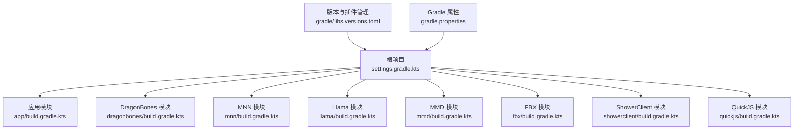
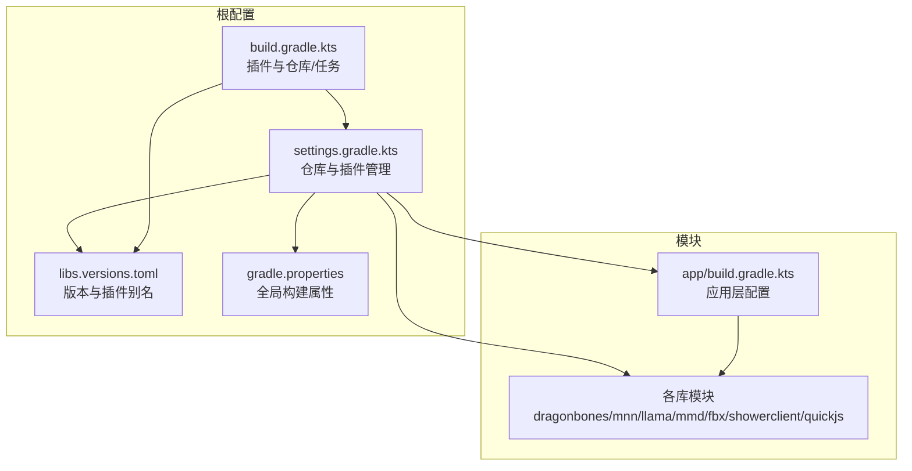
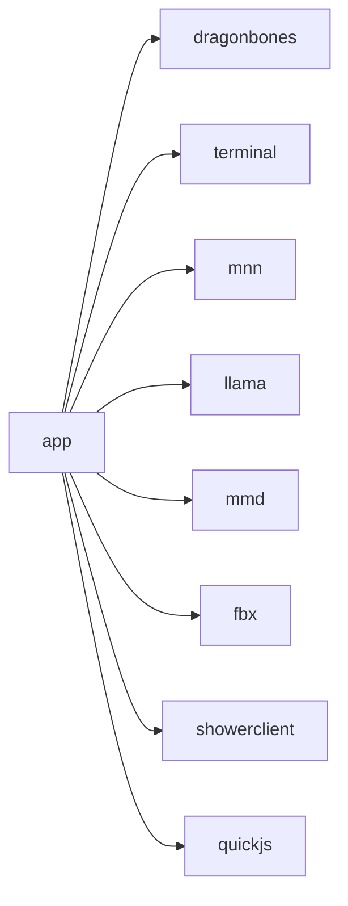
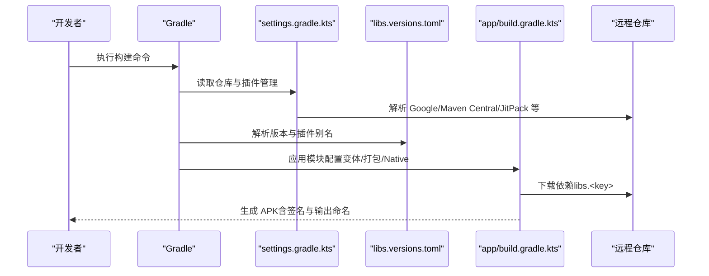

# 构建配置

<cite>
**本文引用的文件**
- [根构建脚本 build.gradle.kts](file://build.gradle.kts)
- [设置脚本 settings.gradle.kts](file://settings.gradle.kts)
- [版本目录 libs.versions.toml](file://gradle/libs.versions.toml)
- [Gradle 属性 gradle.properties](file://gradle.properties)
- [应用模块构建脚本 app/build.gradle.kts](file://app/build.gradle.kts)
- [DragonBones 模块构建脚本 dragonbones/build.gradle.kts](file://dragonbones/build.gradle.kts)
- [MNN 模块构建脚本 mnn/build.gradle.kts](file://mnn/build.gradle.kts)
- [Llama 模块构建脚本 llama/build.gradle.kts](file://llama/build.gradle.kts)
- [MMD 模块构建脚本 mmd/build.gradle.kts](file://mmd/build.gradle.kts)
- [FBX 模块构建脚本 fbx/build.gradle.kts](file://fbx/build.gradle.kts)
- [ShowerClient 模块构建脚本 showerclient/build.gradle.kts](file://showerclient/build.gradle.kts)
- [QuickJS 模块构建脚本 quickjs/build.gradle.kts](file://quickjs/build.gradle.kts)
- [本地属性模板 local.properties.example](file://local.properties.example)
- [Gradle 包装器属性 gradle/wrapper/gradle-wrapper.properties](file://gradle/wrapper/gradle-wrapper.properties)
</cite>

## 目录
1. [简介](#简介)
2. [项目结构](#项目结构)
3. [核心组件](#核心组件)
4. [架构总览](#架构总览)
5. [详细组件分析](#详细组件分析)
6. [依赖关系分析](#依赖关系分析)
7. [性能考虑](#性能考虑)
8. [故障排除指南](#故障排除指南)
9. [结论](#结论)
10. [附录](#附录)

## 简介
本文件系统性梳理 Operit 项目的 Gradle 构建配置，覆盖根项目构建脚本、模块级构建配置、版本管理策略、构建变体与产品风味、依赖声明与版本对齐、资源处理与打包规则、以及构建性能优化与常见问题排查。文档同时提供可直接参考的配置路径与示例，帮助开发者快速添加新模块、配置构建变体与处理第三方库依赖。

## 项目结构
Operit 采用多模块工程组织，根项目通过 settings.gradle.kts 统一纳入各子模块；版本与插件版本在 libs.versions.toml 中集中管理；根构建脚本负责全局插件与仓库配置，模块级脚本聚焦各自编译选项、构建变体与依赖。

图表来源
- [设置脚本 settings.gradle.kts:1-30](file://settings.gradle.kts#L1-L30)
- [版本目录 libs.versions.toml:1-271](file://gradle/libs.versions.toml#L1-L271)
- [Gradle 属性 gradle.properties:1-29](file://gradle.properties#L1-L29)
- [应用模块构建脚本 app/build.gradle.kts:1-446](file://app/build.gradle.kts#L1-L446)

章节来源
- [设置脚本 settings.gradle.kts:1-30](file://settings.gradle.kts#L1-L30)
- [版本目录 libs.versions.toml:1-271](file://gradle/libs.versions.toml#L1-L271)
- [Gradle 属性 gradle.properties:1-29](file://gradle.properties#L1-L29)

## 核心组件
- 根构建脚本：统一声明 Android 应用/库插件别名、ObjectBox 插件类路径，并提供 clean 任务。
- 设置脚本：统一插件仓库与依赖仓库策略，包含 Google、Maven Central、JitPack、Bintray、Sonatype 等。
- 版本目录：集中定义 AGP、Kotlin、Compose BOM、核心库版本与插件版本，便于全局对齐。
- Gradle 属性：启用 AndroidX、非传递 R 类、并行构建、按需配置、缓存与最大工作进程数等。
- 模块级构建脚本：各模块在 defaultConfig、buildTypes、compileOptions、packaging、externalNativeBuild 等维度进行差异化配置。

章节来源
- [根构建脚本 build.gradle.kts:1-25](file://build.gradle.kts#L1-L25)
- [设置脚本 settings.gradle.kts:1-30](file://settings.gradle.kts#L1-L30)
- [版本目录 libs.versions.toml:1-271](file://gradle/libs.versions.toml#L1-L271)
- [Gradle 属性 gradle.properties:1-29](file://gradle.properties#L1-L29)

## 架构总览
下图展示 Gradle 配置在多模块中的作用域与交互：

图表来源
- [设置脚本 settings.gradle.kts:1-30](file://settings.gradle.kts#L1-L30)
- [版本目录 libs.versions.toml:1-271](file://gradle/libs.versions.toml#L1-L271)
- [Gradle 属性 gradle.properties:1-29](file://gradle.properties#L1-L29)
- [根构建脚本 build.gradle.kts:1-25](file://build.gradle.kts#L1-L25)
- [应用模块构建脚本 app/build.gradle.kts:1-446](file://app/build.gradle.kts#L1-L446)

## 详细组件分析

### 根项目构建配置
- 插件与仓库：使用 libs.plugins 别名统一管理 Android 应用/库、Kotlin、Compose、Serialization、KAPT、Parcelize 插件；ObjectBox 插件通过 buildscript 显式声明。
- 清理任务：提供 clean 任务删除根项目构建目录。

章节来源
- [根构建脚本 build.gradle.kts:11-25](file://build.gradle.kts#L11-L25)

### 依赖解析与仓库管理
- 依赖解析策略：FAIL_ON_PROJECT_REPOS，确保所有仓库来自统一管理，避免项目私有仓库污染。
- 仓库源：Google、Gradle 插件门户、Maven Central、JitPack、Bintray 的 Riicka/Shizuku、Sonatype Snapshots。
- 版本与插件别名：通过 libs.versions.toml 提供统一版本与插件 ID，模块中以 alias 引用。

章节来源
- [设置脚本 settings.gradle.kts:8-18](file://settings.gradle.kts#L8-L18)
- [版本目录 libs.versions.toml:262-271](file://gradle/libs.versions.toml#L262-L271)

### 版本管理与对齐
- 版本集中定义：AGP、Kotlin、Compose BOM、AndroidX、网络、序列化、Room、WorkManager、Shizuku、OkHttp、JSoup、Logging、UI 组件等。
- 插件版本：android-application、android-library、kotlin-android、kotlin-compose、kotlin-serialization、objectbox、kotlin-kapt、kotlin-parcelize。
- 模块引用：各模块通过 libs.<key> 或 platform(libs.compose.bom) 实现版本对齐与一致性。

章节来源
- [版本目录 libs.versions.toml:1-271](file://gradle/libs.versions.toml#L1-L271)

### 构建变体与产品风味
- 应用模块变体：release、debug、nightly。nightly 在 matchingFallbacks 中回退到 release，并将输出文件名定制为 app-nightly.apk。
- 库模块变体：默认仅包含 release，便于库消费方统一行为。
- 构建类型特定配置：签名配置、混淆与资源收缩、ProGuard 规则、输出命名等。

章节来源
- [应用模块构建脚本 app/build.gradle.kts:83-123](file://app/build.gradle.kts#L83-L123)
- [DragonBones 模块构建脚本 dragonbones/build.gradle.kts:26-34](file://dragonbones/build.gradle.kts#L26-L34)
- [MNN 模块构建脚本 mnn/build.gradle.kts:63-71](file://mnn/build.gradle.kts#L63-L71)
- [Llama 模块构建脚本 llama/build.gradle.kts:37-41](file://llama/build.gradle.kts#L37-L41)
- [MMD 模块构建脚本 mmd/build.gradle.kts:35-39](file://mmd/build.gradle.kts#L35-L39)
- [FBX 模块构建脚本 fbx/build.gradle.kts:35-39](file://fbx/build.gradle.kts#L35-L39)
- [ShowerClient 模块构建脚本 showerclient/build.gradle.kts:16-26](file://showerclient/build.gradle.kts#L16-L26)
- [QuickJS 模块构建脚本 quickjs/build.gradle.kts:26-33](file://quickjs/build.gradle.kts#L26-L33)

### 依赖声明与版本对齐策略
- 平台依赖：Compose 使用 platform(libs.compose.bom) 对齐所有 UI 相关依赖。
- 核心库：AndroidX、Material、Lifecycle、Navigation、WorkManager、Room、OkHttp、JSoup、Logging、UI 组件等均通过 libs.<key> 引用。
- 第三方库：如 MLKit 文本识别、ZXing、Diff 工具、APK 工具链、图片处理、视频播放、文档转换、LaTeX 渲染、向量检索、TensorFlow Lite、MediaPipe、Shizuku、NanoHTTPD、Reorderable、Swipe、协程、Mockito 等。
- 排除与安全：显式排除重复的 BouncyCastle 模块，引入 jdk18on 避免冲突；引入 security-crypto 与指定版本的 OkHttp/Moshi/Retrofit。

章节来源
- [应用模块构建脚本 app/build.gradle.kts:181-445](file://app/build.gradle.kts#L181-L445)

### 资源处理与打包规则
- 资源合并与冲突解决：针对文档库、Netty、模块信息类等进行 META-INF 与重复文件的排除与 pickFirst 处理。
- JNI 库打包：使用 legacy packaging 并在 packaging.resources.excludes 中清理重复与不兼容文件。
- ABI 过滤：主应用与多数库模块限制为 arm64-v8a，终端模块额外包含 x86_64 以适配模拟器。
- BuildConfig 字段：注入 GitHub OAuth 客户端凭据（从 local.properties 读取）。

章节来源
- [应用模块构建脚本 app/build.gradle.kts:135-169](file://app/build.gradle.kts#L135-L169)
- [应用模块构建脚本 app/build.gradle.kts:56-81](file://app/build.gradle.kts#L56-L81)

### NDK 与 CMake 集成
- 外部原生构建：各库模块通过 externalNativeBuild.cmake 指定 CMakeLists.txt 与版本。
- 编译参数：统一 C++17 标准，部分模块开启静态 STL、平台与特性开关，控制是否启用 LLM、Transformer fuse、低内存等。
- ABI 与 JNI：通过 ndk.abiFilters 与 jniLibs.srcDirs 管理产物与加载路径。

章节来源
- [DragonBones 模块构建脚本 dragonbones/build.gradle.kts:44-49](file://dragonbones/build.gradle.kts#L44-L49)
- [MNN 模块构建脚本 mnn/build.gradle.kts:26-53](file://mnn/build.gradle.kts#L26-L53)
- [Llama 模块构建脚本 llama/build.gradle.kts:24-35](file://llama/build.gradle.kts#L24-L35)
- [MMD 模块构建脚本 mmd/build.gradle.kts:23-33](file://mmd/build.gradle.kts#L23-L33)
- [FBX 模块构建脚本 fbx/build.gradle.kts:23-33](file://fbx/build.gradle.kts#L23-L33)
- [QuickJS 模块构建脚本 quickjs/build.gradle.kts:15-39](file://quickjs/build.gradle.kts#L15-L39)

### 测试与调试配置
- 测试运行器与断言库：JUnit、Espresso、Compose UI 测试。
- 调试依赖：Compose 工具与测试清单在 debugImplementation。
- AndroidX Test Runner 与 Rules：用于 Instrumentation 测试。

章节来源
- [应用模块构建脚本 app/build.gradle.kts:360-394](file://app/build.gradle.kts#L360-L394)

## 依赖关系分析
Operit 的模块间依赖以 app 为中心，聚合多个功能库模块；库模块之间无循环依赖，遵循单向依赖原则。

图表来源
- [应用模块构建脚本 app/build.gradle.kts:183-190](file://app/build.gradle.kts#L183-L190)

章节来源
- [应用模块构建脚本 app/build.gradle.kts:181-191](file://app/build.gradle.kts#L181-L191)

## 性能考虑
- 并行与缓存：启用 org.gradle.parallel、org.gradle.caching、org.gradle.configureondemand、最大工作进程数上限，提升构建速度。
- 内存与核心库脱糖：增大 JVM 堆至 8GB，启用 coreLibraryDesugaring 以在旧版 Android 上使用现代 Java API。
- ABI 与打包：主应用仅打包 arm64-v8a，减少安装包体积；JNI 使用 legacy packaging 并清理重复文件。
- 依赖对齐：通过 Compose BOM 与 libs.versions.toml 减少版本漂移带来的重复与冲突。

章节来源
- [Gradle 属性 gradle.properties:9-29](file://gradle.properties#L9-L29)
- [应用模块构建脚本 app/build.gradle.kts:124-128](file://app/build.gradle.kts#L124-L128)
- [版本目录 libs.versions.toml:1-271](file://gradle/libs.versions.toml#L1-L271)

## 故障排除指南
- 本地签名与凭据缺失：release 构建依赖 local.properties 中的 keystore 与 GitHub OAuth 凭据；若未配置，release 变体可能无法签名或功能受限。
- 仓库访问失败：确认 settings.gradle.kts 中的仓库可用性；必要时检查网络与镜像配置。
- 重复类与 BouncyCastle 冲突：项目已显式排除并引入 jdk18on；若仍出现冲突，检查依赖树并统一版本。
- 资源合并冲突：若遇到 META-INF 或 .so 重复，检查 packaging.resources.excludes 与 pickFirsts 配置。
- NDK/CMake 构建失败：核对 externalNativeBuild.cmake.path 与版本，确保 CMakeLists.txt 正确且模块参数匹配。

章节来源
- [应用模块构建脚本 app/build.gradle.kts:27-46](file://app/build.gradle.kts#L27-L46)
- [应用模块构建脚本 app/build.gradle.kts:421-424](file://app/build.gradle.kts#L421-L424)
- [设置脚本 settings.gradle.kts:8-18](file://settings.gradle.kts#L8-L18)

## 结论
Operit 的 Gradle 配置通过集中版本管理、统一仓库策略与模块化构建脚本，实现了跨模块的一致性与可维护性。应用层在构建变体、资源处理与 NDK 集成方面具备灵活性，同时通过性能相关属性与依赖对齐策略保障了构建效率与稳定性。建议在新增模块时遵循现有模式，优先使用 libs.versions.toml 的别名与平台依赖，合理配置打包与变体，以降低集成成本与维护风险。

## 附录

### 如何添加新模块
- 在 settings.gradle.kts 中 include(":your-module-name")。
- 在 gradle/libs.versions.toml 中为新模块添加必要的版本与插件别名（如需）。
- 在新模块的 build.gradle.kts 中：
  - 使用 alias(libs.plugins.android.library) 或 alias(libs.plugins.android.application)。
  - 配置 compileSdk、minSdk、targetSdk、abiFilters、externalNativeBuild.cmake 等。
  - 在 dependencies 中通过 libs.<key> 引用依赖，或使用 platform(libs.compose.bom)。
- 若为库模块，提供 consumer-rules.pro 并在 app/build.gradle.kts 中 implementation(project(":your-module-name"))。

章节来源
- [设置脚本 settings.gradle.kts:21-29](file://settings.gradle.kts#L21-L29)
- [版本目录 libs.versions.toml:262-271](file://gradle/libs.versions.toml#L262-L271)
- [应用模块构建脚本 app/build.gradle.kts:183-190](file://app/build.gradle.kts#L183-L190)

### 如何配置构建变体
- 在 android.buildTypes 中新增变体（如 nightly），设置 isMinifyEnabled、isShrinkResources、proguardFiles 与 signingConfig。
- 使用 matchingFallbacks 回退到 release，或在 outputs 中自定义输出文件名。
- 在 defaultConfig 中注入 BuildConfig 字段（如 GITHUB_CLIENT_ID/SECRET）。

章节来源
- [应用模块构建脚本 app/build.gradle.kts:83-123](file://app/build.gradle.kts#L83-L123)
- [应用模块构建脚本 app/build.gradle.kts:79-81](file://app/build.gradle.kts#L79-L81)

### 如何处理第三方库依赖
- 通过 libs.versions.toml 定义版本与别名，模块中以 libs.<key> 引用。
- 对于 Compose 生态，使用 platform(libs.compose.bom) 对齐版本。
- 对于存在冲突的库（如 BouncyCastle），显式排除并引入兼容版本。
- 对于需要本地 AAR/JAR 的二进制依赖，使用 fileTree 指定 libs 目录。

章节来源
- [版本目录 libs.versions.toml:83-261](file://gradle/libs.versions.toml#L83-L261)
- [应用模块构建脚本 app/build.gradle.kts:421-424](file://app/build.gradle.kts#L421-L424)
- [应用模块构建脚本 app/build.gradle.kts:198-199](file://app/build.gradle.kts#L198-L199)

### 构建流程时序（以应用模块为例）

图表来源
- [设置脚本 settings.gradle.kts:1-18](file://settings.gradle.kts#L1-L18)
- [版本目录 libs.versions.toml:1-271](file://gradle/libs.versions.toml#L1-L271)
- [应用模块构建脚本 app/build.gradle.kts:1-446](file://app/build.gradle.kts#L1-L446)