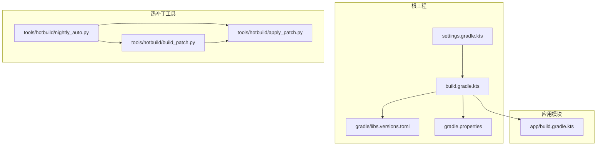
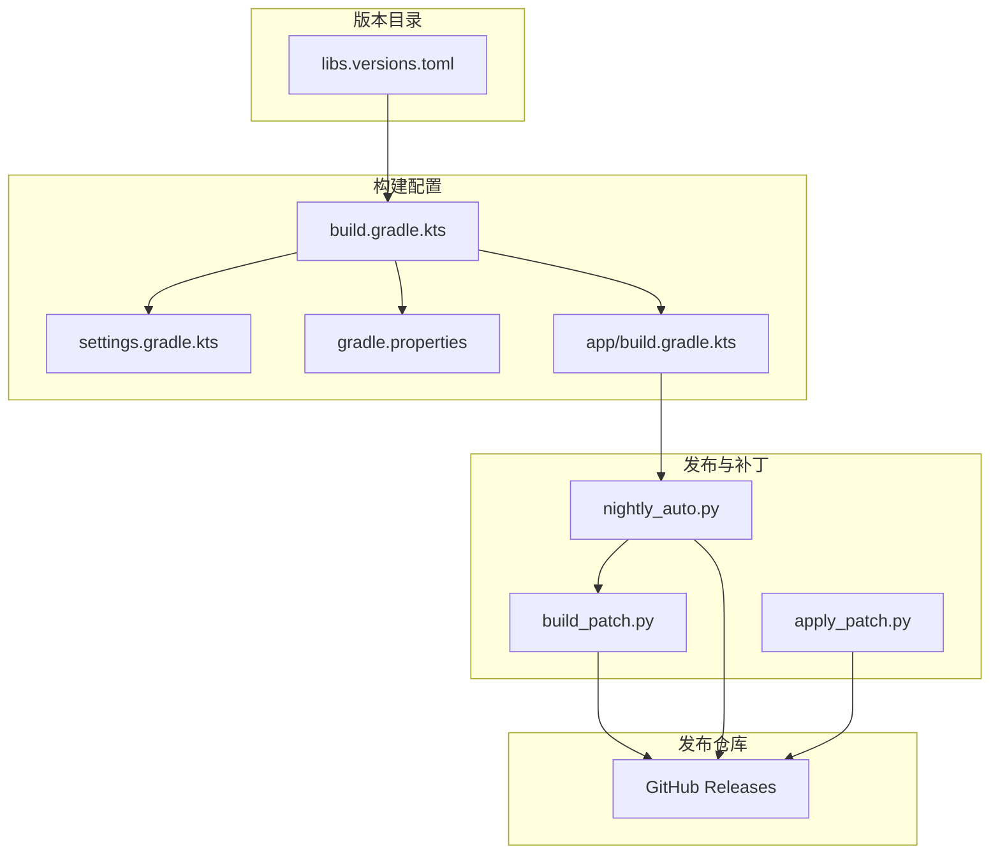
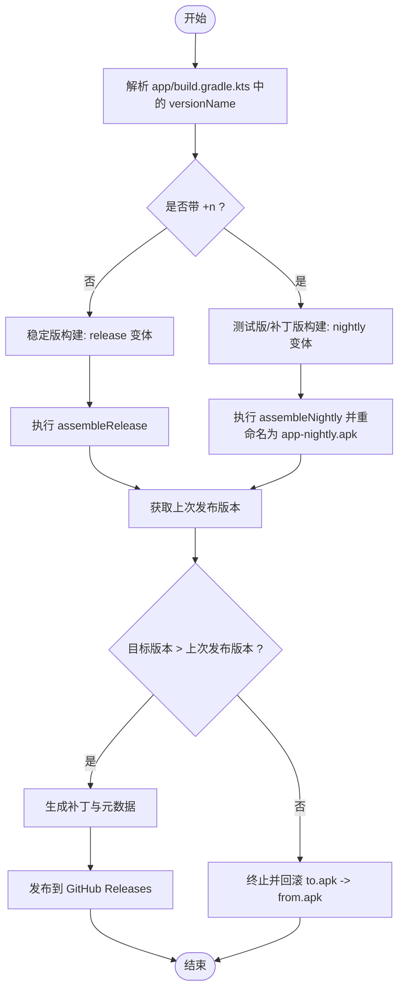
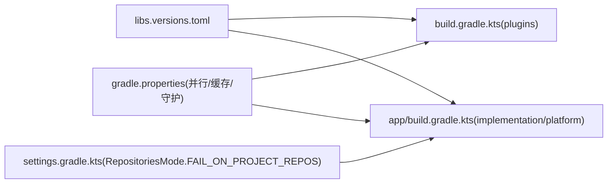
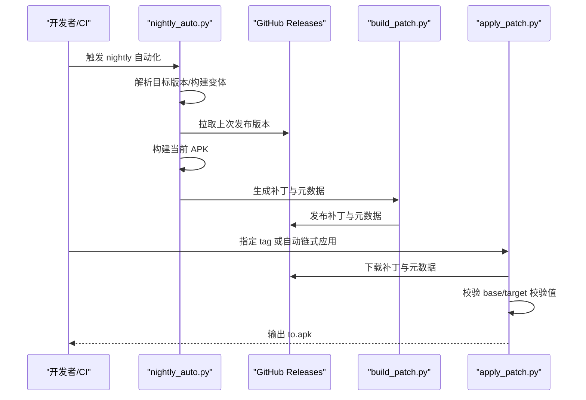
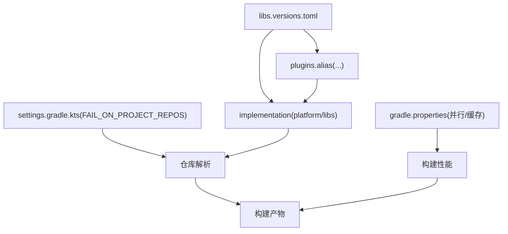

# 版本管理

<cite>
**本文引用的文件**
- [gradle/libs.versions.toml](file://gradle/libs.versions.toml)
- [build.gradle.kts](file://build.gradle.kts)
- [settings.gradle.kts](file://settings.gradle.kts)
- [gradle.properties](file://gradle.properties)
- [app/build.gradle.kts](file://app/build.gradle.kts)
- [tools/hotbuild/nightly_auto.py](file://tools/hotbuild/nightly_auto.py)
- [tools/hotbuild/build_patch.py](file://tools/hotbuild/build_patch.py)
- [tools/hotbuild/apply_patch.py](file://tools/hotbuild/apply_patch.py)
- [README.md](file://README.md)
- [docs/CONTRIBUTING.md](file://docs/CONTRIBUTING.md)
</cite>

## 目录
1. [引言](#引言)
2. [项目结构](#项目结构)
3. [核心组件](#核心组件)
4. [架构总览](#架构总览)
5. [详细组件分析](#详细组件分析)
6. [依赖分析](#依赖分析)
7. [性能考量](#性能考量)
8. [故障排查指南](#故障排查指南)
9. [结论](#结论)
10. [附录](#附录)

## 引言
本指南面向 Operit 项目的版本管理，围绕版本号规范、依赖版本管理、发布控制、变更日志维护、发布检查清单、版本迁移与回滚、以及自动化脚本使用等方面，提供系统化、可落地的技术指导。文档结合仓库中的 Gradle 版本目录、构建配置与热补丁自动化脚本，给出可操作的实践方法。

## 项目结构
Operit 采用多模块 Gradle 工程，根工程通过版本目录统一管理第三方依赖版本，主模块 app 定义版本号与构建变体，tools/hotbuild 提供夜间构建与热补丁自动化。

**图表来源**
- [settings.gradle.kts:1-30](file://settings.gradle.kts#L1-L30)
- [build.gradle.kts:1-25](file://build.gradle.kts#L1-L25)
- [gradle/libs.versions.toml:1-271](file://gradle/libs.versions.toml#L1-L271)
- [gradle.properties:1-29](file://gradle.properties#L1-L29)
- [app/build.gradle.kts:1-446](file://app/build.gradle.kts#L1-L446)
- [tools/hotbuild/nightly_auto.py:1-342](file://tools/hotbuild/nightly_auto.py#L1-L342)
- [tools/hotbuild/build_patch.py:1-558](file://tools/hotbuild/build_patch.py#L1-L558)
- [tools/hotbuild/apply_patch.py:1-682](file://tools/hotbuild/apply_patch.py#L1-L682)

**章节来源**
- [settings.gradle.kts:1-30](file://settings.gradle.kts#L1-L30)
- [build.gradle.kts:1-25](file://build.gradle.kts#L1-L25)
- [gradle/libs.versions.toml:1-271](file://gradle/libs.versions.toml#L1-L271)
- [gradle.properties:1-29](file://gradle.properties#L1-L29)
- [app/build.gradle.kts:1-446](file://app/build.gradle.kts#L1-L446)

## 核心组件
- 版本目录与统一依赖管理：通过 libs.versions.toml 统一声明各依赖版本，避免散落配置带来的冲突与漂移。
- 构建与版本号：app/build.gradle.kts 中定义 versionCode 与 versionName，支持“稳定版”（无 + 后缀）与“测试版/补丁版”（带 +n）两种形态。
- 构建变体：release、debug、nightly，nightly 输出文件名固定为 app-nightly.apk，便于自动化归档与分发。
- 热补丁自动化：nightly_auto.py 负责从构建产物中解析目标版本、拉取上次发布版本、生成补丁并发布；build_patch.py 生成补丁与元数据；apply_patch.py 应用补丁或按链式自动应用。

**章节来源**
- [gradle/libs.versions.toml:1-271](file://gradle/libs.versions.toml#L1-L271)
- [app/build.gradle.kts:54-123](file://app/build.gradle.kts#L54-L123)
- [tools/hotbuild/nightly_auto.py:206-342](file://tools/hotbuild/nightly_auto.py#L206-L342)
- [tools/hotbuild/build_patch.py:429-558](file://tools/hotbuild/build_patch.py#L429-L558)
- [tools/hotbuild/apply_patch.py:485-682](file://tools/hotbuild/apply_patch.py#L485-L682)

## 架构总览
Operit 的版本管理由“版本目录 + 构建配置 + 发布与补丁自动化”三层构成，形成从依赖到构建再到发布的闭环。

**图表来源**
- [gradle/libs.versions.toml:1-271](file://gradle/libs.versions.toml#L1-L271)
- [build.gradle.kts:1-25](file://build.gradle.kts#L1-L25)
- [settings.gradle.kts:1-30](file://settings.gradle.kts#L1-L30)
- [gradle.properties:1-29](file://gradle.properties#L1-L29)
- [app/build.gradle.kts:1-446](file://app/build.gradle.kts#L1-L446)
- [tools/hotbuild/nightly_auto.py:206-342](file://tools/hotbuild/nightly_auto.py#L206-L342)
- [tools/hotbuild/build_patch.py:429-558](file://tools/hotbuild/build_patch.py#L429-L558)
- [tools/hotbuild/apply_patch.py:485-682](file://tools/hotbuild/apply_patch.py#L485-L682)

## 详细组件分析

### 版本号规范与命名策略
- 版本号组成：主版本.次版本.修订号（例如 1.10.1）。当存在补丁迭代时，使用“版本号+n”（例如 1.10.1+12）。
- 稳定版与测试版：
  - 稳定版：versionName 不带 +n，nightly 变体不启用。
  - 测试版/补丁版：versionName 带 +n，nightly 变体启用并输出 app-nightly.apk。
- 版本解析与比较：
  - nightly_auto.py 与 apply_patch.py 均实现了对“v?主.次.修订(+n)”格式的解析与比较，确保补丁生成与应用的正确性。
- 版本回滚：
  - nightly_auto.py 在失败时会尝试将 to.apk 回滚到 from.apk，保障发布失败时的可逆性。

**图表来源**
- [app/build.gradle.kts:54-123](file://app/build.gradle.kts#L54-L123)
- [tools/hotbuild/nightly_auto.py:225-292](file://tools/hotbuild/nightly_auto.py#L225-L292)
- [tools/hotbuild/nightly_auto.py:323-337](file://tools/hotbuild/nightly_auto.py#L323-L337)

**章节来源**
- [app/build.gradle.kts:54-123](file://app/build.gradle.kts#L54-L123)
- [tools/hotbuild/nightly_auto.py:25-72](file://tools/hotbuild/nightly_auto.py#L25-L72)
- [tools/hotbuild/nightly_auto.py:225-292](file://tools/hotbuild/nightly_auto.py#L225-L292)
- [tools/hotbuild/nightly_auto.py:196-204](file://tools/hotbuild/nightly_auto.py#L196-L204)

### 依赖版本管理
- 版本目录：libs.versions.toml 以“版本名”和“库坐标”形式集中声明第三方依赖版本，避免在各模块中分散指定。
- 依赖分辨率：settings.gradle.kts 中开启 FAIL_ON_PROJECT_REPOS，确保所有模块仅从受控仓库解析依赖，降低不可重复构建的风险。
- 构建缓存与并行：gradle.properties 启用并行、守护进程、按需配置与缓存，提升构建效率。

**图表来源**
- [gradle/libs.versions.toml:1-271](file://gradle/libs.versions.toml#L1-L271)
- [build.gradle.kts:12-20](file://build.gradle.kts#L12-L20)
- [app/build.gradle.kts:181-445](file://app/build.gradle.kts#L181-L445)
- [settings.gradle.kts:8-18](file://settings.gradle.kts#L8-L18)
- [gradle.properties:24-29](file://gradle.properties#L24-L29)

**章节来源**
- [gradle/libs.versions.toml:1-271](file://gradle/libs.versions.toml#L1-L271)
- [settings.gradle.kts:8-18](file://settings.gradle.kts#L8-L18)
- [gradle.properties:24-29](file://gradle.properties#L24-L29)

### 发布版本控制与热补丁流程
- nightly 自动化流程：
  - 从 app/build.gradle.kts 解析目标版本；
  - 从 GitHub Releases 拉取上次发布版本；
  - 构建当前 nightly 或 release；
  - 生成补丁与元数据并发布；
  - 若失败，回滚 to.apk 到 from.apk。
- 补丁格式与应用：
  - 支持 opatch、apkzip、apkraw 三种格式；
  - apply_patch.py 可自动链式应用补丁，或按指定 tag/meta 应用单个补丁；
  - 通过校验 base/target 校验值（SHA256 或 ZipTree）保证补丁适用性。

**图表来源**
- [tools/hotbuild/nightly_auto.py:206-342](file://tools/hotbuild/nightly_auto.py#L206-L342)
- [tools/hotbuild/build_patch.py:429-558](file://tools/hotbuild/build_patch.py#L429-L558)
- [tools/hotbuild/apply_patch.py:485-682](file://tools/hotbuild/apply_patch.py#L485-L682)

**章节来源**
- [tools/hotbuild/nightly_auto.py:206-342](file://tools/hotbuild/nightly_auto.py#L206-L342)
- [tools/hotbuild/build_patch.py:429-558](file://tools/hotbuild/build_patch.py#L429-L558)
- [tools/hotbuild/apply_patch.py:485-682](file://tools/hotbuild/apply_patch.py#L485-L682)

### 变更日志维护
- 更新日志来源：README.md 中的“版本更新历程”表格，记录版本、日期与核心更新点，便于发布时对照。
- 建议实践：
  - 每次发布前核对 README.md 的更新历程，补充本次版本的核心变更；
  - 在 GitHub Releases 中附带变更摘要，保持与文档一致。

**章节来源**
- [README.md:197-406](file://README.md#L197-L406)

### 版本发布检查清单
- 功能测试
  - 关键路径回归：对话、工具调用、工作流、浏览器、MCP/Skill。
  - 权限与兼容性：不同 Android 版本与设备上的权限表现。
- 性能测试
  - 启动耗时、内存占用、CPU 占用、IO 压力。
- 兼容性验证
  - 多 ABI（当前仅 arm64-v8a）与多 Android API 级别。
- 自动化与安全
  - nightly 构建产物命名与签名一致性；
  - 补丁生成与应用的 SHA256/ZipTree 校验通过；
  - GitHub 发布凭据与网络超时处理。

[本节为通用实践建议，无需特定文件引用]

### 版本迁移指南
- 破坏性变更
  - 通过 README.md 的“版本更新历程”记录破坏性变更，配合 GitHub Releases 的“Pre-release”标记进行过渡。
- API 变更
  - 保持向后兼容优先；若必须破坏，提供迁移脚本或工具（如 apply_patch.py 的链式应用能力）。
- 数据格式变更
  - 使用补丁链（apkzip/apkraw/opatch）增量更新，避免全量替换；
  - 在 apply_patch.py 中通过 base/target 校验值确保补丁适用范围。

**章节来源**
- [tools/hotbuild/apply_patch.py:485-682](file://tools/hotbuild/apply_patch.py#L485-L682)

### 版本管理工具与自动化脚本
- nightly 自动化
  - nightly_auto.py：解析版本、构建 APK、生成补丁、发布、失败回滚。
- 补丁生成
  - build_patch.py：根据 from/to APK 生成 opatch/apkzip/apkraw 与元数据，支持发布到 GitHub Releases。
- 补丁应用
  - apply_patch.py：按指定 tag 或自动链式应用补丁，支持多种格式与校验。

**章节来源**
- [tools/hotbuild/nightly_auto.py:206-342](file://tools/hotbuild/nightly_auto.py#L206-L342)
- [tools/hotbuild/build_patch.py:429-558](file://tools/hotbuild/build_patch.py#L429-L558)
- [tools/hotbuild/apply_patch.py:485-682](file://tools/hotbuild/apply_patch.py#L485-L682)

## 依赖分析
Operit 的版本管理依赖于版本目录与构建配置的强耦合关系，libs.versions.toml 提供统一版本，settings.gradle.kts 限定仓库来源，app/build.gradle.kts 通过 alias 引用版本目录中的库坐标，最终在构建阶段完成依赖解析与打包。

**图表来源**
- [gradle/libs.versions.toml:1-271](file://gradle/libs.versions.toml#L1-L271)
- [build.gradle.kts:12-20](file://build.gradle.kts#L12-L20)
- [app/build.gradle.kts:181-445](file://app/build.gradle.kts#L181-L445)
- [settings.gradle.kts:8-18](file://settings.gradle.kts#L8-L18)
- [gradle.properties:24-29](file://gradle.properties#L24-L29)

**章节来源**
- [gradle/libs.versions.toml:1-271](file://gradle/libs.versions.toml#L1-L271)
- [settings.gradle.kts:8-18](file://settings.gradle.kts#L8-L18)
- [gradle.properties:24-29](file://gradle.properties#L24-L29)

## 性能考量
- 构建性能
  - 并行构建、守护进程、按需配置与缓存显著缩短构建时间。
- 依赖解析
  - FAIL_ON_PROJECT_REPOS 限制仓库来源，减少解析不确定性与网络波动影响。
- 补丁体积
  - 优先使用 apkzip/apkraw/opatch 等增量格式，降低传输与存储成本。

**章节来源**
- [gradle.properties:24-29](file://gradle.properties#L24-L29)
- [settings.gradle.kts:8-18](file://settings.gradle.kts#L8-L18)
- [tools/hotbuild/build_patch.py:504-510](file://tools/hotbuild/build_patch.py#L504-L510)

## 故障排查指南
- 版本解析失败
  - 检查 app/build.gradle.kts 中 versionName 是否符合“主.次.修订(+n)”格式；确认 nightly_auto.py 的解析逻辑。
- 发布失败或速率限制
  - 设置 GITHUB_TOKEN/GH_TOKEN/GITHUB_PAT；若 API 403，使用 gh/git 回退方式获取标签。
- 补丁应用失败
  - 校验 from.apk 的 base 校验值（SHA256 或 ZipTree）与元数据一致；若不一致，回退到完整下载。
- 回滚异常
  - nightly_auto.py 在异常时会尝试将 to.apk 回滚到 from.apk，若仍失败，检查文件权限与磁盘空间。

**章节来源**
- [tools/hotbuild/nightly_auto.py:75-177](file://tools/hotbuild/nightly_auto.py#L75-L177)
- [tools/hotbuild/nightly_auto.py:323-337](file://tools/hotbuild/nightly_auto.py#L323-L337)
- [tools/hotbuild/apply_patch.py:619-629](file://tools/hotbuild/apply_patch.py#L619-L629)
- [tools/hotbuild/apply_patch.py:520-527](file://tools/hotbuild/apply_patch.py#L520-L527)

## 结论
Operit 的版本管理以“版本目录 + 构建配置 + 自动化补丁”为核心，既保证了依赖的一致性与可重复构建，又提供了高效的发布与回滚能力。建议在实际发布中严格遵循版本号规范、变更日志与检查清单，并充分利用自动化脚本降低人为错误与发布风险。

## 附录
- 参考文档与贡献流程
  - 贡献指南与开发流程：docs/CONTRIBUTING.md
  - 项目主页与更新历程：README.md

**章节来源**
- [docs/CONTRIBUTING.md:1-96](file://docs/CONTRIBUTING.md#L1-L96)
- [README.md:197-406](file://README.md#L197-L406)