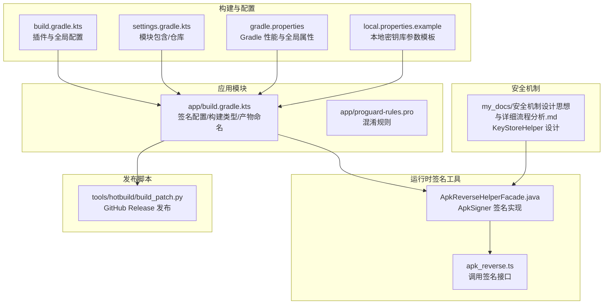
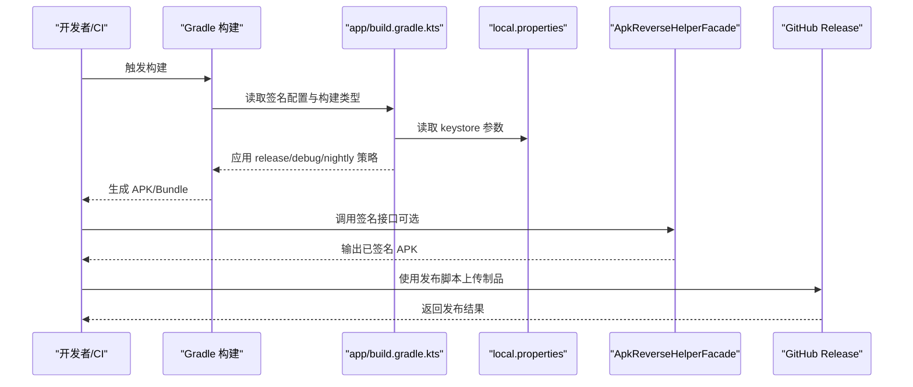
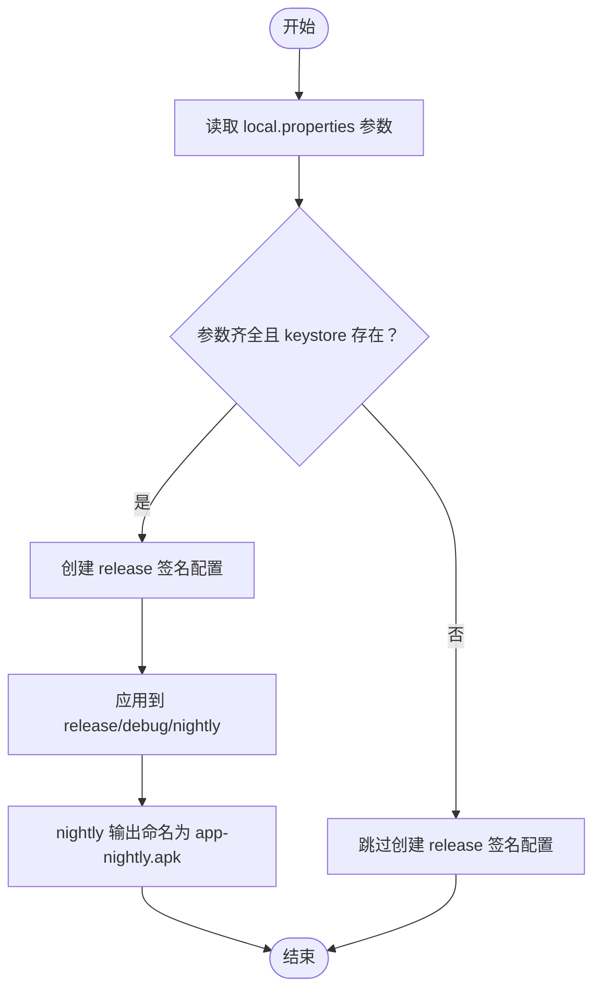
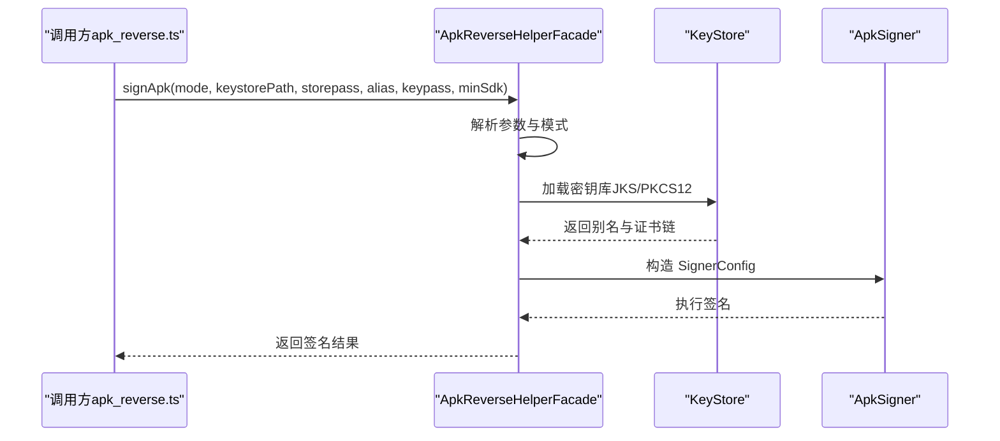
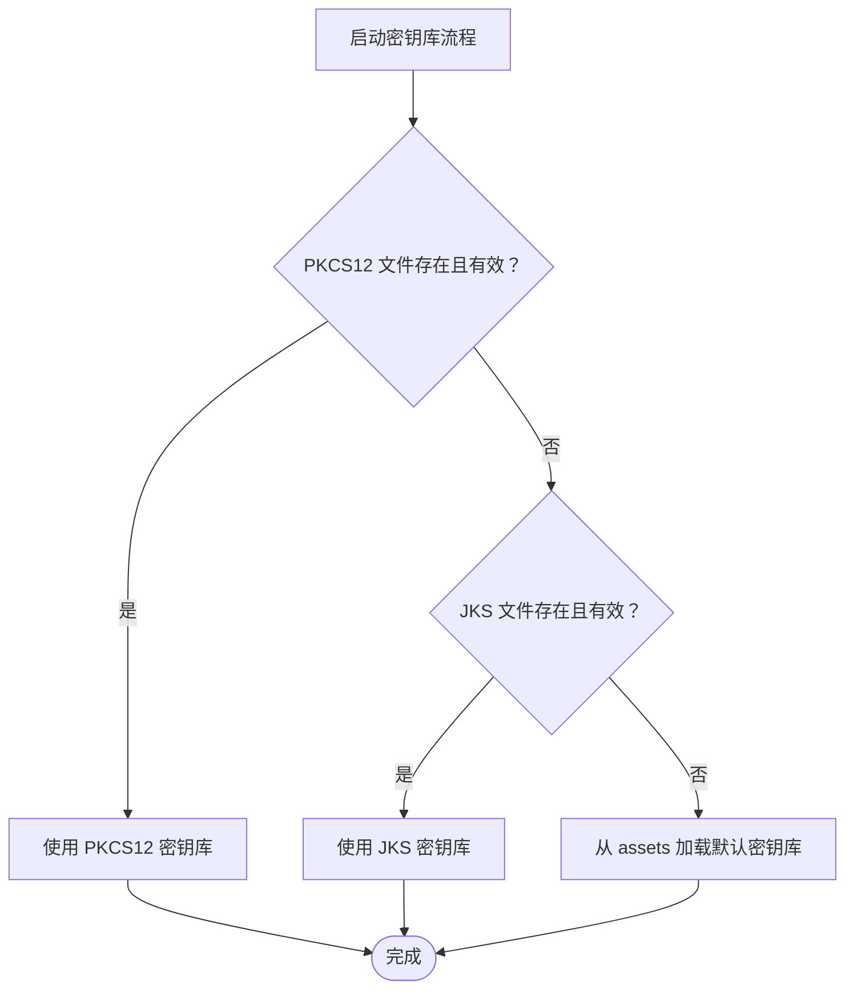
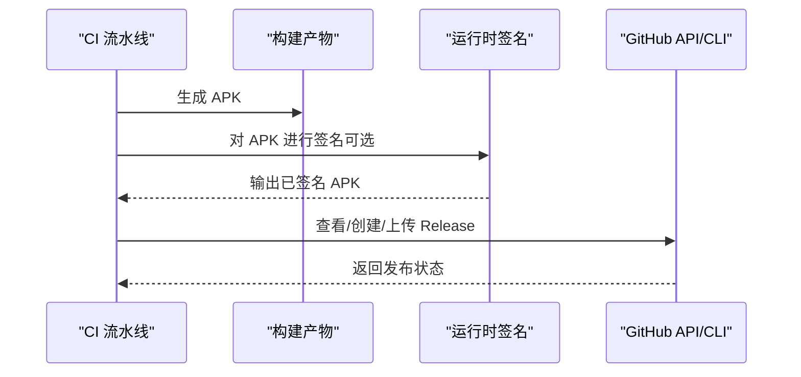
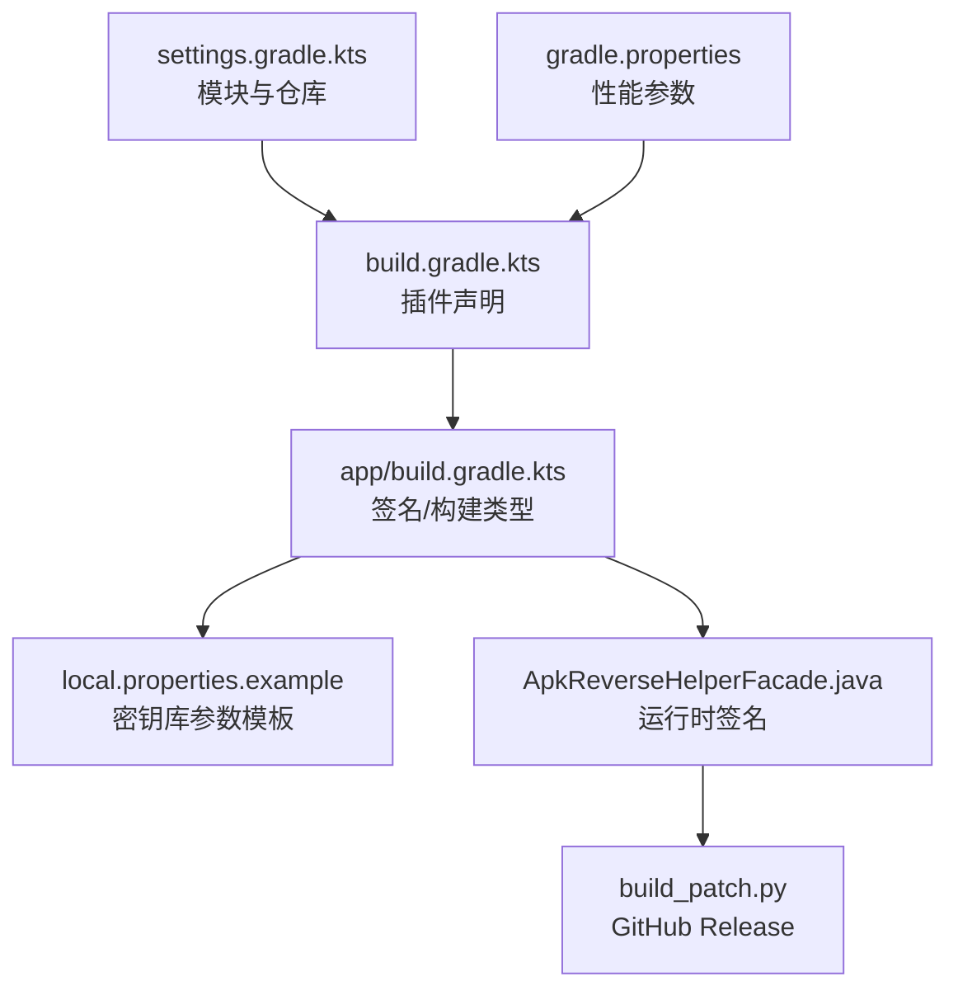

# 签名与发布

<cite>
**本文引用的文件**
- [app/build.gradle.kts](file://app/build.gradle.kts)
- [build.gradle.kts](file://build.gradle.kts)
- [settings.gradle.kts](file://settings.gradle.kts)
- [gradle.properties](file://gradle.properties)
- [local.properties.example](file://local.properties.example)
- [app/proguard-rules.pro](file://app/proguard-rules.pro)
- [examples/apktool/runtime_helper/src/main/java/com/operit/apkreverse/runtime/ApkReverseHelperFacade.java](file://examples/apktool/runtime_helper/src/main/java/com/operit/apkreverse/runtime/ApkReverseHelperFacade.java)
- [examples/apktool/src/packages/apk_reverse.ts](file://examples/apktool/src/packages/apk_reverse.ts)
- [tools/hotbuild/build_patch.py](file://tools/hotbuild/build_patch.py)
- [my_docs/Operit 安全机制设计思想与详细流程分析.md](file://my_docs/Operit 安全机制设计思想与详细流程分析.md)
</cite>

## 目录
1. [简介](#简介)
2. [项目结构](#项目结构)
3. [核心组件](#核心组件)
4. [架构总览](#架构总览)
5. [详细组件分析](#详细组件分析)
6. [依赖关系分析](#依赖关系分析)
7. [性能考量](#性能考量)
8. [故障排查指南](#故障排查指南)
9. [结论](#结论)
10. [附录](#附录)

## 简介
本文件面向 Operit 项目的 Android 应用签名与发布，系统化阐述以下主题：
- Android 应用签名机制与证书管理：包括 SHA1/SHA256 签名、证书有效期、签名算法选择（含 V1/V2/V3/V4）。
- 密钥库管理：keystore 创建、密钥别名配置、密码安全策略与运行时自动恢复。
- 发布配置：签名配置、构建类型（release/debug/nightly）、发布渠道与产物命名。
- 不同发布场景：内部测试版、公开发布版、企业分发版的配置差异与注意事项。
- 自动化签名流程：CI/CD 中的签名集成、环境变量管理、密钥安全存储。
- 发布前质量检查：签名验证、APK 分析、兼容性测试。
- 常见问题处理：签名不匹配、证书过期、权限错误等。

## 项目结构
Operit 采用多模块 Gradle 工程，应用签名与发布相关的关键位置如下：
- 应用模块签名配置位于 app/build.gradle.kts，通过 local.properties 注入密钥库路径与密码，并在构建类型中启用签名。
- 运行时签名工具位于 examples/apktool/runtime_helper，提供基于 ApkSigner 的签名能力，并支持 debug 与 keystore 两种模式。
- 发布脚本位于 tools/hotbuild，提供 GitHub Release 发布流程示例。
- 安全机制设计文档位于 my_docs，描述 KeyStoreHelper 的多格式支持与自动恢复逻辑。

图表来源
- [app/build.gradle.kts:23-123](file://app/build.gradle.kts#L23-L123)
- [build.gradle.kts:12-20](file://build.gradle.kts#L12-L20)
- [settings.gradle.kts:20-30](file://settings.gradle.kts#L20-L30)
- [gradle.properties:1-29](file://gradle.properties#L1-L29)
- [local.properties.example:1-10](file://local.properties.example#L1-L10)
- [app/proguard-rules.pro:1-91](file://app/proguard-rules.pro#L1-L91)
- [examples/apktool/runtime_helper/src/main/java/com/operit/apkreverse/runtime/ApkReverseHelperFacade.java:136-252](file://examples/apktool/runtime_helper/src/main/java/com/operit/apkreverse/runtime/ApkReverseHelperFacade.java#L136-L252)
- [examples/apktool/src/packages/apk_reverse.ts:1011-1047](file://examples/apktool/src/packages/apk_reverse.ts#L1011-L1047)
- [tools/hotbuild/build_patch.py:363-388](file://tools/hotbuild/build_patch.py#L363-L388)
- [my_docs/Operit 安全机制设计思想与详细流程分析.md:864-921](file://my_docs/Operit 安全机制设计思想与详细流程分析.md#L864-L921)

章节来源
- [app/build.gradle.kts:23-123](file://app/build.gradle.kts#L23-L123)
- [build.gradle.kts:12-20](file://build.gradle.kts#L12-L20)
- [settings.gradle.kts:20-30](file://settings.gradle.kts#L20-L30)
- [gradle.properties:1-29](file://gradle.properties#L1-L29)
- [local.properties.example:1-10](file://local.properties.example#L1-L10)
- [app/proguard-rules.pro:1-91](file://app/proguard-rules.pro#L1-L91)
- [examples/apktool/runtime_helper/src/main/java/com/operit/apkreverse/runtime/ApkReverseHelperFacade.java:136-252](file://examples/apktool/runtime_helper/src/main/java/com/operit/apkreverse/runtime/ApkReverseHelperFacade.java#L136-L252)
- [examples/apktool/src/packages/apk_reverse.ts:1011-1047](file://examples/apktool/src/packages/apk_reverse.ts#L1011-L1047)
- [tools/hotbuild/build_patch.py:363-388](file://tools/hotbuild/build_patch.py#L363-L388)
- [my_docs/Operit 安全机制设计思想与详细流程分析.md:864-921](file://my_docs/Operit 安全机制设计思想与详细流程分析.md#L864-L921)

## 核心组件
- Gradle 签名配置与构建类型
  - 在 app/build.gradle.kts 中定义 signingConfigs，并从 local.properties 读取 keystore 路径与密码；当条件满足时创建 release 签名配置。
  - 构建类型包括 release、debug、nightly。nightly 类型在签名上回退到 release，并覆盖输出文件名为 app-nightly.apk。
- 运行时签名工具
  - ApkReverseHelperFacade 提供 signApk 方法，支持 debug 与 keystore 两种模式；根据 keystore 文件后缀自动判断类型（JKS/PKCS12），并使用 ApkSigner 执行签名。
- 发布脚本
  - tools/hotbuild/build_patch.py 提供 GitHub Release 的创建与上传逻辑，可作为自动化发布流程的一部分。
- 安全机制
  - KeyStoreHelper 设计支持 PKCS12/JKS 多格式，具备 Provider 注册、密钥库校验与自动恢复能力。

章节来源
- [app/build.gradle.kts:27-46](file://app/build.gradle.kts#L27-L46)
- [app/build.gradle.kts:83-123](file://app/build.gradle.kts#L83-L123)
- [examples/apktool/runtime_helper/src/main/java/com/operit/apkreverse/runtime/ApkReverseHelperFacade.java:136-252](file://examples/apktool/runtime_helper/src/main/java/com/operit/apkreverse/runtime/ApkReverseHelperFacade.java#L136-L252)
- [tools/hotbuild/build_patch.py:363-388](file://tools/hotbuild/build_patch.py#L363-L388)
- [my_docs/Operit 安全机制设计思想与详细流程分析.md:864-921](file://my_docs/Operit 安全机制设计思想与详细流程分析.md#L864-L921)

## 架构总览
下图展示了从构建配置到运行时签名的整体流程，以及与发布脚本的衔接。

图表来源
- [app/build.gradle.kts:27-46](file://app/build.gradle.kts#L27-L46)
- [app/build.gradle.kts:83-123](file://app/build.gradle.kts#L83-L123)
- [examples/apktool/runtime_helper/src/main/java/com/operit/apkreverse/runtime/ApkReverseHelperFacade.java:136-252](file://examples/apktool/runtime_helper/src/main/java/com/operit/apkreverse/runtime/ApkReverseHelperFacade.java#L136-L252)
- [tools/hotbuild/build_patch.py:363-388](file://tools/hotbuild/build_patch.py#L363-L388)

## 详细组件分析

### 组件一：Gradle 签名与构建类型配置
- 签名配置
  - 从 local.properties 读取 RELEASE_* 参数，仅当路径存在且参数齐全时创建 release 签名配置。
- 构建类型
  - release：启用混淆与资源收缩（当前关闭），应用 release 签名。
  - debug：若存在 release 签名则复用。
  - nightly：启用混淆与资源收缩（当前关闭），匹配 fallback 到 release，并覆盖输出文件名为 app-nightly.apk。
- 产物命名
  - 通过 applicationVariants 对 nightly 类型进行输出文件名定制。

图表来源
- [app/build.gradle.kts:27-46](file://app/build.gradle.kts#L27-L46)
- [app/build.gradle.kts:83-123](file://app/build.gradle.kts#L83-L123)

章节来源
- [app/build.gradle.kts:27-46](file://app/build.gradle.kts#L27-L46)
- [app/build.gradle.kts:83-123](file://app/build.gradle.kts#L83-L123)

### 组件二：运行时签名工具（ApkSigner）
- 支持两种模式
  - debug：自动获取或创建 debug keystore（别名 android，密码 android），返回 PKCS12 类型。
  - keystore：根据文件后缀判断类型（.jks 为 JKS，否则 PKCS12），加载密钥库并校验别名与私钥类型。
- 关键实现点
  - 使用 ApkSigner.Builder 设置输入输出 APK、最小 SDK 版本、禁用 V4 签名与对齐优化。
  - PKCS12 场景下注册 BouncyCastle Provider，以支持相应算法。

图表来源
- [examples/apktool/runtime_helper/src/main/java/com/operit/apkreverse/runtime/ApkReverseHelperFacade.java:136-252](file://examples/apktool/runtime_helper/src/main/java/com/operit/apkreverse/runtime/ApkReverseHelperFacade.java#L136-L252)
- [examples/apktool/src/packages/apk_reverse.ts:1011-1047](file://examples/apktool/src/packages/apk_reverse.ts#L1011-L1047)

章节来源
- [examples/apktool/runtime_helper/src/main/java/com/operit/apkreverse/runtime/ApkReverseHelperFacade.java:136-252](file://examples/apktool/runtime_helper/src/main/java/com/operit/apkreverse/runtime/ApkReverseHelperFacade.java#L136-L252)
- [examples/apktool/src/packages/apk_reverse.ts:1011-1047](file://examples/apktool/src/packages/apk_reverse.ts#L1011-L1047)

### 组件三：密钥库管理与安全机制
- 多格式支持与自动恢复
  - KeyStoreHelper 支持 PKCS12 与 JKS 两种格式；优先校验 PKCS12，再尝试 JKS；若均无效可从 assets 加载默认密钥库。
  - 在 PKCS12 场景下注册 BouncyCastle Provider，确保算法可用。
- 实际应用中的密钥库来源
  - app/build.gradle.kts 从 local.properties 读取 keystore 路径；examples/apktool/runtime_helper 中也支持从 assets 或运行时目录加载默认密钥库。

图表来源
- [my_docs/Operit 安全机制设计思想与详细流程分析.md:864-921](file://my_docs/Operit 安全机制设计思想与详细流程分析.md#L864-L921)

章节来源
- [my_docs/Operit 安全机制设计思想与详细流程分析.md:864-921](file://my_docs/Operit 安全机制设计思想与详细流程分析.md#L864-L921)

### 组件四：发布脚本与自动化集成
- GitHub Release 发布
  - 若本地存在 gh CLI，则优先使用 CLI 进行 release 查看/创建/上传；否则通过 GitHub API 以令牌方式创建或上传。
- 与签名流程的衔接
  - 可在构建完成后调用运行时签名工具对 APK 进行二次签名，再交由发布脚本上传。

图表来源
- [tools/hotbuild/build_patch.py:363-388](file://tools/hotbuild/build_patch.py#L363-L388)

章节来源
- [tools/hotbuild/build_patch.py:363-388](file://tools/hotbuild/build_patch.py#L363-L388)

## 依赖关系分析
- 模块与仓库
  - settings.gradle.kts 包含 app 与其他子模块；仓库配置在 pluginManagement 与 dependencyResolutionManagement 中统一管理。
- 插件与全局属性
  - build.gradle.kts 声明了 Android 应用与 Kotlin 插件；gradle.properties 提供并行、缓存等性能优化参数。
- 构建配置耦合
  - app/build.gradle.kts 依赖 local.properties 提供的密钥库参数；运行时签名工具依赖 ApkSigner 与 BouncyCastle Provider。

图表来源
- [settings.gradle.kts:20-30](file://settings.gradle.kts#L20-L30)
- [build.gradle.kts:12-20](file://build.gradle.kts#L12-L20)
- [gradle.properties:1-29](file://gradle.properties#L1-L29)
- [app/build.gradle.kts:27-46](file://app/build.gradle.kts#L27-L46)
- [local.properties.example:1-10](file://local.properties.example#L1-L10)
- [examples/apktool/runtime_helper/src/main/java/com/operit/apkreverse/runtime/ApkReverseHelperFacade.java:136-252](file://examples/apktool/runtime_helper/src/main/java/com/operit/apkreverse/runtime/ApkReverseHelperFacade.java#L136-L252)
- [tools/hotbuild/build_patch.py:363-388](file://tools/hotbuild/build_patch.py#L363-L388)

章节来源
- [settings.gradle.kts:20-30](file://settings.gradle.kts#L20-L30)
- [build.gradle.kts:12-20](file://build.gradle.kts#L12-L20)
- [gradle.properties:1-29](file://gradle.properties#L1-L29)
- [app/build.gradle.kts:27-46](file://app/build.gradle.kts#L27-L46)
- [local.properties.example:1-10](file://local.properties.example#L1-L10)
- [examples/apktool/runtime_helper/src/main/java/com/operit/apkreverse/runtime/ApkReverseHelperFacade.java:136-252](file://examples/apktool/runtime_helper/src/main/java/com/operit/apkreverse/runtime/ApkReverseHelperFacade.java#L136-L252)
- [tools/hotbuild/build_patch.py:363-388](file://tools/hotbuild/build_patch.py#L363-L388)

## 性能考量
- Gradle 性能
  - 开启并行构建、守护进程、按需配置与缓存，有助于缩短构建时间。
- 构建优化
  - 当前 release/debug/nightly 均未启用代码压缩与资源收缩；如需进一步减小体积，可在保证安全性的前提下谨慎开启。
- 运行时签名
  - 使用 ApkSigner 时禁用了 V4 签名与对齐优化，以适配特定场景；如需更强的安全性与性能，可评估开启相应选项。

章节来源
- [gradle.properties:24-29](file://gradle.properties#L24-L29)
- [app/build.gradle.kts:83-123](file://app/build.gradle.kts#L83-L123)
- [examples/apktool/runtime_helper/src/main/java/com/operit/apkreverse/runtime/ApkReverseHelperFacade.java:235-252](file://examples/apktool/runtime_helper/src/main/java/com/operit/apkreverse/runtime/ApkReverseHelperFacade.java#L235-L252)

## 故障排查指南
- 签名不匹配
  - 检查是否同时存在 release 与 debug 签名配置；nightly 类型会回退到 release，但输出文件名被覆盖为 app-nightly.apk，避免与正式包冲突。
- 证书过期
  - 更新密钥库与证书有效期；运行时签名工具支持从 assets 加载默认密钥库，便于快速恢复。
- 权限错误
  - 确保密钥库文件路径正确、权限可读；运行时签名工具在加载密钥库失败时会抛出异常，需检查别名与密码。
- V1/V2/V3/V4 签名差异
  - 运行时签名默认禁用 V4，如需启用可调整 ApkSigner 配置；构建阶段的 release 签名由 Gradle 应用，具体算法取决于 Gradle 与 Android Gradle Plugin 的默认行为。

章节来源
- [app/build.gradle.kts:83-123](file://app/build.gradle.kts#L83-L123)
- [examples/apktool/runtime_helper/src/main/java/com/operit/apkreverse/runtime/ApkReverseHelperFacade.java:136-252](file://examples/apktool/runtime_helper/src/main/java/com/operit/apkreverse/runtime/ApkReverseHelperFacade.java#L136-L252)
- [my_docs/Operit 安全机制设计思想与详细流程分析.md:864-921](file://my_docs/Operit 安全机制设计思想与详细流程分析.md#L864-L921)

## 结论
Operit 的签名与发布体系以 Gradle 配置为核心，结合运行时签名工具与发布脚本，形成从本地开发到自动化发布的闭环。通过多格式密钥库支持与自动恢复机制，提升了部署的鲁棒性；通过构建类型与产物命名策略，满足内部测试与公开发布的差异化需求。建议在保证安全的前提下，逐步引入 V4 签名与资源收缩等优化措施，并完善 CI/CD 中的密钥安全存储与环境变量管理。

## 附录
- 发布前质量检查清单
  - 签名验证：确认 APK 使用正确的密钥库与别名签名。
  - APK 分析：检查文件大小、依赖冲突与重复资源。
  - 兼容性测试：验证目标 SDK 与最低 SDK 的行为一致性。
- 不同发布场景配置要点
  - 内部测试版：nightly 构建类型，输出 app-nightly.apk，便于快速迭代。
  - 公开发布版：release 构建类型，确保签名配置完整且密钥库安全。
  - 企业分发版：可沿用 release 签名配置，结合企业内网分发流程与权限控制。