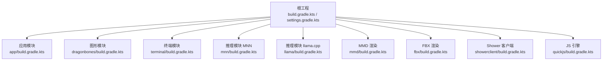
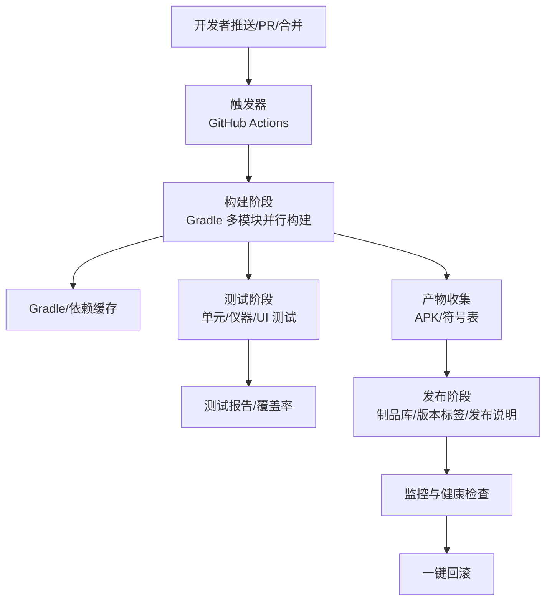
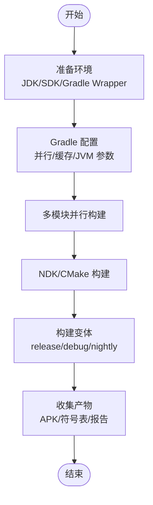
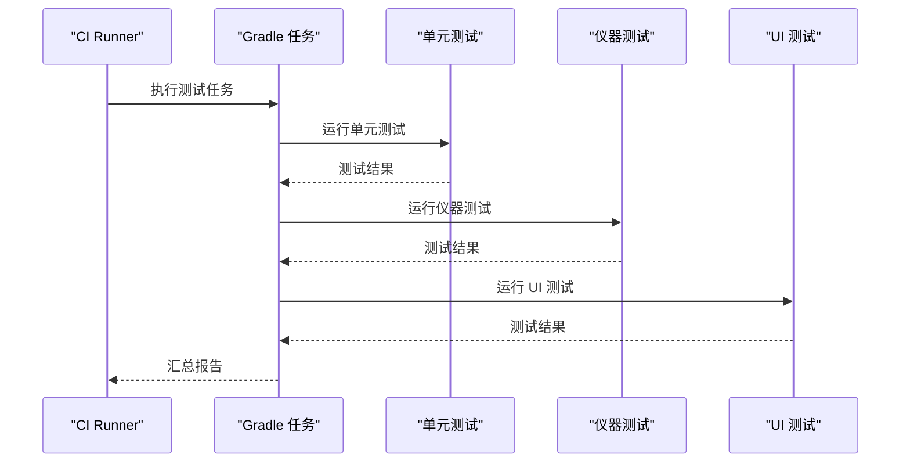
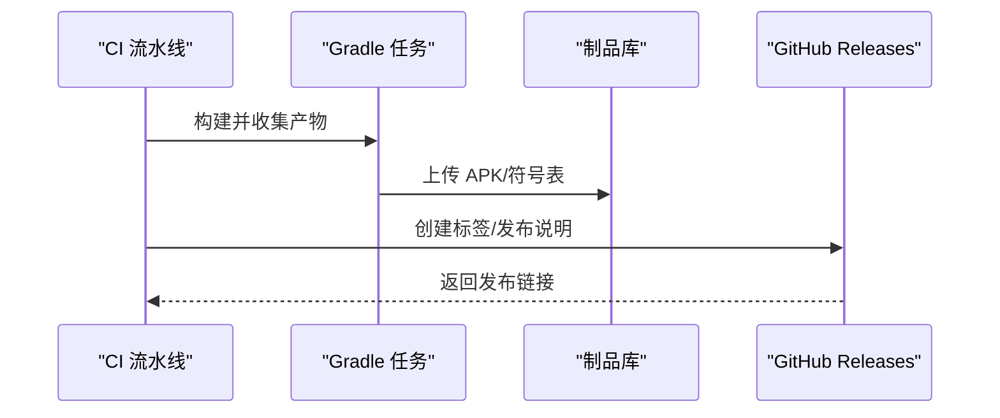
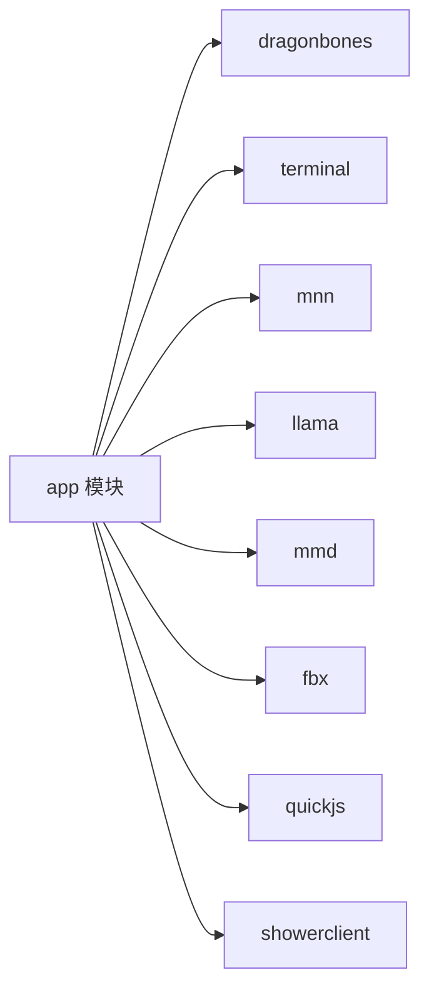

# 自动化部署

<cite>
**本文引用的文件**   
- [README.md](file://README.md)
- [build.gradle.kts](file://build.gradle.kts)
- [settings.gradle.kts](file://settings.gradle.kts)
- [gradle.properties](file://gradle.properties)
- [gradle-wrapper.properties](file://gradle-wrapper.properties)
- [app/build.gradle.kts](file://app/build.gradle.kts)
- [.github/FUNDING.yml](file://.github/FUNDING.yml)
</cite>

## 目录
1. [引言](#引言)
2. [项目结构](#项目结构)
3. [核心组件](#核心组件)
4. [架构总览](#架构总览)
5. [详细组件分析](#详细组件分析)
6. [依赖分析](#依赖分析)
7. [性能考虑](#性能考虑)
8. [故障排查指南](#故障排查指南)
9. [结论](#结论)
10. [附录](#附录)

## 引言
本技术方案面向 Operit 项目的自动化部署，围绕 CI/CD 流水线设计、构建与测试、发布与版本管理、环境配置与监控回滚等方面，提供可落地的实施路径。Operit 是一个功能完备的 Android 应用，具备多模块工程、复杂依赖与混合语言（Kotlin/Java/C++/JS）特性，因此自动化流水线需兼顾多平台构建、并行与缓存优化、测试覆盖与产物交付。

## 项目结构
Operit 采用多模块 Gradle 工程组织，根工程统一管理插件与仓库，子模块涵盖主应用、图形与动画、本地推理、脚本引擎、桌面与工具集等。Gradle 属性开启并行、守护进程、按需配置与构建缓存，有助于提升构建效率；应用模块定义了 release/debug/nightly 三种构建变体，并通过签名配置与打包策略保障产物一致性。

**图表来源**
- [settings.gradle.kts:1-30](file://settings.gradle.kts#L1-L30)
- [build.gradle.kts:11-20](file://build.gradle.kts#L11-L20)
- [app/build.gradle.kts:181-445](file://app/build.gradle.kts#L181-L445)

**章节来源**
- [settings.gradle.kts:1-30](file://settings.gradle.kts#L1-L30)
- [build.gradle.kts:11-20](file://build.gradle.kts#L11-L20)
- [gradle.properties:9-29](file://gradle.properties#L9-L29)

## 核心组件
- 构建系统与属性
  - Gradle 根工程统一声明插件别名与仓库，启用并行与构建缓存，减少重复工作。
  - 应用模块定义 ABI 过滤、NDK 编译参数、Compose/BuildConfig/打包策略与构建变体。
- 签名与发布
  - 通过 local.properties 注入签名参数，支持 release 与 nightly 变体签名与命名。
- 测试与覆盖率
  - 应用模块配置了单元测试与 Android Instrumentation 测试依赖，便于在流水线中执行。
- 产物与版本
  - nightly 变体输出固定命名的 APK，便于自动化上传与归档。

**章节来源**
- [gradle.properties:9-29](file://gradle.properties#L9-L29)
- [app/build.gradle.kts:23-173](file://app/build.gradle.kts#L23-L173)
- [app/build.gradle.kts:102-123](file://app/build.gradle.kts#L102-L123)

## 架构总览
自动化部署流水线由“触发—构建—测试—发布—验证”闭环组成。触发方式包括推送、PR、定时与手动；构建阶段执行多模块并行构建与缓存优化；测试阶段覆盖单元测试、仪器测试与 UI 测试；发布阶段产出 APK 并上传至制品库，同时创建版本标签与发布说明；最后通过健康检查与回滚机制保障线上稳定。

[此图为概念性架构示意，无需图表来源]

## 详细组件分析

### CI/CD 流水线设计
- 触发条件
  - 推送主分支：触发构建、测试与发布（含 nightly）。
  - PR：仅构建与测试，不发布。
  - 标签推送：创建正式版本标签与发布说明。
  - 定时：夜间构建 nightly 版本。
- 步骤编排
  - 环境准备：安装 JDK/Android SDK/Gradle Wrapper。
  - Gradle 配置：设置 org.gradle.jvmargs、并行与缓存。
  - 多模块构建：并行构建各子模块，按需跳过。
  - 测试执行：先单元测试，再仪器测试，最后 UI 测试。
  - 产物收集：收集 APK、符号表、测试报告。
  - 发布：上传 APK 至制品库，创建 Git 标签与发布说明。
- 安全与密钥
  - 使用 GitHub Secrets 管理签名证书与发布凭据，避免硬编码。

[本节为流程设计说明，不直接分析具体文件，故无章节来源]

### 自动化构建流程
- 多平台与 ABI
  - 应用模块显式指定 ABI 过滤，nightly 变体命名统一，便于分环境分发。
- 并行与缓存
  - Gradle 属性启用并行、守护进程、按需配置与构建缓存，显著缩短构建时间。
- NDK/CMake
  - 外部原生构建通过 CMake 配置，C++17 标准编译，配合 JNI 库打包。
- 构建变体
  - release/debug/nightly 三类变体，nightly 输出固定命名 APK，利于自动化处理。

**章节来源**
- [gradle.properties:9-29](file://gradle.properties#L9-L29)
- [app/build.gradle.kts:48-77](file://app/build.gradle.kts#L48-L77)
- [app/build.gradle.kts:102-123](file://app/build.gradle.kts#L102-L123)

### 自动化测试集成
- 单元测试
  - 使用 JUnit 与协程测试依赖，适合在流水线中快速执行。
- 仪器测试（Android Instrumentation）
  - 配置 AndroidX JUnit/Espresso 与 Compose 测试依赖，支持 UI 交互与组件测试。
- UI 测试
  - 项目包含 UI 自动化工具与探针脚本，可用于端到端场景验证。
- 测试报告与覆盖率
  - 建议在流水线中生成 JUnit 与覆盖率报告，上传制品库供评审。

**章节来源**
- [app/build.gradle.kts:360-445](file://app/build.gradle.kts#L360-L445)

### 自动化发布流程
- APK 上传
  - nightly 与 release 变体分别上传至制品库，命名规范明确。
- 版本标签与发布说明
  - 基于版本号与变更记录生成发布说明，自动创建 Git 标签。
- 产物归档
  - 收集 APK、符号表与测试报告，便于审计与回溯。

**章节来源**
- [app/build.gradle.kts:102-123](file://app/build.gradle.kts#L102-L123)
- [README.md:174-185](file://README.md#L174-L185)

### 部署环境配置
- 测试环境
  - 使用 debug 或 nightly 变体，便于快速迭代与回归测试。
- 预发布环境
  - 使用 release 变体，进行小范围灰度与冒烟测试。
- 生产环境
  - 使用 release 变体，严格校验签名与完整性，结合健康检查与监控。

[本节为配置策略说明，不直接分析具体文件，故无章节来源]

### 部署监控与回滚机制
- 健康检查
  - 上线后执行关键路径健康检查（启动、核心功能、网络请求）。
- 性能监控
  - 关注冷启动、内存占用、主线程阻塞等指标。
- 一键回滚
  - 通过版本标签与发布说明快速定位上一稳定版本，执行回滚。

[本节为运维策略说明，不直接分析具体文件，故无章节来源]

## 依赖分析
Operit 的多模块工程通过 settings.gradle.kts 统一纳入，app 模块依赖众多子模块与第三方库，形成复杂依赖关系。构建系统层面已启用并行与缓存，有助于降低依赖解析与编译时间。

**图表来源**
- [settings.gradle.kts:21-29](file://settings.gradle.kts#L21-L29)
- [app/build.gradle.kts:181-190](file://app/build.gradle.kts#L181-L190)

**章节来源**
- [settings.gradle.kts:1-30](file://settings.gradle.kts#L1-L30)
- [app/build.gradle.kts:181-190](file://app/build.gradle.kts#L181-L190)

## 性能考虑
- 构建性能
  - 并行构建与构建缓存是关键；合理拆分任务、避免不必要的全量构建。
- 依赖管理
  - 统一版本与仓库，减少冲突；必要时使用 BOM 管理 Compose 版本。
- 产物体积
  - 通过 ABI 过滤与资源排除策略控制 APK 体积，满足不同环境需求。

[本节提供通用指导，不直接分析具体文件，故无章节来源]

## 故障排查指南
- 构建失败
  - 检查 Gradle JVM 参数与守护进程配置，确认磁盘空间与并发上限。
  - 核对签名配置与密钥文件是否存在。
- 测试失败
  - 优先排查模拟器/设备兼容性与权限问题；关注 UI 测试的稳定性。
- 部署中断
  - 校验制品库凭据与网络连通性；确认标签与发布说明生成是否成功。
- 回滚
  - 基于发布说明与标签快速定位上一稳定版本，执行回滚并验证。

[本节为通用排障建议，不直接分析具体文件，故无章节来源]

## 结论
通过在 Operit 项目中引入规范化的 CI/CD 流水线，可实现多模块并行构建、全面测试覆盖、稳定发布与可观测的回滚机制。结合 Gradle 的并行与缓存能力，以及应用模块对变体与签名的清晰配置，能够有效提升交付效率与质量。

## 附录
- 版本与发布
  - 参考项目 README 的版本更新历程与下载安装指引，确保发布流程与用户期望一致。
- 资源与支持
  - 项目提供多种资助与社区渠道，便于在发布与维护阶段获得支持。

**章节来源**
- [README.md:174-185](file://README.md#L174-L185)
- [.github/FUNDING.yml](file://.github/FUNDING.yml)