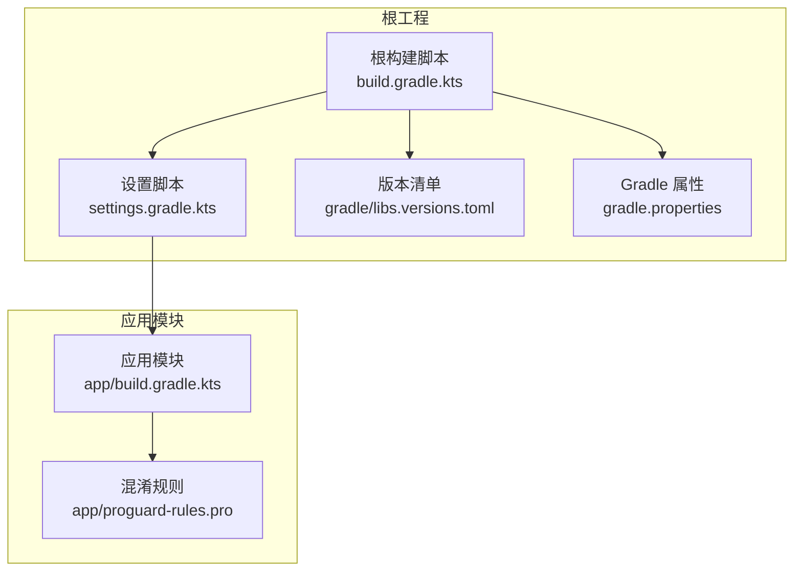
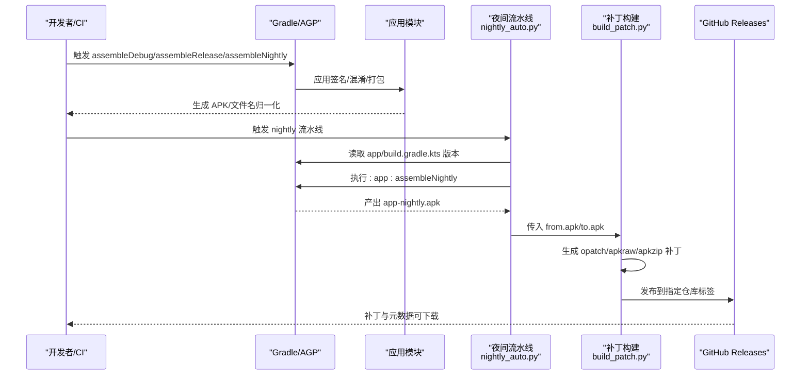
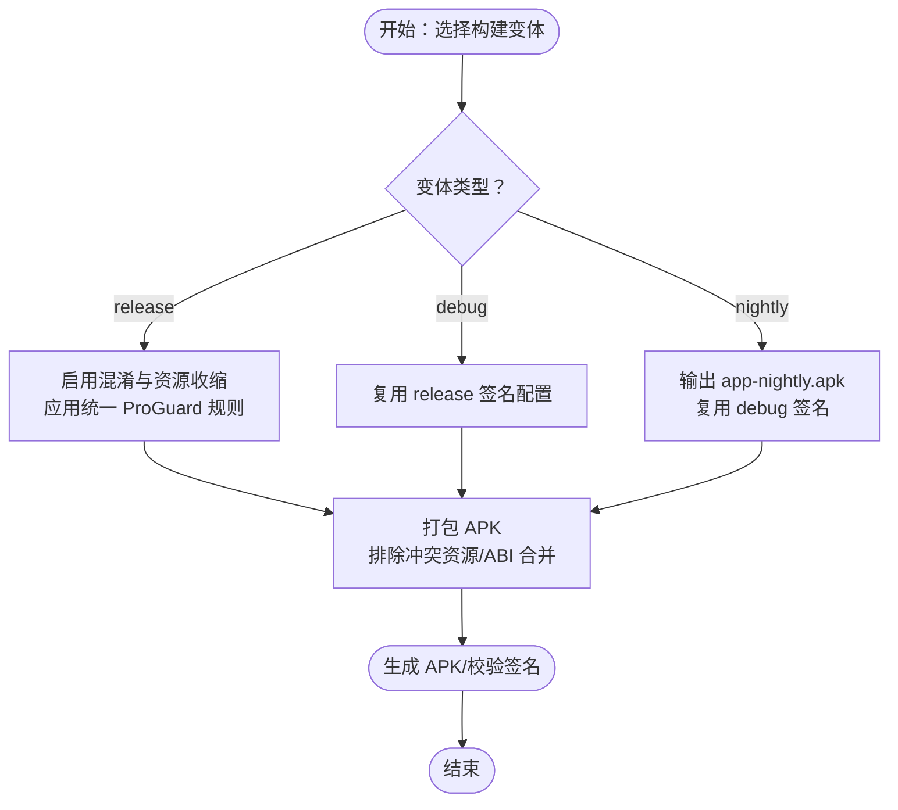
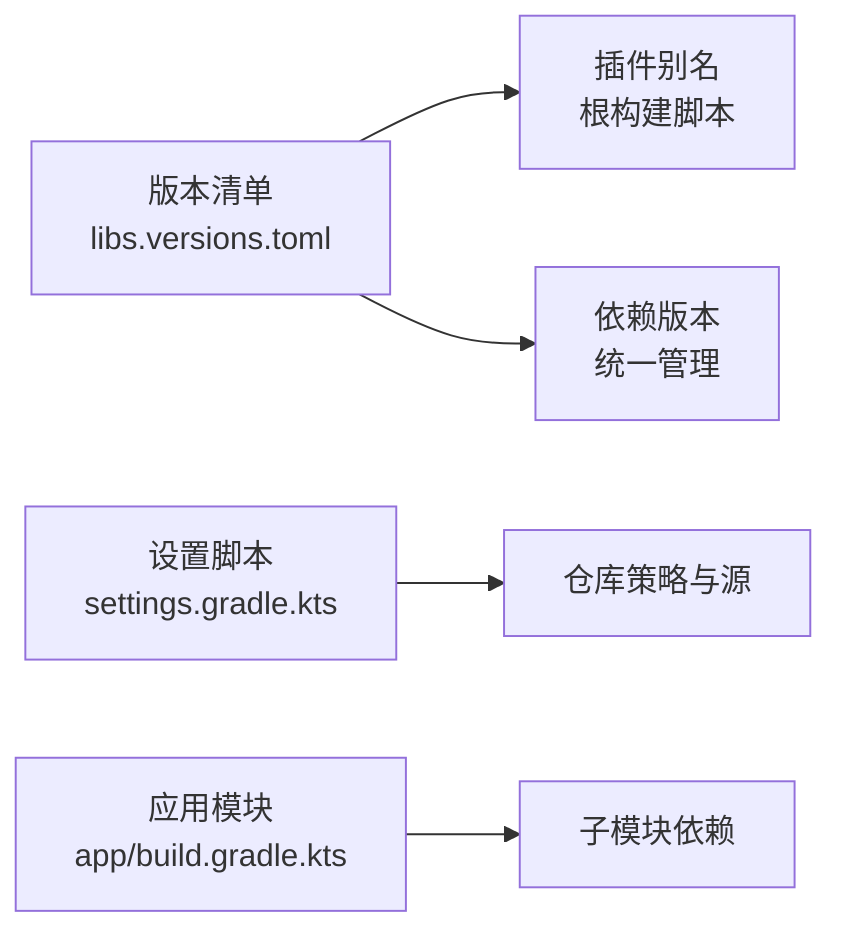
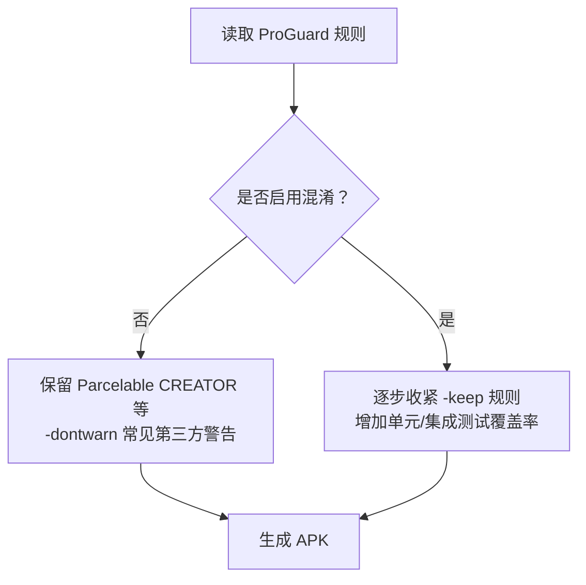
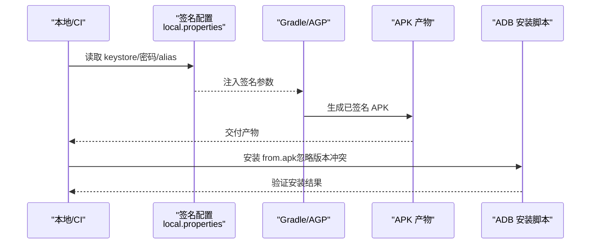
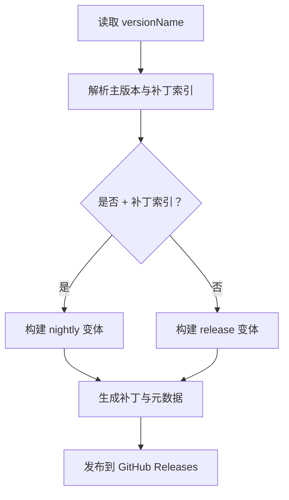
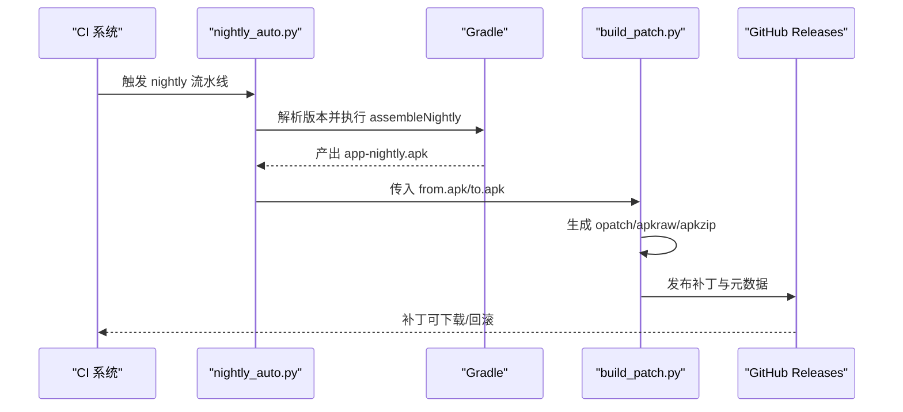
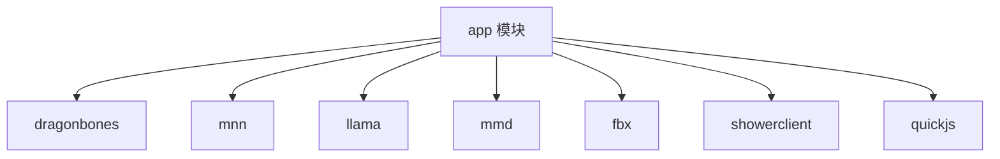

# 部署与发布

<cite>
**本文引用的文件**
- [根构建脚本 build.gradle.kts](file://build.gradle.kts)
- [设置脚本 settings.gradle.kts](file://settings.gradle.kts)
- [版本清单 libs.versions.toml](file://gradle/libs.versions.toml)
- [Gradle 属性 gradle.properties](file://gradle.properties)
- [应用模块构建 app/build.gradle.kts](file://app/build.gradle.kts)
- [ProGuard 规则 app/proguard-rules.pro](file://app/proguard-rules.pro)
- [构建指南 docs/BUILDING.md](file://docs/BUILDING.md)
- [夜间流水线入口 nightly_auto.py](file://tools/hotbuild/nightly_auto.py)
- [补丁构建 build_patch.py](file://tools/hotbuild/build_patch.py)
- [ADB 安装脚本 install_from_adb.bat](file://tools/hotbuild/install_from_adb.bat)
- [README 主页 README.md](file://README.md)
</cite>

## 目录
1. [引言](#引言)
2. [项目结构](#项目结构)
3. [核心组件](#核心组件)
4. [架构总览](#架构总览)
5. [详细组件分析](#详细组件分析)
6. [依赖分析](#依赖分析)
7. [性能考虑](#性能考虑)
8. [故障排查指南](#故障排查指南)
9. [结论](#结论)
10. [附录](#附录)

## 引言
本指南面向运维与发布工程师，围绕 Operit AI 的构建与发布提供端到端技术方案。内容涵盖：
- 构建配置与变体、依赖管理、资源处理
- 代码混淆与优化（ProGuard 规则）
- 签名与发布流程（密钥管理、APK 签名、发布渠道）
- 版本管理策略（版本号规范、变更日志、发布计划）
- 自动化部署（CI/CD 流水线、自动化测试、自动发布）
- 发布后监控（崩溃报告、性能监控、用户反馈）
- 实操示例（构建环境配置、构建失败处理、发布质量验证）

## 项目结构
Operit 采用多模块 Gradle 工程，主模块 app 负责最终 APK 产出，其他模块提供图形、推理、脚本运行时等能力。版本与插件通过 libs.versions.toml 统一管理，构建脚本集中于根与 app 模块。

**图表来源**
- [根构建脚本 build.gradle.kts](file://build.gradle.kts)
- [设置脚本 settings.gradle.kts](file://settings.gradle.kts)
- [版本清单 libs.versions.toml](file://gradle/libs.versions.toml)
- [Gradle 属性 gradle.properties](file://gradle.properties)
- [应用模块构建 app/build.gradle.kts](file://app/build.gradle.kts)
- [ProGuard 规则 app/proguard-rules.pro](file://app/proguard-rules.pro)

**章节来源**
- [根构建脚本 build.gradle.kts](file://build.gradle.kts)
- [设置脚本 settings.gradle.kts](file://settings.gradle.kts)
- [版本清单 libs.versions.toml](file://gradle/libs.versions.toml)
- [Gradle 属性 gradle.properties](file://gradle.properties)

## 核心组件
- 构建系统与插件
  - AGP 与 Kotlin 插件通过版本清单统一管理，避免版本漂移。
  - Compose、Serialization、Kapt、Parcelize 等插件集中启用。
- 依赖管理
  - 通过 libs.versions.toml 统一声明版本，模块间共享依赖版本。
  - 依赖解析管理器强制拒绝项目级仓库污染，统一使用 Google/MavenCentral/JitPack 等可信源。
- 构建变体
  - debug/release/nightly 三大变体，nightly 输出文件名特殊化，便于区分。
- 资源与打包
  - 显式排除重复与冲突资源，解决合并冲突与 Netty 冲突。
  - JNI 二进制使用传统打包方式，避免 ABI 不兼容。
- 签名与密钥
  - 从 local.properties 注入签名参数，支持 release 与 debug 签名配置。
- 混淆与优化
  - 默认关闭混淆与资源收缩，保留关键类以保证 IPC 与反射正常工作。
  - 提供详尽的 -dontwarn 与 -keep 规则，覆盖第三方库常见警告与必要类。

**章节来源**
- [应用模块构建 app/build.gradle.kts](file://app/build.gradle.kts)
- [ProGuard 规则 app/proguard-rules.pro](file://app/proguard-rules.pro)

## 架构总览
下图展示了从本地构建到发布产物的端到端流程，以及夜间流水线与补丁发布的联动。

**图表来源**
- [应用模块构建 app/build.gradle.kts](file://app/build.gradle.kts)
- [夜间流水线入口 nightly_auto.py](file://tools/hotbuild/nightly_auto.py)
- [补丁构建 build_patch.py](file://tools/hotbuild/build_patch.py)

## 详细组件分析

### 构建配置与变体
- 变体与输出
  - release：启用混淆与资源收缩，使用统一 ProGuard 规则，签名来自 local.properties。
  - debug：复用 release 签名配置，便于联调。
  - nightly：输出文件名固定为 app-nightly.apk，便于自动化识别。
- ABI 与 NDK
  - 仅打包 arm64-v8a，兼顾终端模块的 x86_64 运行时，避免多 ABI 带来的体积与兼容性问题。
- 打包与资源
  - 排除 META-INF 重复与冲突文件，修复 Netty 与 INDEX.LIST 冲突。
  - pickFirst *.so，避免重复 SO 冲突。
- 构建选项
  - Java 17 目标与源码兼容，启用 desugaring 支持现代 Java API。
  - Compose、AIDL、BuildConfig 开关按需开启。

**图表来源**
- [应用模块构建 app/build.gradle.kts](file://app/build.gradle.kts)

**章节来源**
- [应用模块构建 app/build.gradle.kts](file://app/build.gradle.kts)

### 依赖管理与版本治理
- 版本与插件
  - libs.versions.toml 统一声明 AGP/Kotlin/Compose/Room/ObjectBox 等版本，避免冲突。
  - 插件别名集中于根构建脚本，避免重复引入。
- 依赖解析
  - 仓库策略 FAIL_ON_PROJECT_REPOS，确保所有依赖来自受控仓库。
  - 显式添加 JitPack、Bintray、Sonatype 等第三方仓库，满足特定依赖需求。
- 模块依赖
  - app 模块聚合 dragonbones、mnn、llama、mmd、fbx、showerclient、quickjs 等子模块。

**图表来源**
- [版本清单 libs.versions.toml](file://gradle/libs.versions.toml)
- [根构建脚本 build.gradle.kts](file://build.gradle.kts)
- [设置脚本 settings.gradle.kts](file://settings.gradle.kts)
- [应用模块构建 app/build.gradle.kts](file://app/build.gradle.kts)

**章节来源**
- [版本清单 libs.versions.toml](file://gradle/libs.versions.toml)
- [设置脚本 settings.gradle.kts](file://settings.gradle.kts)
- [应用模块构建 app/build.gradle.kts](file://app/build.gradle.kts)

### 代码混淆与优化
- 当前策略
  - release 默认关闭混淆与资源收缩，避免破坏反射与 IPC。
  - 通过 ProGuard 规则显式 -keep 必要类（如 Shizuku、IPC Binder、QuickJS 绑定）。
  - 大量 -dontwarn 覆盖第三方库常见警告（SVG、POI、PDFBox、GIF、Netty 等）。
- 建议
  - 如需启用混淆，建议先在 nightly 变体中灰度，逐步收紧 -keep 规则并增加覆盖率测试。
  - 配合 R8 的 shrinkResources 与资源外置策略，进一步减小体积。

**图表来源**
- [ProGuard 规则 app/proguard-rules.pro](file://app/proguard-rules.pro)
- [应用模块构建 app/build.gradle.kts](file://app/build.gradle.kts)

**章节来源**
- [ProGuard 规则 app/proguard-rules.pro](file://app/proguard-rules.pro)
- [应用模块构建 app/build.gradle.kts](file://app/build.gradle.kts)

### 签名与发布流程
- 密钥管理
  - 从 local.properties 读取 keystore 路径、密码、alias、key 密码，避免明文提交。
  - release 与 debug 共用签名配置，nightly 可选择使用 debug 签名。
- 发布渠道
  - 通过 nightly 流水线产出 nightly APK，配合补丁发布到 GitHub Releases。
  - 补丁格式支持 opatch、apkraw、apkzip，便于增量更新与回滚。
- 安装与验证
  - 提供 ADB 安装脚本，支持忽略版本冲突安装，便于快速验证。

**图表来源**
- [应用模块构建 app/build.gradle.kts](file://app/build.gradle.kts)
- [ADB 安装脚本 install_from_adb.bat](file://tools/hotbuild/install_from_adb.bat)

**章节来源**
- [应用模块构建 app/build.gradle.kts](file://app/build.gradle.kts)
- [ADB 安装脚本 install_from_adb.bat](file://tools/hotbuild/install_from_adb.bat)

### 版本管理策略
- 版本号规范
  - versionName 支持形如 x.y.z+n 的“主版本 + 补丁索引”格式，便于夜间构建与补丁标识。
  - nightly 流水线解析 app/build.gradle.kts 中的 versionName，自动决定构建变体与输出文件名。
- 变更日志与发布计划
  - README 提供版本更新历程与 TODO 计划，建议在 nightly 流水线中自动生成变更摘要并附带补丁元数据。
- 补丁发布
  - build_patch.py 支持生成 opatch、apkraw、apkzip 三种补丁，自动计算 SHA256 并发布到 GitHub Releases，附带 JSON 元数据。

**图表来源**
- [夜间流水线入口 nightly_auto.py](file://tools/hotbuild/nightly_auto.py)
- [补丁构建 build_patch.py](file://tools/hotbuild/build_patch.py)
- [应用模块构建 app/build.gradle.kts](file://app/build.gradle.kts)

**章节来源**
- [夜间流水线入口 nightly_auto.py](file://tools/hotbuild/nightly_auto.py)
- [补丁构建 build_patch.py](file://tools/hotbuild/build_patch.py)
- [应用模块构建 app/build.gradle.kts](file://app/build.gradle.kts)
- [README 主页 README.md](file://README.md)

### 自动化部署方案
- 本地/CI 构建
  - 使用 Gradle Wrapper 执行 assembleDebug/assembleRelease/assembleNightly。
  - 通过 gradle.properties 控制并行、缓存与内存，加速构建。
- 夜间流水线
  - nightly_auto.py 自动解析版本、组装 nightly、生成补丁并发布。
  - 支持回滚：若补丁构建失败，自动将 to.apk 回滚为 from.apk。
- 补丁发布
  - build_patch.py 支持多种补丁格式与 GitHub API/CLI 发布，自动上传资产并生成元数据 JSON。
- 自动化测试
  - 建议在 CI 中加入单元测试与仪器测试任务，结合 nightly 变体进行回归验证。

**图表来源**
- [夜间流水线入口 nightly_auto.py](file://tools/hotbuild/nightly_auto.py)
- [补丁构建 build_patch.py](file://tools/hotbuild/build_patch.py)

**章节来源**
- [夜间流水线入口 nightly_auto.py](file://tools/hotbuild/nightly_auto.py)
- [补丁构建 build_patch.py](file://tools/hotbuild/build_patch.py)
- [Gradle 属性 gradle.properties](file://gradle.properties)

### 发布后监控
- 崩溃报告
  - 建议接入崩溃上报服务（如基于 GitHub Releases 的反馈渠道或第三方平台），收集 nightly 与 release 的崩溃日志。
- 性能监控
  - 结合应用内埋点与外部 APM，关注冷启动、首帧、内存峰值等指标。
- 用户反馈
  - 在 README 与发布说明中提供反馈渠道，鼓励用户提交问题与建议。

[本节为通用实践建议，无需具体文件引用]

## 依赖分析
- 模块耦合
  - app 模块聚合多个子模块，形成强耦合的单体 APK；建议在 CI 中对各子模块进行独立单元测试，降低回归风险。
- 外部依赖
  - 通过 libs.versions.toml 统一版本，减少冲突；对第三方库使用 -dontwarn 与 -keep 规避运行时异常。
- 可能的循环依赖
  - 项目采用单向聚合（app -> 子模块），未见循环依赖迹象。

**图表来源**
- [设置脚本 settings.gradle.kts](file://settings.gradle.kts)
- [应用模块构建 app/build.gradle.kts](file://app/build.gradle.kts)

**章节来源**
- [设置脚本 settings.gradle.kts](file://settings.gradle.kts)
- [应用模块构建 app/build.gradle.kts](file://app/build.gradle.kts)

## 性能考虑
- 构建性能
  - 启用并行、缓存与最大 worker 数，合理分配内存，缩短构建时间。
- 运行性能
  - 仅打包 arm64-v8a，减少体积与安装时间；对大型二进制（如 ffmpeg）谨慎引入。
  - 资源排除与 pickFirst *.so，避免重复与冲突带来的运行时问题。

[本节为通用指导，无需具体文件引用]

## 故障排查指南
- 环境与依赖
  - SDK/NDK/许可证：确保已接受许可并安装 android-34 与 NDK 25.1.8937393。
  - 本地属性：确保 local.properties 正确配置 GitHub OAuth 与签名参数。
- 构建失败
  - 依赖缺失：按 BUILDING 指南下载并放置 libs 与 assets。
  - web-chat/ToolPkg：先构建 web-chat，再执行同步脚本。
  - Gradle 权限：为 gradlew 添加可执行权限。
- 夜间流水线
  - 补丁发布失败：检查 GITHUB_TOKEN/GH_TOKEN/GITHUB_PAT，或使用 gh/git 回退。
  - 回滚机制：若补丁构建失败，nightly_auto.py 会自动回滚 to.apk 为 from.apk。

**章节来源**
- [构建指南 docs/BUILDING.md](file://docs/BUILDING.md)
- [夜间流水线入口 nightly_auto.py](file://tools/hotbuild/nightly_auto.py)

## 结论
Operit 的构建与发布体系以 Gradle 为核心，通过版本清单与统一仓库策略保障依赖一致性，借助 nightly 流水线与补丁发布实现高效迭代。建议在现有基础上完善自动化测试与监控体系，持续优化构建性能与发布质量。

[本节为总结，无需具体文件引用]

## 附录

### 部署示例：本地构建与验证
- 准备环境
  - 安装 JDK 17、Node.js、Python3、pnpm，配置 ANDROID_HOME 与 PATH。
  - 使用 sdkmanager 安装 platform-tools、platforms;android-34、build-tools;34.0.0、ndk;25.1.8937393。
- 获取依赖
  - 下载 models.zip、subpack.zip、jniLibs.zip、libs.zip 至对应位置。
- 构建与同步
  - npm install 与 npm --prefix web-chat install。
  - npm run build:webchat 同步 web-chat 到 assets。
  - python3 ./sync_example_packages.py 打包示例包。
- 构建 APK
  - chmod +x ./gradlew
  - ./gradlew assembleDebug
  - 产物位于 app/build/outputs/apk/debug/app-debug.apk。
- 安装验证
  - 使用 install_from_adb.bat 安装 from.apk（忽略版本冲突）。

**章节来源**
- [构建指南 docs/BUILDING.md](file://docs/BUILDING.md)
- [ADB 安装脚本 install_from_adb.bat](file://tools/hotbuild/install_from_adb.bat)

### 发布后监控落地建议
- 崩溃上报
  - 在应用内集成崩溃上报 SDK，收集 nightly 与 release 的崩溃堆栈与上下文。
- 性能埋点
  - 关键路径埋点（冷启动、首帧、工具调用耗时），定期生成报表。
- 用户反馈
  - 在 README 与发布说明中提供 Issue 模板与反馈渠道，沉淀问题分类与修复计划。

[本节为通用实践建议，无需具体文件引用]