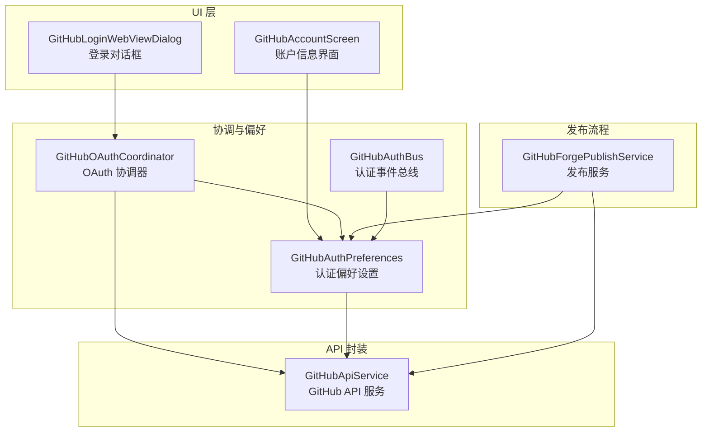
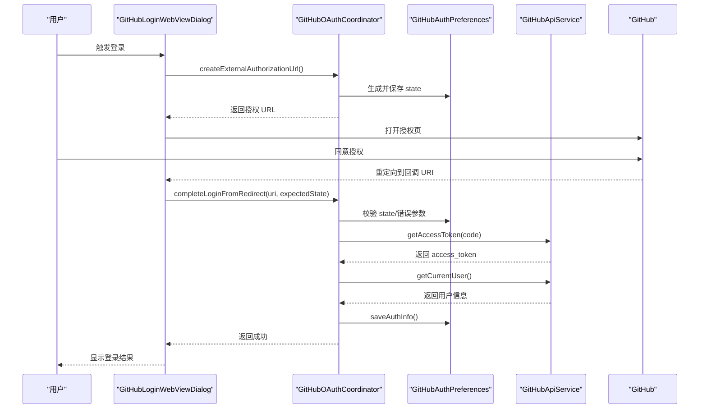
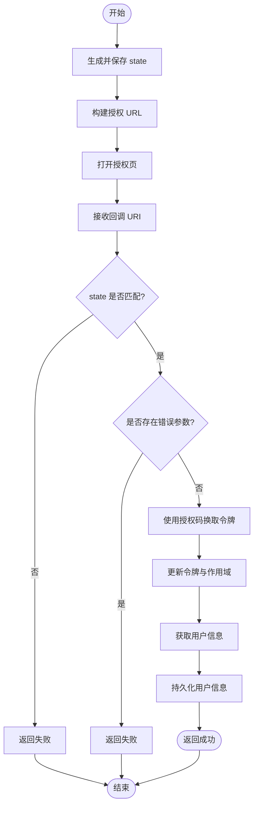
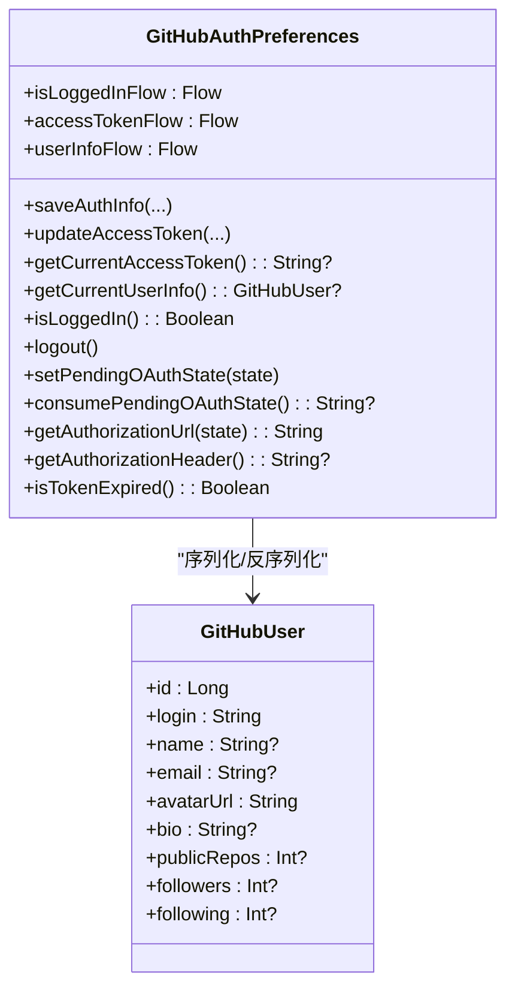
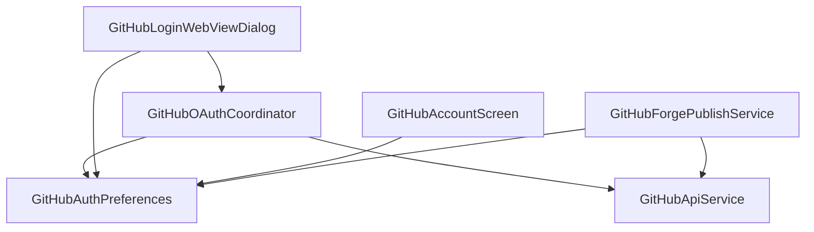

# GitHub OAuth 集成

<cite>
**本文档引用的文件**
- [GitHubOAuthCoordinator.kt](file://app/src/main/java/com/ai/assistance/operit/ui/features/github/GitHubOAuthCoordinator.kt)
- [GitHubAuthPreferences.kt](file://app/src/main/java/com/ai/assistance/operit/data/preferences/GitHubAuthPreferences.kt)
- [GitHubAuthBus.kt](file://app/src/main/java/com/ai/assistance/operit/data/preferences/GitHubAuthBus.kt)
- [GitHubLoginWebViewDialog.kt](file://app/src/main/java/com/ai/assistance/operit/ui/features/github/GitHubLoginWebViewDialog.kt)
- [GitHubApiService.kt](file://app/src/main/java/com/ai/assistance/operit/data/api/GitHubApiService.kt)
- [GitHubAccountScreen.kt](file://app/src/main/java/com/ai/assistance/operit/ui/features/settings/screens/GitHubAccountScreen.kt)
- [GitHubForgePublishService.kt](file://app/src/main/java/com/ai/assistance/operit/ui/features/packages/market/GitHubForgePublishService.kt)
- [build.gradle.kts](file://app/build.gradle.kts)
</cite>

## 目录
1. [简介](#简介)
2. [项目结构](#项目结构)
3. [核心组件](#核心组件)
4. [架构概览](#架构概览)
5. [详细组件分析](#详细组件分析)
6. [依赖关系分析](#依赖关系分析)
7. [性能考虑](#性能考虑)
8. [故障排除指南](#故障排除指南)
9. [结论](#结论)
10. [附录](#附录)

## 简介
本文件为 Operit 项目的 GitHub OAuth 集成技术文档，全面阐述基于 OAuth 2.0 的认证流程实现，包括授权码获取、令牌交换、用户信息获取等关键环节。文档重点解析以下核心模块：
- GitHubOAuthCoordinator：负责 OAuth 流程协调、状态校验、回调处理与错误重试
- GitHubAuthPreferences：负责认证状态与用户信息的持久化存储、权限范围管理、令牌过期处理
- GitHubAuthBus：轻量级事件总线，用于跨组件的状态同步与通知
- GitHubLoginWebViewDialog：提供外置浏览器与内嵌 WebView 两种登录方式的 UI 交互
- GitHubApiService：封装 GitHub API 调用，包括令牌交换与用户信息获取
- GitHubAccountScreen 与 GitHubForgePublishService：展示认证状态、账户信息管理以及基于认证的发布流程

本集成遵循 OAuth 2.0 安全最佳实践，包括 state 参数防 CSRF、版本控制、作用域验证、令牌过期处理与最小权限原则。

## 项目结构
围绕 GitHub OAuth 集成的关键文件分布于以下包路径：
- ui/features/github：包含登录对话框与协调器
- data/preferences：包含认证偏好设置与事件总线
- data/api：包含 GitHub API 服务
- ui/features/settings/screens：包含账户信息展示界面
- ui/features/packages/market：包含基于认证的发布服务
- app/build.gradle.kts：包含客户端 ID/Secret 的构建配置

**图表来源**
- [GitHubLoginWebViewDialog.kt:169-334](file://app/src/main/java/com/ai/assistance/operit/ui/features/github/GitHubLoginWebViewDialog.kt#L169-L334)
- [GitHubOAuthCoordinator.kt:9-78](file://app/src/main/java/com/ai/assistance/operit/ui/features/github/GitHubOAuthCoordinator.kt#L9-L78)
- [GitHubAuthPreferences.kt:41-302](file://app/src/main/java/com/ai/assistance/operit/data/preferences/GitHubAuthPreferences.kt#L41-L302)
- [GitHubAuthBus.kt:6-13](file://app/src/main/java/com/ai/assistance/operit/data/preferences/GitHubAuthBus.kt#L6-L13)
- [GitHubApiService.kt:237-338](file://app/src/main/java/com/ai/assistance/operit/data/api/GitHubApiService.kt#L237-L338)
- [GitHubForgePublishService.kt:43-171](file://app/src/main/java/com/ai/assistance/operit/ui/features/packages/market/GitHubForgePublishService.kt#L43-L171)

**章节来源**
- [GitHubLoginWebViewDialog.kt:1-400](file://app/src/main/java/com/ai/assistance/operit/ui/features/github/GitHubLoginWebViewDialog.kt#L1-L400)
- [GitHubOAuthCoordinator.kt:1-78](file://app/src/main/java/com/ai/assistance/operit/ui/features/github/GitHubOAuthCoordinator.kt#L1-L78)
- [GitHubAuthPreferences.kt:1-302](file://app/src/main/java/com/ai/assistance/operit/data/preferences/GitHubAuthPreferences.kt#L1-L302)
- [GitHubAuthBus.kt:1-13](file://app/src/main/java/com/ai/assistance/operit/data/preferences/GitHubAuthBus.kt#L1-L13)
- [GitHubApiService.kt:1-800](file://app/src/main/java/com/ai/assistance/operit/data/api/GitHubApiService.kt#L1-L800)
- [GitHubAccountScreen.kt:1-206](file://app/src/main/java/com/ai/assistance/operit/ui/features/settings/screens/GitHubAccountScreen.kt#L1-L206)
- [GitHubForgePublishService.kt:1-330](file://app/src/main/java/com/ai/assistance/operit/ui/features/packages/market/GitHubForgePublishService.kt#L1-L330)
- [build.gradle.kts:78-81](file://app/build.gradle.kts#L78-L81)

## 核心组件
本节概述各核心组件的职责与交互关系：
- GitHubOAuthCoordinator：对外提供创建授权 URL 与完成登录的统一入口；内部执行 state 校验、错误参数检查、授权码到访问令牌的交换、用户信息拉取与持久化
- GitHubAuthPreferences：集中管理认证状态、令牌、用户信息、作用域与过期时间；提供 Flow 形式的状态订阅；负责客户端 ID/Secret 的读取与授权 URL 构建
- GitHubAuthBus：轻量级事件总线，用于在组件间传递认证状态变化
- GitHubLoginWebViewDialog：提供外置浏览器与内嵌 WebView 两种登录方式；处理 OAuth 回调、错误提示与生命周期释放
- GitHubApiService：封装 GitHub OAuth 令牌交换与用户信息接口；统一添加请求头与错误处理
- GitHubAccountScreen：展示当前登录状态与用户信息；提供登出功能
- GitHubForgePublishService：在认证基础上进行发布流程，包括仓库初始化、发布版本与资产上传、市场条目登记

**章节来源**
- [GitHubOAuthCoordinator.kt:9-78](file://app/src/main/java/com/ai/assistance/operit/ui/features/github/GitHubOAuthCoordinator.kt#L9-L78)
- [GitHubAuthPreferences.kt:41-302](file://app/src/main/java/com/ai/assistance/operit/data/preferences/GitHubAuthPreferences.kt#L41-L302)
- [GitHubAuthBus.kt:6-13](file://app/src/main/java/com/ai/assistance/operit/data/preferences/GitHubAuthBus.kt#L6-L13)
- [GitHubLoginWebViewDialog.kt:169-334](file://app/src/main/java/com/ai/assistance/operit/ui/features/github/GitHubLoginWebViewDialog.kt#L169-L334)
- [GitHubApiService.kt:237-338](file://app/src/main/java/com/ai/assistance/operit/data/api/GitHubApiService.kt#L237-L338)
- [GitHubAccountScreen.kt:49-206](file://app/src/main/java/com/ai/assistance/operit/ui/features/settings/screens/GitHubAccountScreen.kt#L49-L206)
- [GitHubForgePublishService.kt:43-171](file://app/src/main/java/com/ai/assistance/operit/ui/features/packages/market/GitHubForgePublishService.kt#L43-L171)

## 架构概览
下图展示了从 UI 到 API 的端到端 OAuth 流程，包括授权、回调、令牌交换与用户信息获取：

**图表来源**
- [GitHubOAuthCoordinator.kt:14-76](file://app/src/main/java/com/ai/assistance/operit/ui/features/github/GitHubOAuthCoordinator.kt#L14-L76)
- [GitHubAuthPreferences.kt:279-288](file://app/src/main/java/com/ai/assistance/operit/data/preferences/GitHubAuthPreferences.kt#L279-L288)
- [GitHubApiService.kt:271-338](file://app/src/main/java/com/ai/assistance/operit/data/api/GitHubApiService.kt#L271-L338)
- [GitHubLoginWebViewDialog.kt:336-386](file://app/src/main/java/com/ai/assistance/operit/ui/features/github/GitHubLoginWebViewDialog.kt#L336-L386)

## 详细组件分析

### GitHubOAuthCoordinator 分析
GitHubOAuthCoordinator 是 OAuth 流程的核心协调者，负责：
- 生成并保存一次性 state，构建授权 URL
- 处理回调 URI，校验 state 与错误参数
- 使用授权码换取访问令牌，更新令牌与作用域
- 拉取用户信息并持久化
- 统一返回 Result 类型，便于上层处理

关键流程图如下：

**图表来源**
- [GitHubOAuthCoordinator.kt:14-76](file://app/src/main/java/com/ai/assistance/operit/ui/features/github/GitHubOAuthCoordinator.kt#L14-L76)

**章节来源**
- [GitHubOAuthCoordinator.kt:9-78](file://app/src/main/java/com/ai/assistance/operit/ui/features/github/GitHubOAuthCoordinator.kt#L9-L78)

### GitHubAuthPreferences 分析
GitHubAuthPreferences 负责认证状态与用户信息的持久化与查询，采用 DataStore 存储，提供以下能力：
- 客户端 ID/Secret 读取与授权 URL 构建
- state 生成与回调校验
- 认证状态 Flow（登录态、令牌、用户信息）
- 令牌过期判断与当前令牌获取
- 保存/更新认证信息、用户信息与作用域
- 登出清理

类图如下：

**图表来源**
- [GitHubAuthPreferences.kt:41-302](file://app/src/main/java/com/ai/assistance/operit/data/preferences/GitHubAuthPreferences.kt#L41-L302)

**章节来源**
- [GitHubAuthPreferences.kt:41-302](file://app/src/main/java/com/ai/assistance/operit/data/preferences/GitHubAuthPreferences.kt#L41-L302)

### GitHubAuthBus 分析
GitHubAuthBus 提供轻量级事件总线，用于跨组件的状态同步：
- 通过 StateFlow 暴露认证码流
- 提供 postAuthCode 方法写入认证码
- 适用于需要响应式监听认证状态变化的场景

**章节来源**
- [GitHubAuthBus.kt:6-13](file://app/src/main/java/com/ai/assistance/operit/data/preferences/GitHubAuthBus.kt#L6-L13)

### GitHubLoginWebViewDialog 分析
该组件提供两种登录方式：
- 外置浏览器：生成授权 URL 并启动系统浏览器，等待回调
- 内嵌 WebView：在应用内加载授权页，拦截回调并交由协调器处理

核心交互逻辑：
- 生成期望 state 并构建授权 URL
- WebViewClient 拦截回调，调用协调器完成登录
- 成功/失败反馈与生命周期释放

**章节来源**
- [GitHubLoginWebViewDialog.kt:169-334](file://app/src/main/java/com/ai/assistance/operit/ui/features/github/GitHubLoginWebViewDialog.kt#L169-L334)
- [GitHubLoginWebViewDialog.kt:336-386](file://app/src/main/java/com/ai/assistance/operit/ui/features/github/GitHubLoginWebViewDialog.kt#L336-L386)

### GitHubApiService 分析
GitHubApiService 封装 GitHub API 调用：
- 令牌交换：向 GitHub OAuth 服务器提交授权码、client_id、client_secret，获取 access_token
- 用户信息：使用 Authorization 头调用 /user 接口
- 统一添加 Accept 与 User-Agent 请求头，处理异常与日志记录

**章节来源**
- [GitHubApiService.kt:271-338](file://app/src/main/java/com/ai/assistance/operit/data/api/GitHubApiService.kt#L271-L338)

### GitHubAccountScreen 与 GitHubForgePublishService
- GitHubAccountScreen：展示当前登录状态与用户信息卡片，提供登出按钮
- GitHubForgePublishService：在认证前提下进行发布流程，包括仓库初始化、发布版本与资产上传、市场条目登记

**章节来源**
- [GitHubAccountScreen.kt:49-206](file://app/src/main/java/com/ai/assistance/operit/ui/features/settings/screens/GitHubAccountScreen.kt#L49-L206)
- [GitHubForgePublishService.kt:43-171](file://app/src/main/java/com/ai/assistance/operit/ui/features/packages/market/GitHubForgePublishService.kt#L43-L171)

## 依赖关系分析
组件间的依赖关系如下：

**图表来源**
- [GitHubOAuthCoordinator.kt:9-12](file://app/src/main/java/com/ai/assistance/operit/ui/features/github/GitHubOAuthCoordinator.kt#L9-L12)
- [GitHubLoginWebViewDialog.kt:177-179](file://app/src/main/java/com/ai/assistance/operit/ui/features/github/GitHubLoginWebViewDialog.kt#L177-L179)
- [GitHubAccountScreen.kt:52-57](file://app/src/main/java/com/ai/assistance/operit/ui/features/settings/screens/GitHubAccountScreen.kt#L52-L57)
- [GitHubForgePublishService.kt:47-47](file://app/src/main/java/com/ai/assistance/operit/ui/features/packages/market/GitHubForgePublishService.kt#L47-L47)

**章节来源**
- [GitHubOAuthCoordinator.kt:9-12](file://app/src/main/java/com/ai/assistance/operit/ui/features/github/GitHubOAuthCoordinator.kt#L9-L12)
- [GitHubLoginWebViewDialog.kt:177-179](file://app/src/main/java/com/ai/assistance/operit/ui/features/github/GitHubLoginWebViewDialog.kt#L177-L179)
- [GitHubAccountScreen.kt:52-57](file://app/src/main/java/com/ai/assistance/operit/ui/features/settings/screens/GitHubAccountScreen.kt#L52-L57)
- [GitHubForgePublishService.kt:47-47](file://app/src/main/java/com/ai/assistance/operit/ui/features/packages/market/GitHubForgePublishService.kt#L47-L47)

## 性能考虑
- 异步网络调用：所有网络请求均在 IO 线程执行，避免阻塞主线程
- 请求头统一：通过拦截器统一添加 User-Agent 与 Accept，减少重复代码
- 数据序列化：使用 Kotlinx Serialization 进行 JSON 解析，忽略未知字段提升健壮性
- 状态订阅：通过 Flow 提供响应式状态，降低不必要的 UI 重建
- WebView 生命周期：在对话框关闭时释放 WebView 资源，避免内存泄漏

[本节为通用性能建议，无需特定文件来源]

## 故障排除指南
常见问题与排查要点：
- 回调 URI 不匹配：确认回调 scheme/host 与预期一致，检查 state 生成与消费流程
- 授权码缺失：确认回调中存在 code 参数，检查授权页是否正确跳转
- 错误参数：当回调携带 error 参数时，应根据错误类型提示用户或重试
- 令牌解析失败：检查响应体格式，确保 JSON 结构符合预期
- 登录状态异常：检查 requiredAuthVersion 与 grantedScope 的版本与作用域校验

**章节来源**
- [GitHubOAuthCoordinator.kt:26-51](file://app/src/main/java/com/ai/assistance/operit/ui/features/github/GitHubOAuthCoordinator.kt#L26-L51)
- [GitHubApiService.kt:271-307](file://app/src/main/java/com/ai/assistance/operit/data/api/GitHubApiService.kt#L271-L307)

## 结论
Operit 的 GitHub OAuth 集成以 GitHubOAuthCoordinator 为核心，结合 GitHubAuthPreferences 的状态管理与 GitHubApiService 的 API 封装，实现了安全、可靠的认证流程。通过 Flow 提供的响应式状态与 WebView 生命周期管理，保证了良好的用户体验与资源占用控制。配合最小权限的作用域策略与版本控制机制，满足生产环境的安全与可维护性要求。

[本节为总结性内容，无需特定文件来源]

## 附录

### OAuth 集成示例与最佳实践
- 配置客户端 ID/Secret：在构建脚本中注入，避免硬编码
- 处理认证回调：在 WebViewClient 中拦截回调，调用协调器完成登录
- 管理会话：通过 DataStore 持久化令牌与用户信息，提供 Flow 订阅
- 安全最佳实践：
  - 使用 state 参数防止 CSRF 攻击
  - 严格校验回调中的错误参数
  - 控制作用域最小化，仅申请必要权限
  - 定期检查令牌过期并及时刷新
  - 在 UI 关闭时释放 WebView 资源

**章节来源**
- [build.gradle.kts:78-81](file://app/build.gradle.kts#L78-L81)
- [GitHubLoginWebViewDialog.kt:336-386](file://app/src/main/java/com/ai/assistance/operit/ui/features/github/GitHubLoginWebViewDialog.kt#L336-L386)
- [GitHubAuthPreferences.kt:106-110](file://app/src/main/java/com/ai/assistance/operit/data/preferences/GitHubAuthPreferences.kt#L106-L110)
- [GitHubApiService.kt:271-307](file://app/src/main/java/com/ai/assistance/operit/data/api/GitHubApiService.kt#L271-L307)