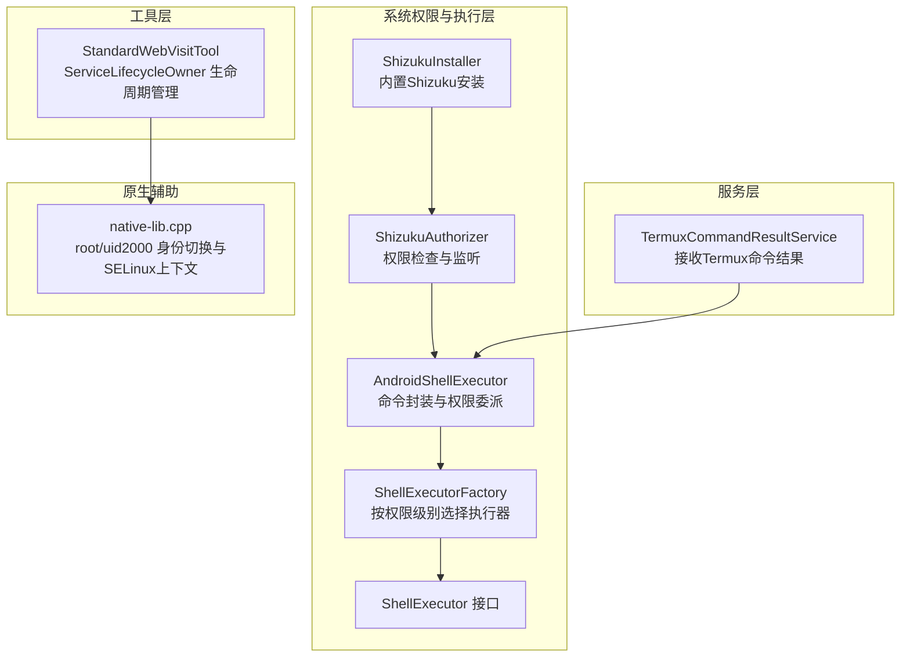
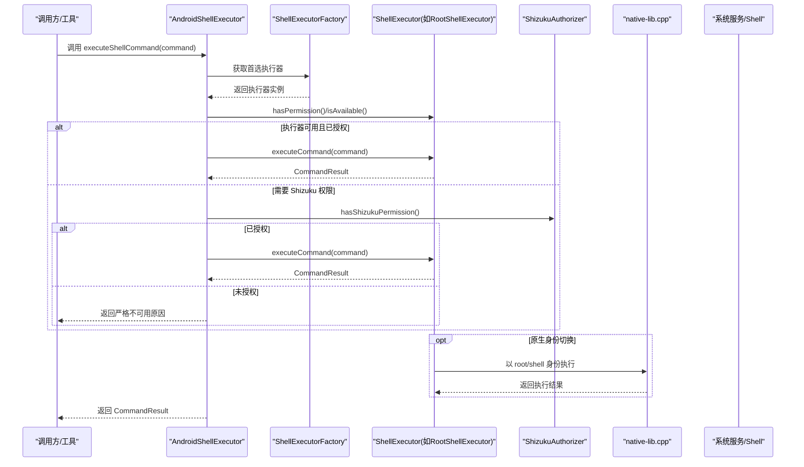
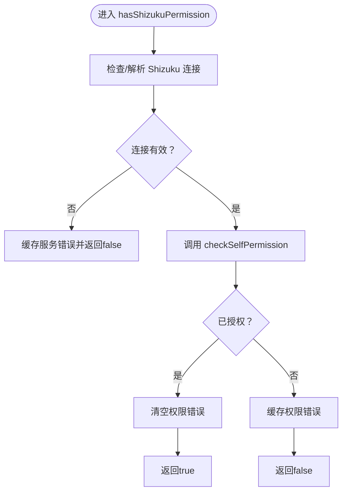
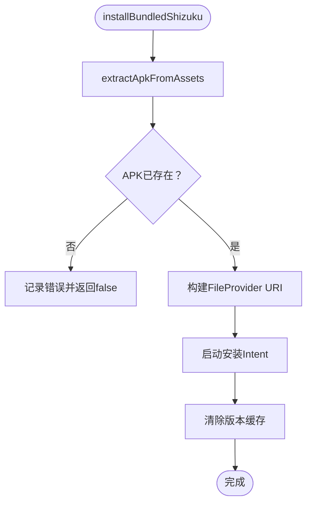
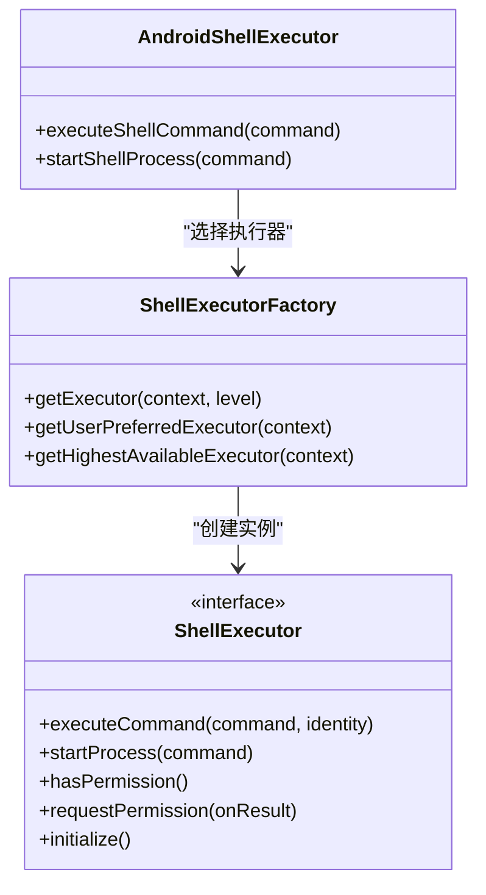
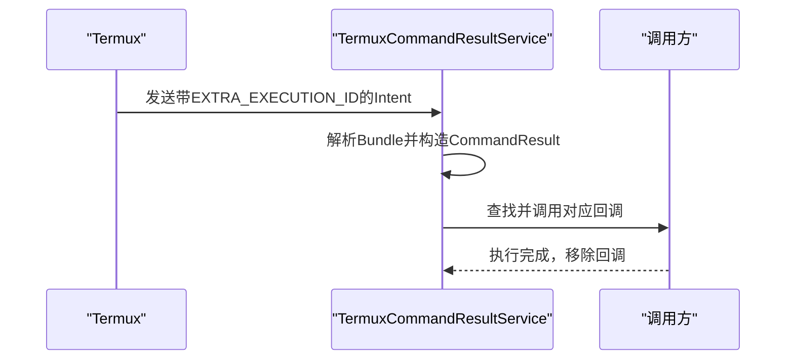
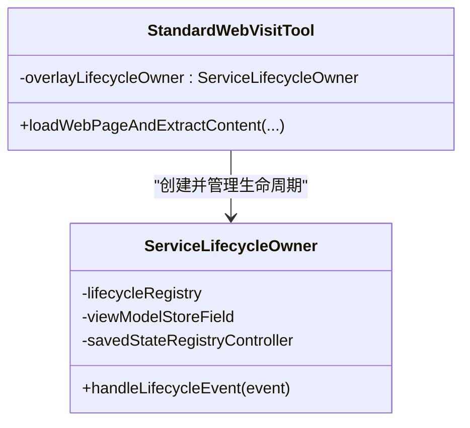
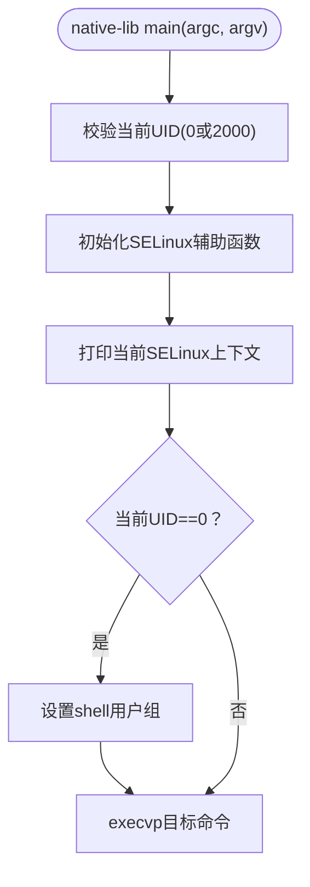
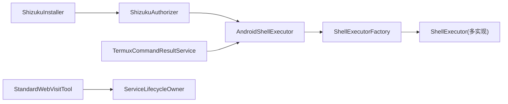

# Shizuku 集成

<cite>
**本文引用的文件**
- [ShizukuAuthorizer.kt](file://app/src/main/java/com/ai/assistance/operit/core/tools/system/ShizukuAuthorizer.kt)
- [ShizukuInstaller.kt](file://app/src/main/java/com/ai/assistance/operit/core/tools/system/ShizukuInstaller.kt)
- [TermuxCommandResultService.kt](file://app/src/main/java/com/ai/assistance/operit/services/TermuxCommandResultService.kt)
- [StandardWebVisitTool.kt](file://app/src/main/java/com/ai/assistance/operit/core/tools/defaultTool/standard/StandardWebVisitTool.kt)
- [AndroidShellExecutor.kt](file://app/src/main/java/com/ai/assistance/operit/core/tools/system/AndroidShellExecutor.kt)
- [ShellExecutor.kt](file://app/src/main/java/com/ai/assistance/operit/core/tools/system/shell/ShellExecutor.kt)
- [ShellExecutorFactory.kt](file://app/src/main/java/com/ai/assistance/operit/core/tools/system/shell/ShellExecutorFactory.kt)
- [native-lib.cpp](file://tools/shell_identity_launcher/native-lib.cpp)
</cite>

## 目录
1. [简介](#简介)
2. [项目结构](#项目结构)
3. [核心组件](#核心组件)
4. [架构总览](#架构总览)
5. [详细组件分析](#详细组件分析)
6. [依赖关系分析](#依赖关系分析)
7. [性能考量](#性能考量)
8. [故障排查指南](#故障排查指南)
9. [结论](#结论)
10. [附录](#附录)

## 简介
本文件面向高级开发者，系统性阐述 Operit 项目中的 Shizuku 集成方案与实现细节，覆盖以下主题：
- Shizuku Root 权限机制：权限申请、权限验证、降级处理
- ServiceLifecycleOwner 生命周期管理：服务启动、停止、状态监控
- TermuxCommandResultService 命令执行能力：Shell 命令调用、结果收集、异常处理
- 实际集成示例：如何实现系统级操作、如何处理权限拒绝、如何进行安全降级
- 安全注意事项：权限最小化原则、日志记录、审计跟踪

## 项目结构
围绕 Shizuku 集成的相关模块分布于如下路径：
- 系统权限与执行层：core/tools/system、core/tools/system/shell
- 服务层：services
- 工具层：core/tools/defaultTool/standard
- 原生辅助：tools/shell_identity_launcher

图表来源
- [ShizukuAuthorizer.kt:14-420](file://app/src/main/java/com/ai/assistance/operit/core/tools/system/ShizukuAuthorizer.kt#L14-L420)
- [ShizukuInstaller.kt:19-298](file://app/src/main/java/com/ai/assistance/operit/core/tools/system/ShizukuInstaller.kt#L19-L298)
- [AndroidShellExecutor.kt:11-124](file://app/src/main/java/com/ai/assistance/operit/core/tools/system/AndroidShellExecutor.kt#L11-L124)
- [ShellExecutor.kt:6-98](file://app/src/main/java/com/ai/assistance/operit/core/tools/system/shell/ShellExecutor.kt#L6-L98)
- [ShellExecutorFactory.kt:8-150](file://app/src/main/java/com/ai/assistance/operit/core/tools/system/shell/ShellExecutorFactory.kt#L8-L150)
- [TermuxCommandResultService.kt:16-93](file://app/src/main/java/com/ai/assistance/operit/services/TermuxCommandResultService.kt#L16-L93)
- [StandardWebVisitTool.kt:1864-1904](file://app/src/main/java/com/ai/assistance/operit/core/tools/defaultTool/standard/StandardWebVisitTool.kt#L1864-L1904)
- [native-lib.cpp:1-172](file://tools/shell_identity_launcher/native-lib.cpp#L1-L172)

章节来源
- [ShizukuAuthorizer.kt:14-420](file://app/src/main/java/com/ai/assistance/operit/core/tools/system/ShizukuAuthorizer.kt#L14-L420)
- [ShizukuInstaller.kt:19-298](file://app/src/main/java/com/ai/assistance/operit/core/tools/system/ShizukuInstaller.kt#L19-L298)
- [AndroidShellExecutor.kt:11-124](file://app/src/main/java/com/ai/assistance/operit/core/tools/system/AndroidShellExecutor.kt#L11-L124)
- [ShellExecutor.kt:6-98](file://app/src/main/java/com/ai/assistance/operit/core/tools/system/shell/ShellExecutor.kt#L6-L98)
- [ShellExecutorFactory.kt:8-150](file://app/src/main/java/com/ai/assistance/operit/core/tools/system/shell/ShellExecutorFactory.kt#L8-L150)
- [TermuxCommandResultService.kt:16-93](file://app/src/main/java/com/ai/assistance/operit/services/TermuxCommandResultService.kt#L16-L93)
- [StandardWebVisitTool.kt:1864-1904](file://app/src/main/java/com/ai/assistance/operit/core/tools/defaultTool/standard/StandardWebVisitTool.kt#L1864-L1904)
- [native-lib.cpp:1-172](file://tools/shell_identity_launcher/native-lib.cpp#L1-L172)

## 核心组件
- ShizukuAuthorizer：负责检测 Shizuku/Sui 后端可用性、连接状态缓存、权限检查与请求、状态变更通知与错误缓存。
- ShizukuInstaller：负责从 assets 提取内置 Shizuku APK、生成 FileProvider URI、启动安装流程、版本对比与更新判断。
- AndroidShellExecutor：向上游提供统一的命令执行入口，依据首选权限级别委派至具体 ShellExecutor，并在严格模式下禁止回退。
- ShellExecutorFactory：按权限级别（ROOT/ADMIN/DEBUGGER/ACCESSIBILITY/STANDARD）选择执行器，缓存实例并提供“最高可用”与“用户首选”两种获取策略。
- TermuxCommandResultService：作为 IntentService 接收来自 Termux 的命令执行结果，解析 Bundle 并回调上层。
- StandardWebVisitTool：在 WebView 外显场景中使用自定义 ServiceLifecycleOwner 管理 Compose/WebView 生命周期，确保资源正确回收。
- native-lib.cpp：原生层以 root 或 shell 用户身份运行，切换 SELinux 上下文与用户组，为系统服务调用提供兼容性保障。

章节来源
- [ShizukuAuthorizer.kt:14-420](file://app/src/main/java/com/ai/assistance/operit/core/tools/system/ShizukuAuthorizer.kt#L14-L420)
- [ShizukuInstaller.kt:19-298](file://app/src/main/java/com/ai/assistance/operit/core/tools/system/ShizukuInstaller.kt#L19-L298)
- [AndroidShellExecutor.kt:11-124](file://app/src/main/java/com/ai/assistance/operit/core/tools/system/AndroidShellExecutor.kt#L11-L124)
- [ShellExecutor.kt:6-98](file://app/src/main/java/com/ai/assistance/operit/core/tools/system/shell/ShellExecutor.kt#L6-L98)
- [ShellExecutorFactory.kt:8-150](file://app/src/main/java/com/ai/assistance/operit/core/tools/system/shell/ShellExecutorFactory.kt#L8-L150)
- [TermuxCommandResultService.kt:16-93](file://app/src/main/java/com/ai/assistance/operit/services/TermuxCommandResultService.kt#L16-L93)
- [StandardWebVisitTool.kt:1864-1904](file://app/src/main/java/com/ai/assistance/operit/core/tools/defaultTool/standard/StandardWebVisitTool.kt#L1864-L1904)
- [native-lib.cpp:1-172](file://tools/shell_identity_launcher/native-lib.cpp#L1-L172)

## 架构总览
下图展示了从 UI/工具调用到系统级 Shell 执行的整体链路，以及 Shizuku 与原生身份切换的协同：

图表来源
- [AndroidShellExecutor.kt:57-106](file://app/src/main/java/com/ai/assistance/operit/core/tools/system/AndroidShellExecutor.kt#L57-L106)
- [ShellExecutorFactory.kt:22-48](file://app/src/main/java/com/ai/assistance/operit/core/tools/system/shell/ShellExecutorFactory.kt#L22-L48)
- [ShizukuAuthorizer.kt:232-254](file://app/src/main/java/com/ai/assistance/operit/core/tools/system/ShizukuAuthorizer.kt#L232-L254)
- [native-lib.cpp:130-172](file://tools/shell_identity_launcher/native-lib.cpp#L130-L172)

## 详细组件分析

### ShizukuAuthorizer：Root 权限机制与降级处理
- 服务可用性检测：优先使用 pingBinder 判断后端存活，其次检查 Binder 是否存活；若均失败则缓存错误信息并清空连接。
- 权限检查：基于 Shizuku 13.x 的权限模型，通过 checkSelfPermission 判断是否已授权；未授权时缓存错误信息。
- 权限申请：设置一次性监听器，请求权限后根据回调结果通知状态变更；请求完成后移除监听器避免重复。
- 状态变更通知：通过主线程 Handler 通知监听器，确保 UI 更新线程安全。
- 降级处理：当服务不可用或权限未授予时，AndroidShellExecutor 采用严格模式，直接返回不可用原因，不进行回退。

图表来源
- [ShizukuAuthorizer.kt:232-254](file://app/src/main/java/com/ai/assistance/operit/core/tools/system/ShizukuAuthorizer.kt#L232-L254)

章节来源
- [ShizukuAuthorizer.kt:14-420](file://app/src/main/java/com/ai/assistance/operit/core/tools/system/ShizukuAuthorizer.kt#L14-L420)

### ShizukuInstaller：内置 Shizuku 安装与版本管理
- 资源提取：从 assets 目录复制内置 Shizuku APK 至应用缓存目录。
- 安装启动：构建 ACTION_VIEW Intent，使用 FileProvider URI 分发安装包，启动系统安装界面。
- 版本对比：从 assets 读取内置版本号，与已安装版本进行主版本号比较，决定是否提示更新。
- 缓存策略：对已安装/内置版本与更新需求进行短期缓存，避免频繁查询。

图表来源
- [ShizukuInstaller.kt:73-125](file://app/src/main/java/com/ai/assistance/operit/core/tools/system/ShizukuInstaller.kt#L73-L125)

章节来源
- [ShizukuInstaller.kt:19-298](file://app/src/main/java/com/ai/assistance/operit/core/tools/system/ShizukuInstaller.kt#L19-L298)

### AndroidShellExecutor 与 ShellExecutorFactory：命令执行与权限委派
- 统一入口：AndroidShellExecutor 依据首选权限级别选择执行器，严格模式下不回退，直接返回不可用原因。
- 执行器选择：ShellExecutorFactory 按权限级别创建并缓存执行器；提供“最高可用”与“用户首选”两种策略。
- 结果封装：将底层执行器结果封装为 CommandResult，便于上层统一处理。

图表来源
- [AndroidShellExecutor.kt:57-106](file://app/src/main/java/com/ai/assistance/operit/core/tools/system/AndroidShellExecutor.kt#L57-L106)
- [ShellExecutorFactory.kt:22-48](file://app/src/main/java/com/ai/assistance/operit/core/tools/system/shell/ShellExecutorFactory.kt#L22-L48)
- [ShellExecutor.kt:6-98](file://app/src/main/java/com/ai/assistance/operit/core/tools/system/shell/ShellExecutor.kt#L6-L98)

章节来源
- [AndroidShellExecutor.kt:11-124](file://app/src/main/java/com/ai/assistance/operit/core/tools/system/AndroidShellExecutor.kt#L11-L124)
- [ShellExecutorFactory.kt:8-150](file://app/src/main/java/com/ai/assistance/operit/core/tools/system/shell/ShellExecutorFactory.kt#L8-L150)
- [ShellExecutor.kt:6-98](file://app/src/main/java/com/ai/assistance/operit/core/tools/system/shell/ShellExecutor.kt#L6-L98)

### TermuxCommandResultService：命令结果收集与异常处理
- 回调注册：通过静态 Map 以 executionId 为键注册回调，支持注册与移除。
- 结果解析：从 Intent 的 Bundle 中解析 stdout/stderr/exitCode/errmsg，封装为 CommandResult。
- 异常处理：对无效 executionId、空 Bundle、回调缺失等情况进行日志记录与安全返回。

图表来源
- [TermuxCommandResultService.kt:46-92](file://app/src/main/java/com/ai/assistance/operit/services/TermuxCommandResultService.kt#L46-L92)

章节来源
- [TermuxCommandResultService.kt:16-93](file://app/src/main/java/com/ai/assistance/operit/services/TermuxCommandResultService.kt#L16-L93)

### ServiceLifecycleOwner：生命周期管理与资源回收
- 自定义生命周期：实现 LifecycleOwner/ViewModelStoreOwner/SavedStateRegistryOwner，内部持有 LifecycleRegistry、ViewModelStore 与 SavedStateRegistryController。
- 主线程约束：初始化与事件处理均在主线程执行，避免跨线程问题。
- 在 StandardWebVisitTool 中：为 WebView/Compose UI 提供生命周期支持，在内容提取完成后主动发出 ON_PAUSE/ON_STOP/ON_DESTROY 事件并清理资源。

图表来源
- [StandardWebVisitTool.kt:1864-1904](file://app/src/main/java/com/ai/assistance/operit/core/tools/defaultTool/standard/StandardWebVisitTool.kt#L1864-L1904)

章节来源
- [StandardWebVisitTool.kt:1864-1904](file://app/src/main/java/com/ai/assistance/operit/core/tools/defaultTool/standard/StandardWebVisitTool.kt#L1864-L1904)

### 原生身份切换与 SELinux 上下文：native-lib.cpp
- 身份要求：必须以 root(0) 或 shell(2000) 身份运行。
- SELinux 辅助：动态加载 libselinux，支持 getcon/setcon/setfilecon/selinux_check_access/freecon。
- 降级策略：在 root 域中先降级到 shell 用户的组，再执行 execvp，确保后续系统服务调用满足 UID 校验。

图表来源
- [native-lib.cpp:130-172](file://tools/shell_identity_launcher/native-lib.cpp#L130-L172)

章节来源
- [native-lib.cpp:1-172](file://tools/shell_identity_launcher/native-lib.cpp#L1-L172)

## 依赖关系分析
- ShizukuAuthorizer 与 ShellExecutorFactory：AndroidShellExecutor 通过 ShellExecutorFactory 获取执行器，后者在运行时按权限级别创建具体执行器。
- ShizukuInstaller 与 ShizukuAuthorizer：ShizukuInstaller 负责安装/更新内置 Shizuku，ShizukuAuthorizer 负责检测可用性与权限。
- TermuxCommandResultService 与 AndroidShellExecutor：AndroidShellExecutor 可通过外部命令（如调用 Termux）间接与 TermuxCommandResultService 协作，后者负责回传结果。
- StandardWebVisitTool 与 ServiceLifecycleOwner：为 WebView/Compose UI 提供生命周期管理，确保资源正确回收。

图表来源
- [ShizukuAuthorizer.kt:14-420](file://app/src/main/java/com/ai/assistance/operit/core/tools/system/ShizukuAuthorizer.kt#L14-L420)
- [ShizukuInstaller.kt:19-298](file://app/src/main/java/com/ai/assistance/operit/core/tools/system/ShizukuInstaller.kt#L19-L298)
- [AndroidShellExecutor.kt:11-124](file://app/src/main/java/com/ai/assistance/operit/core/tools/system/AndroidShellExecutor.kt#L11-L124)
- [ShellExecutorFactory.kt:8-150](file://app/src/main/java/com/ai/assistance/operit/core/tools/system/shell/ShellExecutorFactory.kt#L8-L150)
- [TermuxCommandResultService.kt:16-93](file://app/src/main/java/com/ai/assistance/operit/services/TermuxCommandResultService.kt#L16-L93)
- [StandardWebVisitTool.kt:1864-1904](file://app/src/main/java/com/ai/assistance/operit/core/tools/defaultTool/standard/StandardWebVisitTool.kt#L1864-L1904)

章节来源
- [ShizukuAuthorizer.kt:14-420](file://app/src/main/java/com/ai/assistance/operit/core/tools/system/ShizukuAuthorizer.kt#L14-L420)
- [ShizukuInstaller.kt:19-298](file://app/src/main/java/com/ai/assistance/operit/core/tools/system/ShizukuInstaller.kt#L19-L298)
- [AndroidShellExecutor.kt:11-124](file://app/src/main/java/com/ai/assistance/operit/core/tools/system/AndroidShellExecutor.kt#L11-L124)
- [ShellExecutorFactory.kt:8-150](file://app/src/main/java/com/ai/assistance/operit/core/tools/system/shell/ShellExecutorFactory.kt#L8-L150)
- [TermuxCommandResultService.kt:16-93](file://app/src/main/java/com/ai/assistance/operit/services/TermuxCommandResultService.kt#L16-L93)
- [StandardWebVisitTool.kt:1864-1904](file://app/src/main/java/com/ai/assistance/operit/core/tools/defaultTool/standard/StandardWebVisitTool.kt#L1864-L1904)

## 性能考量
- 执行器缓存：ShellExecutorFactory 对权限级别执行器进行缓存，减少重复初始化成本。
- 状态缓存：ShizukuAuthorizer 对连接信息与错误信息进行缓存，降低重复检测开销。
- UI 生命周期：StandardWebVisitTool 在内容提取完成后立即发出销毁事件并清理资源，避免内存泄漏与过度占用。
- 日志粒度：在关键路径（如权限检查、服务状态变更、命令执行）记录日志，便于定位性能瓶颈与异常。

## 故障排查指南
- Shizuku 未安装或后端不可用
  - 现象：hasShizukuPermission 返回 false，getServiceErrorMessage/getPermissionErrorMessage 提示具体原因。
  - 处理：引导用户安装/更新内置 Shizuku（ShizukuInstaller），或确认 Sui 后端可用。
- 权限未授予
  - 现象：requestShizukuPermission 回调返回 false。
  - 处理：重新发起权限请求，确认监听器只注册一次，请求完成后及时移除。
- 命令执行严格不可用
  - 现象：AndroidShellExecutor 返回“executor unavailable”或“permission not granted”。
  - 处理：检查首选权限级别与执行器可用性，必要时降级到较低权限或引导用户授权。
- Termux 结果未回调
  - 现象：registerCallback 后无回调触发。
  - 处理：确认 executionId 一致、Bundle 字段完整、回调在执行完成后被移除。
- WebView/Compose 资源未释放
  - 现象：长时间运行后内存占用上升。
  - 处理：确保在内容提取完成后发出生命周期销毁事件并移除窗口与视图。

章节来源
- [ShizukuAuthorizer.kt:118-128](file://app/src/main/java/com/ai/assistance/operit/core/tools/system/ShizukuAuthorizer.kt#L118-L128)
- [ShizukuAuthorizer.kt:260-322](file://app/src/main/java/com/ai/assistance/operit/core/tools/system/ShizukuAuthorizer.kt#L260-L322)
- [AndroidShellExecutor.kt:34-85](file://app/src/main/java/com/ai/assistance/operit/core/tools/system/AndroidShellExecutor.kt#L34-L85)
- [TermuxCommandResultService.kt:29-41](file://app/src/main/java/com/ai/assistance/operit/services/TermuxCommandResultService.kt#L29-L41)
- [StandardWebVisitTool.kt:608-659](file://app/src/main/java/com/ai/assistance/operit/core/tools/defaultTool/standard/StandardWebVisitTool.kt#L608-L659)

## 结论
Operit 的 Shizuku 集成通过“权限检查—授权—执行”的清晰链路，结合 ShellExecutorFactory 的权限委派与 AndroidShellExecutor 的严格模式，实现了可控的系统级操作能力。配合 ServiceLifecycleOwner 的生命周期管理与 TermuxCommandResultService 的结果回传，整体方案具备良好的可维护性与安全性。原生层的身份切换与 SELinux 上下文处理进一步增强了与系统服务交互的稳定性。

## 附录
- 实现要点速览
  - 权限申请：ShizukuAuthorizer.requestShizukuPermission，注意监听器去重与请求后清理。
  - 权限验证：ShizukuAuthorizer.hasShizukuPermission，严格模式下不回退。
  - 命令执行：AndroidShellExecutor.executeShellCommand，依据首选权限级别委派。
  - 生命周期：StandardWebVisitTool 使用 ServiceLifecycleOwner 管理 WebView/Compose。
  - 结果回传：TermuxCommandResultService 注册/移除回调并解析结果。
  - 身份切换：native-lib.cpp 以 root/shell 身份运行并降级组，维持 SELinux 上下文。