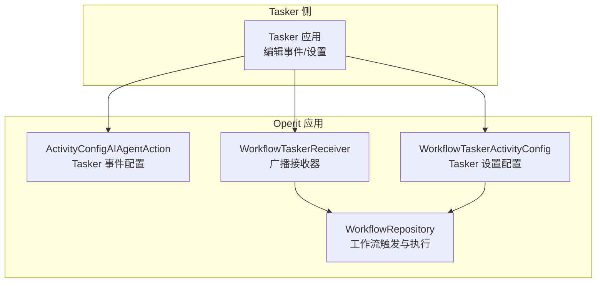
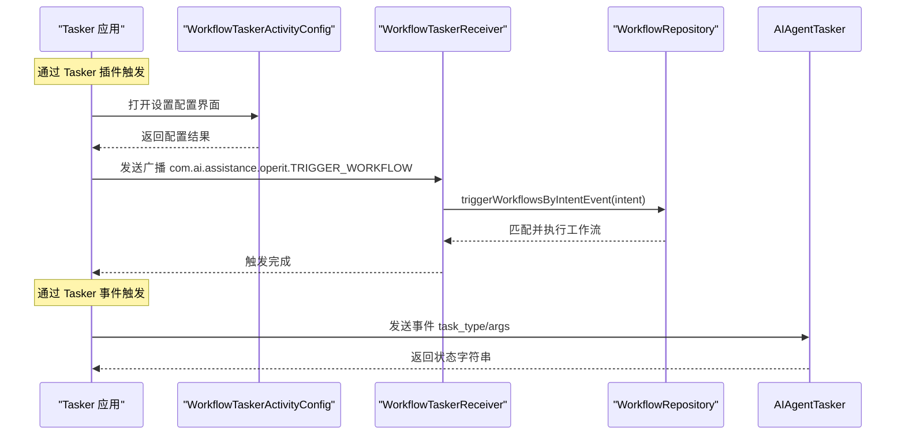
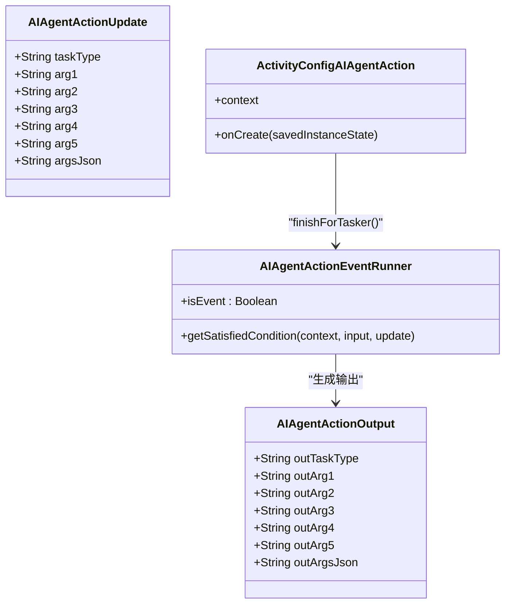
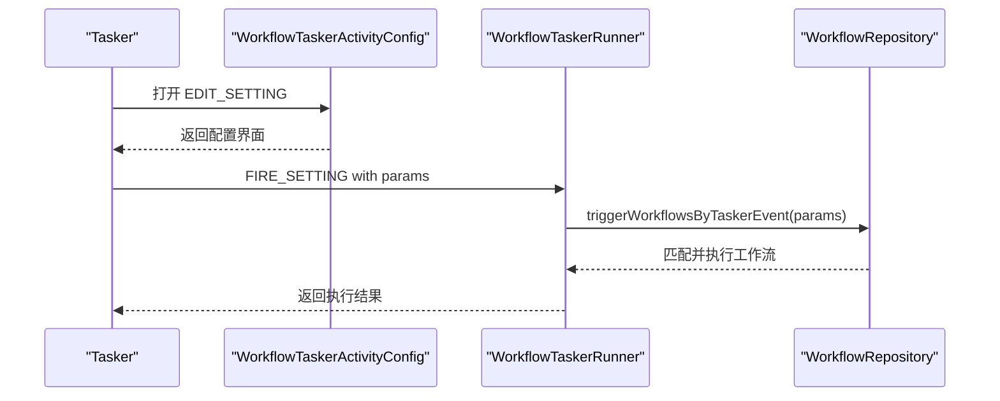
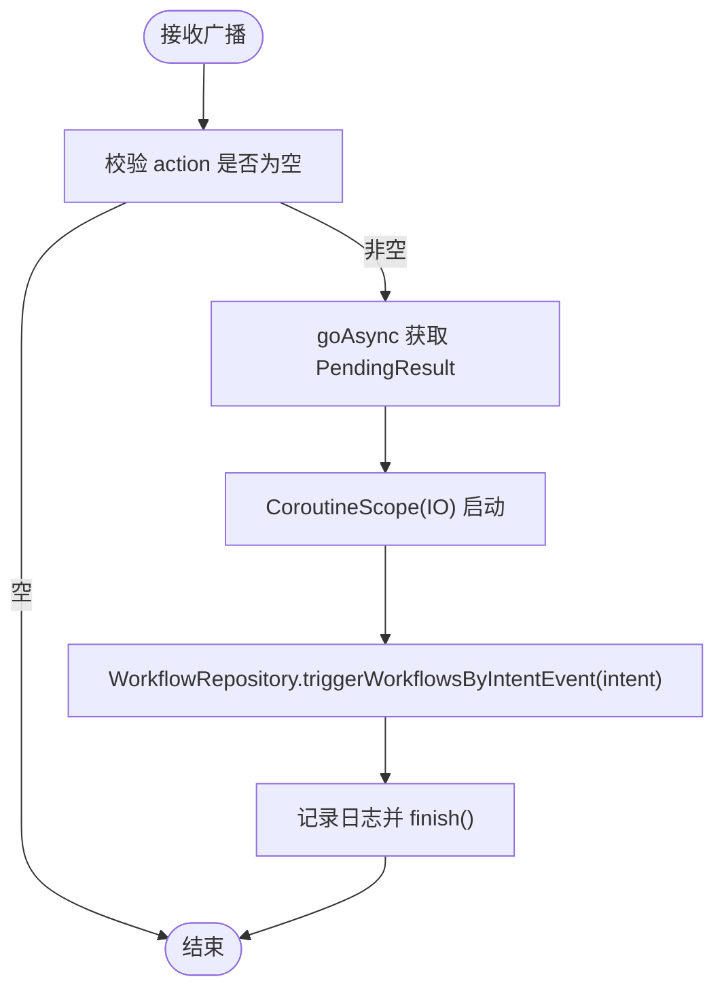
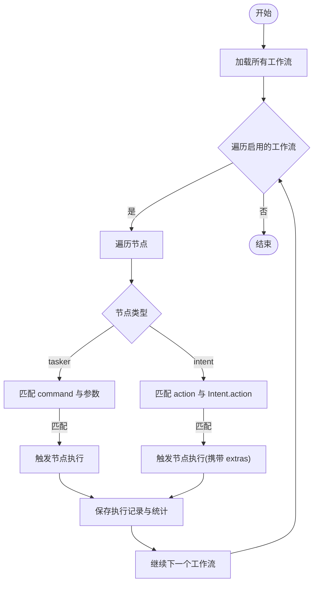
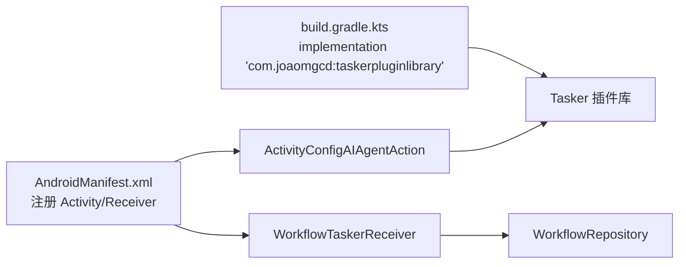

# Tasker 集成

<cite>
**本文引用的文件**
- [AndroidManifest.xml](file://app/src/main/AndroidManifest.xml)
- [AIAgentTasker.kt](file://app/src/main/java/com/ai/assistance/operit/integrations/tasker/AIAgentTasker.kt)
- [WorkflowTaskerActivity.kt](file://app/src/main/java/com/ai/assistance/operit/integrations/tasker/WorkflowTaskerActivity.kt)
- [WorkflowTaskerReceiver.kt](file://app/src/main/java/com/ai/assistance/operit/integrations/tasker/WorkflowTaskerReceiver.kt)
- [WorkflowRepository.kt](file://app/src/main/java/com/ai/assistance/operit/data/repository/WorkflowRepository.kt)
- [tasker.d.ts](file://examples/types/tasker.d.ts)
- [tasker.ts](file://examples/tasker.ts)
- [tasker.js](file://examples/tasker.js)
- [workflow.ts](file://examples/workflow.ts)
- [tasker.md](file://docs/package_dev/tasker.md)
- [build.gradle.kts](file://app/build.gradle.kts)
</cite>

## 目录
1. [简介](#简介)
2. [项目结构](#项目结构)
3. [核心组件](#核心组件)
4. [架构总览](#架构总览)
5. [详细组件分析](#详细组件分析)
6. [依赖关系分析](#依赖关系分析)
7. [性能考量](#性能考量)
8. [故障排查指南](#故障排查指南)
9. [结论](#结论)
10. [附录](#附录)

## 简介
本文件系统性阐述 Operit 的 Tasker 集成能力，覆盖事件触发机制、自动化工作流触发、类与组件职责、数据流转与错误处理，并提供面向自动化开发者的最佳实践与示例路径。读者将了解如何通过 Tasker 侧事件或 Intent 广播驱动 Operit 内部工作流执行，以及如何在 Operit 中主动向 Tasker 发送事件。

## 项目结构
Tasker 集成涉及以下关键模块：
- AndroidManifest 声明 Tasker 插件配置 Activity 与工作流触发的广播接收器
- Tasker 插件库适配层：AIAgentTasker 提供 Tasker 事件输入模型与输出变量
- 工作流触发入口：WorkflowTaskerActivity 与 WorkflowTaskerReceiver 分别处理 Tasker 插件调用与广播触发
- 工作流引擎：WorkflowRepository 负责解析触发条件并执行工作流

图表来源
- [AndroidManifest.xml:311-319](file://app/src/main/AndroidManifest.xml#L311-L319)
- [AndroidManifest.xml:458-478](file://app/src/main/AndroidManifest.xml#L458-L478)
- [AIAgentTasker.kt:100-121](file://app/src/main/java/com/ai/assistance/operit/integrations/tasker/AIAgentTasker.kt#L100-L121)
- [WorkflowTaskerActivity.kt:22-41](file://app/src/main/java/com/ai/assistance/operit/integrations/tasker/WorkflowTaskerActivity.kt#L22-L41)
- [WorkflowTaskerReceiver.kt:18-60](file://app/src/main/java/com/ai/assistance/operit/integrations/tasker/WorkflowTaskerReceiver.kt#L18-L60)
- [WorkflowRepository.kt:576-649](file://app/src/main/java/com/ai/assistance/operit/data/repository/WorkflowRepository.kt#L576-L649)

章节来源
- [AndroidManifest.xml:311-319](file://app/src/main/AndroidManifest.xml#L311-L319)
- [AndroidManifest.xml:458-478](file://app/src/main/AndroidManifest.xml#L458-L478)

## 核心组件
- AIAgentTasker：定义 Tasker 事件输入参数（task_type、arg1~arg5、args_json），并提供触发入口，使 Operit 能够作为 Tasker 事件源。
- WorkflowTaskerActivity：Tasker 插件配置界面，用于将 Operit 注册为 Tasker 的设置项，允许用户在 Tasker 中直接触发 Operit 的工作流。
- WorkflowTaskerReceiver：接收来自 Tasker 或其他组件的广播，解析 Intent 并调用工作流引擎进行匹配与执行。
- WorkflowRepository：工作流存储与执行核心，负责按触发条件（tasker/intent/schedule 等）匹配并执行工作流，记录执行日志与统计。

章节来源
- [AIAgentTasker.kt:19-121](file://app/src/main/java/com/ai/assistance/operit/integrations/tasker/AIAgentTasker.kt#L19-L121)
- [WorkflowTaskerActivity.kt:22-95](file://app/src/main/java/com/ai/assistance/operit/integrations/tasker/WorkflowTaskerActivity.kt#L22-L95)
- [WorkflowTaskerReceiver.kt:18-103](file://app/src/main/java/com/ai/assistance/operit/integrations/tasker/WorkflowTaskerReceiver.kt#L18-L103)
- [WorkflowRepository.kt:576-740](file://app/src/main/java/com/ai/assistance/operit/data/repository/WorkflowRepository.kt#L576-L740)

## 架构总览
Operit 的 Tasker 集成采用“插件配置 + 广播触发 + 工作流引擎”的分层设计：
- Tasker 侧通过编辑事件或设置项发起触发
- Operit 侧分别通过 Tasker 插件配置 Activity 与广播接收器接入
- WorkflowRepository 统一解析触发条件并执行工作流

图表来源
- [AndroidManifest.xml:458-478](file://app/src/main/AndroidManifest.xml#L458-L478)
- [WorkflowTaskerActivity.kt:22-41](file://app/src/main/java/com/ai/assistance/operit/integrations/tasker/WorkflowTaskerActivity.kt#L22-L41)
- [WorkflowTaskerReceiver.kt:36-59](file://app/src/main/java/com/ai/assistance/operit/integrations/tasker/WorkflowTaskerReceiver.kt#L36-L59)
- [WorkflowRepository.kt:614-649](file://app/src/main/java/com/ai/assistance/operit/data/repository/WorkflowRepository.kt#L614-L649)

## 详细组件分析

### AIAgentTasker：Tasker 事件触发与参数映射
- 输入模型：通过注解定义 task_type、arg1~arg5、args_json 字段，便于 Tasker 插件库序列化与回传。
- 输出模型：将输入参数映射为输出变量，供 Tasker 侧读取。
- 事件运行器：标记为事件类型，满足 Tasker 条件/事件运行框架。
- 配置 Activity：通过 TaskerPluginConfigNoInput 完成与 Tasker 的交互，最终调用 requestQuery 触发事件。

图表来源
- [AIAgentTasker.kt:19-121](file://app/src/main/java/com/ai/assistance/operit/integrations/tasker/AIAgentTasker.kt#L19-L121)

章节来源
- [AIAgentTasker.kt:19-121](file://app/src/main/java/com/ai/assistance/operit/integrations/tasker/AIAgentTasker.kt#L19-L121)

### WorkflowTaskerActivity：Tasker 插件配置与执行入口
- 配置 Activity：实现 TaskerPluginConfig 接口，提供输入与输出类，交由 TaskerPluginConfigHelper 管理。
- Runner：从 Tasker 输入中读取参数，调用 WorkflowRepository 执行工作流触发逻辑。
- 协程与异常：使用 runBlocking 同步等待异步执行结果，并捕获异常返回 Tasker 错误。

图表来源
- [WorkflowTaskerActivity.kt:22-95](file://app/src/main/java/com/ai/assistance/operit/integrations/tasker/WorkflowTaskerActivity.kt#L22-L95)
- [WorkflowRepository.kt:582-607](file://app/src/main/java/com/ai/assistance/operit/data/repository/WorkflowRepository.kt#L582-L607)

章节来源
- [WorkflowTaskerActivity.kt:22-95](file://app/src/main/java/com/ai/assistance/operit/integrations/tasker/WorkflowTaskerActivity.kt#L22-L95)

### WorkflowTaskerReceiver：广播接收与异步处理
- 广播动作：监听 com.ai.assistance.operit.TRIGGER_WORKFLOW 与 com.twofortyfouram.locale.intent.action.FIRE_SETTING。
- 异步处理：使用 goAsync 与 IO 协程，避免阻塞主线程。
- 触发策略：委托 WorkflowRepository 根据 Intent 的 action 与 extras 匹配工作流并执行。

图表来源
- [WorkflowTaskerReceiver.kt:36-59](file://app/src/main/java/com/ai/assistance/operit/integrations/tasker/WorkflowTaskerReceiver.kt#L36-L59)
- [WorkflowRepository.kt:614-649](file://app/src/main/java/com/ai/assistance/operit/data/repository/WorkflowRepository.kt#L614-L649)

章节来源
- [WorkflowTaskerReceiver.kt:18-103](file://app/src/main/java/com/ai/assistance/operit/integrations/tasker/WorkflowTaskerReceiver.kt#L18-L103)

### WorkflowRepository：工作流触发与执行
- Tasker 触发匹配：遍历所有启用的工作流，查找 triggerType 为 tasker 的触发节点，若其配置中的 command 与任一参数相等（忽略大小写）则触发对应节点。
- Intent 触发匹配：遍历所有启用的工作流，查找 triggerType 为 intent 的触发节点，若其配置中的 action 与 Intent.action 相等（忽略大小写）则触发对应节点。
- 执行与日志：调用 WorkflowExecutor 执行工作流，保存执行记录与统计信息，维护运行中工作流集合。

图表来源
- [WorkflowRepository.kt:582-649](file://app/src/main/java/com/ai/assistance/operit/data/repository/WorkflowRepository.kt#L582-L649)

章节来源
- [WorkflowRepository.kt:576-740](file://app/src/main/java/com/ai/assistance/operit/data/repository/WorkflowRepository.kt#L576-L740)

## 依赖关系分析
- Tasker 插件库：通过 build.gradle.kts 引入 taskerpluginlibrary，为 Tasker 事件与设置项提供运行时支持。
- 组件注册：AndroidManifest 中声明 Activity 与 Receiver，确保 Tasker 可发现并调用。

图表来源
- [build.gradle.kts:342-342](file://app/build.gradle.kts#L342-L342)
- [AndroidManifest.xml:311-319](file://app/src/main/AndroidManifest.xml#L311-L319)
- [AndroidManifest.xml:458-478](file://app/src/main/AndroidManifest.xml#L458-L478)

章节来源
- [build.gradle.kts:342-342](file://app/build.gradle.kts#L342-L342)
- [AndroidManifest.xml:311-319](file://app/src/main/AndroidManifest.xml#L311-L319)
- [AndroidManifest.xml:458-478](file://app/src/main/AndroidManifest.xml#L458-L478)

## 性能考量
- 异步与并发：Receiver 使用 goAsync + IO 协程，避免阻塞主线程；工作流执行在独立协程中进行，防止卡顿。
- 缓存与去重：语音触发使用 TTL 缓存与冷却时间，减少重复触发。
- 日志轮转：执行日志按数量上限轮转删除，控制磁盘占用。
- 调度一致性：更新工作流后及时同步 WorkManager 调度，避免状态不一致。

## 故障排查指南
- 无法触发工作流
  - 检查工作流是否启用且存在匹配的触发节点（tasker/intent/schedule）。
  - 确认 Tasker 参数或 Intent action 与配置一致（忽略大小写）。
- 触发无响应
  - 查看 Receiver 日志与 WorkflowRepository 执行日志，确认是否进入匹配分支。
  - 使用 adb 广播验证：参考 workflow.ts 中的示例命令。
- 异常返回
  - Tasker 插件 Runner 捕获异常并返回错误，可在 Tasker 日志中查看。
- 广播未到达
  - 确认 AndroidManifest 中已正确注册 Receiver 动作与导出属性。

章节来源
- [WorkflowTaskerReceiver.kt:36-59](file://app/src/main/java/com/ai/assistance/operit/integrations/tasker/WorkflowTaskerReceiver.kt#L36-L59)
- [WorkflowTaskerActivity.kt:82-92](file://app/src/main/java/com/ai/assistance/operit/integrations/tasker/WorkflowTaskerActivity.kt#L82-L92)
- [workflow.ts:767-775](file://examples/workflow.ts#L767-L775)

## 结论
Operit 的 Tasker 集成通过 Tasker 插件库与广播机制实现了双向联动：既可由 Tasker 触发 Operit 工作流，也可由 Operit 主动向 Tasker 发送事件。整体架构清晰、扩展性强，配合工作流引擎的多触发类型与执行监控，能够满足复杂的自动化场景需求。

## 附录

### Tasker 事件触发 API（Operit → Tasker）
- 类型定义与运行时入口：见 tasker.d.ts 与 examples/tasker.ts/js。
- 使用建议：优先使用 arg1~arg5 传递简单参数，复杂数据统一放入 args_json；确保 task_type 与 Tasker 侧事件名一致。

章节来源
- [tasker.d.ts:11-81](file://examples/types/tasker.d.ts#L11-L81)
- [tasker.ts:36-42](file://examples/tasker.ts#L36-L42)
- [tasker.js:36-42](file://examples/tasker.js#L36-L42)
- [tasker.md:24-77](file://docs/package_dev/tasker.md#L24-L77)

### 工作流触发配置要点（Tasker → Operit）
- Tasker 触发：在 Operit 的工作流中设置 triggerType 为 tasker，配置 command 为期望匹配的参数值。
- Intent 触发：在 Operit 的工作流中设置 triggerType 为 intent，配置 action 为期望匹配的 Intent action。
- 参考示例：workflow.ts 中对触发配置与工作流创建的说明。

章节来源
- [workflow.ts:70-155](file://examples/workflow.ts#L70-L155)
- [WorkflowRepository.kt:582-649](file://app/src/main/java/com/ai/assistance/operit/data/repository/WorkflowRepository.kt#L582-L649)