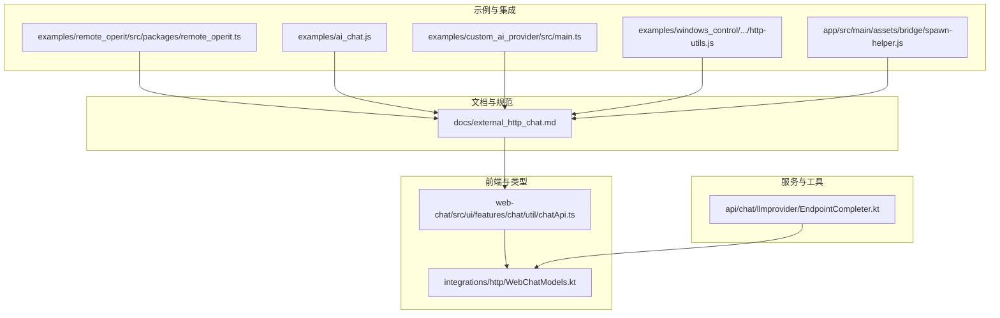
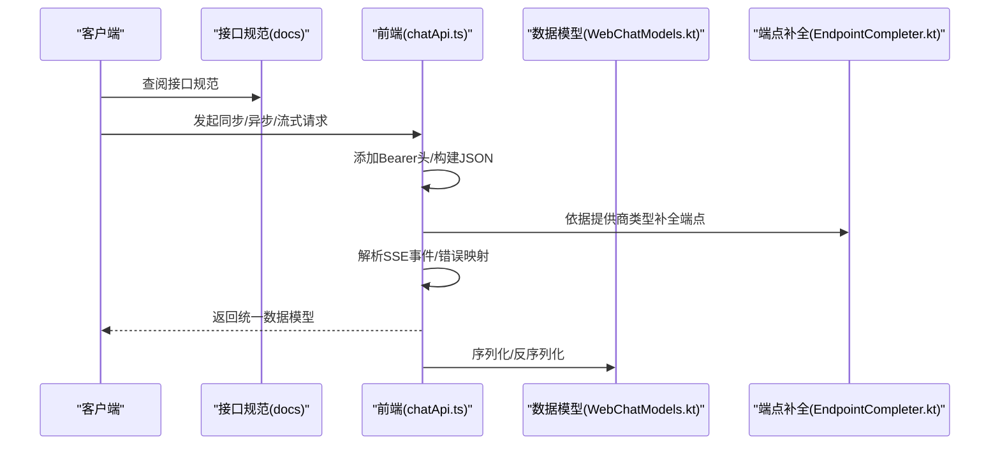
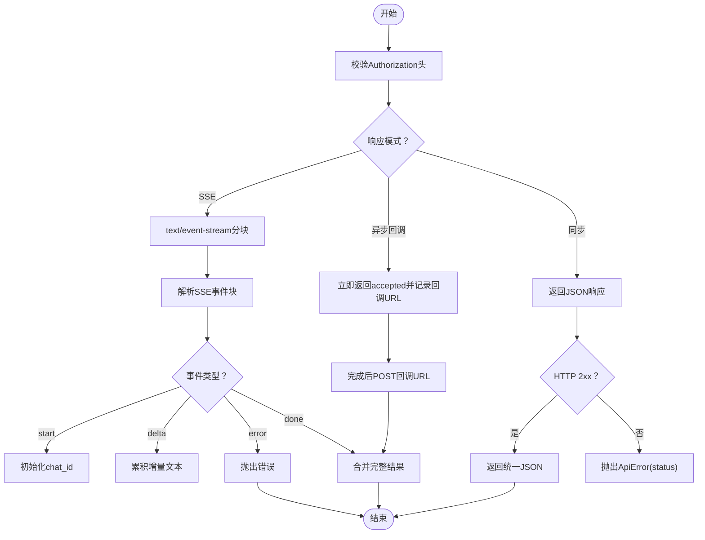
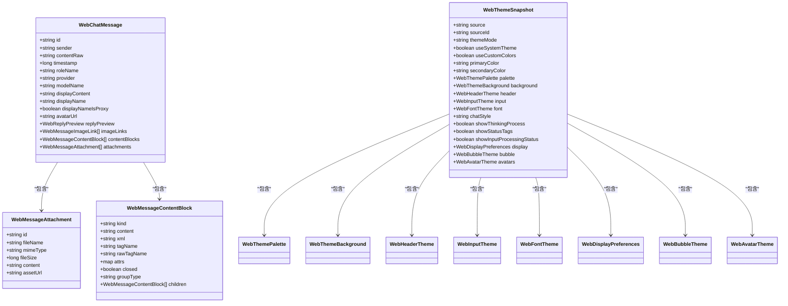
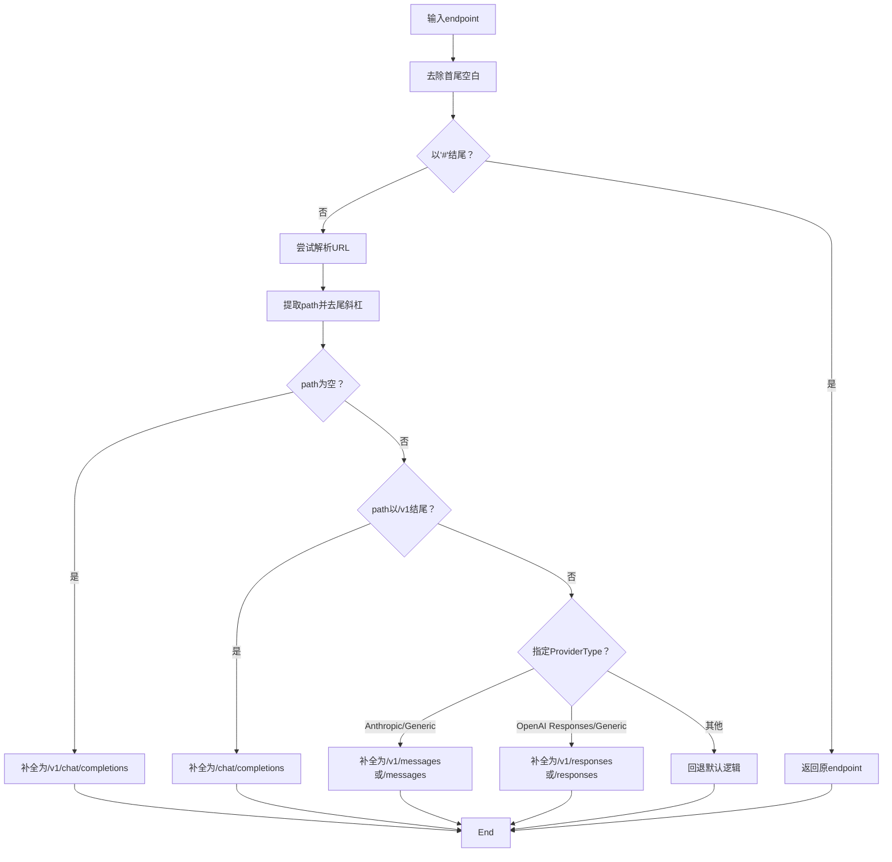
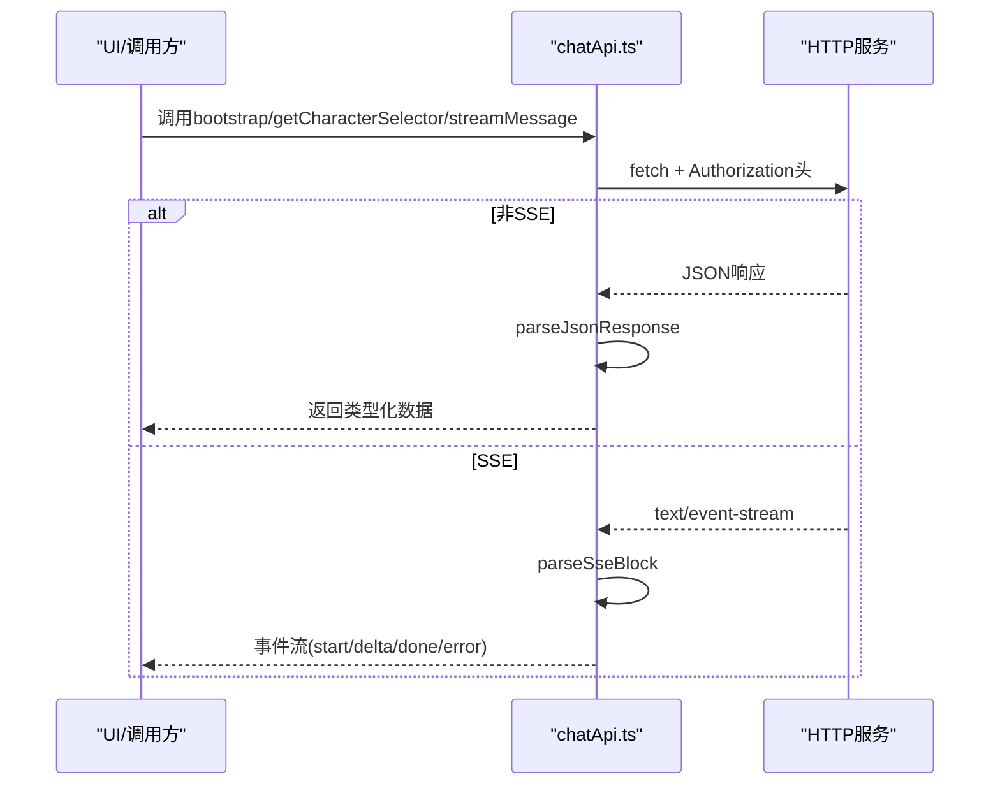
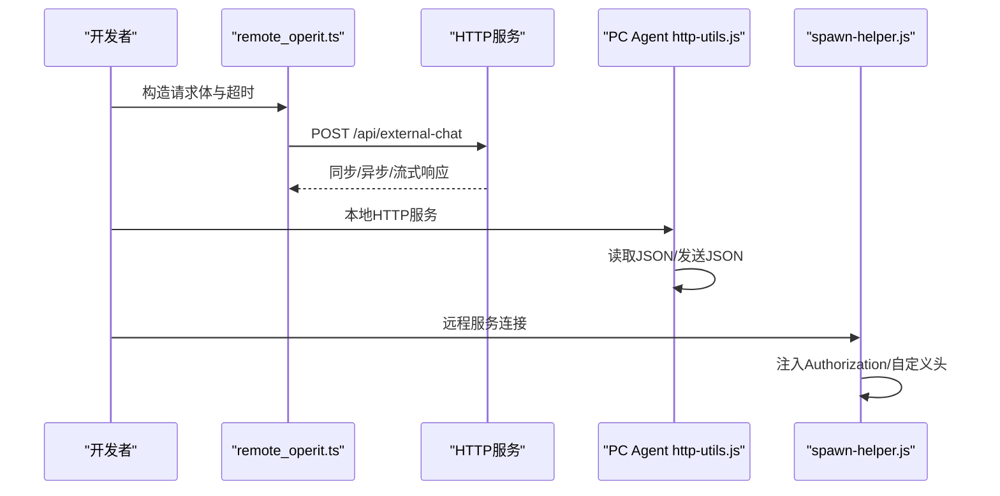
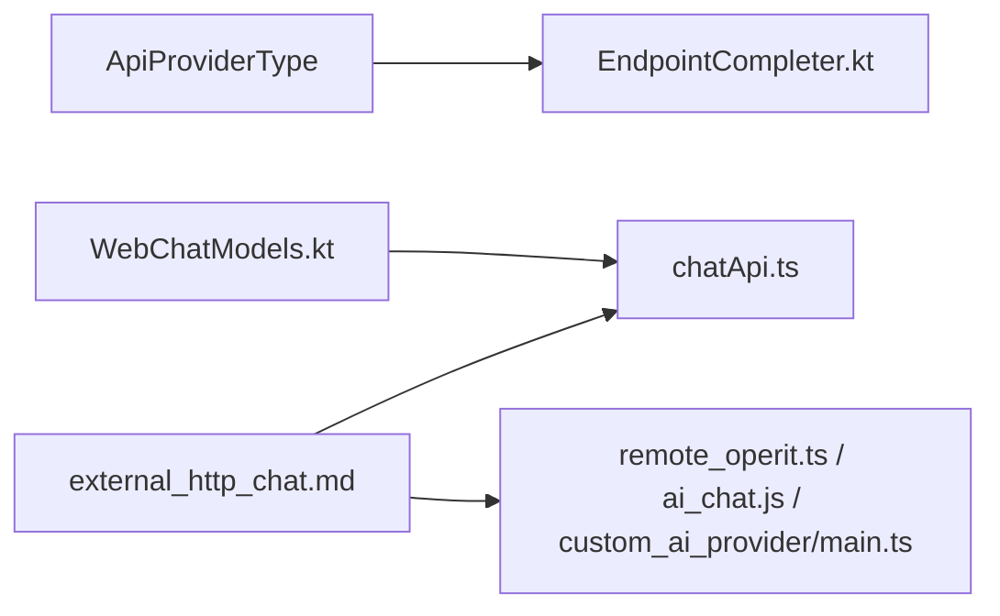

# 外部 API 集成

<cite>
**本文引用的文件**
- [external_http_chat.md](file://docs/external_http_chat.md)
- [WebChatModels.kt](file://app/src/main/java/com/ai/assistance/operit/integrations/http/WebChatModels.kt)
- [EndpointCompleter.kt](file://app/src/main/java/com/ai/assistance/operit/api/chat/llmprovider/EndpointCompleter.kt)
- [EndpointCompleterTest.kt](file://app/src/test/java/com/ai/assistance/operit/api/chat/llmprovider/EndpointCompleterTest.kt)
- [EndpointCompleterAnthropicPathTest.kt](file://app/src/test/java/com/ai/assistance/operit/api/chat/llmprovider/EndpointCompleterAnthropicPathTest.kt)
- [EndpointCompleterOpenAiStyleTest.kt](file://app/src/test/java/com/ai/assistance/operit/api/chat/llmprovider/EndpointCompleterOpenAiStyleTest.kt)
- [chatApi.ts](file://web-chat/src/ui/features/chat/util/chatApi.ts)
- [remote_operit.ts](file://examples/remote_operit/src/packages/remote_operit.ts)
- [ai_chat.js](file://examples/ai_chat.js)
- [custom_ai_provider/main.ts](file://examples/custom_ai_provider/src/main.ts)
- [http-utils.js](file://examples/windows_control/resources/pc_agent/operit-pc-agent/src/lib/http-utils.js)
- [spawn-helper.js](file://app/src/main/assets/bridge/spawn-helper.js)
</cite>

## 目录
1. [简介](#简介)
2. [项目结构](#项目结构)
3. [核心组件](#核心组件)
4. [架构总览](#架构总览)
5. [详细组件分析](#详细组件分析)
6. [依赖关系分析](#依赖关系分析)
7. [性能考量](#性能考量)
8. [故障排查指南](#故障排查指南)
9. [结论](#结论)
10. [附录](#附录)

## 简介
本文件面向 API 开发者，系统性阐述 Operit 的外部 API 集成能力，重点覆盖：
- 局域网 HTTP 桥接机制：请求转发、响应转换、错误映射与 SSE 流式输出
- WebChatModels 数据模型设计：消息格式、参数校验、序列化与反序列化
- EndpointCompleter 端点完成机制：URL 构建、参数注入与格式化规则
- 实战示例：如何对接第三方服务、如何处理 API 变更、如何实现兼容性适配
- API 设计最佳实践：版本管理、速率限制、缓存策略

## 项目结构
Operit 的外部 API 集成涉及多层协作：
- 文档层：提供 HTTP 接口规范与行为说明
- 前端层：WebChatModels 类型定义与前端 HTTP 客户端封装
- 服务层：EndpointCompleter 提供端点补全与路由适配
- 示例层：远程调用、自定义 AI 供应商、PC Agent 等示例脚本

**图表来源**
- [external_http_chat.md:1-230](file://docs/external_http_chat.md#L1-L230)
- [chatApi.ts:1-383](file://web-chat/src/ui/features/chat/util/chatApi.ts#L1-L383)
- [WebChatModels.kt:1-723](file://app/src/main/java/com/ai/assistance/operit/integrations/http/WebChatModels.kt#L1-L723)
- [EndpointCompleter.kt:1-126](file://app/src/main/java/com/ai/assistance/operit/api/chat/llmprovider/EndpointCompleter.kt#L1-L126)
- [remote_operit.ts:402-612](file://examples/remote_operit/src/packages/remote_operit.ts#L402-L612)
- [ai_chat.js:136-169](file://examples/ai_chat.js#L136-L169)
- [custom_ai_provider/main.ts:61-106](file://examples/custom_ai_provider/src/main.ts#L61-L106)
- [http-utils.js:1-62](file://examples/windows_control/resources/pc_agent/operit-pc-agent/src/lib/http-utils.js#L1-L62)
- [spawn-helper.js:98-124](file://app/src/main/assets/bridge/spawn-helper.js#L98-L124)

**章节来源**
- [external_http_chat.md:1-230](file://docs/external_http_chat.md#L1-L230)
- [chatApi.ts:1-383](file://web-chat/src/ui/features/chat/util/chatApi.ts#L1-L383)
- [WebChatModels.kt:1-723](file://app/src/main/java/com/ai/assistance/operit/integrations/http/WebChatModels.kt#L1-L723)
- [EndpointCompleter.kt:1-126](file://app/src/main/java/com/ai/assistance/operit/api/chat/llmprovider/EndpointCompleter.kt#L1-L126)

## 核心组件
- 外部 HTTP 接口规范：定义鉴权、端点、同步/异步/流式三种响应模式
- WebChatModels 数据模型：统一前后端消息、附件、主题、选择器等结构
- EndpointCompleter：根据提供商类型与 URL 特征自动补全端点路径
- 前端 HTTP 客户端：封装 Bearer 鉴权、JSON 解析、SSE 流式事件解析
- 示例集成：远程调用、自定义供应商、PC Agent 与桥接工具

**章节来源**
- [external_http_chat.md:21-229](file://docs/external_http_chat.md#L21-L229)
- [WebChatModels.kt:1-723](file://app/src/main/java/com/ai/assistance/operit/integrations/http/WebChatModels.kt#L1-L723)
- [EndpointCompleter.kt:1-126](file://app/src/main/java/com/ai/assistance/operit/api/chat/llmprovider/EndpointCompleter.kt#L1-L126)
- [chatApi.ts:34-98](file://web-chat/src/ui/features/chat/util/chatApi.ts#L34-L98)

## 架构总览
Operit 的外部 API 集成采用“文档驱动 + 类型安全 + 自动补全 + 流式输出”的架构：
- 文档层提供 HTTP 接口契约（鉴权、端点、模式）
- 前端通过 chatApi.ts 统一封装请求与 SSE 解析
- 服务端通过 EndpointCompleter 对不同提供商进行端点补全
- WebChatModels 提供统一的数据模型，确保序列化一致性

**图表来源**
- [external_http_chat.md:31-229](file://docs/external_http_chat.md#L31-L229)
- [chatApi.ts:34-98](file://web-chat/src/ui/features/chat/util/chatApi.ts#L34-L98)
- [WebChatModels.kt:1-723](file://app/src/main/java/com/ai/assistance/operit/integrations/http/WebChatModels.kt#L1-L723)
- [EndpointCompleter.kt:76-124](file://app/src/main/java/com/ai/assistance/operit/api/chat/llmprovider/EndpointCompleter.kt#L76-L124)

## 详细组件分析

### HTTP 桥接机制与错误映射
- 鉴权：除 OPTIONS 外均需携带 Bearer Token
- 同步调用：返回统一 JSON，包含 request_id、success、chat_id、ai_response 等
- SSE 流式：事件类型包括 start/delta/done/error，前端逐块解析
- 异步回调：response_mode=async_callback 时立即返回 accepted，完成后回调业务方
- 错误映射：非 2xx 或 payload.error 字段映射为 ApiError，包含 status 与 message

**图表来源**
- [external_http_chat.md:21-229](file://docs/external_http_chat.md#L21-L229)
- [chatApi.ts:34-98](file://web-chat/src/ui/features/chat/util/chatApi.ts#L34-L98)

**章节来源**
- [external_http_chat.md:21-229](file://docs/external_http_chat.md#L21-L229)
- [chatApi.ts:34-98](file://web-chat/src/ui/features/chat/util/chatApi.ts#L34-L98)

### WebChatModels 数据模型设计
- 消息与附件：WebChatMessage、WebMessageAttachment、WebMessageContentBlock
- 主题与显示：WebThemeSnapshot、WebBubbleTheme、WebAvatarTheme 等
- 选择器与配置：WebModelSelectorState、WebCharacterSelectorResponse、WebInputSettingsState
- 请求与响应：WebSendMessageRequest、WebSelectModelRequest、WebActionResponse、WebErrorResponse
- 参数验证与序列化：基于 Kotlinx Serialization 的 @Serializable/@SerialName，确保跨端字段对齐

**图表来源**
- [WebChatModels.kt:84-172](file://app/src/main/java/com/ai/assistance/operit/integrations/http/WebChatModels.kt#L84-L172)
- [WebChatModels.kt:190-230](file://app/src/main/java/com/ai/assistance/operit/integrations/http/WebChatModels.kt#L190-L230)
- [WebChatModels.kt:232-374](file://app/src/main/java/com/ai/assistance/operit/integrations/http/WebChatModels.kt#L232-L374)

**章节来源**
- [WebChatModels.kt:1-723](file://app/src/main/java/com/ai/assistance/operit/integrations/http/WebChatModels.kt#L1-L723)

### EndpointCompleter 端点完成机制
- 默认逻辑：基础 URL 补全 /v1/chat/completions；/v1 结尾补全 /chat/completions
- Provider 特定逻辑：Anthropic 补全 /v1/messages；OpenAI Responses 补全 /v1/responses
- 控制开关：URL 末尾加 # 可禁用自动补全
- 空间与边界：支持自定义端口、查询参数、尾斜杠处理

**图表来源**
- [EndpointCompleter.kt:20-124](file://app/src/main/java/com/ai/assistance/operit/api/chat/llmprovider/EndpointCompleter.kt#L20-L124)

**章节来源**
- [EndpointCompleter.kt:1-126](file://app/src/main/java/com/ai/assistance/operit/api/chat/llmprovider/EndpointCompleter.kt#L1-L126)
- [EndpointCompleterTest.kt:1-165](file://app/src/test/java/com/ai/assistance/operit/api/chat/llmprovider/EndpointCompleterTest.kt#L1-L165)
- [EndpointCompleterAnthropicPathTest.kt:1-21](file://app/src/test/java/com/ai/assistance/operit/api/chat/llmprovider/EndpointCompleterAnthropicPathTest.kt#L1-L21)
- [EndpointCompleterOpenAiStyleTest.kt:1-27](file://app/src/test/java/com/ai/assistance/operit/api/chat/llmprovider/EndpointCompleterOpenAiStyleTest.kt#L1-L27)

### 前端 HTTP 客户端与 SSE 解析
- 鉴权头：统一添加 Authorization: Bearer token
- JSON 解析：根据 Content-Type 判断是否为 JSON，非 2xx 抛出 ApiError
- SSE：按 event/data 行解析，组装 WebChatStreamEvent
- 上传：FormData 支持文件上传

**图表来源**
- [chatApi.ts:34-98](file://web-chat/src/ui/features/chat/util/chatApi.ts#L34-L98)

**章节来源**
- [chatApi.ts:34-98](file://web-chat/src/ui/features/chat/util/chatApi.ts#L34-L98)

### 示例集成与兼容性适配
- 远程调用：remote_operit 通过 Bearer Token 调用 /api/external-chat，支持同步与异步两种模式
- 自定义 AI 供应商：示例中通过构建 Headers（含 Authorization）与 OkHttp 客户端发起请求
- PC Agent：HTTP 工具函数负责读取 JSON Body、发送 JSON 响应与错误处理
- 桥接工具：spawn-helper.js 支持远程服务连接，自动注入 Bearer Token 与自定义头

**图表来源**
- [remote_operit.ts:402-612](file://examples/remote_operit/src/packages/remote_operit.ts#L402-L612)
- [custom_ai_provider/main.ts:61-106](file://examples/custom_ai_provider/src/main.ts#L61-L106)
- [http-utils.js:1-62](file://examples/windows_control/resources/pc_agent/operit-pc-agent/src/lib/http-utils.js#L1-L62)
- [spawn-helper.js:98-124](file://app/src/main/assets/bridge/spawn-helper.js#L98-L124)

**章节来源**
- [remote_operit.ts:402-612](file://examples/remote_operit/src/packages/remote_operit.ts#L402-L612)
- [ai_chat.js:136-169](file://examples/ai_chat.js#L136-L169)
- [custom_ai_provider/main.ts:61-106](file://examples/custom_ai_provider/src/main.ts#L61-L106)
- [http-utils.js:1-62](file://examples/windows_control/resources/pc_agent/operit-pc-agent/src/lib/http-utils.js#L1-L62)
- [spawn-helper.js:98-124](file://app/src/main/assets/bridge/spawn-helper.js#L98-L124)

## 依赖关系分析
- EndpointCompleter 依赖 Provider 类型枚举（ApiProviderType），用于分支补全策略
- 前端 chatApi.ts 依赖 WebChatModels 类型定义，保证请求/响应结构一致
- 示例脚本依赖文档规范，确保与服务端契约一致

**图表来源**
- [EndpointCompleter.kt:3-4](file://app/src/main/java/com/ai/assistance/operit/api/chat/llmprovider/EndpointCompleter.kt#L3-L4)
- [WebChatModels.kt:1-723](file://app/src/main/java/com/ai/assistance/operit/integrations/http/WebChatModels.kt#L1-L723)
- [chatApi.ts:1-16](file://web-chat/src/ui/features/chat/util/chatApi.ts#L1-L16)
- [external_http_chat.md:1-230](file://docs/external_http_chat.md#L1-L230)
- [remote_operit.ts:402-612](file://examples/remote_operit/src/packages/remote_operit.ts#L402-L612)
- [ai_chat.js:136-169](file://examples/ai_chat.js#L136-L169)
- [custom_ai_provider/main.ts:61-106](file://examples/custom_ai_provider/src/main.ts#L61-L106)

**章节来源**
- [EndpointCompleter.kt:1-126](file://app/src/main/java/com/ai/assistance/operit/api/chat/llmprovider/EndpointCompleter.kt#L1-L126)
- [WebChatModels.kt:1-723](file://app/src/main/java/com/ai/assistance/operit/integrations/http/WebChatModels.kt#L1-L723)
- [chatApi.ts:1-16](file://web-chat/src/ui/features/chat/util/chatApi.ts#L1-L16)
- [external_http_chat.md:1-230](file://docs/external_http_chat.md#L1-L230)

## 性能考量
- 流式输出：SSE 可降低首字延迟，适合长文本生成场景
- 压缩与缓存：服务端可设置 no-store 避免代理缓存；前端按需缓存静态资源
- 超时与重试：示例脚本提供超时控制；第三方服务可结合 Retry-After 头与指数退避
- 并发限制：示例中提供每分钟请求上限与并发数配置项，便于接入方限流

[本节为通用指导，无需特定文件来源]

## 故障排查指南
- 鉴权失败：确认 Authorization 头与 Bearer Token 是否正确
- 端点错误：检查 URL 是否以 # 禁用补全；确认 Provider 类型与路径匹配
- SSE 断连：关注连接关闭后服务端取消响应的行为
- 回调失败：v1 不做重试，非 2xx 仅记录日志
- JSON 解析：服务端/客户端均需处理空体与非法 JSON，避免崩溃

**章节来源**
- [external_http_chat.md:21-229](file://docs/external_http_chat.md#L21-L229)
- [chatApi.ts:41-56](file://web-chat/src/ui/features/chat/util/chatApi.ts#L41-L56)
- [http-utils.js:1-62](file://examples/windows_control/resources/pc_agent/operit-pc-agent/src/lib/http-utils.js#L1-L62)

## 结论
Operit 的外部 API 集成以文档规范为契约、以类型模型为保障、以端点补全为适配、以前后端一致的错误映射与流式输出为核心能力，能够稳定地对接多种第三方服务并在变更时保持兼容。开发者可参考本文档与示例脚本快速完成集成与扩展。

[本节为总结，无需特定文件来源]

## 附录
- 版本管理：建议在请求头或路径中携带版本信息，便于灰度与回滚
- 速率限制：结合服务端限流与客户端退避策略，提升稳定性
- 缓存策略：对只读数据与静态资源使用强缓存，对动态响应使用 no-store

[本节为通用指导，无需特定文件来源]