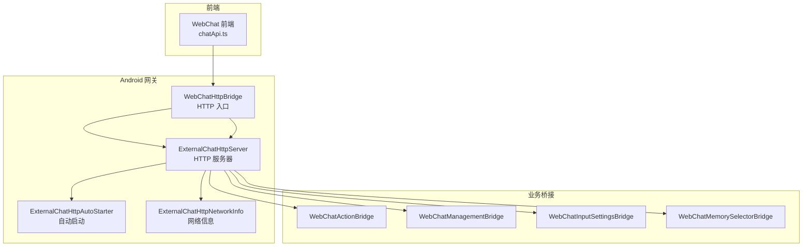
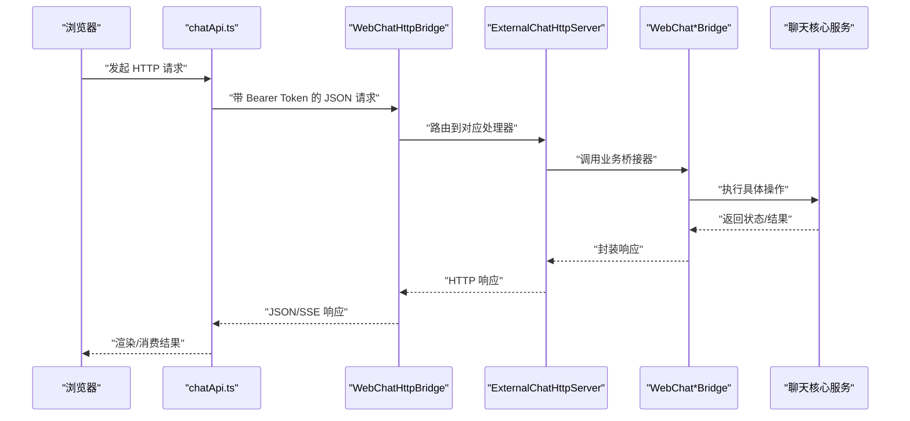
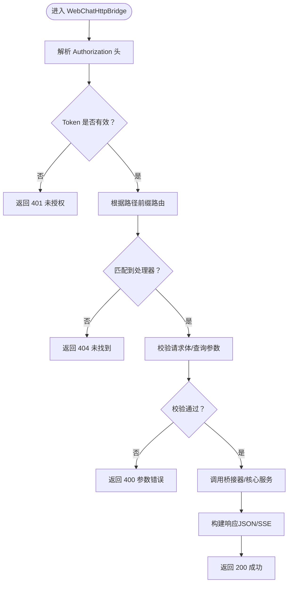
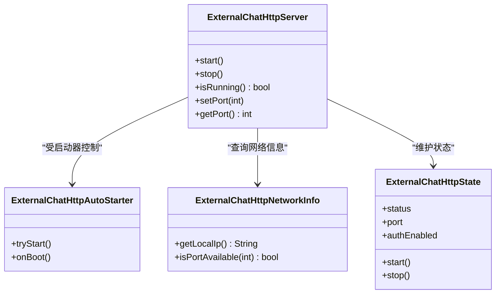
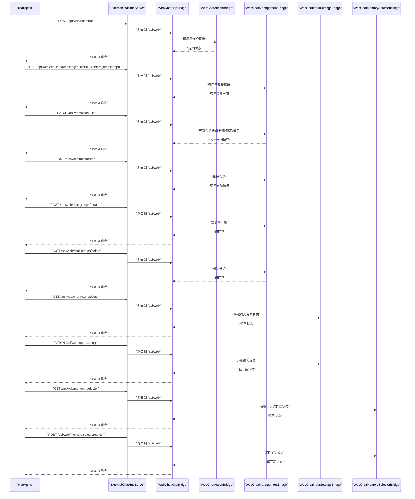
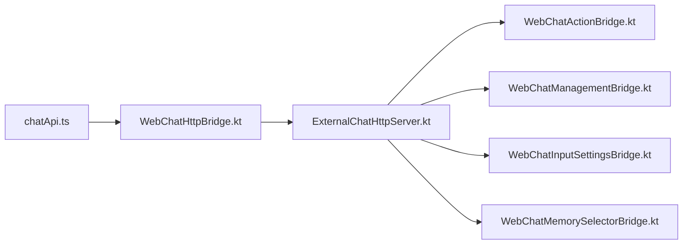

# 浏览器集成

<cite>
**本文引用的文件**
- [WebChatHttpBridge.kt](file://app/src/main/java/com/ai/assistance/operit/integrations/http/WebChatHttpBridge.kt)
- [ExternalChatHttpServer.kt](file://app/src/main/java/com/ai/assistance/operit/integrations/http/ExternalChatHttpServer.kt)
- [WebChatActionBridge.kt](file://app/src/main/java/com/ai/assistance/operit/integrations/http/bridge/WebChatActionBridge.kt)
- [WebChatManagementBridge.kt](file://app/src/main/java/com/ai/assistance/operit/integrations/http/bridge/WebChatManagementBridge.kt)
- [WebChatInputSettingsBridge.kt](file://app/src/main/java/com/ai/assistance/operit/integrations/http/bridge/WebChatInputSettingsBridge.kt)
- [WebChatMemorySelectorBridge.kt](file://app/src/main/java/com/ai/assistance/operit/integrations/http/bridge/WebChatMemorySelectorBridge.kt)
- [WebChatModels.kt](file://app/src/main/java/com/ai/assistance/operit/integrations/http/WebChatModels.kt)
- [ExternalChatHttpAutoStarter.kt](file://app/src/main/java/com/ai/assistance/operit/integrations/http/ExternalChatHttpAutoStarter.kt)
- [ExternalChatHttpNetworkInfo.kt](file://app/src/main/java/com/ai/assistance/operit/integrations/http/ExternalChatHttpNetworkInfo.kt)
- [ExternalChatHttpState.kt](file://app/src/main/java/com/ai/assistance/operit/integrations/http/ExternalChatHttpState.kt)
- [chatApi.ts](file://web-chat/src/ui/features/chat/util/chatApi.ts)
- [spawn-helper.js](file://app/src/main/assets/bridge/spawn-helper.js)
- [index.js](file://app/src/main/assets/bridge/index.js)
- [start-web-chat.sh](file://tools/start-web-chat.sh)
- [Web-Chat 快速连接指南.md](file://my_docs/Web-Chat 快速连接指南.md)
</cite>

## 目录
1. [简介](#简介)
2. [项目结构](#项目结构)
3. [核心组件](#核心组件)
4. [架构总览](#架构总览)
5. [详细组件分析](#详细组件分析)
6. [依赖关系分析](#依赖关系分析)
7. [性能考量](#性能考量)
8. [故障排查指南](#故障排查指南)
9. [结论](#结论)
10. [附录](#附录)

## 简介
本文件面向 Web 开发者，系统性阐述 Operit 的浏览器集成功能，重点覆盖以下方面：
- WebChatHttpBridge 的实现原理：HTTP 服务器启动、请求路由、响应处理与鉴权。
- ExternalChatHttpServer 的架构设计：端口管理、连接处理、并发控制与生命周期。
- 浏览器到应用的数据传输机制：JSON 请求格式、响应编码、SSE 流式输出与错误处理。
- 具体集成示例：通过 HTTP API 控制 Operit、网页自动化、跨域请求处理。
- 网络配置指南：防火墙设置、端口冲突解决、安全配置。

## 项目结构
浏览器集成涉及三层协作：
- 前端 Web 应用（web-chat）：通过 fetch 发起 HTTP 请求，解析 JSON/SSE 响应。
- Android 网关层（WebChatHttpBridge + ExternalChatHttpServer）：对外暴露 HTTP 接口，路由至业务桥接层。
- 业务桥接层（WebChat*Bridge）：对接聊天核心服务，执行具体操作并返回状态。

图表来源
- [WebChatHttpBridge.kt](file://app/src/main/java/com/ai/assistance/operit/integrations/http/WebChatHttpBridge.kt)
- [ExternalChatHttpServer.kt](file://app/src/main/java/com/ai/assistance/operit/integrations/http/ExternalChatHttpServer.kt)
- [WebChatActionBridge.kt](file://app/src/main/java/com/ai/assistance/operit/integrations/http/bridge/WebChatActionBridge.kt)
- [WebChatManagementBridge.kt](file://app/src/main/java/com/ai/assistance/operit/integrations/http/bridge/WebChatManagementBridge.kt)
- [WebChatInputSettingsBridge.kt](file://app/src/main/java/com/ai/assistance/operit/integrations/http/bridge/WebChatInputSettingsBridge.kt)
- [WebChatMemorySelectorBridge.kt](file://app/src/main/java/com/ai/assistance/operit/integrations/http/bridge/WebChatMemorySelectorBridge.kt)

章节来源
- [WebChatHttpBridge.kt](file://app/src/main/java/com/ai/assistance/operit/integrations/http/WebChatHttpBridge.kt)
- [ExternalChatHttpServer.kt](file://app/src/main/java/com/ai/assistance/operit/integrations/http/ExternalChatHttpServer.kt)
- [WebChatActionBridge.kt](file://app/src/main/java/com/ai/assistance/operit/integrations/http/bridge/WebChatActionBridge.kt)
- [WebChatManagementBridge.kt](file://app/src/main/java/com/ai/assistance/operit/integrations/http/bridge/WebChatManagementBridge.kt)
- [WebChatInputSettingsBridge.kt](file://app/src/main/java/com/ai/assistance/operit/integrations/http/bridge/WebChatInputSettingsBridge.kt)
- [WebChatMemorySelectorBridge.kt](file://app/src/main/java/com/ai/assistance/operit/integrations/http/bridge/WebChatMemorySelectorBridge.kt)

## 核心组件
- WebChatHttpBridge：作为 HTTP 入口，负责鉴权、路由与响应封装，将请求分派到相应桥接器或内置接口。
- ExternalChatHttpServer：承载 HTTP 服务器生命周期、端口管理、并发控制与网络可达性检测。
- WebChat*Bridge：将 HTTP 层请求映射为对聊天核心服务的操作，如更新记忆、重排会话、切换权限级别等。
- WebChatModels：定义请求/响应模型与枚举类型，统一前后端数据契约。
- chatApi.ts：前端侧的 API 封装，统一鉴权头、JSON 编解码、SSE 解析与查询参数构造。

章节来源
- [WebChatHttpBridge.kt](file://app/src/main/java/com/ai/assistance/operit/integrations/http/WebChatHttpBridge.kt)
- [ExternalChatHttpServer.kt](file://app/src/main/java/com/ai/assistance/operit/integrations/http/ExternalChatHttpServer.kt)
- [WebChatModels.kt](file://app/src/main/java/com/ai/assistance/operit/integrations/http/WebChatModels.kt)
- [chatApi.ts](file://web-chat/src/ui/features/chat/util/chatApi.ts)

## 架构总览
浏览器到应用的调用链路如下：

图表来源
- [chatApi.ts](file://web-chat/src/ui/features/chat/util/chatApi.ts)
- [WebChatHttpBridge.kt](file://app/src/main/java/com/ai/assistance/operit/integrations/http/WebChatHttpBridge.kt)
- [ExternalChatHttpServer.kt](file://app/src/main/java/com/ai/assistance/operit/integrations/http/ExternalChatHttpServer.kt)
- [WebChatActionBridge.kt](file://app/src/main/java/com/ai/assistance/operit/integrations/http/bridge/WebChatActionBridge.kt)
- [WebChatManagementBridge.kt](file://app/src/main/java/com/ai/assistance/operit/integrations/http/bridge/WebChatManagementBridge.kt)
- [WebChatInputSettingsBridge.kt](file://app/src/main/java/com/ai/assistance/operit/integrations/http/bridge/WebChatInputSettingsBridge.kt)
- [WebChatMemorySelectorBridge.kt](file://app/src/main/java/com/ai/assistance/operit/integrations/http/bridge/WebChatMemorySelectorBridge.kt)

## 详细组件分析

### WebChatHttpBridge 实现原理
- 鉴权与路由
  - 统一从 Authorization 头提取 Bearer Token，并进行校验。
  - 基于路径前缀将请求路由到不同处理器：/api/web/*、/api/external-chat 等。
- 请求处理
  - 对 JSON 请求体进行反序列化，按模型校验字段。
  - 对 SSE 场景，解析事件名称与数据块，支持流式推送。
- 响应封装
  - 成功时返回标准 JSON；失败时返回错误码与消息。
  - 对于长连接场景，采用流式响应并正确设置 Content-Type。

图表来源
- [WebChatHttpBridge.kt](file://app/src/main/java/com/ai/assistance/operit/integrations/http/WebChatHttpBridge.kt)

章节来源
- [WebChatHttpBridge.kt](file://app/src/main/java/com/ai/assistance/operit/integrations/http/WebChatHttpBridge.kt)

### ExternalChatHttpServer 架构设计
- 服务器生命周期
  - 自动启动：ExternalChatHttpAutoStarter 在满足条件时触发服务启动。
  - 状态管理：ExternalChatHttpState 提供运行状态、端口、鉴权开关等。
  - 网络信息：ExternalChatHttpNetworkInfo 提供本地 IP、端口可用性等。
- 端口管理与并发
  - 固定监听端口（如 8094），避免动态端口带来的复杂性。
  - 并发控制：基于线程池与请求队列限制同时处理的请求数量。
- 连接处理
  - 支持短连接与长连接（SSE）。
  - 超时与心跳策略，保证资源回收与稳定性。

图表来源
- [ExternalChatHttpServer.kt](file://app/src/main/java/com/ai/assistance/operit/integrations/http/ExternalChatHttpServer.kt)
- [ExternalChatHttpAutoStarter.kt](file://app/src/main/java/com/ai/assistance/operit/integrations/http/ExternalChatHttpAutoStarter.kt)
- [ExternalChatHttpNetworkInfo.kt](file://app/src/main/java/com/ai/assistance/operit/integrations/http/ExternalChatHttpNetworkInfo.kt)
- [ExternalChatHttpState.kt](file://app/src/main/java/com/ai/assistance/operit/integrations/http/ExternalChatHttpState.kt)

章节来源
- [ExternalChatHttpServer.kt](file://app/src/main/java/com/ai/assistance/operit/integrations/http/ExternalChatHttpServer.kt)
- [ExternalChatHttpAutoStarter.kt](file://app/src/main/java/com/ai/assistance/operit/integrations/http/ExternalChatHttpAutoStarter.kt)
- [ExternalChatHttpNetworkInfo.kt](file://app/src/main/java/com/ai/assistance/operit/integrations/http/ExternalChatHttpNetworkInfo.kt)
- [ExternalChatHttpState.kt](file://app/src/main/java/com/ai/assistance/operit/integrations/http/ExternalChatHttpState.kt)

### 浏览器到应用的数据传输机制
- JSON 请求格式
  - Content-Type: application/json；请求体遵循 WebChatModels 中的模型定义。
  - 查询参数通过 URLSearchParams 构造，支持 limit、时间戳过滤等。
- 响应编码
  - 成功响应：application/json；错误响应：统一错误码与消息体。
  - SSE 场景：text/event-stream；前端按 event/data 行解析。
- 错误处理
  - 401 未授权：检查 Token 是否过期或无效。
  - 400 参数错误：校验失败或字段缺失。
  - 5xx 服务器错误：记录日志并重试或回退。

图表来源
- [chatApi.ts](file://web-chat/src/ui/features/chat/util/chatApi.ts)
- [WebChatHttpBridge.kt](file://app/src/main/java/com/ai/assistance/operit/integrations/http/WebChatHttpBridge.kt)
- [WebChatActionBridge.kt](file://app/src/main/java/com/ai/assistance/operit/integrations/http/bridge/WebChatActionBridge.kt)
- [WebChatManagementBridge.kt](file://app/src/main/java/com/ai/assistance/operit/integrations/http/bridge/WebChatManagementBridge.kt)
- [WebChatInputSettingsBridge.kt](file://app/src/main/java/com/ai/assistance/operit/integrations/http/bridge/WebChatInputSettingsBridge.kt)
- [WebChatMemorySelectorBridge.kt](file://app/src/main/java/com/ai/assistance/operit/integrations/http/bridge/WebChatMemorySelectorBridge.kt)

章节来源
- [chatApi.ts](file://web-chat/src/ui/features/chat/util/chatApi.ts)
- [WebChatModels.kt](file://app/src/main/java/com/ai/assistance/operit/integrations/http/WebChatModels.kt)

### 浏览器集成示例与最佳实践
- 通过 HTTP API 控制 Operit
  - 获取引导信息：调用 /api/web/bootstrap，解析返回的 WebBootstrapResponse。
  - 列出会话与消息：使用 /api/web/chats/:id/messages，支持 limit、时间戳过滤。
  - 更新会话元数据：PATCH /api/web/chats/:id，传入 title/group/locked/binding 等字段。
  - 重排会话：POST /api/web/chats/reorder，传入排序项列表。
  - 分组管理：POST /api/web/chat-groups/rename 或 /api/web/chat-groups/delete。
  - 输入设置：GET /api/web/character-selector 获取当前状态；PATCH /api/web/input-settings 更新。
  - 记忆档案：GET /api/web/memory-selector 获取档案列表；POST /api/web/memory-selector/select 切换。
- 网页自动化
  - 使用 fetch 发起请求，统一设置 Authorization 头与 JSON 内容类型。
  - 对于长文本生成，建议使用 SSE 流式接收，前端按事件名解析增量内容。
- 跨域请求处理
  - 若前端与服务端不在同一源，需在服务端设置 Access-Control-Allow-* 头。
  - 建议固定后端端口（如 8094），便于前端代理或 CORS 配置。

章节来源
- [chatApi.ts](file://web-chat/src/ui/features/chat/util/chatApi.ts)
- [WebChatHttpBridge.kt](file://app/src/main/java/com/ai/assistance/operit/integrations/http/WebChatHttpBridge.kt)

### 网络配置指南
- 端口与可达性
  - 默认监听端口：8094；可通过 ExternalChatHttpState 配置。
  - 本地验证：curl -I http://127.0.0.1:8094/api/health，期望 401（需要认证）。
- ADB 转发（移动端）
  - 使用 tools/start-web-chat.sh 自动设置 adb forward tcp:8094 tcp:8094 并验证服务。
- 防火墙与安全
  - 仅在开发环境开放端口；生产环境建议打包到 Android assets 并关闭外网访问。
  - 使用 Bearer Token 进行鉴权，避免明文传输敏感信息。
- 端口冲突解决
  - 若端口被占用，修改 ExternalChatHttpState 中的端口值并重启服务。
  - 检查系统 netstat/lsof 输出，释放占用进程后再启动。

章节来源
- [start-web-chat.sh](file://tools/start-web-chat.sh)
- [ExternalChatHttpState.kt](file://app/src/main/java/com/ai/assistance/operit/integrations/http/ExternalChatHttpState.kt)
- [Web-Chat 快速连接指南.md](file://my_docs/Web-Chat 快速连接指南.md)

## 依赖关系分析
- 组件耦合
  - WebChatHttpBridge 依赖 ExternalChatHttpServer 与各 WebChat*Bridge。
  - WebChat*Bridge 依赖 ChatServiceCore 与数据层（ChatHistoryManager、UserPreferencesManager 等）。
- 外部依赖
  - 前端依赖 fetch 与 URLSearchParams；SSE 依赖 EventSource。
  - Android 侧依赖 Kotlin 协程与流式 API。

图表来源
- [chatApi.ts](file://web-chat/src/ui/features/chat/util/chatApi.ts)
- [WebChatHttpBridge.kt](file://app/src/main/java/com/ai/assistance/operit/integrations/http/WebChatHttpBridge.kt)
- [ExternalChatHttpServer.kt](file://app/src/main/java/com/ai/assistance/operit/integrations/http/ExternalChatHttpServer.kt)
- [WebChatActionBridge.kt](file://app/src/main/java/com/ai/assistance/operit/integrations/http/bridge/WebChatActionBridge.kt)
- [WebChatManagementBridge.kt](file://app/src/main/java/com/ai/assistance/operit/integrations/http/bridge/WebChatManagementBridge.kt)
- [WebChatInputSettingsBridge.kt](file://app/src/main/java/com/ai/assistance/operit/integrations/http/bridge/WebChatInputSettingsBridge.kt)
- [WebChatMemorySelectorBridge.kt](file://app/src/main/java/com/ai/assistance/operit/integrations/http/bridge/WebChatMemorySelectorBridge.kt)

章节来源
- [chatApi.ts](file://web-chat/src/ui/features/chat/util/chatApi.ts)
- [WebChatHttpBridge.kt](file://app/src/main/java/com/ai/assistance/operit/integrations/http/WebChatHttpBridge.kt)
- [ExternalChatHttpServer.kt](file://app/src/main/java/com/ai/assistance/operit/integrations/http/ExternalChatHttpServer.kt)

## 性能考量
- 并发与限流
  - 通过 ExternalChatHttpServer 的并发控制限制同时处理的请求数，避免阻塞。
- 流式输出
  - 对大文本生成使用 SSE，前端按事件增量渲染，降低单次响应体积。
- 缓存与去抖
  - 对频繁读取的状态（如输入设置）可在前端做短期缓存，减少重复请求。
- 端口与网络
  - 固定端口与本地回环通信，减少网络开销与延迟。

## 故障排查指南
- 401 未授权
  - 检查 Authorization 头是否携带 Bearer Token；确认 Token 未过期。
- 404 未找到
  - 确认请求路径前缀与处理器注册一致；核对 API 文档中的路径。
- 400 参数错误
  - 检查请求体字段类型与必填项；URL 查询参数范围是否合法。
- 500 服务器内部错误
  - 查看服务端日志；必要时重试或回退到稳定版本。
- 移动端连通性
  - 使用 tools/start-web-chat.sh 验证 ADB 转发与健康检查端点。
  - 如出现“无法连接”，确认 External HTTP 服务已在设备上启用。

章节来源
- [start-web-chat.sh](file://tools/start-web-chat.sh)
- [WebChatHttpBridge.kt](file://app/src/main/java/com/ai/assistance/operit/integrations/http/WebChatHttpBridge.kt)

## 结论
Operit 的浏览器集成功能以 WebChatHttpBridge 为核心入口，结合 ExternalChatHttpServer 提供稳定的 HTTP 服务能力，并通过 WebChat*Bridge 将前端请求映射到聊天核心服务。该方案具备清晰的鉴权、路由与响应封装机制，适合在 Web 环境中进行高效、可控的应用控制与自动化集成。配合完善的网络配置与故障排查流程，开发者可快速完成从本地联调到生产部署的全流程落地。

## 附录
- 前端桥接脚本（Android assets）
  - index.js 与 spawn-helper.js 提供 JavaScript 环境与辅助工具，便于在 WebView 或嵌入式 JS 引擎中运行。
- 开发与调试
  - 使用 Web-Chat 快速连接指南与 start-web-chat.sh，快速建立本地开发联调通道。

章节来源
- [index.js](file://app/src/main/assets/bridge/index.js)
- [spawn-helper.js](file://app/src/main/assets/bridge/spawn-helper.js)
- [Web-Chat 快速连接指南.md](file://my_docs/Web-Chat 快速连接指南.md)