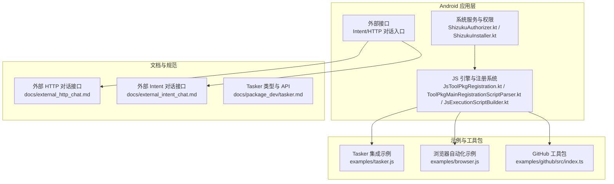
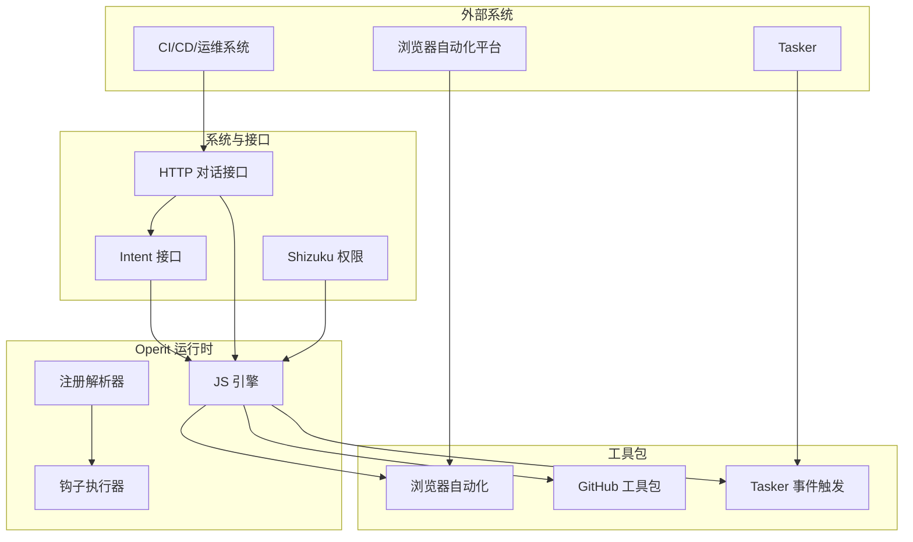
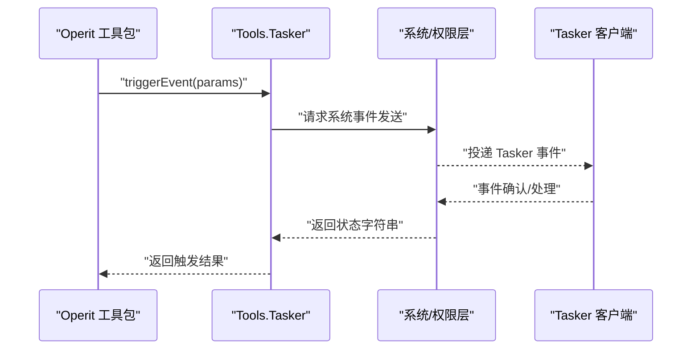
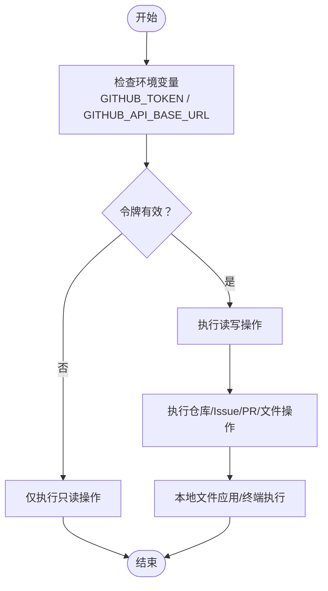
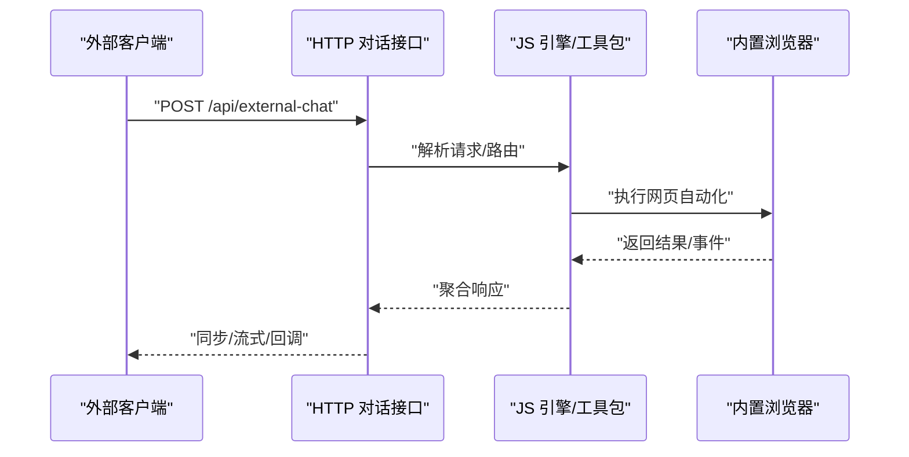
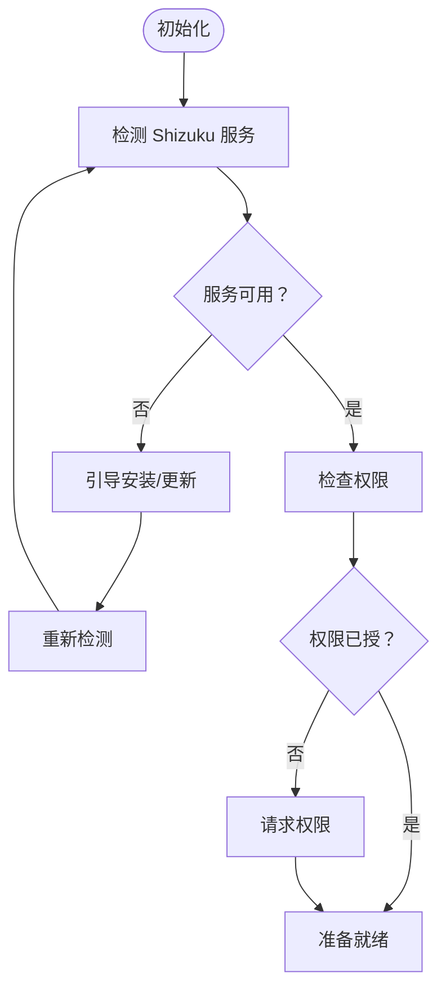
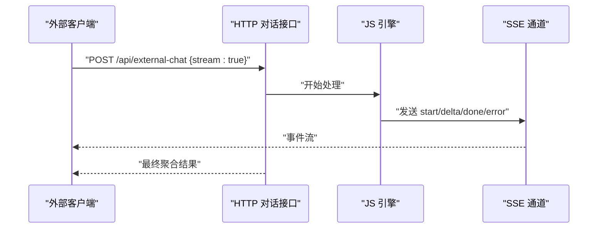
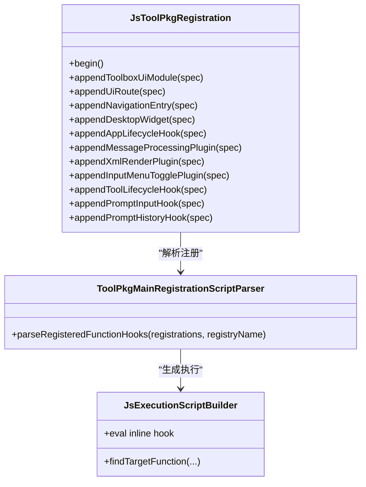
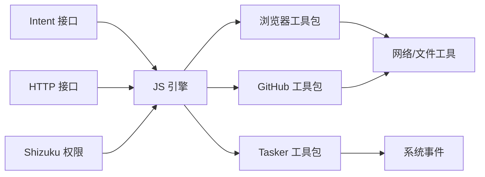

# 集成与扩展

<cite>
**本文引用的文件**
- [README.md](file://README.md)
- [external_http_chat.md](file://docs/external_http_chat.md)
- [external_intent_chat.md](file://docs/external_intent_chat.md)
- [tasker.js](file://examples/tasker.js)
- [tasker.md](file://docs/package_dev/tasker.md)
- [browser.js](file://examples/browser.js)
- [github/src/index.ts](file://examples/github/src/index.ts)
- [ShizukuAuthorizer.kt](file://app/src/main/java/com/ai/assistance/operit/core/tools/system/ShizukuAuthorizer.kt)
- [ShizukuInstaller.kt](file://app/src/main/java/com/ai/assistance/operit/core/tools/system/ShizukuInstaller.kt)
- [JsToolPkgRegistration.kt](file://app/src/main/java/com/ai/assistance/operit/core/tools/javascript/JsToolPkgRegistration.kt)
- [ToolPkgMainRegistrationScriptParser.kt](file://app/src/main/java/com/ai/assistance/operit/core/tools/packTool/ToolPkgMainRegistrationScriptParser.kt)
- [JsExecutionScriptBuilder.kt](file://app/src/main/java/com/ai/assistance/operit/core/tools/javascript/JsExecutionScriptBuilder.kt)
</cite>

## 目录
1. [简介](#简介)
2. [项目结构](#项目结构)
3. [核心组件](#核心组件)
4. [架构总览](#架构总览)
5. [详细组件分析](#详细组件分析)
6. [依赖关系分析](#依赖关系分析)
7. [性能考量](#性能考量)
8. [故障排查指南](#故障排查指南)
9. [结论](#结论)
10. [附录](#附录)

## 简介
本文件面向集成开发者，系统化梳理 Operit AI 的集成与扩展能力，重点覆盖以下方面：
- Tasker 集成：事件触发机制、自动化工作流、外部控制接口
- GitHub OAuth 集成：认证流程、权限管理、包管理自动化
- 浏览器集成：网页自动化、HTTP 对话入口、跨域处理
- Shizuku 集成：Root 权限支持、系统级操作、安全考虑
- 外部 API 集成：RESTful API 设计、WebSocket 连接、实时通信
- 扩展点设计：插件架构、钩子机制、事件系统
- 实战示例：如何实现自定义集成、扩展外部功能、处理集成错误

## 项目结构
Operit 采用模块化与多语言混合架构：Android 应用层负责系统权限与服务编排，JavaScript/TypeScript 运行时承载工具包与扩展脚本，示例工程提供可直接使用的集成范式。

**图示来源**
- [ShizukuAuthorizer.kt:1-420](file://app/src/main/java/com/ai/assistance/operit/core/tools/system/ShizukuAuthorizer.kt#L1-L420)
- [ShizukuInstaller.kt:1-298](file://app/src/main/java/com/ai/assistance/operit/core/tools/system/ShizukuInstaller.kt#L1-L298)
- [JsToolPkgRegistration.kt:48-230](file://app/src/main/java/com/ai/assistance/operit/core/tools/javascript/JsToolPkgRegistration.kt#L48-L230)
- [ToolPkgMainRegistrationScriptParser.kt:37-434](file://app/src/main/java/com/ai/assistance/operit/core/tools/packTool/ToolPkgMainRegistrationScriptParser.kt#L37-L434)
- [JsExecutionScriptBuilder.kt:1560-1581](file://app/src/main/java/com/ai/assistance/operit/core/tools/javascript/JsExecutionScriptBuilder.kt#L1560-L1581)
- [external_http_chat.md:1-230](file://docs/external_http_chat.md#L1-L230)
- [external_intent_chat.md:1-220](file://docs/external_intent_chat.md#L1-L220)
- [tasker.js:1-59](file://examples/tasker.js#L1-L59)
- [browser.js:1-366](file://examples/browser.js#L1-L366)
- [github/src/index.ts:1-562](file://examples/github/src/index.ts#L1-L562)

**章节来源**
- [README.md:113-125](file://README.md#L113-L125)

## 核心组件
- 外部对话接口（Intent/HTTP）：提供统一的外部触发入口，支持同步、SSE 流式与异步回调三种响应模式，便于与外部系统对接。
- 浏览器自动化工具包：提供与 Playwright 表面一致的网页自动化能力，覆盖导航、表单、截图、网络请求等常用场景。
- GitHub 工具包：封装 GitHub REST API，支持仓库、Issue、PR、文件内容与差异更新等操作，并提供本地文件应用与终端执行能力。
- Tasker 集成：通过工具包暴露的 Tasker 事件触发 API，将 Operit 的工具链与 Tasker 自动化串联。
- Shizuku 集成：提供服务可用性检测、权限申请、安装引导与版本管理，支撑系统级操作。
- 扩展点与钩子：通过 JS 工具包注册系统，支持 UI、生命周期、消息处理、输入菜单等多类钩子，形成灵活的插件化扩展能力。

**章节来源**
- [external_http_chat.md:31-230](file://docs/external_http_chat.md#L31-L230)
- [external_intent_chat.md:21-220](file://docs/external_intent_chat.md#L21-L220)
- [browser.js:1-366](file://examples/browser.js#L1-L366)
- [github/src/index.ts:1-562](file://examples/github/src/index.ts#L1-L562)
- [tasker.js:1-59](file://examples/tasker.js#L1-L59)
- [tasker.md:1-83](file://docs/package_dev/tasker.md#L1-L83)
- [ShizukuAuthorizer.kt:14-420](file://app/src/main/java/com/ai/assistance/operit/core/tools/system/ShizukuAuthorizer.kt#L14-L420)
- [ShizukuInstaller.kt:16-298](file://app/src/main/java/com/ai/assistance/operit/core/tools/system/ShizukuInstaller.kt#L16-L298)
- [JsToolPkgRegistration.kt:48-230](file://app/src/main/java/com/ai/assistance/operit/core/tools/javascript/JsToolPkgRegistration.kt#L48-L230)
- [ToolPkgMainRegistrationScriptParser.kt:37-434](file://app/src/main/java/com/ai/assistance/operit/core/tools/packTool/ToolPkgMainRegistrationScriptParser.kt#L37-L434)
- [JsExecutionScriptBuilder.kt:1560-1581](file://app/src/main/java/com/ai/assistance/operit/core/tools/javascript/JsExecutionScriptBuilder.kt#L1560-L1581)

## 架构总览
Operit 的集成与扩展以“运行时 + 工具包 + 外部接口 + 系统权限”四轴协同：
- 运行时：JS 引擎与注册系统负责加载与调度工具包，解析钩子与 UI 注册。
- 工具包：以 TypeScript/JavaScript 实现，提供具体能力（浏览器、GitHub、Tasker 等）。
- 外部接口：Intent 与 HTTP 两种入口，统一语义，分别面向广播与局域网调用。
- 系统权限：Shizuku 提供 Root/系统级能力，配合权限申请与安装引导。

**图示来源**
- [external_http_chat.md:31-230](file://docs/external_http_chat.md#L31-L230)
- [external_intent_chat.md:21-220](file://docs/external_intent_chat.md#L21-L220)
- [browser.js:1-366](file://examples/browser.js#L1-L366)
- [github/src/index.ts:1-562](file://examples/github/src/index.ts#L1-L562)
- [tasker.js:1-59](file://examples/tasker.js#L1-L59)
- [ShizukuAuthorizer.kt:14-420](file://app/src/main/java/com/ai/assistance/operit/core/tools/system/ShizukuAuthorizer.kt#L14-L420)
- [JsToolPkgRegistration.kt:48-230](file://app/src/main/java/com/ai/assistance/operit/core/tools/javascript/JsToolPkgRegistration.kt#L48-L230)
- [ToolPkgMainRegistrationScriptParser.kt:37-434](file://app/src/main/java/com/ai/assistance/operit/core/tools/packTool/ToolPkgMainRegistrationScriptParser.kt#L37-L434)

## 详细组件分析

### Tasker 集成
- 事件触发机制：通过工具包暴露的 Tasker 事件触发 API，将 Operit 的工具链结果或状态上报至 Tasker，实现跨应用自动化联动。
- 自动化工作流：结合 Operit 的工具包与 Tasker 的事件监听，构建“AI 生成 + 工具执行 + 事件上报”的闭环。
- 外部控制接口：工具包提供统一的触发方法，支持简单参数与结构化 JSON 参数传递。

**图示来源**
- [tasker.js:35-59](file://examples/tasker.js#L35-L59)
- [tasker.md:34-76](file://docs/package_dev/tasker.md#L34-L76)

**章节来源**
- [tasker.js:1-59](file://examples/tasker.js#L1-L59)
- [tasker.md:1-83](file://docs/package_dev/tasker.md#L1-L83)

### GitHub OAuth 集成
- 认证流程：通过环境变量注入认证令牌与基础 URL，工具包在运行时读取并发起受控请求。
- 权限管理：区分只读与写入操作，写入操作需要有效令牌；工具包提供自检与降级策略。
- 包管理自动化：工具包内含仓库、Issue、PR、文件内容与差异更新等能力，并提供本地文件应用与终端执行，便于 CI/CD 场景自动化。

**图示来源**
- [github/src/index.ts:11-23](file://examples/github/src/index.ts#L11-L23)
- [github/src/index.ts:257-562](file://examples/github/src/index.ts#L257-L562)

**章节来源**
- [github/src/index.ts:1-562](file://examples/github/src/index.ts#L1-L562)

### 浏览器集成能力
- 网页自动化：提供导航、点击、输入、表单填充、截图、网络请求、对话框处理、键盘事件等能力，覆盖常见自动化场景。
- HTTP 对话入口：通过外部 HTTP 接口，以同步、SSE 流式或异步回调的方式与 Operit 交互，便于局域网内嵌入自动化平台。
- 跨域处理：内置浏览器具备标签页、历史、书签、权限与多窗口能力，支持工作区 Web 项目 CORS 绕过访问外部网页，满足跨域需求。

**图示来源**
- [external_http_chat.md:55-230](file://docs/external_http_chat.md#L55-L230)
- [browser.js:1-366](file://examples/browser.js#L1-L366)

**章节来源**
- [external_http_chat.md:1-230](file://docs/external_http_chat.md#L1-L230)
- [browser.js:1-366](file://examples/browser.js#L1-L366)

### Shizuku 集成
- Root 权限支持：提供服务可用性检测、UID 校验、权限申请与状态变更通知，确保系统级操作的安全与稳定。
- 安装引导：内置 Shizuku APK 提取与安装流程，支持版本缓存与更新判断，降低用户接入成本。
- 安全考虑：严格校验 UID（0/2000），在权限未授予或服务不可用时拒绝执行高危操作，并提供错误信息缓存与上报。

**图示来源**
- [ShizukuAuthorizer.kt:14-420](file://app/src/main/java/com/ai/assistance/operit/core/tools/system/ShizukuAuthorizer.kt#L14-L420)
- [ShizukuInstaller.kt:16-298](file://app/src/main/java/com/ai/assistance/operit/core/tools/system/ShizukuInstaller.kt#L16-L298)

**章节来源**
- [ShizukuAuthorizer.kt:1-420](file://app/src/main/java/com/ai/assistance/operit/core/tools/system/ShizukuAuthorizer.kt#L1-L420)
- [ShizukuInstaller.kt:1-298](file://app/src/main/java/com/ai/assistance/operit/core/tools/system/ShizukuInstaller.kt#L1-L298)

### 外部 API 集成指南
- RESTful API 设计：遵循统一的请求/响应结构，支持同步与异步两种模式；鉴权采用 Bearer Token。
- WebSocket 连接：内置 WebSocket 解析与序列化工具，支持路径与查询组件规范化，便于与外部网关对接。
- 实时通信：SSE 流式返回支持增量事件推送，适合长耗时任务的进度反馈与结果聚合。

**图示来源**
- [external_http_chat.md:119-173](file://docs/external_http_chat.md#L119-L173)

**章节来源**
- [external_http_chat.md:1-230](file://docs/external_http_chat.md#L1-L230)

### 扩展点与钩子机制
- 插件架构：JS 工具包注册系统支持 UI 模块、路由、桌面部件、应用生命周期、消息处理、XML 渲染、输入菜单切换、工具生命周期与提示词输入/历史钩子等注册桶。
- 钩子执行：注册解析器将 JSON 规范化的钩子定义解析为可执行函数，支持内联函数与导出函数两种形式。
- 事件系统：通过状态变更监听与回调通知，实现 UI 与系统状态的联动。

**图示来源**
- [JsToolPkgRegistration.kt:48-230](file://app/src/main/java/com/ai/assistance/operit/core/tools/javascript/JsToolPkgRegistration.kt#L48-L230)
- [ToolPkgMainRegistrationScriptParser.kt:37-434](file://app/src/main/java/com/ai/assistance/operit/core/tools/packTool/ToolPkgMainRegistrationScriptParser.kt#L37-L434)
- [JsExecutionScriptBuilder.kt:1560-1581](file://app/src/main/java/com/ai/assistance/operit/core/tools/javascript/JsExecutionScriptBuilder.kt#L1560-L1581)

**章节来源**
- [JsToolPkgRegistration.kt:48-230](file://app/src/main/java/com/ai/assistance/operit/core/tools/javascript/JsToolPkgRegistration.kt#L48-L230)
- [ToolPkgMainRegistrationScriptParser.kt:37-434](file://app/src/main/java/com/ai/assistance/operit/core/tools/packTool/ToolPkgMainRegistrationScriptParser.kt#L37-L434)
- [JsExecutionScriptBuilder.kt:1560-1581](file://app/src/main/java/com/ai/assistance/operit/core/tools/javascript/JsExecutionScriptBuilder.kt#L1560-L1581)

## 依赖关系分析
- 组件耦合：工具包依赖 JS 引擎与注册系统；外部接口依赖 Intent/HTTP 路由与鉴权；Shizuku 提供系统级能力，被高危操作调用。
- 直接依赖：浏览器工具包依赖网络与文件工具；GitHub 工具包依赖网络与文件工具；Tasker 工具包依赖系统事件发送。
- 间接依赖：UI 与钩子通过注册系统间接依赖 JS 引擎；权限与安装流程通过系统服务间接依赖 Shizuku。

**图示来源**
- [external_intent_chat.md:11-17](file://docs/external_intent_chat.md#L11-L17)
- [external_http_chat.md:31-230](file://docs/external_http_chat.md#L31-L230)
- [browser.js:1-366](file://examples/browser.js#L1-L366)
- [github/src/index.ts:1-562](file://examples/github/src/index.ts#L1-L562)
- [tasker.js:1-59](file://examples/tasker.js#L1-L59)
- [ShizukuAuthorizer.kt:14-420](file://app/src/main/java/com/ai/assistance/operit/core/tools/system/ShizukuAuthorizer.kt#L14-L420)

**章节来源**
- [external_intent_chat.md:1-220](file://docs/external_intent_chat.md#L1-L220)
- [external_http_chat.md:1-230](file://docs/external_http_chat.md#L1-L230)
- [browser.js:1-366](file://examples/browser.js#L1-L366)
- [github/src/index.ts:1-562](file://examples/github/src/index.ts#L1-L562)
- [tasker.js:1-59](file://examples/tasker.js#L1-L59)
- [ShizukuAuthorizer.kt:1-420](file://app/src/main/java/com/ai/assistance/operit/core/tools/system/ShizukuAuthorizer.kt#L1-L420)

## 性能考量
- 工具包并行：只读工具可并行执行，缩短响应时间；写入操作建议串行或加锁，避免竞态。
- 流式输出：SSE 流式返回可显著改善长耗时任务的用户体验，减少一次性大响应带来的内存压力。
- 资源清理：大文本输出自动落盘并返回路径，避免内存溢出；临时文件在退出时清理。
- 权限与安装：Shizuku 安装与版本检查使用缓存，降低频繁 IO 与解析开销。

[本节为通用指导，无需特定文件引用]

## 故障排查指南
- 外部 HTTP 接口
  - 鉴权失败：确认 Bearer Token 与端口配置；检查 OPTIONS 预检与 Accept 头。
  - 参数冲突：stream 与 async_callback 不能同时使用；create_new_chat 与 chat_id 互斥。
  - 回调失败：非 2xx 或网络失败仅记录日志，不自动重试。
- Intent 接口
  - 无响应：确认 reply_package 与 action；使用 logcat 观察广播接收。
  - 浮窗异常：检查 show_floating 与 initial_mode；必要时手动停止服务。
- 浏览器自动化
  - 大输出处理：超过阈值自动落盘；检查清理目录权限。
  - 网络与跨域：确认工作区 CORS 绕过与权限设置。
- GitHub 工具包
  - 令牌无效：检查环境变量注入与作用域；写入操作需有效令牌。
  - 自检失败：根据返回结构定位具体失败步骤。
- Shizuku 集成
  - 服务不可用：检查安装与启动；查看错误信息缓存。
  - 权限未授：重新请求并监听状态变更；核对 UID。

**章节来源**
- [external_http_chat.md:21-230](file://docs/external_http_chat.md#L21-L230)
- [external_intent_chat.md:127-220](file://docs/external_intent_chat.md#L127-L220)
- [browser.js:215-224](file://examples/browser.js#L215-L224)
- [github/src/index.ts:532-562](file://examples/github/src/index.ts#L532-L562)
- [ShizukuAuthorizer.kt:118-128](file://app/src/main/java/com/ai/assistance/operit/core/tools/system/ShizukuAuthorizer.kt#L118-L128)

## 结论
Operit 的集成与扩展体系以“统一接口 + 工具包 + 运行时 + 系统权限”为核心，既保证了与外部系统的无缝对接，又提供了灵活的扩展能力。开发者可通过工具包与钩子机制快速实现自定义集成，借助 Tasker、GitHub、浏览器自动化与 Shizuku 等能力，构建覆盖 AI 生成、系统操作与跨域交互的完整自动化解决方案。

[本节为总结性内容，无需特定文件引用]

## 附录
- 快速参考
  - 外部 HTTP 接口：启用、鉴权、同步/流式/回调模式、行为说明
  - 外部 Intent 接口：请求/回传参数、优先级规则、adb 示例
  - Tasker 集成：API 类型与运行时入口、参数与返回约定
  - 浏览器工具包：常用工具与参数、大输出处理
  - GitHub 工具包：环境变量、工具清单、自检流程
  - Shizuku 集成：服务检测、权限申请、安装引导、错误信息

**章节来源**
- [external_http_chat.md:1-230](file://docs/external_http_chat.md#L1-L230)
- [external_intent_chat.md:1-220](file://docs/external_intent_chat.md#L1-L220)
- [tasker.md:1-83](file://docs/package_dev/tasker.md#L1-L83)
- [browser.js:1-366](file://examples/browser.js#L1-L366)
- [github/src/index.ts:1-562](file://examples/github/src/index.ts#L1-L562)
- [ShizukuAuthorizer.kt:1-420](file://app/src/main/java/com/ai/assistance/operit/core/tools/system/ShizukuAuthorizer.kt#L1-L420)
- [ShizukuInstaller.kt:1-298](file://app/src/main/java/com/ai/assistance/operit/core/tools/system/ShizukuInstaller.kt#L1-L298)