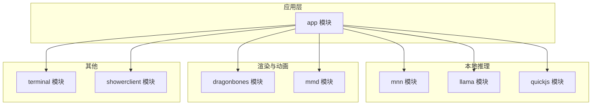
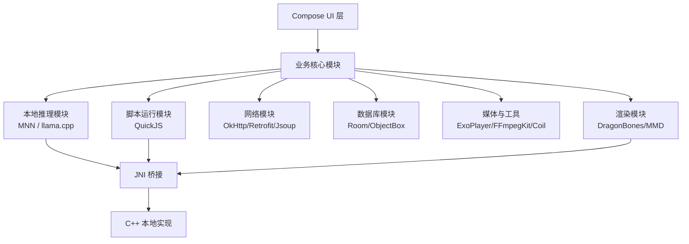
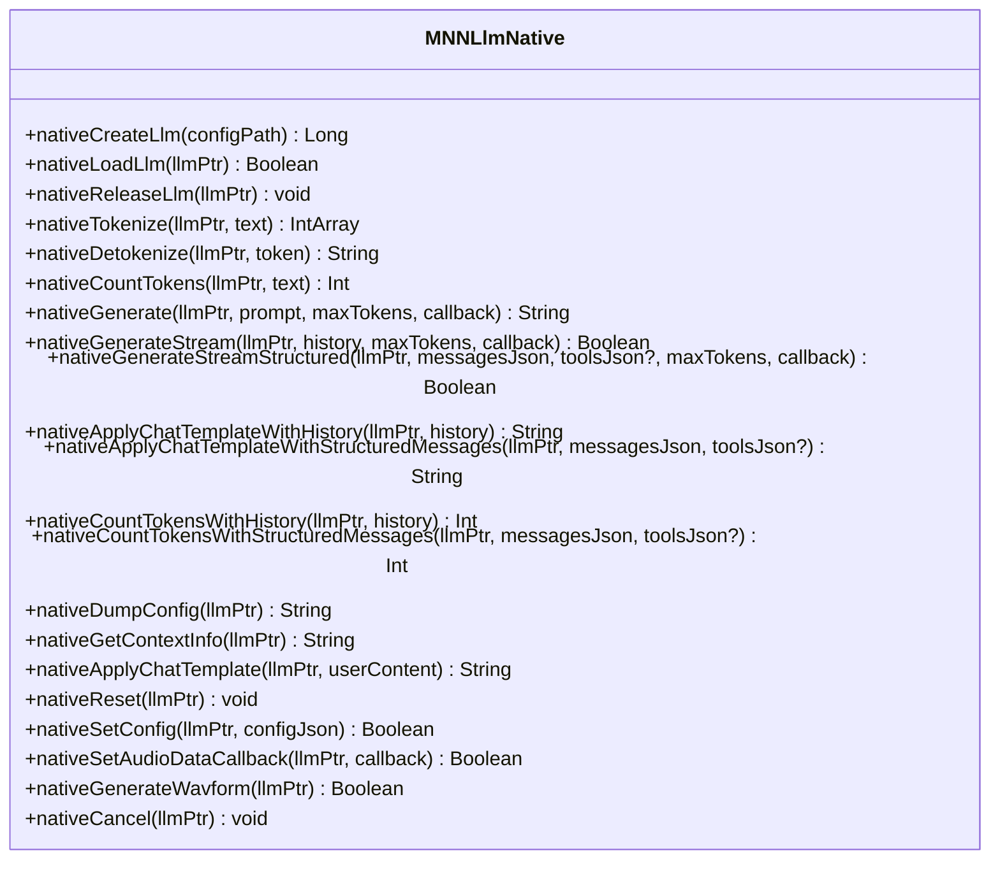
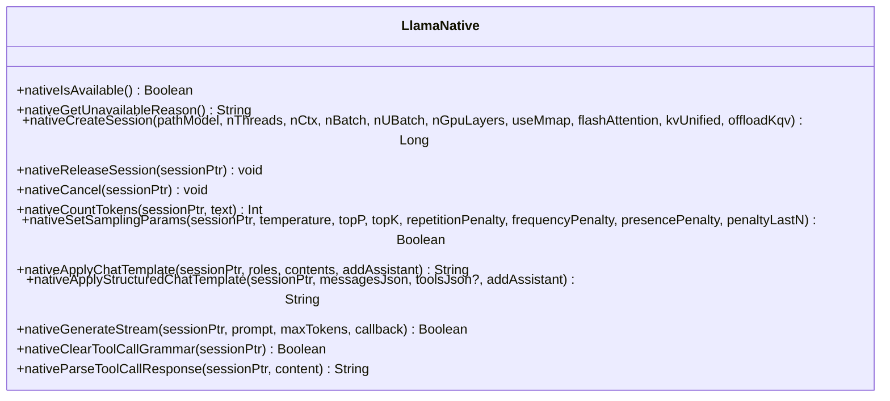
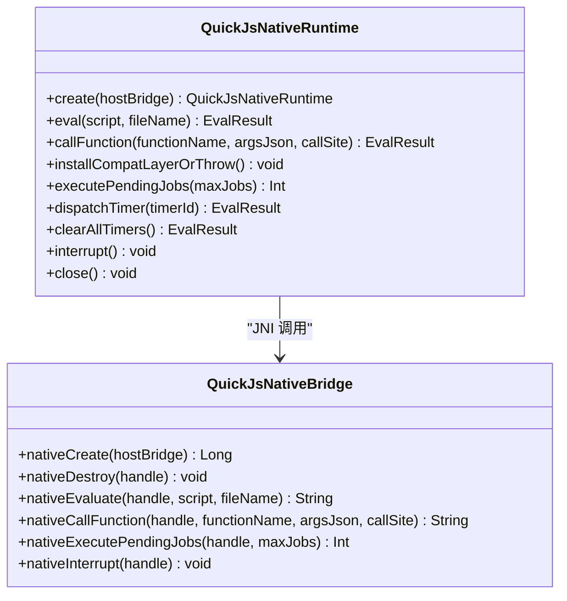
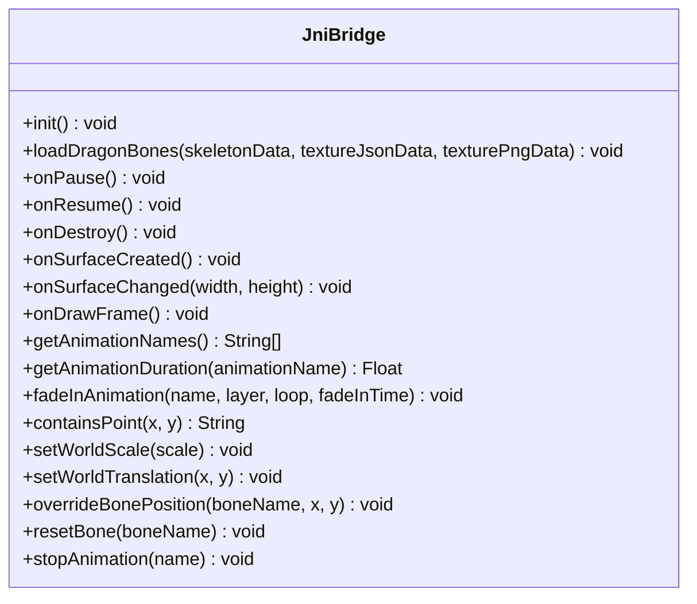
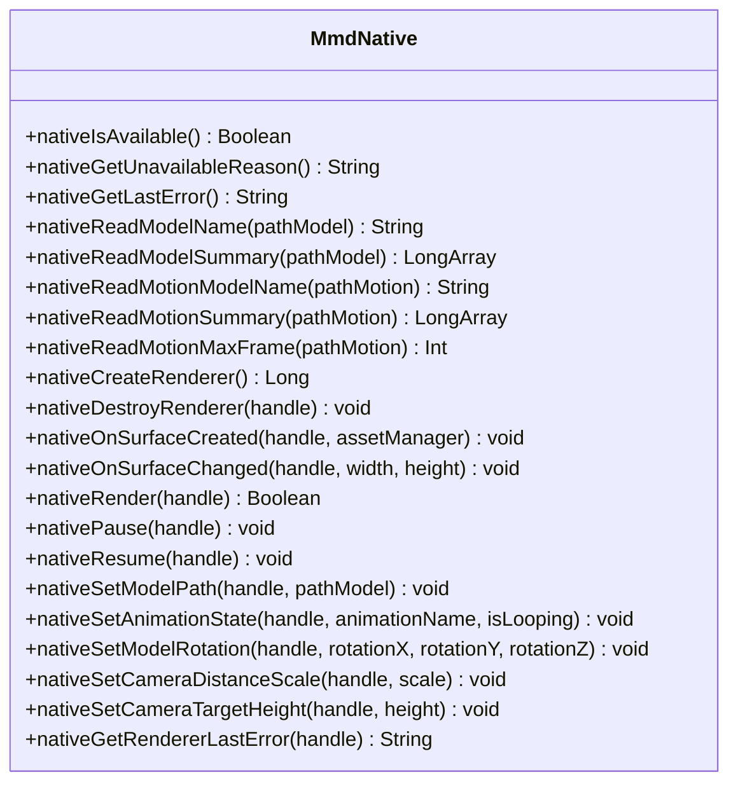
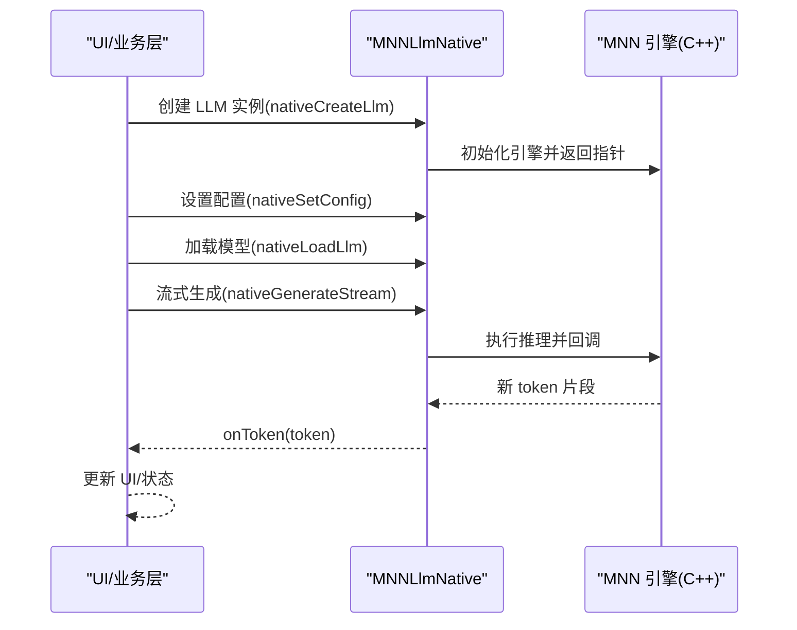
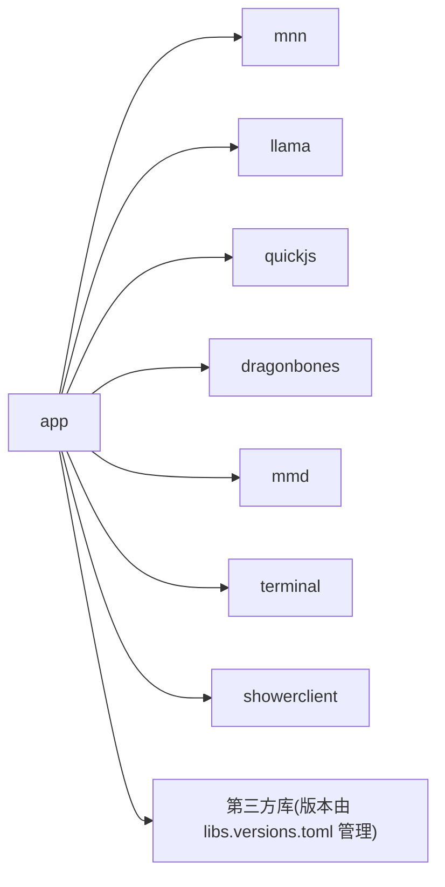

# 技术栈概览

<cite>
**本文档引用的文件**
- [README.md](file://README.md)
- [settings.gradle.kts](file://settings.gradle.kts)
- [app/build.gradle.kts](file://app/build.gradle.kts)
- [gradle/libs.versions.toml](file://gradle/libs.versions.toml)
- [mnn/build.gradle.kts](file://mnn/build.gradle.kts)
- [llama/build.gradle.kts](file://llama/build.gradle.kts)
- [quickjs/build.gradle.kts](file://quickjs/build.gradle.kts)
- [dragonbones/build.gradle.kts](file://dragonbones/build.gradle.kts)
- [mmd/build.gradle.kts](file://mmd/build.gradle.kts)
- [mnn/src/main/java/com/ai/assistance/mnn/MNNLlmNative.kt](file://mnn/src/main/java/com/ai/assistance/mnn/MNNLlmNative.kt)
- [llama/src/main/java/com/ai/assistance/llama/LlamaNative.kt](file://llama/src/main/java/com/ai/assistance/llama/LlamaNative.kt)
- [quickjs/src/main/java/com/ai/assistance/operit/core/tools/javascript/QuickJsNativeRuntime.kt](file://quickjs/src/main/java/com/ai/assistance/operit/core/tools/javascript/QuickJsNativeRuntime.kt)
- [dragonbones/src/main/java/com/dragonbones/JniBridge.kt](file://dragonbones/src/main/java/com/dragonbones/JniBridge.kt)
- [mmd/src/main/java/com/ai/assistance/mmd/MmdNative.kt](file://mmd/src/main/java/com/ai/assistance/mmd/MmdNative.kt)
</cite>

## 目录
1. [引言](#引言)
2. [项目结构](#项目结构)
3. [核心组件](#核心组件)
4. [架构总览](#架构总览)
5. [详细组件分析](#详细组件分析)
6. [依赖关系分析](#依赖关系分析)
7. [性能考量](#性能考量)
8. [故障排查指南](#故障排查指南)
9. [结论](#结论)
10. [附录](#附录)

## 引言
本文件面向 Operit AI 智能助手应用，提供全面的技术栈概览与架构说明。项目基于 Android 平台，采用 Kotlin 与 Jetpack Compose 进行 UI 开发；在本地推理方面集成了 MNN 与 llama.cpp，并通过 QuickJS 提供脚本运行能力；同时结合 C++/JNI 桥接实现高性能本地模块与 Android 层的互通。文档还涵盖网络通信、数据库设计、UI 组件系统、第三方库与依赖集成策略、构建配置与部署流程，帮助开发者理解整体技术架构的设计背景与实现要点。

## 项目结构
Operit 采用多模块 Gradle 结构，主模块 app 负责应用层逻辑与 UI，子模块分别承载本地推理引擎、动画渲染、脚本运行等能力。settings.gradle.kts 明确声明了包含的模块，便于统一管理和构建。

**图表来源**
- [settings.gradle.kts:21-29](file://settings.gradle.kts#L21-L29)
- [app/build.gradle.kts:181-191](file://app/build.gradle.kts#L181-L191)

**章节来源**
- [settings.gradle.kts:1-30](file://settings.gradle.kts#L1-L30)
- [app/build.gradle.kts:181-191](file://app/build.gradle.kts#L181-L191)

## 核心组件
- Android 应用层与 UI
  - Kotlin + Jetpack Compose：应用层业务逻辑与 UI 组件开发，使用 Compose BOM 管理版本一致性。
  - Material3、Navigation Compose、Window Size Class 等：提供现代化 UI 与自适应布局能力。
- 本地 AI 推理
  - MNN：LLM 引擎封装，提供模型创建、配置、编码解码、流式生成、模板应用、上下文信息导出等能力。
  - llama.cpp：会话管理、采样参数设置、聊天模板应用、结构化消息处理、工具调用解析等。
  - QuickJS：轻量脚本运行时，提供宿主桥接、异步任务调度、中断控制与错误诊断。
- 渲染与动画
  - DragonBones：骨骼动画加载与播放控制，OpenGL 渲染桥接。
  - MMD：MikuMikuDance 模型读取与渲染，相机、骨骼、动画状态控制。
- 网络与数据
  - OkHttp、Retrofit、Jsoup：网络请求与 HTML 解析。
  - Room + ObjectBox：本地持久化方案，Room 用于结构化数据，ObjectBox 用于高性能对象存储。
- 媒体与工具
  - ExoPlayer、FFmpegKit、Coil/Glide：视频播放、媒体处理、图片加载。
- 权限与自动化
  - libsu、Shizuku、WorkManager：Root/ADB 权限自动化、后台任务调度。
- 构建与打包
  - Gradle + CMake：NDK 编译与多 ABI 打包，统一版本管理 via libs.versions.toml。

**章节来源**
- [app/build.gradle.kts:181-445](file://app/build.gradle.kts#L181-L445)
- [gradle/libs.versions.toml:83-271](file://gradle/libs.versions.toml#L83-L271)

## 架构总览
下图展示了 Operit 的高层架构：应用层通过 Compose UI 与业务模块交互；本地推理模块通过 JNI 桥接到 C++ 实现；网络模块负责外部 API 与资源下载；数据库模块提供持久化；渲染模块负责动画与 3D 模型展示。

**图表来源**
- [app/build.gradle.kts:181-191](file://app/build.gradle.kts#L181-L191)
- [mnn/build.gradle.kts:26-53](file://mnn/build.gradle.kts#L26-L53)
- [llama/build.gradle.kts:24-35](file://llama/build.gradle.kts#L24-L35)
- [quickjs/build.gradle.kts:15-39](file://quickjs/build.gradle.kts#L15-L39)
- [dragonbones/build.gradle.kts:19-49](file://dragonbones/build.gradle.kts#L19-L49)
- [mmd/build.gradle.kts:23-33](file://mmd/build.gradle.kts#L23-L33)

## 详细组件分析

### 本地推理：MNN
- 能力范围
  - LLM 实例生命周期管理、配置设置与导出、上下文信息导出。
  - 文本编码/解码、Token 计数、聊天模板应用（含历史与结构化消息）。
  - 非流式与流式生成、结构化工具调用生成、音频数据回调、取消生成。
- JNI 接口
  - 通过外部函数声明暴露底层能力，配合库加载器完成初始化。
- CMake 配置
  - 针对 Android 平台启用 LLM 支持、Transformer Fuse、低内存优化等特性，限定 ABI 为 arm64-v8a。

**图表来源**
- [mnn/src/main/java/com/ai/assistance/mnn/MNNLlmNative.kt:19-192](file://mnn/src/main/java/com/ai/assistance/mnn/MNNLlmNative.kt#L19-L192)

**章节来源**
- [mnn/src/main/java/com/ai/assistance/mnn/MNNLlmNative.kt:1-215](file://mnn/src/main/java/com/ai/assistance/mnn/MNNLlmNative.kt#L1-L215)
- [mnn/build.gradle.kts:26-53](file://mnn/build.gradle.kts#L26-L53)

### 本地推理：llama.cpp
- 能力范围
  - 会话创建与释放、采样参数设置、聊天模板应用（含结构化消息）、流式生成、工具调用解析。
- JNI 接口
  - 提供可用性检测、不可用原因查询、会话句柄管理与回调接口。
- CMake 配置
  - 针对 Android 平台启用通用组件，限定 ABI 为 arm64-v8a。

**图表来源**
- [llama/src/main/java/com/ai/assistance/llama/LlamaNative.kt:13-77](file://llama/src/main/java/com/ai/assistance/llama/LlamaNative.kt#L13-L77)

**章节来源**
- [llama/src/main/java/com/ai/assistance/llama/LlamaNative.kt:1-82](file://llama/src/main/java/com/ai/assistance/llama/LlamaNative.kt#L1-L82)
- [llama/build.gradle.kts:24-35](file://llama/build.gradle.kts#L24-L35)

### 脚本运行：QuickJS
- 能力范围
  - 运行时创建与销毁、脚本求值、函数调用、挂起任务执行、定时器派发、中断控制与错误诊断。
- JNI 接口
  - 通过宿主桥接回调实现 JS 与 Android 之间的互操作。
- CMake 配置
  - 针对 Android 平台编译，限定 ABI 为 arm64-v8a。

**图表来源**
- [quickjs/src/main/java/com/ai/assistance/operit/core/tools/javascript/QuickJsNativeRuntime.kt:12-34](file://quickjs/src/main/java/com/ai/assistance/operit/core/tools/javascript/QuickJsNativeRuntime.kt#L12-L34)
- [quickjs/src/main/java/com/ai/assistance/operit/core/tools/javascript/QuickJsNativeRuntime.kt:54-123](file://quickjs/src/main/java/com/ai/assistance/operit/core/tools/javascript/QuickJsNativeRuntime.kt#L54-L123)

**章节来源**
- [quickjs/src/main/java/com/ai/assistance/operit/core/tools/javascript/QuickJsNativeRuntime.kt:1-161](file://quickjs/src/main/java/com/ai/assistance/operit/core/tools/javascript/QuickJsNativeRuntime.kt#L1-L161)
- [quickjs/build.gradle.kts:15-39](file://quickjs/build.gradle.kts#L15-L39)

### 渲染与动画：DragonBones
- 能力范围
  - 骨骼动画初始化、纹理与骨架数据加载、生命周期回调（暂停/恢复/销毁）、表面创建与变更、帧绘制。
  - 动画名列表、时长查询、淡入播放、命中测试、世界缩放与位移、骨骼位置覆盖与重置、停止动画。
- JNI 接口
  - 通过 System.loadLibrary 加载本地库，提供完整的动画控制方法。

**图表来源**
- [dragonbones/src/main/java/com/dragonbones/JniBridge.kt:8-46](file://dragonbones/src/main/java/com/dragonbones/JniBridge.kt#L8-L46)

**章节来源**
- [dragonbones/src/main/java/com/dragonbones/JniBridge.kt:1-47](file://dragonbones/src/main/java/com/dragonbones/JniBridge.kt#L1-L47)
- [dragonbones/build.gradle.kts:19-49](file://dragonbones/build.gradle.kts#L19-L49)

### 渲染与动画：MMD
- 能力范围
  - 模型与动作读取、渲染器创建与销毁、表面生命周期回调、渲染控制、模型旋转与相机参数设置、动画状态切换。
- JNI 接口
  - 通过库加载器初始化，提供模型与动画读取、渲染器状态管理等方法。

**图表来源**
- [mmd/src/main/java/com/ai/assistance/mmd/MmdNative.kt:17-60](file://mmd/src/main/java/com/ai/assistance/mmd/MmdNative.kt#L17-L60)

**章节来源**
- [mmd/src/main/java/com/ai/assistance/mmd/MmdNative.kt:1-62](file://mmd/src/main/java/com/ai/assistance/mmd/MmdNative.kt#L1-L62)
- [mmd/build.gradle.kts:23-33](file://mmd/build.gradle.kts#L23-L33)

### 本地推理工作流（以 MNN 为例）
以下序列图展示了应用层发起一次流式生成请求，经由 JNI 桥接到 MNN 引擎的典型流程。

**图表来源**
- [mnn/src/main/java/com/ai/assistance/mnn/MNNLlmNative.kt:19-88](file://mnn/src/main/java/com/ai/assistance/mnn/MNNLlmNative.kt#L19-L88)

## 依赖关系分析
- 模块依赖
  - app 模块显式依赖 mnn、llama、quickjs、dragonbones、mmd、showerclient、terminal 等子模块。
- 第三方库与版本管理
  - 通过 libs.versions.toml 统一管理 Compose、Room、ObjectBox、OkHttp、Retrofit、WorkManager、协程、测试等依赖版本。
- 打包与资源
  - app 模块开启 Compose、AIDL、ExternalNativeBuild(CMake)，并配置 ABI 过滤与资源去重策略，避免重复文件冲突。

**图表来源**
- [app/build.gradle.kts:181-191](file://app/build.gradle.kts#L181-L191)
- [gradle/libs.versions.toml:83-271](file://gradle/libs.versions.toml#L83-L271)

**章节来源**
- [app/build.gradle.kts:181-445](file://app/build.gradle.kts#L181-L445)
- [gradle/libs.versions.toml:1-271](file://gradle/libs.versions.toml#L1-L271)

## 性能考量
- 本地推理
  - MNN：启用 Transformer Fuse、低内存模式、ARM82 等特性，减少内存占用与提升吞吐。
  - llama.cpp：通过采样参数与批处理配置优化生成质量与延迟。
- UI 与渲染
  - Compose BOM 保证依赖版本一致性，Material3 与动画库优化绘制性能。
  - DragonBones/MMD 通过 JNI 直接渲染，降低跨层开销。
- 网络与媒体
  - OkHttp SSE 与 Retrofit 提升流式响应与错误处理能力；FFmpegKit 与 ExoPlayer 优化媒体处理与播放体验。
- 数据库
  - Room 与 ObjectBox 并行使用，Room 用于结构化数据，ObjectBox 用于高频对象存储，兼顾易用性与性能。

**章节来源**
- [mnn/build.gradle.kts:46-51](file://mnn/build.gradle.kts#L46-L51)
- [llama/build.gradle.kts:27-32](file://llama/build.gradle.kts#L27-L32)
- [app/build.gradle.kts:181-445](file://app/build.gradle.kts#L181-L445)

## 故障排查指南
- 本地推理初始化失败
  - 检查库加载器是否正确加载本地库；确认 CMake 参数与 ABI 配置一致。
  - 关注 nativeIsAvailable/nativeGetUnavailableReason 的返回值，定位不可用原因。
- 生成过程异常
  - 使用 nativeCancel 取消任务；检查 GenerationCallback 返回值以控制生成流程。
  - 对于 QuickJS，使用 interrupt 清理挂起任务，避免长时间阻塞。
- 渲染问题
  - DragonBones：检查 surface 生命周期回调与动画名列表；确认纹理与骨架数据完整性。
  - MMD：验证模型与动作文件路径、渲染器句柄有效性与相机参数设置。
- 网络与媒体
  - OkHttp/Jsoup 请求失败时，优先检查超时与重试策略；媒体处理失败时，确认 FFmpegKit 日志与权限。
- 数据库
  - Room/ObjectBox 冲突时，遵循 libs.versions.toml 的版本约束，避免重复依赖导致的类冲突。

**章节来源**
- [llama/src/main/java/com/ai/assistance/llama/LlamaNative.kt:9-11](file://llama/src/main/java/com/ai/assistance/llama/LlamaNative.kt#L9-L11)
- [mnn/src/main/java/com/ai/assistance/mnn/MNNLlmNative.kt:190-192](file://mnn/src/main/java/com/ai/assistance/mnn/MNNLlmNative.kt#L190-L192)
- [quickjs/src/main/java/com/ai/assistance/operit/core/tools/javascript/QuickJsNativeRuntime.kt:113-117](file://quickjs/src/main/java/com/ai/assistance/operit/core/tools/javascript/QuickJsNativeRuntime.kt#L113-L117)
- [dragonbones/src/main/java/com/dragonbones/JniBridge.kt:8-46](file://dragonbones/src/main/java/com/dragonbones/JniBridge.kt#L8-L46)
- [mmd/src/main/java/com/ai/assistance/mmd/MmdNative.kt:17-60](file://mmd/src/main/java/com/ai/assistance/mmd/MmdNative.kt#L17-L60)

## 结论
Operit 采用“应用层 + 多模块本地能力 + JNI 桥接”的混合架构，既保证了 UI 的现代性与可维护性，又通过本地推理与渲染模块实现了高性能与隐私保护。借助统一的版本管理与构建配置，项目在 Android 平台上实现了稳定、可扩展且易于演进的技术栈。

## 附录
- 构建与打包
  - Gradle + CMake：NDK 编译与多 ABI 打包，统一版本管理 via libs.versions.toml。
  - app 模块开启 Compose、AIDL、ExternalNativeBuild，配置 ABI 过滤与资源去重策略。
- 第三方库与依赖
  - 通过 libs.versions.toml 统一管理 Compose、Room、ObjectBox、OkHttp、Retrofit、WorkManager、协程、测试等依赖版本。
- 部署流程
  - 依据 README 的构建与依赖库说明，准备模型与二进制依赖后进行打包与发布。

**章节来源**
- [README.md:415-416](file://README.md#L415-L416)
- [app/build.gradle.kts:23-173](file://app/build.gradle.kts#L23-L173)
- [gradle/libs.versions.toml:1-271](file://gradle/libs.versions.toml#L1-L271)